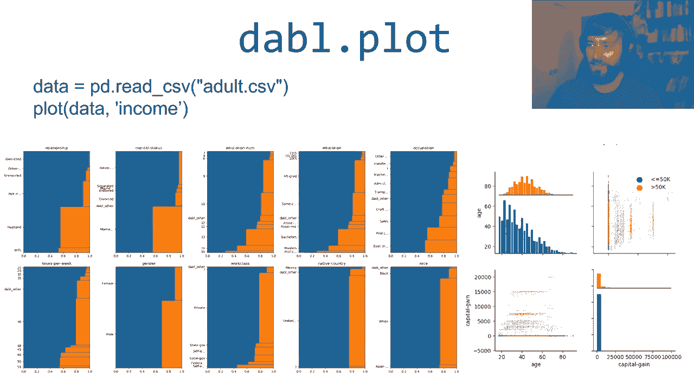
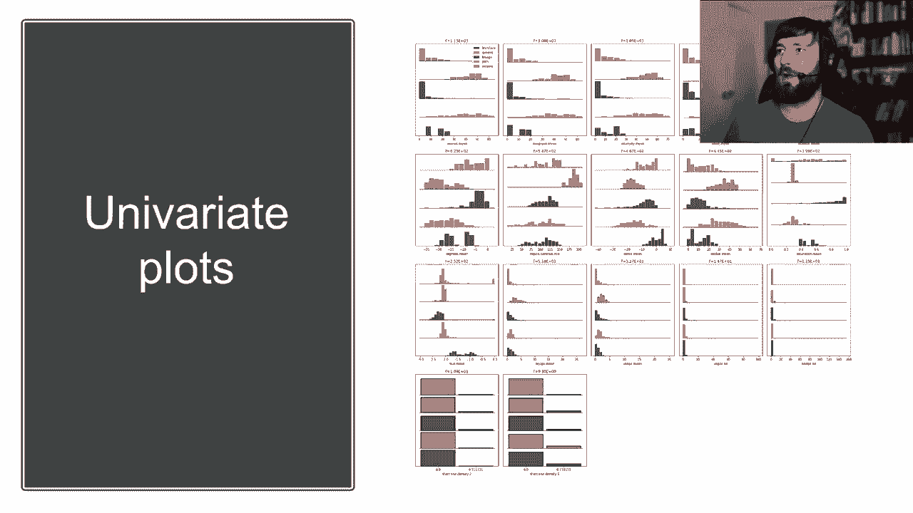
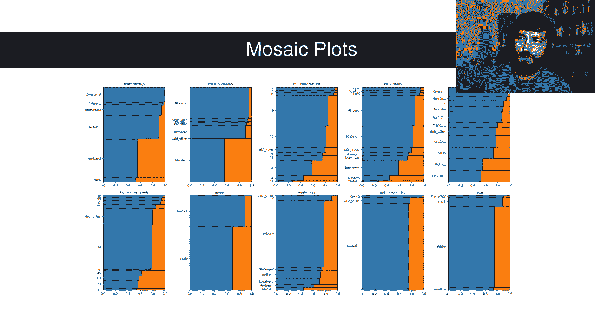
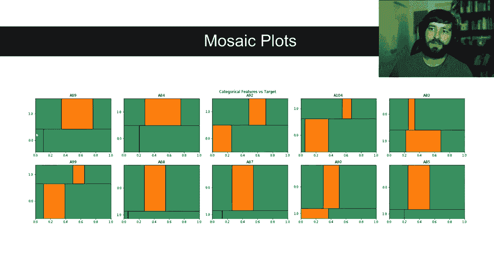
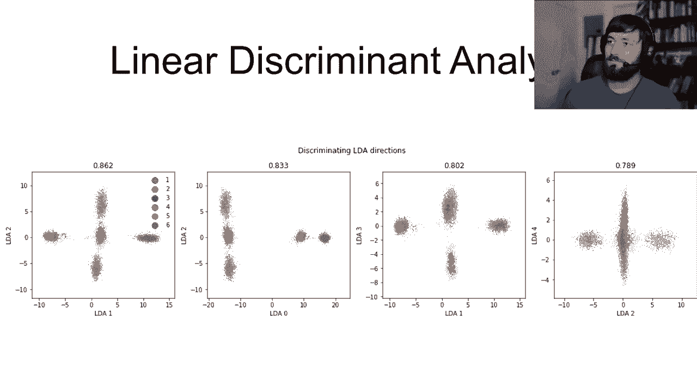
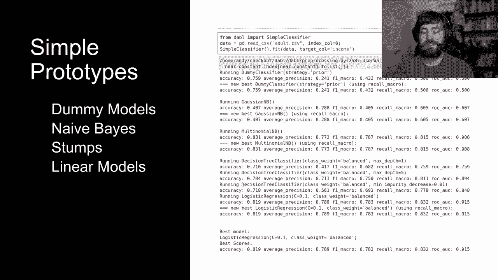
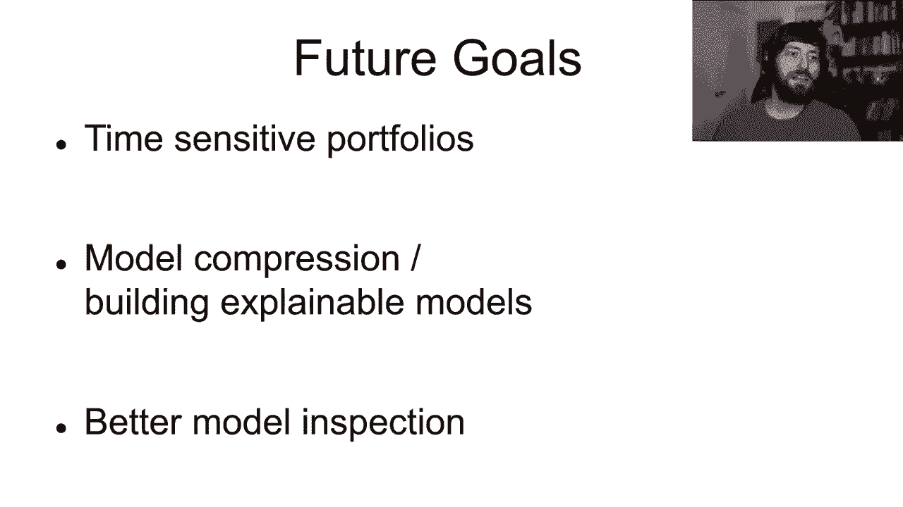

# P1：dabl- Automatic Machine Learning with a Human in the Loop ｜ Andreas Mueller - 爱可可-爱生活 - BV1Fv411q7k3

 Hi everybody and welcome to my talk on automatic machine learning with a human in a loop with。

 Dabbel。 My name is Andreas Miller。 I'm a cycle learner and I'm a principal engineer at Microsoft。

 So a lot of this work has been done while I was at Columbia University。

 I want to start with how I usually approach a machine learning problem。

 So machine learning usually starts with the task definition and it's quite an essential。

 part to see how you phrase your problem as a machine learning problem。 Once you've done that。

 you start with collecting your data， cleaning your data， doing some。

 exploratory analysis and visualization。 Then you start to remodel building。

 offline model evaluation and finally you do online。

 model evaluation or some evaluation within the logic of your scientific experiment or。

 within your business。 However， this is not really a linear workflow。

 This is more of a feedback loop where you go back to previous steps。 I drew this here， this cycle。

 but really it's more like a fully connected graph where after。

 each step you might decide that you want to go back to one of the previous steps。

 So say after data cleaning or visualization you might see there are data quality issues。

 and you might go back to change how you collected your data or after model building。

 You might figure out how the model couldn't deal with particular aspects of the data and。

 so it might need to clear it differently and so on。

 And what I see many data scientists do is to really focus on the model building part。

 and try out many different models and do a lot of high parameter tuning。

 And we have great tooling to do this and it's a lot of fun and so people are really focused。

 on this aspect。 But what I want to talk about in this talk is to think more about how to make the whole。

 process smoother because very often the gains come not from iterating more on just the model。

 building but iterating on the whole process and see how the model you build integrates。

 into your business product or your scientific process and how you can iterate very quickly。

 within this whole feedback loop and not just work on the model building or not just work。

 on visualization。 And so to do this what I really want is I want to make each of these steps fairly simple。

 and very easy to do so you can iterate quickly and go back easily to previous steps。

 So right now I find that a lot of these steps are not really easy enough。

 In particular for the data exploration visualization and the model building。

 So as you might know I'm a big fan of second learning。

 I've been working on it for a while and I think it's a great library。

 I also think pandas and seaborn are great libraries but I feel like if I want to do standard tasks。

 I still have to do too much work。 So here I'm loading standard benchmark data set。

 you know data set with pandas。 This is a classification data set and so much when I look at self to continuous variables。

 and do some plots and if I want to do this with seaborn。

 It takes me only a couple of lines but these couple of lines are actually quite involved。

 I need to select the right the types。 I need to do some melting and some reshaping and a hazard grid。

 So given that this is a super super standard plot this seems a little bit over the complex。

 to me and I really would like to put this to be sort of my Hello World of Data visualization。

 but just plot me this stuff for classification。 Simply on the same data set if I want to build a machine learning model with scikit learn。

 So a standard model I want to do might be logistic regression model and obviously I。

 want to tune the hyper parameters of the logistic regression model and so if I have some missing。

 values some category and continuous features the way the basically the most simple model。

 looks like with scikit learn for one to hyper-product tuning is this here。

 And again it's maybe not too bad so for me it's relatively easy to write this down though。

 I've also worked with scikit learn for a long time but I think it's just too much work to。

 just get something going。 And so if I have to write this much code and this much boilerplate just get a simple model。

 going I think that makes it very hard to iterate quickly。

 On the other hand you have some automatic machine learning frameworks out there and I really。

 like particular auto scikit learn which is done by a group in Freiburg which builds on scikit。

 learn。 And I think these are great tools but I think the focus of these tools is more to build。

 the very best model given quite a big compute budget。

 So in the documentation you can see on this digit data set which is a very simple data。

 set as built into scikit learn。 Here's a simple example for about an hour on this very small data set。

 And if you want to really squeeze out the last bit of performance on your data set I think。

 this is the right approach。 If you want to just get something going quickly you don't want to wait for an hour and if your。

 data set is bigger you'll probably wait for much longer than an hour but something like。

 an hour or several hours is a pretty realistic budget for most automatic machine learning， tools。

 And so really I want to iterate more quickly in this whole workflow。

 I don't just want to spend a lot of time on the model building process。

 And so maybe later on once I'm pretty confident about my data collection and my evaluation。

 and how everything fits together then maybe I want to use some more advanced automatic。

 amount and spend a lot of compute on really getting a good result。

 But this is not where I really want to spend the time in the beginning。

 And so trying to build easy to use solution for all these different pieces I came up with。

 this new library that I call Dabbel which stands for the analysis baseline library。

 So the goal here is to make it really easy to get a good robust prototype for a machine。

 learning problem so that you can easily and quickly iterate on cleaning the data in a。

 different way， collecting more data， evaluating models doing model interpretation and so on。

 And so basically I build some tooling and some different functions for each step in， the cycle。

 So the data collection is so up to you and I assume that you can load your data into。

 a pandas data frame。 So this is all assuming in memory。

 And so once you have your data frame you can call Dabbel。clean which does some basic。

 cleaning for machine learning。 There's Dabbel。plot which does some visualization and exploratory analysis for you。

 This Dabbel。any classifiers which does some automatic machine learning but tries to do。

 this very quickly and very efficiently。 And then there's Dabbel。

explain which tries to explain any model that was built。

 And I'll talk through all of these in a little bit more detail。

 And then what's maybe the most important part is seeing how does this model fit into your。

 actual use case and this is where you actually have to think again。

 And so this is often where I feel like data scientists don't spend enough time seeing。

 how does a particular model fit into our overall process because they get two hung up into the。

 model building at model evaluation。 Alright， so let's go through some of the tools that we have in Dabbel。

 So let's start with the data cleaning and pre-processing。 So there's basically two ways。

 You can use this in Dabbel。 There's a clean function that I'll show here on the Ames housing dataset which is like a。

 relatively standard but a little bit dirty。 The regression dataset has quite a few columns as you can see here 82 columns。

 They're like categorical continuous IDs and missing values and so on。

 So if you want to do some quick and dirty prototyping you can just do Dabbel。

clean which will create， a new data frame for you。 It will tell you how many columns are continuous and categorical。

 If there's 30 columns that have some strings in them or maybe some missing value that was。

 encoded as a weird string and if there's useless columns that are maybe nearly constant or。

 that look like IDs or like an index or something like this。

 And so then you get this cleanDF out and you can keep working with this data frame。

 So this detects time even though you can override some of the type detection because with missing。

 and rare values it figures out what is ordinal or categorical and which integers should be。

 continuous or not and it detects a couple of different useless columns。

 So there's also pre-processing class。 This pre-processing class basically provides a second learned transformer that automatically。

 puts together a column transformer and pipeline that does all the pre-processing。

 So this really cuts down on the boilerplate you have to do but it still gives you full。

 control over what kind of model you want to use。 So this allows you to very easily create a cycle learned pipeline without having to worry。

 about pre-processing。

 So next we have some tools for visualization and these are basically all exposed as a single。

 function double dot plot。 So here I'm using this adult data set again and so you just load the data frame and you。

 give the data frame to the spot function and you tell it what the target column is。

 Everything in double double either you can pass the data as X and Y where Y is a separate。

 and DRA or Panda series which is a second learned interface or if you have everything。

 as a single data frame you can give it the full data frame and the name of the target， column。

 So we can use either of these two interfaces for all of the functions in double。

 And so if you call this plot function it will just do plotting both for categorical and。

 continuous variables and see how many variables there are。

 There's some selections you can see here there's many categorical features which are shown。

 doing is mosaic plots and you can see that if there's very many categories for example。

 in this miracle status then some of them that are very infrequent get grouped together in。

 this double dot other and only the most common ones are shown。

 And so if you're familiar with mosaic plots basically the height of each of the bars tells。

 you how many values are in each of the category and then the width tells you the balance between。

 the categories。 So there's the two class classification data set showing a blue represents the people。

 that make less than $50，000 a year and orange represents people that make more than $50，000， a year。

 And you can see that not only what is the balance between the different categories but。

 also what is the proportion of these two classes within each category。

 And so there's also a couple of univariate plots in particular there's like these class， histograms。

 So if you have a multi class data set you can show all the universities histograms for a。

 particular feature for all the classes in a single my part of access so this allows you。

 to make much more compact plots。 This will also automatically cap at a certain number of plots and will sort them by their。

 statistical significance。 So already talked about this mosaic plot you can also do mosaic plots for multi class or。

 for more categories。 So here this is a data set for each of the variables is binary but we have three categories。

 and so you get these stack plots。 So there's three classes here blue。

 orange and green and you can see for example for this。

 variable a 89 that you can see that if the class is zero then you're certain it's not， orange。

 Sorry。 If this feature a 89 is zero and it's very likely to be green it's guaranteed to not be。

 orange whereas you have a small likelihood for it to be blue and if the feature has value。

 one you have about equal proportions among the three classes。

 You can also see here that the classes one and zero are readily equal likely the class。

 one is a little bit more like more common than the class zero。

 The double dot plot also shows pairwise plots if there's more than a certain number。

 of features it actually will not show all pairwise plots because that would be very overwhelming。

 instead it tries to figure out what are the most interesting pairwise plots and so this。

 is basically building on top of the idea of economics where you try to evaluate how interesting。

 is a plot and here the particular metric that we're using is that we look at these pairwise。

 scatter plots and we want to find out how well can a very shallow decision tree classifier。

 classify the data set based on just these two features and the idea is that if a decision。

 tree can classify as well this means there's like a good separation between the different。

 regions and say decision tree of depth four or five is a relatively good proxy to what。

 we can see with our eyes so this means like there's like big rectangles for each of these， classes。

 Here by default we show the four pairs that are most informative so the four pairs where。

 a decision tree applied just to these two features gives the best cross-validated accuracy and。

 we found this works pretty well across datasets。 We do the same for principal components so here you can see for example that looking。

 at principal component zero and principal component four gives the best overall or is。

 the most interesting according to our criterion because it allows the best separation in this。

 2D space and we also have the three plot which shows the explained variance of the different。

 components。 And lastly we also show linear analysis plot so this is actually this is a supervised dimensional。

 through reduction technique or you can also multi class classifier and in particular for。

 somewhat low dimensional data sets this is really quite useful because sometimes it finds。

 very interesting projections and so here each dimension similar to PCA is a linear combination。

 of the input features only these are found to describe in a way that discriminates the。

 best between classes。 So what you can see here in this dataset something that wouldn't be obvious in the original data。

 at all is that there's a linear space or is like two linear components that if I project。

 into these two then I can basically separate nearly all of the classes basically all of。

 the classes except for the purple and red are separated in this 2D space。

 And so this is actually a technique that is not used that commonly but I think it should。

 be used much more frequently。 You could also do more advanced manifold learning techniques I found that they don't often provide。

 very good results so they are not used by default。

 Also they might have longer run times。 So next usually want to do some simple prototyping and there's basically list of models that。

 usually are pretty instantaneous that are hard coded to double and basically they were。

 always tried and implemented in a simple classifier。

 And the idea is that here they're basically instantaneous and there's no point in not running， them。

 And these are the dummy models they base decision sums and some linear models。

 And these are basically always run and cross validation formats as shown and here's a done。

 data set and wireless is working。 It gives you always the best results。

 So the dummy model is just a model that basically predicts the most common class and this is。

 useful as a benchmark or as a baseline。 So you can see what the average precision or the accuracy would be if you do constant。

 predictions。 And then so gosh I need to base it's a very quick classifier。

 And so basically they're ranked by how long they take and so the first couple ones are。

 basically instantaneous and then logistic regression might take a little bit of time。

 but not too much。 But after running this you will already have a reasonable baseline and you could then go。

 to model interpretation for example。 If you want to have more complex models there's automatic model search as I mentioned earlier。

 And so what this does is search over more linear models， random forest grain， boosting。

 and some cardinal methods。 So this is sort of the slightly more complex models。

 There's currently no neural networks in there。 We'll sleep because I don't want to have a dependency on a deep learning library though。

 I might change my mind on that in the future。 So the way it selects these more complex model is by using successive half thing which is。

 basically a more efficient way to do grid search。 So the idea is because the first thing is to start with a small subset of your trained。

 data set and evaluate all of the candidate models。

 So let's say all the points in your grid and then throw away the worst half and keep， the best half。

 And then the better half you double the budget， you double the training set size and again。

 you throw away the worst half and you retain the rest and then you double your training。

 set size again and you run again。 And so you only keep the configurations or the grid points that perform that are in a。

 better half for each of the training set sizes and at each step you increase or double the。

 training set size until you use the full data set。

 And so it can be shown that this actually is a very efficient way to type a problem。

 to this is known as multiple reality search。 There's a particular variant called hyperbund it's very popular but actually the success。

 of half thing which is a simple variant often works out quite well。

 And so we are using this instead of doing a randomized search or grid search or something。

 like this。 And then what we're doing is not actually doing a grid search but we work on a fixed portfolio。

 So we built a list of models that work well and this list of models is not hard coded it's。

 learned from a set of benchmark data sets。 We're using the open MLCC 18 which is a list of I think 82 data sets there are classification。

 data sets they were curated as benchmarks for classification。

 And so for each of them of these benchmark data sets we run right hyper parameter optimization。

 and then we get a list of good kind of models and then basically we create a portfolio by。

 doing a grid research procedure among these。 So it's not entirely greedy so we're not taking say the K best performing models but we're。

 using the models that if you select the best one among these Ks these K models you get。

 the best performance。 So this is basically trying to find a portfolio that is both diverse and performs well。

 And you can see more details on this in the paper practical and machine learning pretty。

 optimal challenge by Fiverr et al。 Here's some plots not from their paper but from a paper I worked on with some colleagues。

 on multiple defaults which goes actually a little bit more detail on how to build these， portfolios。

 In that paper we did this for separate classifiers and scikit learn for last Ignatization。

 Tree Grain Boosting and so on。 And for each of these we built a portfolio with a number of evolutions aside of portfolios。

 so we did 1， 2， 5， 4， 8， 16， 32 and we compare that against doing model based patient optimization。

 or randomized search and if you look at very few candidates using this portfolio it works。

 much much better than doing random search which is sort of expected but also shows us。

 we can get pretty good results even using a very small number of candidates。

 So this paper we didn't do this successive half thing we just evaluated all of them in。

 Dabbel I also do this successive half thing on top of having this portfolio。

 And finally Dabbel was from one explanation and so once you build your model so this portfolio。

 is implemented in any classifier so there's two models there is the simple classifier and。

 the any classifier the simple classifiers all the instantaneous ones the any classifier。

 is basically doing this successive half thing on the portfolio then you can call explain。

 and explain will first give you metrics so this is all the standard metrics you might。

 expect so this is shown here the classification report from cycle line which gives you precision。

 recall F1 score and the all the averages the confusion matrix and then rock curves and。

 precision recall curves so this is basically all the things that you usually want to see。

 and then it also gives you model explanations so if it's a linear model to choose your coefficients。

 or the most important coefficients for tree based model it gives you the impurity based。

 feature importance and then also permutation based feature importance so permutation based。

 feature importance is often more robust because you compute under test set where is the impurity。

 based before the impurity based importance is computed under training set and then finally。

 it also gives you partial dependence plots so future goals for library are to create more。

 time sensitive and faster portfolios potentially also to allow giving a time budget and to do。

 model compression and building more explainable models on top of the more complex models and。

 to improve the model inspection so right now the model inspection is like a little bit bare。

 bones but it's getting there so if you want to try this you can just do pip install dabble。

 and check out the website and for documentation and tutorials and if you try it out if you。

 have any issues please contact me I'm really happy to get any feedback and so you can find。

 me on various social media hours send me an email or go to the double issue tracker all。

 right thank you so much for your attention， [BLANK_AUDIO]。

