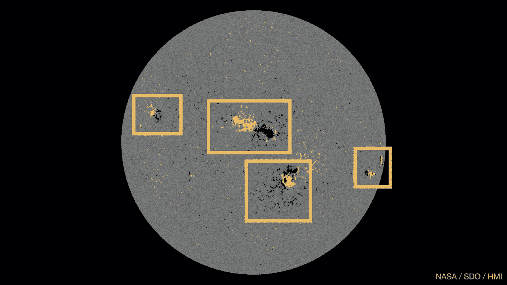
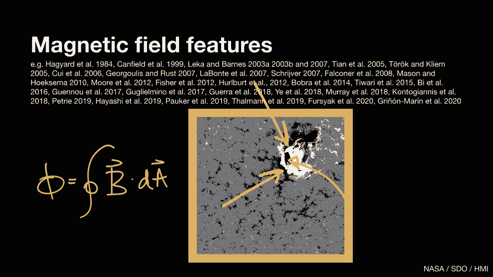
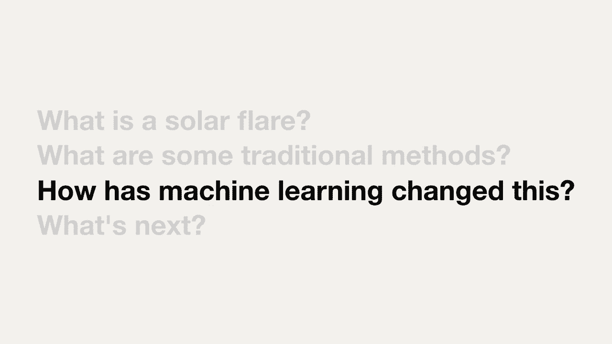
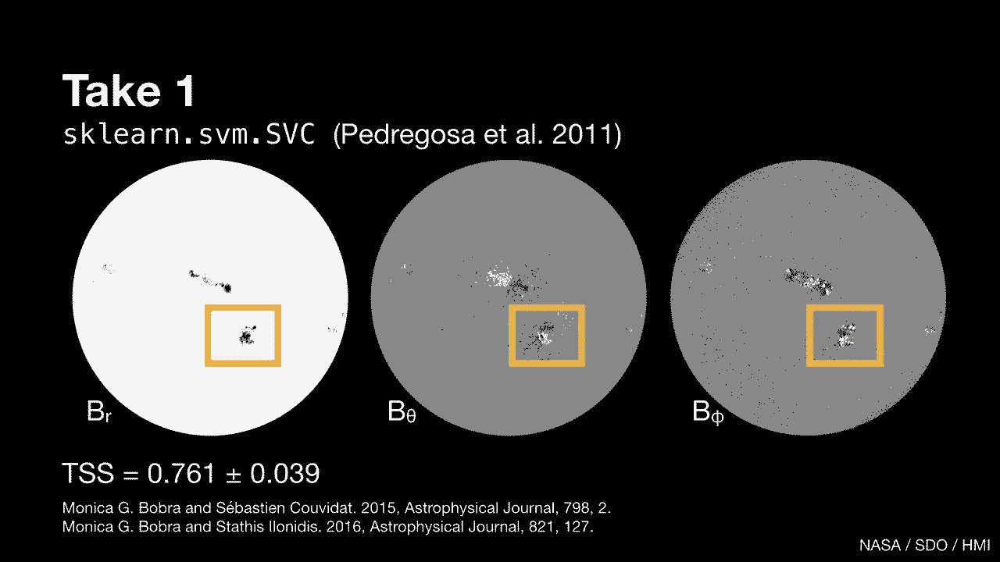

# P2：Forecasting Solar Flares ｜ Monica Bobra - 爱可可-爱生活 - BV1Fv411q7k3

 Hello， I'm Monica Bobra。 I'm a research scientist at Stanford University。

 and I study the Sun as a member of the NASA， Solar Dynamics Observatory science team。

 I'm here today to talk about predicting solar flares using machine learning techniques。

 So this talk will cover four sections。 What is a solar flare？ In this section。

 I'll go over three basic properties of a solar flare。

 What are some traditional methods people use to predict solar flares？

 How has machine learning changed this landscape？ And what's next for the field？ So first。

 what is a solar flare？

 This is a movie of the largest flare in the last 15 years on September 6， 2017。

 These images are taken by a NASA satellite called the Solar Dynamics Observatory， which。

 takes ultra HD images like this every few seconds， constantly。 The satellite launched in 2010。

 so we've accumulated a couple petabytes of data in the， last decade。 These are UV images。

 so they're in false color， and they're capturing plasma at temperatures， of about a million degrees。

 You can see a bunch of bright regions all over the solar disk， and the region on the。

 bottom right unleashes a solar flare or a burst of particles in radiation in a matter， of minutes。

 So the first thing to know is that the Sun is flaring all the time。 Small flares are common。

 Large ones like these are rare。 And the second thing to know is that flares occur in active regions。

 or regions of strong， complex magnetic fields that evolve rapidly over time。

 This is an image of the magnetic field at the solar surface or photosphere a couple days。

 before the September 2017 flare。 The white bits show magnetic field coming out of the page。

 The black bits show magnetic field going into the page， and the gray indicates zero magnetic， field。

 And the third thing to know is that flares release energy like earthquakes， building。

 stress slowly and releasing it rapidly。 This plot shows the integrated X-ray emission from the Sun。

 The X axis shows time， the Y axis shows flux in units of watts per meter squared on a log， scale。

 and the two different colors are two different wavelength bands。

 You can see that the Sun is constantly outputting a baseline level of X-ray emission。

 And then on September 6， increases this output by two orders of magnitude。 This is the flare。

 Now that we know about these three basic attributes of solar flares， what are some traditional。

 methods people use to predict solar flares？

 So we can think about predicting solar flares like we think about predicting terrestrial weather。

 Just like we use cloud patterns on Earth to forecast whether it'll rain today or tomorrow。

 we can use magnetic field patterns on the Sun to see if there'll be a flare today or tomorrow。

 So let's look at an example of how people identify magnetic field patterns or features。

 in solar image data。 And to do that， let's go back to our image of the magnetic field at the solar surface。

 and look at only one active region。 Now in looking at this region。

 we notice some borders between the white and black portion。

 of the image here and in the circular region here。

 This is where the magnetic field lines are in almost opposite orientations， with magnetic。

 field lines going out of the page， right next to when's going into the page。

 And flares often originate from these regions。 So one thing we can do is isolate the pixels on or very close to these border regions and。

 sum up their values。 So now we've calculated the magnetic field through a specific area or the magnetic flux。

 for this particular active region at this particular time。 And that's one feature。

 And there are a lot of great studies that describe many different features of an active。

 region。 Okay。 So those are the features。 Now， how do people traditionally use these features to predict solar flares？

 And traditionally， most studies used only one or two features together with simple statistical。

 techniques。 And there are some exceptions， but this is what a lot of the literature looks like。

 So enter machine learning。 How has machine learning changed the landscape？

 Machine learning gives us the ability to combine tons of features together in a meaningful and。

 optimal way。 Now instead of using one or two features， we can use tens or hundreds of features。

 And machine learning also allows us to take advantage of extremely large data sets like。

 the one generated by the solar dynamics observatory。

 So I'll take you through four projects I've worked on with many colleagues to predict solar。

 flares using machine learning。

 I'll start with take one， our first and simplest approach。

 For this study， we took images of the solar magnetic field， looked at only the active。

 regions and calculated 25 features like the magnetic flux or how much energy is stored。

 in the magnetic field。 And we did this for every single active region at every single point in time。

 We ended up with 38 million features describing 2，100 active regions。

 And we posed this as a binary classification problem。

 Is this active region going to produce a large flare？ Yes or no？ So for our learning algorithm。

 we used the SVM classifier in Scikit Learn。 And we ended up with some pretty decent results。

 So there are many ways to measure the performance of a model。 Our accuracy was 。92。

 which seems good。 But for rare event prediction， a high accuracy can be misleading because you can get a very。

 high accuracy just by predicting no all the time。 So we also calculated a skill score called the TSS that quantifies how much better you。

 do than predicting no all the time。 And this particular skill score ranges from -1 to 1。

 where -1 is the worst possible prediction， so getting it wrong all the time。

 +1 means getting it right all the time， and 0 is the， same as guessing randomly。

 So our TSS for this study was 。76。 And scientifically。

 we learned that active regions with a really twisted， curled up magnetic。

 field are most likely to flare。 So that's take one。 For take two， we thought， okay。

 we're collapsing all these image data down to one number， and。

 we're only looking at the surface of the sun。 So why don't we look at the image data directly？

 And why don't we also look at the sun's atmosphere， not just the surface？ So this time。

 we used a convolutional kernel network on 3。6 million images of the solar。

 surface and various layers of the solar atmosphere。 And we ended up with a skill score of 。81。

 But this skill score is within the error of the previous one， so it's unclear if this。

 approach was of real improvement。 And this really got us thinking because if we're using all these extra data and we didn't。

 get a massively better result， what's going on？ Well， first。

 our images of the solar surface map a vector field， not a scalar field like， intensity。

 And our images of the solar atmosphere span five orders of magnitude in dynamic range。

 So these are really different from the typical everyday images we take on our phone。

 And maybe the CKN isn't properly tailored for these data。 Additionally。

 we didn't consider previous predictions when making a subsequent prediction。

 So maybe we could add an autoregressive component to our model。 And finally。

 we looked at all these active regions independently。

 But maybe all the active regions on the disk at any given time are influencing one another。

 And this concept is not new， it's called sympathetic flaring， where a flare in one active region。

 triggers a flare in another。 So maybe we could look at that。 So for take three。

 which we're working on right now， we started looking at sympathetic， flaring。

 And this is how we're posing our problem。 Suppose we calculate a particular feature of an active region。

 like the magnetic flux， we discussed before。 And suppose we track that feature over time。

 So now we have a time series。 But since we have a lot of features， we have a lot of time series。

 And all these time series describe just one active region。

 But suppose we also look at the time series for all the other active regions on the sun。

 at the same time。 Are we going to do a better job of predicting flares when we use time series data from all。

 these active regions together？ Or are we going to do a better job of predicting flares when we look at each active region individually？

 And to do this analysis， we're using vector autoregressive models from stats models。

 Our preliminary results show that flares in one active region do trigger flares in another。

 And right now we're working on assessing how big that effect really is。

 And finally， take four。 This is a big project that's looking at the entire sun earth system。

 So in the last three approaches， we've been looking only at the sun。 But the sun is an active star。

 It's constantly spewing plasma into space at speeds of about 500 kilometers per second。

 which we call the solar wind。 And the solar wind interacts with all of the planets。

 including the earth。 And it carves out a magnetic bubble that the solar system lives in called the heliosphere。

 And there are a lot of space-based missions taking data at various points throughout the。

 heliosphere。 So we have image data of the sun， but we also have a ton of direct measurements。

 sampling， the solar wind， sampling the earth's magnetic field， and sampling the earth's atmosphere。

 And in addition to all these observations， we also have numerical models that predict。

 from first principles from magnetohydro dynamic equations， how the solar wind propagates from。

 the sun to the earth。 So I'm part of a large 50% team spearheaded by the University of Michigan called Solstice。

 And the Solstice project aims to use machine learning to predict how eruptive events on。

 the sun will ultimately affect the earth。 And this is a pretty hard problem。

 One of the hardest parts of this problem is figuring out how the solar wind couples to。

 the earth's magnetic field， especially right here on the sunward side of the earth's magnetic。

 field and also near the earth's magnetic poles。 And this project just got started a couple months ago。

 So what did we learn from all this？ When looking at these four approaches and so many other excellent studies using machine。

 learning for flare prediction， we've learned a couple things。 First。

 we've learned that machine learning algorithms provide a huge advantage over traditional， methods。

 And open source scientific software made an incredibly positive impact on the field of。

 solar flare prediction。 Second， we've learned that increasing the complexity of a machine learning model doesn't necessarily。

 increase predictive capacity。 The biggest increase in predictive capacity comes from using more and more physically。

 meaningful and information-rich input data， which is not the same as more data period。

 So the more front-end work you put into identifying physically meaningful and information-rich。

 features， the more it'll pay off in predictive capacity。 So what's next for the field？

 For this section， I identified three problems that I think， if we solve。

 could lead to breakthroughs， in the field。 The first is solving the class imbalance problem。

 which is a big problem in a lot of， scientific fields。

 We always have more examples of nothing happening versus something happening。

 Whether it's flares or earthquakes or supernovae， we always have this class imbalance。

 And this is a really hard problem to solve with no clear solution right now。

 One potential solution is to create realistic synthetic observations of events using tools。

 like generative adversarial networks。 Another problem is transfer learning。

 We're all using different data sets， and we learn different things from each data set。

 So someone could use historical data from a satellite that was operational in the early。

 2000s to predict flares。 And I could use data from the Solar Dynamics Observatory to predict flares。

 But how can we capture and transfer the learning we gain from training on one data set to another。

 relevant problem？ Transfer learning is another big area of research。

 One solution I've seen in heliophysics is creating large， intercalibrated， unified data， sets。

 The final problem is the interpretability problem。

 Practical successes in machine learning have not always gone hand in hand with successes。

 in interpretability。 And interpretability is really important for scientific studies because it's not enough。

 to say， "Hey， I can predict a flare。"， The real scientific question is。

 "What physics have we learned here？"， So the interpretability element is the real scientific result。

 And I think one way forward will be to use model agnostic interpretability tools。

 So I think we as a scientific community can make significant progress by working on these。

 three problems。 And that's it。 In the spirit of SciPy。

 if you're interested in playing with some code， feel free to check。

 out a book that I wrote with my colleague， James Mason， called Machine Learning Statistics。

 and Data Mining for Heliophysics， using the Jupiter book infrastructure。

 This book shows you how to use open source packages for machine learning， statistics。

 and data mining together with various kinds of open access heliophysics data sets to reproduce。

 scientific results published in referee journals。 And if you're interested in chatting about this book or flare prediction or generally。

 about using machine learning with scientific data， please feel free to send me an email。 Thank you。

 [BLANK_AUDIO]。

