# P9：Pandera- Statistical Data Validation of Pandas Dataframes ｜ Niels Bantilan - 爱可可-爱生活 - BV1Fv411q7k3

 Hi everyone。 I'm Neil's Ben Teland， and I'm very excited to have the chance to talk to you at the。

 Sci-Fi conference this year。 I'm a machine learning engineer at talkspace， which is a mental health。

 platform that connects people with therapists。 My work centers around using NLP and clinical。

 applications， but today I want to talk to you about statistical data validation of Panda's data。

 frames。 For those of you who are not so familiar with Panda's or data frames。

 a data frame is basically， a table that you can manipulate programmatically。

 and Panda's is one of the de facto tools for the， manipulation and analysis of tabular data in Python。

 Sometimes you may want to explicitly validate， the contents and properties of a data frame because you care about data quality。

 and data validation， is simply the act of falsifying data against explicit assumptions for some downstream purpose。

 Consider the statement all swans are white。 To verify the statement， we'd have to go out and find。

 all the swans and then find that all of them are white， which would be virtually impossible。

 Another approach we can take is to find the first instance of a black swan to falsify the statement。

 Why do you need data validation？ Practically speaking。

 I find it difficult to reason about and debug， data processing pipelines。

 especially when they get really complex。 And I know it's good practice， to ensure data quality。

 especially when the end product informs business decisions， support scientific findings。

 or generates predictions in a production setting。 And finally， as I like to say。

 everyone has a personal relationship with their data frames。

 so you might know it intimately at the time， but future you or other maintainers of the code base。

 won't be able to understand the workings of your data processing pipeline in a few months。

 So to illustrate these points， I'd like to tell you a little story involving you。 One day。

 you encounter an error log trail and decide to follow it。 The error is a type error。

 involving a multiplication operation。 And you find yourself at the top of a function called process。

 data。 You look around and see some hints of what happened， namely that the function is trying to。

 compute weekly income from hours worked and wage per hour。 You sort of know what's going on。

 but you want to take a closer look。 So you insert a breakpoint。

 You find some funny business going on， namely that you first notice a negative value。

 which is a problem in itself， but， you know that this can't be the cause of the type error。

 You look a little more closely at the， type of the hours work column and notice a string in one of the elements。

 This is an easy bug to fix， so you squash the bug and add documentation for the next。

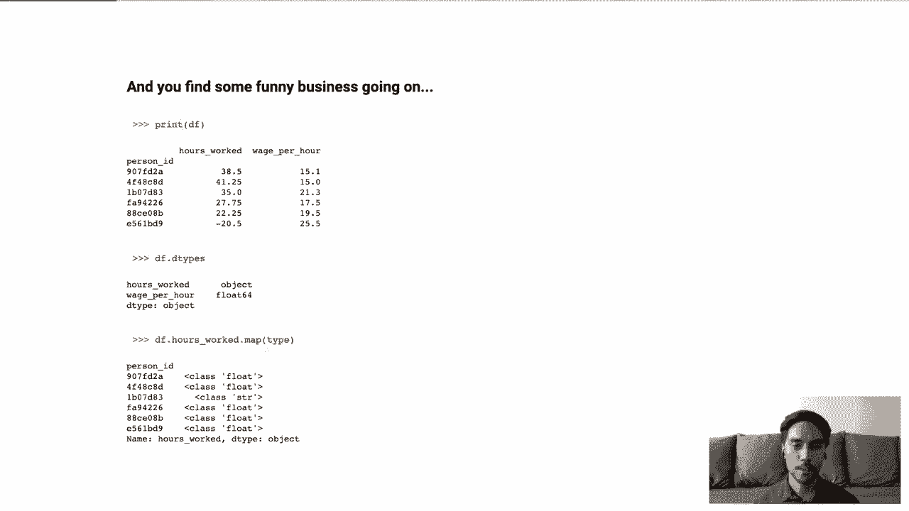

 weary traveler who happens upon this code， making sure that the columns are the expected type。

 and the hours work values must be positive， converting negative values into nans。 Doing this。

 you merge your commit and all as well with the world。 A few months later。

 you find yourself at a familiar function， but it looks a little different from， when you left it。

 The type coercion logic is gone， and you see these function decorators in the。

 process data function。 You look above and see what in schema and out schema are all about。

 finding a note that a fellow traveler is left for you。 This way， it's immediately clear。

 what you should what should be in the data frame variable coming in and out of process data。

 The moral of the story is the better you can reason about the contents of a data frame。

 the faster you can debug， the faster you can debug， the sooner you can focus on the tasks that you。

 care about。 In the rest of this talk， I'd like to take you a little more deeply into。

 what data validation means in theory and practice， briefly introduce Pendera。

 and then take you through， a case study that uses the library on a real world dataset。

 I'll then wrap up with a little bit of a， preview of experimental features available today and some of the items in the roadmap for future。

 development。 According to the European statistical system， data validation is an activity in which。

 it is verified whether or not a combination of values is a member of a set of acceptable value。

 combinations。 More formally， we can relate this definition to the notion of falsifiability that。

 I mentioned earlier。 Data validation is the act of defining a validation function， V。

 that takes some data X as input and outputs either true or false。 As Vander Luu at all point out。

 V needs to be a surjective function， which is just a fancy way of saying that there must exist at。

 least one value of X that maps onto true and at least another value of X that maps onto false。

 To see why， consider the following two cases。 In case one， V always returns true， making the。

 function unfalsifiable。 This is effectively like not having any validation function at all。

 or having a function that always just returns true。 In case two， V always returns false。

 which is like saying， my data frame has an infinite number of rows and columns。

 There's no practical， implementation of such a function， making it unverifiable。

 You really need the surjectivity property， in order to meaningfully distinguish between valid and invalid data。

 So within the space of， meaningful validation functions。

 one way to think about validation rules is in terms of technical， checks。

 which have to do with properties of the data structure。 For example， income is a numerical。

 variable and domain specific checks， which have to do with properties specific to the topic under。

 study。 For example， the age variable must be in the range zero between the range zero and 120。

 Another way of thinking about validation rules is in statistical terms。

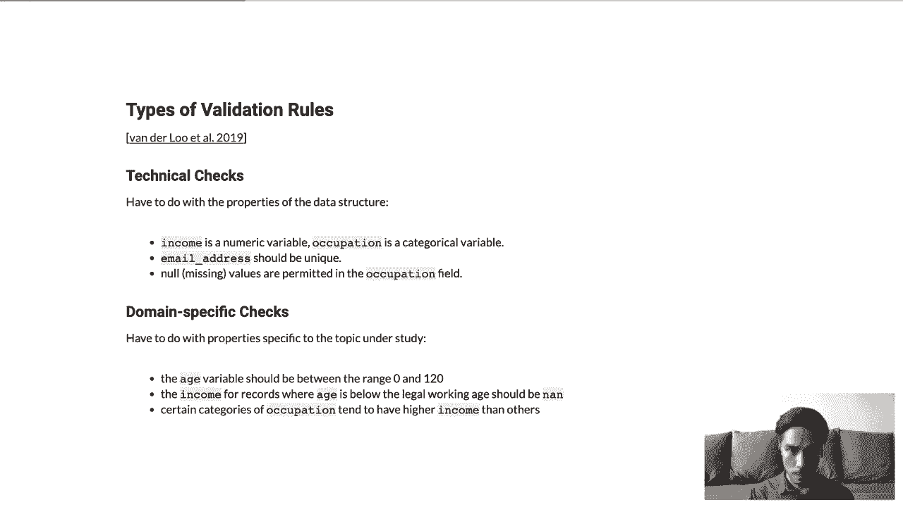

 On one hand， you might define deterministic checks， which express hard-coded logical rules。

 And on the other you might want to define probabilistic checks， which explicitly incorporate。

 randomness and distributional variability。 In these examples， you can see that they're。

 we're roughly saying the same thing about the mean age being between 30 and 40 years。

 But the probabilistic check incorporates information about the sample size and variability of the。

 sample distribution to assert that the confidence bounds of the distribution are between 30 and 40。

 This leads us to consider the concept of statistical type safety， which would be like。

 logical type safety， but applied to the distributional properties of data to ensure that statistical。

 operations on those data are valid。 For example， checking whether training samples are IID。

 checking whether features are not multicolinear or that the value variance of a particular。

 feature is greater than some threshold， or even the age-old machine learning assumption that。

 the training and test set labels are drawn from the same distribution。 And more broadly。

 the training and test set data are drawn from the same distribution。 Practically speaking。

 the data validation workflow may seem familiar。 You start with a。

 goal in your head as to what you want the data to look like。 You write some code and you check。

 if it's good enough for the purposes of your analysis。 If it is， you get on with it， but if it。

 isn't， you're interested in repeat the process。 Having experienced this loop many times and writing。

 my own ad hoc validation code， this is the user story I started out with。 As a machine learning。

 engineer， who uses pandas every day， I want a data validation tool that's intuitive， flexible。

 customizable， and easy to integrate into my ETL pipelines so that I can spend less time。

 worrying about the correctness of a data frames contents and more time training models。

 What I ended up with is a design by contract data validation library that exposes an intuitive。

 API for expressing data frame schemas。 From the very start， I took the cue from existing data。

 validation libraries in Python and formulated the schema function S to behave like this。

 It takes a validation function and data as input and outputs the data itself。

 if validation evaluates to true， but raises an exception otherwise。 The main reason for this。

 is compositionality。 If we have some data processing function F。

 we can compose it with our schema in， various ways。

 We can validate the raw data before it's processed by F or validate the output of F。

 or even my favorite make a data validation sandwich。 Pictorially， this shows how you'd use。

 the pandaria schema to interleave data validation logic with data processing logic。

 But to give you a hands-on sense of how you might integrate this tool into your workflow。

 I want to take you through an analysis of the fatal encounters dataset。

 I've personally been following this amazing work for the past couple of years， headed by D。

 Brian Burkhardt and other collaborators to compile the most comprehensive national。

 database of people killed during interactions with law enforcement。 In light of recent events。

 I wanted to take this opportunity to point people to this dataset because， unsurprisingly。

 it's hard to find official records of such encounters online。

 To give you an overview of this dataset， there are over 26，000 records of law enforcement。

 encounters that lead to deaths dating back to the year 2000， where each record contains。

 data like the demographics of the decedent， the cause and location of death， a description of。

 the encounter， and the court disposition of the case。

 So the question I want to ask in this analysis is。

 what factors are most predictive of the court ruling a case is accidental？

 To give you a sense of some of the circumstances that led to these accidental deaths。

 here are a few， examples。 Undocumented immigrant Roberto Chavez Rosendes was fatally shot while Rivera was。

 arresting him along with his brother and brother-in-law for allegedly being in the United States without。

 proper documentation。 The shooting was possibly the result of what is called a sympathetic grip。

 where one hand reacts to the force being used by the other。 Chief Criminal Deputy County Attorney。

 Rick Uncle's Bay wrote in a letter outlining his review of the shooting。

 "The Border Patrol Officer had his pistol on his hand as he took the suspects into custody。

 He claimed the gun fired accidentally。"， Here's another one。 Andrew Lamar Washington died after。

 Andrew Lamar Washington died after officers， tasered him 17 times within three minutes。 And finally。

 Biddle and his brother were fleeing from， a Nashville Police Department officer at a high rate of speed when a second Nashville Police。

 Department officer James L。 Steely crashed into him head-on。

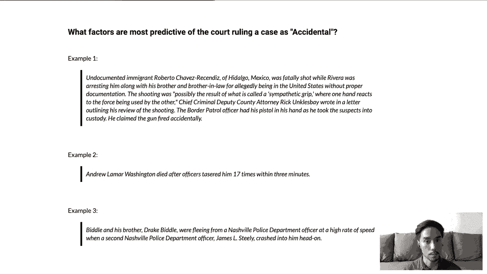

 "Why did I let the emotional impact of these examples sink in？" Here are some caveats。

 "I do want to emphasize that， as mentioned on the website， the records in this dataset。

 are the most comprehensive today。 But by no means is it a finished project。

 so biases may be lurking， everywhere。" Secondly， I don't have any domain expertise in criminal justice。

 so just as a heads up。 And the main purpose here is to showcase the capabilities of Penderra and not necessarily。

 to show any sort of actionable insights。 And finally， now that I'm built this tool。

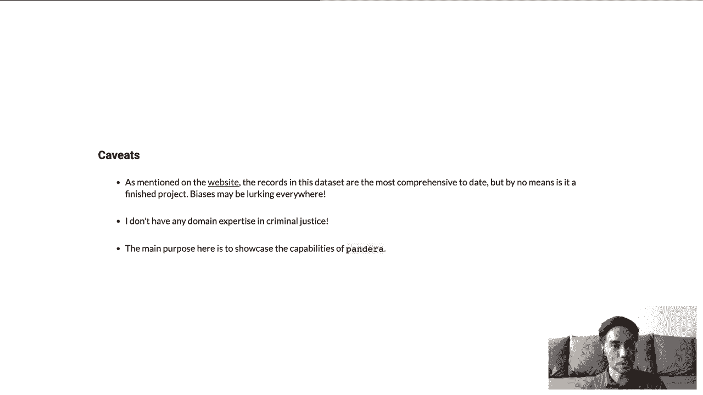

 I just want to validate all the things。 Before I dive in。

 if anyone's curious to take a look at this presentation and this analysis。

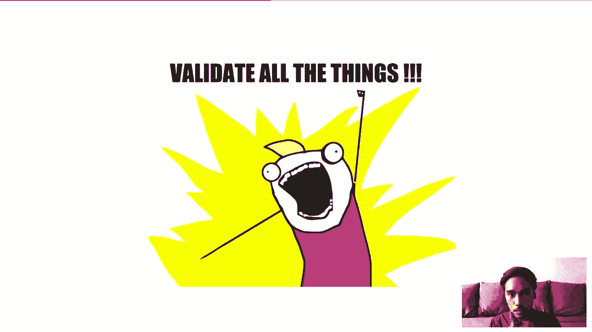

 I've set up some binder notebooks that you can visit via these bitly links。

 to run and play around with the code as you see fit。

 The first step in any analysis is to read the data in。

 You can inspect the first couple of rows to get a first impression of what's in there。

 Before proceeding further， we should probably clean up column names to make our analysis more。

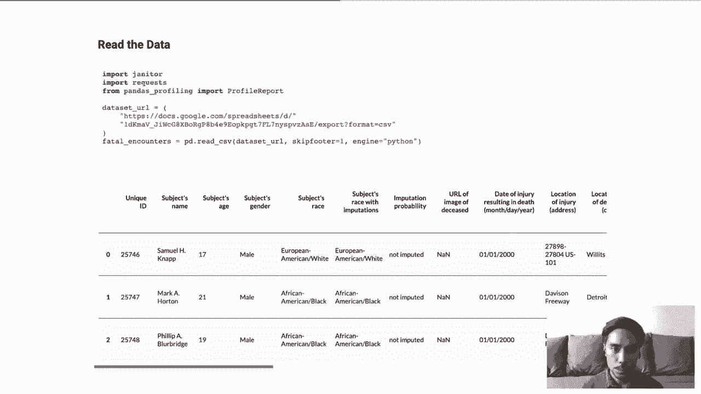

 readable。 And this is where it might be a good idea to define a minimal schema definition。

 All we're saying here is these are the columns that we're interested in modeling。 Note that the。

 disposition's exclusions column， which we're going to use to derive our target variable。

 shouldn't be nullable。 We can then use a schema in our clean columns function by just piping it。

 at the end of the method chain。 If for whatever reason a column specified in our schema isn't there。

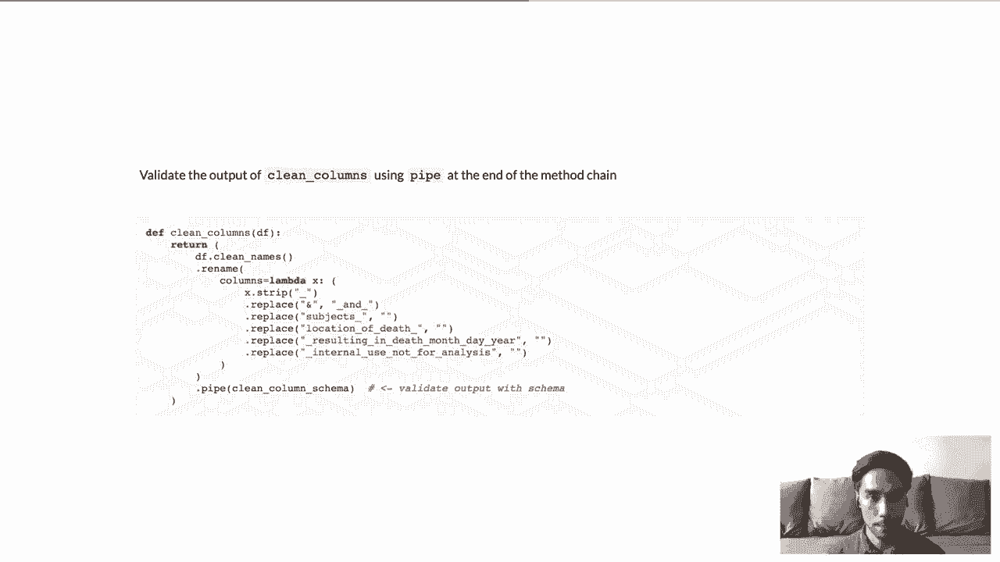

 and there will raise a schema error complaining about it。

 Now that we've cleaned up the column names， let's use Panda's profiling。

 which is an excellent package。

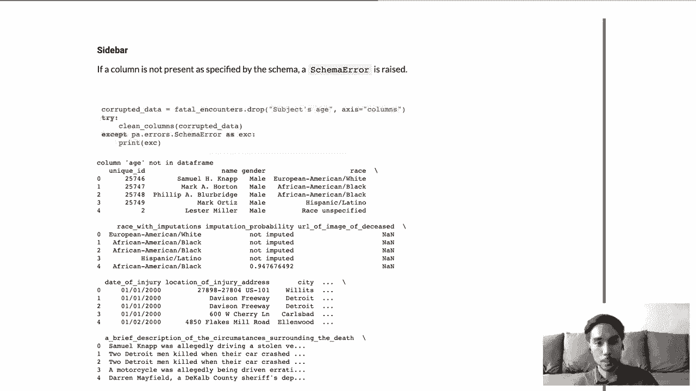

 for sort of initial prototype data exploration to get a better sense of the distributions in this。

 data set。 Just to give you a sense of what's in the disposition's exclusions column。

 these are the categories related to the court decisions for each record。 You can see that。

 most records are unreported or unknown。 After doing some data exploration， which I've done before。

 this presentation， you might arrive at a richer schema for the training data， including assumptions。

 about the age range， acceptable values in the gender， race， and cause of death columns。

 and the types of each variable， which we want to ensure using the coerced keyword argument。

 Because we want to build a model predicting whether a case was ruled as accidental。

 we'll need to derive this from the disposition's exclusions column。 Also。

 as a nifty feature of Panda error， we can serialize the schema as a yaml file。

 so we can inspect the schema in more detail。 Next， we want to clean and normalize the data values。

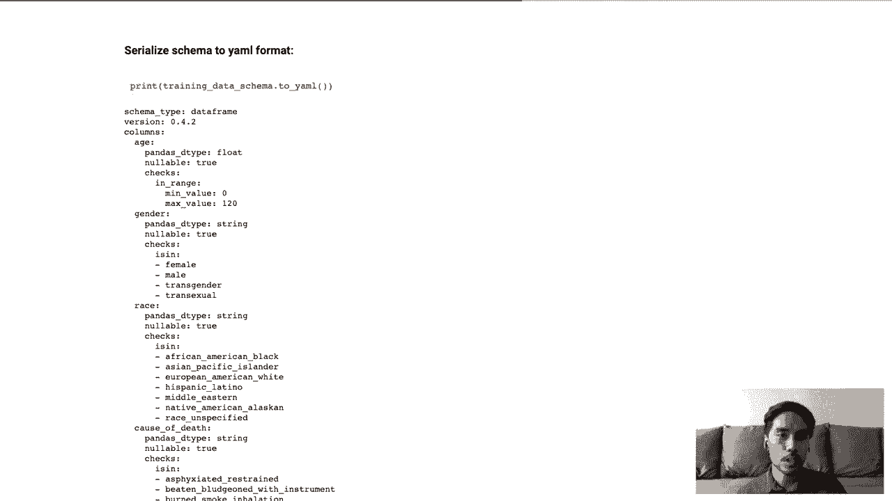

 before modeling it。 This involves cleaning strings， minorizing certain variables。

 and most importantly， deriving our target column， this position accidental。

 Another thing to note here is that we're， we're removing any records that are unreported， unknown。

 pending， or that we're ruled suicide。 And the reason for this last criterion is to model cases where law enforcement was more directly linked。

 to the death event。 To ensure that our clean data function does what it's supposed to do。

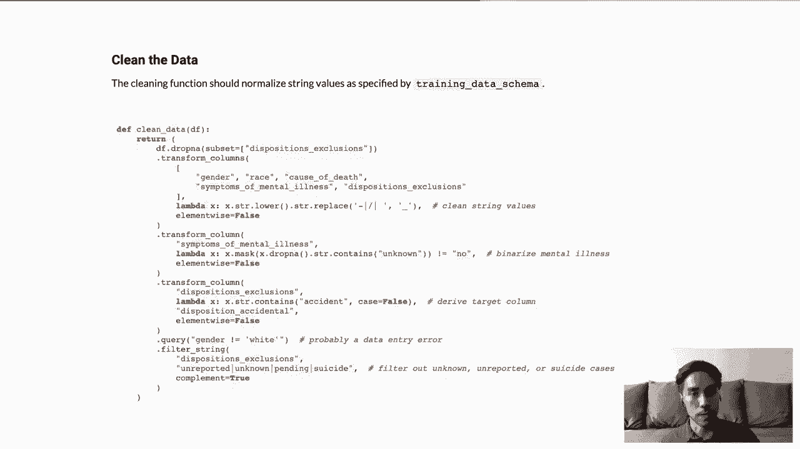

 we can make a data validation sandwich by using the check input and check output decorators。

 And if we try to apply the clean data function as it is on the raw data， we can see an error。

 which is actually an error that I came across while making this presentation and doing the analysis。

 So the message actually can be a little bit clearer。 There is actually an issue。

 currently open for this。 But I can tell you right now that it's because the age column is a string。

 and not a numeric variable。 And there are some values in there that can't be immediately converted。

 into a float。 So let's define a normalized age function that converts the values in this column。

 to a float representing age in years。 And I've abstracted away a few of the details for your。

 convenience。 Basically， it just does what it's supposed to because I've tested it。

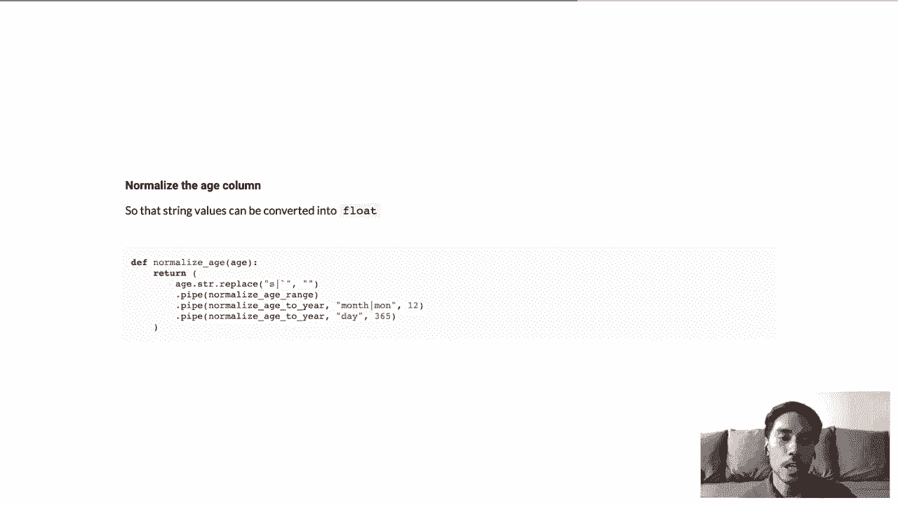

 And we can insert the normalized age function somewhere in the middle of our clean data function。

 By the way， I'm using PyJANitor here， which I think was presented last year at SciPy。

 And so with that change， we've successfully fulfilled the contract defined in the training。

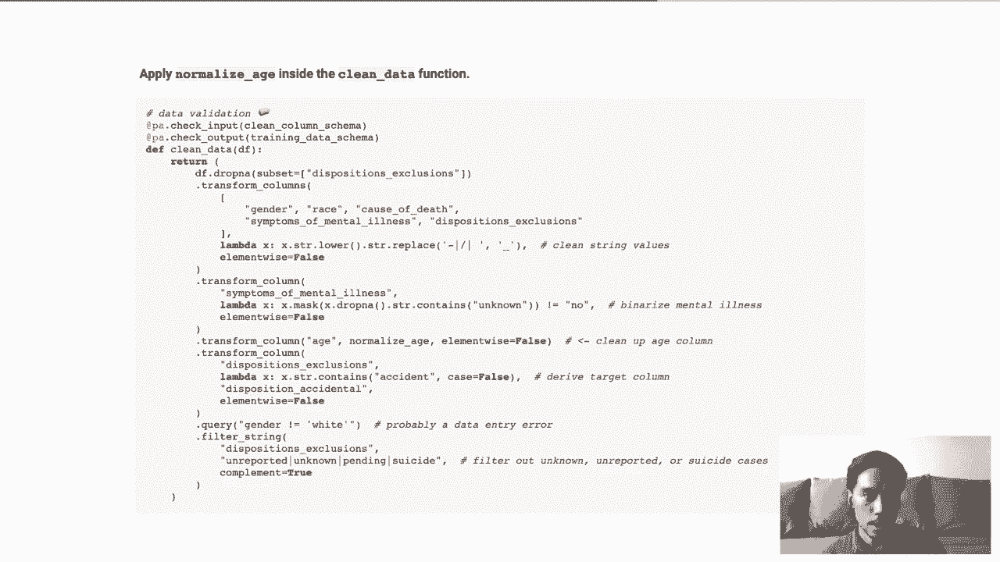

 data schema that we just defined。 If for some reason the data gets corrupted。

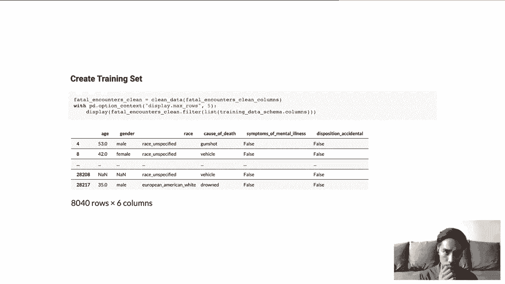

 check failure cases are reported as a data frame indexed by failure case value。

 The index column contains a list of indexes in the invalid data frame for a particular。

 failure case。 And the count summarizes how many failure cases that there were in the data frame。

 for a particular value。 You can get even finer grain debugging by catching the schema error。

 And with a try， accept pattern and accessing the invalid data attribute， the data attribute。

 And you can also inspect the failure cases attribute。

 which is itself a data frame in referencing the index in the invalid data that caused the schema。

 error。 So you can look at the data and splice it however you want。

 So one summary statistic we'd be interested in looking at now that we've cleaned our data。

 is the class balance of the target variable。 We can see here that it's 2。75%， which means the。

 training set is highly imbalanced。 To create a validation rule for this， we can use a hypothesis。

 class to test that the proportion of true values in the disposition accidental column。

 is equal to 2。75% with an alpha value of 1%。 Okay。

 so now that we've cleaned up our data and we've summarized it a little bit。

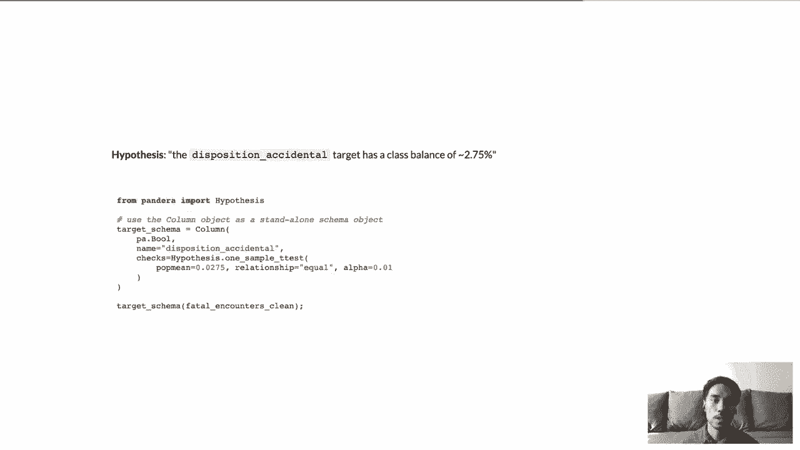

 it's time to split it into our training and test sets。 Here I'd like to highlight a few features。

 in Pandara。 First， we can define a series schema for our target variable。 And this works a lot like。

 column schemas， but it operates exclusively on Pandas series objects。 The second feature is that。

 we can create modified copies of data frame schemas by calling particular methods。 In this case。

 we're going to use the remove columns method to create a feature schema。 The first third feature。

 I want to highlight is the flexibility of the check input and check output decorators。 As you can。

 see， the split training data function should return a tuple of four arrays。

 We can specify an integer， index in check output as a second argument to specify the Pandas data structure we want to。

 verify with a particular schema。 Here we're saying we want to validate the first two outputs with。

 a feature schema and then the last two outputs with a target schema。

 Now it's time to model the data。

 We're going to use SKL to do this。 In particular， in particular， we'll make a pipeline using the。

 column transformer to numericalize features and a random forest classifier to predict the target。

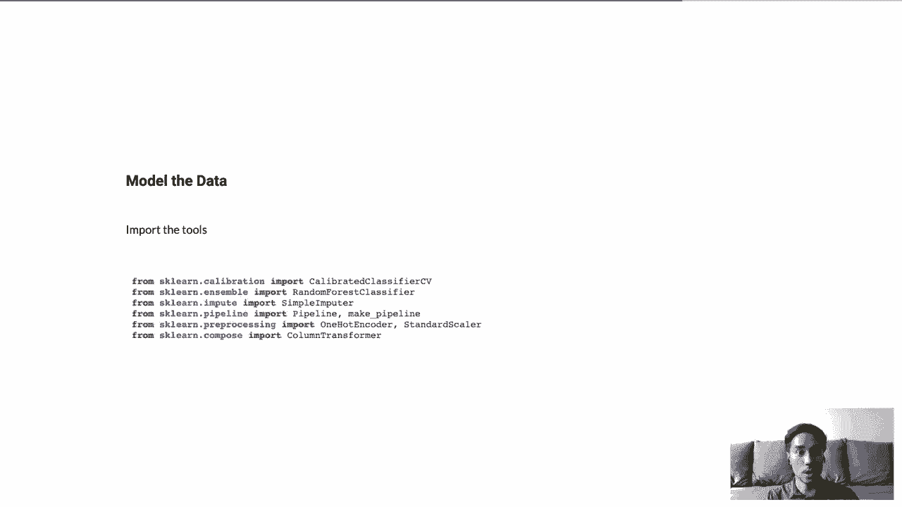

 To define the column transformer， let's take advantage of the fact that we've already declared a lot of。

 the properties of our data with a feature schema。 This example here is by no means a general solution。

 but the column transformer from schema function will do the job for this particular analysis。

 For categorical variables， which are encoded as strings here。

 we're going to pull up discrete categories， from these columns by accessing the statistics attribute of the check object that defines the。

 allowed values。 It works。 You can see here the visualization of the column transformer。

 Okay， so let's define the estimator and fit the model。

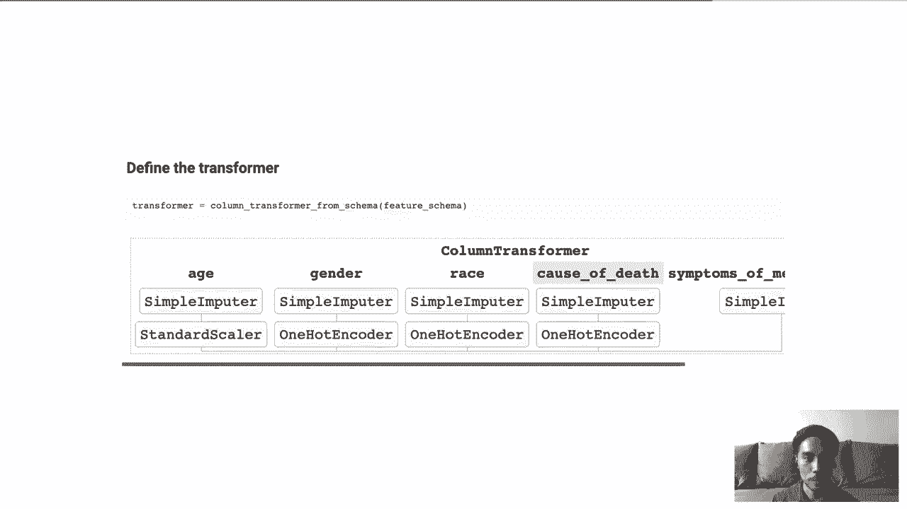

 But before we do that， we can use the check input decorator to validate the feature and target。

 inputs that go into the pipeline。fit method。 In this case， we can specify the data to validate。

 with a string that references the X and Y argument names of the SKLearnFit API。

 So this might be a little bit of a gross usage of this since SKLearn is already a well-tested package。

 but as I warned you earlier， I have a hammer and everything's a nail here。 As a quick aside。

 if you are implementing your own algorithms but trying to conform to the， SKLearn。ai API。

 this might be a good move to validate the inputs and outputs of your。

 of what goes into the fit method， especially if you're running a system in production and you want to。

 make sure that data going in is as is expected。 We can apply the same pattern to model evaluation。

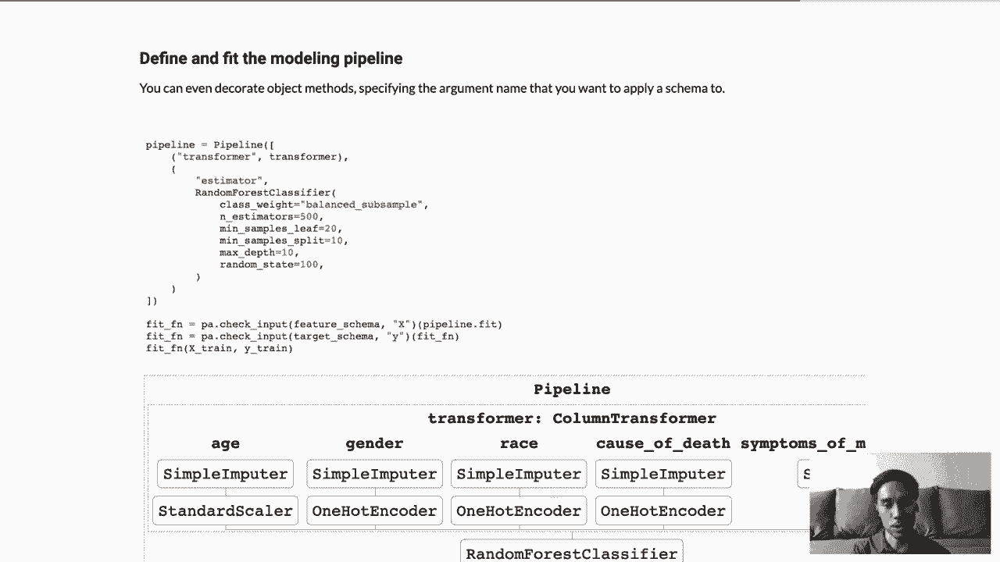

 where we can validate the input and output of the predict method。

 Here we see we have a decent model， fit with a test set ROC。

 AUC of 82% with a little bit of overfitting。 And in this plotting code。

 I did want to show you that you can even define in-line schemas that aren't。

 stored in a variable somewhere。 This one just checks that the false positive and true positive。

 rates are values between 0 and 1。 To audit the model， we're going to use the SHAP package。

 which implements the Shapley additive explanations method for obtaining model explanations。

 I don't have too much time to dig into the details of this method， but at a high level。

 SHAP values provide an estimate for a feature's positive or negative contribution to the。

 model output per instance。 So first we create and explain our object for our random forest estimator。

 and then we use a decorated version of the pipeline transformer to obtain an array of test set features。

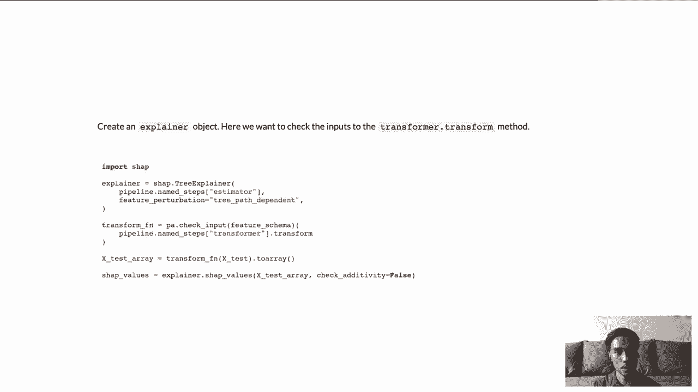

 to compute our SHAP values。 So returning to our research question， which factors are most。

 predictive of the court ruling a case as accidental？ The way to look at this graph is the following。

 Along the y-axis， we have the features that go into predicting the accidental case disposition。

 and each dot here is a single training instance， where red means that the value of that feature is high。

 Since most of the features here are binary， red means the value is 1 and blue means 0。

 Higher values in the x-axis means that the feature value contributed to a higher probability of an。

 accidental case disposition。 The thing to look out for here is for one particular color being。

 predominantly on one side of the x-axis 0， x-axis marker。 For example。

 the cause of death by vehicle， contributes to higher probability that the predicted disposition is accidental。

 and so does being tasered， asphyxiated or restrained， or belonging to the race unspecified category。

 Conversely， the cause， of death of gunshot， race being white or Asian Pacific Islander。

 contributes to lower probability。

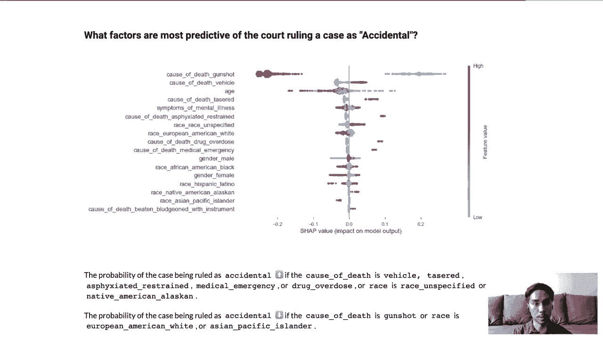

 that the predicted disposition is accidental。 If we want to validate these findings。

 these model properties， we can create a data frame of feature values and their associated。

 chat values for each instance in the training set。 Then， for each binary variable， we can define。

 a two sample t-test hypothesis test， asserting that having a value of 1 for a particular variable。

 tends to have a higher or lower set of chat values。

 which map onto contributing to a higher or lower， probability of the case being ruled as accidental。

 We can then programmatically construct a model， audit schema that verifies the properties that I outlined previously to see if the model explanations。

 are consistent with the hypotheses。 We can see that given the schema our model audit passes。

 We can use this schema in the future in the future instantiations of this model to see。

 if the assumptions hold。 Before I conclude the analysis， I just want to point out a few。

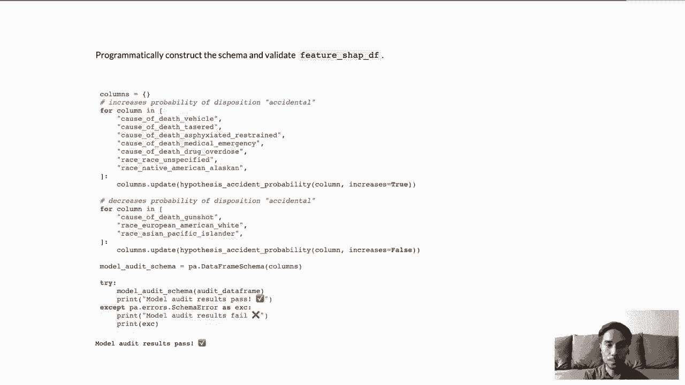

 questions that you may want to consider if you want to take a look at these data yourself。

 For example， the plot below provides a hint at the last question， which looks at interaction。

 effects between the variable race African-American black and symptoms of mental illness。

 My interpretation of this plot is that if the decedent was black， showing symptoms of mental。

 illness contributed to a higher predicted probability of the accidental case disposition。

 or as being not black and showing symptoms of mental illness contributed to a lower。

 predicted probability。 I'm sure there are a lot of a lot more questions that can be asked in this。

 dataset and I'd like to invite you to take a closer look for yourself。 So in summary。

 there are four， takeaways that I want to leave you with。

 Data validation is a means to multiple ends， reproducibility， readability， maintainability。

 and statistical type safety。 It's an iterative process between， exploring the data。

 acquiring domain knowledge， and writing validation code。 Thirdly。

 pandera schemas are executable contracts that enforce the statistical properties of a。

 data frame at runtime and can be flexibly interleaved with data processing and analysis logic。

 And finally， pandera doesn't automate data exploration or the data validation process completely。

 The user is responsible for identifying which parts of the pipeline are critical to test。

 and defining the contracts under which data are considered valid。

 If you want to try this package out， I'd be curious to learn about the utility of some。

 experimental features that come with version 0。4 and up。 The first is schema inference， which。

 produces a schema using a data frame input。 The second is the ability to write a schema to a。

 yaml file or a Python script for further editing。 In terms of features coming down the line。

 serving some pain points that I personally have with training machine learning models。

 I thought it would be nice to have domain-specific schemas where you can distinguish between target。

 and feature variables and then use that schema itself to generate samples for testing model training。

 code。 Finally， if you're interested in the project， there are many ways of contributing。

 like improving the documentation， submitting feature requests or bugs or submitting pull requests。

 So with that， I'd like to thank you all for your attention and have a good conference。

 [BLANK_AUDIO]。