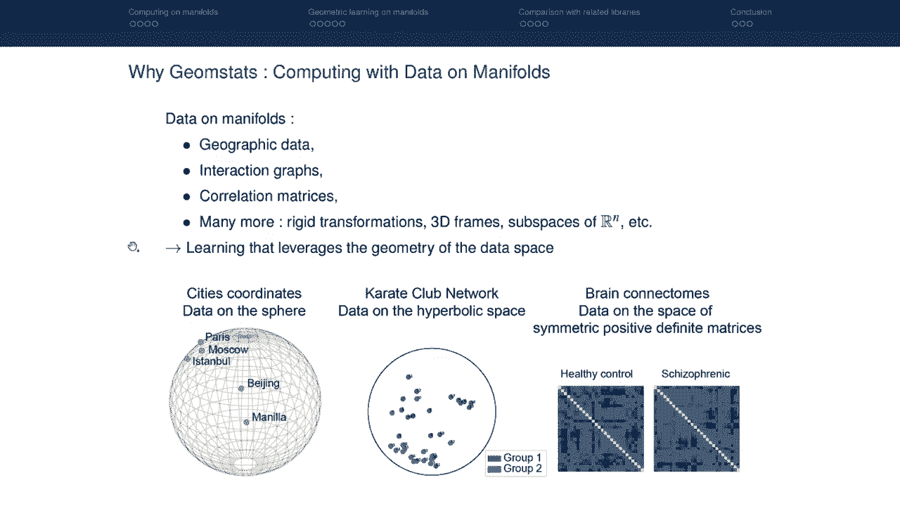
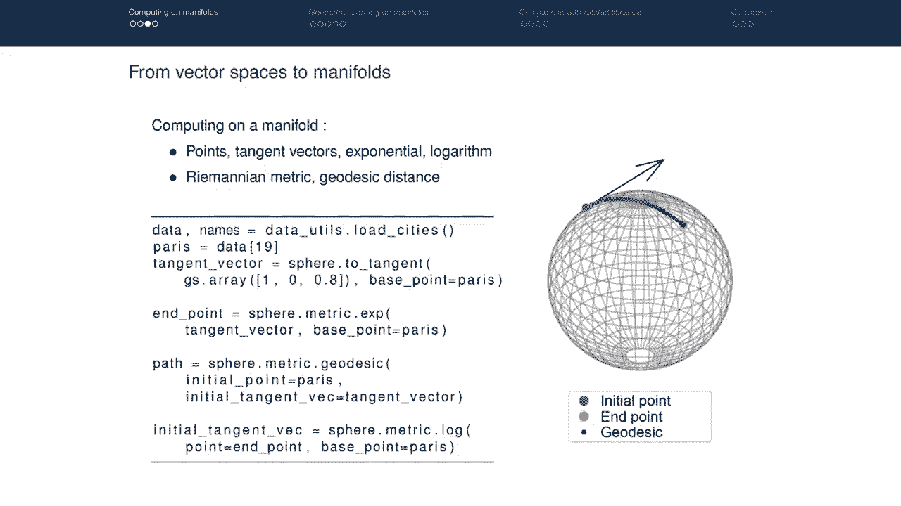
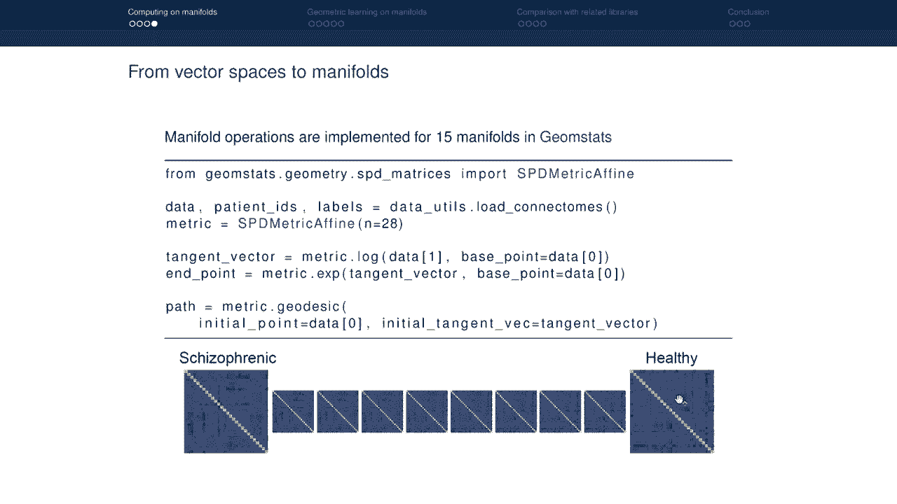
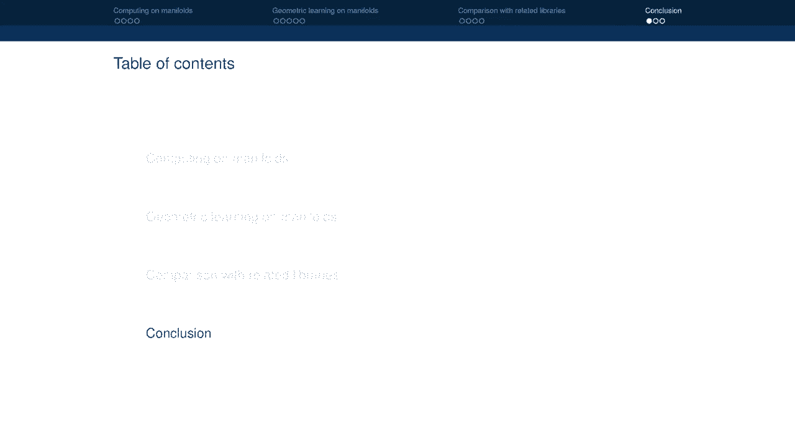
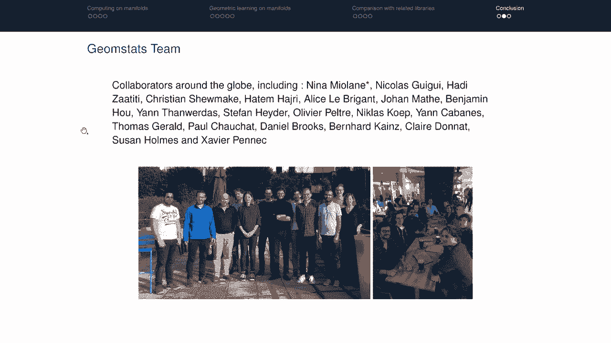

# SciPy 2020 (机器学习主题) - P3：Geomstats- A Python Package for Riemannian Geometry in Machine Learning ｜ Miolan - 爱可可-爱生活 - BV1Fv411q7k3

 This video introduces gem stats， a Python package for geometry in machine learning。 But first。

 what is the motivation behind gem stats？

 Gem stats was designed to compute with data on manifolds。

 So let's see examples of data on manifolds。 Data on manifolds can be geographic data。

 such as the coordinates of cities on the earth。 These are data on manifolds。

 the manifold is this sphere。 Data on manifolds can also be interaction graphs on networks。

 such as the graph of interactions， of the different members of a chaotic lab。

 This is an example of data on manifolds， the manifold is the height of a lit space。

 Data on manifolds can also be correlation matrices， such as brain connectomes， which。

 are correlations between the activations of different brain areas。

 And this is an example of data on manifolds， the manifold is the space of symmetric positive。

 definite matrices。 And there are many more examples。 Rigid transformations， 3D frames。

 subspaces of RN， etc。 Therefore， gem stats is designed to provide learning algorithm by taking to account the。

 geometry of the data space， that is the geometry of the manifold。

 Why do we want to take into account the geometry of the data space when we have learning algorithms？

 Let's take an example of a very simple learning algorithm， the computation of the mean。

 The definition of the mean is as follows。 X bar is a linear combination of X i's， the data point。

 It is therefore a linear dimension。 Now in manifolds on the other hand。

 can be roughly defined as a space that can be curved， therefore being a nonlinear in that nature。

 The manifold is， for example， the sphere that is depicted here， we see that it is nonlinear。

 What happens if we use a linear learning algorithm， the mean or the nonlinear manifold？

 Well the linear mean of data on the manifold will not necessarily belong to the manifold。

 Let's see how this works in gem stats。 Let's construct the manifold， the sphere。

 which is an object of the class high-pouch， sphere， with attribute dimension 2。

 We sample two points on this manifold， at random。 These are the two points in blue here on this sphere。

 Now if we compute the linear mean of these two points， we get the linear mean in orange。

 here and we see that the linear mean does not belong to this sphere。 It is inside this sphere。

 Therefore， the linear mean of data on the manifold does not necessarily belong to the， manifold。

 But we need to generate learning algorithms and even simple computations such as the mean。

 For the mean， this is done the following way。 We have a generalized definition called the fresh mean。

 It computes the mean as follows。 It takes the point on the manifold m， in our case， the sphere。

 that will minimize the sum， of the square distances to the data point。

 Now this was already a property of the usual definition of mean， but we'll take it as a。

 definition here。 And using this definition of mean。

 the fresh mean of data points on the manifold belong， to the manifold。

 But this can be computed easily with gem stats。 The important object of the class fresh mean。

 which is going to be our estimator， it depends， on the distance on the manifold therefore on the metric on the sphere。

 We fit it to the points and get the fresh mean at the estimate。

 The fresh mean is depicted in orange on the right and we see that now it belongs to the， manifold。

 But this was only a very simple learning algorithm which is estimating the mean。

 And there are many more learning algorithms beyond the mean estimation。

 The question is how do these generalize to the manifold？ If we need to generalize the mean。

 we surely need to generalize other learning algorithms。 And this is why Gem studies design。

 Gem studies a Python package that provides geometric statistics and geometric learnings。

 to compute with data or manifolds。 Gem studies organize into four main modules。

 The module geometry has all the necessary operations to compute our manifolds。

 The module learning has the learning algorithm for data or manifolds。

 Datasets module allows to load open source data sets of data or manifolds。

 And the visualization module allows us to get nutrition about these computations on manifolds。

 Gem studies is also implemented in three backends， numpy， tensorflow and byte-auch， thus allowing。

 for GPU computation。 We have three main objectives with Gem studies。

 The first is to teach hands-on geometry and learning。

 There are many text books that will teach the differential geometry of manifolds， but。

 they rarely provide code or coding exercises。 Therefore， Gem studies aims to fill this gap。

 The second objective of Gem studies is to democratize the use of this geometric learning， algorithm。

 Because the code is wrapped up in objects， you can use geometric learning algorithm with。

 Gem studies without having to look at all the tricky mathematical details of the algorithms。

 And lastly， Gem studies aims to support research in geometric learning， by inviting researchers。

 to provide their geometric learning code and incorporate them into the library。

 This video is organized as follows。 First， we will see how to use Gem studies to compute a manifold。

 therefore using the geometry， module of Gem studies mainly。

 Then we will see examples on how to use geometric learning algorithms on a manifold， therefore。

 using the learning module of Gem studies。 And lastly。

 we will compare Gem studies with related libraries， Python package， that also， compute a manifold。

 But let's start with how we use Gem studies to compute a manifold。

 We know how to compute on a vector space。 On the vector space， we have two basic elements。

 the points and the vectors。 For example， here we have a point in blue and a vector as this black arrow。

 And we know how to add a vector to a point。 We get another point on a vector space。

 We know that we can also subtract two points to get a vector。 On the vector space。

 we can define a notion of inner product， for example the Euclidean， inner product。

 And this allows us to have a notion of distance between the points on the vector space。

 Now these are the basic blocks of any algorithms to compute on vector spaces。

 If we want to have algorithm that work on a manifold， we need to generalize this building， block。

 And we do need to generalize them because we cannot choose the vector space of various， operations。

 If we take a vector and add it to a point on a manifold， we'll get another point but this。

 point will not be known to the manifold。 Therefore。

 we need to generalize these building blocks to be able to compute on the manifolds。

 And they are generalized as follows。 We still have points on manifolds。

 But we don't have vectors anymore。 We have tangent vectors such as here at that point on the manifold。

 we have a tangent vector。 Now we cannot add distance on vector to the point。

 We need to use a generalization of the addition which is called the exponential。

 The exponential vector and the box points and provides another point on the manifold。 In FITI。

 the exponential will shoot from the initial point using the tangent vector a longer。

 path that belongs to the manifold to which the end points。 On the vector space。

 we could subtract two points to get a vector。 On the manifold。

 this operation is generalized with the notion of logarithm。 We can take two points， subtract them。

 we'll get a tangent vector。 Actually， we're going to get a tangent vector that was needed to go from the first point。

 to the second point。 This is a cut snippet that illustrates how to do this in jump stats。

 We can load data on manifolds， for example， loading coordinates of cities and the earth。

 We can take one point on this manifold， for example， Paris。

 We define a tangent vector at Paris by defining a vector and projecting it to the tangent。

 space of this year at the baseband Paris。 Now let's try to add this tangent vector to the point using the generalized notion of。

 addition which is the exponential。 We call the exponential of that tangent vector at baseband Paris。

 We cannot compute the path that is defined on the manifold when we shoot from the tangent。

 vector with the tangent vector from the baseband。 It's called a geodesic。

 We tell it what is the initial point， what is the initial tangent vector。

 And then we can also subtract one point on the other to get the tangent vector using the。

 generalized notion of subtraction which is the logarithm。

 Now these operations are illustrated here with one manifold which is the sphere because。

 it's easy for visualization。

 But these manifold operations are actually implemented for 15 different manifolds in。

 germstats including manifolds that are not necessarily easy to visualize， for example。

 because they have a higher dimension。 So let's take another example of manifold。

 the manifold of symmetric positive definite， matrices。

 We have a dataset available in germstats of data on this manifold。 These are the connectors。

 Here you see data zero of this dataset which is a SPD matrix and data one of this dataset。

 which is another SPD matrix。 We can do the same operations that we describe in the case on this sphere。

 For example， we can look for a path that goes from this point on the space of SPD matrices。

 to this point also on the space of SPD matrices which is a geodesic。

 So we do the same operation that we had done on this sphere。

 We can look for the tangent vector that allows to shoot from one point to the next and then。

 compute the geodesic that goes from the initial point to the next using to the next point of。

 the dataset using the tangent vector。 And even though we cannot actually visualize the path on the high dimensional manifold。

 we， can visualize each point that belongs to that path。

 And this is an example of a few points that belong to the geodesics linking this point。

 on the manifold to that point on the manifold。

 So we've seen how we can generalize basic operation on vector spaces to operation on， manifolds。

 So now that we have all the building blocks to compute on manifold， let's see which geometric。

 learning algorithm on manifolds we can use which germstats。

 On the vector space we know of many learning algorithms that we can divide into two main。

 categories， the supervised learning algorithms such as logistic regression and the unsupervised。

 learning algorithm such as principal component analysis or K-mein。

 Now that we have the building blocks to generalize them， we can have a similar algorithm on the。

 manifold。 So let's see the example of logistic regression。 In germstats。

 this is implemented as a tangent logistic regression。

 The idea there is that even if the manifold is curved， if we stand at one point of this， manifold。

 we can look at the tangent space at this data point and this now define a vector， space。

 So this is common use to transport all the data points that were on the manifold to the。

 tangent space and specifically the tangent space at the fission of the data。

 And now that all the points on the manifolds are on the tangent space， they are now belong。

 to a vector space and we can use usual learning algorithms such as the one provided by the。

 psychic learn library。 So let's say we want to design the logistic regression on the manifold of SPD matrices。

 Specifically， let's say for each connectome such as this one， we wish to be able to predict。

 the connectome of a schizophrenic subject or of a healthy control。 In this case。

 we import the pre-processing module from germstats with the two tangent， space object。

 the logistic regression of psychic learn as well as the pipeline from， psychic learn。

 We load the connectomes， we get data on the manifold， we split them in training tests， we。

 define a metric on the SPD manifold and the pipeline which is， as we have seen， first。

 project all the data to the tangent space and then apply logistic regression。

 And then we can just fit and predict such as in usual psychic learn pipelines and we'll。

 get a label for each of the connectome of the SPD manifold。 Now let's go to unsupervised learning。

 On vector spaces， we know that we can use principal component analysis to look at the。

 main variations within a dataset。 On germstats， in germstats， we can use tangent PCA instead。

 So we import tangent PCA。 Let's see if we want to see it on one particular manifold which is the i-per sphere。

 We instantiate this sphere， we generate data with a random distribution on this sphere。

 we compute the fresh mean of this data which we estimate and then we can compute tangent。

 PCA at this fresh mean。 So we fit the data at the base point， the mean。

 It means we do PCA at the tangent space of the fresh mean。 And this is what we get in germstats。

 If the points are black， are the points sample from the random distribution， then germstats。

 provide the main component of variations of this dataset along the manifold。

 Let's see another example of supervised learning。 On vector spaces。

 we can use k-means to find clusters of data。 Now let's see how this works in germstats。

 Let's say we have the kinetic lab networks where each point represents a kinetic lab member。

 and the points are closed together if they are a lot of interaction of social interaction。

 between these members。 We wish to see if we can divide this dataset of members into two groups that interact。

 The graphite interaction can be infinitely embedded in a hyperbolic space。

 Now the question is how do we perform k-means is k of 2 in a hyperbolic space。

 So this is implemented in germstats with re-manient k-means。

 First we instantiate the manifold which is called the poncarable。

 It's a special case of hyperbolic space in dimension 2。 We load a dataset。

 the karate graph which is a dataset on the hyperbolic space of dimension， 2 which is the poncarable。

 We embed the graph in this hyperbolic space and then we can use the re-manient k-means algorithm。

 with the generalization of the k-means algorithm for data on the hyperbolic space。

 We specify the number of clusters and we specify the metric of the hyperbolic space。

 And then we can fit and predict which you give this illustration on the right。

 So we see that each member has been associated to a label which is the subgroup of people。

 to which this member belongs。 We see also that we have computed the centrates of these two subgroups。

 So again， these were learning algorithm illustrated on specific manifolds， the manifolds of。

 the space pd matrices， the manifold of the sphere， the manifold of the hyperbolic space。

 in dimension 2 but you can use this learning algorithm with any of the 15 manifolds that。

 are implemented in gem sets。 Now we will see how gem sets compares to the other libraries that also perform computations。

 on manifolds。 These are the main libraries that perform computations on manifolds and they have different。

 goals。 You have， for example， pyremen and pyquat onion。 They are dedicated to a specific manifold。

 For example， pyremen computes with data on the spd space and pyquat onion computes with。

 data on the rotation manifold。 So they are dedicated to a specific manifold whereas gems and implements many different。

 manifolds。 Then you have pymenapt that performs optimization on manifolds。

 So optimization on manifolds is very useful for learning algorithm。

 So pymenapt can be called from gem sets to implement the learning algorithm themselves。

 Then in comparison to pymenapt， gem set provide the elementary mathematical operation for。

 differential geometry and the wrapper of the learning algorithm。

 Ventiano geometry provides nonlinear statistics of manifold。

 They restrict themselves to a specific set of manifolds that is useful in a field called。

 computational anatomy。 This package is very well implemented。 However。

 it lacks continuous integration and unit testing。 Mac。

ng opt also package that perform optimization on manifolds。 Mac。

torch aims to the applications in deep learning and geo opt is also geared towards deep。

 learning and uses implements specifically stochastic adaptive optimization。 In contrast。

 GM stack implements low level geometric operations， not optimization but。

 then the learning algorithms and manifolds。 Go into the details of this comparison。

 Here on the second column， you can see the manifold that I implemented in the different， packages。

 You can see that pymenapt has a very high number of manifolds implemented。 In the third column。

 you can see the usual differential geometric operation that I implemented， in this package。

 We can also compare these packages in terms of engineering。 Specifically。

 this current here shows which backends are available in which package。

 In that gladiopt and miktosh focus on pycatch， the end geometry focuses on the endo。

 Pymenapt and GMSight provide a wider range of package。

 We can also look at these packages in terms of continuous integration and cut coverage。

 We see that geo opt and TNO geometry do not use those unit tests or coverage but all the。

 other packages have a good cut coverage。 This is now time to conclude this video。

 Let's emphasize that the GMSight library is created by the GMSight team which is a team。

 of collaborators around the club whose name is Alistair here。

 We frequently organize HACATON to contribute to this library。

 These are photos of the last HACATON。 Lastly， let's repeat GMSight's objective。

 GMSight was created to teach hands-on geometry and learning to democratize the use of geometric。

 learning and， lastly， to support research in geometric learning。

 If you are interested in contributing to the library and joining the community， you can。

 join us on GitHub。

 Thank you via attention。 [BLANK_AUDIO]。