# P1：Lecture 1 Overview - 鬼谷良师 - BV16E411J7AQ

 All right。 Let's get started。 Please try to have a seat if you can find a seat。 And let's。

 get the show on the road。 So welcome everyone to CST21。 This is artificial intelligence。

 And if you're new to Stanford， welcome to Stanford。 So first let's do some introduction。

 So I'm Percy。 I'm going to be one of your instructors teaching this class with Dorsa， over there。

 So if Dorsa wants to say hi， stand up。 Great。 So we're going to be trading。

 off throughout the quarter。 And we also have a wonderful teaching team。 So these are your， CAs。

 So if all the CAs could stand up and I'll give you each person an opportunity to。

 say three words about what you're interested in。 Let's start with the head。 Hello。 My name is G。D。

 student and I'm interested in natural language processing。 Hi。 Hi。 I'm a second year master student。

 I'm in school student machine learning and， I'm interested in natural language processing。 Hi。

 My second year master student。 I'm interested in natural language processing。

 I'm interested in computer processing。 Hi。 Hi。 I'm also interested in computer processing。 Hello。

 First year master student。 I'm interested in natural language processing。

 I'm interested in natural language processing。 Hi。 I'm a teacher student。

 I'm interested in reinforcement learning and the eye。 Hi。 I'm a second year master student。

 I'm your second。 I'm interested in computer processing。 I'm interested in computer processing。

 Hi。 I'm interested in computer processing。 Hi。 I'm also a coach。

 I'm interested in computer processing。 Hi。 Hi。 I'm a teacher student。 I'm a teacher student。

 >> Nice。 Any of these in the back？ Well， they're on the slide。 Okay， so as you can see。

 we kind of have a very diverse team。 And so when you're thinking about final projects later in the quarter。

 you can tap into the standard of incredible resource。 So three quick announcements。

 So there's going to be a section every week， which we'll cover both of review topics and also advance topics。

 So this Thursday， there's going to be an overview。

 If you're kind of rusty on Python or rusty on probability。

 come to this and we'll get you up to speed。 Homework， the first homework is out。

 It's posted on the website。 It's due next Tuesday at 11 PM。 So remember the time that matters。

 All submissions will be done on Gradescope。 There's going to be a Gradescope code that will be posted on Piazza。

 So look out for that later。 Okay， so now let's begin。

 So when I first started teaching this class seven years ago。

 I used to have to motivate why AI was important and why if you study it。

 you'll have a lot of impact in the world。 But I feel like I don't really need to do this。

 Now it's kind of inescapable that you pick up the news in the morning， you hear something about AI。

 And indeed， we've seen a lot of success stories， right？ AIs that can play Jeopardy or play Go。

 Dota 2， or even Poker， all these kind of games at superhuman level performance。

 It can also read documents and answer questions， do speech recognition， face recognition。

 even kind of medical imaging。 And all these tasks are you read about how successful these technologies have been。

 And then if you take a look at outside the kind of the technical circles。

 there's a lot of people in policy and trying to ask what is going on with AI。

 And you hear about these kind of very broad claims of how transformative。

 AI will be to the future of work and the society and so on。

 And even some kind of boring on pretty catastrophic consequences。

 So what's going to happen in the future？ No one knows。

 But it is fair to say that AI will be transformative。 But how do we get here？ And to do that。

 I want to take a step back to the summer of 1956。 So the place with Dartmouth College。

 John McCarthy， who was then at MIT。 And then after that， he founded the Stanford AI Lab。

 organized a workshop at Dartmouth College with some of the best and brightest minds of the time。

 Marvin Minsky， Claude Shannon， and so on。 And they had this not so modest goal of trying to think that every aspect of learning or。

 any feature of intelligence can be precisely captured so that a machine can be just simulated。

 So they were after the big question of how do you kind of solve AI。

 So now they didn't make that much progress over the summer。

 But a lot of programs and interesting artifacts came about from that time。

 There were programs that could play checkers or prove theorems。

 And sometimes even better than what the human proof would look like。

 And there was a lot of optimism。 People are really， really excited。

 And you can see these quotes by all these excited people who。

 proclaimed that AI would be solved in a matter of years。 But we know that didn't really happen。

 And there's this kind of folklore example。 People are trying to do machine translation。

 So you take an English sentence like the spirit is willing by the flesh is weak。

 You translate into Russian， which is what the choice language by the US government at that time。

 And you could translate back into English。 And this is what you get。 The vodka is good。

 but the meat is rotten。

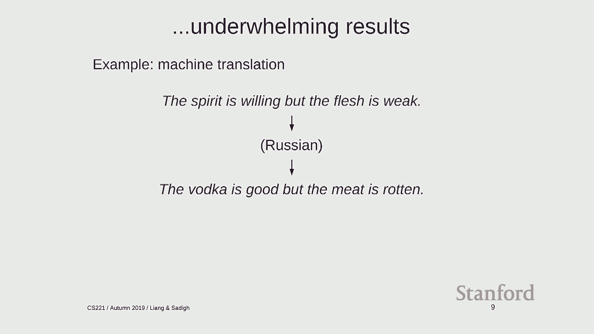

 So the government didn't think that was too funny， so they cut off the funding。

 And it became the first AI winter。

 So there's a period where AI research was not very active and was not well， very well funded。

 So what went wrong here？ These are really smart people。

 They just got a little maybe a little out of themselves。 So two problems。

 One is that the compute was simply not there。 There's millions or even billions of order magnitude compared less than what we have right。

 now。 And also the problems， the way they formulate them intrinsically rely on exponential search。

 which no matter how much compute you have， you're never going to win that race。

 They also have limited information。 And this is maybe a kind of a more subtle point that if I gave you infinite compute and ask。

 you to translate， I don't think you would be able to figure it out because it's not a。

 computation problem， you just need to learn the language and you need to experience all。

 the subtleties of language to be able to translate。 But on the other hand， AI wasn't soft。

 but a lot of interesting contributions to computer， science came out of it。 LISP was。

 I had a lot of ideas that underlay many of the high level program languages we， have。

 garbage collection， time sharing， allowing multiple people to use one computer at the， same time。

 which is something that we take for granted。 And also this paradigm of separating what you want to compute。

 which is modeling and， how you do it， which is inference， which we'll get to a little bit later。

 Okay， so people forget quickly。 And in the 1780s， there was a renewed generation of people getting excited about AI again。

 And this time it was all about knowledge。 Knowledge is power。

 And there were a lot of expert systems which are created。

 And the idea is that if you could encode experts' knowledge about the world， then you。

 could do kind of amazing things。 And at the time the knowledge was encoded in generally a set of rules。

 And there were a lot of programs that was written。

 And you notice that the scope is much narrower now。 The goal isn't to solve all of AI。

 but to really focus on some choice and problems like。

 diagnosing the diseases or converting customers' order parts into parts and customer orders。

 into parts。 And this was the first time that AI I think really had a real impact on industry。

 So people were actually able to make useful products out of this。

 And knowledge did actually play a key ingredient in curbing this in your exponential growth。

 that people were worried about。 But of course， it didn't last long。

 Which as deterministic rules was simply not rich enough to capture all the nuances of， the world。

 it required a lot of manual effort to maintain。 And again。

 a pattern of over promising and under-liverings that seems to plague AI people。

 led to the collapse of the field and the kind of second AI winter。 Okay。

 so that's not the end of the story either。 But actually it's not really the beginning either。

 So I'm going to step back further in time to 1943。 So what happened in 1943？

 So there was a neuroscientist， McCulloch， and the logician pits who were wondering and marveling。

 at how the human brain is able to do all these kind of complicated things。

 And they want to formulate a theory about how this could all happen。

 So they developed a theory of artificial neural networks。

 And this is kind of you can think about the root as of deep learning in some sense。

 And what was interesting is that they looked at neurons and logic， which are two things。

 that you might not kind of necessarily associate with each other and showed how they were kind。

 of connected mathematically。 And a lot of the early work in this era around artificial neural networks was about studying。

 them kind of from a mathematical perspective。 Because at that time the computer wasn't there。

 you couldn't really run any kind of training， models or-- and then 1969 something interesting happened。

 So there's this book by Minsky and Pepper called Perceptrons。

 And this book did a lot of mathematical analysis。 And it also showed that linear models。

 one of the results of them many， was showing that。

 linear classifiers couldn't solve the extra problem。

 The problem is-- another way to think about the problem is basically given two inputs。

 can you tell whether they're the same or not or different。

 And so it kind of not-- shouldn't be a hard problem， but linear classifiers couldn't do， it。

 And for some reason， which I don't quite understand， it killed off neural nets research。

 even though， they said nothing about if you had a deeper network what it could do。

 But it's often cited that this book swung things from people who were interested in neural。

 networks to the field of AI being very symbolic and logic driven。

 But there was always this kind of minority group who were really invested and believed。

 in the power of neural networks。 And they thought it was just kind of a matter of time。

 So in the '80s， there was a renewed interest。 People kind of discovered or rediscovered the back propagation algorithm。

 which allowed， kind of a generic algorithm that could train these multi-layer neural networks because。

 single layer remember was insufficient to do a lot of things。

 And then one of the kind of the early success stories was Janakun in 1989 applied a convolutional。

 neural network and was able to recognize handwritten digits。

 And this actually got deployed by the USPS and was reading kind of zip codes。 So this was great。

 But it wasn't until this decade that this area of neural networks really kind of took off。

 under the moniker deep learning and Alex net in 2012 was kind of a huge transformation。

 where they show gains on the kind of image net benchmark and overnight transform the。

 computer vision community。 Alpha go as many of you know and many kind of other and the rest is history。

 Okay so so there's these kind of two intellectual traditions。

 You know the name AI has always been associated with a time John McCarthy logical tradition。

 That's kind of where it started。 But as you can see that there's also kind of this neuroscience inspired tradition of AI。

 And the two were kind of really had some deep philosophical differences and over the decades。

 fought with each other kind of quite a bit。 But I want to pause for a moment and really think about maybe they're actually doing deeper。

 connections here。 Remember McCollum Pitts they were studying artificial neural networks but the connection。

 was to logic。 So from even in the very beginning there is kind of this synergy that some people can。

 kind of often overlook。 And if you take a look at alpha go which if you think about the game of go or many games。

 it's a mathematically you can write down the rules of go in logic in just a few lines。

 So it's a mathematically well defined logical logic puzzle in some sense。

 But somehow the power of neural networks allows you to develop these models that actually。

 play go really really well。 So this is kind of one of the deep mysteries that has kind of I think is a kind of opens。

 standard challenge in AI。 As with any story it's not a full picture and I want to point out on this slide that。

 AI has drawn from a lot of different fields。 Any of the techniques that we're going to look at for example maximum likelihood came。

 from statistics or games came from economics， optimization， gradient descent came from in。

 the 50s completely unrelated to AI but these techniques kind of develop in a different， context。

 And so AI is kind of like a New York city。 It's a melting pot where a lot of these techniques get kind of unified and apply to interesting。

 problems。 And that's what makes it I think really interesting because of the new avenues that are opened。

 up by kind of unique combinations of existing techniques。 Okay。

 so that was a really brief history of how we got here。

 Now I want to pause for a moment and think about what is the goal？ What are AI people trying to do？

 And again this is kind of there's two ways to think about this which and sometimes the。

 conflation of these causes a lot of confusion。 So I'd like to think about it as AI is agents and AI is tools。

 So the first view asks the kind of the subject question of how can we create or recreate。

 intelligence。 And the second one asks how can we use technology to kind of benefit society。

 And these two are obviously very related and they have a lot of shared technical overlap。

 But philosophically they're kind of different。 So let me kind of explain this a little bit。

 So the idea with AI agents is and this is I think a lot of what gets associated with。

 AI and especially with science fiction that kind of portrayal certainly kind of encourages。

 this kind of view where you're human beings。 And what you do is you look in the mirror and you say wow that's a really smart person。

 And you think okay what can humans do that is so amazing。

 Well they can see and they can perceive the world recognize objects。

 They can grasp cups and drink water and not spill it。

 They can communicate using language as I'm doing to you right now。 We know facts about the world。

 declarative knowledge such as what's a capital France。

 and procedural knowledge like how to ride a bike。 We can reason with this knowledge and maybe ride a bike to the capital France。

 And then really importantly we're not born with all of this。

 We're born with basically nothing none of these capabilities but we're born with the。

 capacity and potential to acquire these over time through experience。

 And learning seems to be kind of this critical ingredient which drives a lot of the success。

 in AI today but also with human intelligence is clear that learning plays such a central。

 role in getting us to the level that we're operating at。

 So each of these areas has kind of spawned entire subfields and people in it are kind。

 of wondering about how you can make artificial systems that have the language or the motor。

 or the visual perceptual capabilities that humans have。 But are we there yet？

 And I would like to think that we are very far。 So if you look at the way that machines are having successful it's all with a narrow set。

 of tasks and millions or billions of examples and you just crunch a lot of computation and。

 you can really kind of optimize any task you can come up with。

 Whereas humans operate in a very different regime。

 They don't necessarily do any one thing well but they are have such a kind of diverse set。

 of experiences can solve the diverse set of tasks and learn from each individual task。

 from very few examples。 And still it's a kind of a grand challenge from a cognitive perspective how you can build。

 systems with this level of capability that humans have。 So the other view is AI tools。

 Basically we say okay well it's kind of cool to think about how we can recreate challenges。

 but we don't really care about making more things like humans。

 We already have a way of doing that that's called babies。

 So what instead we really like to do is not making something that's like a human but making。

 systems that help humans because after all we're humans I guess it's a little bit selfish。

 but we're in charge right now。 And a lot of these this view and a lot of the success stories in AI are really different。

 from the things that you expect this humanoid robot to come into your house and be able， to do。

 For example this is a project from Stefan O'Rimmons group。

 There's a lot of poverty in the world and part of it is just kind of understanding what's， going on。

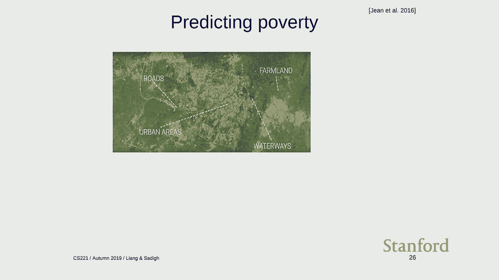

 And they had this idea of using computer vision on satellite imagery to predict things， like GDP。

 So this is obviously not a task that our ancestors in Africa were like getting really， good at。

 But nonetheless it uses convolutional networks which is a technique that was inspired by the。

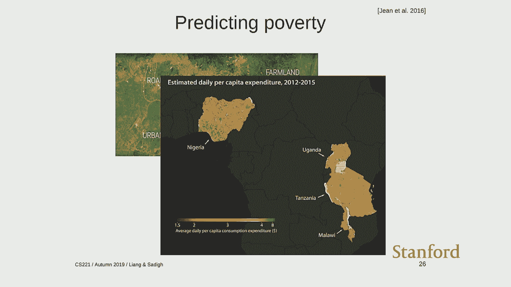

 brain。 So that's kind of interesting。 You can also have another application for saving energy by trying to figure out when。

 to cool data centers。 As AI is being deployed in more kind of mission critical situations such as self-driving cars。

 or authentication there are a few new issues that come up。

 So for example there are this phenomenon called adversarial examples where you can take these。

 cool looking glasses。 You can put them on your face and you can fool the computer's -- save our face recognition。

 system to think that you're actually someone else。

 Or you can post these stickers on stop signs and get this save our system to think that。

 it's a speed limit sign。 So there's obviously -- clearly these are big problems if we think about the widespread。

 deployment of AI。 There's also less catastrophically but also pretty upsetting which is biases that many。

 of you probably have read in the news about。 So for example if you take Mulay which is a language that doesn't distinguish in the。

 writing form between he and she and you stick into Google Translate you see that she works。

 as a nurse but he works as a programmer which is encoding certain societal biases in the。

 actual models。 And one important point I want to bring up is that how is machine learning and kind of。

 working today？ Well society exists。 Society is generating a lot of data。

 Training on this data and trying to fit the data and mimic what it's doing and then using。

 predictions on it。 What could possibly go wrong？ And so certainly people have been thinking about how these biases are creeping up and。

 is an open active area of research。 Something a little bit more sensitive is asking。

 well these systems are being deployed to all， these people whether they kind of wanted or wanted or not and this actually touches on。

 people's livelihoods。 It actually impacts people's lives in a serious way。

 So Northwain was a company that developed a software called Compass that tries to predict。

 how risky criminal risk or how someone， how risky someone is essentially。

 And a pro-publicly this organization realized whoa whoa whoa。

 We have the system that given an individual didn't refund is actually more twice as likely。

 to classify blacks as incorrectly as non-blacks。 So this seems pretty problematic。

 And the Northwain comes back and says actually I think we're being fair。

 So given a risk score of seven we were fair because 60% of whites reoffended and 60% of。

 blacks reoffended。 The point here is that there's actually no solution to this in some sense sadly。

 So people have formulated different notions of fairness and equality between how you predict。

 on different kind of groups。 But all you can have different notions of fairness and which all seem reasonable from。

 first principles but mathematically they can be incompatible with each other。

 So this is again an open area of research where we're trying to figure out as a society。

 how to deal with the skin and that machine learning might be using these kind of critical。

 situations。 Okay so summary so far。 There's an agent's view。

 We're trying to really kind of dream and think about how do you get these capabilities like。

 learning from very few examples that humans have into machines and maybe opening up a。

 kind of a different set of technical capabilities。

 But at the same time we really need to be thinking about how these AI systems are affecting。

 the real world。 And things like security and biases and fairness all kind of show up。

 It's also interesting to note that a lot of the challenges in deployment of AI system。

 don't really have necessary to do with humans at all。

 I mean humans are incredibly biased but doesn't mean we want to build systems kind of in our。

 mimic humans and kind of inherit all the flaws that humans have。 Any questions about this？

 Maybe pause for a moment。 So let's go on。 So what I want to do next is give an overview of the different topics in the course。

 And the way to think about all of this is that in AI we're trying to solve really complex， problems。

 The real world is really complicated。 But at the end of the day we want to produce some software or maybe some hardware that actually。

 runs and does stuff。 And so there's a very considerable gap between these things。

 So how do you even approach something like self-driving cars or diagnosing diseases？

 You probably shouldn't just sit down at a terminal and start typing because then there's。

 no kind of no overarching structure。 So what this class is going to do is to give you one example of a structure which will hopefully。

 help you approach hard problems and think about how to solve them in a kind of more， principled way。

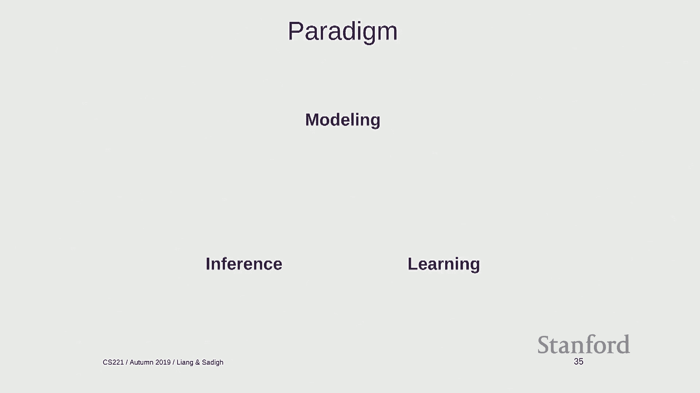

 So this is a paradigm that I call the modeling inference and learning paradigm。

 So the idea here is that there's three pillars which I'll explain in a bit。

 And we can focus on each one of these things kind of in turn。 So the first pillar is modeling。

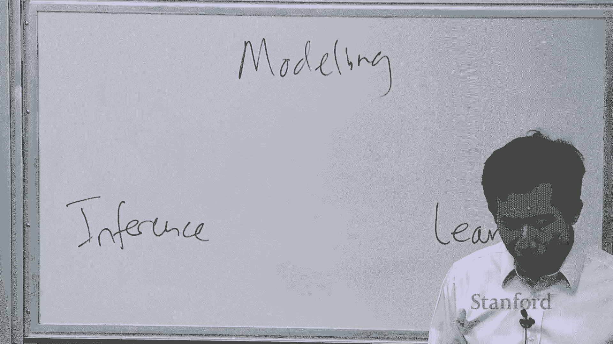

 So what is modeling？ The modeling is taking the real world which is really complicated and building a model。

 out of it。 So what is a model？ Model is a simplification that is mathematically precise so that you can do something with it。

 on a computer。 One of the things that's necessary is that modeling necessarily has to simplify things。

 and throw away information。 So one of the kind of the art is to figure out what information to pay attention to。

 and what information to keep。 So this is going to be important。 For example。

 when you work on your final projects and you have a real world problem。

 you need to figure out-- you can't have everything and you have to figure out your。

 judiciously how to manage your resources。 So here's an example。 If you want to， for example。

 build a system that can find the best way to get from 0。8， to 0。8 to 0。8 to 0。8 to 0。8。

 To be a point B in the graph-- in the city， you can formulate the model as a graph where。

 nodes are points in the city and edges represent a ability to go between these points with some。

 sort of cost on the edges。 OK， so now once you have your model， you can do inference。

 And what inference means is asking questions about your model。 So here's a model you can ask。

 for example， what is the shortest path from this point to， this point？

 And that's because now you're a model land， it's a mathematically well-defined problem。

 Now it's within the realm of developing algorithms to solve that problem。

 And most of the inference is being able to do these computations really efficiently。 And finally。

 learning addresses the problem。 Where does this model come from？ So in any realistic setting。

 the model might have a lot of parameters， maybe it has millions， of parameters。

 And how do you-- if it wants to be faithful to the real world， but how do you get all。

 this information there？ Manually encoding this information turns out not to be a good idea。 This is。

 in some sense， what AI from the '80s was trying to do。 So the learning paradigm is as follows。

 What we're going to do is specify a model without parameters。 Think about it as a skeleton。

 So in this case， we have a graph， but we don't know what the edge weights are。

 And now we have some data。 So maybe we have data of the form。 People try to go from x to y。

 and they took 10 minutes or an hour or so on。 And then from this data。

 we can learn to fit the parameters of the model。 We can assign costs to the edges that are representative of what the data is telling。

 us。 OK？ So now in this way， we can write down a model without parameters， feed it data， apply a。

 generic learning algorithm， and get a model with parameters。

 And now we can go back and do inference and ask questions about this。 OK。

 so this is kind of the paradigm。 And I want to really emphasize that learning is not。

 as I presented， is really not about， any one particular algorithm like nearest neighbors or neural networks。

 It's really a kind of a philosophy of how you go about approaching problems by defining。

 a model and then not having to specify all the details but filling them in later。 OK。

 so here is the plan for the course。 We're going to go from low level intelligence to high level intelligence。

 And this is the intelligence of the models that we're going to be talking about。 So first。

 we're going to talk about machine learning。 And like I've alluded to earlier。

 machine learning is going to be such a kind of an。

 important building block that can be applied to any of the models that we develop。

 So the central tenant in machine learning is you have data and you go to model。

 It's made a driver of a lot of success in AI because it allows you to， in software engineering。

 terms， move the complexity from code to data。 Rather having a million lines of code which is unmanageable。

 You have a lot of data which is collected in kind of a more natural way and a smaller。

 amount of code that can operate on this data。 And this paradigm has really been intuitively powerful。

 One thing to think about in terms of machine learning is that it requires a leap of faith。

 So you can go through a mechanics of downloading some machine learning code and you train a， model。

 But fundamentally， it's about generalization。 You have your data， you fit a model。

 but you don't care about how it performs on that data。

 You care about how it performs on new experiences。

 And that leap of faith is something that I think gives machine learning its power。

 But it's also a little bit， at first glance， perhaps magical。

 It turns out you can actually formalize a lot of this using probability theory and statistics。

 but that's kind of a topic for another time。 After we talk about machine learning。

 we're going to go back and talk about the simplest， of models。 So a reflex model is this。

 So here's a quiz。 What is this animal？ Zebra， how did you get it so fast？ Well， it's kind of reflex。

 Your human visual system is so good at doing these things without thinking。

 So reflex models are models which just require a fixed set of computations。

 So examples like linear classifiers， deep neural networks。

 And most of these models are the ones that people in machine learning use。

 Models is almost synonymous with reflex in machine learning。

 And the important thing is that there's no feed for it。 It's just like you get your input， bam， bam。

 bam， and here's your output。 So that's great because it's fast。

 But there's some problems that require a little bit more than that。 So for example。

 here's another problem。 Quick， why to move？ Where should you go？

 There's probably a few of you who are like chest geniuses。 But for the rest of us， I have no idea。

 And we're going to wait。 Who's moving again？ In these kind of situations。

 we need something perhaps a little bit more powerful than a reflex。

 We need agents that can kind of plan and think ahead。

 So the idea behind state-based models is that we model the world as a set of states which。

 capture any given situation， like a position in a game。

 And actions that take us between states which correspond to things that you can do in this game。

 So a lot of game applications following this category of robotics， motion planning， navigation。

 Also some things that might not be you might think of， planning such as generation in natural。

 language or generating an image can be cast in this way as well。

 So there's three types of state-based models， each of which we'll cover in weeks of time。

 So search problems are the classic， you control everything， so you're just trying to find the。

 optimal path。 There are cases where there's randomness。 For example。

 if you're trying to go from point A to point B， maybe there's traffic that you。

 don't know about or in a game there might be dice that are dire which are rude。

 And there's a third category which are adversarial games which is cases where you're playing an。

 opponent who's actively trying to destroy you。 So what are you going to do about it？

 So one of the games that we're going to be talking about when we talk about games is a。

 pack man and one of the assignments is actually building a pack man agent such as this。

 So while you're looking at this， think about what are the states and what are the actions。

 and how would you go about devising a strategy for pack man to eat all the dots and avoid。

 all the ghosts。 So that's something to maybe look forward to。

 There's also going to be a competition so we'll see who ends up on top。

 So state based models are very powerful。 The value they're kind of half foresight。

 But some problems are not really most naturally cast state based models。 For example。

 how many of you place a derk or half play that before？

 So the goal of Sudoku is to fill in these blanks with numbers so that every row， column。

 and three by three sublock has a digit one through nine so it's a bunch of constraints。

 And there's no kind of sense in which you have to do it in a certain order。

 Whereas the order in how you move in chess or something is pretty important。

 So these type of problems are captured by these variable based models where you kind。

 of think about a solution to the problem as an assignment to the individual variables。

 under some constraints。 So constraint satisfaction problems we'll spend a week on that。

 These are hard constraints。 For example， a person can't be in the two places at once， for example。

 There's also Bayesian networks which we'll talk about which are variable based models。

 with soft dependencies。 For example， if you're trying to track a car over time。

 these are the positions of the， car， these variables represent the position of the cars and these E's represent the sensor。

 readings of the car at app， a particular position。

 And inference looks like trying to figure out where the car was given all this kind of。

 noisy sensor reading。 So that's also going to be another assignment that you're going to deal with。

 Okay， so finally， now we get to high level。 So what is high level intelligence here？

 And I put logic here for a reason that you'll see clear。 Yeah， is there a question？ >> [INAUDIBLE]。

 >> Yeah， so the question is why is a Soderka problem not a space model？

 You can actually formulate this as a state based model by just thinking about the sequence。

 of assignments。 But it turns out that you can formulate in a kind of more natural way as a variable based。

 model which allows you to take advantage of some kind of more efficient algorithm to solve， it。

 And think about these models as kind of different analogy is like a programming language。 So yes。

 you could write everything in C++ but sometimes writing in Python or SQL for some。

 things might be easier。 Yeah？ >> [INAUDIBLE]， >> Yeah。

 so the question is how do you categorize state based models where there's both randomness。

 and an adversary？ We're also going to talk about those as well。 And those would be。

 I would classify them as adversarial but there's also a random component。

 that you have to deal with。 Games like that kind of thing。 Yeah， question？

 >> Are we just trying to like go from discrete things to like continuous spaces？

 So it feels like we have like problems that are on the platform beyond like these spaces。

 And then the farther right we get the more we need like the more things。 >> Yeah。

 so the question is about whether some of these are more continuous and some of， them are discrete。

 I don't necessarily think of， so a lot of the reflex models actually can work in continuous。

 state spaces， for example images。 Actually it's almost a little bit of an opposite where the logic based models are in some sense。

 more discrete but you can also have continuous elements in there as well。

 So in this class we're mostly going to focus on discrete objects because they're just going。

 to be simpler to work with。 Okay， so what is this logic？

 So the motivation here is that suppose you wanted a little companion who you could boss。

 around and help you do things， let's say。 That's a better way to say it。

 So you'd like to be able to say okay， tell us some information and then later you want。

 to be able to ask some questions and have the system be able to reply to you。

 So how would you go about doing this？ One way you could think about is building a system that you can actually talk to using。

 natural language。 Okay， so I'm actually going to show you a little demo which is going to come up in the。

 last assignment on logic and let's see what you think of it。

 Okay so this is going to be a system that is based on logic that I'm going to tell the。

 system a bunch of things and I'm going to ask some questions。

 So I want you all to follow along and see if you can play the role of the agent。

 Okay so I'm going to teach you a few things。 Alice is a student， okay。

 so I said I learned something。 Now let's quiz。 Is Alice a student？ Okay， good。 So that worked。

 Is Bob a student？ Should answer me。 I don't know who's Bob。

 Okay so now let's do students are people。 Alice is not a person。 I'm by that。 Okay so， okay it's。

 you know it's doing some reasoning， right？ It's using logic。 It's not just。

 okay so now let's do Alice is from Phoenix。 Phoenix is a hot city。 I know because I live there。

 These are places and if it is snowing it is then it is cold。 Okay， got it。 So is it snowing？

 I don't know。 So how about this？ Okay so if a person is from a hot place and it is cold then she is not happy。

 Okay， true， right。 I guess those of you who are sent all your life in California would maybe appreciate。

 this。 But okay so is it snowing now？ How many say yeah it's snowing？ How many say no？ Don't know。

 Okay。 I just want to just go a little bit and see what。 Oh， too late。

 How about if I say Alice is happy？ Okay， so is it snowing now？ No it should be no。

 Okay so you guys were able to do this。 Okay， so this is kind of an example of an interaction which if you think about it has。

 is very different from what you would see kind of in a typical， you know， ML system where。

 you have to show it， you know， millions of examples of one particular thing and then。

 it can do kind of one task。 This is much more of a very open ended set of。

 I want to say that the experiences are， super rich but they're definitely diverse。 I teach。

 I just give one statement， I say it once and then all of a sudden has all the。

 ramifications and kind of consequences that built in and it kind of understands in a kind。

 of deeper level。 Of course this is based on， you know， logic systems。

 So it is brittle but this is kind of just a proof of concept to give you a taste of what。

 I mean when I say logic。 So these systems need to be able to digest these heterogeneous information and would reason。

 deeply with that information and we'll see how and how logic systems can do that。 Okay。

 so that completes the tour of the topics of this class。

 I want to spend a little bit of time on course logistics so I want to， all of the details。

 here are online so I'm not going to be complete in my coverage but I just want to give you。

 a general sense of what's going on here。 Okay， so what are we trying to do in this course？

 So three records it's， there's programming， the screen math and probability。

 So you need to be able to code， you need to be able to do some math and some kind of basic， proofs。

 Right， so these are the classes that are required or at least recommended that you。

 or if you have some equivalent experience that's， you know， fine too。 And what we。

 what should you hope to get out of this course？ Right， so one had。

 the course is meant to be giving you a set of tools。 Using the modeling inference learning paradigm。

 it gives you a set of tools and a way of thinking。

 up how about problems that hopefully will be really useful for you when you go out in the。

 world and try to solve real world problems。 And also by， as a side product。

 I also want all of you to be more proficient at， you know。

 math and programming because those are kind of the core elements that are， enable you to。

 kind of interesting， you know， things in AI。 So a lot of AI you know you read about it is very flashy but really the foundations are。

 still just， you know， math and programming in some sense。 Okay。

 so the coursework is homeworks exam in a project。 That's what you have to do。 Homeworks。

 there's eight homeworks。 Each homework is a mix of writing。

 written and programming problems centered on a particular。

 application covering one particular type of model essentially。 Like I mentioned before。

 there's a competition for x or credit。 There's also some extra credit problems in the， in the。

 in the homeworks。 And when you submit code， we're going to run， we have an autograder that runs。

 It's going to run on all the test cases but you get a feedback on a subset so you can， it's like。

 you know， a machine learning， you have a train set and you have a test set。

 So don't train on your test set。 Okay， so the exam is testing your ability to use the knowledge that you learn to solve。

 new problems。 Right， so there's， and I think it's worth taking a look。

 I'll take that exam because it's kind of surprises people。

 The exam is a little bit different than the types of problems that you see on， on the。

 homework and they're kind of more problem solving。

 So the exam isn't going to be like a multiple choice like， okay， you know， when was， you， know。

 perceptron's published or something like that。 It's going to be， here's a real problem。

 How do you model it and how do you come up with the， you know， solution？

 They're all going to be written。 It's closed book except for you have a one page of notes。

 This is a great opportunity to actually review all the material and actually learn the content。

 in the class。 So the project I think is a really good opportunity to take all the things that we've been talking。

 about in the class and try to find something you really care about and try to apply it。

 Working groups of three and I really recommend finding a group early and as I emphasize， as。

 your responsibility to find， you know， a good group， right， don't come to us later like one。

 week before the project did line and say， oh， you know， my group members， they ditched。

 me or something。 You really try to， try to nail this down， use Piazza to， or your other。

 the social networks， to find a good group。 So throughout the quarter。

 there's going to be these milestones for the project。

 So to prevent you guys from procrastinating to the very end。

 So there's going to be a proposal where you try and brainstorm some ideas， progress report。

 a poster session which is actually a whole week before the final report is due。

 And the project is very open。 So this can be really liberating but also might be a little bit daunting。

 We will hopefully give you a lot of structure in terms of saying， okay， how do you define。

 your task？ How do you implement different baselines oracles which I'll explain later？

 How do you evaluate， how do you analyze what you've done？ And each of you will。

 each project group will be assigned a CA mentor to help you through， the process。

 And you're always welcome to come to my office hours or Dorsa's or any of the CAs to get。

 additional help， either brainstorming or figuring out what the next step is。 Some policies。

 all assignments will be submitted on Gradescope。 There's seven total late days you can use at most two per assignment。

 After that there's no credit。 We're going to use Piazza for all communications。

 So don't email us directly， leave a post on Piazza。 If I current you to make it public。

 if it's not sensitive but if it's personal then obviously， make it private。

 And try to help each other。 We'll actually award some edge for credit for students who help answer other students'。

 questions。 So all the details are on the course。 So one last thing and it's really important and that's the honor code。

 So especially if you've probably heard this， if you've been at Stanford， if you haven't。

 then I want to really make this clear。 So I encourage you all to collaborate。

 discuss together but when it comes to actually the。

 homeworks you have to write up your homework and code it independently。

 So you shouldn't be looking at someone's write up， you shouldn't be looking at their code。

 You definitely shouldn't be copying code off of GitHub。 That's hopefully should be obvious。

 And maybe less obvious you should not， please do not post your homework assignments on GitHub。

 I know you're probably proud of the fact that your real Pac-Man agent is doing really well。

 but please don't post on GitHub because then that's going to be on the code violation。

 And debugging， if you're working together， it's fine to， as long as it's looking at input。

 output behavior。 So you can say to your partner， "Hey， I put in this input to my test case。

 I'm getting， it at three， what are you getting？"， So that's fine but you can't remember。

 don't look at each other's code。 And to enforce this we're going to be running MOS which is a software program that looks。

 for code duplication to make sure that the rules are being followed。

 And changing one variable name is， or you'd be so， anyway， enough said。 Just don't do it。

 Any questions about this？ I want to make sure this is important or about any of the logistics。 Yeah。

 The final project you can put on GitHub。 Yeah。 Yeah， private GitHub repos is fine。 Yeah。

 question in the back？ >> Necessary to have a group or can you do a solo project？ The question is。

 can you do a solo project？ You can do a solo project， you can do a project with two people。

 you can do a project with， three。 I would encourage you to try to work in groups of three because you'll be able to do more。

 as a group。 And there's definitely， it's not like if you do。

 solo project will be expecting like one， third of the work。 Okay， anything else？ All right。 Okay。

 so in the final section， I want to actually delve into some technical details。

 And one thing we're going to focus on right now is the kind of inference and learning components。

 of this course。 So I'm going to talk about how you can approach these through the lens of optimization。

 So this is going to be， it might be a review for some of you， but hopefully it's going。

 to be a good way to get everyone on the same page。 Okay， so what is optimization？

 There's two flavors of optimization that we care about。

 There's discrete optimization where you're trying to find the best discrete object。 For example。

 you're trying to find the best path or some path P that minimizes the cost， of that path。

 We're going to talk about one algorithmic tool based on dynamic programming， which is。

 a very powerful way of solving these complex optimization problems。 And the key， you know。

 property here is that the set of paths is huge and you can't just。

 file them and compute their costs and choose the best one。 So you can have to do something clever。

 The second brand of optimization is continuous optimization。 And formally。

 this is just finding the best vector of real numbers that satisfies or minimizes。

 some objective function。 So a typical place this shows up is in learning where you define objective function like the。

 training error。 And you're trying to find a weight vector W。

 So this notation just means it's a list of numbers， D numbers that minimizes the training， up。

 And we're going to show that gradient descent is， you know， easy and a surprisingly effective。

 way of solving these continuous optimization problems。 Okay， so to introduce these two ideas。

 I'm going to look at two problems and try to kind， of work through them。

 So this might be also a good way to think about how you might go approach homework problems。

 You know， trying to kind of talk through this in a bit more detail。 Okay。

 so the first problem is computing at this distance。 And you know。

 this might not look like an AI problem， but a lot of AI problems have this。

 as kind of a building block if you want to do some sort of matching between two words。

 or two biological sequences。

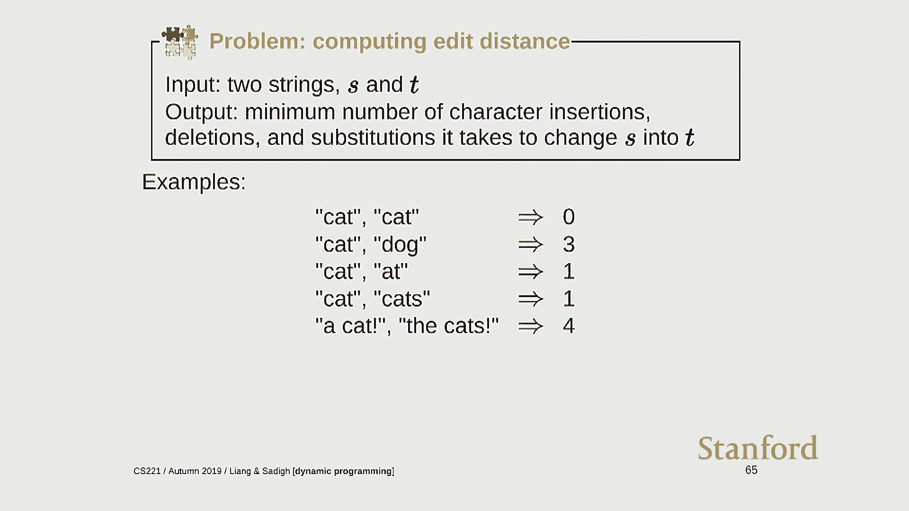

 So the input is you're given two strings。 I'm going to start writing over here on the board just to work this out。

 So you're given two strings， S and T。 So for example， a cat and the cats。 Okay。

 so these are two strings。 And you want to find the minimum number of edits that is needed to take transform S into。

 T。 And by edits， I mean you can insert a character like you can insert S。 You can delete characters。

 I can delete this A and you can substitute one character for another so you can replace。

 this A with a T。 Okay， so here's some examples。 What's the edit distance of cat and cat at zero？

 You don't have to do anything。 Cat and dog is three。 And at is one you insert the A or insert the C。

 Cat and cat is one。 And a cat and the cat is four。 Okay？

 So the challenge here is that there are quite a different number of ways to insert and delete。

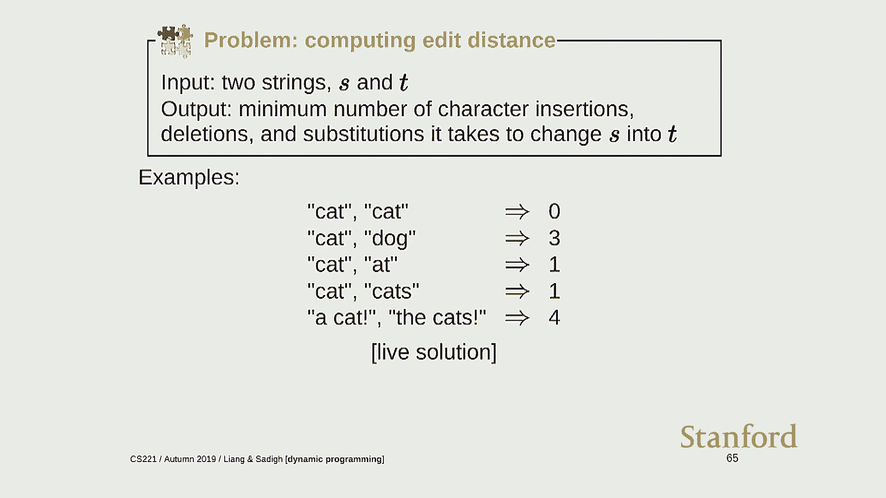

 So if you have a string of that's very long， they're just way too many things to just try。

 out all of them。 Okay， so then how do we go about coming up with a solution？ So any ideas？ Yeah。

 >> [INAUDIBLE]， >> Yeah， so let's try to simplify the problem a bit。

 So building up on what was said。 So one thing to note is that， okay， we're。

 so the general principle， let me just write， the general principle。

 is to reduce the problem to a simpler problem。 Because then you can hopefully solve。

 it is easier to solve and then you can maybe keep， on doing that and get something that's trivial。

 Okay， so there's maybe two observations we can make。 One is that， well。

 we're technically saying we can insert into S， right？ But if we insert into S。

 it makes the problem kind of larger in some sense， right？ I mean， that's not good。

 That's not reducing the problem。 But when we're inserting to S。

 we probably want to insert things which are in T。 We want to cancel something out， right？

 So we want to insert a K there for any reason。 We probably want to insert an S in which case。

 you know， S matches that and then we've reduced， that problem， right？

 So we can actually think about， you know， inserting into S to S as equivalent to kind。

 of deleting from T。 Okay， does that make sense？ All right。

 so another observation we can make is that， you know， we can start inserting， anywhere。

 We can start inserting here and then jump over here and do this。 But this just introduces a lot of。

 you know， ways of doing it which all kind of result in， the same answer。

 So why don't we just start more systematically at one end and then just proceed and try to。

 chisel off the problem， kind of， let's say from the end。 Okay， so start at the end。 Okay。

 so now we have this problem。 I'm going to draw a problem in a little box here。

 So let's start at the end。 Yeah， question。 >> What were the reasoning that we used to reach that principle。

 start at the end？ >> The question is why are we starting at the end as opposed to， well。

 the idea is that， if you start at the end then you have kind of a more systematic and consistent way of。

 you know， reducing the problem。 So you don't have to think about all the permutations of where I can。

 you know， delete， and substitute。 >> Why is more systematic to both on the right to the left than on the left to the right？

 >> We can also do left to right。 So the end or the start is both fine。 This is just。

 I just picked the end。 Yeah。 >> How do we know starting at one end can give us the optimal strategy？

 >> Yeah， the question is how do we know that starting at one end can give you the optimal， strategy？

 So you know， if you wanted to prove this more rigorously， there's some work but I'll just。

 try to give you an intuitive answer。 Suppose you didn't start at the end and you just made a sequence of steps。

 Like I insert here， I delete here and then I went over here and did all those operations， to S。

 I could have equivalently also just sorted those by， you know， where it was happening。

 and then just proceeded from one end to the other and I would arrive at the exact same， answer。

 So without lots of generality， I can start that。 Any other questions？ Okay， so yeah。

 >> Instead of doing this， we'll look the more on the approach we try to recognize some patterns。

 instead of doing this。 I mean between it's two strings， S and T。

 like some sort of pattern and the equivalent of， the S and T string。 >> Yeah。

 so the question is maybe you can recognize some patterns。 Wow， let's like， oh， cat。

 So that's maybe those should be lined up。 I guess these examples are chosen so that these patterns exist but we want to solve the。

 problem for cases where the pattern might not be obvious。

 It could be we want to work it to work for all strings。

 Maybe there is no pattern and we still would want to kind of efficient algorithm to do it。 Yeah。

 >> Now we just like use dynamic programming。 Like we go one by one。

 there was always like basically two steps。 Either we're doing substitution or otherwise it's like the same character or we have to。

 insert。 >> Yeah。 >> And then we keep going and we just like remember each like two strings that we have。

 at one point so that if we got weighted that we don't have to do it again。 >> Yeah， yeah。

 >> That's it。 >> Yeah。 Yeah。 Yeah。 So that's what I'm kind of trying to build up from build up to。

 Okay。 So， so if you look at this， so dynamic programming is a kind of general technique that essentially。

 allows you to express a more complicated problem in terms of simpler problem。

 So let's start with this problem。 If we start at the end。

 if the two match then well we can just immediately， you know， delete。

 these two and it's going to be the same。 So we can get some free rides there。 Okay。

 But when they differ， now we have many options。 So what we could we do？ Well we could， you know。

 substitute。 Okay。 We can change the T to an S。 So what does that leave us with？

 So I can do a cat's T is the cat。 So I can substitute。 Okay。 What else can I do？

 Someone say something I can do。 So I can insert， insert where？ So I can insert an S， right？

 But that's the same as， you know， by one deleting from T。

 So but I can basically also just delete this S。 So this is a cat and I deleted this S from T。 Okay。

 So this is， let's call it， you know， I guess let's call this insertion。 It's technically insertion。

 And then finally what can I do？ I can also remove T。 So A， K， C， A， T， the cat。 Okay。

 So this is delete。 And right now you're probably looking at this like well obviously you know you should do。

 this one but in general it's hard to tell。 Right， I just gave you some arbitrary strains， you know。

 who knows what the right answer， is。 So in general how do you pick？ Yeah。 >> The second one。

 the T is supposed to be the cat。 >> You mean this one？ So here I inserted an S， right。

 but then because there's two S's here I just cancel。

 them out and so you can think about this is really the lean from the T。

 >> We're just not considering。 >> Yeah， yeah， yeah。

 so because of this I'm kind of trying to reframe the problem。 Okay， so which one should I choose？

 Yeah。 >> What about the substitute to the other way？

 >> The substitution the other way meaning change。 >> That's too many。 >> Sorry。

 there's too many S's in T's here which is a big big unfortunate。

 >> I think replace the last S pass the T。 >> Oh， you could。 >> To eliminate that。

 >> You can think about that as kind of equivalent。

 So if you identify two letters that you want to make the same then you can replace the one。

 to be the other or the other to be the other。 I mean officially we've been kind of framing it as we're only editing S which is the reason。

 that it's size and I'm checking。 Okay so which one of these？ Door A， door B or door C？ Yeah。

 >> Would you look for somebody that's in T for every step that you want because there's。

 cat both of them？ >> Yeah， so you could try to look inside but remember these might be really complicated。

 So we want a kind of a simple mechanized procedure to tell。 The next letter。 Yeah。

 let's pretend these are， you can't see inside。 >> With each of the different cases？ >> Yeah。

 okay so let's keep on going。 So I'm not going to draw anything but you can also try to break this down into maybe。

 there's three actions here and three actions here。

 And at the end of the day you hopefully have a problem that's simple enough that we're。

 as equals to something than you're done。

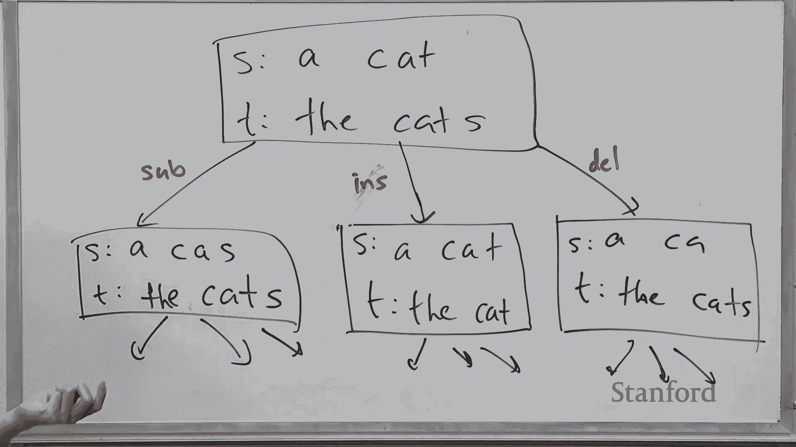

 But then how do I know？ Suppose I've solved this。 Suppose someone just told you。

 okay I know this cost， I know this cost， I know this cost。 What should you do？ >> Minimum。 >> Yeah。

 you should take the minimum， right？ Like remember we want to minimize the edit distance so there's three things you can do。

 Each of them has some cost of doing that action which is one， every edit is the same。

 cost and then there's a cost of continuing to do whatever you're doing。

 So we're just going to take the minimum of the blocks。 Yeah？ >> [INAUDIBLE]， >> Yeah。

 so I was trying to argue that if you're going to write the left it's without， lots of generality。

 Because if you went left to right or in some other order you can also replay the edits。

 >> [INAUDIBLE]， >> Yeah， I think it works。 Okay， so let's try to code this up and see if we can make this simple。

 This program work。 Okay， so I'm going to do edit distance。 Can everyone see this？ Okay。

 so I'm going to define a function， it takes two strings and then I'm going to define， a recurrence。

 So recurrences are， I guess one word I haven't really used but this is really the way you。

 should kind of think about dynamic programs and this idea of taking complex problems and。

 breaking it down。 So I'm going to show up in search problems， MDPs and games。

 So I guess it's something that you should really be comfortable with。

 So let's define a recurrence as follows。 So remember at any point in time I have。

 let's say a sub problem and since I'm going right， to left。

 I'm only considering the first m letters of s and the first letters of t。 Okay。

 so recurse is going to return the minimum edit distance between two things。

 The first m letters of s and the first n letters of t。

 I'm going to post this online so you guys don't have to try to copy this。 Okay， so。 Okay。

 suppose I'm going to， I'm going to define this function。 If I had this function。

 what should I return？ Recurse of。 So m is the integer， right？

 So n is an integer so I'm going to return the length of m and the length of m。 Okay。

 so that's kind of the initial state。 Okay， so now I need to fill out this function。 Okay。

 so let's consider a bunch of cases。 So here's some easy cases。 Suppose that m is zero， right？

 So I have comparing an empty string with something that has n letters。

 So what should the cost of that be？ I heard some long one。 It should be n。

 And symmetrically if n is zero， then result should be m。 And then if。

 now we come to the kind of initial case that we consider， which is the n's acting， that。 So if s。

 the last letter of m， near and ill， this is zero base indexing， so that's why， there's a minus one。

 So if this matches， then what should I do？ So now I reduce this to a sub problem， right？

 So I have n minus one， n minus one。 Okay？ And now comes the fun case which we looked at。 So there's。

 in this case， the last letter doesn't match。 I'm going to have to do some sort of edit。

 Can't just let it。 Yeah。 >> We weren't doing a full S to T compare or S through m and S through n compared？

 >> We weren't doing a full S to T compare。 >> What was it already？ >> Rather than reading until。

 why is it？ >> Yeah。 >> It's doing like the last letter。

 >> There's probably a way you can make this more efficient。

 I'm just going to try to get the basic thing。 Okay， so substitution。 Okay。

 so what's the cost of a substitution？ I pay one to do the substitution， but as a reward。

 I get to reduce the problem to n minus， one and n minus one， right？

 So I lop off a letter from S and I lop off a letter from T。 So what else can I do？ So I can delete。

 So that also costs one。 And when I delete， I delete from S and then n， so this remains the same。

 And then now you can think about the insertion is n minus one， right？

 Because remember insertion into S is deletion from T， that's why this is n minus one。 Okay。

 and then the result is just going to be a minimum of all these things。 Okay， return result。 Okay。

 so just， and then how do I call this function？ A cat。 The cat。 So let me print out the answer。

 Let's see if it works。 Okay， print out four。 Therefore I conclude it works now。 I mean。

 if you were doing this， you probably want to test this a more， but in the instrument， of the time。

 I'll kind of move on。 So let me just kind of refresh。 Okay。

 so I'm computing this edit distance between two strings and we're going to define。

 a recurrence that works on subproblems where the subproblem is the first m letters of S。

 and the first n letters of T。 And the reason I'm using integers instead of strings is to。

 avoid like string copying implementation detail， but it doesn't really matter。 So base cases。

 So you want to reduce your problem to a case where it's trivial to solve。

 And then we have the last letter matches and then we have the letter doesn't match and。

 you have to pay some sort of cost。 I don't know which action to take， so I'm going to take them。

 you know， minimum of all， them。 And then I call it by just calling never curse。 Okay。

 so this is great， right？ So now I have a working thing。 Let's try another test case。

 So I'm going to make this， so if I do times 10， this basically replicates this string 10， times。

 So it's a longer string。 Okay， so now I'm going to run it。 Maybe I shouldn't wait for this。

 There is a base case。 I think it works， but it's， what's wrong with this code？ Yes， it's very slow。

 Why is it slow？ [inaudible]， Yeah， right。 So I'm recursing every point recurses three times。

 so you kind of get this exponential， blow up。 So there's kind of a， how do you solve this problem？

 [inaudible]， Yeah， you can memo， I think I heard the word memoize。

 which is another way to kind of think， about memoize plus， I guess recurrences is dynamic program。

 I guess。 So I'm going to show you kind of this way to do it， which is pretty uninvasive。

 And generally I recommend people， well， get the slow version working and then try to make。

 it faster。 Don't try to be too slick at once。 Okay， so I'm going to make this cache， right？

 And I'm going to say if MN is in the cache， then I'm going to return whatever is in the， cache。

 So the cache is just the dictionary mapping the key， which is identification of the problem。

 I'm interested in solving and the result， which is the answer that I computed。

 So if I were to compute it， I don't need a computer again， just return it。 And then at the end。

 if I have to compute it， then I have to put this in the cache。 Okay， so three lines， four lines。

 I guess。 Yeah。 Yeah， that's a great point。 This should be outside of the recurrences。

 Glad you guys are paying attention。 Otherwise， yeah， it would do basically nothing。

 Any other mistakes？ Yeah。 There are some function decorators that like implement normalizing for you。

 In this class， are you okay if we use that， or would you rather make our own in this case？

 You can use the decor。 You can be fancy if you want。

 But I think this is pretty transparent and easy for learning purposes。 Okay， so let's run this。

 So now it runs instantaneously as opposed to， I actually don't know how long it would have。

 taken otherwise。 Okay。 And Sandy， check for D is probably the right answer because there's four was the original。

 answer and I multiply by 10。 Okay， any other questions about this？ So this is an example of。

 you know， kind of basic dynamic programming， which are you solve。

 a problem trying to formulate as a recurrence of a complicated problem in terms of smaller。

 problems。 And like I said before， this is going to kind of show up over and over again in this class。

 Yeah？ Yeah， the question is why does this reduce redundancy？ Is that right？

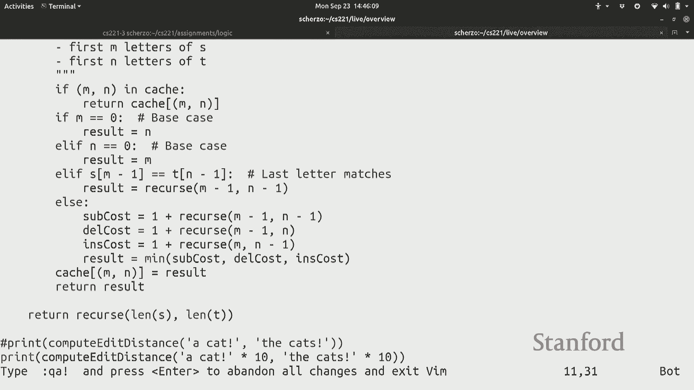

 So maybe I can do it kind of pictorially。 If you think about， let's say you have a problem here。

 right， and this gets reduced to， I'm just， making kind of an arbitrary diagram here。

 So this problem gets reduced to these two and this problem gets reduced to these two and， so on。

 Right？ So if you think about， if you didn't have memorization， you would just be paying for。

 the number of paths。 Every path is kind of you have to compute from scratch。

 Whereas if you do memorization， you pay in the number of nodes here， which a lot of this， is shared。

 Like here， you know， once you compute this， no matter if you're coming from here or here。

 you're kind of using the same value。 Okay。 So let's move on。

 So the second problem we're going to talk about is has to do with continuous optimization。

 And the motivating question here is how do you do regression， which is the kind of a。

 bread and butter of machine learning here。 So here we go。 Okay。 So imagine you get some points。

 Okay。 So I give you a point， which is 2-4。 And then I give you another point， let's say 4-2。

 And so these are data points。 You want to， let's say， predict housing price from， you know。

 square footage or something， like that。 And predict health score from， you know。

 blood pressure and some other things。 So this is pretty common in machine learning。

 And the question is how do you fit， you know， a line？

 I'm going to kind of consider the case where your line has to go through the origin just。

 for simplicity。 So you might want to like find， you know， a fit。 I mean。

 two points is maybe kind of a little bit degenerate， but that's a simple example。

 we're going to work with。 In general， you have lots of points and you want to fit the line that best kind of is。

 close to the points。 Okay。 So how do you do this？ So there's a principle called least squares。

 which says， well， if you give me a line， which， is given in this case by a slope w。

 I'm going to tell you how bad this is。 And badness is measured by looking at all the training points and looking at these distances。

 Right？ So here I have， you know， this particular， a particular， let's say point， you know， xi。

 If I hit it with w， then I get basically the， you know， the y intercept here， not the y， intercept。

 but the， like the y value here。 That's my prediction。 The real value was， you know， yi， which is。

 you know， up here。 And so if I look at the difference， I want that difference to be zero。 Right？

 So in least squares， I square this and I say， I want this to be as small as possible。 Right？

 Now this is only for one point， so I'm going to look at all the points。

 Let's suppose I have n points。 And that's a function that I'm going to call f of w。

 which basically says for a given weight， vector， which is a slope。

 giving a number that characterizes how bad of a fit this is。

 Where zero means that I fit everything perfectly and large numbers mean that I fit。 Okay？ All right。

 So that's no regression。 So how do I solve a regression problem？ So how do I optimize this？

 Can you do this in your head？ So if I actually had these two points， what should w be？ Okay。

 It doesn't matter。 We'll compute it。 So how do we go about doing this？ So one principle。

 which is maybe another general takeaway is abstract away the details。 Right？

 This is also true with the dynamic program。 But sometimes you know you get。

 if you're too close to bored and you're looking at， oh， man。

 these points are here and I need to fit this line。 How do I do that？

 You kind of get kind of a little bit stuck。 But why don't we think about this F as say some function？

 I don't really care what it is。 Let's plot this function。 Okay。 So now this is a different plot now。

 This is the weight and this is F of w。 Always label your axes。

 And let's say this function looks like this。 Okay。 So which means that for this slope。

 I pay this amount， for this slope， I pay this amount， and so on。 And what do I want to do？

 I want to minimize F of w， which means I want to find the w which has the least value of， F of w。

 Right？ Question？ Okay。 So you take the derivative。 So what does the derivative give you？

 It tells you where to move， right？ So if you look over here， so you can't， in general。

 you might not be able to get there， directly。 In this actually particular case you can because you can solve in closed form but I'm going。

 to try to be more general。 So if you start here， this derivative tells you， well。

 the function is decreasing if you， move to the right。 So then you should move to the right。

 Whereas over here， if you end up over here， the derivative says the function is decreasing。

 if you move to the left， so you should move to the left。

 So what I'm going to introduce is this algorithm called gradient descent。

 It's a very simple algorithm。 It basically says， start with some place and then compute the derivative and just follow。

 your nose。 Right？ If it derivatives as it's negative。

 then just go this way and now you're at a new point and， you compute the derivative again。

 you descend and now you compute it again and then maybe。

 you compute the derivative and it says keep on going this way， maybe you overshoot and。

 then you come back and then hopefully you'll end up at the minimum。

 So let's try to see what this looks like in code。 So gradient descent is one of the simplest algorithms but it really underlies essentially。

 all the algorithms that you people use in machine learning。 So let's do points。

 We have two points here。 I'm not going to define some functions。 So f of w。

 So what is this function？ So I'm going to sum over all the different。

 basically at this point it's converting math。

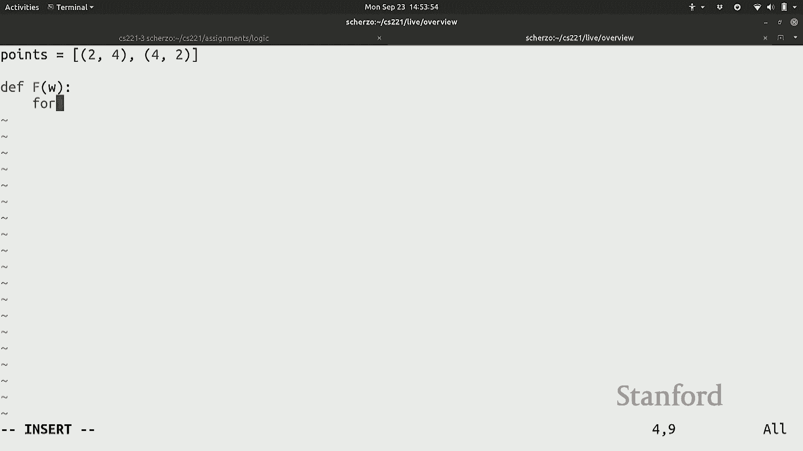

 into Python。 So I'm going to look at all the points。 So for every x， y。

 what the model predicts is w times x minus y and if I square that。

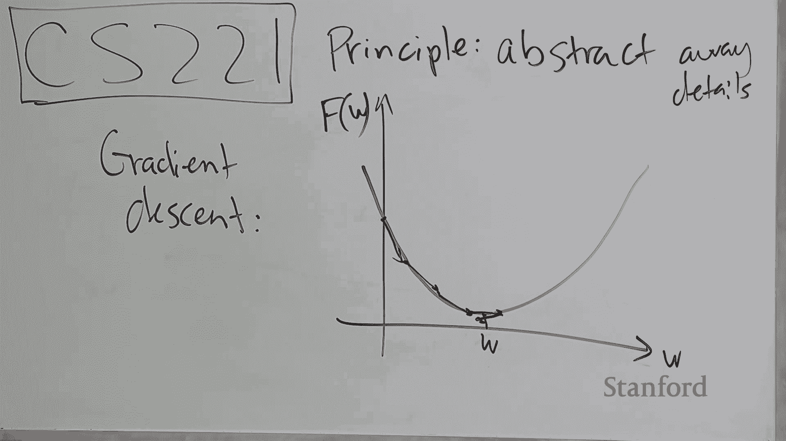

 that's going to be the error that it get on that point。

 And then if I sum over all of these errors then I get my objective function。 Okay？ [INAUDIBLE]。

 A ray of， yeah， so you can put a ray here if you want but it doesn't， it's actually fine。 Okay。

 so now I need to compute the derivative。 So how do you compute the derivative？

 So if your calculus is a little bit rusty you might want to brush up on it。

 So what's the derivative？ Remember we're taking derivative with respect to w， right？

 There's a lot of symbols here。 Always remember what you're taking derivative with respect to。 Okay。

 so derivative of the sum is the sum of the derivative。 So now I need to take the derivative of this。

 right？ And what's the derivative of this？ Well， something squared。

 You bring the two down here and now you multiply by the derivative of this。

 And once the derivative of this should be x， right？ Because this is a。

 why this is a constant and w derivative of w times x with respect to， w is x。 Okay， so that's it。

 Okay， so now let's do gradient descent。 Let's initialize with w equals zero。

 And then I'm going to just iterate 100 times。 Normally you would set some sort of stopping condition but let's just keep it simple。

 for now。 Okay， so for every moment I'm going to， I have a w。

 I can compute the value of the function and I'll also take the gradient of the derivative。

 Gradient just means derivative in higher dimensions which we'll want later。 Okay。

 and then what do I do？ I take w and I subtract the gradient。 Okay？ So remember， okay。

 I'll be out of， yeah。 So I take the gradient， remember I want to have the gradient。

 gradient tells me where the， function is increasing so I want to move in the opposite direction。

 And eta is just going to be this step size to keep you things under control。

 We'll talk more about it next time。 Okay， so now I want to do a， a， a， what's going on here。

 So iteration， print out the function and t value。 Okay？ All right， so let's compute the gradient。

 And so you can see that the iteration， we first start out with w goes zero then it moves， to 0。

3 and then it moves to 0。799999 and then it looks like it's converging to 0。8。

 And meanwhile the function value is going down from 20 to 7。2 which happens to be optimal， answer。

 So the correct answer here is point point。

 Okay， so that's it。 Next time we're going to keep。

 we're going to start on the machine learning lecture。 Okay。 Okay。

 Okay。 Okay。 Okay。 Okay。

