# P10：Lecture 10 Game Playing 2 - TD Learning Game Theory - 鬼谷良师 - BV16E411J7AQ

 Let's start guys。

 Okay， so we're going to continue talking about games today。 Just quick announcement。

 The project proposals are due today。 I think you all know that。 All right， so let's go。 Tomorrow。

 Tomorrow。 Right。 It's checking。 Yeah， today is not Thursday。 Yeah。 Tomorrow。 Of course。

 I can not thought it's Thursday。 All right， so let's talk about games。

 So we started talking about games last time。 We formalized them。 We talked about non。

 We talked about zero sum two player games that were turn taking。 Right。

 And we talked about a bunch of different strategies to solve them。

 Like the minimax strategy or the expectimax strategy。

 And today we want to talk a little bit about learning in the setting of games。

 So what does learning mean？ How do we learn those evaluation functions that we talked about？

 And then towards the end of the lecture， we want to talk a little bit about variations of the games you have talked about。

 So how about we have， how about the cases where we have simultaneous games or non zero sum games？

 So that's the plan for today。 So I'm going to start with a question that you're actually going to talk about it towards the end of the lecture。

 So let's think about a setting where we have a simultaneous two player zero sum game。

 So it's a two player zero sum game similar to the games we talked about last time。

 but it is simultaneous。 So you're not taking turns。 You're playing at the same time。

 And an example of that is rock paper scissors。 So can you still be optimal if you reveal your strategy？

 So let's say you're playing with someone。 If you tell them what your strategy is。

 can you still be optimal？ That's the question。

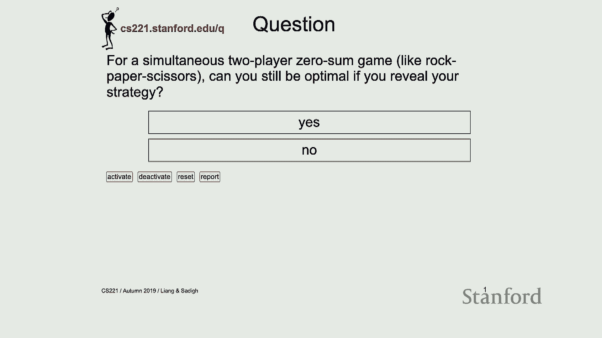

 Smaller and then in space where they know exactly what you're going to play。

 you will be successful if you for a zero sum real time， so it's a larger scale。

 I think you could still be successful if that approach is like superior to the others。

 So it's not so so so the answer was about the size of the game。

 So rock paper scissors being small versus versus not being small。

 So so the question is more of a motivated thing。 So we'll talk about this in a lot of details towards the end of the class。

 It's actually not the size that matters。 It's a type of strategy that you play that matters。

 It's just to give you an idea。 But like the reason that we have put this。

 I guess at the beginning of the lecture is intuitively， when you think about this， you might say。

 no， I'm not going to tell you what my strategy is。 Right？

 Because if I say I'm going to play like scissors， you'll know what to play。

 But this has an intuitive answer that we're going to talk about towards the end of the lecture。

 So just more of a motivating example。 Don't think about it too hard。

 All right。 So so let's do a quick review of games。

 So so last time we talked about having an agent and opponent playing against each other。

 So and you were playing for the agent and the agent was trying to maximize their utility。

 So they were trying to get this utility。 The example we looked at was agent is going to pick bucket A。

 bucket B or bucket C。 And then the opponent is going to pick a number from these buckets。

 They can either pick minus 50 or 50， one or three or minus five or 15。

 And then if you want to maximize your utility as an agent， then you can potentially think。

 that your opponent is trying to trying to minimize your utility。

 And you can have this minimax game kind of playing against each other。 And based on that。

 decide what to do。

 So we had this minimax tree and based on that， the utilities that are going to pop up are， minus 50。

 one and minus five。 So if your goal is to maximize your utility， you're going to pick bucket B。

 the second bucket， because that's the best thing you can do， assuming your opponent is a minimizer。

 So so that was kind of the setup that we started looking at。

 And the way we thought about solving this game was by writing a recurrence。 So so we had this value。

 this is V， which was the value of a minimax at state S。 And if you're at the utility， sorry。

 if you're at an end state， you're going to get utility， of S， right？

 Like if you get to the end state， we get the utility because we get the utility only at。

 the very end of the game。 And if the agent is playing。

 the recurrence is maximize V of the successor states。 And if the opponent is playing。

 we want to minimize the value of the successor states。

 And so that was the recurrence we started with。 And we looked at games that were kind of large。

 like the game of chess。

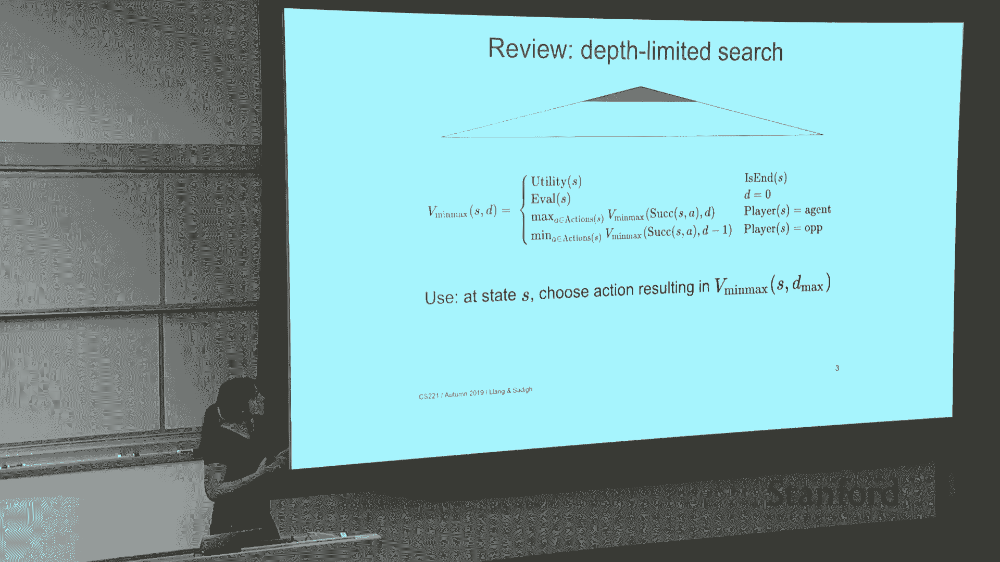

 The game of chess， the branching factor is huge。 The depth is really large。

 It's not practical to do the recurrence。 So we started talking about ways for speeding things up。

 And one way to speed things up was this idea of using an evaluation function。 So do the recurrence。

 but only do it until some depth。 So don't go over the full tree。 Just do it until some depth。

 And then after that， just call an evaluation function。 And hopefully your evaluation function。

 which is kind of this weak estimate of your， value。

 is going to work well and give you an idea of what to do next。 So instead of the usual recurrence。

 what we did was we decided to add this D here。 This D right here。

 which is the depth set until which we are exploring。

 And then we decrease the value of depth after an agent and opponent plays。

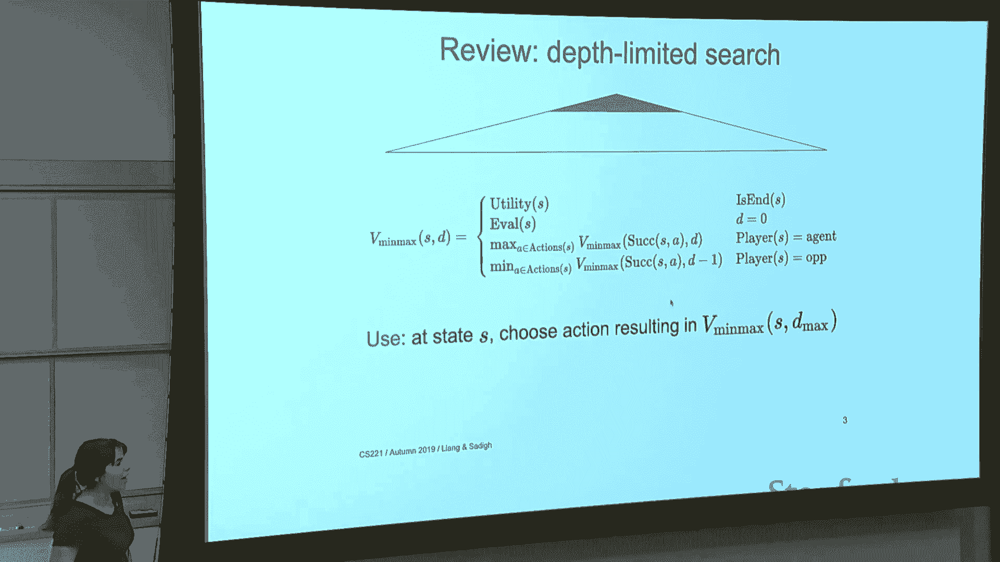

 And then when depth is equal to zero， we just call an evaluation function。 So intuitively。

 if you're playing chess， for example， you might think a few steps ahead。

 And when you think a few steps ahead， you might think about how the board looks like。

 And kind of evaluate that based on the features that that board has。 And based on that。

 you might decide to take various actions。 So similar type of idea。 And then the question was， well。

 how are we going to come up with this evaluation function？

 Like where is this evaluation function coming from？

 And then one idea that we talked about last time was it can be handcrafted。

 The designer can come in and sit down and figure out what is a good evaluation function。

 So in the game of chess， the example is you have this evaluation function that can depend on the number of pieces you have。

 the mobility of your pieces， maybe the safety of your king， central control。

 all these various things that you might care about。

 So the difference between the number of queens that you have and your opponent's number of queens。

 these are things， these are features that you care about。

 And potentially a designer can come in and say， well。

 I care about nine times more than I care about how many pawns I have。

 So you can actually hand design these things and write down these weights about how much you care about these features。

 So I'm using terminology from the learning lecture。

 I'm saying we have weights here and we have features here and someone can come and just handcraft。

 Well， what other thing we can do is instead of handcrafting it。

 we could actually try to learn this evaluation function。 So we can still handcraft the features。

 we can still say， well， I care about the number of kings and queens and these sort of things that I have。

 but I don't know how much I care about them。 And I actually want to learn that evaluation function。

 like what the weights should be。 So to do that， I can write my evaluation function。

 eval of S as this V as a function of state， parameterized by weights， Ws。

 And then my goal is to figure out what these Ws， what these weights are and ideally I want to learn that from some data。

 So we're going to talk about how learning is applied to the game setting and specifically the way we are using learning for these game settings。

 is to just get a better sense of what this evaluation function should be from some data。

 So the questions you might have right now is， well， how does V look like？

 Where does my data come from？ Because if you know where your data comes from and where your V is。

 then all you need to do is to come up with a learning algorithm that takes your data。

 and tries to figure out what your V is。 So we're going to talk about that at the first part of the launch。

 And that kind of introduces to this temporal difference learning。

 which we're going to discuss in a second。 It's very similar to Q learning。

 And then towards the end of the class， we'll talk about simultaneous games and non-zero assumptions。

 All right。 So let's start with this V function。 I just said， well。

 this V function could be parameterized by a set of weights， a set of Ws。

 And the simplest form of this V function is to just write it as a linear classifier。

 as a linear function of a set of features。 Ws times Ps。

 And these Ps are the features that are hand-coded and someone writes them and then I just want to figure out what Ws are。

 So this is the simplest form。 But in general， this V function doesn't need to be a linear classifier。

 It can actually be any supervised learning model that we have discussed in the first few lectures。

 It can be a neural network。 It can be anything even more complicated than neural network。

 That just does regression。 So we can basically， any model you could use in supervised learning could be placed here as this V function。

 So all I'm doing is I'm writing this V function as a function of state and a bunch of parameters。

 Those parameters， in the case of linear classifier， they're just Ws。

 And in the case of the neural network， they're Ws and these Vs。 In this case of one layer。

 [INAUDIBLE]， [INAUDIBLE]， Yeah， one layer。 All right， so let's look at an example。

 So let's think about an example。 And I'm going to focus on the linear classifier way of looking at this just for simplicity。

 So， okay， let's pick a game。 So we're going to look at backgammon。 So this is a very old game。

 It's a two-player game。 The way it works is you have the red player and you have the white player。

 And each one of them have these pieces。 And what they want to do is they want to move all their pieces from one side of the board to the other side of the board。

 It's a game of chance you can actually like roll two dice。 And based on the outcome of your dice。

 you move your pieces various amounts to various columns。 There are a bunch of rules。

 So your goal is to get all your pieces off the board。

 But if you have only like one piece and your opponent like gets on top of you。

 they can push you to the bar and you have to like start again。 There are a bunch of rules about it。

 Read about it on Wikipedia if you're interested。 But you're going to look at a simplified version of it。

 So in this simplified version， I have player O and player X。 And I only have four columns。

 I have columns 0， 1， 2， and 3。 And in this case， I have four of each one of these players。

 And the idea is we want to come up with features that we would care about in this game of backgammon。

 So what are some features that you think might be useful？ Remember the learning lecture。

 How do we come up with like feature templates？ We try to still down with the core components of the state。

 So maybe like the location of the X's and the O's， the number of them。 Yeah。

 So like what idea is we have all these knowledge about the board。

 So maybe we should like care about the location of the X's。

 Maybe we should care about like where the O's are。 How many pieces are on the board？

 How many pieces are off the board？ So similar type of way that we come up with features in the first few lectures。

 We were basically we would do the same thing。 So feature templates。

 set of feature templates could look like this。 Like number of X's or O's in column。

 whatever column being equal to some value or a number of X's or O's on the bar。

 Maybe fraction of X's or O's that are removed。 Whose turn it is。

 So these are all like potential features that you could do。 So for this particular board。

 here are what those features would look like。 So if you look at number of O's in column zero equal to one。

 that's equal to one。 Remember we were using these indicator functions to be more general。

 So like here again， we are using these indicator functions。

 You might ask number of O's on a bar that's equal to one。 Fraction of O's that are removed。

 So I have four pieces。 Two of them are already removed。 So that's one half。

 Number of X's in column one equal to one。 That's one number of X's in columns。 Three equal to three。

 That's one。 It's O's turn。 So that's equal。 So we have a bunch of features。

 These features kind of explain what the sport looks like or how good the sport is。

 And what we want to do is we want to figure out what are the weights that we should put for each one of these features and how much we should care about each one of these features。

 So that is the goal of learning here。 All right。 So that was my model。

 So far I've talked about this V S of W。 I've defined it as a linear class as a linear predictor。

 W is times features。 And now the question is where do I get data？ Like if I'm doing learning。

 I got to get data from summer。 So what I did that we can use here is we can try to generate data based on our current policy。

 And we can use it as a linear predictor。 And we can use it as a linear predictor。

 And we can use it as a linear predictor。 And we can use it as a linear predictor。

 And we can use it as a linear predictor。 And we can use it as a linear predictor。

 And we can use it as a linear predictor。 And we can use it as a linear predictor。

 And we can use it as a linear predictor。 And we can use it as a linear predictor。

 Policy for the opponent is just argument of that V function。 And then when I call these policies。

 I get a bunch of actions。 I get a sequence of like states based on how we are following these policies。

 And that is some data that I can actually go over and try to make my V better and better。

 So that's kind of how we do it。 We call these policies。 We get a bunch of episodes。

 We go over them to make things better and better。 So that's kind of the key idea。

 So the real question you might have at this point is， is this deterministic or not？

 Like do I need to do something like epsilon greedy？ So in general。

 you would need to do something like epsilon greedy。 But in this particular case。

 you don't really need to do that because we have a。

 like we have this diet that we are actually rolling the dyes。 And by rolling the dyes。

 we are getting different random path that we might take。 So that might take us to different states。

 So we kind of already have this， this element of randomness here that does some of the exploration for us。

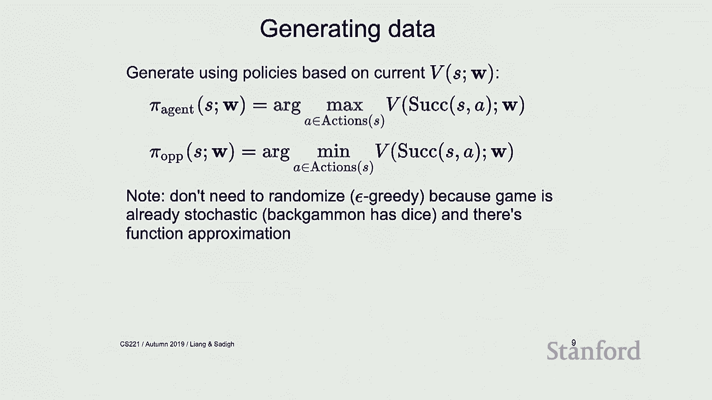

 You just mean like an explorer to it？ Yes。 So why epsilon greedy？

 What I mean here is do I need to do an extra exploration？

 Am I going to get stuck like in particular set of states if I don't do exploration？

 And in this particular case， because we have this randomness， we don't really need to do that。

 In general， you might imagine having some sort of epsilon greedy to take us explore a little more。

 Okay， so then we generate episodes and then from these episodes， we want to learn。

 These episodes look like state action reward states。

 and then they keep going until you get a full episode。

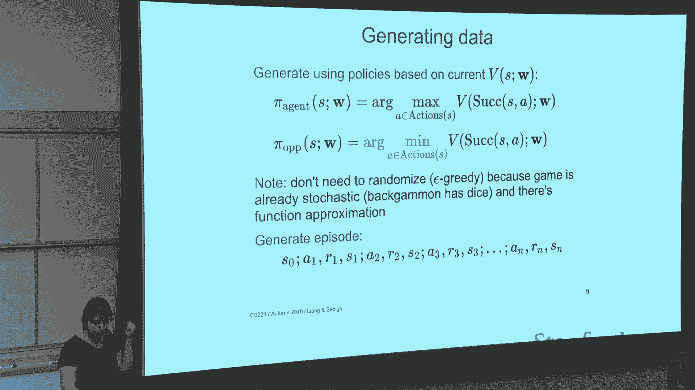

 One thing to notice here is the reward is going to be zero throughout the episode until the very end of the game。

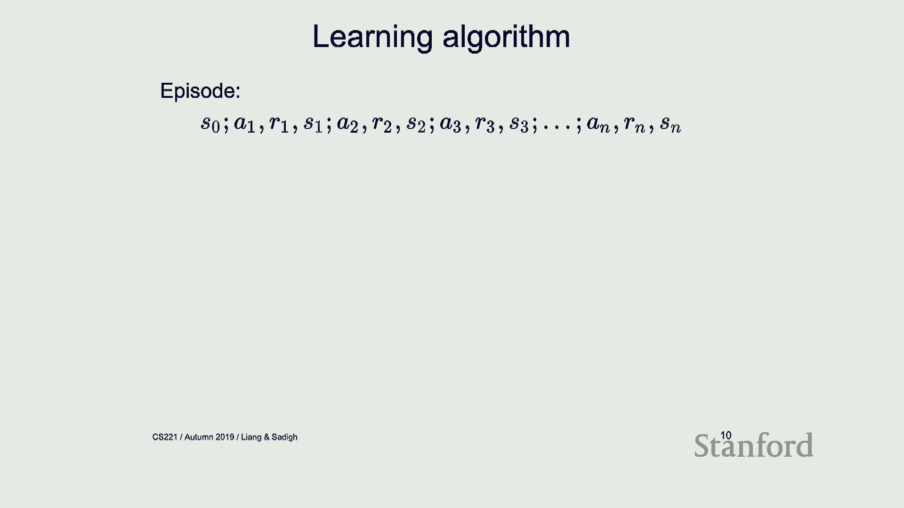

 Until we end the episode and we might get some reward at that point or we might not。

 But the reward throughout is going to be equal to zero because we are playing a game。

 Like we are not getting any reward type of game。 And if you think about each one of these small pieces of experience as a are as prime。

 you can try to learn something from each one of these pieces of experience。 Okay。

 so what you have is， you actually go on board maybe。

 what you have here is you have a piece of experience。

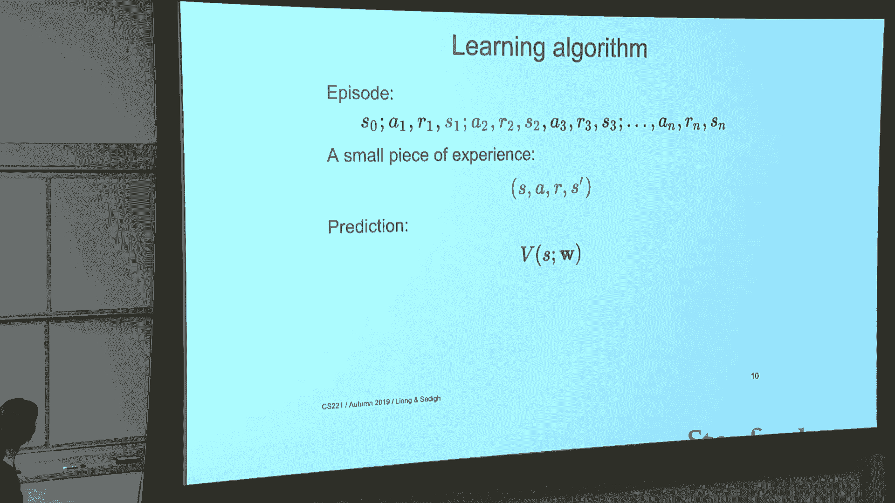

 Let's call it S， A， you get some reward， maybe it is zero， that's fine if it is zero。

 And you go to some S prime through that。 So， S take an action， get a reward， and get a reward。

 You go to some S prime from that。 And you have some prediction， right？

 Your prediction is your current， like your current V function。 So。

 your prediction is going to be this V function at state S， parameterized with W。

 And this is what you already， like you kind of know right now。

 this is your current estimate of what he is。 And this is your prediction。

 I'm writing the prediction as a function of W， right？ Because it depends on W。

 And then we had a target that you try to get to。 And my target， which kind of acts as a label。

 is going to be equal to my reward， the reward that I'm getting。 So， it's kind of the。

 so if you look at this V of S and W， well， what's kind of close-ish to reward plus。

 I'm going to write discount factor。 Yeah， V of S prime。 Right， so my target。

 the thing that I'm trying to get to is the reward plus gamma V of S prime， W。 So。

 we're playing games， and games gamma is usually one。 I'm going to keep it here for now。

 but I'm going to drop it at some point。 So， you don't need to really worry about gamma。

 And then one other thing to notice here is I'm not writing target as a function of W because target acts kind of like my label。

 Right， if I'm trying to do regression here， target is my label。

 It's kind of the ground truth thing that I'm trying to get to。 So。

 I'm going to treat my target as just like a value。 I'm not writing it as a function of W。 All right。

 so what do we try to do usually， like when you're trying to do learning？ You have prediction。

 we have a target。 What do I do？ Minimize the error。 So， what is there？ So。

 I can write my error as potentially a squirt error。 So。

 I'm going to write one half of prediction of W minus target squared。 This is my squirter。

 I want to minimize that。 So， with respect to W。 How do I do that？ I can take the gradient。

 What is the gradient equal to？ This is simple， right， to get canceled。 Gradient is just this guy。

 Prediction of W minus target times the gradient of this inner expression。

 The gradient of this inner expression with respect to W is the gradient of prediction with respect to W minus zero。

 I'm treating it as a number。 Let me move this up。 So， now I have the gradient。

 What algorithm should I use？ I can use gradient descent。 So， I'm going to update my W。

 How do I update it？ I'm going to move in the negative direction of my gradient using some learning rate data times my gradient。

 My gradient is prediction of W minus target times gradient of prediction of W。 All right。 So。

 that's actually what's on the slide。 So， the objective function is prediction minus target squared。

 We just took that。 The update is just this particular update where we move in the negative direction of the gradient。

 This is what you guys have seen already。 All right。 So far， so good。 So。

 this is the TD learning algorithm。 This is all it does。 So， temporal difference learning。

 What it does is it picks like these pieces of experience as a or as prime。

 Based on that pieces of experience， it just updates W based on this gradient descent update。

 Difference between prediction and target times a gradient of D。 So。

 what happens if I have this linear function？

 Let me write this in the case that I have a linear function。 So。

 what if my V of SW is just equal to W dot V of S？ Yeah， that's。 So， what happens to my update？

 Minus eta。 What is prediction？ How will you not see all this？ Right？ What is target？

 Did you find it up there？ Yeah， so this is very similar to Q learning。

 They're very minor differences that we'll talk about actually at the end of this section comparing。

 So， what is the difference between the two？ The difference between the two and the two。 So。

 what is the difference between the two and the two？

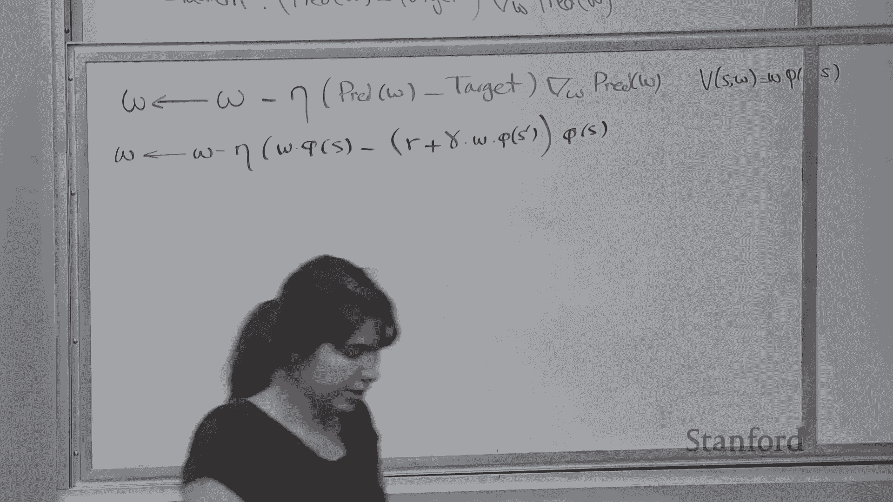

 The difference between the two and the two。 Yeah， so this is very similar to Q learning。 So。

 I want to go over an example。 It's kind of like a tedious example。

 but I think it helps going over that and kind of seeing why it works。

 Especially in the case that the reward is just equal to zero， like throughout an episode。 So。

 it kind of feels funny to use this algorithm and make it work， but it works。 So。

 I want to just go over one example of this。 I'm going to show you one episode starting from S1 to some other state。

 And I have an episode。 I start from some state。 I get some features of that state。 Again。

 these features are by just evaluating those hand coded features。 And I'm just going to start。

 What double you should I start with？ Zero。 Let me just initialize W to be equal to zero。 Okay。

 Right？ How do I update my W？ Let me just write it in this。 I want to write it in a simpler form。

 which is in another form。 So， W， the way we are updating it is the previous W minus eta times prediction minus target。

 I'm going to use PNT for prediction minus target times V of S。 This is the update you are doing。

 Okay。 Yeah， that's right。 Okay。 So， what is my prediction？ W dot T of S。 Zero。 What is my target？

 So， for my target， I need to know what state I'm ending up at。

 I'm going to end up at one zero in this episode， and I'm going to get a reward of zero。 So。

 what is my target？ My target is reward， which is zero， plus W times V of S prime。 That is zero。

 because W is equal to zero。 So， my target is equal to zero。 My P minus T is equal to zero。 So。

 P minus C is equal to zero。 This whole thing is zero。 W stays the same。 So。

 in the next kind of step， W is just zero。 Okay。 I'm going to move forward。 So。

 what is prediction here？ Zero times zero。 Prediction is zero。 What is target？ I haven't。 Yeah。

 it's zero because I haven't got anything， any reward yet。 Okay， I end up at one two。 So， yeah。

 so target is going to be a reward， which is zero， plus zero times whatever state。

 of V of S prime that I'm at。 So， that's equal to zero。 P minus C is equal to zero。

 It's kind of boring。 So， at this point， W hasn't changed。 W is equal to zero。 What is my prediction？

 Prediction is equal to zero。 It's great。 What is target equal to？ So。

 I'm going to end up in an end state where I get one zero and I get a reward of one。 So。

 this is the first time I'm getting a reward。 What should my target be？

 My target is reward one plus zero times one zero， which is zero。 So， my target is one。 So。

 what this tells me is I'm predicting zero， but my target is one。 So。

 I need to push my W's a little bit up to actually address the fact that this is equal to one。 So。

 P minus T is equal to minus one。 So， I need to do an update。 Maybe I'll do that update here。 So。

 how am I updating it？ So， I'm starting from zero zero minus。 My eta is point five。

 That's what I allowed it。 Like I put it， I defined it to be。

 My prediction minus target is minus one。 What is V of S？ V of S is one two。 Right？ So。

 what should my new W be？ What is that equal to？ Point five and then one。 So。

 I'm just doing arithmetic here。 So， my new W is going to become point five and one at the end of this one episode。

 So， I just did one episode， one full episode where W is where zero is throughout and then。

 at the very end when I got a reward， then I updated my W because I realized that my prediction。

 and target were not the same thing。 So， now I'm going to start a new episode and a new episode I'm starting is going to start。

 with this particular W。 And in a new episode， even though the rewards are going to be zero。

 throughout， we're actually going to update our Ws。 Question？ If you use two questions。

 you use the individualized way to not be zero， which you update throughout， instead of just the end。

 Yeah。 Okay， and the second question， so S born has nine of the same feature activities and S born。

 and S-4。 This is a made of exact post。 I don't think about this exact post in which the。 Well。

 is it possible to have a non-M state have the same feature vector now？ If you're in C。

 you can actually have the same state。 It is possible to have the other。

 the most of the states to have the same features， right？ You could have， like I said， up here。

 You can almost sort of sort of feature。 You could use really not representative features。

 Like if you really want S4 and S9 to differentiate between them， you should pick features that。

 differentiate between them。 And if you're kind of the same and have the same sort of characteristics。

 it's fine to， have a feature that gives the same value。 Okay。

 If we have a product before we get to the new work， that's because the final back floor is。

 on the feature vector and it's one entry that's always。 It's the one， instead of one， two。

 to kind of one， we will lead into the final state。 Then the wait for it to come to that。

 It's going to。 Yeah， it will never converge。 And that kind of tells you that that entry in your feature vector。

 you don't care about， that， right？ It's always， like， it's always staying the same。

 and if it is always zero， it doesn't matter， like what the wait of that entry is。 So in general。

 you want to have features that are differentiating and you're using it。 So for the second row。

 I'm not going to write it up because that takes time。 So， okay， so let's start with a new episode。

 You started S1 again， but now I'm starting with this new W that I have。

 So I can compute the prediction， the prediction is one， I can compute my target， it's 0。5。

 and what we realize here is we overshoot it。 So before prediction was zero， target was one。

 we were under shooting， we fixed our Ws， but now we're over shooting， so we need to fix that。

 >> [inaudible]， >> The third question on the relationship between the features and the waits。

 they always have， to be the same dimension and what it should be thinking about that would make a good。

 feature for updating the wait specifically。 >> So， okay， so first off， yes。

 they need to be always the same dimension because you're doing， this dot product between them。

 The feature selection， you don't necessarily think of it as like how am I updating the wait。

 You think of the feature selection as is it representative of how good my board is。 For example。

 in the case of backgavin or is it representative of how good I'm navigating。

 So it should be a representation of how good your state is and then it's usually like hand， line。

 right？ So it's not necessarily， you shouldn't think of it as how is it helping my wait。

 So you think of it as how is it representing how good my state is。 >> For the Blackjack example。

 if you have a threshold of 21 and then you have a threshold of 10。

 you're using the same feature extraction for both。

 How does that affect the generalizability of the model of the agent？ >> Yeah。

 so you might choose two different features and one of them might be more like。

 so there is kind of a trade-off， right？ So you get a feature that actually differentiates between different states very well。

 but then， that makes learning longer， that makes it not as generalizable。

 and then on the other hand， you might get a feature that's pretty generalizable。

 but then it might not do these specific things， that you would want to do or do differentiating factors about it。

 So picking features， it's an art， right？ So let me move forward because we have a bunch of things coming up。

 Okay， so I'll go over this real quick then。 So we now update the W based on this new value。

 And kind of similar thing， you have a prediction， you have a target， you're still over shooting。

 so you still need to update it。 And then once you update it to 。25 and 。75。

 then it kind of stays there。 Okay， all right， so this was just an example of TD learning。

 but this is the update that you have kind of。

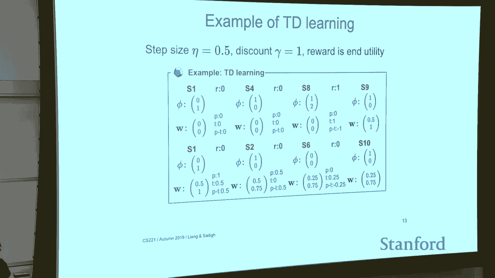

 already seen， right？ And then a lot of you have pointed out that this is similar to Q learning already。

 right？ So this is actually pretty similar。 The update is very similar。

 Like we have these gradients in the same way that we have in Q learning。

 And we are looking at the difference between prediction and target。

 same way that we are looking at in Q learning。 But there are some minor differences。

 So the first difference here is that Q learning operates on the Q function。

 The Q function is a function over state and actions。

 Here we are operating on a value function， right， on V。 And V is only a function of state， right？

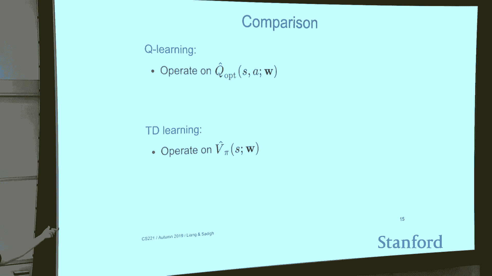

 And part of that is actually because in the setting of a game。

 you already know the rules of the game。 So you kind of already know the actions。

 You don't need to worry about it as much， the same way that you are worrying about it in Q learning。

 The second difference is Q learning is an off-policy algorithm。

 So the value is based on this estimate of the optimal policy， which is this Q opt， right？

 It's based on this optimal policy。 In the case of TD learning， it's an on-policy。

 The value is based on this exploration policy， which is based on a fixed pie。 And sure。

 you're updating the pie， but you're going with whatever pie you have and running with that。

 So that's another difference。 And then finally， in Q learning。

 you don't need to know the MDP transitions。 So you don't need to know this transition function as transition from SA to S prime。

 But in the case of TD learning， you need to know the rules of the game。

 So you need to know how the successor function of S and A works。

 So those are some kind of minor differences。 But from a perspective of how the update works。

 it is pretty similar to what Q learning does。 All right。

 So that was kind of this idea of I have this evaluation function。 I want to learn it from data。

 I'm going to generate data。 From that generated data， I'm going to update my Ws。

 So that's what we've been talking about so far。 And the idea of learning。

 using learning to play games is not a new idea actually。 So in 50s。

 Samuel looked at a checkers game program where he was using ideas from self play and ideas from similar type of things you have talked about using really smart features using linear evaluation functions to try to solve the checkers program。

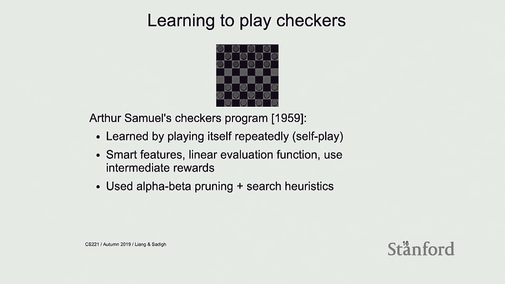

 So a bunch of other things that he did included adding intermediate rewards， so kind of throughout。

 like， to get to the end point， he added some intermediate rewards。

 used alphabetoprooning and some search heuristics。

 And then it was kind of impressive like what he did in 50s。 Like。

 he ended up having this game that was playing like I was reaching like human amateur level of play。

 And he only used like 9K of memory， which is like really impressive if you think about it。

 So this idea of learning in games is old。 People have been using it。

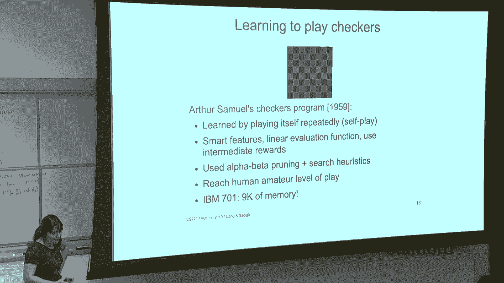

 In the case of backgammon， this was around 90s when Tessura came up with an algorithm to solve the game of backgammon。

 So he specifically used this TD Lambda algorithm， which is similar to the TD learning that we have talked about。

 It has this Lambda temperature parameter that kind of tells us how good states are。

 like as they get far from the reward。 He didn't have any intermediate rewards。

 He used really dumb features， but then he used neural networks， which was kind of cool。

 And he was able to reach human expert play and kind of gave us some insight into how to play games and how to solve these really difficult problems。

 And then more recently we have been looking at the game of Go。 So in 2016 we had AlphaGo。

 which was using a lot of expert knowledge in addition to ideas from Monte Carlo tree search。

 And then in 2017 we had AlphaGo Zero， which wasn't using even expert knowledge。

 It was all based on self play。 It was using dumb features， neural networks。

 And then basically the main idea was using Monte Carlo tree search to try to solve this really challenging difficult problem。

 So I think in this section we are going to talk a little bit about AlphaGo Zero too。

 So we are attending section。 That would be part of the state。

 Alright， so the summary so far is we have been talking about parameterizing these evaluation functions using using features。

 And the idea of TD learning is to look at this error between our prediction and our target and try to minimize that error and find better double use as we go through。

 So that was learning in games。 So now we want to spend a little bit of time talking about other variations of games。

 So the setting where we take our games to simultaneous games from turn base。

 And then the setting where we go from zero some non zero some。 Alright。 Okay， simultaneous games。

 So far we have talked about turn base games like chess where you play and the next player plays and you play and next player plays。

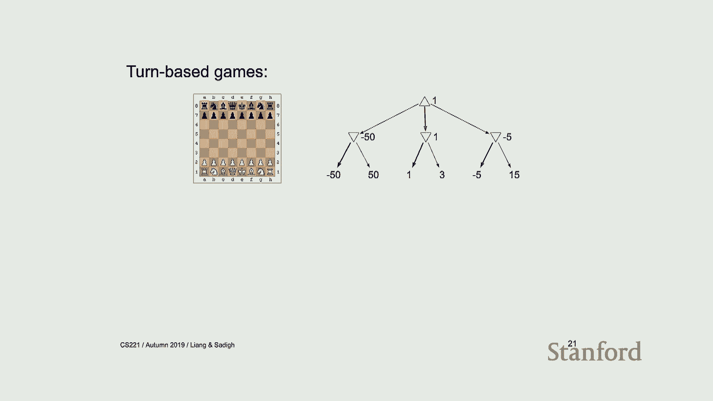

 And mini max strategies seem to be pretty okay but it comes to solving these turn base games。

 But not all games are turn base。 Like an example of it is rock paper scissors。

 You are all playing at the same time。 Everyone is playing simultaneously。

 The question is how do we go about solving a simultaneous？

 So let's start with a game that is a simplified version of rock paper scissors。

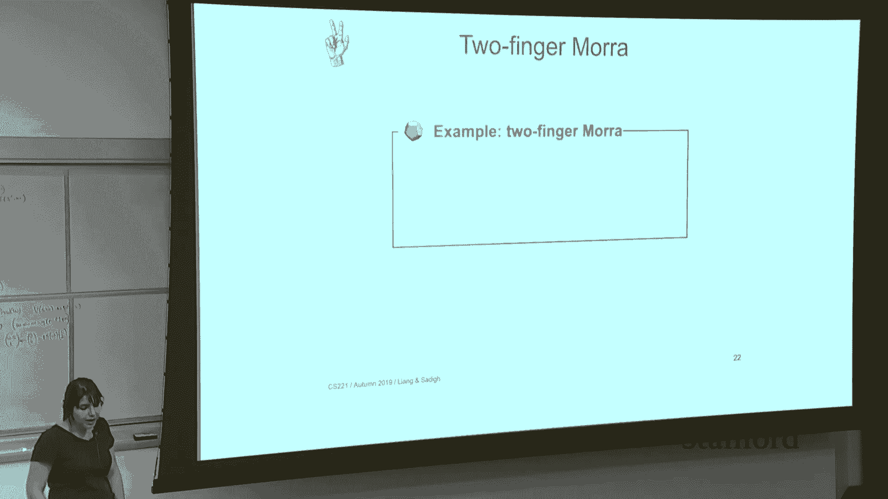

 This is called a two finger mora game。 So the way it works is we have two players player A and player B。

 And each player is going to show either one finger or two fingers。

 And then you're playing at the same time。 And the way it works is if both of the players show one at the same time。

 Then player B gives two dollars to player A。 If both of you show two at the same time player B gives player A four dollars。

 And then if you show different numbers like one or two or one。

 Then player A has to give three dollars to player B。 Okay。 Does that make sense？

 So can you guys talk to your neighbors and play the swing real quick？ [inaudible]， Play it once。

 [inaudible]， All right。 So what was the outcome？ How many of you were in the case where H goes one and B shows one？

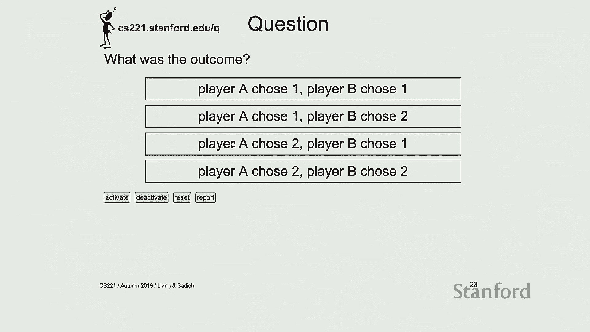

 Oh， yeah。 One for here。 H goes one B shows two。 One for there。 It's like four people play。

 So H goes two B shows one。 Okay。 Two and two。 All right。

 So you can kind of see like a whole mix of strategies here happening。

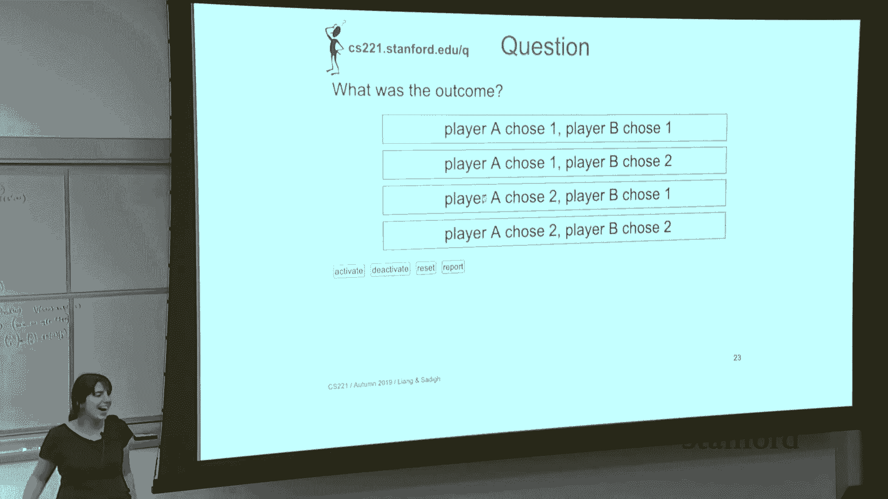

 And this is the game that you're going to talk about a little bit and think about what would be a good strategy to use when you are solving this simultaneous game。

 All right。 So， all right。 So let's formalize this。 Yeah。 Player A and player B。

 You have these possible actions of showing one or two。

 And then we're going to use this payoff matrix which represents A's utility if A chooses action A and B chooses action B。

 So before we had this value function， right， before we had this value function over our state here。

 now we have this value function that is B。

 [inaudible]， That is again from the perspective of a agent A。 So remember。

 like before when we were thinking about value function。

 we were looking at it from the perspective of the first player， the maximizer player， the agent。

 Now I'm looking at all of these games from the perspective of a player。 So。

 so I'm trying to like get good things for a。 In this case， it's not at the end of the four bits。

 Yeah。 And then this is like a one step game too。 Right。 So。

 so like you're just playing and then you see what you get。 So。

 so we're not talking about repeated games here。 So you're playing。 You see what happens。 Okay。 So。

 so we have this V， which is V of A and B。 And， and this basically represent A's utility if agent A plays A and if agent B plays。

 And this is called， and then you can represent this with a matrix。

 And that's why it's called a payoff matrix。 I'm going to write that payoff matrix here。

 So payoff matrix， I'm going to write A here， B here。 Agent A can show one or can show two。

 Agent B can show one or can show two。 Right。 If both of us show one at the same time。

 agent A gets two dollars。 If both of us show two at the same time， agent A gets four dollars。

 Otherwise， agent A has to pay。 So agent A gets minus three dollars。 And again。

 the reason I only like talk about one V is we are still in the setting of zero sum games。

 So whatever V agent A gets， agent B gets negative of that。 Right。 So。

 so if agent A gets four dollars， agent B is paying minus four dollars。

 So I'm just writing one V from perspective of agent A。 And this is called the payoff matrix。

 All right。 So， so now we need to talk about what does a solution mean in this setting。 So。

 so what is a policy in this setting？ And then the way we refer to them in this case are as strategies。

 So we have pure strategy， which is almost like the same thing as as deterministic policies。

 So a pure strategy is just a single action that you decide to take。 So。

 so you have things like pure strategies。 The difference between pure strategy and deterministic policy is if you remember deterministic policy again is a function of state。

 So， so it's a policy as a function of state。 It gives you an action here。

 We have like a one move game。 Right。 So it's just that one action and we call it pure strategy。

 We have also this other thing that's called mixed strategy。

 which is equivalent to stochastic policy。 And what a mixed strategy is is a probability distribution that tells you what's the probability of you choosing a so。

 So pure strategies are just actions is。 And then you can have things that are called mixed strategies。

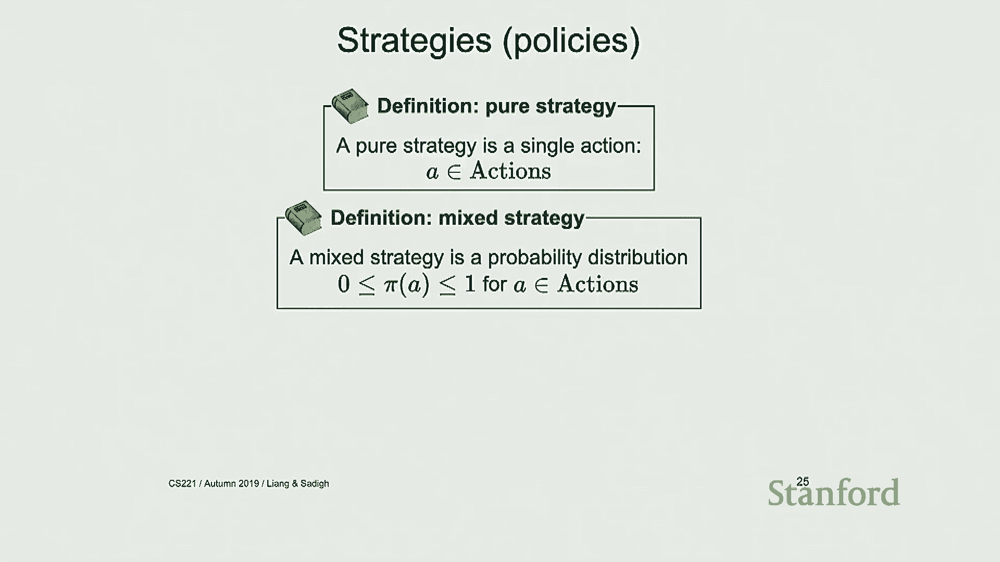

 And they are probabilities of choosing action。 Okay。 All right。

 So here is an example。 So if you say， well， I'm going to show you one。

 I'm going to always show you one。 Then the if you can write that strategy as a pure strategy that says。

 I'm going to always with probability one show you one and probably zero show you two。 So。

 so let's see the first column is for showing one， the second column is for sure。 So。

 so this is a pure strategy that says always I'm going to show you one。 If I tell you， well。

 I always I'm going to show you two， then I can write that strategy like this。 Right。

 You probably want to show you two。 I could also come up with a mixed strategy mixed strategy with the I'm going to pull the coin。

 And if I get one half， I'm going to give you。 If I get heads， I'm going to show you one。

 If I get tails， I'm going to show you two。 And then you can write that as this and this is going to be a mixed strategy。

 You could only play that to your in this， you could just bring chance and be like half the time。

 I'm going to show you one half the time。 I'm going to show you two based on chance。

 Everyone happy with mixed strategies and your strategy。 All right。 So。

 so how do we evaluate a value of a game？ So， so remember in previous lecture and like in the MDP lecture event。

 we were talking about evaluating if someone gives me the policy， how to evaluate。

 How to evaluate how good that is。 So the way we are evaluating that is again by this value function。

 And we are going to write this value function as a function of pi a and pi b。

 I'll just write that up here。 Or I'm going to race this。

 So I'm going to say a value of agent a following pi a and agent b following pi b。

 What is that equal to？ That is going to be the setting where。

 Pi a chooses action a pi b chooses action b times value of choice a and b summing over all possible。

 Okay。 So， so let's look at an actual example for this。 So。

 so for this particular case of two finger more game。 Let's say someone comes in and says。

 I'm going to tell you what pi a is policy of agent a is just always show one。

 And policy of agent b is this this mixed strategy。

 which is half the time show one half the time show two。

 And the question is what is the value of these two policies。 How do we compute that。 Well。

 I'm going to use my payoff matrix。 Right。 So， so one times one over two times the value that we get one one。

 which is equal to two。 So it's one times one one over two times two plus zero times one over two times four plus one times one over two times minus three value that I get is minus three plus zero times one over two times minus three。

 And what is that equal to that equal to two zero zero zero zero minus one over two。 Okay。

 so I just computed that the value of these two policies is going to be minus one over two。

 And again， this is a from perspective of of an agent a and it kind of makes sense right if agent a tells you I'm going to always show you one。

 Then probably agent and an agent to is following this mixed strategy agent a is probably using an agent a is losing minus one over two based on based on the strategy。

 So， that opens up a whole set of new questions that you're not discussing this class so that introduces repeated games。

 So you might be interested in looking at what happens in repeated game。

 In this class right now we're just talking about this one step won't play we're playing like zero some game。

 We're playing like a say rock paper scissors， and you just play once， you might say， oh。

 what happens if you play like 10 times then you're building some relationship and weird things can happen。

 And so， so that introduces the whole new class。 All right， so。

 so the values equal to minus one over two。 All right， so， so that was a game value so。

 so we just evaluated it right if someone tells me it's by a and I can evaluate it I can know how good pie and pie is from the perspective of agent。

 Okay， so what do we want to do like when we solve when we want to try to solve games all we want to do is from the agent a perspective。

 we want to maximize this value。 I want to get as much money as possible。

 and its values from my agent a perspective， so I should be trying to maximize this agent B should be trying to minimize this。

 like， think mini max right agent B should be minimizing this agent A should be maximizing this。

 That's what we want to do， but the challenge here is we're playing simultaneously。

 so we can't really use the mini max tree。 You can remember the mini max three。

 like in that setting we had sequential place and then we could like wait for agent A to play and then after that play。

 and that would give us a lot of information here we are playing simultaneously。 So。

 what should we do？ Okay， so what should we do？ So， I'm going to assume we can play sequentially。

 so that's what I want to do for now。 So， so I'm going to limit myself to pure strategies。

 so maybe I'll come over here。

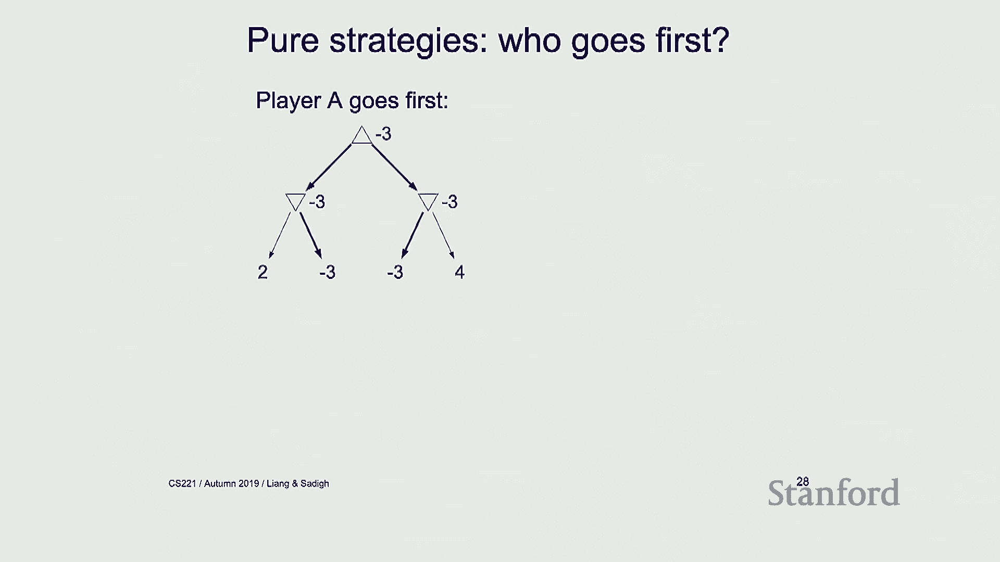

 So， right now I'm going to focus only on pure strategies， I want to just consider a setting。

 very limited setting， and see what happens。 And I'm going to assume。

 what if we were to play sequentially， what would happen。

 how bad would it be if we were to play sequentially。 So。

 so we have the setting where player A plays goes first。 What do you think。

 do you think like if player A goes first， is that better for player A or is that worse for player A？

 Worse for player A。 Okay， so that's probably what's going to happen。 So。

 player A was trying to maximize， right， this V player B was trying to minimize。

 And then each of them have actions of either showing one or showing two， this is player A。

 this is A， this is a V， in case you want to show one or two， right。 If you do one。

 if we show one one， player A gets what two dollars， is that right？

 Otherwise player A gets minus three dollars。 If you have two， two， player A gets four dollars。 So。

 okay， so now if we have this sequential setting， if you're playing mini max。

 then player B is going second， player B is going to take the minimizer here。

 so player B is going to be like this one。

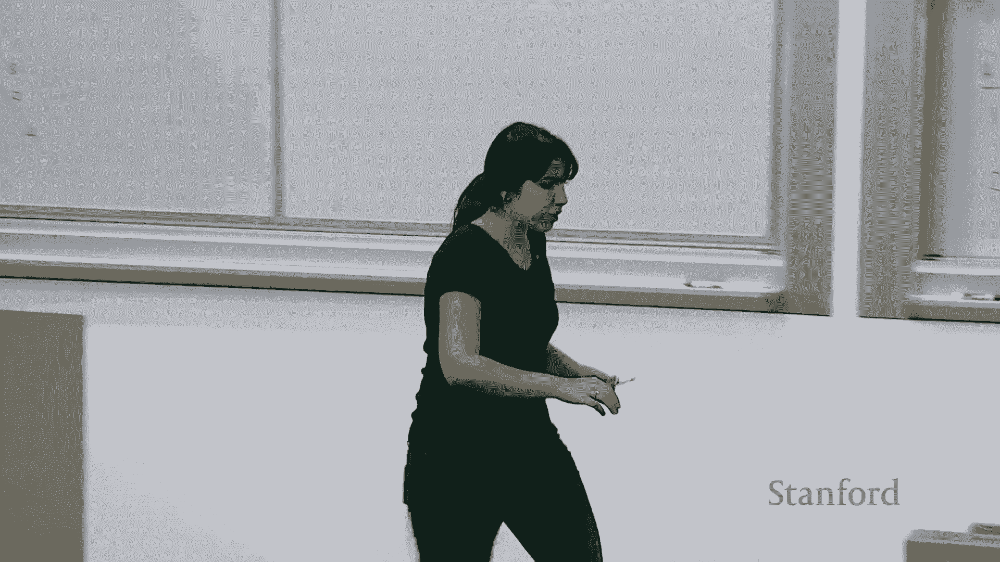

 And in this case player B is going to be like this one， what should player A do？ Well。

 in both cases player A is getting minus three dollars， it doesn't actually matter。

 player A could do any of them。 And then player A at the end of the day is going to get minus three dollars。

 And this is the case where player A goes first。 What if player A goes second？ Second。 So。

 so then player B is going first， player B is minimizing。 And then player A is maximizing。

 And we have the same values here。 Okay， so this is player A going second， player A going second。

 tries to maximize， so we'd like to pick these ones。 Player B is here， player B wants to minimize。

 So player B is going to be like， okay， if you're going second， I'd rather show you one。

 because by showing you one， I'm losing less。 If I show you two， I'm losing even more。 So。

 and then in that setting， we are going to get two。 So player A is going to get two dollars。 Alright。

 so that was kind of intuitive。 If we have fewer strategies， it looks like if you're going second。

 that should be better。 So， so going second is no worse， it's the same or better。

 And that basically can be represented by this minimax relationship。 So。

 so agent A is trying to maximize。 So， so in the second case， in the second case。

 we are maximizing second over our actions of V and A and B。 And player B is going first。

 So this is going to be greater than or equal to the case where player A is going first。 Sorry。

 not me。 That makes sense。 So， I'm going to just write these things that you're learning throughout on the side of the board。

 maybe up here。 So， what did we just learned？ We learned if we have fewer strategies。

 if we have pure strategies， right， going second is better。 That sounds intuitive and right。 Okay。

 so far， so good。 So， the question that I want to try to think about right now is what if we have mixed strategies？

 What's going to happen if you have mixed strategies？ Are we going to get the same thing？

 Like if you have mixed strategies， it's going second better。 Or is it worse or is it the same？

 So that's a question you try to ask。 Okay， so， so let's say player A comes in and player A says。

 well， I'm going to reveal my strategy to you。 What I'm going to do is I'm going to flip a coin。

 depending on what it comes。 I'm either going to show you one or I'm going to show you two。

 That's what I'm going to tell you。 That's what I'm going to do。 So。

 so what would be the value of the game under that setting？ So， the value of the game would be。

 maybe I'll write it here。 So， the value of pi A and pi B。

 pi A is already this mixed strategy of one half， one half， right？ Is going to be equal to pi。

 is this？ Yeah， actually。 All right， so what is that going to be equal to？

 It's going to be pi B times one， right， pi B。 So， it's going to be pi B choosing one times one half。

 If probability one half， agent A is also picking one。 If it is one one， we are going to get two。

 right？ Plus pi B choosing one， pi A with one half choosing one。

 and then we're going to get minus three dollars。 So， choosing two。

 we're going to get minus three dollars plus pi B choosing two times one half， pi A choosing two。

 we're going to get four dollars plus pi B choosing two times pi A choosing one。

 and that's minus three dollars。 So， I just iterated all the four options that we can get here under the policy of pi B choosing one or two。

 and then pi A is always just half， right？ Their following is mixed strategy。 So， well。

 what is this equal to？ That's equal to minus one over two， pi B of one plus one over two。

 pi B of two。 Okay？ So， that's a value。 So， again， the setting is， someone came in， agent A came in。

 agent A told me， "I'm following this mixed strategy。 This is going to be the thing I'm going to do。

"， What should I do as an agent B？ What should I do as an agent B？ You've always wanted to take one。

 So， okay， so that was too quick。 So， you always have to do one。 Why is that？ Well。

 if agent A comes and tells me， "Well， this is a thing I want to do，"。

 I should try to minimize value of agent A， right？ So。

 what I'm really trying to do as agent B is to minimize this， right？

 Because I don't want agent A to get anything。 So， if I'm minimizing this， in some sense。

 I'm trying to come up with a policy， that minimizes this。 Why is it probability？ So。

 it's like a positive number。 Like a positive part and a negative part here。

 The way to minimize this is to put as much rate as possible for this side。

 and as little as possible for this side。 So， that tells me that never show two and always show one。

 So， the best thing that I can do as agent two is to follow a pure strategy。

 that always shows one and never shows two。 Okay？ So， this was kind of interesting， right？ Like。

 if someone comes in and tells me， "This is the thing。 This is a mixed strategy I'm going to follow。

"， I'll have a solution in response to that。 And that solution is always going to be a pure strategy。

 actually。 So， that's， I have cool。 All right？ So， this is actually what's happening in a more general case。

 I'm going to make a lot of generalizations in this lecture。 So。

 I show one example and I generalize it， but if you're interested in details of it。

 I think it's not quite enough。 So， yeah。 So， the setting is for any mixed strategy， pi a。 So。

 pi a told me what their mixed strategy is。 It's a fixed mixed strategy。

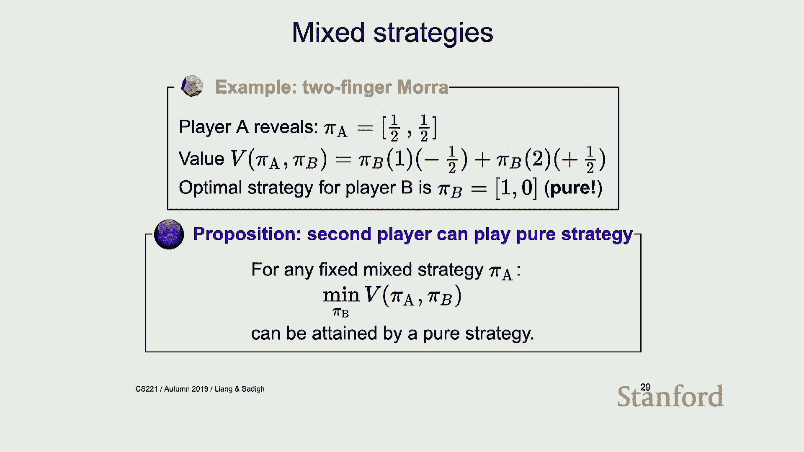

 What I should do as agent t is I should minimize that value。

 I should pick pi b in a way that minimizes that value。 And that can be attained by a pure strategy。

 So， the second thing that I've learned here is if player a plays a mixed strategy。

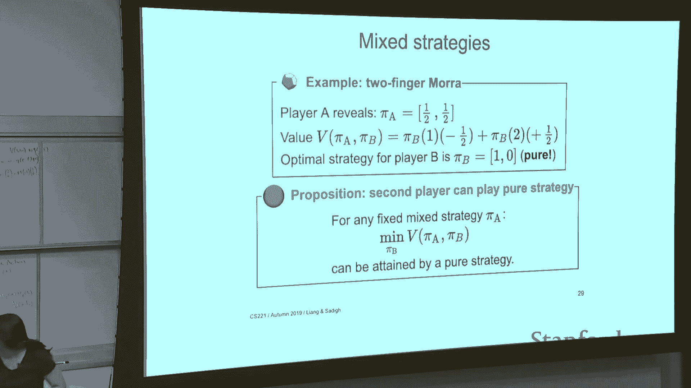

 then there would be as an optimal pure strategy。 That's kind of interesting。 All right？ Okay。 So。

 in this case also， we haven't decided what the policies should be yet。 We have started。

 we've still been talking about the setting where pi a， like agent a comes in。

 and tells us what their policy is and we know how to respond to it， it's going to be a pure。

 strategy。 So， now I want to figure out what is this this policy？

 What should be this mixed strategy actually？ So， I want to think of it more generally。 So。

 I want to go back to those two diagrams and actually modify those two diagrams in a way。

 where we talk about it a little bit more generally。 Maybe， yeah， I'll just modify these。 Okay。 So。

 let's say that， okay， and I'm going to think about both of the settings。 So， let's say again。

 player a is deciding to go first。 Player a is going to follow a mix strategy。 So。

 this is all we know， but we don't know what mixed strategy。

 Player a is going to decide to do to follow a mixed strategy。 This is player a。

 player a is maximizing。 Player a is following a mixed strategy。

 The way I'm writing that mixed strategy is more generally saying player a is going to show one。

 with probability p and is going to show two with probability one minus p。 More generally。

 like something down。 Okay。 And then after that， it's player b's turn。

 We have just seen that player b， the best thing player b can do is to do a pure strategy。 So。

 player b is either 100% is going to pick one or 100% is going to pick two。 Player b can really like。

 like both terms are the same。 And then like player b following the strategy that would be the best strategy。

 You know， it's the same as any pure strategy。 I guess those terms behind on the blue。

 on the four you're over there。 Yeah， those terms are the same， both blue terms。

 Then like player b can follow any kind of strategy right here。 So。

 the thing is that the strategies are probabilities， right？ So， the values from zero to one。

 And then you kind of always end up with this negative term that you're trying to make as negative as possible。

 and this positive term that you're trying to get as positive as possible。

 And that's kind of intuitively why you end up with a pure strategy。 And a pure strategy。

 what I mean is you always end up like putting as much possible， like one。

 like all your probabilities on the negative term and nothing on the positive term because you're trying to minimize this。

 So， that's kind of like intuitively why you're getting this。 So， you wouldn't get one。 So。

 that is what I mean。 So， like， you wouldn't ever get like one half on one half。

 If you get one half on one half， that's a mixed strategy。 That's not a pure strategy。

 And I'm saying you wouldn't get a mixed strategy because you would always end up in this setting that to minimize this。

 you end up pushing all your probabilities to this negative term。 All right。 So。

 let me go back to this。 So， all right。 So， we have the setting where player A goes first。

 player A is following a mixed strategy with p and one minus p。

 Player B is going to follow a pure strategy， either one or two。 I don't know which one， right？ So。

 what's going to happen is if you have one one， then that is going to give me two value two， right？

 So， it's two times p。 I'm trying to write the value here。 All right， let me go right。

 Is it two times p plus？ Yeah， one minus p times three， right？ So， with probability one minus p。

 this guy is going to pick two。 If this guy picks one， we're going to get minus three， minus three。

 Okay。 And then for this side， if the probability one minus p A is going to show two。

 if I'm going to show two， then I'm going to get four。 So。

 it's four times one minus p and with probability p， this guy is going to show one。

 I'm going to show two， so that is minus three p。 Okay。 All right， so what are these equal to？ So。

 this is equal to five p minus three。 That is equal to minus seven p plus four。 Okay。

 so I'm talking about this more general case。 In this more general case， player A comes in。

 player is playing first， and is following a mixed strategy。

 but doesn't know what p they should choose。 They're choosing a p and one minus p here。

 And then player B has to follow a pure strategy。 That's what we decided。 And then under that case。

 we either get five p minus three and minus seven p plus four。 Okay。 What should player B do here？

 This is player B and this min naught。 What should player B do？ Should player B pick one or two？

 It should player B should pick a thing that minimizes between these two。

 So player B is going to take the minimum of five p minus three and minus seven p plus four。 Okay。

 What should player A do？ I'm thinking minimax， right？ So when you think about the minimax。

 player A is maximizing the value。 So player A is going to maximize the value that comes up here。

 So player is going to maximize that。 And also， I'm saying player A needs to decide what p they are picking。

 So they're going to pick a p that maximizes that。 Is this player？ Like these computations？ Yeah。

 So these are the four different things in my payoff matrix。

 So I'm saying is with probability p is going to show me one。 Right。

 And I'm going to go down this other route where B is also choosing one。 This is one。

 like both of us are showing one， then I'm going to get two。 Right。 So I'm going to get two dollars。

 So that's where the two dollars comes from times probability P。 With probability one minus P。

 A is going to show me two。 I'm going to show one that's minus three dollars times probability one minus P。

 So that's how， and for this particular branch， I know the payoff is going to be five P minus P。

 That makes sense。 And then for this side， again， like with probability one minus P。

 A is going to show me two。 If it is both of them two， I'm going to get four dollars。

 That's why it's four times probability one minus P。 With probability P， A is going to show me one。

 So that's why I lose three dollars。 That's minus three times probability P。 So that's minus seven。

 Okay。 So， and then the second player， what they're going to do is they're going to minimize between these two values。

 They're going to pick one or two。 They're going to， they're deciding。

 should I pick one or should I pick two？ And the way they're deciding that is by trying to pick one or two based on which one minimizes these two values。

 But I'm writing it like using this variable P that's not decided yet。

 And this variable P is the thing that player A needs to decide。

 So what P should play your A to decide？ Player A should decide a P that maximizes this。

 So I'm writing like literally a minimax relationship here。 Okay？ All right。

 So the interesting thing here is this five P minus three is some line， right？ With positive slope。

 This is five P minus three。 And this minus seven P plus four is another line。

 Minus seven P plus four。 It's another line with negative slope。 What is the minimum of these？

 Where is it going to be the minimally？ It's happening。 The more of these two lines。

 Where they meet each other， right？ This is going to be the minimum。 Okay？ So， so the P that I'm。

 so going to pick is going to be actually the P where the value of P where these two are equal to each other。

 And that turns out to be at， I don't know what it is， seven over twelve or something。 Actually。

 I don't know where this value is。 Yeah。 So it's going to happen at seven over twelve。

 And the value of it is minus one over twelve。 All right。 So， okay。 So let's recap。 Okay。

 What did I do？ I'm not saying this game， but I'm relaxing it and making it sequential。

 I'm saying A is going to play first， B is playing second。

 The thing that's going to happen is A is playing first， A is deciding to choose a mixed strategy。

 So A is deciding to say maybe one half， one half。 But maybe the A doesn't want to say one half。

 one half， one to come up with some other probability。

 So the thing A is deciding is should I pick one with probability P and should I pick two with probability one minus P？

 And what should that be？ So， so what is the probability I should be picking one？

 So that's what A is trying to decide here。 Okay。 So whatever A decides with P and one minus P ends up in two different results。

 And based on them， B is trying to minimize that。 When B is trying to minimize that。

 B is minimizing between these two linear functions。 These two linear functions meet at one point。

 That is the point that this thing is going to be minimized。

 And that actually corresponds to a P value when A tries to maximize this。 This is。

 I know a little bit。 This requires a little bit of thinking。 So， any clarification questions？

 I mean， see a lot of boss faces。 So。 By having a police policy。 Yeah。 And then， yeah。

 the interesting point is exactly right。 Yeah。 So A is still by the way of losing。

 So even in this case， where A is trying to come up with the best mixed strategy he could do。

 the best mixed strategy A is doing is show one with probability seven over 12 and show two with probability five over 12。

 This comes from here。 Even under that scenario is losing minus one over 12。 Okay。 All right。 Okay。

 So also， I haven't solved a simultaneous game yet， right？ Like。

 I have talked about the setting where A plays first。 So， what if B plays first？ So。

 I'm going to swap this。 What if B plays first？ So， A goes second， B plays first。

 I'm going to modify this one now。 Okay。 B goes first， A is going second。 B is going to start。

 is going to reveal this strategy， his strategy。 The strategy that B is going to reveal is also again。

 I'm going to be probability P show you one with probability one minus P show you two。 Then A plays。

 A is trying to maximize。 And A has to play a pure strategy because of that， right？

 Like the best thing A can do is going to be a pure strategy。

 Always going to be either showing one or two and A is deciding which one but doesn't know yet。

 And the values here are going to be exactly the same thing as there。 So。

 there are five P minus three minus seven P plus four。 Okay。 All right。 So， what's happening here？

 So， so in this case， A is playing second。 What A likes to do is A likes to maximize between five P minus three and minus seven P plus four。

 That's what A likes to do。 B is going second。 Sorry， B is going first。

 So then B has to minimize that and pick it P that minimize。 Okay。

 So these two are exactly the same two lines， but now I'm picking the maximum of them。

 the maximum of these two lines。 And that being exactly the same point as before。

 And that being exactly the same P as before and giving you exactly the same value as before。 So。

 so this is also equal to minus one over two。 So what this is telling me is if you're playing a mixed strategy。

 even if you reveal your best mixed strategy at the beginning， it doesn't matter。

 It actually doesn't matter if you're going first or second。 So like in the more again。

 when you were playing， if you were playing a mixed strategy and you would tell your opponent。

 this is the thing I'm going to do。 And this is a mixed strategy。 Actually， like。

 and if it was the optimal thing， like， like it didn't matter。 Like if they knew it or not。

 like you'd still get the same value。 So again， you get five P minus three and minus seven P plus four。

 And then now you're minimizing over maximum of these two lines。

 Maximum of these two lines ends up being at the same point。

 And you pick a P that kind of maximizes that。 And you get the same value。

 So this is called the von Neumann's theorem。 So the whole thing that you just did over this one example。

 there's a theorem about it that says for every simultaneous two player zero sum game。

 we define a number of actions。 The order of place doesn't matter。 So。

 you're playing second or be playing first。 The values are going to be the same thing。

 If you're minimizing over maximum or maximum minimum of that value， it's going to be the same thing。

 Okay。 So this is kind of the third thing that we just learned。 Which is one Neumann's theorem。

 Which says， if I'm writing a modification or simpler， shorter version of it。

 So if playing an extra g。 Order of play doesn't matter。 And remember， if you play mixed strategy。

 your opponent is going to play a few strategies。 This is like this is a different point。

 If you play mixed strategy， your opponent is going to follow a few strategies either one or two。

 The probability of you doing like ordering， like one of the two answers will come out。

 The probability of one or two。 And then in that case， the second you choose like this step。

 So in this case， so the thing is these two end up being equal。 So the way to。

 it doesn't matter because the way for you to maximize this is going to be the point where the two end up being equal。

 So the two branches， like if you actually plug in P equal to seven over two， twelve here。

 like these two values end up being equal。 And the reason that they end up being equal is you are trying to minimize the thing that this guy is trying to maximize。

 So you're trying to pick the P that actually makes this thing equal。

 So no matter what your opponent does， you're going to get the best thing that you can do。 So yeah。

 think of it like this。 Okay， so I'm player A。 I'm still， I still have a choice。

 My choice is to pick a P。 I want to pick a P that I'm not going to lose as much。

 What piece should I pick？ I should pick a P that makes these choices the same。

 Because if I pick a P that makes this one higher than this one， of course。

 the second player is going to make me lose and then go down or out。

 That's better for the second player。 So the best thing that I can do here is make these two as equal as possible。

 So then the second player， whatever they choose， choose one or two， it's going to be the same thing。

 It's going to be， does that make sense？ So， I'm trying to find my P and one minus piece you're saying。

 like， if probability。 Oh， so in expectation， you're saying when you're choosing P。 Yeah。

 so I'm treating P as a variable that I'm deciding， right？ Like P is the thing I got to be deciding。

 So I'm player A。 I got to be deciding a P。 That's not going to be too bad for me。 Like。

 let's say I would pick a P that doesn't make these things equal。 Let's say， I don't know。

 I would pick a P that makes this guy， I don't know， 10， and this makes this guy five。

 The second player is， of course， going to make me lose and of course is going to pick the thing that's going to be the worst thing for me。

 So the best thing I can do is I can make both of them。 I don't know， seven。

 So it's not going to be as bad。 So that's kind of the idea。 All right。

 so we move forward because there are still fun things happening。 All right， so， so， okay。

 so that kind of key idea here is revealing your optimal mixed strategy does not hurt you。

 which is kind of a cool idea。 The proof of that is interesting。

 If you're interested in look at the notes， you can use linear programming here。

 The reason kind of the intuition behind it is if you're playing mixed strategy。

 the next person has to play pure strategy and you have impossible options for that pure strategy。

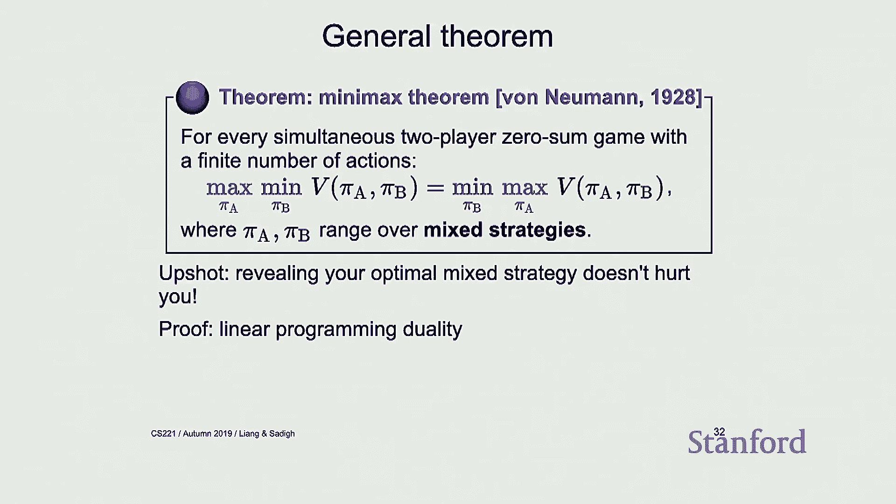

 So that creates end constraints that you're putting in for your optimization。

 You end up with a single optimization with end constraints and then you can use linear programming duality to actually solve it。

 So you could compute this using linear programming and that's kind of the one I'm missing。 So。

 so we'll summarize what we have talked about so far。 So。

 so we have talked about these simultaneous games and we've talked about the setting where we have pure strategies and we saw that if you have pure strategies。

 going second is better。

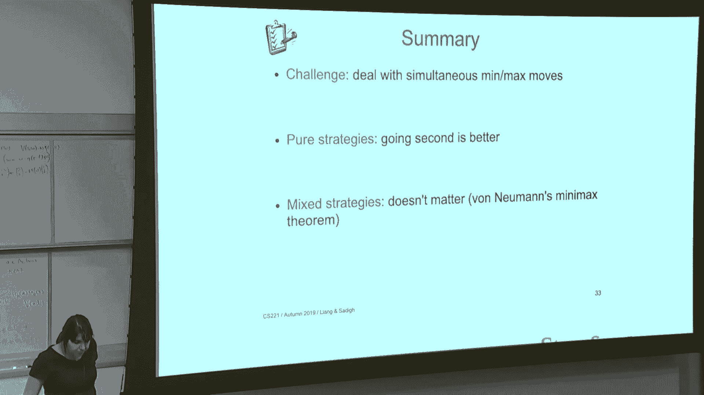

 Going second is better if you're just telling you like what's the pure strategy you're using。

 So that was kind of the first one。 And then if you're using mixed strategy。

 it turns out it doesn't matter if you're going first or second。

 You're telling them what your best mixed strategy is and they're going to respond based on that。 So。

 and that's the one knowing man's minimax there。 All right， so next 10 minutes。

 I want to spend a little bit of time talking about non-zero sum games。 So。

 so far we have talked about zero sum games where it's either minimax， I get some reward。

 you get the negative of that or vice versa。 There are also these other things called collaborative games where we are just both maximizing something。

 So， so we both get like money out of it。 And that's kind of like a single optimization。

 It's a single maximization。 You can think of it as plain search。 In real life。

 we are kind of somewhere in between that and and I want to motivate that by an example。 So。

 I want to motivate that by this idea of prison or dilemma。

 How many of you have heard of prison or dilemma？ Okay， good。 Okay。

 so the idea of prison or dilemma is you have a prosecutor who asks A and B individually if they will testify against each other or not。

 Okay， if both of them testify， then both of them are sentenced to five years in jail。

 If both of them refuse， then both of them are sentenced to one year in jail。 If one testifies。

 then he or she gets out for free and then the other one gets 10 years sentenced。

 Play with your partner real quick。 [inaudible]， Okay， so let's look at the payoff matrix。

 So I think you kind of have an idea now of how the game works。 That A or B。

 So you have two players A or B。 Each one of you have an option。

 You can either testify or you can refuse to testify。

 So you can be can testify and A can refuse to testify and I'm going to create this payoff matrix。

 This payoff matrix is going to have two entries now in each one of these cells。

 And why is that because we have a non-zero sum game before our payoff matrix only had one entry because this was for player A。

 Player B would just get negative of that， but now player A and B are getting different values。

 So if both of us testify， then both of us get five years in jail。 So A gets five years in jail。

 B gets five years。 If both of us refuse， A gets one year jail。 B gets one year jail。 One year。

 one year jail。 And then if it is a setting where one of us testifies the other one refuses。

 one of us gets zero。 The other one gets 10 years jail。 So if I refuse to testify。

 then I get 10 years。 And then B gets zero。 And then in this case， A gets zero and B gets 10。

 So the payoff matrix is now going to be for every player we are going to have a payoff matrix。

 So now we have this V value function which is a function of a player for policy A and policy B will be the utility for one particular player。

 You might be looking at it from perspective of different players。

 So the von Neumann's minimax theorem doesn't really apply here because we don't have the zero sum game。

 but we actually get something a little bit weaker。 And that's the idea of Nash equilibrium。

 So a Nash equilibrium is set up policies， pi star A and pi star B。

 so that no player has an incentive to change their strategy。 So what does that mean？

 So what that means is if you look at the value function from perspective of player A value function from perspective of player A at the Nash equilibrium at pi star A and pi star B is going to be greater than or equal to value of any other policy。

 pi A， if you fix pi B。 And at the same time， the same thing is true for value of B。 So for agent B。

 value of B at a Nash equilibrium is going to be greater than or equal to a value of B at any other pi B if pi A fixes their policy。

 So what does that mean in this setting？

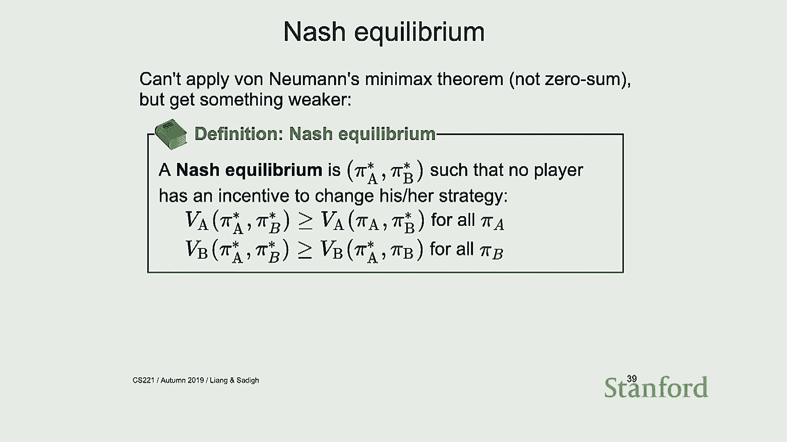

 Do we have a Nash equilibrium here？ So let's say I start from here。

 I start from A equal to minus 10， B equal to zero。 Can I get this better？ Can I make this better？

 Or did I flip them？ I always flip。 Right？ Zero minus 10？ Minus 10， zero。 Okay。

 so let's say I start from here。 Can I get this better？ Can I make this better？

 I start from this cell。 A gets zero years of jail。 That's pretty good。 B gets 10 years of jail。

 That's not that great。 So B has an incentive to change that， right？

 Like B has an incentive to actually move in this direction。 Right？

 So B has an incentive to get five years jail instead of 10 years。 Similar thing here。

 What if you start here？ A has one year jail。 B has one year jail。

 A has an incentive to change this now and get zero years jail。

 B has an incentive to change this and get zero years jail。

 And we end up with this cell where you don't have an incentive to change our strategy。

 So we have one Nash equilibrium here and that one Nash equilibrium here is both of us are testifying and both of us are getting five years jail。

 Which is kind of interesting because there is like a socially better choice to have here。

 Like both of us are refused。 Like you would each get one year jail but that's not going to be Nash equilibrium。

 Okay？ All right。

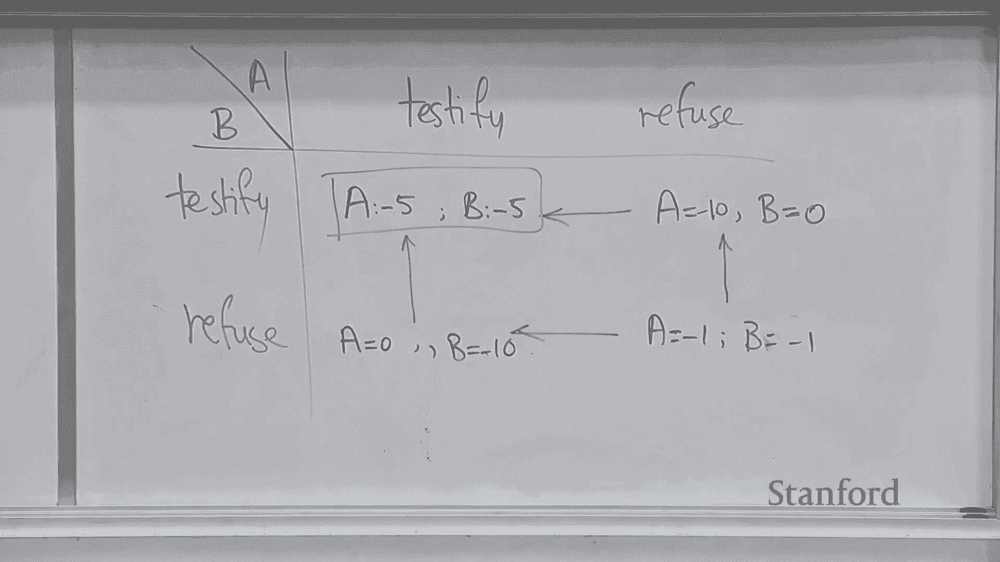

 So there's a theorem which is Nash's existence theorem which basically says if any finite player game with finite number of actions。

 if you have any finite player game with finite number of actions。

 then there exists at least one Nash equilibrium。 And then this is usually one mixed strategy Nash equilibrium。

 At least one mixed strategy Nash equilibrium。 In this case。

 it's actually a pure strategy Nash equilibrium。 But in general。

 there is at least one Nash equilibrium。 Okay。 All right。 So let's look at a few other examples。

 Two finger mora。 What would be the Nash equilibrium for that？

 So we just actually solved that using the mini max one， no， many max theorem。 Right。 So。

 so it would be if you're playing a mixed strategy of seven over 12 and five over 12。

 You might you might kind of modify your two finger mora game and make it collaborative。

 So in a collaborative setting， what that means is we both get two dollars or we both get four dollars or we both lose three dollars。

 So， so a collaborative two finger mora game。 It's not a zero sum game anymore。 And。

 and you have two Nash equilibria。 So you would have a setting where a and b both of them play one and the values to or a and b both of them play two and the values for。

 And then prisoner's dilemma。 It's the case where both of them testify。 We just saw that anymore。

 All right。 Okay， so the summary so far is we've talked about simultaneous zero sum games。

 We talked about this one， no means mini max theorem。

 which has like multiple mini max strategies and a single game value。

 Like you had a single game value because it was zero some。 But in the case of non zero some games。

 we would have something that's slightly weaker that's Nash's existence theorem。

 We would still have multiple Nash equilibrium。 But we have。

 we also have multiple game values from depending on whose perspective you're looking at。

 So this kind of was just a brief like short introduction to game theory and econ。

 There's a huge literature around different types of games in game theory and economics。

 If you're interested in that， take classes。 And yeah。

 there are other types of games to like security games and or resource allocation games that have some characteristics that are similar to things you've talked about。

 You're interested in any of them。 Maybe you can take a look at them would be useful for projects。

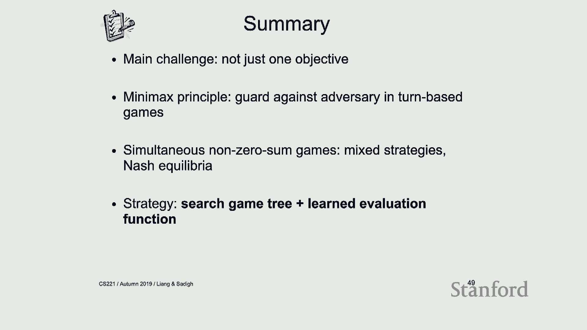

 And with that， I'll see you guys next time。 [BLANK_AUDIO]。

