# P15：Lecture 15 Bayesian Networks 3 - Maximum Likelihood - 鬼谷良师 - BV16E411J7AQ

 Okay， let's get started again。

 So before I proceed to。

 Bayesian networks， I'm going to talk about a few announcements。 So as you probably know。 car is due tomorrow。 P progress is due Thursday。 Then finally， the big one is the exam。 which is next Tuesday。 So everyone， if you're in the room or， you're watching from home。 please remember to go to the exam。 The exam will cover all the material from。

 the beginning of the class up until and including today's lecture。 So all Bayesian networks。 no logic。 Doesn't mean you shouldn't use logic on the exam。 Reviews are going to be in section this Thursday and Saturday。 So you get not one but two reviews sessions。 The first one will talk about。

 reflex and state based models and the second one will talk about variable risk models。 At this point， all the alternative exams have been scheduled。 If you can't make the exam for some reason， then really please come talk to us right now。 And just a final note is that the exam is， the problems are a little bit different than the homework problems。

 They require more problem solving and， the best way to prepare for the exam is to really go through the old exams and。 get a sense for what kind of problems and questions you're going to be asked。 Question？

 >> Where is the Saturday session？ >> Where is the Saturday session？ Does anyone know？

 >> We don't know yet。 >> We don't know yet。 It will be posted on Piazza。 Any other questions about anything？ I know this is a lot of stuff， but。 this is probably going to be the busiest week。 And then you get Thanksgiving break。 so that'll be great。 Okay， so let's jump in。 So two lectures ago。

 we started introducing Bayesian networks。 So Bayesian networks is a modeling paradigm where you define a set of variables。 which capture the state of the world。 And you specify dependencies depicted as directed edges between these variables。 And given the graph structure， then you proceed to define distribution。 So first you define a local conditional distribution for， every variable given the parents。

 So for example， H given C and A and I given A。 And then you slam all these local conditional distributions。 aka factors together， and， defines a glorious joint distribution over all of the random variables。 Okay， and you think about the joint distribution as the source of all truth。 It is like a probabilistic database， a guru or oracle that can be， used to answer queries。

 So this in the last lecture， we talked about algorithms for doing probabilistic inference。 where you're given a Bayesian network， which defines this glorious joint distribution。 And you're asked a number of questions。 And questions look like this。 So condition on some evidence。 which is a subset of the variables that you have observed。

 What is the distribution over some other subset of the variables which you didn't observe？

 Then we looked at a number of different algorithms in the last lecture。 There's the forward backward algorithm， which was useful for。 doing filtering and smoothing queries in HMMs。 This was an exact algorithm。 Then we looked at particle filtering， which happens to be useful in a case where， your state space。

 the number of values that a variable can take on， it can be very large。 And this is an approximate。 but in practice it tends to be a good approximation。 And then finally particle filtering， sorry。 and Gibbs sampling， which is this much more general framework for doing probabilistic inference in。 arbitrary factor graphs。 And this was again approximate。

 So so far we've bit off two pieces of this modeling inference learning triangle。 We've talked about models， we've talked about inference algorithms。 And finally today we're going to talk about learning。 And so the question in learning。 as we've seen repeatedly throughout this course， is where did all the parameters come from？

 So so far we have assumed that someone just hands you these local conditional。 distributions which are have numbers filled out。 But in the real world， where do you get these？

 And we're going to consider a setting where all of these parameters are unknown。 and we have to figure out what they are from data。 Okay。 so the roadmap we're going to start first start with supervised learning。 which is going to be the kind of the easiest， easiest case。

 And then we're going to move to unsupervised learning where some of the。 variables are going to be unobserved。 Okay， any questions before we dive in？ Okay， let's do it。 So the problem of learning as this follows， we're given trainee data and we want to turn this into parameters。 Okay， so for the specific instance of Bayesian networks。

 trainee data looks like an example is an assignment to all the variables。 Okay。 this will become clear in an example。 And the parameters are all those local conditional probabilities that we now。 assume we don't know。 Okay， so here's a question。 Which is more computationally more expensive for Bayesian networks？

 Is it probabilistic inference given the parameters or， learning the parameters given data？

 So how many of you just use your intuition？ How many of you think it's the former？

 Probabilistic inference is more expensive。 Okay， one maybe。 how many of you think learning is more expensive？ Yeah， that's probably what you would think， right？

 Because learning seems like there's just more unknowns and， it can't， how can it possibly be easier。 It turns out that it's actually the opposite。 Yeah， so good job。 And this will hopefully be a relief to many of you。 because I know probabilistic inference gets a little bit quite intense sometimes。

 And learning will actually be maybe not quite a walk in a park， but。 it will be a brisk stroll in the park。 And then when we come back to unsupervised learning。 it's going to get harder then。 So at least in the fully supervised setting。 it should be easy and intuitive。 So what I'm going to do now is going to build up to the general。

 algorithm by a series of examples of increasingly complex Bayesian networks。 So here's the world's simplest Bayesian network。 It has one variable in it。 Let's assume that variable represents the rating of a movie。 So it takes on values one through five。 And to specify the local conditional distribution， you just have to specify the probability of one。

 the probability of two， the probability of three， probability four， and probability five。 So these five numbers represents the parameters of the Bayesian network。 By fiddling these。 I can get different distributions。 So suppose someone hands you this training data。 So it's fully observed， which means I observe one time， I observe the value of R to be one。

 The second day I observe the value to be three， third day I observe it to be four， and so on。 So this is your training data。 So now the question is。 how do you go from the training data here to the parameters？ Any ideas？ Just use your gut。 What do your gut say？ >> How long the number of insular things can you find out the right thing？

 >> Yeah， count and then divide or normalize。 So this seems a very natural intuition。 Later I'll justify why this is a sensible thing to do。 But for now。 let's just use your gut and see how far we can get。 Okay。 so the intuition is that the probability of some value of R。

 should be proportional to the number of times that occurs in the training data。 So in this particular example， I look at all the possible values of R， one through five， and。 I just see one shows up once， two shows up zero times， four shows up five times， and so on。 So these are the counts of the particular values of R， and then I simply normalize。 Okay。

 so normalization means adding the counts together， which gives you 10， and dividing by 10。 which gives you actual probabilities。 Okay， it's pretty easy， huh？ Yeah， good。 Okay。 so let's go to two variables。 So now you improve your model of ratings， so。 now you take into account the genre。 So the genre is a variable G， which can take on two values。

 drama or comedy， and the rating is the same variable as before。 And now let's draw the simple Bayesian network， which has two variables。 And the local conditional distributions are P of G and P of R given G。 Okay， so again。 I'm gonna give you some training data， which each training example specifies a full assignment to all the variables。

 So in this case， it's D4， and this one， it's D4 again。 This one's C1 and so on。 And the parameters here are the local conditional distributions， which is P of G and P of R given G。 Okay， so let's proceed to do this。 And here， following our nose again。 we're going to estimate each local conditional， distribution separately。 Okay。

 so this may not be obvious why separate doing it separately is the right， thing to do。 but trust me it is the right thing to do and certainly is the easy thing， to do。 so let's just do that for now。 Okay， so again， if we look at P of G， so。 we have to look at only this data restricted to G。 And we see that D shows up three times。

 C shows up twice。 So I get these counts and I normalize and。 that's my estimate of the probability of G。 Okay， and now let's look at the conditional distribution R given G。 Again， I'm going to count up the number of times that these variables G and， R show up。 so D4 shows up twice， D5 shows up once， and so on。 Count and normalize。 Question？

 >> So instead of R， D， D， D， and R， then probability R of R。 would that cause any differences in the results？ Like if the order were to。 >> Yeah。 so good question。 So the question is， what happens if we define our model in the opposite。 direction where we have P of R and P of G given R？

 So then you would be estimating different probabilities。 You would be estimating P of R。 which contains one through five， and， then P of G given R， which would be a different table。 >> [INAUDIBLE]， >> So the question is， if you do inference， you get the same results。 In this case。 you will get the same results。 In general， you're not， you're， depending on the model you define。

 you're actually going to get a different distribution， which will lead to。 different inference results。 Yeah， this happens when you have two variables and。 you couple them together and you do things like this way。 You're effectively estimating from the space of all joint distributions， G and R。 But we。

 if you have conditional independence and， you have， for example， HMM， the order。 how you write them all definitely， affects what inference is going to return。 Okay？ All right， so。 so far so good， so now let's add another variable。 Okay？ So， so now we have a variable A。 which represents whether a movie won or， no， no， word or not。

 We're going to draw this Bayesian network。 And the joint distribution is P of G， P of A。 P of R given A and G。 Okay？ So this type of structure is called a V structure for obvious reasons。 And this remember was the thing that was tricky。 This is the thing that leads to explaining away and。 all sorts of tricky things in Bayesian networks。 It turns out that when you're doing learning in them。

 it's actually， all the trickery goes away。 Okay？ So， let's just do the same thing as before。 so we get this data。 Each data point， four assignment to all the variables。 So this is D03 corresponds to G equals D， A equals 0 and R equals 3。 And the parameters are all again， all the local conditional distributions。

 And now I'm going to count and normalize。 So this part was the same as before， counts the genres。 D shows up three times， C shows up twice， normalize。 A is treated very much the same way。 So three movies have one， no awards， two movies have one award。 So the probability of a movie winning award is two out of five。 And then finally。

 this is the local conditional distribution of R given G and， A。 And here we have to specify for。 all combinations of all the variables mentioned in that local conditional distribution。 I'm going to count the number of times that configuration shows up。 So D01 shows up once。 right here。 D03 shows up once， right here， and so on。 Okay？ And now when you normalize。

 you just have to be careful that you're normalizing， only over the variable that your。 the local distribution is on， in this case R。 So for every possible unique setting of G and A。 I have a different distribution。 Okay？ So D0， that's a distribution over one and three。 And if I normalize it， I get half and half。 And each of these other ones are completely separate because they have。

 different values of G and A。 Okay？ Any questions？ All good？ All right。 So that wasn't too bad。 So now let's invert the V and look at this structure。 Where now we have genre。 there's no award variable。 But instead we have two people rating a movie and the Bayesian network looks like。 this， the genre， and we have R1 given G and R2 given G。 And for now。

 I'm going to assume that these are different local conditional， distributions。 So we'll have PR1 and P of R2。 So notice that in this lecture。 I'm being very explicit about the local conditional， distribution。 Here。 instead of just writing P of G， which can be ambiguous， I'm writing P of G to refer。

 to the fact that this is the local conditional distribution for variable G。 This one's the one for R1， this one for R2， and those are different。 And you'll see later why this matters。 Okay。 So for now， we're going to go through the same motions。 Hopefully this should be fairly intuitive by now。 You simply count， normalize for P of G。

 And then for R1， I'm just going to look at the first or the second element here。 which corresponds to R1 and ignore R2。 Right？ So， GR1。 So D4 shows up twice。 So I have D4 and D4。 That shows up twice。 D5 shows up once。 That's a D5。 C1 shows up once。 And C5 shows up once。 Okay？

 And then normalize， get my distribution。 And then same for R2。 Now， ignoring R1。 I'm going to look at how many times did G equals D and R2 equals 3。 Okay？

 So you can think about each of these as a kind of a pattern that you sweep over the training， set。 So， you have D5。 So that's a 1 here。 And D4。 That's a 1 here。 And D3。 That's a 1 here。 And so on and so forth。 Okay？ And then you normalize。 Okay？ How many of you are following this？

 Okay。 Cool。 All right。 So now things， I'm going to make things a little bit more interesting。 So here I've defined different local conditional distributions for each rating variable， R1 and， R2。 Right？ But in general， maybe I have R3 and R4 and R5 and I have maybe a thousand people who are。 rating this movie。 I don't really want to have a separate distribution for each person。

 So in this model， I'm going to define a single distribution over rating condition on genre。 called PR。 And this is where subscribing with the actual identity of the local conditional distribution。 becomes useful。 And this allows us to distinguish PR from this case， which is PR1 and PR2。 Okay？

 Notice that the structure of the graph remains the same。 So you can't tell from just looking at the Bayesian network， you have to look at carefully。 at the parameterization。 Okay。 So if I just have one PR， what I'm going to do is。 what do you think the right thing should， do is if you were just following your nose？ I'm sorry？

 Yeah。 So count both of them， I think is what you're saying。 So you combine them。 Right？ So。 so P of G is the same。 And now I'm going， I only have one distribution I need to estimate here。 R given G。 And I'm， going to count the number of times in the data where I'm using。 I have a particular value， of G and a particular value of R。 Okay？

 And I'm going to look at both R1 and R2 now。 Okay？ So D3 shows up once here。 So that's R2。 D4 shows up three times。 So once here with R1， once here with R1 and once here with R2。 And so on。 I'm not going to go through all the details。 And then you count it normalize。 Another way you can see this is that if I take the counts from these two tables， I'm。

 just kind of merging them， adding them together。 And then normalizing。 Question？ The R's are IID。 The drop is going to be more。 Yeah。 So is this assuming something about independence here？

 So here when I'm doing， I'm assuming the data points are independent， first of all。 And moreover。 I'm also assuming the conditional independent structure of the Bayesian network， is true。 So condition on G， R1 and R2 are independent。 [INAUDIBLE]， Yeah。 So here I'm also assuming that R1 given G has the same distribution as R2 given G。

 And this is part of the， when I define the model that way， I'm making that assumption。 Okay。 So this is a general idea， which I want to call out， which is called a parameter sharing。 And parameter sharing is when the local conditional distribution of different variables use the。 same parameters。 So the way to think about parameter sharing is in terms of powering。

 So you have this Bayesian network， it's hanging out here。 And behind the scenes。 the parameters are kind of driving it。 And you can think about the parameters as these little tables sitting out there。 And you connect a table up to a variable if you say this table is going to power this node。 Okay。 so what parameter sharing in this particular example is saying this distribution of G powers this node。

 And these two variables， R1 and R2， are going to be powered by the same。 local local conditional distribution。 Okay。 [BLANK_AUDIO]， So， okay。 I'm going to go to two more examples。 Maybe I'll draw them on the board to make this a little bit more clear。 So remember the naive base model from two lectures ago。

 So this is a model that has a variable that represents adapted to our movie genre setting。 We have a genre variable which takes on a variable values， comedy and drama。 And then I have a movie review which represents a document with L words in it。 And each word is drawn independently given why。 So I have。

 and the joint probability is therefore going to be probability of genre。 why times the probability of WJ given Y for all words J from one to L。 Okay。 So the way to think about this graph， the Bayesian networks is you have a variable Y here。

 And so I'm just going to draw W1， W2， W3。 And I'm going to have a local conditional distribution here。 which is YP genre of Y。 So that's some table that's powering this node。 And then I have a separate one single other variable， sorry， local conditional distribution of W。 And W and probability of what I call word， word W given Y。

 And this distribution powers these variables。 Okay。 So notice that here there's two local conditional distributions。 We have genre and we have word。 even though there are L plus one variables in the Bayesian， network。 Yeah。 >> [INAUDIBLE]， >> Yeah。 So the input， so the question is what is the input to P word W given Y？

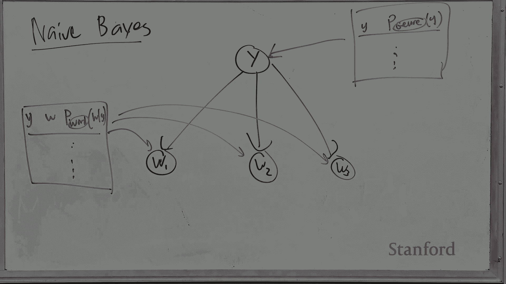

 So when you apply this to a particular variable， in some sense you bind Y to Y， and you bind。 W to the particular WI at hand。 >> [INAUDIBLE]， >> Yeah， exactly。 >> And you can see this kind of mathematically where you hear we have， you pass into W word。 WJ given Y。 And J ranges from one to L。 Okay。 Just to kind of solidify understanding。

 let me ask the following question。 If Y can take on two values as in here。 and each word can take on D values， how many parameters， are there？ In other words。 how many numbers are in these two tables on the board？ So shout out the answer。 >> [INAUDIBLE]。 >> 2D plus 2D。 Right？ Okay。 Okay。 So 2D plus 2， so there's 2 here， right？ So there's CD。

 so there's two numbers。 And then for every C， there's D possible values for D。 there's D possible values。 So there's 2 plus， so there's 2 here， and then there's D plus D here。 Okay。 Now if you really want to be fancy and count the number of parameters you really need。 it should be less than this because if I specify the probability of C， then you can。

 one minus that probability is probability of D， but let's not worry about that。 Okay。 Let's do the same thing for HMM's， just to make sure we're on the same page here。 Since we all love HMM's。 Okay。 So in HMM， remember， there's a sequence of hidden variables， H1， H2。 H3。

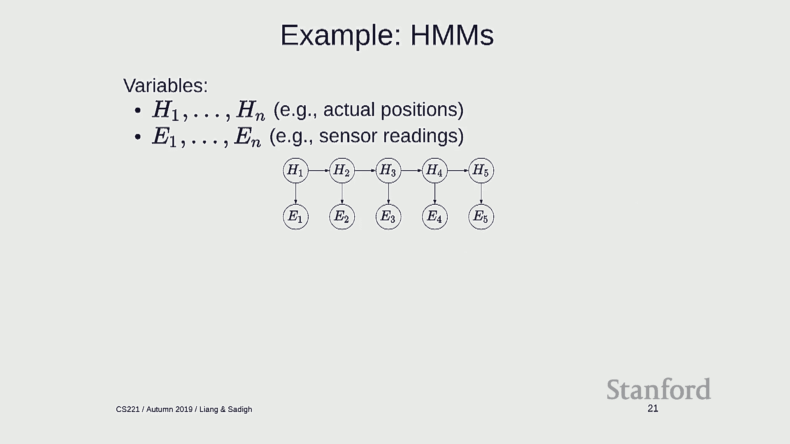

 And for each hidden variable， we have E1， E2， and E3， which are the observed variables。 And there are three types of distributions for HMM's。 There is the probability of。 I'm going to call P* of H， which is going to specify the， initial distribution over H1。 I'm going to have the transition probabilities， which I'm going to denote H， it's called H。

 prime probability of H prime。 I should write down P trans here。 H prime given H。 So this is going to be another distribution， which powers each transition。 Each non-initial hidden variable。 Okay。 Remember， these are pointing to variables。 not edges or anything else。 And finally， I'm going to have a distribution。

 the mission distribution of E given H。 That， table is going to power each of the observed variables E。 Okay。 And here， again， there are three types of distributions。 First， transition in a mission。 even though there could be any number of variables in actual， vision network。 And just to be very clear about this， when I apply this table to this node， H binds to。

 H1 and H prime binds to H2。 And then when I apply it to this node。 H2 binds to H and H prime binds to H3。 And again， you can see this from formulas where I'm passing in to P trans。 H i given。

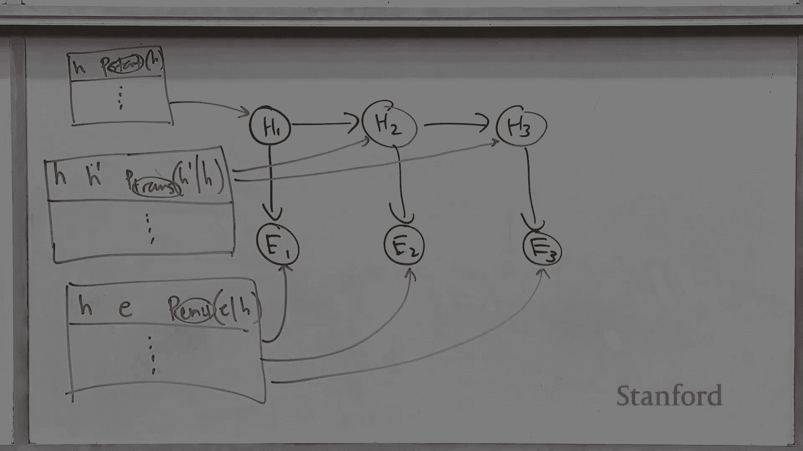

 H i minus 1， as i sweeps from 2 to n。 Okay。 So you can think about this as like a little function with local variables。

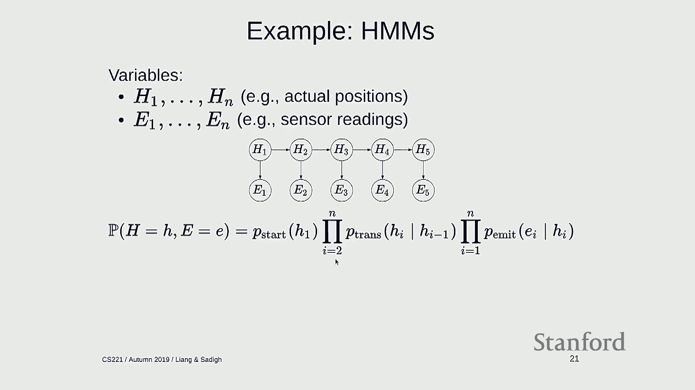

 So the argument to that function are H and H prime。 But when I actually called this function。 so to speak， when defining the joint distribution。 I'm passing in the actual variables of the vision network。

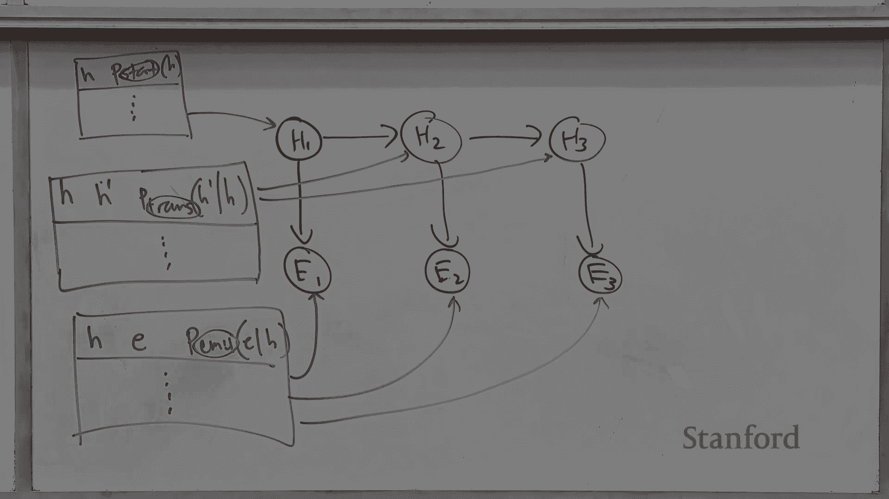

 Okay。 Any questions about this？ Okay。 Maybe just summarize some concepts first。 Okay。 So we talked about learning as the generically the problem of how we go from data to parameters。

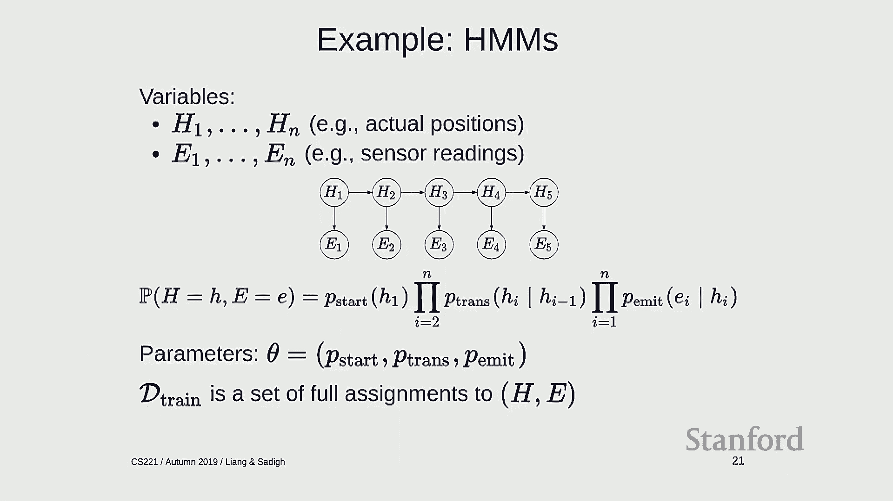

 And data in this case is full assignments to all the random variables。 In the HMM case。 a data point is a assignment to all the hidden variables and the observed， variables。 And parameters usually denoted theta is all the local conditional distributions， which。 are at least three tables in the case of HMM。 Okay。 The key intuition is count and normalize。

 which is intuitive。

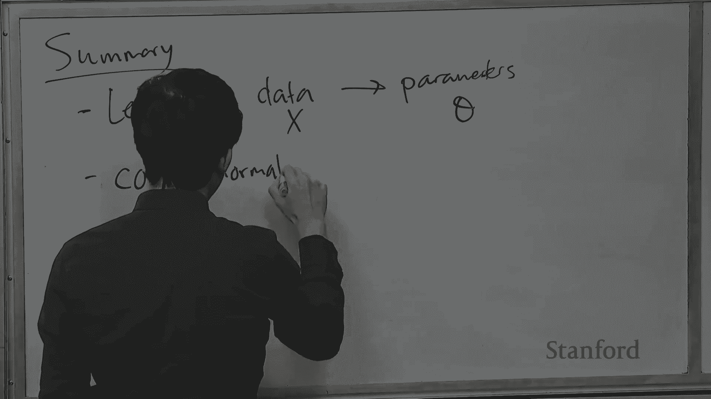

 And later I'll justify why this is an appropriate way to do parameter estimation。 And then finally。 parameter sharing is this idea which allows you to define huge Bayesian， networks。 but not have to blow up the number of parameters because you can share the parameters。 between the different variables。 Okay。 So now let's talk about the general case。

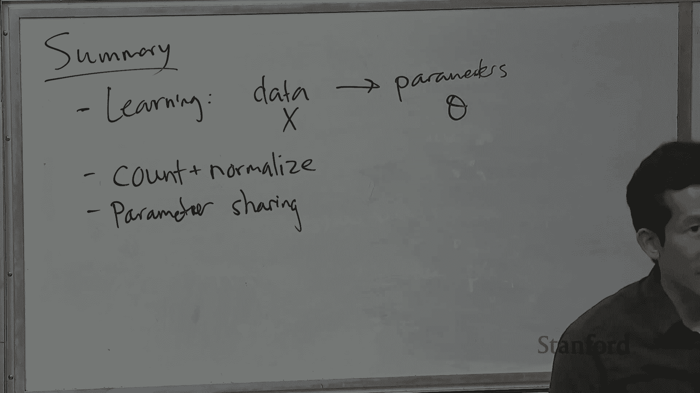

 So hopefully you kind of understand the basic intuition。 So this is just going to be some abstract notation that's going to kind of sum it up。 So in a general Bayesian network， we have variables x1 through xn。 And we're going to say that parameters are a collection of distributions。 So theta equals p a sub d。

 Okay。 And so big d is going to be the set of types of distributions。 So in the HMM case。 it's going to be three types。 Start， trans， and emit。 So basically that's the number of the boxes that I have on the board there。 And the joint distribution when you define a Bayesian network is going to be the product。

 of p of xi given x parents of i。 So this is the same as we had before。 But now notice the crucial difference which I've outlined in red here is that I'm subscribing。 this p with a di。 Okay。 So what di for the i-th variable says is which of these distributions is powering that variable。 Okay。 So d of this variable is emit。 d of this variable is transition and d of this variable is start。

 Okay。 So this looks maybe a little bit abstract and notationally but the idea is just to multiply。 in the probability that was used to generate that variable or power that variable。 Okay。 And parameter sharing just means that di could be the same for multiplies。 Yep。 Okay。 Markov model case which the emission probabilities are all the same for all of those。

 Like why do we need multiple emission states？ Wouldn't it be the same as just driving from the same distribution three times？

 Yeah。 So the question is if we only have one emission distribution why do we need so many of these。 replica copies？ And the reason is that these variables represent the objects locations at a particular time。 So the value of this is going to be different based on what time step you're at。 But the mechanism for generating that variable is the same。

 Just like if I flip the coin you know ten times。 I only have one distribution that represents the probability of heads but I have ten realizations。 of that random variable。 Another analogy that might be helpful is think of a real about these as like a primitive of。

 like functions in your program that you can call。 Right。 This is like a sorting function and sorting is just used in a whole bunch of different。 places but it's kind of the same kind of local function that powers a bunch of different。 use cases which are specific to the context。 Yeah。 Okay。

 So in this general notation what does learning look like？

 So the training data is a set of four assignments and I want to output the parameters。 So here's the basic form。 It's count and normalized。 So in counting there's just a bunch of four loops。 So for each training example which is X is a full assignment and I'm going to look at。

 every variable I'm going to just increment a counter which of the DI distribution of this。 particular configuration X parents I and X I。 Okay。 And then in the normalization step I'm going to consider all the different types of distributions。 and then I'm going to consider all the possible local assignments to the parents and I'm going。

 to normalize that distribution。 Yeah。 Yeah。 So the DI refers for the I variable which red table I'm looking at。 Okay。 So I've given you already a bunch of examples so hopefully this the notation might be a little。 bit obstrus but hopefully you guys already have the intuition。 Any questions？ I'm moving on。 The main point of this slide is just to say that this is actually very general and I just。

 didn't do it for hidden mark of models and how you base it and it doesn't work for anything， else。 Okay。 So now let me come back to the question of why does counter normalized make sense。

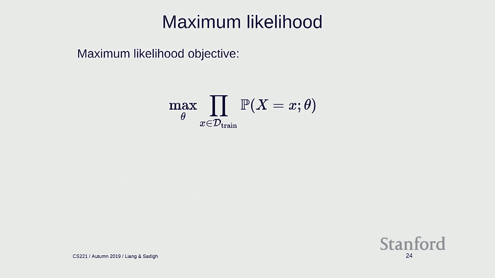

 Right。 So this is how normalizes is like some made up procedure so why is it a reasonable thing。 to do。 And it turns out this is actually based on very firm kind of foundational principles this。 idea of maximum likelihood which is an idea from statistics that says if I see some data。 and I have a model over that data I want to tweak the parameters to make the probability。

 of that data as high as possible。 So in symbols what this looks like is I want to find the parameters theta。

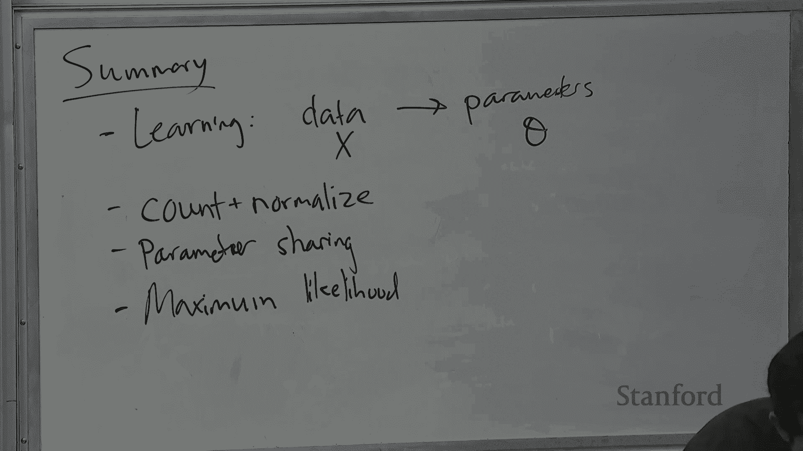

 So remember parameters are probabilities in the red tables on the board and then I'm going。 to look at make the product of all over all the training examples the probability of that。 assignment。 So for every possible setting of the parameters I can a status signs particular probabilities。 to my training examples and I want to make that number as high as possible。

 And the point is that the algorithm on a previous slide exactly computes this maximum。 likelihood so the parameters in close form。 So which is really nice。 If you think about when we talk about machine learning we define a loss function and you。 can't compute anything in close form except for maybe linear regression and you have to。

 use stochastic gradient descent to optimize it。 Here it's actually much simpler because of the way that the model is set up you just count。 and normalize and that is actually the optimal answer。 So just because you write down a max doesn't always mean you have to use gradient descent。 is a lesson here。 Okay so let me I'm not going to prove this in general but I want to give you some intuition。

 why this is true and hopefully connect the kind of the abstract principle with on the。 ground algorithm that you have counted normalize。 So suppose we have a two variable vision network with genre and rating so I have three data。 points here and I have this maximum likelihood principle which I'm going to follow and let's。 do some algebra here。 So I'm going to expand the joint distribution and remember joint distribution is just the。

 product of all the local conditional distributions and I've also expanded this you know the product。 over these three instances so I have the probability of D probably a four given D probability of。 D here probably a five given D probably of C and probably a five given C。 Okay and what I'm maximizing over here right now is a distribution over a genre and I have。

 a distribution of rating condition on a genre of C and the distribution of rating condition。 genre equals D。 Okay so I've color coded these in a certain way to emphasize that all the red touches is。 the local conditional distribution corresponding to genre the blue is corresponds to probability。 of rating given genre equals D and green is probably a rating given genre equals C。

 Okay so now I can shuffle things around okay and I notice that these factors don't actually。 depend on probability of G at all so they can just hang out over here and I essentially。 and this likewise if I'm thinking about the maximum over you know argument C on these other。 factors are just constant so they don't really matter either。

 So I basically reduce this as a problem of three independent maximization problems。 Okay and this is why I could take each local conditional distribution in turn and do count。 and normalize on each one separately。 Okay so and then the rest is actually you know to do it actually properly you have to use。 the crunch multipliers to solve it but intuitively hopefully you can either do that or just。

 believe that if I ask you what is the probability best way to set probabilities so that this。 quantity is maximized I'm going to set probability of D equals two thirds and probability of。 C equals one third。 This is similar to one of the questions on the foundations homework if you remember only。 for probability of a coin flip essentially。 Okay so hopefully some of you can now rest you know sleep and I thinking that if you。

 do count and normalize you're actually obeying some high minded principle of maximum likelihood。 Okay so let's talk about a love plus moving。 So here's the scenario if I have give you a coin and I said I don't know what's probability。 of heads but you flip it a hundred times and twenty three times its heads and seventy。 seven times its tails what is the maximum likelihood estimate going to be。

 Yeah so it's going to be probability of heads is you know counter normalize it's twenty。 three over a hundred which is point two three probably tails is point seven。 Okay so seems reasonable right。 So what about this so you flip a coin once and you get heads what's the probability of。 heads。 So the maximum likelihood says one and zero so you know some of you are probably thinking。

 you know smiling and probably thinking this is a very close minded thing to do right just。 because you saw one heads is like oh okay the probability of heads must be one tails。 is impossible because I never saw it。 So seems pretty you know foolish and intuitively you feel like well tails might happen you。 know sometimes so it shouldn't be as stark as one zero。

 Okay and this is an example of overfitting which we talked about in the machine learning。 lecture where maximum likelihood will tend to just maximize the probability and here it。 does maximize the probability because the probability of data is now one and you can't。 do better than that but this is definitely overfitting so we want a more reasonable estimate。

 So this is where Laplace smoothing comes in and again I'm going to introduce Laplace smoothing。 from kind of a fall your nose kind of framework and then I'll talk about why it might be a。 good idea。 Okay so here's maximum likelihood just a number of times head occurs over the total number。 of trials you have so Laplace smoothing is just adding some numbers so this is Laplace。

 named after the famous French mathematician who did a lot more than add numbers like Laplace。 transform and Laplace distribution but we're only going to use talk about his adding numbers。 invention I guess so so here in red I'm shown that for this problem estimate no matter what。 the data is I'm just going to add a one here I don't care what the data looks I'm just going。

 to add a one and I'm going to divide by the total number of values are which are possible。 which is two heads or tails and for tails I'm also going to add a one I don't care what。 the data says and I'm going to divide by two okay so now I get two thirds and one third。 which should be a more you know sensitive intuitively sensible estimate if you're going。

 to come up with any sort of estimate it says well I saw heads so probably more than 50%。 it's going to be heads but it's probably not you know 100% okay so let's look at it in。 a slightly more complicated setting so here I have two variables and Laplace moving is。 driven by a parameter lambda which by default is going to be one but it can be any number。

 non-negative number and what Laplace moving amounts to is saying start out with your tables。 and instead of filling them up with zero fill them with lambda okay so here's my table before。 even look at the data I'm just going to put ones down now when I look at my data I'm just。 going to add to that counter so D shows up twice C shows up once and then counter normalize。

 okay same over here before any look at any data I'm just going to populate with ones。 which is lambda and then I get my three data points and I add the three counters which are。 shown here and I counted normalize so by construction no event should have probably zero unless。 I'm the zero because I already start with one and one divided by some positive number is。

 not zero okay so the general idea is for every distribution in partial assignment I'm going。 to add lambda to that count you know and then I'm just going to normalize to get the probability。 estimates okay so the interpretation of Laplace moving is you're essentially you know pretending。 that you saw lambda occurrences of every local assignment even though you didn't see in your。

 data you're hallucinating this this data sometimes it's called pseudo counts or virtual counts and。 the more higher lambda is the more hallucination or more smoothing you're doing and that will。 draw the probabilities closer to the uniform distribution and the other extreme lambda equals。 zero is simply maximum likelihood but in the end you know data wins out so if you had Laplace。

 smoothing and you saw one head and now you're saying estimating the probability to two thirds。 but suppose you keep on flipping this coin and it keeps on coming up heads 998 times then。 by doing the same Laplace smoothing you're going to eventually update your probability， for 0。999 you're never going to reach one exactly because no probabilities are going。

 to be ever zero or one but increasingly you're going to be more confident that this is a very。 very big coin okay any questions about Laplace moving so Laplace smoothing is just add lambda。

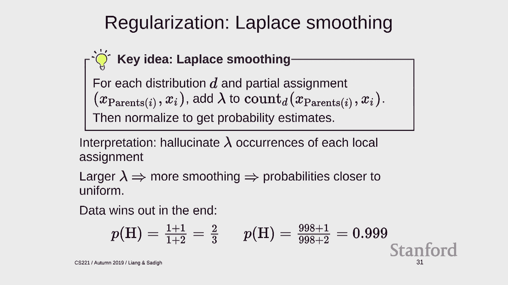

 to everything essentially and oh so I forgot the principle behind Laplace smoothing is if。 you think in terms of this is kind of beyond the scope of this course but you can think。 about a prior distribution over your parameters which is some uniform distribution and instead。 of doing maximum likelihood you're doing map or maximum a-pestory estimation so there is。

 another principle but you don't have to worry about it for this class yeah。 How do you make lambda？

 The question is how big do you make lambda？

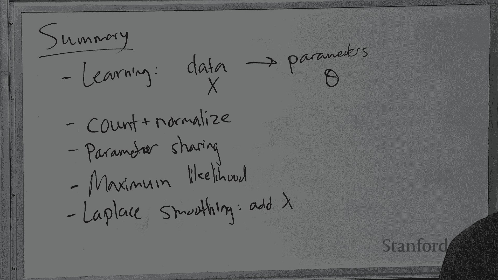

 It's a good question so one is lambda should be small it probably shouldn't be like 100。 should be more like 1 or even you can make a less than 1 maybe it should be like 0。01 or。 something it depends on you know how I guess uncertain you know you are so in general that。 these priors are meant to capture what you know about the kind of the distribution。

 Okay all right so now we get to the fun part this is going to in some sense combine learning。 which we done with probabilistic inference which we did before and the motivation here。 is that what happens if you don't observe some of the variables so far learning has assumed。 that we observe complete assignments to all the random variables but in practice this is。

 just not true right the whole reason people call them kid and mark-up models is that you。 don't actually observe the hidden states so what happens if we only get the observations。 or this simpler example what happens if the data looks like this where we observe the。 ratings but we don't observe the genres。 So what can you do so obviously the counter normalized thing doesn't work anymore because。

 you can't count with question marks。 So there is again two ways to think about what to do here the high-minded principle is。 appeal to maximum likelihood and make it work for unobserved variables and the other。 way to think about it which I'll come to later is simply guess what the latent variables。 are and then do count it normalize okay and those these two are going to be equivalent。

 So let's be high-minded for now and think about what maximum marginal likelihood okay。 So in general we're going to think about H as the hidden variables and E as observed。 variables in this case G is hidden and R1 and R2 are observed and suppose I see some evidence。 E so I see R1 equals 1 and R2 equals 2 but I don't see the value of G and again the parameters。

 are all the same the same as before I just have less data or information to estimate the。 parameters okay so if you're following maximum likelihood what is maximum likelihood say。 it says tweak the parameters so that the likelihood of your data is as large as possible。 So what is the likelihood of the data here it's simply instead of H and E I have probability。

 of E okay。 So this seems like a kind of a very natural sound extension of maximum likelihood and it's。

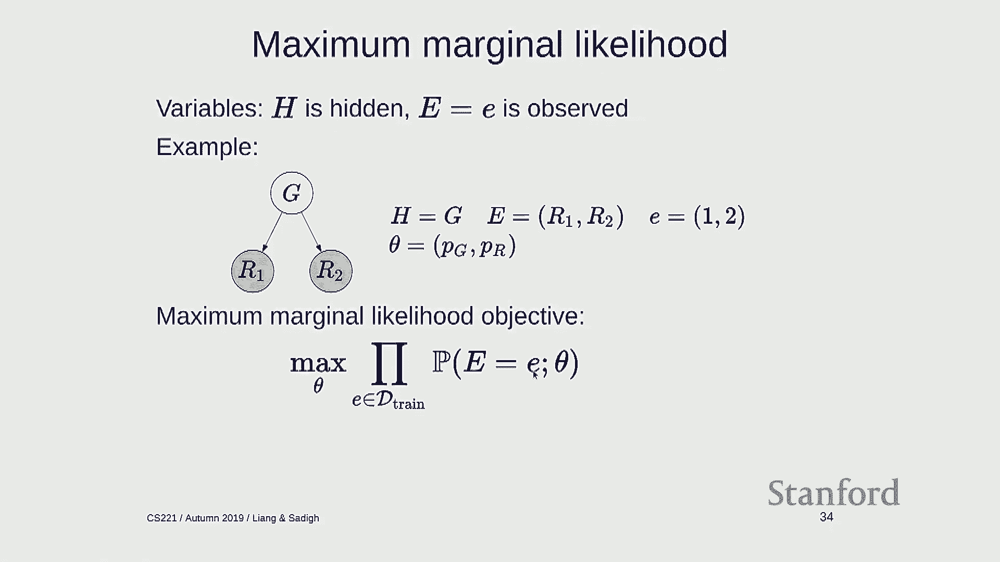

 called maximum marginal likelihood because this quantity is a marginal likelihood right。 It's not a joint likelihood or joint distribution it's a marginal distribution over only a subset。

 of the variables okay。 So now to unpack this a bit what is this marginal distribution it's actually by maximum probability。 it's the summation over all possible values of the hidden variables of the joint distribution。 So in other words you can think about maximum marginal likelihood is saying I want to change。 the parameters in such a way that such that the probability of what I see as high as possible。

 but what that really requires me to do is think about all the possible values that H， could take on。 I don't see it so I have to consider what ifs what if it were C what if it were D and so， on okay。 So in other words fundamentally if you don't observe a variable you have to consider possible。 values of it。 Alright so now let's skip to the other side kind of scrappy way and think about what。

 is a reasonable algorithm that makes sense and I'm not going to have time in this course。 to kind of show the formal connection but if you take you know CS 228 or a graphical。 models class it will go into this in much more detail。 So the intuition here is the same as what we had for K means。

 So remember K means you try to do clustering you don't know the centroids and you also。 don't know the assignments so it's a chicken and egg problem so you go back and forth between。 figuring out what the centroids are and figuring out what the the assignments are。 And the centroids are going to be the analog of parameters here and the assignments are。

 going to be the analog of the hidden variables。 Okay so here's the algorithm it's called expectation maximization it was you know formalize。 in its generality in the in the 70s and you start out with some parameters maybe initializing。 to uniform or uniform plus a little bit noise and then it's going to alter we're going to。 alternate between two steps the E step and the M step and if you it's useful to think。

 about the K means in your head while you're going through this algorithm。 So in the E step we're going to guess what the hidden variables are or what the values。 of the hidden variables take on。 So we're going to define this Q of H which is going to be our represent our guess and。 since we're in probability land we're going to consider the distribution over possible。

 values of H and this guess is going to be given by our current setting of parameters。 and the evidence that we've observed and are fixing。 So we're asking the question what is the probability of the hidden variables taking。 on particular values of H given my data and given my parameters。

 So this should this should look kind of familiar to you right what is this？

 This is just probabilistic inference right which we've been doing for the last lecture。 which means that you can use any probabilistic inference algorithm here you can do forward。 backward you can do Gibbs sampling and that's kind of a sub module that you need to do， E M okay。 So now what happens if we have our setting of or guess over the possible values H now。

 we make up data so we create weighted points with particular values of H and E and each。 of them gets some weight Q of H and then finally once we're given these weighted points now。 we're just going to use do counter normalize and do maximum likelihood okay。 So I'm going to walk through an example to make this a little bit more grounded out。

 So I'm going to do this on a board because it's going to get a little bit maybe a little， bit hairy。 Okay let's do this。 So here we have a three variable。

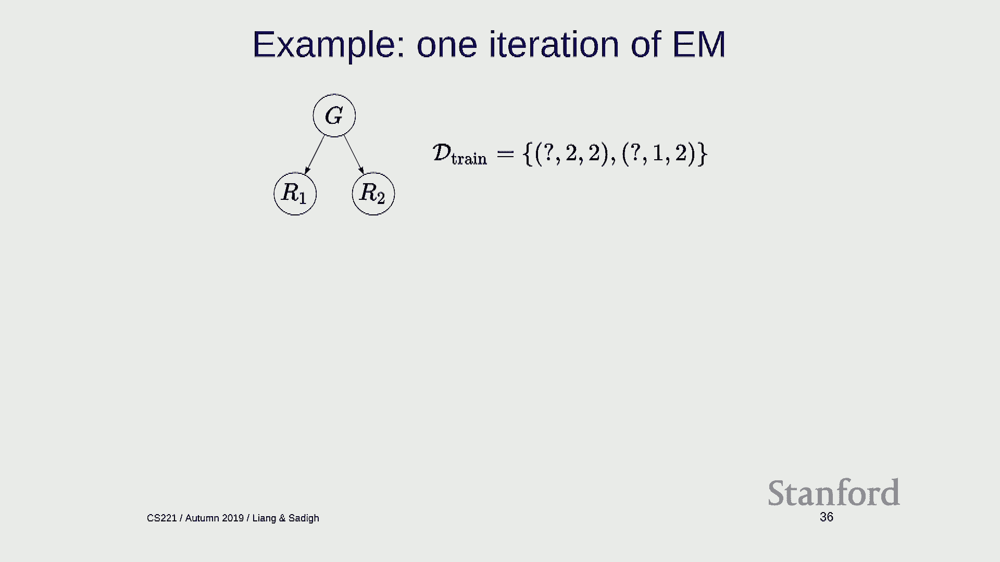

 We have a two-dimensional equation network so we have let's draw it over here actually。 might need a space。 So we have G we have R1 and R2 okay and our data that we see is we get data which is 2。 2 and 1 2 okay。 So I observe 2 2 that's 1 data point and 1 2 that's another data point okay。

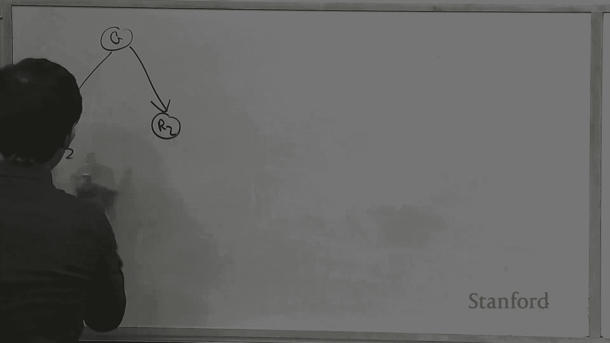

 So initially what I'm going to do is start with some setting of parameters okay。 So I'm going to start with my parameters theta which specify a distribution over G and for。 lack of information I'm going to consider just half and half let me write point five consistent。 So I'm initializing you with a uniform distribution and my other table here is going to be a little。

 bit of G and R so probability of R given G and here I have C the possible values of G。 and the possible values are which for simplicity I'm going to assume to just be 1 and 2 and。 then for this I have for these numbers 0。4， 0。6 and 0。6， 0。4。 So I'm not setting them to uniform but adding a little bit of noise。

 So hopefully people can check that the numbers on the board are the same as the numbers on。 the slides。

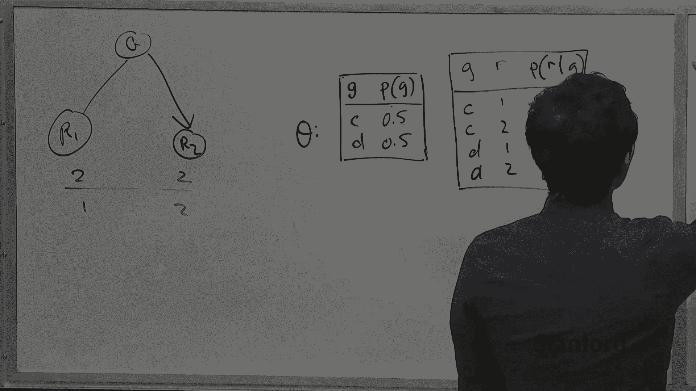

 So that's my initial parameter setting。 So now in the E step I'm going to use these parameters and to guess what G is okay。 So what does this look like？ So for each possible data point so for every example so I have 2。 2 that's one data point。 I'm going to try to guess what the value of G is。 So it could be C it could be D and for the other data point 1， 2 it's also could be C。

 or could be D okay。 And now I'm going to try to compute a weight for each of these data points based on the。 model okay。 So the weight is now look at this this is cool right because I have a complete assignment。 and I know what to do with complete assignments I can just evaluate the probability about assignment。 So now just to make things concrete I have probably G times probability of R1 given G。

 probability of R2 given G this is by definition the probability of G2 equals that's a little。 bit messy。 So this is joint distribution by definition of this vision network it's this okay。 So how do I compute the probability of this configuration？

 Well it's a probability of G equals C so I look at this table that can be a point 5 times。 the probability of R1 given G that's 2 and C。 So if you look over here that's a 0。6 and then another R2 given G that's also a 2 and C so， that's 0。6 because of parameter sharing and that's a 0。18 right。

 Let me give you a bit of a slide so you guys can check my work。 Okay so now I look at this table so probability of G equals D is 0。5 and then the probability。 of R1 equals 2 given G equals D look at this table that's 0。4 and then I have another 0。4。 from another 2 and that is 0。08 and then I can normalize this question。 So why is this 0。4 versus 0。

6 here？ This is because I initialize the parameters so that the probability of R equals 2 given。 G equals D is 0。4。 I just wondered why did I use this initialization？

 Why did I use this initialization just for fun？ I just made it up。 Just so that if I had put 0。5 here then you couldn't really tell what was going on and， also as a side market wouldn't work。 Initialization is generally going to be random but as close to uniform as possible。 So this is the column is going to be the probability of basically G equals G。 R1 equals R1。

 R2 equals， R2。 And then the Q is going to just be the weight of this and normalizing these two which means。 you add them up and you divide and then you get 0。69 and 31。 Sorry the numbers are a little bit kind of awkward but that's where you get there。 I'm not going to do the second row but it's basically the same type of calculation。 Question？

 >> Is the activation kind of like particle filtering in that like the Q step you do like。

 the proposal and then the weighting and then the end step is like resampling like finding。 the maximum？ >> So question is is E expectation maximization is kind of like part of the filtering because。 you have this proposal and you're reweighting。 Structurally it's quite different。 I mean there is a sense like there's some proposing different options but certainly the。

 two algorithms are meant to solve very different tasks。 One is for learning and one is for probabilistic inference。 Okay so let's look at the M step now。 Okay so the M step I'll let you guys fill this in。 So the M step， I actually want to keep this up。

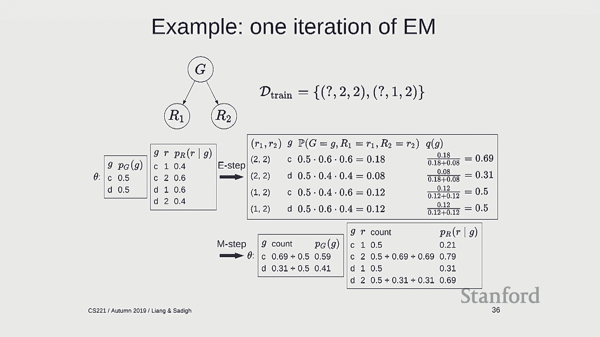

 Let me do the M step over here。 Is going to now just take these examples so these weights are 0。5。 So it's like someone handed you fully labeled data， complete observations， four points but。 each of observation has a weight。 So now the only difference in counting normalize instead of just adding one whenever you see。 a particular configuration you're going to add the weight。

 So for each of the parameters I'm going to look at so this is going to be G probability， of G。 So this can be either C or D。 And to get this I have let me first do the count。 Well okay let me just add it here。 So I look at my data。 So let me mark this。 So this is now my kind of， I'm going to put data in quotes because I didn't actually observe， it。

 I just hallucinated it and these are the weights which are associated with the data， points。 Now I'm going to look at G equals C。 So I see C here， C here and I have the weights 0。69， 0。5 probability of， sorry just count。 And then for D， I see a D here and I see a D here that's 0。31 plus 0。5 and then I normalize。

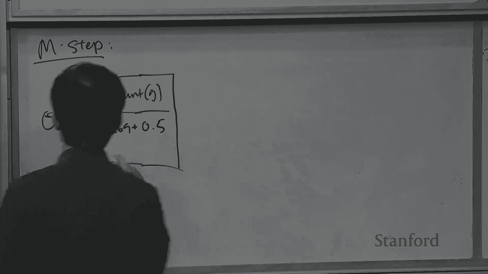

 this and I get my estimate。 So on the slide this is exactly what I did here。 I count and normalize and I'm going to， now I'm going to do this table by you hopefully。 get the idea。 Yeah？ Yeah so in the each step you have to estimate for all possible assignments to each。 So in this case H is only one variable。 In the next example H is going to be in a hidden mark-up model all the variables and。

 we're going to see how we can deal with that。 Yeah？

 Can you explain briefly how we get the values in the second table？ The second table with this one？

 This one？ Yeah。 Yeah sure just briefly， so you look at these data points and you see C1， okay。 so where， does C1 show up？ So G equals C here， R1 equals 1 here， so that's a 0。5 here。 And then what about C2？ Where does C2 show up？ C2 shows up twice here with R1 and R2。 so that's why there's 2 of 0。69s here。 And C2 shows up once here with a weight of 0。5。

 Is everything in X that's based on J？ Yeah everything here these counts are based on the table from the E step。 Okay？ All right， so let's do something a little bit fun now。 So the copial cipher is this 105 page encrypted volume that was discovered and people dated。 back from the 1730s。 So it looks like this。 So it's unreadable because it's actually a cipher。

 it's not meant to be just read。 And for decades people are trying to figure out， you know。 what is the actual message that， was inside this text？ It's a lot of text。 And finally in 2011 some researchers actually cracked this code and they actually used EM。 to help do this。 So I'm going to give you a kind of toy version of using EM to do this cipher。

 And it turns out that this code is basically some book from a secret society which you can。 go read about on Wikipedia if you want。 So substitution ciphers。 A substitution cipher consists of a substitution table which specifies for every letter， assuming。 we have only 26 right now， a cipher letter。 Okay？ And the way you apply a substitution table is you take a plain text which generally is。

 unknown if you're trying to decipher like， you know， let's say hell of a world and you。 look up each letter in the substitution table and you write down the corresponding thing。 So H maps to N， so you write N， E maps to M， so you write down an M and so on。 And so someone did this and then they obviously didn't give you the plain text， they give you。

 the cipher text。 And so now all you have is a cipher text。 And obviously didn't give you the substitution table either。 So all you have is the cipher text and you're trying to figure out both the cipher， a substitution。 table and also the plain text。 Okay？ So hopefully this pattern matches something。

 And let's try to model this as a hidden Markov model。 Okay？

 So here the hidden variables are going to be the characters in the plain text。 This is the actual sequence that the hell of a world。 And then observations are the characters of the cipher text。 So familiar equation。 the joint distribution of the hidden Markov model is given by this。

 equation and we want to estimate the parameters which include p star p trans and p in it。 Okay。 So how do we go about doing this？ So we're going to approach this in a slightly different way I guess than simply just running。 the algorithm because we have additional structure here。 So the probability of start。 I have no idea， just decided to uniform。 The probability of transition， so this is interesting。

 So normally if you're doing EM you don't know the probability of transition。 But because we know。 let's say we know that the underlined text was English， we can actually。 estimate the probability of a character given a previous English character from just English。 text lying around。 So this is cool because it allows us to hopefully simplify the problem。

 I should maybe comment that in general unsupervised learning is really。 really hard and just because， you can write down a bunch of equations doesn't mean that will work。 And it's very hard to get it to work。 So you want to get as much kind of supervision or information as you can。 Okay。 So finally， E， P emit is the substitution table which we're going to derive from EM。 Okay。

 So now this might not type check in your head because a substitution specifies for every。 letter one other letter， the cipher letter。 But in order to fit it into this framework。 we're going to think about a distribution， over possible cipher letters given a plain text letter。 With the intention that well， if it's doing its job， it can always put a probability one。

 on the actual cipher letter。 Okay。 So just stepping back away from the formalism。 why might you think this could work？ And in general， this is not obvious that it should work。 But what you have here is a language model， P transition， which tells you kind of what。 plain text looks like。 If you generate a cipher and you say， ah。

 this is my cipher and you get some garbage， then it's probably not right。 So we have some information about what we're looking for。 So like when you solve a puzzle。 you know when you kind of solve that。 And then finally。 we also have this emission that tells us that each letter that E has。

 to go to kind of be substituted in the same way。 So you can't have E going to， you know， different。 completely different things at different points， in time。 Okay。 So， um。 so for doing estimation in the HMM， we're going to use the EM algorithm。 And remember。 in the E step， we're just doing probabilistic inference。

 And we saw that forward backward gives us probabilistic inference。 In particular。 it gives you for every， um， position。 I'm going to give you， uh， my guess。 which is a distribution over possible hidden variables。 So remember， at each position。 I observed a cipher letter and I'm going to guess a distribution， over the plain text letter。 Okay。

 And then the M step， I'm just going to count and normalize as we did before。 So once I've guessed the cipher letters， I can just， um， compute the probability of some。 cipher letter given a plain text letter。 Okay。 So I'm actually going to code this up and see， um。 it is so you can see it in action。 Okay。 And we have five minutes here。 So to make this quick。 Um。

 okay。 So here we have cipher text。 Okay。 Looks pretty good。 Um。 we're going to decrypt this or decipher it。 Um， and then we also have our， uh， text。 which is just some English text that we found。 Um， and then I'm going to， oops， I want to decipher。 not in cipher。 Okay。 Um， so there's some utilities which are going to be useful。

 So things for reading texts， converting them things into integers， um， normalize of， um。 weights and then most importantly this implementation of a forward backward algorithm which we're。 going to use。 Um， okay。 Because I'm not going to try to do that in five minutes。 Um， okay。 So let's initialize the HMM and then later we're going to run EM on it。 Okay。

 So the HMM parameters are， there's going to be start， um， probability which is P in our。 notation probability of start。 And this is going to be one over the number of possible letters here。 Um， for， this is just a uniform distribution， one over K。 And I should say K is 26 plus one。 so this is， uh， lowercase letters plus space。 Okay。 So now we have our， um。

 transition probabilities。 Um， and I'm going to， this is going to define a distribution over， um。 hidden variable， a， next hidden variable given previous hidden variable。 And notice that the order is reversed here because I want to first condition on H1 and。 then this thing is going to be a distribution。 Um， so to do this， I'm going to first， um。

 remember my strategies， I'm going to use the， language model data to， to count。 So I'm going to have， um， again set things to zero for H2 and range K for H1 and range， K。 And this basically gives me a， a matrix of K by K matrix of all zeros。 And now I'm going to get my raw text， um， and I'm going to read it from， um， Lm dot train。

 which remember looks like this。 Um， and I'm going to convert this into a sequence of integers where。 um， they're going， to be zero to K minus one。 Um， and then I'm going to。 how do I estimate the transition， uh， again， count it normalize。 So I'm going to go through this sequence and， um， and I'm going to count every successive。

 transition from one character to another and I'm going to， um， so I'm going to， at position， i。 I have a character which is raw text of i at position i plus one， I have another character， H2。 and I'm just going to increment this count。 Okay。 And finally。 I'm going to normalize this distribution。 So， um， transition props equals， um， so for every， um， H1。

 um， I have， I have a transition， counts of H1 and I can call the helpful normalize function which takes this distribution and。 normalizes it。 Okay。 So this is just doing fully observed maximum likelihood of count normalize on just the。 um， the plain text。 Okay。 Um， all right。 So now emission props， um。 this is going to be probably a limit of e given H and I'm going。

 to just initialize these to uniform because I don't know any better。 Um， so 1 over k for， uh。 en range k for range k。 So just so it happens that both the， um。 hidden variables and observed variables have the， same domain。 Um， that's not generally the case。 Okay。 So now I'm ready to run em。 So， um， I'm going to do 200 iterations just。

 just to put in a number。 Um， so I have the E step and the M step。 So in the E step。 remember I'm going to do probabilistic inference。 I'm going to call forward backward and remember this is。 um， this is going to be basically， in our notation at the position I。 what is my distribution over hidden states？ So this is actually forward backward， um， oh， I need to。

 um， read some observations in。 So I read my ciphertext， uh。 ciphertext and I'm going to convert this again into integer， array。 Um。 and then I have observations and then I pass in the parameters of my， um， hidden， Markov model， um。 and then I have my guess。 So let me print out what that guess is。 Okay。

 So what I'm going to do here is for every position， I'm going to get the most， uh， likely outcome。 of H。 So you till of arg max of qi， um， for i in range， um， length of， uh， observations。 Okay。 So that gives me an array of guesses for each position。 Um。 and then I'm going to convert that into a string。 So it's easier to look at and put in the line。

 So this is printing， uh， the best guess。 Okay。 So finally for the M step， um， I'm going， I have my。 uh， q which gives me counts。 So now I pretend I have a lot of， you know。 data which are weighted by q。 So I'm going to have emission， um， counts equals， uh， same as before。 I'm just going to get a matrix of zeros， um， E in range K for H in range K。 Um。

 and then I'm going to go through the sequence from i equals range of， through the length。 of the observation sequence， um， and for each， uh， position in the sequence， I'm going to。 consider all the possible， um， possible plaintext hidden values。 And I'm going to increment， um。 H observations of i。 So this is the observation that I actually saw。 Um。

 and this should be q iH which is the weight of， uh， H， H at position i。 Okay。 And then finally。 I'm just going to normalize。 So， um， like what I did， uh， well， okay， I just normalize it here。 So emission probabilities is util dot， um， normalize of the counts， um， for H in range， K。 Okay。 And I think that's， uh， pretty much it。 Um， let me just see if this， okay。 And this should be for。

 for e， what？ Right？ Okay。 Okay。 Um， okay。 So let's run this and then I'll go back to the。 let me just go over the code just one， more time。 Okay。 So， uh， so we initialize the。 the probabilities to uniform。 For transition probabilities， we can use the observations， uh， or the。 the， just the plain， text， which is count and normalize。 In emissions， um。

 we initialize with uniform and then we're running EM。 We read the ciphertext and then in the E step。 we're going to use the current prob parameters， to guess where the ciphertext is。 And then we're going to update our estimate of what the parameters are given our guess。 of what the ciphertext is。 Okay。 So here's the final moment of truth。 Uh， the ciphertext。

 And so remember each iteration， it's going to print out the best guess。 So it'll look like gibberish for a little bit。

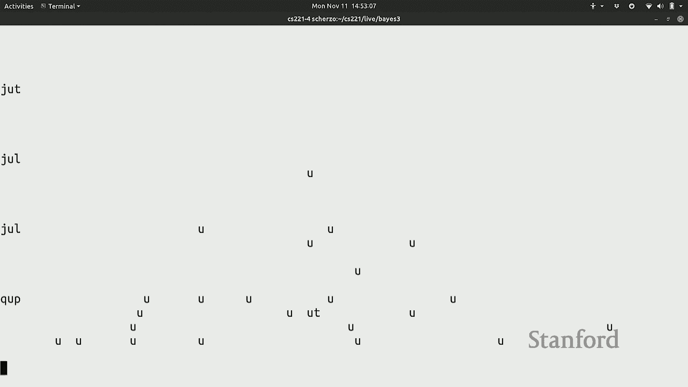

 It's not going to be perfect。 Um， but this is， starts to look somewhat like English。 Um。 there's an and an in my， in their， um， anyone can read this alone without。 Okay。 That looks like English。 Maybe there's like anyone that I could。 Anyone， guess what this text is？

 So here's the plain text。 So I lived my life alone without anyone that I could really talk to until I had an accident。 with my plane in the， um， desert with my， whatever， something。 But， but so again。 unsupervised learning doesn't， it's not magic。 It doesn't always work。 but here you at least see some signal and in the actual application。

 it got partway there and then you can iterate on this man kind of in a manner way。

 Okay。 Oops。 All right。 So that's for it for Bayesian networks on Wednesday。 We'll do logic。 Okay。

 All right。 All right。 All right。 All right。