# P5：Lecture 5（给我讲故事看已校对） Search 1 - Dynamic Programming Uniform Cost Search - 鬼谷良师 - BV16E411J7AQ

 Hi everyone， I'm Dorsa and this week I'll be teaching the state-based models and the。

 plan is for the next couple of weeks for me to teach the state-based models， MDPs and。 games and then after that， Percy will come back and talk about the later topics。 So a few announcements。 So homework three is out， so just make sure to look at that。 And then the grades for homework one will be coming out soon。 So just， yeah。 All right。

 so let's talk about state-based models。 Let's talk about search。 So just to start。 I was thinking maybe we can start with this question。 If you can， let me reset this。

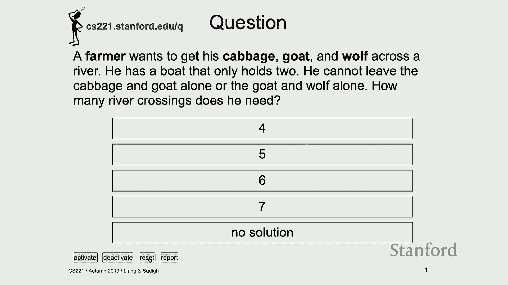

 So basically， let me tell you what the question is and then think about it and then after， that。 I'll get this working。 So the question is you have a farmer and the farmer has a cabbage。 a goat and a wolf。 And it's on one side of the river。 Everything is on one side of the river。 So you have this river， you have a farmer， you have the farmer with the cabbage with。

 the goat and with the wolf。 And the farmer wants to go to the other side of the river and take everything with himself。 And but the thing is the farmer has a boat and in that boat can only fit two things。 So the farmer can be in it with one of these other things。 So the question is how many crossings can the farmer do to take everything on the other。

 side of the river and there are a bunch of constraints。 The constraint is if you leave the cabbage and goat together， the goat is going to eat， the cabbage。 so you can't really do that。 If you leave wolf with the goat， the wolf is going to eat the goat。 you can't really， do that。 How many crossings should you take to take everything to the other side？

 Think about it， talk to your neighbors。 I'll get this working。 Everyone clear on the question？ Okay。 Hi。 [INDISTINCT CHATTER]， The link doesn't work because I can't connect to Internet。

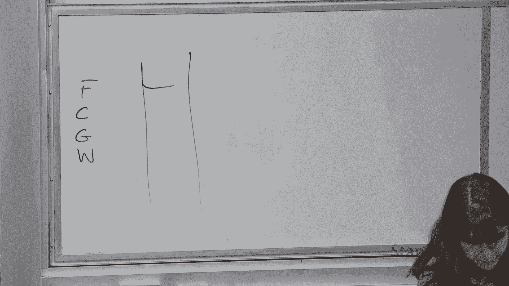

 But all right。 So， okay。 So how many people think it is four？ Four crossings。 Five。 Five crossings。 Six。 Six。 Some people think six。 Seven。 No solution。 No solution。 Okay。 So the point is actually not like what the answer is yet。 You'll come back to this question and try to solve it。

 But I think the important point to think about right now is how you went about solving， it。 So what were you thinking and what was the process that you were thinking when you were。 trying to solve this problem？ And then that is kind of the commonality that search problems have。 And we want to think about those types of problems where it's more challenging to answer。

 these types of questions and let's say reflex based type of questions。 So that's kind of just a motivating example that will come back later。 And here's an XKCD on this。 So basically one potential solution is the farmer takes the goat， goes to the other side。 comes back， takes the cabbage， goes to the other side， and just leaves the wolf。

 Because why would he need a wolf？ Why would a farmer need a wolf？ So if you answered four。 you probably were thinking about this。 And I guess it has an interesting point in it because sometimes maybe you should change。 the problem。 Your model is completely wrong。 Maybe sometimes you should rethink and go back to your model and try to fix that。 But anyways， so we'll come back to this question。 So all right。

 so this was our guideline for the class。 And we have already talked about reflex based models。 So we have talked about machine learning and how that can get applied。 And now we want to start talking about state based models this week。 We're going to talk about search problems next week， MDPs， and then the week after we。

 are going to talk about games。 And if you remember the kind of the guideline that we had for the class was we were thinking。 about these three different paradigms of modeling。 We talked about this already。 So modeling inference and learning。 So for reflex based models， we talked about this already。 So what would the model be？ Well， it can be a linear predictor or it can be a neural network。

 So that was the model。 And then we talked about inference。 But in the case of reflex based models。 it was really simple。 It was just function evaluation。 You had your neural network and you would just go about evaluating it。 And that was inference。 And you also spent some time talking about learning。 So how would we use， like。

 what's a gradient descent to try to fit the parameters of the， model？

 So similar thing with search based models。 You want to talk about these three different paradigms that we have in the class。 And the plan is to talk about models and inference today。 And then on Wednesday。 we'll talk about learning。 And we kind of have the same sort of format next week too。 So we're going to start talking about modeling inference on Mondays。

 Wednesdays are going to be about learning。 So just to give you an idea of what the plan is。 All right。 So what are search problems？ Let's start with a few motivating examples。 So one potential example one can think of is route finding。 So you might have a map and you want to go from point A to point B on the map。

 And you have an objective。 So you want to maybe find the shortest path or the fastest path or most scenic path。 And that is your objective。 And the things you can do is you can take a bunch of actions。 So you can do things like go straight， turn left， turn right。 And then the answer for the search problem is going to be a sequence of actions。

 If you want to go from A to B with the shortest path， the answer that one would give is maybe。 turn right first and then turn left and then right again or any of these sequences。 So this is just a canonical example of what a search problem is。 There are a few other examples。 So for example， you can think of robot motion planning。

 So if you have a robot that wants to go from point A to point B， then it might want to。 have different objectives for doing that。 So again。 the question might be what is the fastest way of doing it？

 Or what is the most energy efficient way of getting the robot to do that？

 Or what is the safest way of doing it？ Another question that we are interested in is what is the most expressive or legible。 way of robot doing it so people can understand what a robot really wants。 So you might have again various types of objectives。 You can formalize that。 And then the actions that you can take in the case of the robot motion planning is the。

 robot is going to have different joints。 And each one of the joints can translate and can rotate。 So translation and rotation are the type of actions that you can take。 So in this case。 I have a robot with seven joints。 And then I need to tell what each one of those joints should do in terms of translation and。 rotation。 This is my robot。 Yes。 It's a fetch robot。 All right。 So let's look at another example。

 So games is a fun example。 So you might think about something like Rubik's cube or this 15 puzzle。 And again， what do you want to do as a search problem？ Well。 you want to end up in configuration that's desirable。 So you want to end up in a configuration where you have this type of configuration of Rubik's。

 cube or the 15 puzzle。 So that is the goal。 That's the objective。 And then the action as you can move pieces around here。 So the sequence of actions might be how you're moving these pieces around to get that particular。 configuration of the 15 puzzle。 So again， another example of what a search problem is。

 Machine translation is an interesting one。 It's not necessarily the most natural thing you might think about when you think about。 search problems。 But what it is actually， you can think about it as a search problem again。 So imagine you have a phrase in different language and you want to translate it to English。 So what is the objective here？ Well， you can think of the objective as going to fluent English and preserving meaning。

 So that is the objective that one would have in machine translation。 And then the type of actions that you're taking is your pending word。 So you start with there and then you're pending blue to it and you're pending house to it。 So as you're pending these different different words， those are the actions that you're taking。

 So in some sense， you can have any complex sequential task and the sequence of actions。 that you would get to get to your objective is this going to be the answer for your search， problem。 And you can pose it as a search problem。 All right。 So what is different between， let's say。 reflex based models and search problems？ So if you remember reflex based models。

 the idea was we would have an input X and then， we wanted to find this F， for example。 a classifier that would output something like， this Y， which is the label。 It's a plus one or minus one。 So the common thing in these reflex based models was we were outputting this one label。 this one in this case， action being minus one or plus one。 Again， in search problems。

 the idea is I'm given an input。 I'm given a state and then given that I have that state。 what I want to output is a sequence， of actions。 So I do want to think about what happens if I take this action。 Like， how is that going to affect the future of my actions？ Okay。 So the key idea in search problems is you need to consider future consequences of the。

 actions you take at the current state。 Like just outputting one thing and then re-rank the function on the updated state。 So if you re-run it， so the question is， yeah， is it not the same as I'm re-running it。 I output a thing and then I re-run it again。 And then you could do that。 but that ends up being a little bit of a， that would be similar， to a greedy algorithm where， like。

 let's say I want to get to the door and I want to find， the fastest way。 And right now。 if I just look at like my current state， maybe I think the fastest way of getting。 there is going this way。 But if I actually think about a horizon and I think about how this action is going to。 affect my future， I might call it with different sequence of actions。 Okay。 All right。 Okay。 So。

 and then we've already seen this paradigm。 So let's start talking about modeling and inference during this class。 So this is the plan for today。 So we're going to talk about three different algorithms for。 we're doing inference for search， problems。 So， so we're going to talk about tree search。 which is the most naive thing one could do， to solve some of these search problems。

 But that's the simplest thing we can start with。 And then after that。 you want to look at improvements of that doing dynamic programming， or uniform cost search。 The difference between search space problem and a reflex space problem， the very fact that。 in a reflex space problem， the output that you give does not influence an extreme group。

 And it doesn't search。 Yeah， that's true。 Yeah。 So， so the output that you get in search problem。 it's this action that actually influences your， future。 Yeah。 that's a good way of actually thinking about it。 All right。 So， so let's talk about tree search。 So let's go back to our favorite example。 Okay， so we have the farmer cabbage， go to involve。

 So let's think about all possible actions that one can take when we have this farmer， cabbage。 go to involve。 Okay， so， so a bunch of things we can do is the farmer can go to the other side of the。 river with the boat alone。 So this triangle here just means like going to the other side of the river。 The farmer can take the cabbage。 So C is for cabbage， G is for goat， W is for wolf。

 So another possible action is the farmer takes the cabbage or the farmer takes the goat or。 the farmer takes the wolf and goes to the other side of the river。 You also have a bunch of other actions。 The farmer can come back。 The farmer can come back with the cabbage， come back with the goat， come back with the， wolf。

 So I'm basically enumerating all possible actions that that one could ever do and sure。 none of like not some of these might not be possible in particular states， but I'm just。 creating this library of actions， things that are possible。 Okay。 So then when we think about this as a search problem， we could create a search tree which。

 basically starts from an initial state of where things are and then we can kind of think。 about where we could go from that initial state。 So the search tree is more of a what if tree which allows you to think about what are the。 possible options that you can take。 So conceptually what it looks like is you're starting with your initial state where everything。 is on one side of the river。 So those two lines are the river， blue lines。

 And you can take a bunch of actions， right？ Like one possible action is you can take the cabbage and go to the other side of the。 river and you end up in that state。 And that state is not a good state， so I'm making that red。 Well， why is that？ Because the wolf is going to eat the goat。 That's not that great。 And every action， every crossing， let's say every crossing takes cost of one。

 So that one that you see on the edge is the cost of that action。 So that didn't really work that well。 What else can I do？ Well， I can do another action。 I can。 from the initial state， I can take the goat and go to the other side of the river。 That ends up in this configuration。 From there the farmer could come back， take the cabbage。

 go to the other side， end up in， this configuration。 The farmer can come back。 That's again not a great state because cabbage and goat are left on the other side of the， river。 Goat is going to eat the cabbage。 That's not great。 What else can I do？ Well。 the farmer can come back with the goat。 And then once the farmer comes back with the goat。

 the farmer leaves the goat， takes， the wolf， goes to the other side， comes back。 gets the goat again， and then we're done。 So how many steps at the stake？ One， two， three， four。 five， six， and seven。 So the one who has their seven， that was the right answer。 And that is kind of the idea of getting to this end。

 The not include the option that would be going back to the previous state， even though that。 is invalid。 Next step， just because we have it。 So you could have this giant tree where you go to different states。 but you can actually， have a counter that tells you if I have visited that state and if you have visited that state。 maybe you don't want to go there again because you have already explored all the possible。

 actions from there。 You're not done with this tree though， right？ I found this good state here。 but maybe there's a better way of getting there。 I don't know yet。 I haven't explored everything。 So what I can do is I can actually explore all these other things that one could do。 I'm not going to go over them。 But there is another solution and it turns out that other solution also takes seven steps。

 So it's not necessarily a better solution， but you've got to explore all of that because。 there could be another solution later on that is better than the seven steps。 Okay。 All right。 Are these slides up？ They are。 They should be。 Slides are up。 Okay。 All right。 So this is how the search tree looks like。 Yes。 Oh， that's a very good point。

 Thank you for saying support。 CPD students， I'll try to repeat the questions。 I always forget this。 I'll try to repeat the questions。 The question was， are the slides up， up？ They are up。 They should be up。 All right。 So going back to our search problem。 So we can try to formalize the search problem。 So let's actually think about it more formal。

 So what are the things that we need to keep track of？ So we have a start state。 So let's define a start to be the start state。 In addition to that。 we can define this function called actions which returns all possible， actions from state。 So actions is a function of state。 If I'm in a state。

 it basically tells me what are the actions I can take from there。 I can define this cost function。 So this cost function takes a state in action and tells me what is the cost of that。 In this example， the cost of crossing the river was just one， but you can imagine having。 different cost values。 We can have a successor function that basically takes a state in action and then tells us where。

 we end up at。 So if I'm state S and I take action A， where would I end up at？

 And that's a successor function。 And then we're going to define an is end function which basically checks if you're in an end。 state where we don't have any other possible actions。 You can think of it as a way of finite state machine type of way of looking at it。 So we use a similar type of formalism for MDPs and games too。

 So it's just a good idea to get all these formalisms。 But start state transitions costs。 Yes。 >> [INAUDIBLE]， >> So cost depends on that position in action and actually depends on the state。 >> So the action， okay， so action depends on state。 So you start from start state where you haven't taken any actions， right？

 And then from that start state， then you can think about all possible， right up there。 So you're in that start state and then you can think about all possible actions you can。 take and then those actions depend on current state but they don't depend on the future， state。 right？ So based on my current state， everything is on one side of the river， I can think about。

 all possible actions I can take and where I end up at。 And then after that。 like the next action depends on that state。 So it's a sequential thing。 >> Okay， yes。 >> You have all the information on the actions and the costs that you could do beforehand。 How is this conceptually different than a min cost or contacts optimization？

 >> You can think about it。 Okay， so how is it different from a kind of convex optimization type of problem？

 So we have an objective here and you can think of what that objective is and based on what。 that objective is， you can have different methods for solving it， right？

 So you can basically formulate this as an optimization problem where you look for。 the solution to the search problem as an optimization problem。 That's perfectly a perfect way of doing it。 And we are going to talk about various types of methods for solving this problem today。 Okay？ All right， so let's look at another example。 So this is a transportation problem。 >> Yeah。

 I'll just use this。 So okay， so basically what we want to do is we have street blocks from one through N。 So one， two， three， four， so on。 So these are street blocks， and here's here。 And what we want to do is we basically want to travel from one to some N number。

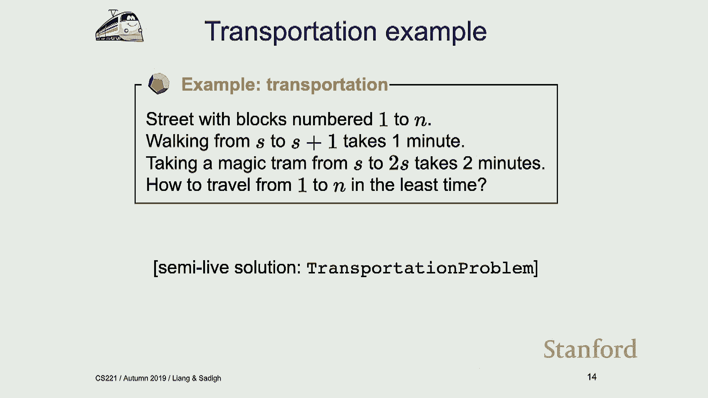

 And we have two possible actions。 So at any state， let's say I'm in state S， at any state。 I can either walk。 And if I walk， I end up in S plus one。 So if I'm in three。 I'm going to end up in four。 And walking takes one minute。 Or I can take this magic tram。 and this magic tram takes any state S to two times S。 So if I'm in three。

 then I'm going to end up in six by taking the magic tram。 And the magic tram always takes two minutes。 Doesn't matter if I'm living。 So if I'm in two。 I'll end up in four， if I'm in five， I can end up in ten by taking the， tram。 Okay。 so I have two possible actions in any of these states。

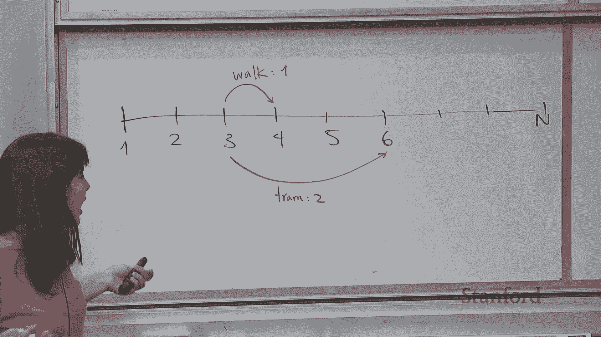

 And what I want to do is I want to go from one to N， and then I want to basically do that。 in the shortest time possible。 So it would at least amount of costs。 Does that problem sense？

 All right， so this is kind of like what the search problem is。 So what we want to do is first off。 we want to just formalize it。 And I'm going to do that here。 I'm not going to do life solutions。 because I'm not Percy， and I did that once， and it。

 was a disaster。 So we are going to， yeah， I've taped these in 2018。 but basically we're going to go over， it together。 So let's just do that。 So we're going to define the search problem， the tram problem。 So we're going to define a class for transportation problems。

 So we're going to separate our search problems from our algorithms， because remember， modeling。 is separate from inference。 So let's just have a constructor for this transportation problem。 It takes n， because we are at n box。 So n is the number of blocks。 All right， so then you have。 we still have a start state。 We are starting from one， so a block one。

 And then we need to define is n state。 So is n state basically checks if you've reached n or not。 because we have to get to， the nth block。 We're right。 So what else do we need？

 So we have a successor function。 We also have a cost function。 I'm going to put both of them together， because that is just easier。 So the successor and cost function， I'm saying， let's just give it state s。 And then given a state。 it's going to return this triple of action new state cost。 So I give it a state。

 let's say initial state， and then it just returns all possible actions。 with the new states I can end up at， and how much does that cost。 So what are my options？ Well。 if I'm state s， I can walk to s plus one， that costs one。 If I'm in state s， I can take the tram。 I can end up in 2s， and that costs two。 Okay， so that's how I'm creating my triple。

 And I need to check if I don't pass the nth block。 Remember， like we have n blocks。 so we don't want to pass the nth block。 Okay， so that's just to make sure that we don't pass it。 so we are still below the nth， block。 And this is what my successor and cost function will return the dit ripples。 So let's just return that。 Okay， so that is my transportation problem。

 Let's make sure it does the thing the way we want it。 So let's say we have 10 blocks。 and now I want to print my successor and cost function。 Let's say I'm returning successor and cost for three。 What should I get？ Three。 I can have two actions， right？ I can either walk or I can take the tram。 If I walk， it costs one。

 If I take the tram， it costs two。 I'll end up in four or six。

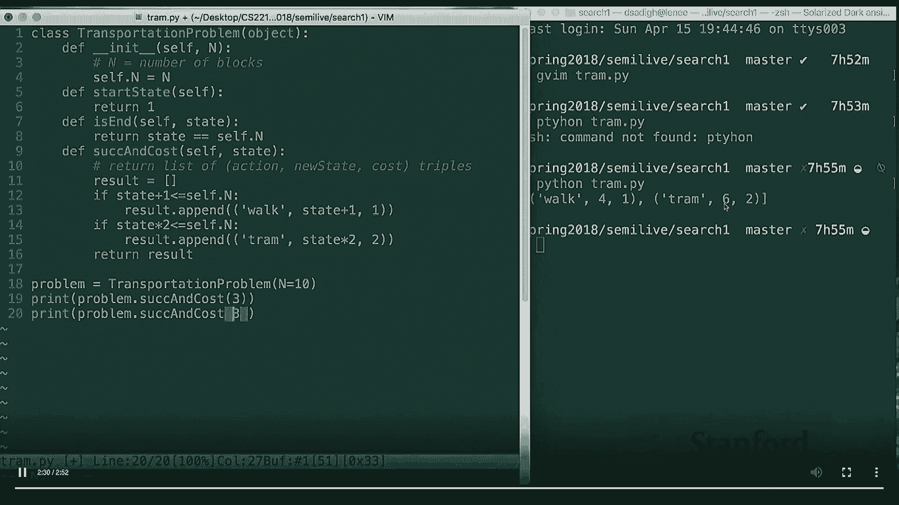

 Let's just try， I don't know， nine。 If I'm in state nine， I can only do one thing。 I can walk。 right？ Because remember the block is number of blocks is 10， and I can't go beyond that。 So。 all right。 Okay。 So that was， yeah， let's go back here。 So that was just defining the search problem。 Okay。 And I haven't told you guys how to solve it。

 We are just doing the modeling right now。 So we just modeled this problem， just coded it up。 Modeling it means what are the actions， what is the successor function， what is the cost， function。 defining an is and function， saying what the initial status。 So now I think we are ready to think about the algorithm in terms of like going and solving。

 these types of search problems。 So the simplest algorithm we want to talk about is backtracking search。 So the idea of backtracking search is， maybe I can draw a tree here， is you're starting。 from an initial state and then you have a bunch of possible actions and then you end。 up in some state and you have a bunch of water possible actions。

 Let's say you have two actions possible and this can become exponentially blows up so。 I'm going to stop soon。 All right。 So， create this tree and this tree has some branching factor。 That's the number of actions you have at every state and then it also has some depth。 So that is how many levels you go down。 So let me just define that by D。 Okay。

 And now there are solutions down in this。 Now it's right。 So we want to figure out what those solutions are。 And backtracking search just does the simplest thing possible。 What it does is it starts from this initial state and it's going to go all the way down。

 here and if it doesn't find a solution it's going to go back here and then try again and。 try again and it's going to go over all of the tree because there might be another solution。 down here too。 So it needs to actually go over all of the tree。 So I'm going to have a table of algorithms because we are going to talk about a few of， them。

 What sort of costs they allow in terms of time？ How about the or in terms of space？

 So if you've taken an algorithm course like some of these are probably from here。 So all right。 So we talked about backtracking search。 Backtracking search。 It is basically this algorithm that goes through pretty much everything and it allows。 any type of costs。 So I can have any costs。 I can have pretty much any costs I want on these edges because I'm going over all of。

 the tree。 It doesn't matter what these costs are。 So how bad is this in terms of time？

 So in terms of time I'm going over the full tree， but going over the full tree then this。 is going to have this exponential blow up where I'm looking at order of B to the D where。 B is again my branching factor and D is the depth of the tree。 Because in terms of time this is not a good algorithm。

 In terms of time I have to go over everything in the tree and that's the size of my tree。 And in terms of space， in terms of space what I mean is I need to figure out what was。 the sequence of actions I needed to take to get to some solution。 So let's say that my solution is down here。 My solution is down here then for me。

 like I need to store a bunch of things to know， how I got here and the things I need to store are the parents of this node and that is depth。 of B。 So in terms of space this algorithm takes order of D。 Because that is like the things that I need to store in my memory to be able to recover。 like the solution and I get there。 Everything should in this space be bigger than B to the D as well。

 Because until you get that you need to have the space to have everything right。 You can put that down。 So actually we will talk about breadth-first search later which does require have a larger。 space。 So the reason you can forget it is the only history that I need to keep track of is this。 particular branch right。 I don't need to figure out like I don't need to keep track of like actually the history。

 of all these other nodes。 I can throw those out。 But where something else like breadth-first search where we will talk about in a few。 slides you actually need to keep track of like the history of everything else。 So let me get back to that in a few slides。 But for this one basically the idea is yeah like I want to know how I got there to know。 how I got there I just need to know the parents。 >> And like the minimum cost to reach a point or is it to find whether like you can or cannot。

 reach a certain point？ >> So it depends on what your objective is。 So like it really depends on what the search problem is asking。 So in the case of that farmer goat example the search problem is asking you want to move。 everything to the other side of the river so you have that criteria and you want to find。

 the minimum cost one so you also have that other criteria。 So it really depends on what the search problem is asking and some of these nodes might be。 solutions some of them might not be solutions。 So really it's all right。 So let's just look at these on the slide。 So the memory is order of D。 It's actually small。

 It's nice in terms of time this is not a great algorithm right because even if your branching。 factor is two the depth of the tree is 50 then this is going to blow up like immediately。 So a lot of these tree search algorithms that we're going to talk about like they have the。 same problem so they pretty much have the same time complexity。

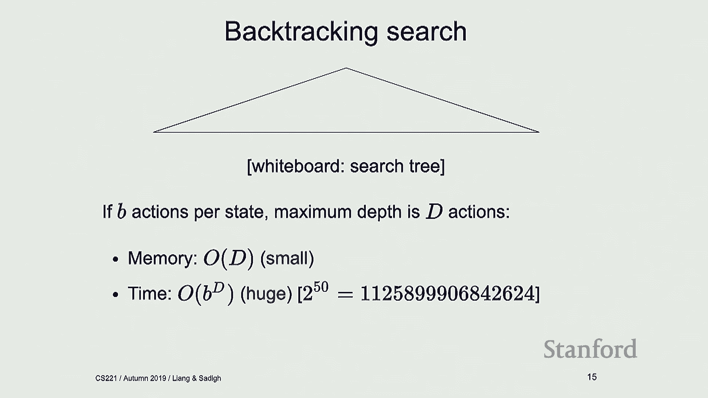

 You're going to just look at very minimal improvements of them and then after that we'll。 talk about dynamic programming and uniform cost search which are polynomial algorithms。 that are much better than these。 Okay。 So let's actually let's go back to the tram example and let's try to write up what backtracking。 search does。 So all right so we define our model。 Our model is the search problem this particular transportation search problem it could be。

 anything else and now we're going to kind of have this main section where we are going。 to put in like our algorithms in it and we're going to write them as general as possible。 so so we can apply them to other types of search problems。 So let's define backtracking search。 It takes a search problem it can take the transportation problem。 Okay。

 All right so and then we're going to basically in backtracking search what we are doing is。 we're recursing on every state given that we have a history of getting there and the。 total cost that it took us to get there。 Okay。 So so at the state having gone some history and some accumulated costs so far we are going。 to basically recurse on that state and look at the children of that state。

 Okay so so we're going to explore the rest of the sub tree from that particular state。 Okay。 All right so how do we do that？ Well we got to make sure that we're not in an end state or if you are in an end state。 like we can actually update the best solution so far。 So let's put that for to do so so so the bunch of things we need to do we need to figure。

 out if you are in an end state if you are well we got to we got to update our best solution。 if you're not in an end state then we are going to recurse on children。 Okay。 All right so you can do that later and then in general this recurse function is is going。 to we're going to call it on the on the start state so let's actually do that too。

 So so what backtracking search does is it calls this recurse function on the initial。 state that we have with history of none right like if you don't have any history you're。 not going to get and and cost is zero so far because we haven't really gone anywhere。 So so we started this start state we call recurse on it。 Okay。

 And how do we recurse on children well we have defined this this successor and cost function。 so by calling that successor and cost function on state then we can get action new state and。 cost so so we get this triple of action new state and cost。 And then we can basically recurse on the new state。

 I'm not putting the histories right now in this code so so we need to keep track of。 the history too but let's just not worry about the history。 Oh I guess I'm putting it in this one when the later ones I will not put them。 But but basically the history is keeping track of like how you got there and total cost is。

 going to be what what you've got so far plus the cost of with this new state action。 Okay。 so we need to keep track of the best solution so far so I'm just going to find。 a dictionary here just to make sure that we keep track of it and Python scoping。 And then the place we are going to update our best solution so far is that to do that。

 is left right so so if you are in an end state then we can actually update the best solution。 so far。 Okay， and what do we want in our best solution well we want to know what the cost is so so。 we can start with cost of infinity and anything the low infinity is better and then we are。 going to start with a history of empty but we are going to fill up that history too。

 So that's initialization of best solution so far。 Then we are going to update that right if you're in an end state if the total cost that。 we have right now is smaller than the best solution so far then we are going to update。 that best solution and then we are going to update its history with whatever its history， is。 All right and then that's it that's backtracking search。

 So let's just make sure it does the thing so to do that we are going to actually know。 we got to return the best solution so far。 All right so now we have defined this transportation problem now what I want to do is I want to。 call backtracking search on the transportation problem。 So that all sounds good。 I need to write a print function also to be able to print things so I'm going to just。

 write a generic print function that we can call on any of these types of problems so。 let's define a print solution function that just like prints things the way we want them。 So we get the solution we are going to just unpack the cost and history and just print。 the cost and history nicely。 All right so I can use this print solution for pretty much all the other algorithms we'll。

 talk about today too。 And you are going to talk about how we get there with the history。 So now I have my print function I have my backtracking search algorithm I've defined。 my transportation problem I can just call it on this transportation problem with 10 blocks。 So as you guys can see here so the total cost is 6。

 So what this means is for going from city 1 to city 10 then this is the best solution。 I got to walk walk walk walk and then after that take the tram because like I end up in。 5 and then after that it's actually worth taking the tram and paying cost。 Let's try it out for 20。 What do you think is the answer for 20？ So 4 walk walk walk until we get to 5 then we take the tram then we take the tram again。

 cost the state。 And then if it is 100 it's a little bit more interesting if you have 100 so you are walking。 and then you are taking the tram and you get to 24 and you have that one step to get to。 25 which is a good state because then you can just multiply that by 2。 So you walk for that one step and take the tram again。

 So what if I want to try out a much larger number of blocks？ So is this going to work？

 No because remember that time was order of b to the d that wasn't that great。 So let's try that。 Oh。 we got maximum recursion time。 You can fix that。 So let's try fixing that。 So you can set your recursion limit to be whatever。 So if we try that is this going to work？

 Well， now it's just going to take a long time。 It's not going to give you an answer because it's going to just take a long time。 So all right。 Okay。 Let's go back here。 All right。 So that was backtracking search。 Right。 So all it was doing was just going over all of this tree。 And it was taking exponential time as you saw and we just tried it out on that transportation。

 problem that we defined。 So we just defined a search problem。 We use this really simple search algorithm to find solutions for that。 And then that's what we have so far。 So， so now what we want to do is we want to we want to come up with a few better improvements。 of this backtracking search。 Again， don't get your hopes up。 It's not that big of an improvement。

 But we can do something better。 So， so the first improvement you want to make is by using this algorithm called depth-to-er。 search。 And some of you might have heard of it。 DFS or depth-to-er search。 Okay。 So the restriction that DFS puts in is that your cost has to be zero。 So your cost has to be zero。 Yeah。 Actually draw a line between them。 Okay。 So， so we're talking about DFS now。

 And the restriction is the cost has to be zero。 So。 so what DFS does is it basically does exactly the same thing as backtracking search。 But once it finds a solution down here， then it is done。 It basically doesn't like explore the rest of the tree。 And the reason it can do that is the cost of all these edges is zero。 So if the cost of all these edges are zero， then if I find a solution， I found a solution。 I don't need to like find this better solution。 Because that is good enough。 like anything I find also has a cost of zero。 So might as well just return the solution。

 An example of that is if you have a Rubik's Cube， like if you find a solution， then you've。 found a solution， right？ There are a million different ways of like getting to a solution。 but like you just want， one。 And then if you find one， then you're happy you're done。 Okay。 So as you can see， this is a very， very slight improvement to backtracking search。

 What happens is in terms of in terms of space， it's still the same thing。 So it's order of D。 So in terms of space， nothing has changed。 It's pretty good。 It's order of D。 In terms of time。 in practice it is better， right？ Because in practice， if I find a solution， I can just be done。 Don't worry about the rest of the tree。 But in general， if you want to talk about it in theory。

 then the worst case scenario， is just trying out all of the trees。 So you write it as worst case scenario， it's order of B to the D。 So so nothing has really changed in terms of in terms of exponential pull-off。 So you draw that tree。 It seems to imply that the sub-problems do not overlap， right？

 Because you're kind of branching out in different states。 But in fact， a sub-problem could overlap。 So if somebody in the trend problem， you can get to the same place to different history。 But the rest is the same。 Yeah。 So you can， so the question is， yeah。 do sub-problems overlap here or they don't？ So you could actually have it in a setting where sub-problems do overlap。

 but you could， actually add this this extra constraint that says if I visited the state。 then don't add， it to the tree。 So you have that option or you have the option of like going down the tree with some like。 particular depth and not trying out everything。 In the setting that we have here， yeah。 like you're basically trying out all possible。 Like I'm talking about the most like general form where you're going over all the states。

 and all possible actions that could come out of this。 All right。 So this is DFS。 Okay。 So the idea of DFS again is you're doing backtracking search and then you're just stopping when。 you find the solution because cost is zero。 Okay。 So in terms of space order of D， in terms of time。 it's still order of B to the D。 Okay。 All right。 So that was DFS。

 We have another algorithm called breadth-first search， BFS。 And this is useful when cost is some constant， but it doesn't need to be zero。 It's just some positive constant。 So what that means is all these edges have the same cost and that cost is just C。 The same cost pretty much everywhere。 So the idea of breadth-first search is we can。

 we can go layer by layer。 Like， you're not going to try out the depth。 Instead。 what we can do is we can go layer by layer， try out this layer and see if you， find a solution here。 Remember， the tree doesn't need to go all the way down here。 The tree could end here or like at any of these， at any of these nodes。 Right。

 Like I can have like a tree that looks maybe like this。 I have a solution here。 This tree doesn't need to be like this nicely formed。 Like I can have a tree that looks like this。 Okay。 So if I have a tree that looks like this with breadth-first search， I'm going to try out。 this layer。 See if this guy is a solution。 If it's not， I'm going to try this guy。

 This is the solution。 If not， I'm going to try here， here。 And then when I find a solution。 when I get here， I'm done。 Right。 Because like if I find a solution here。 I know it took 2C to get here， like two of these， C values。 And if there is any other solution anywhere else in this sub tree or in this sub tree。

 those solutions are going to be worse than this。 Because they're going to just like take like。 they are going to have a higher cost。 So because the cost is constant throughout。 So then it's useful if your solutions are somewhere like high up in this tree and then。 you can find it。 So in terms of time， I get some improvements here because I can call this depth。

 the shorter， depth， the small d。 I'm going to call this shorter depth， small d。 And in terms of time， it's still exponential， but it's order of b to the small d。 And this is actually a huge improvement because if you think about it， the trees exponentially。 become larger。 So these like lower levels are a lot of things that you need to explore。

 If you have like branching factor of 10， the next layer has 100 things in it。 So going down these layers is actually pretty bad。 So the fact that with breadth-first search。 I can improve the timing and limit it to a， particular depth， that's pretty good。 Still exponential。 but pretty good。 Do you have no negative cost to that way？

 You can also assume this is the best solution。 Yeah， you can assume that this is the best solution。 Exactly。 So you're assuming that there are no negative costs。 So at this point。 I know this is the best solution。 I'm done。 I call it and then I don't explore anything else。 The problem with breadth-first search is there's a question there， sorry。 Also the same？ Yeah。

 we're assuming all the costs are the same because maybe like all the costs are one， hundred。 if I don't assume that， but all these costs are one hundred and then there might。 be like some other， you need to explore the rest if they're not the same basically。 So the problem with BFS is in terms of memory we are losing。 In terms of memory。

 you need to actually keep track of the history of all the nodes that， you have explored so far。 So in terms of memory， this is going to be order of B to the D kind of similar to the time。 And then the reason is I have explored this guy and then after exploring this guy， I need。 to still have like a history of where it's going to go because next time around when I。

 try out this layer， I need to know everything about this parent。 And like when I explore here and this is not a solution， I need to store everything about。 this because maybe I don't find a solution in this level and I need to come down and。 when I come down， I need to know everything about these nodes。

 So I need to actually store pretty much like everything about the tree until I find my solution。 And then that's where you lose like in Bred's first search。 In terms of space。 it's not going to be that great。 So in terms of space， it's now order of B to the D。 it's a lot worse than what we have， had。 In terms of time， it is better。 It's still exponential。

 It's better。 Okay。 All right。 Okay。 So now let's talk about one more algorithm。 And then after that。 we jump to dynamic programming。 Where is the question back there？

 >> What thing does the small D can be the same as the big D， right？ So it can be。 >> Yeah。 so it is exponential。 I agree。 Small D can be the same as big D。 But in practice。 if small D is not the same as big D， we're winning a lot because， yeah。 these lower layers are so bad that people actually like to call the fact that we are。

 order B to the small D better than big D。

 Yes？ >> So DFS needs to go all the way down to these lower levels。 But BFS can stop at every level because it's doing level by level。 >> Well， now for drag。 >> Yeah。 so the reason is， yeah， so like you were saying， okay， so in DFS， we were also， saving some time。 right？ Like why aren't you like calling that out？ And then the reason is with DFS。

 you still need to get to these like lower layers。 And that is the。 like that is the place that you're losing on time。 So the fact that you're still like losing on time and sure like you haven't explored these。 other ones， but you have already got to these lower trees like so far， that's pretty bad。

 So that is why order of B to the D。 All right， so this last algorithm I want to talk about is an idea that tries。 it's a， cool idea。 It actually tries to combine the benefits of BFS and DFS。 And this is called DFS iterative deepening。 So what this algorithm does is it basically goes level by level。 same as BFS， because then， that way if you find a solution， you're done， everything is great， right？

 But what it does is for every level， it runs a full DFS。 And it feels it's going to take a long time。 But it's actually good because again。 if you find your solution like early on， it doesn't。 matter that you have ran like a million DFSs so far。 So it's kind of like analogy of it is imagine that you have a dog and that dog is DFS and。 it's on a leash and you have like a short leash。 And when it is on that leash。 it's going to do a DFS and try out and search all the space。 And it doesn't find anything。 So it comes back and then you're going to extend the leash a little bit and it's going。

 to do everything and like search everything and do a DFS。 Comes back， doesn't find anything。 you extend the leash again。 So that's the idea， like extending the leeches。 this idea of extending your levels。 So how does DFS iterative deepening it？

 What we're looking for is everybody on the tree。 It's even worse than both of them。 Sorry。 what we're going to enforce is not going to be even worse than。 Yes， exactly。 Yes， that's okay。 That's a good point。 So the point is， the point that I mentioned is if your solution is like here。 you're screwed。 It's worse than DFS or BFS， right？

 You're doing all these DFSs through like a bigger， like higher level BFS and it's a terrible。 situation。 So you practice like we're hoping the solutions are not going to end up like down the tree。 But yeah， if the solutions are down the tree， then you're not like winning anything by using。

 DFS。 What like problems do you think DFS iterated to think would be useful？ In general， if you。 okay， so the question is， yeah， so in what problems do we think DFS， iterative deepening is useful？

 In general， if like there are problems that I think BFS is going to be useful， usually。 DFS iterative deepening is useful。 The reason I would think that is like there is some structure about the problem that I。 would think out what find my solution earlier。 So if I have some reasons。 some reasons about the problem， about the structure of the problem。

 and I think solutions are low depth， I should use some of these algorithms。 And then DFS iterative deepening in terms of space it helps too。 So might as well use that。 All right， so in terms of space， it's going to be order of small D now。 So in terms of space。 order of small D and then in terms of time， it gets the same benefits， of BFS。 And then again。

 because it has this BFS out of the loop， it has the same sort of constraint， on the cost。 It's got to be a constant constraint that's possible。 So that is our table。 And again。 in looking at this table in terms of time， we're just not doing well。 Like we have this exponential time algorithms here。

 And we could avoid the exponential space with using something like DFS iterative deepening。 But still this time thing is just not that great。 And what we want to do now is you want to talk about search algorithms that bring down。 this exponential time to polynomial time somehow。 And there is no magic。 We'll talk about how。 And dynamic programming is the first。 Yes。 >> The DFS idea is to feed to the D time and go of D space。

 >> Yeah， so the way iterative deepening works is it sets the level， say level is one。 So if level is one， I'm going to do a full DFS。 Because I'm doing a full DFS in terms of space。 it's the same as DFS。 In terms of space， it's just the same as the length where we find the solution。 Let's see， the length where I find the solution is small D。 So now I say level is two。

 when the level is two， I'm going to do a full DFS。 So when I do a full DFS， then in terms of space。 I need to just remember my parents。 So that's why it's order of D in terms of space。 And in terms of time， it's order of B to the D。 Because if I find my solution here， I'm done。 I don't need to explore anything else。 And then that is exponential。

 but exponential in this smaller depth， as opposed to the longer depth。 Similar to BFS。 >> I'm sorry。 I still don't just tell them why。 Let's say the small D is the same as the big D， right？ Then。 >> That's a very good question。 So I think I know it。 So you're asking small D was the same as big D。 If I had my solutions down here。

 why am I differentiating here between small D and big D， right？ Is that what you're asking？ Or am I？

 >> If the depth is quite large， small D is large。 Then why is it in time to function of D？

 Because then why wouldn't it be like D times B to the D？ >> I see what you're saying。 So you're saying， okay， when I'm performing DFS iterative deepening， then I'm doing DFS。 So sure。 it's order of B to the D for each of them， but then I'm doing D of them。 And if D is really large。 I should put that here。 Sure， I do agree that is the right time。 But again。

 in the case of this exponential， this is so bad that we are just dropping that。 We don't even worry about that extra D that comes in。 But it is true。 You need to have that extra D in general if you want to talk about it。 I don't want to move on to dynamic programming， but last question。 >> Just to pull on onto that。

 Presumably though you're saving the work that you've done during a prior iteration。 So you're not really computing anything larger than the D capital D。 Correct？ >> Yeah， that's right。 The worst case scenario is order of B。 All right。 So let's move to dynamic programming。 Okay。 so what does dynamic programming do？ So maybe I can。

 I'll still use this because I might need to use this later。 Okay。 so I'm going to erase my term here。 Okay， so the idea of dynamic programming。 we have already seen this in the first lecture。

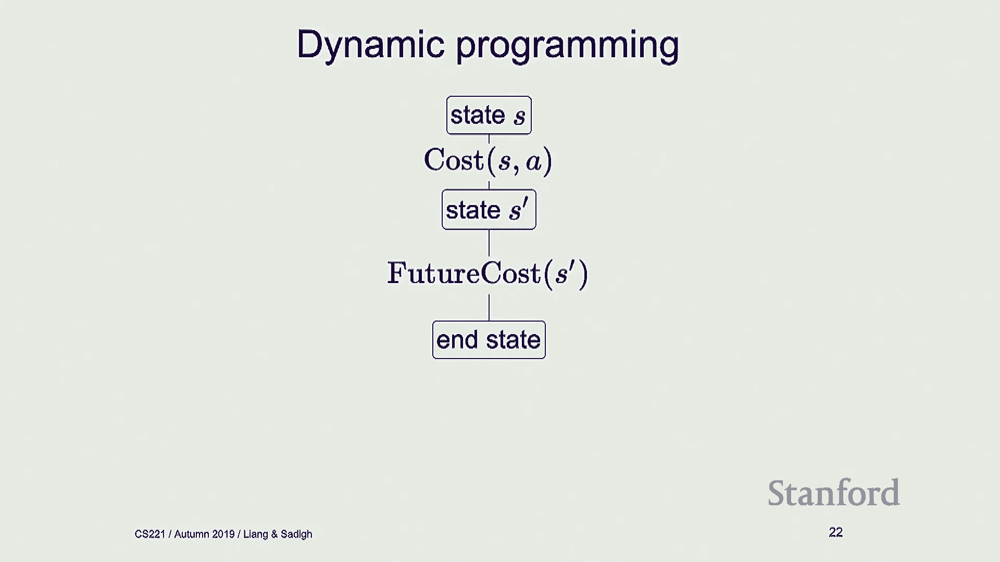

 is I have a state S and I want to end up in some end state。 But to do that。 I can take an action that takes me to S prime。 Right？ I can end up in S prime by cost of S and A。 I can take an action that ends up in S prime。 And then from there I can do a bunch of things。 I don't know what。 I'll end up in some end state。 And what I'm interested in actually computing is for this state S is to find what is future。

 cost of S。 Okay？ And this part of it is future cost of S prime。 And I don't know what it is。 but I can just leave it as future cost of S prime。 So if I want to find what future cost of S is。 maybe I should leave this a little bit， to the right one。 I'm going to write cost of S。 A for this edge。 I'm going to erase this。 What I'm interested in finding is future cost of my state。

 So what is that equal to？ Well that's going to be equal to this cost of S， A， right？

 Like at state S I'm going to take action。 A。 So it's going to be cost of S。 A plus future cost of S prime。 And I don't know what that is， but that's future Doris' problem。 So this is future cost of S prime。 And then you might ask， well what is A？ Where does A come from？

 How do I know what A is？ I don't know。 I'm going to pick an A that minimizes this sum。 I'm going to put this around it。 Okay？ So future cost of S is just going to be equal to minimum of cost of S。 A plus future cost， of S prime over all possible actions。 And it's going to be zero if you're in an end state。 This is end of S， it is true。

 So if I already know I'm in an end state， then there is no future cost， that's going。 to be equal to zero。

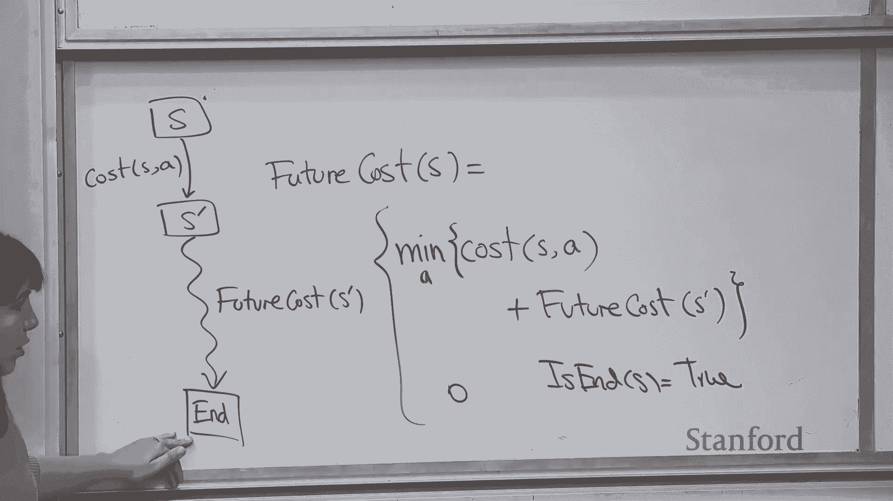

 Otherwise future cost is just going to be cost of going from S to the next state and。 then future cost computed from this。 So that is just how one would go about formalizing this problem as a dynamic problem and dynamic。 programming problem。 And then how do I find what S prime is？ Well。 I wrote the successor and cost function in my code。 Remember。

 we know how to find the successor given that we are in state S and we are taking， action A。 So S prime is just calling that successor function over S and A。 Alright。 so let's go back to some route finding example。 So this is slightly different route finding example。 So let's say that you want to find the minimum cost path from going a city one to some city。

 end in the future。 Moving forward， we can always just move forward and it costs Cij to go from city i to city。 j。 Okay， so this is my new search problem。 So this is kind of how the tree would look like。 So if I want to draw the tree search for this， I can start from city one， I can end up in。 city two or three or four。 Then if I have a city two， I can end up in three or four。

 If I'm in three， I can end up in four。 Like this is how it will look like。 I can have a much larger version of it。 If I'm talking about going to city seven。 then I have this type of tree。 And just like looking at this tree。 you see all these sub trees just being repeated， like， two out， right？ If you just look at five。

 like future cost of five， it's going to be the same thing， right？

 It's just going to be the same thing throughout。 And if I use like something like tree search that we have talked about。 then I have to， like go and explore like this whole tree and then it's going to be really time consuming。 So the key insight here is future cost， this value of future cost only depends on state。 Okay？

 So it only depends on where I am right now。 And because of that。 maybe I can just store that the first time that I compute future， cost of five。 and then like in the future， I just call that and then I don't like recompute， future cost of five。 So the observation here is future cost only depends on current city。

 So my state in this case is current city and that state is enough for me to compute future， costs。 Okay？ All right。 So if you think about what we have talked about so far。 like we have thought about like， these these search problems where the state we think of it as the past sequence of actions。 and the history of actions you've taken and all that。 But right now for this problem。

 like state is just current city。 That's enough。 Okay？ So and because of that。 you're getting all these exponential savings in time and space， because again。 I can compute future cost of five there and collapse that whole tree into。 this graph and just go about solving my search problem in this graph as opposed to that， whole tree。

 Yeah。 So that's where you get the savings from dynamic programming。 And I just want to emphasize that again， oh， let me actually do this。 So the key idea here is like I was saying there's no magic happening here。 The key idea here is is how to figure out what your state is。

 It's actually important to think about what your state is。 In this case。 we are assuming the state is summary of all past actions that we have taken。 sufficient for us to choose the optimal future。 Okay？ So that's like a mouthful。 But basically what that means is the only reason dynamic programming works and for this。

 particular example we just saw is the state the way we defined it is enough for us to plan。 for the future。 I might have a different problem where the state like I define the state in a way that。 it's not enough for me to plan for future。 But if I want to use dynamic programming then I got to be smart about choosing my state。 Because that is the thing that decides for the future。 So， for example， for this problem。

 I might visit city one， then three， then four， and， then six。 And for solving this particular search problem， I just need to know that I'm in city six。 That is enough。 But maybe I have some other problem that requires knowing one， three， four， and six。 And then because of that， maybe I need to know the full tree。

 So this is where the saving comes from。 Like figuring out what the state is and defining that right。 All right。 So we'll come back to this notion of state again and think about the state a little bit。 more carefully。 But maybe before that， maybe we can just implement dynamic programming real quick。 All right。 So let's go back to our tram problem。 I'm back to the tram problem。

 And let's implement dynamic programming。 Okay。 So how do we do this？

 We're basically just writing that like math over there into code。 That's all we're doing。 So we're going to define this future cost。 If you're in an end state， we're going to return zero。 If you're not in an end state， we're just going to add up cost plus future cost of S， prime。 How do we get S prime？ Well， we're going to call this success or success end cost function。

 So we can get action new new state and cost。 And then we're going to take the minimum of them over over all possible actions。 So minimum of cost plus future cost of new state。 That is literally what we have on the board。 Okay。 All right。 And we are returning the result。 So that is future cost。 What your dynamic programming did？ It should return future cost over initial state。 Start state。

 And you return the history if you want。 In this case， I'm not returning the history。 Okay。 So how do I get savings？ Well， I've got to put a cash。 That's the only way I'm going to get savings。 So that is where I put the cash。 And if I， if the state is already in the cash。 I'll just call my cash otherwise。 I don't have any question there。 Excuse me。

 go to future cost again。 What's that？ How are we getting future costs？ How are we getting？

 I'm going to say that again。 So future costs takes in state。 But what actually is we're like。 we actually have like a bunch of implementation like how。 are we going to get future costs or is that like？ So future cost is going to be， yeah。 So we have this function， right？ Future costs over state。 But you're going to call future costs。

 So future cost over state is going to be equal to cost of state and actions in this function。 I'm saying all possible actions。 Try that out。 Plus future cost of S prime and S prime comes from the successor and cost function and successor。 and cost function。 All right。 So， and then yeah。 And so we do the caching。 the proper caching type of way of doing this too。 And now we have dynamic programming。

 So we can basically call this over our trend problem。 So I'm going to move forward。 Okay。 So let's do print solution， dynamic programming over our problem。 You can again play around with this。 The only way I'm checking this is if it gives me the same solution as backtracking search。 Because I knew how that works， right？ So let's just call it on 10。 And yeah， it gave me the same。

 the same answer。 So I can play around with this。 Okay。 All right。

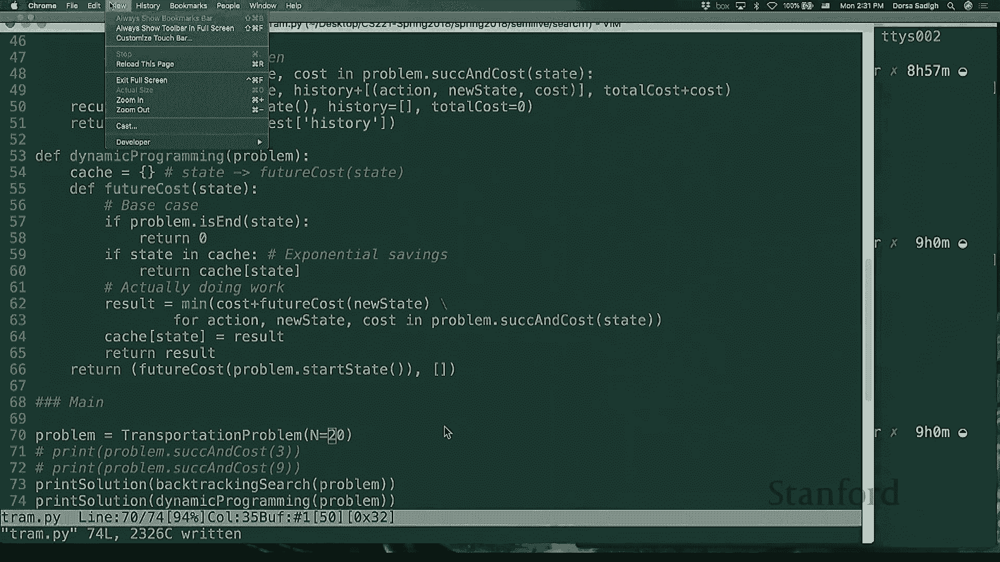

 So， let's go back。 Okay。 So one assumption that we have here to just point out is we're assuming that this graph。 is going to be a circle。 So that's an assumption that we need to make when we are solving this dynamic programming。 problem。 And the reason is， well， we need to compute this future cost， right？

 For me to compute future cost of S， the S prime， I need to like have thought about， sorry。 for me to compute future cost of S， I need to have thought about future cost of S prime。 So there is kind of this natural ordering that exists between my state。 So if I think about an example where there are cycles， then I don't have that ordering， right？

 If I want to compute， let's say I want to go from A to D here and I don't be C。 So if I want to compute future cost of B， I don't really know if I should have computed。 future cost of A before or C before， or what order should I have gone to compute future， cost of B。 So you actually need to have some way of ordering your state in order to compute these future。

 costs and apply dynamic programming。 So that's why we can't really have cycles。 maybe think about this algorithm。 But we are going to talk about uniform cost search。 which actually allows us to have cycles， in a few slides。 Yes。 >> On time of the dynamic programming。 >> So the runtime of this is actually polynomial time in the order of states。

 So order of n。 Yeah， all of n。 And it's a number of states。 Yeah。 All right。 So let's talk about the idea of states a little bit more， because I think this is this。 is actually interesting。 Right。 So let's just reiterate。 What is a state state is a summary of all past actions sufficient to choose future actions。

 optimally。 Okay。 So everyone happy with what state is。 So now what we want to do is we want to figure out how we should define our state space。 Because again， this is an important problem， right？

 Like how we are defining state space is the thing that gets the dynamic programming working。 So。 so we got to think about how to do that。 So， so let's go back to this example。 And let's just change that a little bit。 So， so this is the same example of I'm going from city one to city n。 I can only move forward and it costs the IJ to go from any city I to city J。 And I'm going。

 to add a constraint and the constraint is I can't visit three odd cities in a row。

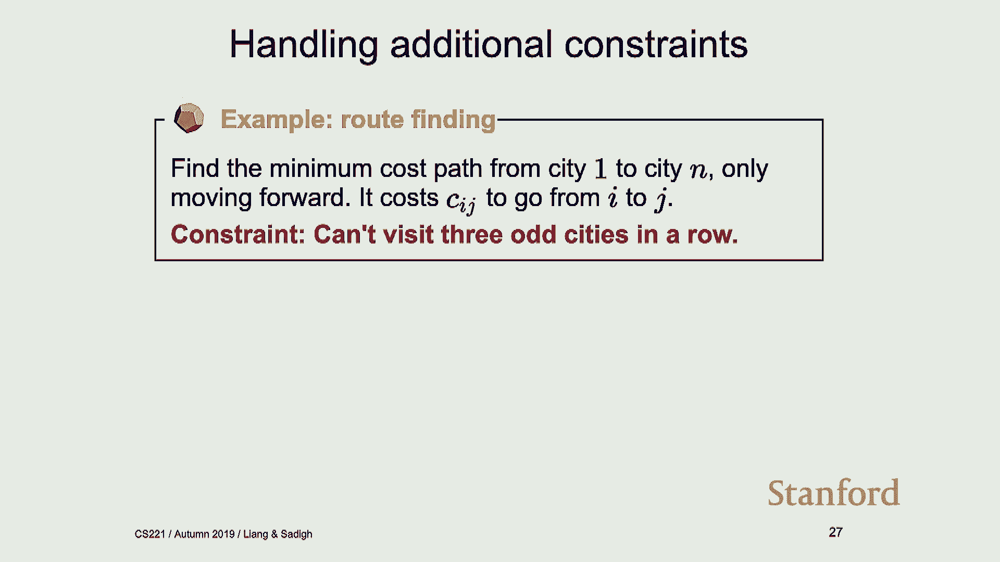

 So what that means is maybe I'm in state one。 And then I went to state three or city one。 I went to city three。 And then after that， can I go to city， Simon？ Well， no。 based on this constraint that I've added， I can't do that。 So I wanted to find a state space that allows me to keep track of these things so I can solve。

 this new search problem， this new constraint。 So， so how should I， how should I do that？

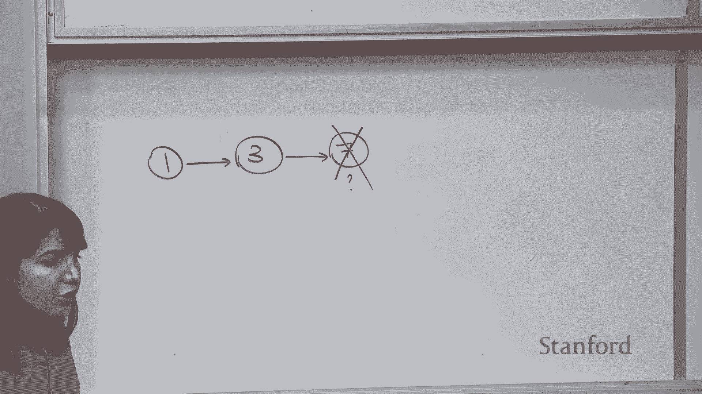

 So in the previous problem， when we didn't have the constraint， our state was just the。 current city。 Like previously， you just cared about the current city and the reason we cared about。 the current city is like， like we are solving the search problem， like we end up in a city。 we need to know how I'm going， where I should go from three。

 So I should have my current city in general。 So， so for the previous problem without the constraint。 current city was enough。 But now current city is not enough， right？

 I actually need to know something about my past。 Okay？ Yes。 I have a kind of how many parts of the art states？ Yeah， that's actually a very good point。 So one suggestion is have a count of how many art states。 Another maybe like。 and the first thing that would come to our mind is something simpler。 So maybe we say， well。

 the state is， let me be all right previously， it should just be， similar to this line。 The state。 like one might say， well， the state is previous city and currency。 Okay。 So this is one possible option for， for my state， right？ Because， because if I have this。 if I have this guy as my state， and then that is enough， right？ Like if I， my current city is three。

 I know my previous city was one， I know I shouldn't， go to seven。 Like that's enough for me to make like future decisions。 But there is a problem with this。 Well。 what is the problem？ So I have any cities， right？ So。 so current city can take any possible action and impossible states。

 Every city can also take impossible options， has impossible options。 So if I think about the size of my state space， it is N squared。 If I decide to choose this state。 okay？ If I decide to choose this state， I'm going to have N squared states。 And remember。 we are doing this dynamic programming thing， like we need to actually like write。

 down like how to get from all those states。 That's going to be big。 But there is an improvement to this and that's an improvement that you suggested， which is。 I don't actually need to have this whole giant previous city which has N options。 I can just have a counter to just know whether the previous city was odd or not。 Like that's enough。

 right？ Like if I， I don't care if it was one or three or whatever， right？

 Like I just care to know if previous city was odd or not。 So， so another option for。 I'll write it here。 Another option for my state is to know if previous was odd or not。 Okay？

 And then I need to know my current city again， right？ Current city。 we need that because like we need to know how to get from there。 And then this brings down my state space。 Like how does it bring down my state space？ Because well。 what's the size of my state space？ This guy can take N possible states。 If my previous city was odd。

 that's two， right？ So I just brought down my state space from something that was N squared to two N。 And then that's a good improvement。 So in general， when you're picking these state spaces。 you should pick the minimal like sufficient， thing for you to make decisions。 So it's got to be a summary of all the previous actions and previous things that you need。

 to make future decisions， but pick the minimal one because you're storing these things。 And it actually matters to pick the smallest one。 So， so here is an example of like exactly that。 So， so my state is now this tuple of whether the previous city was odd or not and my current， city。 So， I started at city one， well， like I don't have a previous city and I'm at city one。

 I could go to city three and I end up in odd and three。 I could try to go to city seven。 Well。 that's not possible because now I have visited three states and end up here and there。 are like the rest of the tree you can have any other examples。 So the way I'm counting this is how much so so my state is a tuple of two things， right？

 If the previous city is odd or even， I have two options here， it's either odd or even， that's two。 And then my current city and I have n possible options for my current city， it could be city， one。 city two， city three。 So that's n。 So I have n options here， I have two options here。 That's why I'm saying my whole state space is two times n。 Okay。 All right。 Okay。

 So let's try out this example。 Let's not put it in。 Just talk to your neighbors about this and then maybe you have ideas， just let me know， in a minute。 So， okay。 So what is the difference here？ So we're traveling from city one to city n and then the constraint has changed。 Now we want to visit at least three odd cities。 So that's what we wanted。

 And then the question is what is the minimal state？ Talk to your neighbors。 All right。 Any ideas？

 What is a possible state？ Like don't worry about the minimal event like for now。 Like what do I need to keep track of？ Number of odd cities。 Okay。 So is that it？

 Do I need to just know a number of odd cities？ Or number of odd cities？

 So what I meant is I also need to have current city， right？

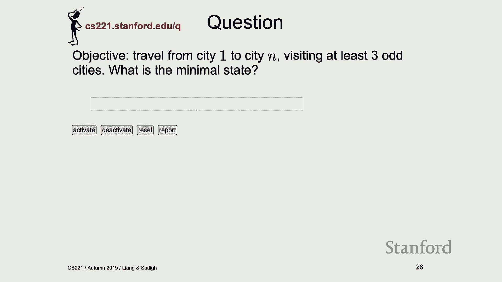

 So， okay。 So one possible option for this new example， I'm going to write that here。 Because I want to visit at least three odd cities。 I also need to know my current city for any of these types， like not any of these types。 of problems。 But for these particular problems that I've defined here， I need to know where I am。

 So I need to know what my current city is。 So that is like that is given what I need to have。 So I want to see at least three odd cities。 So one possible option is to just have a counter and keep counting number of odd cities。 So this could be one potential state。 Okay。 Yes。 Okay。 B131。 So， okay。 So the question is do the cities need to be different？

 The way we are defining the problem is we are moving forward。 If I'm in one。 like I can just move forward。 I can't like say it one or I can't like go back。 So we're always moving forward。 But when we talk about the state space。 we're talking about the more general setting， like， some of that to end might not even be possible。

 But that's what we are counting。 Okay。 All right。 So this is one option。 But I can actually do better than this。 And then you're done。 So a suggestion there is you can have like you can say you can say at least three odd cities。 than you need at least two odd cities than you need at least one odd city and then you're， done。

 And one way of formalizing that that's exactly right。 I don't care if I have four odd cities now or five odd cities。 Like as long as I have like above three， that's good enough。 Right。 One odd city， two odd cities。 three odd cities。 Above that is just three plus。 Like that's enough for me。 Okay。 So if I have this。

 then the state space here is going to be n options here and number of。 odd cities it's around n over two。 So it's going to be n squared over two。 But if I use this new suggestion where I don't keep track of four or five， six， seven， I just。 keep track of one， two and three plus， then my state space ends up becoming three times。

 n and I can formally write that as s is equal to minimum of number of odd cities。 And three and then current city you need the current city。 And with this state space。 then size is equal to three。 So I just again brought down n squared to n and that's。 that's a nice and。 Not also need an option for zero parts is visited so far。

 You're starting from city one。 So you're already counting that in but yeah， like if you have zero。 all right。 So， okay。 So that was that。 This is how you'll look like like you can think of your state space like this again as。 a two pole of a visit one， two， three and then the cities。 I have another example here you can think about this later and yeah， like work it at， home。

 But basically the question is again， you're going from city one to n and you want to visit。 more odd cities than even cities， what would be the minimum of states。 But you can talk about it offline。 So the summary so far is that state is going to be a summary of past actions sufficient。 to choose future actions optimally and then dynamic programming。 It's not doing any magic， right？

 It's using this notion of state to bring down this exponential time algorithm to a polynomial。 time algorithm and then with the trick of using mentalization and with the trick of choosing。 the right state。 And we've talked about dynamic programming and how it doesn't work for cyclic graphs。 And now we want to spend a little bit of time talking about uniform cost search and how that。

 can help with the cycles。 So if you guys have seen dig stress algorithm。 this is very similar to dig stress。 So it's basically dig stress。 So let's actually talk about this。 So the observation here is that when we think about the cost of getting from start state。 to sum s prime， well that is going to be equal to cost of going from s to s prime and then。

 some past cost of s。 And then in dynamic programming。 make sure that we have this ordering and these things。 are computed in order so we're not worried about visiting the state like multiple times。 But in uniform cost search， we might visit the state multiple times and if you have cycles。

 we don't know what order to go。 But the order we can go is we can actually compute a past cost。 a suggested past cost， and basically go over the states based on increasing past costs。 So let me actually， so uniform cost search， what it does is it numerates states in an。 order of increasing past costs。 So and in this case， we need to actually make an assumption here。

 We need to assume that the cost is going to be non-negative。 So I'm making this assumption for uniform cost search。 So here is an example of uniform cost search running， oh we don't have internet。 There is a video of uniform cost search running in action if I have time I'll connect to internet。

 and get it working。 But so let's talk about the high level idea of uniform cost search。 So in uniform cost search， we have three sets that we need to keep trying。 One is explored set which is the states that we have found optimal path。 These are the states that we are sure like how to get to， we have computed the best path。

 possible to get there， we are like done with them。 Then we have another set called a frontier where this frontier are the states that we have， seen。 we have computed like a cost of getting there， like we know somehow how to get there。 and what would be the cost。 But we are just not sure about it。

 We are not sure if that was the best way of getting there。 So the frontier。 you can think of it as a known unknown。 I know they exist but like I actually am not sure what's the optimal way of getting there。 And then finally we have this unexplored part of states and these unexplored part of states。 I haven't even seen them yet。 I don't even know how to get there and you can think of it as more of an unknown unknown。

 So that's like how you would think about this three。 So let's actually work out an example for uniform cost search。 I'm actually going to do this one。 So I'm just going to show how uniform cost search runs on this example。 So I said we are going to keep track of three sets unexplored。 Front here and then explored。

 All right， so everything ends up in unexplored at the beginning， A， B， C and D。 And what I want to do is I want to go from A to D。 That's what I want to do。 So I want to find a minimum pass path， a minimum cost path to get from A to D given that I。 have this graph。 So what I'm going to do is I'm going to take my initial state that's A。

 I am going to put， A on my frontier and it costs zero to get to A because I'm just starting at A。 So that's on my frontier。 Then the next step what I'm going to do is I'm going to pop off the thing with the lowest。 cost from my frontier。 There's one thing on my frontier。 I'm just going to pop off that one thing off my frontier。

 I'm going to put that to explore the cost of getting to A is zero。 And then what I'm going to do is after popping it up from my frontier is I'm going to see。 how I can get from A to any other state。 So from A I can get to B。 That's one option。 And with the cost of one。 So from A I can go to B to the cost of one。 Where else can I go？

 I can go to C to the cost of one hundred。 So what I just did is I moved B from unexplored to frontier and then I know how I get there。 from A and I moved C to frontier and I know how to get from there。 So now it's the next round。 I'm looking at my frontier。 A is not on my frontier anymore。 It's an export。 And I'm going to pop off the thing with the best cost of my frontier。 Well what is that？ That's B。

 So I'm going to move B to my export。 The best way to get to B I already know that。 That's from A to B。 Everything is good。 So now that I've popped off B from my frontier I'm going to look at B and see what state I。 can get to from B。 From B I can go to A but A is already an export。 I already know the best way to get to A so there is no reason to do that。

 From B I can get to C and if I want to get to C then I can actually get to C with the。 cost of 1 plus whatever cost of B is already 1。 So what I'm going to do is I'm going to erase this because there is a better way of getting。 there and that's from B。 And then from B I can get to D so I'm going to move D from an export to frontier。 I can get to it from B and then how do I get to it from B？

 There's a cost of 101 because 100 plus cost of getting to that。 So I'm done exploring everything I can do from B。 Going back to my frontier again。 So these two are not on my frontier。 I just have C and D on my frontier。 I'm going to pop off the thing with the best cost。 That is C。

 I'm going to move that to export with the cost of 2 and the best way to get that is from， B。 So we're done with C and then we're going to see where we can go from C。 From C I can go to A。 Well that's done。 That's already an export in the export set。 I'm not going to touch that。 Similar thing with B already in export。 Don't need to worry about that。 From C I can get to D。

 And if I want to get to D from C or what would be the cost of that it would be 2 plus 1。 So I can update this and have 3 and I can update the way to get to D from here。 And then we're done。 We go to frontier。 The only thing that's left on the frontier is D。 I'm going to just pop that off and then I'm going to add that to export and that is 3。

 And that's what I have in my export。 So the way to get from A to D is by taking this route and it costs 1。 So A， B， C and D。 Okay。 Is that clear？ All right。 Okay。 So there are two slides left and they're probably going to kick us out soon。 So I'll do this next time。 So yeah， the two slides left is going to just go over the pseudo code。

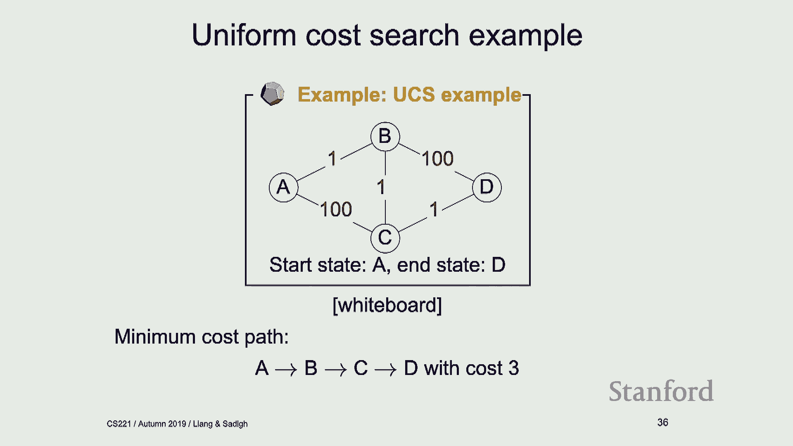

 So take a look at that。 The code is online。 And there's a small theorem that says this is actually doing the right thing。 I'll talk about that next time。 [BLANK_AUDIO]。

