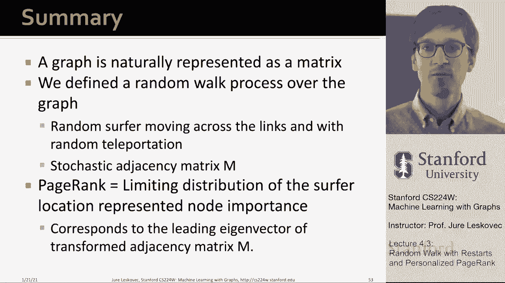

# P12：4.3 - Random Walk with Restarts - 爱可可-爱生活 - BV1RZ4y1c7Co

所以我们将讨论带有重启和个性化pagerank的随机漫步，这将是我们最初的扩展，我们刚刚讨论过的一个pagerank的想法。

所以让我给你举个例子，这将是多么有用，所以我们要讨论一个建议的问题，假设你有一组用户，客户和一套物品，呃，也许产品电影，然后创建用户和项之间的交互，基本上说一个给定的用户，可能购买了给定的物品。

或者给定的用户观看了给定的电影，这就是我们的二分图表示，呃，此用户到项关系的此处，然后我们要做的是以某种方式测量图的相似性或接近性，为什么这个有用，这很有用，因为如果你是一个网上商店，或者如果你是网飞。

你想问自己什么项目，我应该向用户推荐吗，你认识的人，购买了一件物品Q，这个想法是，如果你知道两个项目p和q是，呃，购买了很多呃，相似用户，很多其他用户，假设买了或享受了同样的，同一项目，同一部电影。

然后每当用户查看项目Q时，呃，我们也应该给大家推荐一下，呃，项目p，所以现在，我们如何量化这种接近的概念，或图表中不同项目的相关性，所以问题是，比如说，如果我有这个图表，正如我在这里显示的，我有项目。

你知道a和a素数，b和b素数，问题是哪两个更相关，这样你就可以，要做的一件事是说，你知道吗，让我们测量最短路径，所以A的路径比B到B的路径短，所以你知道a和素数更相关，然而问题是你可以说，哦。

但如果我有另一个例子，假设我有C和C一撇，现在C和C Prime有两个用户，两者都，假设是购买的，呃，这两个项目，然后c和c素数，直觉上更相关，比A和素数更接近，所以现在的问题是，我如何开发一个指标。

让我打个招呼，这是最短的路径，但这也是关于有多少不同的，呃，你们有共同点的邻居，有多少不同的路径允许它从一个，对另一个，这里的想法是Pagerank将解决这个问题，因为在第三个例子中，你知道的。

如果你只是说让我们数数共同的邻居，那我们就说，呃，c和c素数就像d和d素数一样相关，一次又一次，这是，嗯，这也许不是我们直觉上想要的，因为呃，你知道的，项目D这个用户也喜欢很多不同的项目。

另一个用户在那里享受了很多不同的项目，所以这种关系不如这里的关系牢固，因为在这里，其实是两件，两个项目，仅此而已，就只有这些了，所以你知道，我们如何用数学算法捕捉到这一点，以便能够在网络上运行它。

然后呃，这就是Pagerank扩展的概念发生的地方，告诉我图形上节点的重要性，并按重要性对节点进行排名，它有一个传送的概念，我们在那里讨论，嗯，一个随机冲浪者在图中的任何节点上均匀地传送。

所以现在我们就有了，我们将首先定义一个所谓的个性化PageRank的概念，基本上与原始PageRank的唯一区别是，当我们传送的时候，或者每当随机行者传送，它不会在图中的任何地方传送。

但它只传送跳转回节点的子集，所以基本上我们说你知道有一组节点，用户感兴趣的是什么，所以每当随机行者传送，它传送回那个子集S，而不是图中的每个节点，然后就呃，你知道的，呃，图表中的接近性。

你现在可以把传送集的概念，你可以进一步缩小它，假设S是一个节点，所以这意味着随机的行者可以走，但每当它决定传送时，它总是跳回起点S，这就是所谓的重启随机遍历，基本上你总是传送回起始节点。

所以本质上是Pagerank，个性化pagerank和带有重启的随机游走是相同的算法，有一个重要的区别是在PageRank中，传送集S是网络的所有节点，都有相等的概率，在个性化页面中。

传送集S是节点的子集，所以您只能跳转到子集，在重新启动的随机游动中，隐形传态集S是一个简单的节点，只是一个节点，那是起始节点，我们的，你知道吗，查询节点项，呃，Q呃，从上一张幻灯片。

现在让我更多地讨论带有重启的随机遍历，所以这里的想法是每个节点都有一些重要性，重要性在所有边缘平均分配，呃，推给邻居，这和我们在呃讨论的基本上是一样的，原始pagerank公式中的页面。

所以在我们的情况下，我们要说，让我们有一组查询节点，嗯嗯，这基本上就是布景了，现在让我们物理地模拟在这个图上的随机游走，对，我们将在随机邻居上迈出一步，嗯，并记录下对邻居的访问。

所以我们要增加那个邻居的访问量，有一定的概率，我们要重新开始散步，这基本上意味着我们要跳回，呃，任何查询节点并重新启动遍历，然后查询最高的节点，最高的访问次数将有最高的接近，呃对查询，查询节点中的节点。

嗯设置，所以这本质上是一个想法，所以现在让我用图形向你展示，所以我们有这个二部图，假设我的查询节点集q只是这里的一个节点，然后我们要模拟一个随机漫步，基本上说我在Q，我挑了一个，随机链接。

我移动到用户现在我在用户，我随机选择其中一个链接，移动到呃到另一边，我增加了访问次数，呃这里有一个，现在我要决定，我重启吗，意思是，回到Q，还是我继续走过，从一个链接中选择一个，嗯，转到用户。

选择另一个链接返回并增加访问次数，一次又一次，问问自己，我想重启吗，还是我想继续走下去，所以伪代码写在这里，这真的是我刚才说的，基本上是，你知道，随机选择一个邻居，呃为了为了，从查询开始。

呃随机选择一个用户，随机选择一个项目，增加项目的访问次数，呃，挑一个有偏见的硬币，如果硬币上写着，呃，让我们重新开始，你只是，呃，跳回查询节点，你可以跳，对他们中的任何一个进行均匀的随机。

或者它们的重量不同，你可以试吃一下，呃按重量，这就是随机游动的概念，呃重启，如果你这样做，然后您将获得查询项，然后你也会得到这个访问计数，这个想法是，更多的项目，呃，呃。

在图表中更接近的相关将有更高的访问量，因为这意味着随机行者会更经常地拜访他们，这意味着你有更多共同的邻居，更多的路径从一个通向另一个，这些路很短，所以呃，随机行者不决定重新启动，呃，等等，等等。

这使得我们可以在图表中测量接近度，在这里，我们实际上是通过测量它，呃，在物理上模拟这种随机行走，但你也可以用幂迭代来计算，用矩阵表示这个二分图，然后从秩向量开始，嗯，它是有一个给定的值，你就会。

用隐形传态矩阵变换随机邻接矩阵，然后在它上面运行电源迭代，你会收敛到相同的，呃，到同一套，呃，呃，节点重要性，就像我们在这里展示的那样，基本上跑得这么快，呃，模拟，那么这种方法的好处是什么呢，嗯。

这是一个很好的解决方案，因为它通过考虑许多不同的重要事情来衡量相似性，对呀，它考虑一对节点之间有多少连接或多少路径，嗯，这些联系的强度是什么，这些联系是直接的吗？还是间接的，他们也。

它还考虑路径上节点的度，因为呃，它的边缘就越多，最，就越有可能，对随机行者来说是走开，不要去节点，嗯，假设我们对，所以在所有这些情况下，嗯，这是一个非常，呃，有很多我们想要的属性，实现起来很简单。

它是非常可扩展的，而且效果很好，让我总结一下这节课的这一部分，所以基本上这里我们讨论了PageRank的扩展，我们谈到了经典的Pagerank，其中随机行者传送到任何节点，所以你知道。

如果我有一个有十个节点的图，然后它的传送组s，你能想到的是，它包括所有的节点，每个节点都有相等的随机行者在那里着陆的概率，这叫做PageRank，然后个性化的PageRank，有时也称为主题特定页面。

就是，基本上唯一的区别，现在传送向量只有几个非零元素，这意味着每当随机行者决定跳跃时，你知道50%的时间它会跳到这个节点，这个节点的百分之十，这个百分之二十，还有那个，这就是所谓的个性化页面排名。

然后带有重新启动的随机遍历又是pagerank，但这里，隐形传态载体，uh是一个单节点，所以每当冲浪者决定传送时，它总是传送到对一，呃，单节点，但从数学上来说，所有这些公式都是一样的。

同样的功率迭代可以解决它们，我们也可以解决，比如说，尤其是带有重启的随机游动通过实际模拟随机游动，在某些情况下可能是，可能是，嗯快一点，但它是近似的，嗯，同样的算法也有效。

唯一的问题是我们如何将集合定义为隐形传送，呃，集合，所以总结一下，图可以自然地表示为矩阵，然后我们定义随机游走过程，这个图形，我们有一个随机冲浪者在链接中移动的概念，呃，我们呃。

还有一种从每个节点传送出去的方法，这个定义允许我们定义这个随机邻接矩阵m，它基本上告诉我们随机冲浪者在每个边缘航行的概率是多少，然后我们定义Pagerank的概念，这是冲浪者位置A的极限分布，嗯。

冲浪者位置的这种极限分布表示节点的重要性，然后另一件美好的事情发生了，我们证明了这个极限分布是可以计算的，或对应于变换邻接矩阵m的前导特征向量，所以它基本上意味着通过计算m的特征向量。

我们正在计算这个呃的极限分布，随机冲浪者，我们也在计算方程组的解，流动方程，其中节点的重要性为，你知道的，指向它的其他节点的一些重要性，所以这三种不同的直觉，所以线性代数特征向量特征值，随机游动直觉。

这些链接和选票直觉是一回事，它们都归结为同一个优化问题，到相同的算法，对同一制剂。

