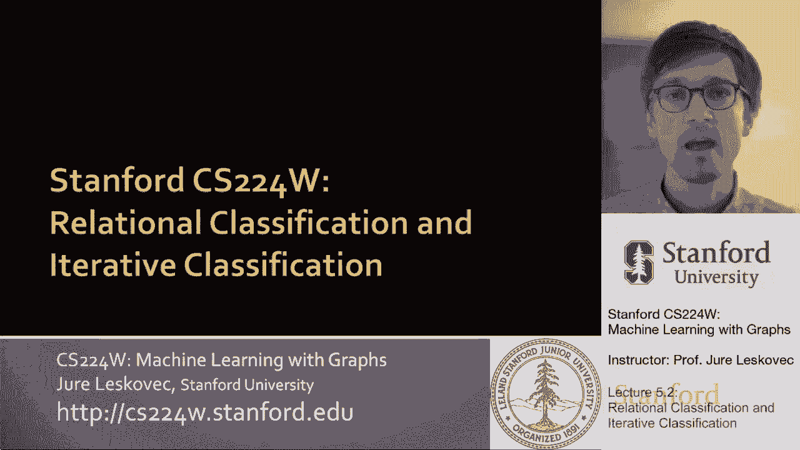
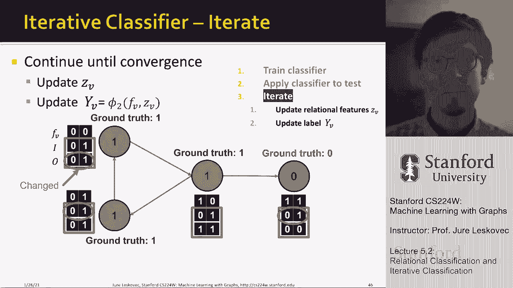

# P15：5.2 - Relational and Iterative Classification - 爱可可-爱生活 - BV1RZ4y1c7Co

所以首先我们要讨论关系分类和迭代分类。

所以让我给你解释一下想法，呃，对于讲座的这一部分。

所以首先我们想谈谈，关系分类，然后我们将讨论迭代分类，最后我要谈谈信仰传播，因为我，就像我之前说的，所以呃，概率关系分类器，想法如下，类概率，嗯Y，节点v的子v，是其邻居类概率的加权平均值，对呀。

所以这意味着对于标记的节点，我们要把他们的班级标签固定在地面上，真相标签，我们被赋予的标签，然后嗯，未标记节点，我们只是初始化他们的信念，假设他们是，呃，它们的颜色是绿色的，比如说五点，所以有些东西。

呃制服，然后节点会更新他们对颜色的信念，基于，呃的颜色，节点，呃在网络上，呃在他们周围，这将迭代直到它收敛，在这里要注意的是，我们只使用节点标签和网络结构，但是我们还不打算使用节点属性，所以在这里。

这是有效的，即使节点只有颜色，没有呃属性，呃附着在节点上，或者没有附加到节点的功能，那么我们要怎么做呢，呃更新，我们要去，呃更新我展示的这个公式，呃，我在这里展示，想法如下。

我们说我感兴趣的节点v是c类的概率，就是1除以和，比如说边缘的重量，嗯嗯，与我们的节点V相邻的，所以这基本上是，uh计算节点v的度或in度，然后我们说现在让我们在同一组边缘上求和，这里是每条边的重量。

呃时代，邻居属于同一类C的概率，所以基本上这里我们把所有相邻的节点加起来，节点v的u，我们问边缘的重量乘以概率是多少，节点U属于C类的可能性，所以基本上这是说节点v说的是，我属于给定C类的可能性。

我的邻居属于同一类C的平均可能性是多少，就是这样，所以在某种意义上，节点会更新它的信念或预测，关于它自己的标签，关于信仰或预测，关于其附近节点的标签，这里我们做了一个最基本的假设。

即两个节点共享一个标签，如果它们在这里的网络中连接，你知道我们现在可以把紫外线看作是零，一种作为未加权图，或者我们可以把它看作是一个重量，嗯，然后你知道现在不同的节点，呃，你对V的标签有不同的影响。

因为连接强度不同，这只是一种正常化，所以这个加权求和，呃是呃，在呃之间，零和一，有一些重要的事情要注意，这个公式的收敛性是不能保证的吗，还注意到，正如我所说，此模型不能使用节点特征信息。

它只是使用节点的标签，并利用网络信息，如何利用网络信息，它利用它，因为这些总结越过了边缘或邻居，呃在网络上，网络信息就是这样使用的，现在让我举一个例子，如何实现这个简单的方法，首先。

你知道我们要初始化所有标记的节点，呃他们真正的标签，我们要解决这个问题，所以这些绿色和红色节点的概率保持不变，这表明节点7属于绿色类，概率为1，而节点二属于概率为零的绿色类，因为它是红色的对吧。

然后这里所有未标记的节点，我们会把他们的，呃可能属于，呃到绿色班，到积极的阶级，成为，嗯是第五点对吧，节点未决定，他们想上哪个班，呃属于，所以现在我们要做的是，我们要更新灰度节点的概率p。

所以让我告诉你我们要怎么做，当然我们什么时候做这个，我们需要想出一些顺序来更新节点，在我们的例子中，让我们假设我们的顺序完全基于节点，所以是一二三四五，以此类推，所以首先我们要更新节点三。

节点三如下所示，上面写着，啊哈，我有，呃，三个邻居，嗯，你知道，嗯和嗯，我该怎么做呢，我有，嗯，你知道，呃，我的两个邻居属于绿色阶级的概率为零，这个和我有一个灰色的成员是点五，所以这是零零加上点五。

因为我有三个邻居，我的图表是未加权的，所以这个除以三，所以现在节点3有可能属于绿色类，第17点，现在，有一个，你现在知道了，节点四唤醒，我们要更新它自己的，呃，预测为绿色的概率，它又一次为邻居检查它。

我们求和一个零，这是因为这个，然后我们总结第十七点，五加一除以四，所以节点四会说我的可能性，或者我被标记为绿色的概率是4。2，嗯，现在节点四，呃，更新了标签，然后节点五会再次更新它的标签，总结它的邻居。

你知道它会的，它就会相信它是绿色的概率是7。3，然后你知道节点日期将更新它的标签，九号节点要更新它的标签，在你知道第一次迭代之后，所有未标记节点的更新，这些是我们的，信仰，我们预测的它们再次变绿的概率。

预标记的节点，他们不能更新，它们保持固定，所有的灰色节点都可以更新，而你，比如说，九号节点认为它是绿色的，因为它唯一的邻居是绿色的，概率为1，所以九也很确定它是，呃，它是绿色的，嗯，而例如。

八个少了一点，因为它有一个不相邻的节点，一个节点5号节点，那个节点还不完全确定它的颜色，所以这是一个迭代，现在我们做第二次迭代，节点3将通过求和0 0 0 0来更新它，点42除以3，那么会发生什么。

这个概率比呃，你知道的，节点4更新了自己，五个更新，八个更新，九个更新，但它的概率没有改变，所以我们说节点九已经收敛了，它趋同于它的信仰，这就是它将如何停留，所以现在你注意到信仰是如何。

呃在网络上改变了，现在我可以为另一个运行这个，呃，迭代，又在哪里，我按三个顺序更新节点，四五，呃八个，当我更新他们的时候，呃，你知道概率又更新了一点，但是节点八没有改变它的，呃概率所以我们说它收敛了。

我们把它修好，所以现在我还有三个节点，我会为另一个迭代更新这个，对，嗯，在另一个迭代中，四五和三没有改变，所以他们也皈依了所以现在，呃，三号节点认为它是绿色的，概率点十六，嗯五件事，现在是八点八。

六个这么高，然后你知道第四个节点是未定的，它认为它更倾向于绿色，但这是呃，但不清楚，所以嗯，如果我再运行一次迭代，嗯，那么概率嗯，在这个分类任务上会收敛，以下是它们收敛到的值，那么我们得出什么结论。

我们得出的结论是，九八和五，呃属于，呃，属于绿色阶级，也属于绿色冲突，因为它刚刚超过五点，但非常轻微，所以四个也是绿色的，三个说，你知道我有一个非常低的信念，我是绿色的，所以三个是红色的，对呀。

所以我们现在的预测是四四五，呃八和九属于呃，绿色，三个是呃红色的，我们基本上是这样做的，通过传播标签信息和节点进行迭代分类，根据其他节点的标签更新其对标签的信念，所以在这种方法中，我们使用了网络的概念。

但是我们没有使用节点具有任何类型的特性的概念，或者任何一种呃，呃，附着在他们身上的信号，所以这是基于标签的关系分类，你看到了基本上概率，从标记节点到未标记节点，通过这个，嗯，通过这种迭代分类，节点更新。

呃，基于其附近节点概率的概率，或者他们在网络中的邻居，现在我们来看看迭代分类，一种不同类型的方法，将使用更多的信息，特别是，它将使用节点的两个特性，以及附近节点的标签，因此，这将结合网络和，呃，嗯。

节点的特征信息，所以在我们刚才谈到的关系分类器中，它们不使用节点属性，他们只是使用网络结构和标签，所以现在的问题是我们如何标记，我们如何利用，我们如何利用节点属性中的信息。

迭代分类的主要思想是对节点V进行分类，基于它的属性f以及相邻节点的标签z，这个的分V，呃，感兴趣的节点V，那么这将如何在输入上工作，我们得到了一个图表，每个节点都有一个与之关联的特征向量。

一些节点会被标记为呃，标签y，任务是预测未标记节点的标签，我们要做的是，我们要训练两个分类器，我们首先要训练一个基础分类器，这将预测节点的标签，呃，仅基于其特征向量，那是分类器phi一。

然后我们还要训练另一个分类器它有两个输入，它将有关于节点V的特征的输入，它还会有额外的输入，这个向量Z将总结这些邻居的标签，所以这意味着现在我们正在用这个分类器phi 2做预测，使用两种类型的输入。

一个是在特征向量f中捕获的特征信息，还有在矢量中捕捉到的邻居名字的标签，z，这样，这种方法现在将使用特征信息和网络信息，所以让我告诉你，现在，我们如何计算给定节点V的A的标签汇总向量Z，所以这个想法是。

你知道我是网络中的一个给定节点，让我们说蓝色，我有一些节点相信它们是绿色的，和其他认为自己是红色的节点，所以现在我需要的是创建这个，这个，这个汇总向量Z会告诉我，信仰是什么，什么是什么我的。

我的邻居对他们的标签有什么看法，例如，有很多选择我可以决定设置这个，呃矢量，呃z，比如说，我可以简单地把它作为一个矢量，作为直方图，它将计算附近每个标签的数量或分数，例如，在本例中，对于这个节点。

蓝色的结点，我们可以说，啊哈，我有两个邻居认为他们是绿色的，我有一个邻居认为它是红色的，或者另一种方式是说，你知道吗，我的百分之六十六，邻居认为他们是绿色的，三个三个认为他们是红色的。

这就是这个矢量Z将捕获的，例如，我们也可以，扩展z来表示其中最常见的标签是什么，这些邻居，或者这些邻居之间有多少不同的标签，但本质上是在这里，这个想法是，这个向量z捕捉感兴趣节点周围的标签是如何，呃。

v是，呃分布在呃，网络中节点V的邻居，嗯，有很多不同的呃，选择，我们是怎么上来的，呃，我们如何得出这个矢量，嗯，所以这个迭代分类器现在分两步工作，在第一步或第一阶段。

我们将仅根据节点属性对节点标签进行分类，所以这意味着使用训练数据，我们要训练两个分类器，比如说，使用线性分类器，神经网络或支持向量机，或者给出给定节点特征向量的决策树，它会预测它的标签，在第一阶段。

我们将应用这个分类器phi one，所以现在网络中的每个节点都有一些预测的标签，然后使用训练数据，我们也要训练这个分类器phi二号，这将使用两个输入，它将使用感兴趣节点的特性，以及这个汇总向量。

Z捕获或汇总节点的标签，嗯在它的网络邻居中，这个phi 2将预测感兴趣的节点v的标签，根据它的特点，以及它的总结Z它的邻居的标签，然后向右，所以我们首先应用了phi one，然后我们也训练了phi 2。

所以现在我们将进入第二阶段，在那里我们将迭代，我们要迭代直到收敛，下面的呃，下面的迭代，在测试集上的哪里，这意味着在未标记的节点上，我们要用这个，首先，分类器phi一分配初始，呃标签。

我们要计算标签摘要z，然后我们要用第二个分类器phi来预测标签，我们现在要重复这个过程，直到它收敛，从某种意义上说，我们将更新向量，我们要呃，应用分类器phi 2更新节点的标签，然后呃。

现在节点标签已经更新，我们将更新标签摘要z，并再次应用phi 2来更新节点，节点预测更新z更新预测并继续迭代，直到这些呃，类标签稳定，会聚，或者达到某个最大迭代次数，请注意，在一般情况下或更糟的情况下。

呃，不保证收敛，所以我们会设置一些最大值，呃，迭代次数，你知道，也许一万五一百，类似的东西，不要太多，不要太多，嗯，所以这就是我的想法，所以我接下来要做的是给你看这个给你一个感觉，这是如何在一个简单的。

呃玩具的例子，所以这里的想法是我们有一个输入图，假设我们正在考虑网页，所以我们有一个网页如何相互链接的图表，每个节点都将是一个网页，边将是超链接，呃在网页和，呃，呃，我们会有一个有向的边缘。

这意味着一页指向另一页，想象我网络中的每个节点都是，呃是，呃，用一组特性来描述，在我们的例子中你知道我们可以简单地假设这些特征捕获了，呃，什么词，网页使用的文本，想象一下。

我们要做的任务是预测网页的主题，在这个预测中，我们想做的是首先使用两个事实，当然啦，我们想用网页上的单词来预测主题，然后我们想做的第二件事是，我们还可以假设关于类似主题的页面，或者在同一个话题上。

他们倾向于相互联系，所以当我们对页面的主题做出预测时，我们不仅仅依赖于页面本身使用的单词，但如果我们也想依靠标签，在链接到此的页面的主题上，呃，感兴趣的页面，所以这就是，呃，这个想法，呃。

这就是我们想做的，现在让我，呃，向您展示这是如何工作的，呃，在这个，呃，网页分类示例，所以这里的想法是，首先我们要训练这个基线分类器，这个分类器，呃Phi呃一个将呃使用和分类页面。

根据节点的属性对节点进行分类，给你解释一下发生了什么，这里，我们有一张图表，四个节点，嗯，我们将做以下工作，它的颜色将表示地面真值颜色，所以这是网页真正主题的基本真相主题。

然后我们每个页面也有一些特征向量，比如说描述那页上的单词，让我们假设这些是我的四页的特征向量，对于页面也有指向彼此的超链接，然后例如，基于标记的数据。

我们可以应用我们的phi one然后phi one会说哈这个，此网页属于主题零，你知道基本真相是零，所以这是一个正确的分类，但是举个例子，这里的这个网页，呃，基于它的呃，仅特性，嗯。

我们会预测它是主题0，但实际上这是第一个话题，问题会是，我们能不能利用某种网络信息，网络信息能帮助我们决定这真的应该是绿色的话题吗，不是红色话题，正如仅根据特征所预测的那样，然后你知道我们还有另外两页。

下面是它们对应的特征向量，嗯和嗯，你知道这里，分类器会预测它们都是绿色的，在这里的时候，分类器会预测这两个应该是红色的，也许你知道一个想法，它真的是第一个特性是否设置为一个，你是红色的，如果它设置为零。

你是绿色的，这将是考虑分类器正在学习什么的一种方式，所以现在，在这个的第一步，或在第一阶段，嗯，我们想出了标签的预测，仅基于特征，所以我们应用了前面的分类器phi one，呃从上一张幻灯片。

我们接下来要做的是，呃，标签摘要向量，z所以对于每个节点，我们要创建这个向量，它捕获了邻域标签，假设这是一个有向图，我们将使用四维向量来捕捉统计数据，基本上我们将有这个向量的两个部分。

z部分i和o i是关于传入的，而O是关于外向的，邻居标签信息，我们会说，比如说，零的i设置为1，如果至少有一个传入页，链接到此感兴趣节点的页面之一也标记为零，然后呃，你知道的。

我们将对i、o、0和o、1使用类似的定义，所以给你一个想法，所以这现在是和以前一样的图，这些是网页的功能，但现在这四个呃，数字出现在这里，让我再次解释它们是什么意思，所以现在这四个数字基本上是我的，呃。

向量Z，它总结了周围邻居的标签，我们有i，这是给新来的邻居的，我想说的是任何一个进来的邻居，0类的uh是1类的任何传入邻居，因为这个节点有一个邻居是绿色的，我们在这里设置值1，是一个进来的邻居，嗯。

然后在在呃，传出邻居侧，就是这个边，我们有一个邻居认为它的类是零，所以，呃，在这里，它是正确的，呃，所以请注意颜色与地面真理相对应，这些数字对应于预测的标签，对呀，所以这就是为什么我在这里有一个零。

因为嗯，感兴趣的节点有一条出边，的节点，呃，类零，有零，类节点的传出边，绿色阶级之一，呃，同样地，比如说，你可以看这里的这个节点，它的特征向量，然后是输入边的汇总和输出边的汇总，这个呃，这个节点有，嗯。

呃，这里有一个0类的传入邻居，这是一个，没有第一类的传入边，然后呃，就出边而言，它没有向类输出的边缘，呃，到零级，它有一个向一级输出的边缘，这就是你知道的四维表示，向量z，这个特定节点周围标签的摘要。

类似地，你可以为这个节点计算它，您可以为该节点计算它，所以现在您对每个节点都有，向量f和向量，呃Z你做什么，你现在训练，呃，第二个，嗯嗯，分类器，再说一遍你只能在有标签的训练集上训练它。

你训练的这个分类器使用了f中的信息，以及Z中的信息，所以现在你基本上，训练分类器PHI II，它既使用特征信息，也使用标签摘要信息，呃，感兴趣节点的邻居对他们自己的标签有什么看法。

现在给了我分类器phi 2，所以现在嗯，在第二步，我现在要应用我的呃分类器phi 2，呃在感兴趣的图表上，在未标记的节点上，如此正确，所以我们将使用训练好的节点特征来应用分类器，未标记的PHI一，呃。

未贴标签，嗯设置，我要预测标签，现在我要使用训练过的节点特征向量，嗯以及，呃来预测标签，现在给出了预测的标签，我要更新功能描述符，集合中的特征描述符在某种意义上，课堂摘要，呃在每个节点周围。

现在我已经创建了这个向量，z我现在可以应用我的分类器phi 2来更新，呃，每个节点，如果我这么做，某些节点的标签可能会改变，基本上现在的想法是我已经使用了所有这些数据。

表示给定节点周围标签的特征向量和汇总向量，我将能够更稳健地预测感兴趣节点的标签，而现在，我基本上的想法是，现在我可以去更新总结，因为有些标签可能已经改变了，我更新摘要并重新应用PHI II。

UH预测器phi二分类器，我一直这样做，基本上用phi两个um重新分类节点，直到这个过程呃汇聚在一起，所以我会更新这个，直到标签预测稳定下来，我想是因为如果对给定节点的预测发生变化。

那么它的矢量z也会改变，如果向量z发生变化，然后我必须应用预测器phi二，更新对给定节点标签的信念或预测，我一直在重复这个，直到过程稳定下来，所以这里对这个节点的预测，从0到1。

现在这个矢量Z已经改变了，已经更新了，所以我必须再次更新我的分类器phi 2。

所有这些节点，我一直这样做，直到过程趋同，直到没有节点标签，呃改变，或者直到达到最大的迭代次数呃，从本质上来说，我们在这里试图做的事情的想法，我们如何得出最终的预测，所以总结一下，到目前为止。

我们已经讨论了集体分类的两种方法，首先我们讨论了关系分类，其中我们迭代更新节点的概率，属于基于其邻居标签的标签类，这种方法使用网络结构和节点的标签，但它不使用节点的特性，在第二部分，我们讨论了迭代分类。

我们比，嗯，呃，关系分类处理节点的属性或特征信息，这里的想法是我们对给定的节点进行分类，呃，v，或给定节点，我根据它的特征以及它邻居的标签，所以在这里我们实现这些的方法是训练两个分类器。

给定节点特征的初始分类器预测其标签，现在节点已经为每个节点预测了它的标签，我们现在可以创建这个汇总向量，描述，呃，标签，呃，感兴趣节点的邻居节点，然后我们可以，然后呃。

使用分类器phi two重新更新给定节点上的预测，该节点，这个分类器phi 2使用节点的特征信息，以及它的邻居标签的汇总向量，汇总向量z，然后我们继续在网络上应用这个分类器phi 2，直到整个过程收敛。

或者直到整个。

