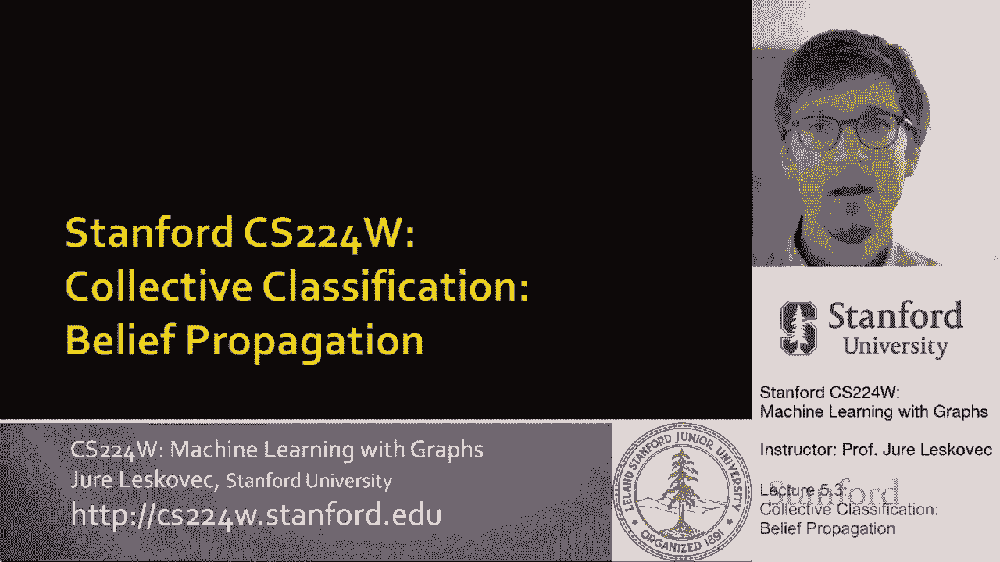
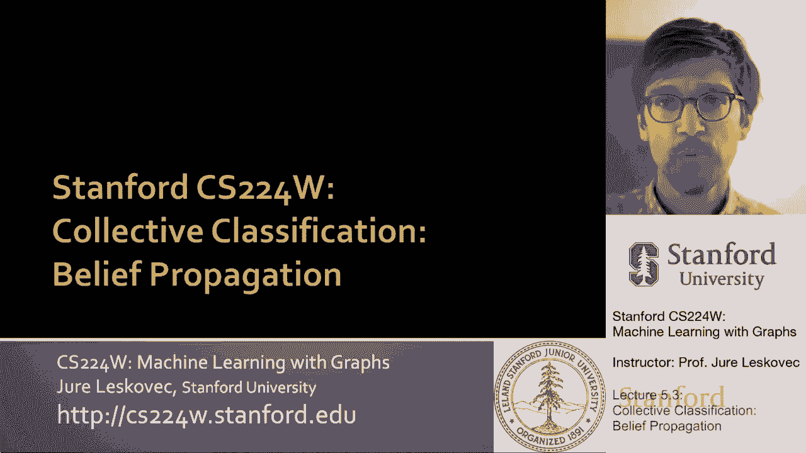
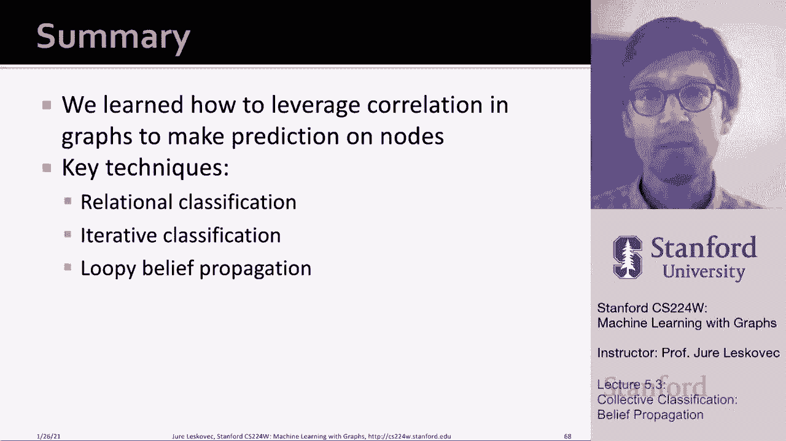

# P16：5.3 - Collective Classification - 爱可可-爱生活 - BV1RZ4y1c7Co

所以要呃，谈第三种方法，呃，我们今天讨论了，我现在要去呃，谈信仰传播，所以这是围绕集体分类的最终方法。

我们要谈谈，嗯，在这个，呃，在这次讲座中，真的，这将是关于所谓的，呃，否，呃，消息传递权，我们可以想到我们到目前为止讨论过的这些方法，就信息种类而言，通过网络边缘发送的信念，接收这些消息更新的节点。

更新自己的信念，以便在下一个迭代中，它的邻居能够得到这个呃，新的信息和更新他们自己的呃，信仰也是，所以这基本上就是，呃，呃，什么是，呃，我们今天试图探索的核心直觉，这是关于在邻居之间传递信息，要么推它。

要么接它。

并更新了关于呃的信念，自己，这样做的算法也被称为循环信念传播，环状的，因为我们将应用于可能有循环的图，嗯和信念传播，因为这些信息，这些信念将被超越边缘，呃，网络的，所以让我给你一点背景，这在哪里，呃。

愚蠢信念传播的概念来自，信念传播是一种动态规划方法，关于回答Proba概率查询，呃，呃，在图表中，对呀，通过概率查询，我是说，你知道的，计算给定节点属于给定类的概率，这是一个迭代的过程，在这个过程中。

邻居，你知道你能想到的方式真的就像，你知道的，如果没有Covid的话，我们会很好地坐在学校里，你知道你可以，您可以在彼此之间传递信息，如果你是，你知道，靠得很近，或者如果您在网络中连接，所以节点v会说。

i，你知道的，我相信你嗯，你属于这个班，下面的一个，呃，可能性，然后一个给定的节点可以从它的邻居那里收集这些信念，然后说，啊哈，这让我更确定了，或者不太确定，我也是一班的，当这种共识，呃到了。

因为这些信息正在，呃转来转去，我们到达了最佳状态，我们到达了关于，类或标签，网络中每个节点的，所以让我向你展示一些关于消息传递的基本知识，我们首先要在简单的图上做这个，我们要在折线图上这样做。

然后我们要把它推广到一个树型图，然后我们将把它应用于一般图，只是为了简单，呃，让我们假设我们要计算一个图中的节点数，使用消息传递权，所以每个节点只能交互，这意味着它只能与邻居传递信息，对呀。

它连接到的其他节点，所以嗯，你知道，就像我之前说的，当我们，但现在让我们假设没有循环，或者让我们忽略循环，对呀，所以我的想法是我有一个线图，我有一到六个节点链接在这种类型的，呃，线性结构，所以任务是。

要计算或计数图中的节点数，我们如何使用消息传递来做到这一点的方法是我们定义一些顺序，在结点上对，而这份订单，假设结果是一条路径，然后边缘方向，我们可以根据节点的顺序来思考它们，所以嗯。

而这个边缘方向决定了，消息传递的顺序，假设我们考虑顺序为一的节点，两个，三四，五六，所以消息将从1点开始，我们将其传递到节点6，这些消息的方式是节点I将计算消息，然后嗯嗯，你知道它会的。

消息将从节点I发送到节点I，加一个嗯，这个想法是，当消息传递到节点时，节点可以查看，这个信息可能会改变它并传递它，所以说，如果现在我们想回到，计算图中节点数的任务，这里的想法是，呃，呃，简单右。

每个节点只能与其，呃成员，它的邻居只能传递信息，嗯，这个想法是每个节点都说啊哈，但是不管我面前有多少节点，我也把自己加入计数，传递这个信息，呃到下一个节点，这意味着每个节点都会监听来自其传入邻居的消息。

更新消息并将其转发，我们将用字母M来表示消息正确，所以说，比如说，思考这个节点的方式，有人会说哦，有一个我，然后它会传递这个信息，我是邻居二号，二号邻居要，呃，获取传入消息并说，哦，我面前有一个节点。

但这里也有我，所以这意味着到目前为止有两个节点，所以它会更新你的信念，你知道有N条加一条消息，呃在它之前，然后它会把这个信息向前发送，与消息现在将有价值，然后节点3将收集值2的消息，更新一下，它会说哦。

还有我，所以它会给它增加一个情节，所以它会变成一个三，它会把它送上，这样你就知道当我们到达第六个节点时，我们将计算节点数，呃在路上，因为每个节点都将消息值增加一个，并将其传递给，所以在最后。

你知道第六个节点的最终信念是有六个节点，呃，在图中，你知道的，我们甚至可以现在接收这个消息，并将其传递回开始节点，呃一个，但这里的主要思想是每个节点从它的邻居那里收集一条消息，更新并转发。

这就是我想在这里说明的核心操作，你可以看到这是如何在线图上很好地工作的，嗯与适当的，呃，节点的排序，现在我们可以做同样的算法，也在树上，对呀，如果您有一个具有类似非循环树结构的图，然后我们就可以表演。

消息传递，不仅在路径图上，而且在树状结构图上，这里重要的是传播或执行从树叶传递的消息，到树的节点的根，所以这个想法是对的，第一次，呃，剩下五六和七，嗯，我们和二号会说，哦，我们是一体的，我是一个节点。

我是第一个节点，并将消息值设置为1，然后他们会给他们的，呃对他们的父母，嗯对，谁是谁是谁，呃这里，呃在他们上面，然后父母会总结孩子们的信息的价值，添加一个并将消息传递给它，然后再次递归到下一个级别。

你知道这将总结，来这里的人，就是二加一，它自己是三加一，送它是四个，然后这里又要总结一个，加四等于五加，等于六，这里应该有六条信息，其实应该是七个，所以我在某个地方失去了一个数，但你的想法是对的。

所以这个想法是说，我是一个后代，我发送关于，我是一个后代，我把它发出去，这个总结了信息，给他们加一个，嗯，并说，哦，我们有三个人，我把这个送过去，所以这里的值是3，那又是嗯，呃这里也一样，它将是一个值。

所以会有，一加三等于四，加一等于五，所以这里会有五个，这里有一个后代，所以在这个节点上，这两个加在一起是6加1，在最后，最后的信念是有七个节点，呃，再次在图表中，该算法中的基本信息是本地消息计算。

它们被节点收集，节点收集它们，um处理消息，创建新消息并将其发送，所以疯狂的信念传播，呃算法，它做什么它，嗯，你知道的，如果你说什么消息将从节点i发送到节点j，这将取决于我从它的邻居那里听到的节点。

对呀，这里的消息内容将，依赖于来自其下游的传入消息，呃，邻居，所以每个邻居都给我传递一条信息给你，我现在要把这些信息，呃收集它们，计算它们，更新他们，创建新消息，然后将此新消息发送到节点。

这就是疯狂的信仰传播，呃做的方式，我们可以想到这个，正式一点，呃是以下内容，我们将有所谓的标签标签势矩阵，所以这里我们要捕捉节点和它的邻居之间的依赖关系，在标签方面，你可以把这看作是一个，就像呃。

一种说法是，呃，什么是，如果节点u i有标签y，节点j有标签y，你知道一些其他的标签，呃y潜艇j，那么嗯，标签标签势矩阵，那个条目，呃，呃，单元格将是比例，呃，或者将与节点j属于类的概率成正比。

呃y潜艇j，考虑到它的邻居，我属于呃，呃，潜艇，呃，我所以，这意味着这里，如果存在同源性，这个矩阵在对角线上有很高的值，如果如果呃，j属于第一类，那我也应该是一班的，但是考虑到我们有这个标签标签势矩阵。

如果有很大的价值，对角线的um，这意味着你知道我的邻居是否有一个人，那么我很可能是零级的，所以它还可以捕捉实际连接的节点的情况，是相反的标签是相反的，呃，上课，那是这个标签标签。

告诉我们节点j是否有一个标签的势矩阵，我有多大可能，其他类型的标签，如果我是节点I，然后我们也会有这个，呃Phi，这是关于节点i的标签应该是什么的先验信念，如此正确。

所以y i的phi与节点i的先验概率成正比，属于Y I类的，然后我们会有一个信息的概念，消息从节点I到节点J的位置，这意味着它是节点y的i的消息或估计，在Y班，小杰小杰和我将是所有呃，类标签。

所以在最初的迭代中，首先给你公式，在初始化中，我们将把所有消息初始化为值一，然后我们将对每个节点重复，下面的公式，基本上我们现在在节点I，我们想计算，我们要发送到节点J的消息。

这个信息将是我相信J属于一个给定的类，所以我们要做的是，这是说，好的，让我们把所有的状态加起来，或者在所有可能的标签上，让我们相信我属于一个给定的，呃标签，然后呃，这是，这是J的势能。

我们属于Y Sub J标签对吧，这是我在上一张幻灯片中介绍的标签标签势矩阵，现在我们将它与节点i的先验概率a相乘，呃属于Y班I班，现在我们正在做的是，我们要把所有的邻居加起来，呃，呃，节点i um的k。

省略j j will是我们发送消息的节点，所以我们在总结每个人，但j或乘以除j以外的所有人，现在对每个邻居，呃K在这里，我们问的这三个邻居，你对结点的看法是什么，为什么在课堂上，呃你的潜艇我是对的。

所以现在基本上这意味着节点i从它的下游收集信念，邻居聚合信念乘以它的PRA它的信念，它自己的类应该是什么，然后应用标签电位，um矩阵现在向节点j发送消息，关于我的标签应该如何影响，J的呃标签。

这是呃的核心，疯狂的信念，呃传播，对和呃，我们可以继续迭代这个方程，直到我们到达，呃，一些收敛，就在我们收集信息的时候，我们改造它们，并将信息传递到下一个层次，呃邻居，在这种方法之后，这个迭代将收敛。

嗯，我们会相信什么是，节点I属于给定类的可能性或概率是多少，或给定标签，呃你的潜艇，呃，i，本质上是这样的，我们的信念将是先前信念的产物，关于那个节点时间的标签是什么，下游其他节点的消息，这里标记为J。

呃想想节点的标签，呃我，呃是，这被编码在这些消息中，这就是信念传播算法的工作原理，嗯，这里我称之为愚蠢的信念传播，因为在实践中，人们倾向于将这种算法应用于具有循环或循环的图，即使比任何形式的收敛保证。

我在这里给出的这种概率解释，呃迷路了，所以嗯，如果你考虑带循环的图是对的，节点不再有固定的顺序，哪个是哪个，嗯，否则，固定的顺序存在于术语中，如果图是树，但是如果一个图有一个循环，你不能，你不能排序呃。

节点，在……在……在……，基本上，我们的想法是应用与前面幻灯片相同的算法，但是我们从任意节点开始，然后沿着边缘更新消息，所以基本上我们又以某种随机的顺序传播这个，直到它收敛，或者直到一些固定的呃。

迭代是呃是达到，给你一个想法，这会是什么样子，比如说，在有圈的图上，嗯，问题变成了如果我们的图有循环，来自不同子图的消息，对呀，所以这意味着例如，当我们的图形是一棵树时，我们可以说，哦。

让我们从左边的孩子那里收集信息，从正确的孩子，嗯，把它加起来寄给我们的父母，所以这意味着那种孩子不互相说话，这些信息真的来自脱节，呃，树的不相交部分，然而，如果有一个循环，然后这个，呃，就像，比如说。

节点U何时收集消息，它会从I和K那里收集信息，因为它们都依赖于信息，他们从J那里得到的，所以从这个意义上说，它在某种意义上，J和你说了两次话，一次通过i一次通过k，所以这就产生了问题，呃，呃。

从理论上来说，和趋同方面，但人们在实践中倾向于做的是，在实践中并不是很有效的是你仍然运行这种信念传播，即使图形有循环，在这里我想告诉你的是一旦你处于一个循环中，什么样的信息会，呃会放大的。

嗯人为的因为它在一个循环中，如果你想一想，这是相似的，当我们谈到PageRank的时候，我们谈到了蜘蛛陷阱，对呀，这就是随机行者的地方，无限迷失在这，呃，在这个蜘蛛陷阱里，它开始循环。

循环或循环的问题是这些消息开始循环，嗯再次以及，所以问题是，呃，在这种情况下，如果图有圈，信念可能不会趋同，um消息是基于i的初始信念，而不是分开，我最初的想法是，可能不正确的加强了，呃，让我们说呃。

在这种情况下通过循环，然而，就像我在实践中说的，呃，愚蠢信念传播仍然是很好的启发式，呃，对于复杂图，因为复杂的现实世界网络往往更像树，它们的循环次数相对较少，所以现实中的循环并不是一个大问题。

就像在这种最坏的情况下可能会有的那样，给大家举个例子，对呀，想象一下我们在做信仰传播，我们有两个状态，我们有一个状态或一个真或假，现在你知道这里的这个节点向下面的节点发送消息，说，你知道的。

我想你是真的，你知道的，我相信你是真的是真的，我相信你是假的，所以现在这个节点将把这个和s传递给，现在这将是，让我们说更新，或者呃，在一个循环中传递，但是当它回到这个节点的时候。

这个节点现在将从两个传入的呃，消息，这条消息和那条消息，所以现在它会说，哦，我相信我在，我是真的其实是四个，我相信我是我是假的，假设只有一个，或者呃，假设只有两个，这意味着现在在这个循环中，这将会放大。

嗯，循环会放大，呃真的，所以这意味着消息循环又循环，并且越来越相信这些变量实际上有状态为真而不是状态为假，然后呃，信念传播会错误地将这些信息视为单独的证据，呃，变量t为真，因为有一个，有一个循环。

呃在图表上，um，这可能会导致，呃，这会引起问题，正如我所说，实践中，实图，呃看起来更像树，所以他们不会，呃，循环不是，呃一个问题，呃在，呃在实践中，对呀，这是，正如我所说，一个极端的例子。

经常在实践中，循环，周期的影响很弱，周期很长，至少有一个弱，呃相关性，使信息强度，呃被打破了，所以嗯，信仰传播有哪些好处，优点是很容易编码，很容易并行并行，它是，呃。

一般的意思是我们可以应用任何形式的势的任何图模型，我给你看了这个标签标签势矩阵，但你也可以想出更复杂的，高阶势，嗯，所以这很好，因为标签传播或信念传播不，只考虑同性恋，标签改变的地方。

根据到目前为止邻居的标签，在以前的方法中，我们只说了我的标签是，呃取决于我邻居的标签，所以不管我的邻居喜欢什么，不管我的标签是什么，我邻居的标签是，这也是我在信仰传播中的标签，标签可以翻转。

因为我们有一个概念，标签标签，呃，亲和矩阵，嗯，信念传播的挑战是不能保证收敛，所以我们一般不知道什么时候该停下来，嗯，尤其是如果有很多闭环，所以这里的诀窍是运行一个短暂的信念传播，呃步数。

当然还有这些潜在的功能，呃标签标签，呃潜力，呃，矩阵，呃，这需要，嗯，它需要训练，呃，数据分析能够，呃估计一下，所以总结一下，我们学会了如何利用图表中的相关性，对节点进行预测，我们讲了三种技术。

关系分类，基本上我们说我的标签是我邻居的一些标签，这基本上意味着我的标签是我邻居的标签，嗯，这使用了网络结构，但不使用特征信息，然后我们讨论了使用节点特征信息的迭代分类。

以及在给定节点周围的向量z中捕获的标签的摘要，因此，这种方法使用了关于节点的特征信息，以及邻居的标签，但仍然取决于同质类型原理，然后我们谈到了愚蠢的信念传播，标签电位矩阵，把这看作是收集信息，转换消息。

并向上游邻居发送消息，嗯这个过程是精确的，在链图和树上有很好的定义，但是在有圈的图上，嗯，它创造了，呃问题，然而，正如我所说，或者倾向于连接薄弱，这样在实践中循环就不会。

导致了太多的问题和愚蠢的信念传播是一个非常强大的算法，或者半监督的一种非常强的方法，呃，节点标记，呃在图表中，所以呃，用这个，呃，我们已经完成了，呃，讲座。

