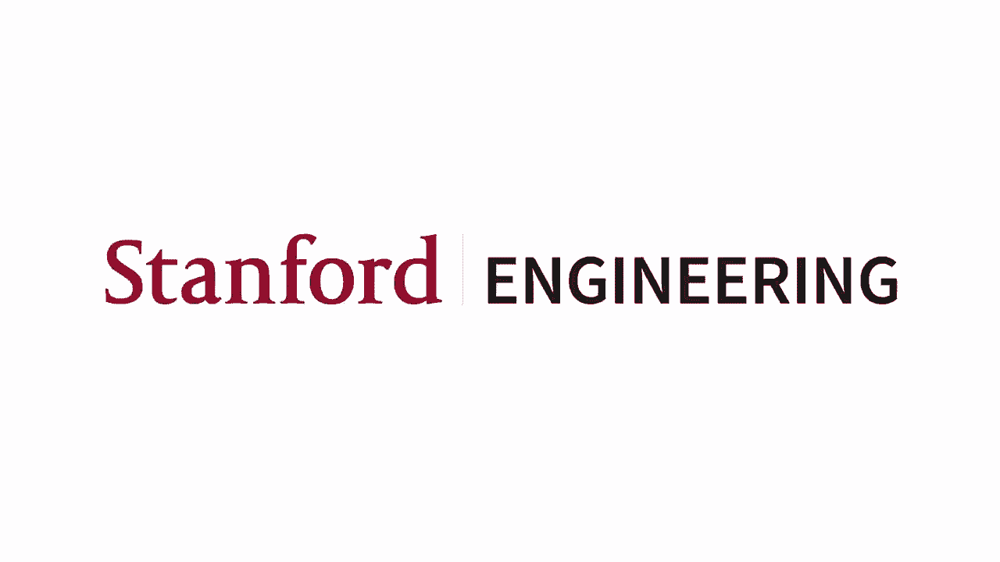
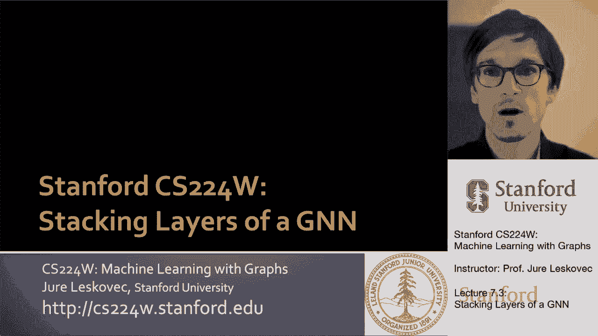

# P22：7.3 - Stacking layers of a GNN - 爱可可-爱生活 - BV1RZ4y1c7Co

所以呃很好，到目前为止，我们谈到了单图神经网络层，我接下来要讲的是，呃，我们如何将层堆叠成多层，呃，图神经网络。

所以我们首先讨论了设计和定义，图神经网络的单层，我们说的地方，它由消息转换操作和消息聚合操作组成，我们还谈到了额外的，呃，你可以添加到训练中的东西，这就像批处理归一化，不同激活功能的选择，呃。

L二归一化的选择，嗯，诸如此类的事情，我们接下来要讲的是，你怎么能把这些层一层一层地叠起来，然后呃，比如说，如何向图形神经网络添加跳过连接，这就是我接下来要讨论的话题，所以问题是，如何构造图神经网络。

基于我已经定义的单层，和一个标准的方式，通常的方法是按顺序堆叠图神经网络，所以基本上这个想法是，I在零层作为节点的嵌入，我只是使用节点的原始节点特性，然后我，你知道吗，单独改造它们，一层一层地往上。

比如说，在这种情况下，我们现在有一个三层图神经网络，在输入的位置，它们在呃水平上被转化为嵌入，三个结点，呃v，实际上有一个重要的问题，呃，防止我们堆叠太多层的图神经网络，呃一起，这里我想说的重要一点是。

向你介绍过度平滑的概念，嗯，并讨论如何预防，然后我还想做一件事，有一点是图神经网络的深度是不同的，然后以层数表示的深度，比如说卷积神经网络，所以图神经网络的深度，真的告诉我在网络中有多少跳，2。

我要不要去收集资料，它不一定说明整个网络有多复杂或有多富有表现力，因为这取决于图神经网络每一层的设计，所以我想说的是，图神经网络中的层的概念是不同的，比层的概念，假设一个卷积神经网络。

所以将许多GNN层堆叠在一起的问题，GNN往往会遭受所谓的过度平滑问题，过平滑问题是那种节点嵌入，你知道的，收敛于相同或非常相似的值，发生这种情况的原因是因为，如果感受野，正如我稍后要定义的那样。

网络太大了，然后基本上所有的网络，所有的神经网络收集相同的信息，所以在最后，对于所有不同的节点，最终输出也是相同的，我们不想有过度平滑的问题，因为我们希望不同节点的嵌入是不同的。

所以让我告诉你更多关于什么是过度平滑问题，为什么会发生这种情况，我们怎么，呃补救一下，所以首先我们需要定义一个接受场的概念，接收场是一组节点，确定感兴趣节点的嵌入，所以在K层中，gnn，呃。

每个节点都有一个k跳的接收场，那个节点周围的K跳邻域，这变得很重要，因为，比如说，如果你说我想在两个黄色节点之间链接预测，呃在这张图中，问题是随着网络深度的增加，看两个对应的计算图，呃黄色节点。

呃问题是有多大，嗯，有多大的接受场，对呀，例如，我想展示的是，这里是单个节点的，一层的感受野，所以一跳就是，你知道这四个，呃五个不同的，呃红色节点，呃在这里表示，如果我现在说，让我们做一个两层神经网络。

这是现在的接收场，都是邻居，都是邻居的邻居，就像一个街坊和两个街坊，如果我去一个三层神经网络，在这个小图的情况下，现在请注意，基本上大多数或几乎每个节点在网络中，底层网络是我的图神经网络架构的一部分。

所以这意味着这个黄色节点将收集信息，从网络中的每一个其他节点进行战斗，以确定自己的，呃现在嵌入，如果你，比如说，想做链接预测，那么你，你想知道一对节点是否连接，在这种情况下有趣的是。

共享的邻居数量增长非常快，当我们增加图神经网络中的跳数时，所以现在我有了一个不同的想象，这里我有两个用黄色表示的节点，我计算了每一个跳跃的街区，我说交集上的节点是什么，共享哪些节点，这里共享一个节点。

那么如果我说让我们计算两跳邻域，现在，所有这些邻居都是共享的，如果我说三个跳跃之间有多少邻居，共享多少节点，在三跳内共享，再次，您可以看到，基本上几乎所有的节点都是共享的，问题就变成了。

因为网络正在聚合所有这些信息和所有节点，所有的图神经网络基本上得到相同的输入，区分不同的节点将越来越困难，呃，你知道的，假设将在网络中连接的节点，以及网络中没有连接的节点，所以呃，你知道吗。

我们如何解释过度平滑的概念，接受场的定义，你知道吗，我们知道节点的嵌入，这是由它的感受场决定的吗，对呀，如果两个节点在那里有高度重叠的接收野，那么它们的嵌入也很有可能，呃，相似。

所以这意味着如果我把许多gnn层堆叠在一起，那么这意味着节点将有高度重叠的接收场，这意味着他们会从网络的同一部分收集信息，他们会以同样的方式聚合它，因此节点嵌入将高度相似。

所以这意味着我们很难区分不同的节点，这就是我们所说的过平滑问题，对吧，就像你从邻居那里收集了太多的信息，然后嗯，如果你收集太多，每个人收集相同的信息，所以每个节点都有相同的信息，计算，相同的嵌入。

很难区分它们，所以问题是我们如何克服平滑，首先是我们对有多少，嗯层，有多少GNN层，呃我们用什么，所以这意味着它不像在，呃，其他领域的神经网络，用于图像分类的类卷积神经网络，向图形添加更多层。

神经网络并不总是有帮助的，所以首先我们需要做的，呃，确定多少层是好的，就是分析我们需要的信息量来做出一个好的预测，所以基本上分析不同的深度，不同的感受野，并试图获得一个好的，呃，网络直径之间的平衡。

以及单个GNN聚合的信息量，因为如果深度太大，那么基本上单个节点的接受场可能基本上是整个，呃，网络，第二件事是我们要设置gnn层的数量，我将成为，呃，有一点，呃，多于感受野，呃，我们喜欢，我们喜欢。

但我们不想让L变得不必要的大，嗯，所以这是一种方法，呃，来处理这个，另一种处理方法，就是说，我们如何增强GNN的表达能力，如果层数较小，我们这样做的方法如下，嗯对，我们如何使gnns更有表现力。

如果我们不能让它们更有表现力，而是让它们变得更深，一种选择是在gnn层中增加更多的表达能力，这意味着在我们前面的例子中，呃，每个变换或聚合函数仅为一个线性变换。

但我们可以让聚合和转换本身成为深度神经网络，例如，我们可以使聚合运算符和转换运算符，比如说三层，um多层感知器网络，呃，而不仅仅是一个简单的，呃，线性，呃，网络中的层，这样就增加了表现力，呃。

到神经网络右边，所以现在我们的单层图神经网络实际上是一个三层，一个深度神经网络对，所以GNN中的层的概念，和层的概念，呃是不同的，所以我们让浅gnns更有表现力的另一个方法是添加，呃，不传递消息的层。

层，对呀，我们就可以，比如说，有一个呃，GNN层前后的多层感知器层，我们可以把这看作是预处理和后处理层给你一个想法，对呀，我们可以接受输入，呃，方法输入，UM输入特性。

通过多层感知器的预处理步骤进行转换，应用图神经网络层，然后再吃几个，嗯，呃，多层，呃，对嵌入进行后处理的感知器层，所以我们可以把这看作是预处理层，在编码节点特征时很重要，比如说。

如果节点特征表示图像或文本，我们希望这里有一个完整的CNN，比如说，然后我们有一个后处理层，呃，当我们推理时，这些都很重要，呃，或者在节点上转换，呃，嵌入，如果你在做，比如说，图分类，或者知识图。

这里的转换，增加了图神经网络的表达能力，对，所以在实践中，添加这些预处理和后处理层在实践中效果很好，所以这意味着我们将经典的神经网络层与图相结合，呃，神经网络层，我们最后的办法，呃呃想想U浅图神经网络。

但让它们更有表现力就是添加跳过连接的概念对吗，以及我讨论的过平滑问题的观察，早期GNN层中的节点嵌入有时会，嗯，更好地及早区分不同的节点，意思是下层，呃嵌入，解决办法是我们可以增加早期层的影响。

在神经网络中添加快捷方式的最终已知嵌入，或者我们所说的快捷方式是指跳过连接，所以如果我现在回到上一张幻灯片上的图片，我可以补充的是当我有GNN层的时候，我可以添加这个红色连接，基本上跳过一层，从。

呃连接直接连接，假设gnn第一层到gnn第三层，他们跳过这一层，所以这个想法是现在这是一个跳过连接，所以消息现在被复制了，然后呃，等待更新，而相同的消息也会被复制，只是向前发送，然后将两个分支求和。

因此在添加跳过连接之前，我们只是简单地接收了消息，现在用一个跳过连接对其进行了转换，我们把信息，把它改造一下，但然后把它和未转化的呃，消息本身，所以这是一个有趣的，呃，也接近嗯。

那么我们为什么要关心跳过连接呢，为什么跳过连接有效，嗯，直觉是跳过连接创造了所谓的呃，混合模型混合模型，从某种意义上说，现在您的模型是上一层和当前层的加权组合。

这样的信息基本上意味着你现在把两个不同的层混合在一起，或者两个不同的，呃，模型um，有很多跳过连接要添加，对呀，如果你嗯，如果你有，假设n个跳过连接，然后有两个到最后，可能的消息传递PA。

这真的可以让你增加表达能力，并给神经网络，呃，在如何传递消息和如何传递消息方面具有更大的灵活性，呃，合计，嗯和嗯，以及通过消息传递层的深层GNN，好吧，基本上我的意思是，通过这个。

你可以有一个三层神经网络，然后通过添加跳过连接，你现在基本上可以有最终的输出，是单层神经网络的某种组合，一种两层神经网络，一个单层神经网络馈入，呃，神经网络的第三层，所有这些加起来，嗯到最终输出。

所以现在你可以认为最终的输出是A是A是，在这种情况下，四个不同的神经网络，呃建筑对吧，你知道你可以，你能想到的是说，哦，我有三层，我添加这三个跳过连接，这真正的作用是你可以想到它。

现在你有四种不同的神经网络架构，所以这是一种非常有效的表达你可以把它想象成，以第二种方式，那么如何应用跳过连接，绘制神经网络图，比如说，如果我们拿一个经典的，图卷积神经网络，呃架构，并添加跳过连接到它。

这就是以前的样子，在标准GNN层，gcn层，我们从邻居那里得到消息，把它们，把它们加起来平均一下，我们可以把它看作是上一张幻灯片中的x的f，因此，带有跳过连接的GCN层将与x的f相同，消息，呃。

从上一个，嗯层右边，所以这里我们只是添加了上一层的消息，然后通过非线性，所以这就是这意味着，我们在单层中添加了这个跳过连接，通过这个，呃，蓝色部分，呃这里，当然还有，我们有许多其他跳过连接的选择。

我们可以让它跳过一层，我们可以让他们跳过，呃，多层，有一个，有一篇有趣的论文，呃来自ML法院，呃，跳跃知识网络，比如说，建议是从给定的层添加这些跳过，一直到最后一层，你现在基本上可以认为，哦。

我有一个单层神经网络，我有一个两层神经网络，我有一个三层神经网络，我收集他们的输入然后汇总他们得到最终结果，呃输出，所以通过直接跳到最后到最后一层，嗯，最后一层。

然后可以聚合来自不同深度神经网络的所有这些嵌入，这样，基本上嗯确定什么信息更重要，呃，比如说预测任务，是附近节点非常近的信息吗，或者它真的是关于聚合网络的更大部分，通过添加此跳过连接。

基本上这让我们可以称重，或者确定什么信息更重要，跨多个啤酒花聚合的东西，或者一些已经，假设在零跳上聚合，或者只跳一次，这很有趣，再次增加表现力。

