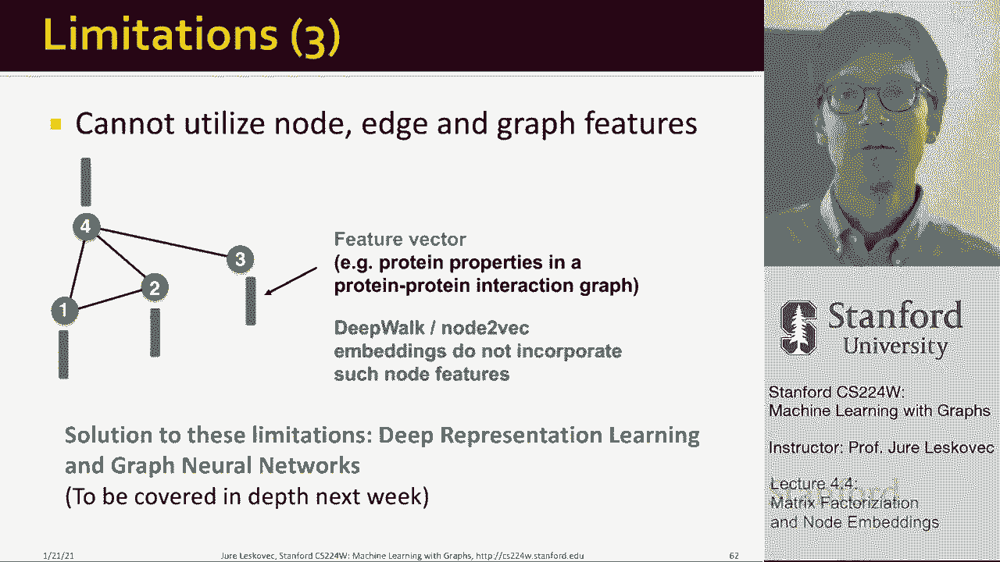

# 【双语字幕】斯坦福CS224W《图机器学习》课程(2021) by Jure Leskovec - P13：4.4 - Matrix Factorizing and Node Embeddings - 爱可可-爱生活 - BV1RZ4y1c7Co

所以现在就结束了，呃，讲座的前两部分，我想在，呃，剩下的呃，几分钟，十分钟，所以我想谈谈连接到节点嵌入和矩阵因式分解。

我给你提提神，我们的谈话，呃，我们的谈话，星期二，所以我们讨论了嵌入，我们讨论了如何有一个嵌入矩阵Z，行数是嵌入维度，列数是节点数，呃在图表中，这意味着这个矩阵的每一列，z将存储给定节点的嵌入。

我们的目标是在这个编码器解码器框架中，我们想最大化，嗯，节点对之间的点积，呃，相似的，所以如果两个节点相似，然后它们嵌入的点积，它们在矩阵Z中的列，呃必须很高，这就是这就是我的想法，然后呢，当然啦。

你是如何定义相似性的概念的，我们说两个节点相似，如果它们同时出现在相同的随机游动中，呃，从给定节点开始，所以现在你知道怎么做了，我们怎么能更广泛地思考这个问题呢。

你可以说我们在上一节课中通过随机游走来定义相似性的概念，如果我们定义一个更简单的概念，呃，相似度，如果我们说两个节点相似呢，如果它们是由边连接的，那么这意味着，我们说，哦，我想近似这个矩阵a。

就像紫外线中的入口，在矩阵a中，通过这个点积，这要么是零，要么是一，对呀，我是说如果两个节点相连，u和v是相连的，然后我希望他们的点积是一个，如果它们没有连接，我希望他们的点积为零，嗯，当然。

如果我在单条目的水平上这样写，如果我把它写在矩阵形式中，这个，我写的基本上是说，这是z反转z转置乘以z等于a，所以这现在被称为矩阵因式分解，因为我把矩阵a分解，我把它作为，两个矩阵，m z z转置和z。

所以本质上，我是说，我把我的邻接矩阵，呃一个，这里是，比如说，我想要其中的一个条目，因为有一个边缘，我想，你知道这一行和那一列的点积是值一，比如说，为了呃，对于此条目，我希望这一行和这一列的乘积为零。

所以这意味着我们取矩阵a，把它分解为z的乘积，转置乘以z，当然啦，因为嵌入维度D，Z中的行数比呃的行数小得多，结节对，所以矩阵很宽，但不要太深，这意味着这个精确的近似，说等于z转置乘以z通常是不可能的。

对呀，我们没有足够的表现力来完美地捕捉每一条边缘，所以我们能说的是，让我们找到矩阵z，这样你就知道呃，z转置乘以z，它的值尽可能与，我怎么做，如何测量相似性，现在之间的值是使用所谓的弗罗贝尼乌斯规范。

也就是在减法中取一个条目，这里面的一个条目，呃，在这个矩阵中z转置乘以z um，取它的平方值求和，所以对莱纳斯·诺姆来说，呃，平方差之和，呃，在矩阵中的相应条目之间对吧。

这和我们在上一节课中所做的很相似，就在节点嵌入讲座中，在节点嵌入讲座中，我们不是用L2范数来，定义A与其因式分解之间的差异，我们用的是软麦克斯，呃，呃函数而不是L 2范数。

但是用z转置乘以z来近似a的目标是一样的，因此，结论是由边缘定义的节点相似性内积解码器，边连通性等价于邻接矩阵的因式分解，呃一个权利，所以我们说，我们想通过节点的嵌入直接近似A，这样，如果两个节点相连。

然后我希望他们的点积等于1，如果他们没有联系，我希望点积等于零，所以这是呃，定义节点相似性的最简单方法，现在在基于随机游动的相似性中，事实证明，当我们有更多的这个，呃，细致入微的更复杂的相似性定义。

那么嗯，它仍然是整个过程仍然等价于矩阵，只是一个更复杂的或变换的因式分解，呃，邻接矩阵，所以嗯，等式是这样的，我来解释一下，呃，在下一张幻灯片上，这是什么意思，所以这意味着我们真正想做的是。

我们试图分解这个特殊的，嗯变换的图邻接矩阵，所以怎么样呃，什么是转变，变换在这里是嗯邻接矩阵，这是嗯，对角矩阵上的一个，这些是节点度，嗯，这是现在呃，升到R的次方，这个r在1和t之间的位置，哪里呃。

大写T是上下文，窗口长度实际上是我们在，呃在深步，或者呃，节点到后嗯，g的体积简单地说就是邻接矩阵项的和，是边数的两倍，对数b是一个因子，对应于负样本数，我们在优化问题中使用的。

所以基本上这意味着你可以计算，在这种情况下，通过我们上次讲的模拟随机游动，定义梯度并进行梯度下降，或者取你的图的邻接矩阵A，把它按照这个等式，我们都考虑到随机游动的长度，以及我们使用的阴性样本的数量。

如果我们把这个变换矩阵分解，我的意思是如果我们把这里的a换成变换矩阵，然后我们试图解决呃，这个方程，那么它的解决方案，这个矩阵Z将与，呃，我们在上一节课中讨论过的方法，基本上有一篇非常非常好的论文，嗯。

如果你想了解更多，称为网络嵌入，作为矩阵因式分解，基本上统一了深度游走线，和很多其他算法，呃，一个数学框架，所以嗯，正如我所说，这种基于随机游动的相似性也可以被认为是，矩阵分解。

我在这里展示的方程是关于深度行走的，你可以推导出类似类型的矩阵变换，节点到后面的矩阵就更复杂了，因为节点到后面的随机游走过程，更复杂，更多的是，呃，更细致入微，今天的讲座到此结束，我想谈谈限制和激励。

下周我们要谈些什么？因此，通过这种矩阵因式分解进行节点嵌入的局限性，或者像我讨论的那样随机行走，多维嵌入的节点到后深度行走，你甚至可以把pagerank看作是一个单维嵌入，我们无法获得节点的嵌入。

不在训练集中，所以这意味着如果我们的图在进化，如果随着时间的推移出现新节点，那么呃，不在图中的节点，在我们计算嵌入的时候，不会有嵌入，所以如果一个新增加的节点五，比如说，到了，假设在测试的时候。

让我们说，或者是社交网络中的新用户，我们就可以，我们无法计算它的嵌入，我们必须从头开始，我们必须重新计算所有嵌入，网络中所有节点的，所以这是非常有限的，第二个重要的是这个，呃，嵌入，原因是，比如说。

如果我有这里显示的图表，我考虑节点，呃，一和十一，即使它们在图的非常不同的部分，他们的本地网络结构，看起来很相似，嗯和深走，节点到节点将为11提供非常不同的嵌入，和一个。

因为你知道十一是十二和十三的邻居，而一个是邻居，有两个和三个，所以这意味着他们，这些类型的嵌入，将无法捕捉到局部结构相似性的概念，但它更能捕捉到谁，邻居的身份是什么，呃下一个呃，在给定的起始节点旁边。

当然啦，如果我们在匿名行走中定义这一点，那么嗯，这将使我们能够捕捉到结构，因为呃，二和三，嗯基本上是节点的身份，呃，呃都忘了，然后我们就可以，呃解决这个，呃问题，然后我想说的最后一个限制是。

这些方法不能利用节点，边缘和图级特征，意思是你知道，附加到节点的特征向量，呃，边和图不能自然地合并在这个框架中，对呀，我们基本上创建节点嵌入，与这些节点可能具有的特性分开，比如说，你知道的。

社交网络中的用户可能有一组属性功能，属性，或者蛋白质有一组属性--在创建，呃，嵌入，我们接下来要谈什么，就是你知道，这些限制的解决方案是什么，解决这些限制的方法是深度表示，下周我们将讨论。

图神经网络将允许我们解决这些限制，我刚刚，呃讨论过了，并将允许我们将特征信息与结构化信息融合在一起。

总结一下今天的课，我们谈到了PageRank，测量，图中节点的重要性，我们用三种不同的方式讨论了这件事，我们从流动公式的角度来讨论它，在链接和投票方面，我们谈过了，根据随机游动过程的随机游动和平稳分布。

我们也从线性代数的角度讨论了它，呃，通过基本计算特征向量，呃，到特别改造的呃，图邻接矩阵，然后我们讨论了PageRank的扩展，带有重启和个性化Pagerank的特殊随机漫步。

基本上区别在于改变隐形传态集，嗯，然后是讲座的最后一部分，我们讨论了基于随机游动的节点嵌入，以及如何将它们表示为矩阵因式分解的形式，所以这意味着将图视为矩阵是一个，在上述所有算法中都起着关键作用。

我们可以用许多不同的方式来思考这一点，但在数学上，最后，这一切都是关于图的矩阵表示，将这个矩阵分解，计算特征向量，特征值并从中提取连接性信息，线性代数，所以嗯，非常感谢。

