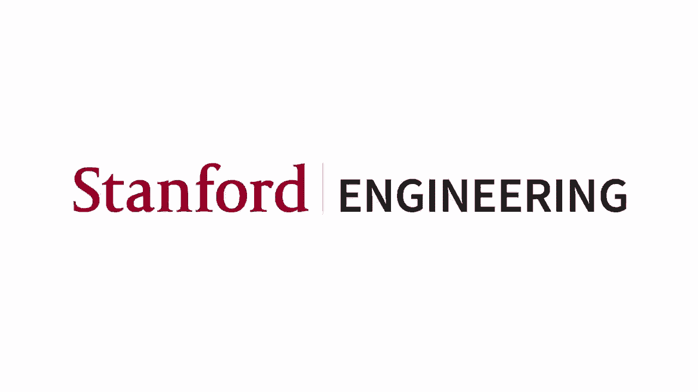
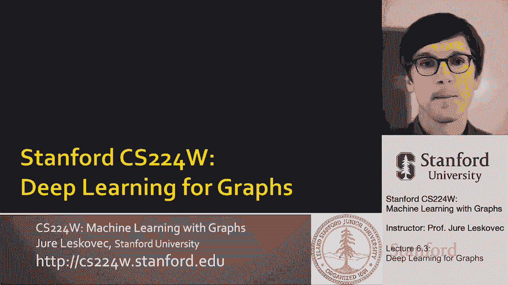
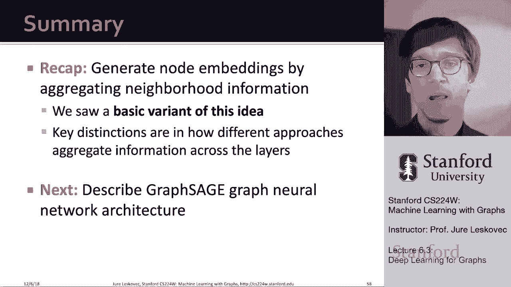

# 【双语字幕】斯坦福CS224W《图机器学习》课程(2021) by Jure Leskovec - P19：6.3 - Deep Learning for Graphs V2 - 爱可可-爱生活 - BV1RZ4y1c7Co

接下来我们将讨论图的深度学习，特别是图神经网络，所以现在我们更新了我们的概念，呃，有多一般，呃，神经网络，呃，深度神经网络工作，让我们现在去推广神经网络，使它们能够适用于图形，这就是我们下一步要做的。

所以呃，内容是我们将讨论本地网络社区，然后我们将描述聚合策略并定义所谓的，计算图，然后我们要谈谈，我们如何将这些神经网络的多层堆叠起来，呃谈谈，我们如何描述模型参数训练，我们如何拟合模型，我们如何发送。

我们如何给出一个简单的无监督和有监督训练的例子，所以这就是我们要讨论的，我们要学的，呃，在讲座的这一部分，所以设置如下，嗯，我们假设我们有一个图G，它有一组顶点，一组节点，它现在有一个邻接矩阵。

让我们假设它是二进制的，所以表示未加权图，为了简单起见，假设它是非定向的，但一切都将推广到有向图，让我们假设每个节点，uh还有一个对角节点特征向量，与之相关联的X，对，所以嗯，我会让你知道。

什么是节点特征，比如说，在社交网络中，这可能是用户配置文件，用户图像，生物网络中的用户年龄，可能是基因表达谱，呃，基因功能信息，和，比如说，如果没有um节点特征信息，数据集中的，嗯。

人们喜欢做的是要么使用指示向量，所以节点的一个热编码，或者只是所有常数的向量，价值一，那是两个，呃，受欢迎的选择，有时人们也用学位，呃作为一个节点学位，作为节点的一个特性，然后另一个符号。

我们要表示V的n，是给定节点的一组邻居，这基本上就是符号，我们要使用的设置，呃，现在是讲座的这一部分，如果你说我如何将深度神经网络应用于图表，这里有一个天真的，简单的方法，你可以说。

我为什么不用邻接矩阵来表示网络呢，那为什么不，我将节点特征附加到邻接矩阵中，现在把这看作一个训练示例，并通过深度神经网络将其馈送，对呀，看起来很自然，我拿着我的关系网，表示为邻接矩阵。

我将节点特性附加到它，现在，这是神经网络的输入，我能做出预测，这个想法的问题有几个，首先，这个神经网络的参数数将是，网络中的节点数，因为输入的数量，下面是节点数，加上功能的数量，如果你说怎么做，什么是。

我有多少训练例子，我每个节点有一个训练示例，所以这意味着你会有更多的参数，训练实例和训练将非常不稳定，它很容易用这个过度适应另一个问题，这个模型不适用于不同大小的图。

因为如果现在我有一个高度为7个节点的图，不清楚如何将一个由七个节点组成的图适合于五个不同的输入，因为这里我们有一个由五个节点组成的图，所以这是一个，呃大，呃大问题，另一个大问题是微妙的，但非常重要的是。

这种方法将对节点排序敏感，意思是现在我把节点编号为a b c，呃，呃，d和e按以下顺序，所以我的邻接矩阵是这样的，但是现在，如果我调用例如节点e，称它为a，b，c，d和e。

那么我的邻接矩阵的形状就会改变，节点嗯会被置换，矩阵的行和列将被置换，即使信息还是一样的，在这种情况下，模特会完全困惑，不知道该拿出什么，所以关键是在图中没有固定的节点顺序。

所以不清楚如何对图的节点进行排序，嗯，你知道的，把它们作为输入输入到矩阵中，这在图像中要容易得多，因为你说我会从左上角的像素开始，然后我会在图表中逐行，同一个图可以用许多不同的邻接矩阵表示。

因为这完全取决于顺序，或者呃，其中对节点进行标记或编号，所以我们必须对节点排序保持不变，所以我们要做的是，我们要去，从卷积神经网络中借用一些直觉，来自计算机视觉，但将它们推广到图中。

所以这里有一个关于卷积神经网络做得对的快速想法，如果你这里有图像，你知道，表示为这个网格，然后定义这个卷积运算符，基本上是这个滑动窗口，你在图像上滑动，你从左上角开始，这是一个三乘三的操作员。

你在这个上面计算一些东西呃，图像的区域，然后将操作员滑过，您知道向右的一些步骤，并再次应用相同的运算符，你可以继续这样做，你可以想象现在，这会给你一个不同大小不同的新图像，呃，嗯，嗯，不同数量的行和列。

您可以将另一个，卷积算子，另一种滑动窗口类型运算符，在图像的行上，如果你改变这个，呃一起，嗯，你可以，然后呃，上来，呃，用卷积神经网络，然后呃，好的预测，我们在这里的目标是推广简单格之间卷积的概念。

在简单之间，呃，超越简单矩阵，呃，还利用节点特性和属性，如，比如说，可能附加到网络节点的文本或图像，问题是我们的网络要复杂得多，所以定义节点，滑动窗口的概念，让我们让我们说，你知道三乘三的窗户。

这是非常奇怪的，因为，也许在某些情况下，你知道滑动窗口可能只覆盖三个节点，在另一种情况下，滑动窗口可以覆盖更多的节点，如何定义窗口的概念还不清楚，然后呢，也不清楚如何定义在图形上滑动窗口的概念。

这是一个很大的，图神经网络的复杂性和巨大挑战，呃能够应用于复杂的网络数据，所以让这个工作的想法是直觉的以下步骤，所以这个想法是单卷积，卷积神经网络的单层，基本上它做什么，比如说。

采取呃采取呃面积的三乘三像素，对它们应用一些转换并创建一个新的像素，这就是你可以正确思考的方式，现在我们可以用这个运算符在图像上滑动，我们想在图中做的是类似的事情，但是你知道如果你想应用这个运算符，呃。

就a而言，呃，就像一扇滑动的窗户，然后我们会有一个滑动窗口的中心，它是一个节点，这个中心将从它的邻居那里借用聚合信息，就像这里你可以想象这是操作员的中心，它从它的邻居那里收集信息，用箭头表示。

也带走了自己的价值，创造了新的价值，一个新的像素，呃为自己，所以这个想法是卷积算子真正做的是，他们正在转换邻居的信息，结合它，创造一种新的信息，所以今天的讲座也涉及到，呃，上一节课。

当我们谈到消息传递权时，所以今天我们可以考虑一个节点，从它的邻居那里收集信息，从它的邻居那里收集信息，把它们聚集在一起，组合它们并创建一个新的消息，所以呃，那就是。

这就是我们的想法图卷积神经网络是如何工作的，嗯，这个想法是节点的邻域定义了神经网络的体系结构，所以基本上围绕感兴趣节点的图的结构，定义了神经网络的结构，所以我的想法是，如果我想对这个红色节点做出预测。

我在这里呃，在网络中，我们可以想到的是，我要从它的邻居和邻居那里获取信息，会从邻居的邻居那里获取信息，我们将学习如何传播这些信息，如何沿着网络的边缘进行转换，如何聚合IT，以及如何创建一条新消息。

然后链上的下一个节点可以再次聚合，变换um和计算，所以在某种意义上，我们可以认为图神经网络是一个两步过程，在第一步过程中，我们确定节点计算图，在第二个过程中，我们传播。

我们在这个计算图上传播和转换的信息，这个计算图定义了底层的体系结构或结构，呃，神经网络，对所以嗯，通过这种方式，我们学习如何在图结构中传播信息，计算节点特征，或者呃，结点呃，嵌入，这就是直觉。

让我举一个例子来说明我的意思，在这里考虑一个六个节点上的非常小的输入图，嗯，我们会想做什么，关键思想是要生成基节点嵌入，基于目标节点周围邻域的局部结构，所以对于这个输入图，这是目标节点。

这是神经网络的结构，它将进行计算，能够对节点A做出预测，我来给你解释一下，为什么这个神经网络有这种结构，原因是节点A将从它的邻居那里获取信息，在网络B、C和D中，所以这里是b c和d，当然。

这是一层计算，但我们可以把它展开多层，所以如果我们把这个再打开一层，然后节点D从它的邻居A获取信息，这就是为什么我们在这里有这个边缘，例如节点C，从它的邻居a b获取信息，呃e和f。

他们是他们在这里A B和F，然后d从a和c中获取信息，因为它连接到节点，呃A和C，那么现在这意味着什么，如果这是图形神经网络的结构，现在我们要定义的是什么，我们要学的。

我们必须学习沿着边缘的消息转换运算符，以及聚合运算符，因为节点B说我将从，我会收集C的消息，这些信息将被转换，在单个消息中聚合在一起，然后我要把它传递下去，所以现在节点A可以再次说I'll从B接收消息。

我会改造它，我会从C那里带个口信，从D转换IT消息，现在就把它改造一下，我要把这三条消息合并成新的消息，并把它传递给任何在图层中的人，呃在我上面，所以这就是本质上的想法，当然这里的这些转变。

将学习聚合和转换，它们将被参数化，这将是我们模型的参数，与经典神经网络有什么有趣和根本不同的地方，每个节点都可以定义自己的神经网络架构，或者每个节点都定义自己的计算图，基于它周围的网络结构。

所以这意味着，例如呃，蓝色节点d在这里，它的计算图就像，这个会很瘦，因为d从a获取信息，a从b和c获取信息，所以它是一个，你知道这是一个两层神经网络，但是它非常的瘦，很窄的时候，比如说。

节点C它有一个更大的，更宽的神经网络，因为C从它的四个邻居那里收集信息，然后每个邻居从自己的邻居那里收集它，因此，该绿色神经网络的体系结构与节点目标相对应，节点C与来自节点的节点非常不同，呃，d。

那么有趣的是，从概念上讲，现在每个节点都有自己的计算图，或者有自己的嗯架构，嗯一些节点，如果他们周围的网络邻居相似，比如说，这两个节点将具有相同的计算图，对呀，这是E和F，你可以看到这些计算图的结构。

这个神经网络架构树，呃是一样的，但原则上每个节点都可以有自己的计算图，这是第一件事，第二件有趣的事，现在我们将同时在多个体系结构上训练或学习，对呀，所以这并不是说我们有一个神经网络来训练。

现在每个节点都有自己的神经网络，神经网络结构，和，当然，给定节点的神经网络结构，关于这个节点周围的网络结构，因为这就是我们如何确定计算图，这是一个非常重要的，深入了解这些东西与传统的，呃深度学习。

那么现在这个是怎么工作的，因为我们有多层，对呀，所以关键是模型可以是任意深度的，我们可以创建任意数量的呃，层和节点在每一层都有嵌入，在给定节点的层零的嵌入被简单地初始化，然后K层嵌入从节点中获取信息。

k向右跳，所以这将是第0层，节点的嵌入只是它们的特征向量，所以这里用x表示，然后比如说，节点B在第一层的嵌入，将是一些特征向量的聚合，邻居的，呃，a和c，加上它自己的特征向量。

这将是在第一层嵌入这个节点，然后这将被传递呃，所以现在节点二可以，节点A可以计算它在第二层的嵌入，所以这意味着在零层的嵌入，和它在第一层的嵌入是不一样的，对不起第二层。

所以在每一层一个节点都会有一个不同的，嵌入，而且我们只运行有限的步骤，我们不会跑这种无限长的，或者直到它收敛，就像我们在上一节课中所做的那样，我们没有收敛的概念，我们只做有限的步骤。

每一步对应于神经网络的一层，对应于一个跳跃，呃，在底层网络中，所以如果我们想从远离起始节点的K跳收集信息，从目标节点，我们需要一个K层神经网络，因为网络有最终的直径，没有意义的谈论，我不知道，百层，呃。

再次深度神经网络，除非您的网络有直径，或者，你知道，最长最短路径是，呃，一百个警察，所以现在我们有了，呃，定义了如何创建这个计算图的概念，基于给定节点周围邻域的结构。

现在我们需要谈谈神经网络中发生的这些转换，关键概念是邻域聚合，嗯，以及不同方法之间的主要区别，不同的图神经网络架构有多不同，呃，这个聚合是如何，呃结束了，这些信息如何从，呃，子节点聚合。

并与父消息的信息或消息相结合，要注意的一件重要的事情是，因为图中节点的顺序是任意的，这意味着我们必须让聚合运算符，嗯，呃，置换不变量，对呀，所以它的意思是，嗯那个，嗯，我们可以以任何顺序对节点进行排序。

如果我们把它们聚合在一起，聚合将始终相同，对呀，那是，就是这个意思，没关系，我们按什么顺序聚合，我们希望结果总是一样的，因为你是否知道并不重要，节点B有邻居，a和c或c和a，他们只是，它只是一组元素。

所以我们是否聚合并不重要，你知道在某种意义上，从a a和c或c和a，我们应该总是得到同样的，它是向上的，所以邻域聚合函数必须是，呃，序不变量或置换不变量，所以现在，当然啦。

这里的问题是我们有了答案这些盒子里发生了什么，我们在这些盒子里放什么，我们如何定义这些转换，它们是如何参数化的，我们如何学习，所以基本的方法是，例如，简单地平均来自邻居的信息，呃，并应用神经网络。

所以求和是排列顺序不变的，因为在任何数字中，你把，数字，你以任何方式把数字加起来，你总是会得到同样的结果，所以平均或总和是一个呃，排列不变聚集函数，例如，这里的想法是这里的每一个操作员。

会简单地从孩子们那里拿走信息，呃，把它们平均一下，然后决定取这个平均值，用它来做一个新的信息，所以我们可以做的方法是，我们聚合消息，然后我们应用神经网络，这意味着我们应用一些线性变换。

然后是一个非线性来创建下一个呃，级别消息，所以让我，呃，给你举个例子，基本的方法是我们想平均来自孩子们的信息，来自邻居并对其应用神经网络，所以这是如何，呃，这在方程中是什么样子的。

让我解释一下首先写h是我们的嵌入，下标的意思是呃，节点，上标表示新的，神经网络的水平，所以在零层开始的时候，节点V的嵌入只是它的特征表示，嗯，现在我们要创建更高阶的嵌入，右节点，所以这是零级。

所以在第一关，我们要做的是等式让我解释一下首先我们说，让我们把节点的嵌入，呃从以前的，呃从上一层，所以这是这个节点的嵌入，上一层的V，让我们用矩阵B乘以变换它，那么我们要说的是，让我们也检查一下邻居。

呃，我们感兴趣的节点的u，让我们把每个节点的前一层嵌入，让我们把这些嵌入加起来平均一下，所以这是邻居的总数，然后让我们把这个，一个的嵌入的聚合平均值，呃，孩子们把它和另一个矩阵相乘，通过非线性发送这个。

所以基本上我们说我有自己的信息，我自己的嵌入，如果i是节点v，我自己从上一层嵌入的，把它改造一下，我从我的孩子那里聚合嵌入，从我的邻居那里，从以前的水平，我把它乘以一个不同的变换矩阵。

我把这两个加在一起，通过非线性发送，这是我神经网络的一层，现在我当然可以运行这个或做几次，这就是如何从l级到l加1级，嗯，你知道去创造，计算第一层嵌入，我使用零级的嵌入，这只是节点特性。

但现在我可以运行它进行几种迭代，比如说几层深，也许五个，六十分，然后不管最后是什么，最后一层的隐藏表示，这就是我所说的，呃，节点的嵌入，对呀，所以我们有一个大写L层的总数，节点的最后嵌入是v的h。

在决赛中，呃，在最后一层，在邻里的最后一层，聚合，这就是所谓的深度编码器，因为它正在编码来自上一层的信息，从给定节点铺设铺设层，加上它的邻居，用矩阵B和W变换它。

然后通过非线性将其发送到北部以获得下一个级别，呃，节点的表示，我们现在基本上可以这样做，呃，对于几次迭代，对几个人来说，呃层次，那么我们如何训练模型，如果每个节点都有自己的计算架构，每个节点都有自己的。

呃，转化，呃，参数，基本上这个W和B，我们训练模型的方式是我们想定义，它的参数是什么，参数是这个矩阵w和b，它们由它索引，所以对于每一层，我们都有一个不同的W，对于每一层，我们都有一个不同的，呃。

这里的想法是我们现在，将此嵌入输入到丢失函数中，我们可以运行随机梯度下降来训练重量参数，意思是呃，BL和呃，我和呃，这是两个参数，右边的是权重矩阵，邻域聚合，另一个是转换隐um的权重矩阵，隐向量，呃。

嵌入节点本身的A以创建，然后下一关，呃，嵌入，所以这是呃，我们如何，我们怎么做，重要的是，这个权重矩阵在不同的节点上共享，所以这意味着，这个L，uh和p不按节点索引。

但是网络中的所有节点都使用相同的变换矩阵，呃，这是一个重要的细节，因为到目前为止我已经把事情写出来了，我已经根据从邻居聚合的节点将它们写出来了，但正如我们之前在图表中看到的，很多次。

你也可以用矩阵形式写东西，所以让我给你解释一下怎么写东西，呃矩阵形式对吧，可以有效地执行许多聚合，如果你用矩阵运算把它们写出来，所以你能做的就是，你可以把你的嗯矩阵h，简单地将节点的嵌入堆叠在一起。

如下所示，所以每个节点都是，呃为了呃，呃，呃，给定层的节点，所以我们可以定义矩阵h的概念，上标l，然后用我能写的方式写，呃，简单的说，呃，计算，那么基本上如果我说嵌入的总和是多少，节点嵌入的聚合。

与v相邻的u，这只是拿拿拿呃，邻接矩阵中的正确um项，并将其与矩阵相乘，啊啊，这样，我基本上是平均或汇总，来自邻居的嵌入，那么我也可以定义对角矩阵的这个概念，基本上这个矩阵为零，只在它的对角线上。

我们有呃非零条目是，单个节点的程度，然后如果你说这个对角矩阵的逆是什么，d是另一个对角矩阵，在哪里在呃，对角线上条目的边，我现在有一个超过学位的，所以d乘以d乘以d的逆是一个单位矩阵。

现在如果你把这个和这个结合起来，减去一，然后可以编写邻居聚合，邻域嵌入的基本平均值，简单地作为d到负的一个，所以d倍邻接矩阵的逆，乘以h级的嵌入，呃在L级，所以基本上这意味着我可以用这个求和来写东西。

和平均，或者我可以把它写成三个矩阵的乘积，这个对角线矩阵的乘积，它有一个在对角线上，在对角线上的度数上，所以这对应于这个术语，呃A对应于对邻居的求和，和h，呃，上标L是节点的嵌入，呃从上一层。

所以这意味着我可以用这种矩阵方程来考虑，或者我可以把它写成邻居，聚合，所以以矩阵形式重写更新函数，然后写的是这样对吧，基本上是把嗯，你的嵌入并用B相乘，从上一层获取邻居的嵌入，嗯和w相乘，嗯。

所以红色部分对应于邻域聚合，蓝色部分对应于，到自我转化，嗯和嗯，实际上这意味着，有效的稀疏矩阵乘法可以用来训练这些，呃模特，非常有效率，所以你基本上可以把一切都表示为矩阵，然后你有矩阵梯度。

一切都会好起来的，呃非常好现在，在最后几分钟，我想谈谈如何训练这东西，所以节点嵌入z是输入图的函数，我们可以在监督的环境中训练这个，从某种意义上说，我们希望将损失降至最低，就像我们到目前为止讨论的那样。

我想根据嵌入做一个预测，我想把预测和事实之间的差异降到最低，你知道你可能在哪里，例如，节点标签，或者标量值，嗯，或者我甚至可以在无人监督的环境中应用这个，在那里我会说我想。

你知道节点标签不可用的相似之处，我可以使用图形结构进行监督，所以我可以定义相似性的概念，说你知道，两个节点嵌入之间的点积必须对应于，他们在网络中的相似性，我现在可以用深度编码器，提出节点的嵌入。

而不是用浅的，嗯，一个浅编码器，呃，但我会使用与节点相同的解码器来返回，意思是随机游动和使用点积的相似性匹配，所以这就是你，我可以在两个设置中应用这个，来解释我如何进行更多的无监督训练。

所以这个想法是类似的呃，节点具有相似的嵌入，所以这个想法是你知道，让y让y uv表示一个大的，有价值一，如果节点u和v做得相似，比如说，它们共同出现在同一个随机漫步中，在两个嵌入的节点到后解码器中定义。

假设是一个简单的点积，上面写着，一次嵌入，另一个的嵌入，我们想要相似性和呃之间的差异，图的相似性与嵌入空间的相似性要小，所以我们可以通过交叉熵来定义这一点，嗯，然后我们可以再次基本上运行这个。

优化问题提出了一个图神经网络，呃预测，嗯，就像我们讨论的那样，所以嗯，我们要训练这个的方式，我们要训练这个，就像我用这种无人监督的方式说的，当然，我们也可以直接以监督的方式训练它。

这意味着对于给定的节点，您可能知道，我们有一些，我们有，我们有一些关于节点的标签，也许这是一个药物相互作用网络，我们知道这种药是否有毒，呃还是不，它是安全的还是有毒的，所以我们可以说你知道。

给定这个神经网络在最后预测，节点的标签，它是安全的还是有毒的，现在我们可以根据标签进行反向传播，所以两者都有可能，要么我们直接训练预测标签，或者我们可以根据网络相似性进行训练。

其中网络相似性可以用随机游动来定义，就像在呃，节点到这样呃，监督培训，呃，基本上我们想做的，就是，我们想定义，呃，损失，比如说分类，这是二元分类的交叉熵损失，基本上这里是标签的预测，为a为a，呃。

对于给定的颜色，是否有毒，这就是它是否真的有毒，你可以这样想y取值1，如果它是有毒的和零，如果不是，如果真值为零，那么这个学期将继续存在，基本上是1减去预测的锁，1减去预测概率。

所以在这里我们希望这是预测的概率尽可能小，所以1减去它就变得接近1，因为1的对数是零，这样这个差异就很小了，如果如果呃，类值为1，那么这个学期将继续存在，因为一加一，一减一等于零，这个这个就消失了。

所以在这里我们希望这些尽可能接近一个，这又会说，如果是，呃，如果有毒的话，我们希望概率高，如果没有毒的话，我们希望概率很低，预测概率，它是有毒的，这是十字架，呃，熵损失，这是来自节点嵌入的编码输入。

这些是分类权重，呃最终的分类，这些是呃，节点标签，它基本上是有毒的吗，呃还是不，嗯，我可以优化这个损失函数，基本上想出，呃，给我嵌入的参数b和w，然后做出好的或准确的预测，所以让我概述一下，完成演讲。

所以我们对现代设计的看法是，给定图形，我们要计算，呃，目标节点的嵌入，首先我们需要定义邻域聚合函数，嗯嗯，这是我们要做的第一件事，我们要做的第二件事，然后是定义嵌入上的损失函数，就像交叉熵损失。

我只是在讨论，然后我们需要训练，以及我们训练模型的方式，我们在一组节点上训练它，在一批节点上，所以我们选择一批节点，创建了他们的计算图，这是我们训练的一批节点，有趣的是模型训练好之后。

我们可以为任何节点生成嵌入，呃根据需要，简单地将我们的模型应用到他们身上，基本上只做向前传递，所以这意味着我们可以应用我们的模型，甚至到我们在训练中从未见过的节点，所以这意味着，我们不能在一个图上训练。

然后把模型转移到另一个图上，因为这组特殊的um节点可以用于训练，参数会在这里优化，然后我们可以将其应用于一组新的节点，到一组新的呃计算图，所以这意味着我们的模型有感应能力，这意味着相同的聚合参数。

相同的W和B在所有节点上共享，呃，以及本例中的模型参数数，与网络的大小是次线性的，因为W和B只依赖于嵌入维数和大小，特征数，而不是在图形的大小上，这意味着图神经网络能够推广到看不见的节点。

那是一个超级酷的，呃，他们的特点是因为，比如说，这意味着您可以训练您的图形，单图神经网络，您可以将其应用于一个新的图形，因为你在这里确定矩阵w和b然后你可以把这个，呃，到新网络，你可以，呃，比如说。

在一个有机体上训练并将其转移到新的有机体上，这是一个生物网络，这对于不断发展的网络也非常有用，因为您可以拍摄网络的快照，在这里创建计算图并确定参数，以便在生产中，当一个新节点到达时。

您可以快速地为它创建一个计算图，只要做向前传球，这里有它的嵌入，模型，嗯是必要的，那是超级酷的，因为这意味着你可以在一个图上训练训练，在小图上换乘另一列火车，把模型转移到一个大的，呃图或进化图。

所以让我总结一下，呃，今天的讲座在这里结束，我们所做的是通过聚合生成节点嵌入，无节点邻域信息，我们看到了这个想法的第一个基本变体，它只是将来自邻居的消息平均起来，嗯，以及不同体系结构之间的关键区别。

我们接下来要看到的是，是如何完成这个聚合过程的，下节课我将要讨论的是一种叫做，嗯，图表年龄，它将此概括为一个框架，其中不同类型的聚合，不同种类的变换，呃可以用，所以嗯。

非常感谢，呃为了演讲，嗯和嗯。

