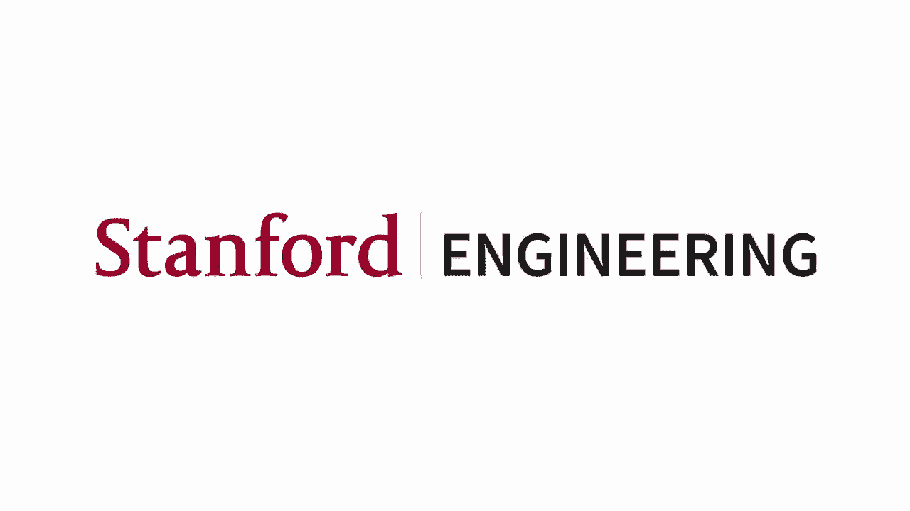
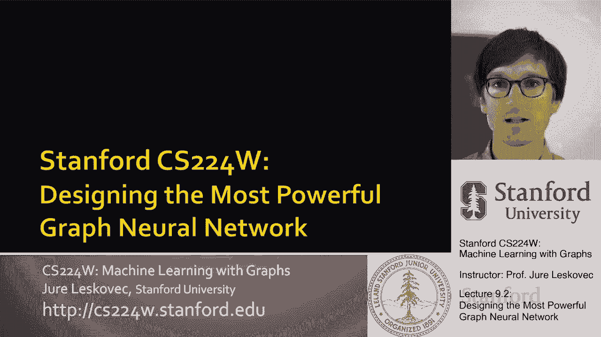
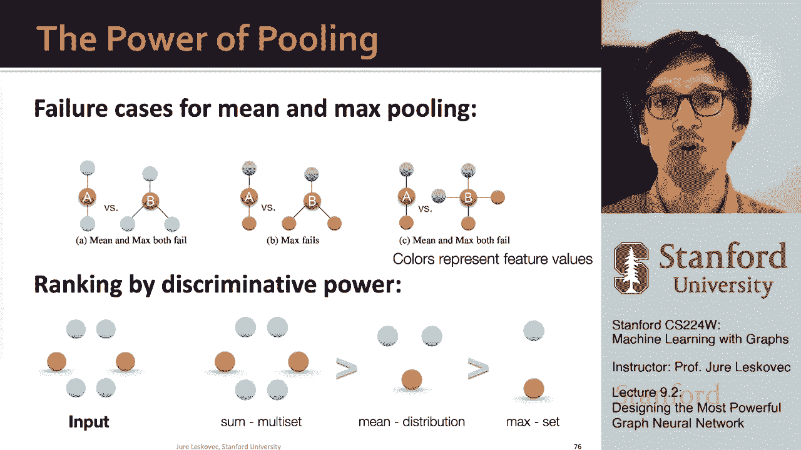

# 【双语字幕】斯坦福CS224W《图机器学习》课程(2021) by Jure Leskovec - P27：9.2 - Designing the Most Powerful GNNs - 爱可可-爱生活 - BV1RZ4y1c7Co

所以考虑到到目前为止的洞察力，让我们现在去设计最强大的图神经网络，所以让我们去设计最具表现力的，呃，图神经网络，让我们发展一个理论，让我们。

呃，去做那件事，所以说，到目前为止的关键观察是，图神经网络的表达能力，可以通过他们使用的邻域聚合函数的表达能力来表征，因为越有表现力，邻域聚合导致更有表现力的图神经网络，我们看到如果邻域聚合是单射的。

这导致了最具表现力的，嗯GNN邻域聚合是单射的，这意味着无论孩子的数量和特征是什么，您将每个不同的组合映射到不同的输出中，所以没有信息丢失，所以接下来让我们做下面的事情。

让我们从理论上分析不同呃的表达能力，聚合函数，所以你认为邻里聚合的方式，基本上是从孩子们那里获取信息，和聚合，邻域聚合可以作为一个函数在多集上被阻塞，多集只是一个有重复元素的集。

如果你说我是这里的一个节点，我从两个邻居那里收集了两个孩子，这和说，我有一对孩子，呃两个黄色的家伙，我需要从他们那里收集信息，对，当然是在多集合中，um节点可以有不同的颜色，节点可以有不同的特性。

所以你知道你可以说，啊哈，我有一个，我有两个孩子，黄色属性的，另一个是蓝色属性的，相对于其他节点有三个子节点，其中黄色属性或黄色特征的两个，还有一个，呃有蓝色的特征，当我们聚合这些信息时。

我们想要新的信息，不应丢失的汇总信息，不知何故，我们想在这个集合中，在这个压缩步骤中，基本上是为了保留所有的信息，我们知道孩子们的事，所以这里我们想说两个黄色和蓝色，在这里我们想说一个黄色和一个蓝色。

所以这两个多集还留着，呃可辨，当我们把它们聚集在一起的时候，呃对他们的父母，这样我们就可以把这个父级进一步聚合到超级父级，呃，无资料，呃迷路了，所以让我们看看呃，两个呃使用的邻域信息聚合函数。

我们在第一节课上讨论过的模型，我们会谈谈呃，gcn，它使用均值池，它在邻居节点特性上使用元素平均池，然后让我们讨论图的最大池变体，在相邻的呃上使用元素最大池的鼠尾草，节点特征。

让我们看看意思的表达能力是什么，Max的表现力是什么，呃拼车，所以呃，让我们先谈谈呃，gcn，所以平均池，当你平均来自孩子们的信息时，如果我们把呃，元素平均，然后在一个gcn中。

它后面是一个线性函数和一个relu激活函数，什么是呃，观察是什么，观察功能，gcn的聚合函数不能区分多个，不同的多套用相同的颜色比例对吧，例如，嗯，当您将消息平均在一起时，这是一个失败的情况。

一条黄色和一条蓝色的信息是否平均并不重要，或者你是否在最后平均两条黄色和两条蓝色的信息，平均值是一样的，所有的权利，这是平均数的失败情况，它，它将把这两个多集结合起来，它会把它们聚合成相同的，呃。

变成同样的消息，所以这意味着在这里有一个和一个的情况下它会丢失信息，这里是二和二，因为比例是一样的，所以让我更精确一点，给你一个适当的例子，为了简单起见，假设节点颜色表示为一个热编码，对呀。

所以现在每个节点，每个节点，uh有一个特征向量，它简单地编码节点的颜色是什么颜色，对呀，这就是它的特征向量，这只是一种，呃，一种说明的方式，呃，这个概念和当我们进行聚合时会发生什么，例如，当你做呃。

平均，两个向量，零一和零一，你你得到，呃，呃，一半一半，这就是您的聚合消息，在这两个特征向量中，在这种情况下，当你有两个黄色和两个蓝色的多集时，以下是相应的特征表示，如果我把这四个向量的元素平均。

我也得到一半一半，所以这意味着即使我然后应用一些非线性变换和激活，以此类推，我会得到同样的输出，因为呃的聚合，黄色和蓝色和两个黄色和两个蓝色的聚合是一样的，即使我用不同的特征向量编码它们。

所以黄色和蓝色节点肯定是可以区分的，因为你知道1的第一个元素设置为1，另一个把第二个元素设置为1，所以你看到了平均池基本上可以聚合呃，具有同一类型特征的节点比例相同的多个集，与其他类型的特征相比。

嗯进入相同的表示，不管节点总数是多少，或者基础多集的总大小是多少，这就是均值池的问题，这是均值池的失败案例，因为它无法区分2号和4号的多套，如果现在两者的特征比例相同，让我们看看呃，嗯嗯嗯。

图鼠尾草um最大池，呃，它的变体，所以我们在图形时代，我们应用多层感知器变换，然后拿一个呃，元素方面，呃最大集合，嗯，我们在这里学到的是最大池函数，不能用同一组不同的颜色区分不同的多组对吧。

那么这是什么意思，所有这些不同的多集将被聚合成相同的表示，为什么会这样呢？只要多组有相同的一组不同的颜色，那么无论什么是最大值，右最大值将是最大值相同的颜色之一，不管有多少个不同的节点，呃。

颜色的比例是多少，嗯，嗯，在多套中，所以给大家举个例子，想象一下我有这三个不同的多套，我呃，我用一些编码对这些颜色进行编码，然后我对它应用一些非线性变换，比如MLP，因为这就是图鼠尾草的作用。

让我们不失概括性地假设，基本上现在你知道这些颜色会变成一些新的颜色，我们用一个热编码对这些颜色进行编码，对呀，所以在这个层次上一切都是可以区分的，但问题是现在如果你拿，呃，元素明智的意义坐标，明智的。

最大值，在所有这些不同的情况下，您得到相同的聚合，你得到相同的最大值，你得到一个和一个，所以这意味着，不管节点是否有，呃，两个孩子，四个孩子或三个孩子，嗯，蓝色和呃之间的比例是多少，呃，黄色。

在所有情况下，最大池会给我相同的表示，所以这意味着这里的所有信息都丢失了，所有这些不同的多集被映射到相同的表示，如此清晰，呃，最大池不是单射运算符，因为它将不同的输入映射到相同的输出。

这就是问题所在我们会发生碰撞信息会丢失，这降低了表达能力，呃，图神经网络的，所以让我们总结一下到目前为止我们所学到的，我们分析了图神经网络的表达能力，主要的收获如下，图神经网络的表达能力。

可以通过其邻域聚合函数的表达能力来表征，对呀，所以消息聚合函数，邻域聚合是多集上的函数，基本上是用重复元素设置的，嗯，以及GCN和图形鼠尾草聚合函数，不能区分一些基本的多集。

这意味着这两个聚合函数均值和最大值不是单射的，这意味着不同的输入映射到相同的输出，这样信息就会丢失，因此，GCN和图SAGE不是最强大的图神经网络，它们没有最大的表现力，呃，图神经网络。

所以让我们继续说，我们能不能设计出最有表现力的图神经网络对吧，所以我们的目标是设计出最强大的，呃，图神经网络，呃，在所有可能的消息传递中，呃，图神经网络，这将是我们要做的方式。

这是为了设计一个单射邻域聚合函数，所以基本上是一个邻域聚合函数，当它从子节点聚合以创建消息时，它永远不会丢失信息，呃对父母来说，因此，该属性将是聚合函数的内吸性，对嗯。

所以我们的目标是设计一个神经网络来模拟这种注射，呃，多集函数，因为这是聚合运算符，所以呃，这里有一个非常呃有用的，呃定理，该定理说，任何单射多集函数都可以用以下方式表示，所以可以这样，如果我有一组元素。

对呀，我有我的多集功能，It’这是多集，呃，它有一组元素，那么我在多集上写单射函数的方法是，我可以把它写成一个，我将函数f应用于多集的每个元素，我总结了这个，呃，这些，呃，f的输出。

然后我申请了另一个呃，非线性函数，好的，所以重点是如果我想在嗯上有一个单射集，在多集上，有两个函数f和phi，其中f i适用于多集的每个元素，我求和f的输出，然后我应用另一个函数，另一个转变。

呃Phi对它，然后呃，这意味着呃，这就是多集函数的表达方式，呃，的，的，所以你能想到的证据，直觉是什么，直觉是我们的F可以，呃产生一种热的颜色编码对吧，所以f对不同的节点是单射的，它产生不同的输出。

这些输出需要足够不同，所以当你把它们加起来的时候，你不会丢失任何信息，所以在某种意义上，如果f取颜色并产生它们的一个热编码，这意味着你基本上可以通过总结，你在计算每种颜色有多少元素。

这样你就不会丢失任何信息，对呀，你说，嗯哼，我有一个黄色节点，我有，呃两个蓝色的节点，这就是你能想到的方式，f对f取颜色，然后把它们编码为一个热的，所以当你把它们加起来的时候。

你基本上数一下你有多少种不同的颜色，当然f需要是一个函数，那个做那个做这个，如果F不为你这样做，嗯，这不会，呃，这行不通，所以f必须是一个非常特殊的，功能然后，它就会，呃锻炼。

所以现在的问题是我可以用什么样的函数f和phi，我如何定义它们，我们将用它们来，基本上用神经网络定义它们，我们将使用多层感知器来定义它们，为什么我们要用感知器来定义它，原因是呃。

有一个叫做泛逼近定理的东西，它是这样的，所以一个，呃，隐层最大值，呃多重，具有足够大的层感知器，呃，隐层维数和适当的非线性，能将任何连续函数逼近到任意精度，对呀，那么这句话是什么呢。

上面说我有这个未知的特殊功能，呃，phi和f，我需要定义，以便我，这样我就可以用f和phi来写我的单射函数，但是f和phi是不提前知道的，所以我要用神经网络来表示f和phi，f和phi。

具有创建这些类型的映射的属性，所以基本上这意味着，如果我取一个带有元素x的多集，然后如果我在上面应用多层感知器，总结一下，再应用一个多层感知器，那么多层感知器就可以近似任何函数，所以它可以近似我的函数。

f和phi也是，这意味着现在我有一个神经网络可以做这个注射，多组，呃制图，你知道在理论上这种嵌入维度，MLP的维度可能非常大，但实际上你知道100到500个，嗯足够好，给你一个很好的表现。

所以刚刚发生了什么魔法，我们说过任何单射多集函数都可以写成um，作为一个，呃，呃，作为具有两个功能的A，f和phi f首先应用于每一个，呃，多集的元素总结，这是通过函数phi传递的，这样啊，注入性。

呃被保存了下来，由于泛逼近定理，我们可以用多层感知器建模f和phi，呃，聚合函数，嗯嗯，呃，f也是，所以嗯，现在最具表现力的图神经网络是什么，有最具表现力的图神经网络，有一种叫做图同构神经网络，或者呃。

基因简称，以及它的聚合函数的样子，上面写着，让我们从孩子们那里得到消息，让我们用多层感知器来改造它们，让我们把它们总结起来，并应用另一个，呃，多层感知器，你知道，呃，考虑到我解释的一切。

这是一个单射多集聚合函数，所以这意味着它没有失败的情况，它没有任何碰撞，这是信息传递类中最具表现力的图神经网络，呃，图神经网络，所以嗯，超级帅气，我们基本上能够定义最强大的图神经网络。

在一整类图神经网络中，我们现在从理论上理解了这实际上是关于聚合函数的，求和聚合函数优于平均值，比最大值要好，所以嗯，让我，呃，总结一下，我们已经描述了邻域聚合，呃，呃，基因功能，嗯和嗯，我们看到。

基本上聚合是一个总和，我们接收信息，我们通过MLP转换它们，然后总结一下，这意味着它将能够捕捉整个计算图的结构，现在，呃，我们看到了什么基因，呃是，我们将描述图同构网络的完整模型，我们实际上要把它与呃。

Weisfeiler雷曼图核，我们谈到的WL图内核，我想在第二课，我们将要提供的是这个非常有趣的视角，我们要看到的地方，uh gene是wl内核的神经网络版本，所以嗯，让我更详细地解释一下。

那么什么是WL图ker对，它也被称为颜色细化算法，基本上我们得到了一个图G和一组节点，我们分配初始颜色，呃呃c到每个节点，v um，假设我们的颜色是基于节点的程度，然后我们就是，呃迭代聚合。

对邻居的颜色进行散列，为节点创建新颜色，对呀，所以我们采取at，呃，如果你想在K级创建颜色，给定节点加1，我们取节点的颜色，呃，你是它的邻居，从上一个迭代，我们取节点V的颜色，从上一个迭代。

不知何故把这些杂凑成一种新颜色，右和哈希哈希函数，这个想法是它将不同的输入映射到不同的，呃输出，呃，所以哈希函数是单射的，呃尽可能，这个想法是在这个颜色细化的k步之后。

每个节点的颜色呃将总结K跳邻域结构，呃，围绕给定节点，所以让我给你举个例子，想象一下我有两个不同的图表，嗯嗯，他们来了，他们是不一样的，他们是，嗯，呃，非同构的，所以我们这样做的方法是，呃。

假设我们首先简单地将所有颜色初始化为值一，然后我们向右聚合，所以这个，比如说，这个节点有颜色一，然后有三个邻居，每个颜色一个，所以现在这将是一个，逗号一一一，然后你知道每个节点都做同样的事情。

现在我们要哈希，呃这些呃描述这些呃颜色变成新的颜色，假设哈希函数是单射的，意味着它没有碰撞，那么这将是一组新的节点颜色，嗯，例如，在这种情况下，这个节点，呃，那个节点的颜色是一样的。

因为他们的描述是一样的，他们有一个颜色，他们有三个邻居，每个都有一个颜色，所以呃，这个特定的输入被映射到一个新的颜色，现在我可以重复这个过程，呃呃，再来一次，以此类推，您应该注意的是。

在这个wl内核的每次迭代中，正在发生的是，我们在拿颜色，呃从邻居那里，呃，把它们和我们自己的颜色放在一起，所以如果你回去看看这里，这与图神经网络非常相似，我们从邻居那里获取信息。

把它和V自己的信息结合起来，以某种方式将这一切转化为一个新的，把这个变成那个，这是下一级节点V的消息，所以这本质上就像一个硬编码的图神经网络，对呀，我们从邻居那里拿颜色，呃聚合它们，取我们自己的颜色。

聚合它，然后调用它作为节点V的嵌入，在下一层，或者在下一个呃水平，所以重点是随着我们这样做的迭代越多，在给定节点捕获的更远的信息，对呀，越远，网络邻居得到了越来越多的跳跃被添加到其中，嗯。

这种颜色改进的想法是，如果你在做，让我们说，嗯，同构检验，然后这个过程继续下去，直到达到稳定的着色，两个图被认为是同构的，如果他们有相同的一套颜色，在我们的例子中，这两个图中的颜色是不同的，它们的分布。

它们的数量不一样，这意味着这两个图不是同构的，而你，如果你看着他们，你真的看到了，他们不是，呃，同构的，同构的，那么这与基因有什么关系，Mo基因利用神经网络对这种单射哈希函数进行建模，对呀。

我们可以的方式，呃，写出杜松子酒是，我们可以说啊哈，这是一些聚集在，呃，嵌入来自孩子的消息，呃，从节点的邻居，呃v加上颜色，节点的消息，v，呃，从上一个，呃，步骤，所以我们写这个的方式是，呃，呃。

基因运算符是说啊哈，我们从孩子们那里得到信息，我们呃，我们用MLP变换它们，这是我们的函数f，我们把它们总结起来，然后我们再加上一加ε，其中Epsilon是一些小的，呃，可学标量。

我们自己的信息被F转化，然后将两者相加，通过另一个函数，呃，phi，这正是现在的嗯，基本上以方式表示in的算子，绘制邻里信息，加上嗯，加上加上节点自己的信息到一个唯一的嵌入到一个唯一的，呃，代表权。

如果假设在输入中，呃，特征C表示，让我们说作为一个热，呃编码，对呀，所以如果我说我如何在多集上有一个单射函数，其中多集的元素用一个热编码，然后基本上我所要做的就是把这些向量加起来。

我会得到一个独特的代表，因为每个坐标都会计算给定颜色的节点数，呃，现在有，如果不呈现这些颜色，所以你需要很好地用函数f变换它们，所以它有点像这个直观的热编码，对呀，所以这意味着呃，呃，基因，呃，呃。

聚集基因，呃，类型，呃，卷积由两个，呃，呃，两个MLPS，一个呃，对邻居的颜色进行操作，一个嗯，然后聚合是求和，呃加上一些最后的MLP，这又提供了下一个层次，一个热编码。

所以当我们在下一个层次上再次总结孩子们的信息时，没有信息呃丢失，所以你可以想到这些F和呃，fs和phi作为某种转换，转换转换，呃一个热的，呃编码，现在让我们总结并提供整个基因模型。

u基因呃节点嵌入更新如下，给定一组节点V的图，我们给每个节点V分配一个标量U向量，然后迭代向上，呃，应用这个基因，基本上从邻居那里获取信息的运算符，获取自己的信息，应用这些函数f和phi。

由MLPS建模并生成下一级嵌入，如果你看看这个，这现在和WL的写法完全一样，而不是这里的哈希，我们写出这个基因骗局，所以这意味着基本上在杜松子酒迭代K步之后，呃，c至c k。

总结给定节点周围K跳邻域的结构，呃V所以把两者结合在一起，这意味着该基因可以被理解为一个可微神经网络，WL图克尔右版本，在WL中，我们使用节点颜色，嗯和嗯，假设我们可以把它们编码为一个热的。

我们使用这个抽象的确定性哈希函数，而在基因中，我们使用低维向量的节点嵌入，我们用这两个MLPS的基因卷积，MLP费用和MLP，呃如果那个呃，聚合呃，你知道的信息，基因比WL有什么优势。

没有节点嵌入是低维的，因此，它们可以捕获不同节点的细粒度相似性，如果呃和phi那个呃，确保呃，喷射性，嗯，你知道吗，因为基因和WL核的关系，它们很有表现力，力量是完全一样的。

所以这意味着如果两个图可以通过基因来区分，它们也可以用WL来区分，反之亦然，所以这意味着呃，图神经网络最多能像WL一样强大或富有表现力，UH核或WL图同构检验，然后呃，这太棒了，因为现在我们有了上界。

我们知道基因达到了这个上限，我们也知道WL内核在理论上和经验上，它已经证明可以区分许多或大多数现实世界的图形，对呀，所以这意味着杜松子酒的力量足以区分，呃，现实世界，呃，图表很棒，呃，这是个好消息。

所以让我总结一下，设计了一个对单射多集函数进行建模的神经网络，基本上，说任何单射多集函数都可以写成函数的应用，f到多集的元素加和，嗯，在我们的情况下，我们使用神经网络进行邻域聚合函数。

并依赖于泛逼近定理，这意味着基因能够以注射的方式捕捉邻域，这意味着它是最强大或最具表现力的图神经网络，嗯，关键是使用元素求和池，而不是均值池或最大池，所以这意味着一些池比均值池或最大池更有表现力。

我们还看到该基因与WL核密切相关，G核和WL核都能区分呃，大部分现实世界，呃，图结构来总结，这节课的重点是，如果你说均值和最大池，比如说，最小和最大池无法区分这些类型的邻域结构，你有两三个邻居。

所有相同的功能，这里是最大池失败的地方，因为不同颜色的数量是相同的，所以最大值在两种情况下都是一样的，这又是最小池和最大池都失败的情况，因为我们有，呃，嗯绿色和红色，它们的比例是一样的，因此。

如果你根据区分功率对不同的池运算符进行排名，嗯，有些汇集是最好的是最有表现力的，更有表现力比平均池更有表现力比呃，最大池，所以总的来说，一些池子，呃，是最有表现力的，呃，用于图神经网络。

我最后想说的是，可以进一步提高图神经网络的表达能力，所以说，我们今天讲的重要特点是，节点特征不可区分，意味着所有节点具有相同的节点特征信息，所以通过添加丰富的特性，节点可能会变得嗯可区分。

我们今天讲的另一件重要的事情是，因为图神经网络只聚合特征，他们在网络中没有使用参考点，具有相同的节点，嗯一个计算，图形结构将无法区分，我们要讲的是，呃，后面的课程实际上是我们如何提高，图神经网络。

嗯比基因更有表现力，比WL更有表现力，当然在这种情况下它需要的不仅仅是消息传递，它将需要更先进的操作。

