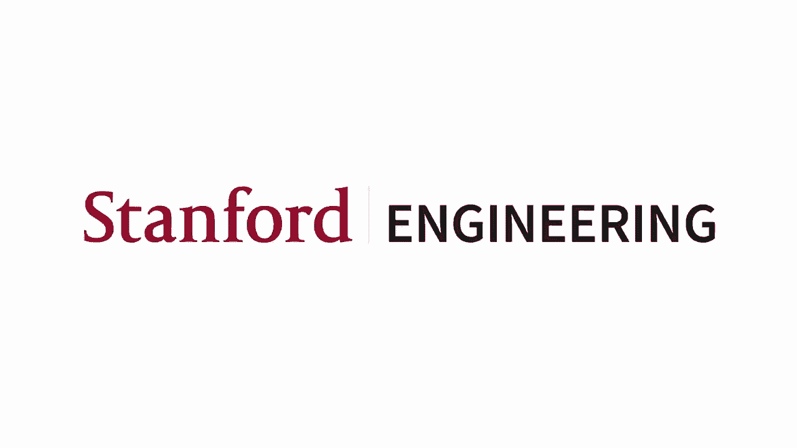
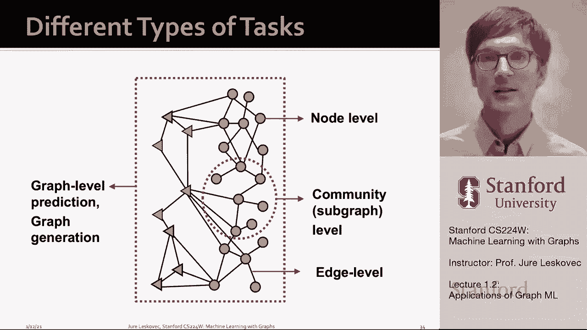
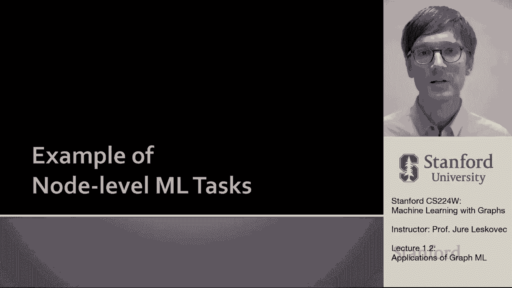
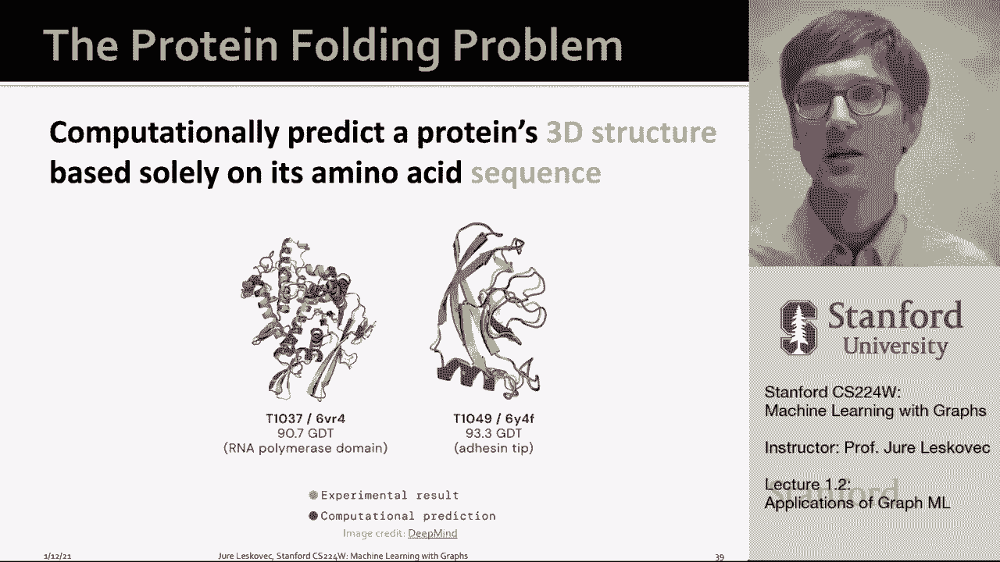
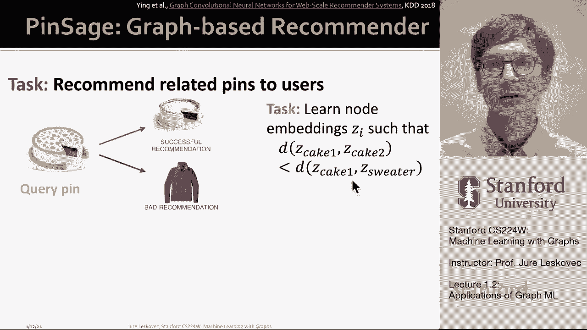
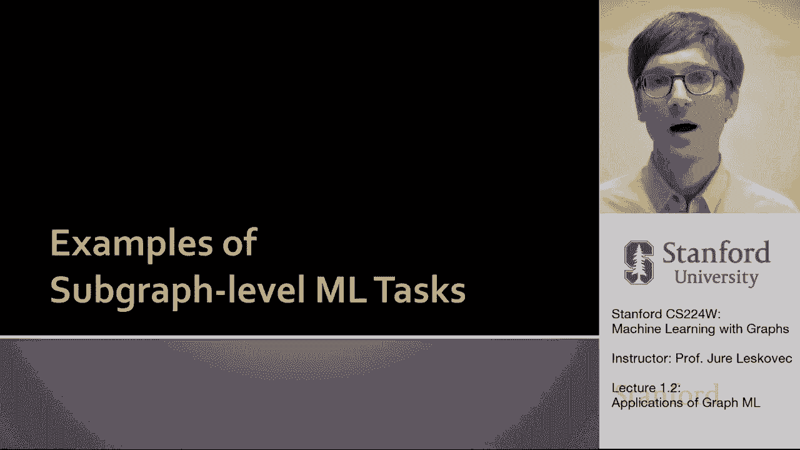
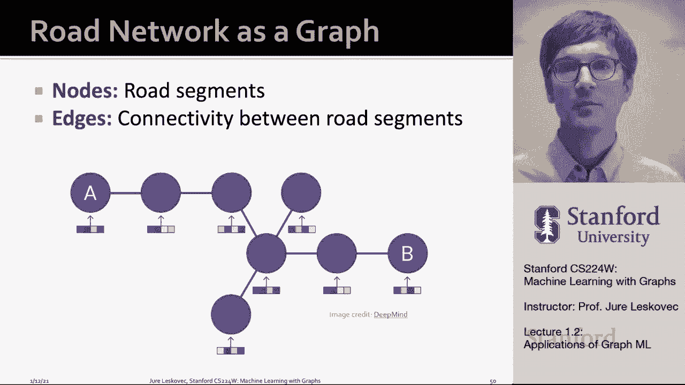
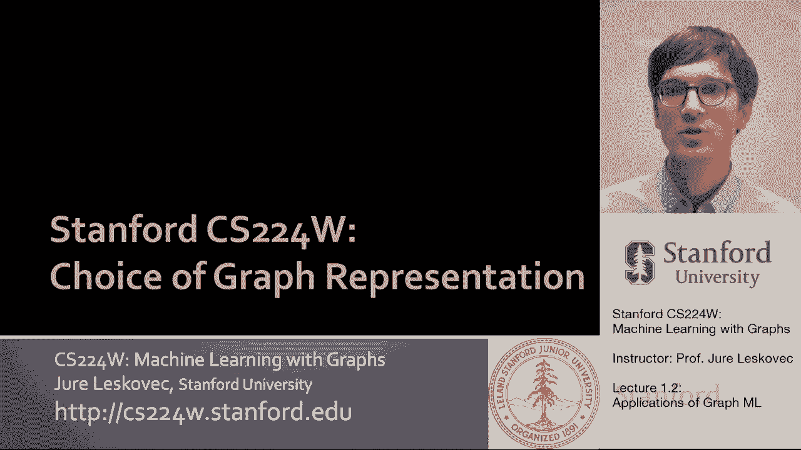

# 【双语字幕】斯坦福CS224W《图机器学习》课程(2021) by Jure Leskovec - P2：1.2 - Applications of Graph ML - 爱可可-爱生活 - BV1RZ4y1c7Co

欢迎回到斯坦福2 2 4 W，呃，用图进行机器学习，嗯，在讲座的这一部分，我将讨论图机器学习研究的应用及其影响，嗯，跨越许多不同的，呃应用程序。

所以在图形机器学习中，我们可以制定不同类型的任务，我们可以在单个节点的级别上制定任务，我们可以在呃的层面上制定任务，边，也就是节点对，我们可以在节点的子图级别识别或定义任务，以及整个嗯层面的任务，图。

就像图形水平预测或呃，图形生成，我要说的是，呃，接下来是通过这些不同级别的任务，向你展示不同的。

呃，应用程序，呃，以及可以应用这种方法模型的不同领域，因此对于节点级任务，我们一般讲节点分类，我们试图预测节点的性质，比如说，分类呃，在线用户或在链接预测中对项目进行分类。

我们试图预测一对节点之间是否有缺失的链接，这个任务的一个例子是知识图的完成，像图分类这样的图级任务，我们试图对不同的图进行分类，比如说，我们可能想把分子表示成图，然后预测分子的性质。

这对药物设计来说是特别有趣和重要的任务，我们试图预测呃，不同性质的，呃，分子，不同的药物，我们还可以执行聚类或社区检测，目标是确定嗯紧密整洁，呃，图的子部分，节点之间密集连接或高度连接的地方。

它的一个应用可能是社交圈检测，然后还有其他类型的任务，比如说，图形生成或图形um，呃进化，图形生成可以在哪里，比如说，用于药物发现以生成新的分子结构和图形，预测图的演变是非常有用的，呃，在物理学中。

我们希望对各种物理现象进行精确的模拟，这可以用一个图形来表示，所以在我们使用的所有这些机器学习任务中，呃，我们用呃，图，导致高，呃，影响应用程序，现在我想给你们一些例子。

所以首先我要给你们一些节点级机器学习应用的例子。

最近在12月底宣布了一个，呃，今年是呃，下面的问题，这叫做蛋白质折叠，在哪里，基本上在我们的身体里我们有这些被称为蛋白质的分子调节各种生物过程，例如，的方式，工作是结合或改变不同蛋白质的行为。

然后改变我们身体的生物过程，然后这样，呃，比如说，我们我们，我们得到治愈，或者我们治愈，氨基酸的，我们可以把蛋白质看作是氨基酸序列，然而，由于磁性和不同种类的力，这些蛋白质不是这些，嗯嗯，链或菌株。

但它们实际上是折叠的，嗯非常复杂，呃，形状，生物学中一个非常重要的问题，一个非常，呃，尚未解决的问题，给出了一个氨基酸序列，你能预测潜在蛋白质的三维结构吗，所以科学家们一直在进行竞赛的计算任务，嗯，呃。

七十年代，我们如何计算，仅根据蛋白质的氨基酸序列计算预测蛋白质的三维结构，这里我给你看几个，嗯嗯，两种不同蛋白质的三维结构，你可以看到的是，蛋白质的折叠是非常复杂的，基于它的呃，氨基酸结构。

所以问题是给出一个氨基酸序列，我们能预测蛋白质的三维结构吗。

这是最近在12月中旬刚刚解决的问题，呃二二，DeepMind宣布了阿尔法阿尔法折叠，提高了性能，嗯，或者蛋白质折叠的准确性，呃申请增加30%，一直到90多岁的值，在这里，我只是展示了几个，嗯。

呃媒体文章标题，呃关于一个重要的，呃成就，这个，这就是它永远改变生物学的方式，它是如何解决最大的科学开放问题之一的，这将如何加速药物的发现，以及各种重要的含义，有趣的是，呃科学，呃AI机器学习突破。

使这成为可能的关键思想是代表潜在的，呃蛋白质作为图表，在这里，他们把它表示为一个空间图，图中的节点是蛋白质序列中的氨基酸，边缘对应于，嗯，我指的是在空间上彼此接近的氨基酸节点，所以这意味着现在给定位置。

所有氨基酸的um和它们之间的边缘，图神经网络方法被训练成可以预测新的位置，氨基酸的，这样蛋白质的折叠就可以模拟，分子的最终位置能够，呃预测，所以让这个工作的关键因素。

在蛋白质折叠的科学突破中使用了图形表示，图神经网络技术，这是在节点级别，其中基本上对于图中的每个节点，我们试图预测它，嗯，嗯，空间中的位置，这样，告诉我们蛋白质的三维组织是什么。

现在我们要谈谈边缘级机器学习任务，我们基本上是在做链路预测或者试图理解不同节点之间的关系。

第一个例子是在推荐系统中，基本上我们可以把这看作是用户与项目交互，项目为产品，电影，嗯歌曲，节点以此类推，呃会是，我们会有两种类型的节点，我们会有用户，我们会有项目，用户和项目之间有一个边缘。

如果用户消费，买的，已审查，呃，给定的项目，或者听了一首给定的歌，或者呃，看了一部给定的电影，并基于该图的结构以及用户和项目的属性，我们想预测或推荐给用户的其他项目，对…感兴趣，呃在未来。

所以我们自然有一个二部图，然后嗯，一个图形问题和现代推荐系统在像呃这样的公司中使用，Pinterest，领英，脸书，呃，Instagram，呃，阿里巴巴，呃，和其他地方都基于这些图形表示。

并使用图形表示，学习和图神经网络进行预测，这里的关键见解是，我们基本上可以学习如何嵌入，或者如何表示节点，这个图的um，使相关节点彼此嵌入得更近，比不相关的节点，比如说，如果有Pinterest。

我们可以想到呃，Pinterest图像作为图中的节点，目标是嵌入相关的节点，相关的图像比不相关的图像更接近。

比如说，这个，呃，毛衣和蛋糕，可以做到这一点的方法是创建这种类型的二分网络，我们在顶部有图像，我们可以有，比如说，底部的用户或Pinterest板，然后我们可以定义一个神经网络方法，将特征。

这些不同引脚的信息或属性信息，所以基本上图像的内容，并将其转换到底层图，以获得一个健壮的嵌入，呃，一个给定的呃，图像，和，事实证明，这种方法比，如果你只考虑图像本身。

所以图像加上图形结构导致比图像本身更好的推荐，所以在这个任务的例子中，它是关于理解节点对或图像对之间的关系，通过基本上说相关的节点应该嵌入得更近，他们之间的距离应该小于呃之间的距离，彼此不相关的图像对。

嗯，链接级别预测任务的另一个例子非常不同，这是关于呃，联合用药，副作用，这里的问题是许多病人同时服用多种药物来欺骗，治疗复杂共存的疾病，比如说，在美国，五种或五种以上，有很多病人吃了二十个。

二十多种药物治疗许多复杂的共存疾病，比如说，某人谁遭受呃，失眠，患有抑郁症和心脏病，所有人都会同时服用许多不同的药物，呃，同时聚集在一起，问题是这些药物，呃，互相影响，嗯，它们导致新的不良副作用。

所以基本上药物之间的相互作用导致了额外的，呃，疾病，嗯，呃，或其他问题，呃，在那个，当然，不同药物的组合数量太多，所以我们不能，在实验或临床试验中，测试每种药物的组合，看看它会导致什么样的副作用。

所以问题是，我们能建立预测引擎吗，对于任意一对药物，将预测这些药物将如何相互作用，以及什么样的不良副作用，呃，它们可能会导致，这也是一个图的问题，所以让我告诉你我们是如何制定的。

我们创建了这个两级异构网络，其中三角形是，呃，不同的药物和圆圈是我们体内的蛋白质，然后药物的工作方式是它们针对不同的蛋白质，所以这些是三角形和圆之间的边，然后嗯。

生物学家一直在绘制蛋白质-蛋白质相互作用网络，他们在实验中测试两种蛋白质是否在物理上结合并相互作用，调节给定的生物过程或功能，所以我们也通过实验知道哪些蛋白质相互作用。

这被称为蛋白质-蛋白质相互作用网络，或者也称为Interactom，然后我们在这个图中的最后一组链接是已知的副作用，基本上，比如说，节点C和节点M之间的链接，说如果你把这两种药物一起服用。

R型的副作用是已知发生的，当然啦，这个副作用网络是出了名的不完整，并且有很多缺失的连接，所以问题就变成了，我们能推断出，我们能预测缺失的边缘，缺失连接，在这个U网络中，基本上会告诉我们，嗯。

我们能期待什么样的副作用，如果我们把，呃，或者如果一个人同时服用两种药物，所以我们对这个的看法，我们认为它是一个链接，三角形节点间的预测，呃，在图表中，基本上给出了问题，呃，两种药物，什么样的副作用。

呃可能会发生，有趣的是，您可以应用这种方法，嗯非常准确，你可以发现过去不知道的新副作用，比如说，在这个呃，在这种情况下，嗯那个，呃，模型，呃，十大预测的输出，最确定的是，基本上你阅读的方式，就是说。

如果你吃了这两种药，那么这种特殊的副作用很可能会发生，然后呃，这些副作用实际上都不在FDA官方数据库中的DA中，所以作者在这里所做的是他们从模型中提取了前十个预测，然后他们查看了医学文献和临床医学笔记。

看看是否有任何报告可以告诉我们，并提供证据证明这个特定的呃，对药物可能导致给定的副作用，实际上对于前十名中的五名来说，我们其实，嗯找到了，呃，有一些研究证据表明，这表明这个，嗯，这些预测。

嗯其实可能是真的，所以这些是在节点对水平上的机器学习任务，所以我们谈到了推荐系统，我谈到了副作用预测，现在我想谈谈子图级机器学习任务。

这是一个我们每天都在使用的最近的，是关于交通预测的，例如，如果今天你打开谷歌地图，你说我想开车，从斯坦福开车，呃，一直到伯克利，谷歌会告诉你到那里需要多长时间，您预计的到达时间是什么时候？

我不确定你是否知道，但实际上，呃，在结束图中，机器学习被用来预测旅行时间，创建图形的方式是节点表示道路段，路段之间的连接被这个网络的边缘捕捉到。

然后嗯，我们的图神经网络方法是基于条件训练的，呃，及各路段的交通模式，嗯，以及源和目标之间的路径，嗯，呃，旅程的，呃，训练图神经网络方法来预测估计的到达时间或，呃，旅行时间，嗯，还有这个，据宣布。

实际上，这种基于um图的方法在谷歌地图的生产中使用，所以每当你问路的时候，实际上有一种基于图形机器学习的方法可以告诉你什么时候到达，呃，到给定位置，最后我想谈谈图级机器学习任务，呃。

以及图级任务的一些有趣的有影响力的应用，最近的一个是关于图形发现的，实际上，基于图形的机器学习被用来发现新药，新抗生素，右抗生素是小分子图，我们可以把分子表示成图形，其中节点是原子，边缘对应于化学键。

所以每个分子都可以表示为一个图形，但我们有这些银行，呃，或者数十亿分子的集合，问题是哪些分子可以有治疗作用，所以本质上哪些分子应该优先考虑，以便生物学家可以在实验室测试它们，以验证或，或其治疗效果。

实际上麻省理工学院的一个团队正在使用，um图，呃，基于深度学习的抗生素发现方法，他们使用了图神经网络，呃，对不同的分子进行分类并预测有希望的分子，数十亿候选人，然后这些预测进一步，呃，验证。

呃在实验室里，有一篇非常激动人心的突破性论文发表在，呃，期刊细胞，呃，就在今年，关于这种基于图表的方法如何让我们高效快速地发现，不同的新药和新的治疗用途，呃，分子类型，进一步谈论药物发现，呃。

我们也可以考虑图形生成，作为一种发现从未合成或考虑过的新分子的方法，这是非常有用的，因为它允许我们生成新的结构，以各种靶向方式的新分子，比如说，我们可以说产生无毒的新分子，生成具有高溶解度的分子。

产生具有高药物相似性的新分子，所以我们现在可以有针对性地生成分子图，连那个都没有，第二个用例是我们可以优化现有的分子，拥有理想的财产，所以基本上，这里的用例是，你有一小部分分子，一定的治疗效果，比如说。

现在你想完成剩下的分子支架，这样你就提高了，嗯，给定的财产，比如说，比如说，呃，溶解度与这类深图生成模型，呃可以用于任务，呃就像呃，分子生成与优化，所以嗯，和最后一个图形级别，呃。

我想谈的任务是一个现实的任务，呃，基于物理的模拟，在这种情况下，我们基本上可以有不同的材料，我们把材料表示为一组粒子，然后我们可以在，呃，这组粒子捕捉哪些粒子相互作用，现在机器学习的潜在任务是说。

预测这个图将来会如何演变，这使我们能够预测这种材料将如何变形，嗯，让我告诉你这是怎么做的，这样做的方式是，本质上我们迭代，嗯，下面的方法我们采取材料，我们把它表示为一组粒子，根据邻近程度。

粒子之间的相互作用，我们生成了接近图，现在我们有了这个呃，接近图，我们应用图机器学习，采用当前属性的图神经网络，意味着粒子的位置和速度，并预测会是什么，粒子在未来的位置和速度，现在基于这个预测。

我们可以移动，使粒子进化到新的位置，然后我们再进行第一步，现在在哪里，基于这种新的接近，我们创建一个新的图形，预测新职位，嗯，移动粒子，并不断迭代这允许非常快速和非常准确的物理基础。

这些是一些图形级别的图形示例，图机器学习在各个领域的任务和重要应用。

