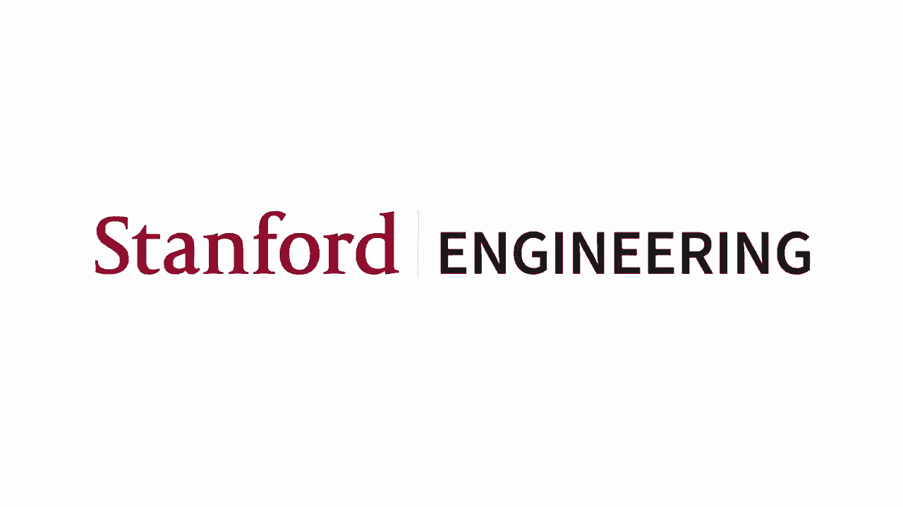
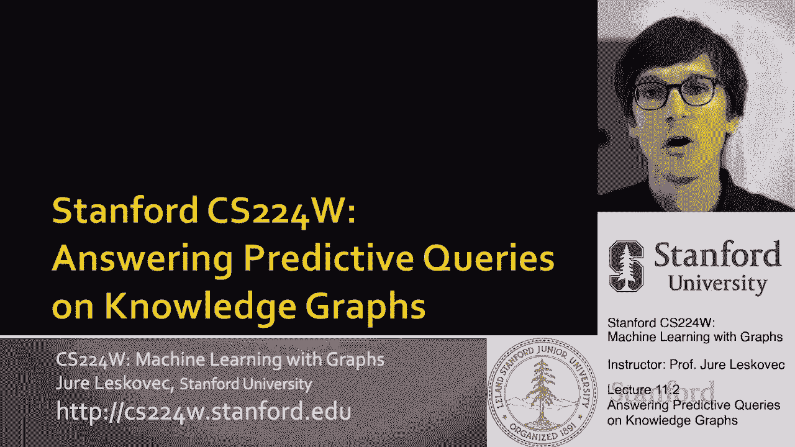
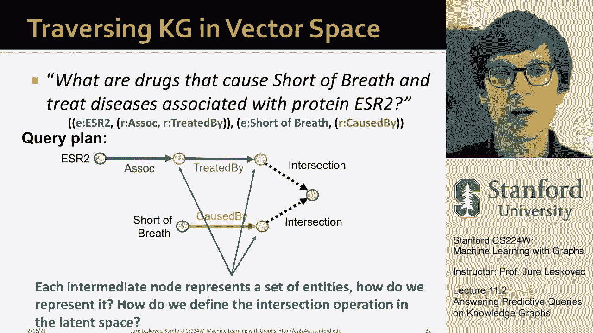

# 【双语字幕】斯坦福CS224W《图机器学习》课程(2021) by Jure Leskovec - P32：11.2 - Answering Predictive Queries - 爱可可-爱生活 - BV1RZ4y1c7Co

 So， how are we going to predict the answers to a given query on a knowledge graph？

 This is what we are going to discuss next。 And the key idea we want to do here is we want to take advantage of the structure of。

 the underlying embedding space。 And the idea is that we want to embed queries。

 And the way you think of this is that really this will be a generalization of the transi。

 method that we talked about last time。 Last time we said that the transi knowledge graph completion method。

 the idea is you start， with the head you want to go from head to tail and the way you go from head to tail is to。

 learn this vector R that moves you from H to T。 So you say what is the scoring function， right？

 That is kind of the likelihood， some kind of probability if you like， that if you start。

 with the head and tail are related with the relationship R， then the way you write the。

 scoring function is head plus the vector R minus the point T。 And now this is the distance。

 Essentially what this is saying is what is the distance between H and R and the point T。

 So another way to interpret this transi is to say I will embed the query。

 The query is head plus relation。 And the goal now is that embedding of the query is close to the entity T that is the answer。

 to the query， right？ You want to say the distance between the embedding of the query and the entity T is simply the。

 distance between these two points where another way to think of it is I'll start with the， head。

 That's my anchor node。 I'm going to traverse over this learned vector R that will lead me to some point。

 This is now the embedding of my query。 And now my goal is to minimize the distance between the embedding of the query Q and the。

 point T。 This is the embedding of the entity that is answered to this query。 So for example。

 if I start with an entity called Barack Obama and I want to move along。

 this vector that corresponds to the relationship called nationality， I add H plus vector for。

 nationality。 I end up at this point Q。 And my goal now is that of course there will be some other entities embedded in this。

 space。 I want the distance between the Q and American to be small。 And I want it in some sense。

 And I want let's say the distance between Q and New York to be larger because the answer。

 to nationality of Obama is let's say American and it's not New Yorker。

 So that's essentially the idea。 So once I have embedded the query。

 in this case embedding the query is very easy。 I start with the anchor entity and add a relation to it。

 a vector to it。 Then I want the answer entity， the entity T to be close embedded very close to the embedding。

 of the query。 That's the idea of the transi。 So what we can do now with transi。

 we can generalize it to multi-hop reasoning。 So if I say starting with defining a query Q as an anchor entity and a set of relations。

 then it's intuitive how I can generalize this using transi。

 I can start with my embedding of my entity。 And then I can simply move along the vector of relation one。

 move along another vector， of relation two and I chain these vectors together to arrive at some point in space。

 And I will call this point Q because this is now an embedding of this query that started。

 with an entity and then traversed a set of relations。

 And why is this elegant is because now creating this embedding for the query Q simply involves。

 a couple of vector additions。 And I start with the point and then I add these vectors to it and now that I have identified。

 the embedding of the of the Q， I only look at what are the entities embedded close to， these points。

 Those are my answers that are basically those are my predicted answers。

 It's a now I formulate this as a prediction task where I say whatever is close to the， point Q。

 that's my answer。 That's essentially the idea about how do we now generalize transi to this kind of multi-hop。

 queries。 To give you an idea， I could say what proteins are associated with adverse events caused。

 by a full-verse trend。 Then basically I have my full-verse trend， I have my embedding space。

 Here's hypothetically the embedding of the drug full-verse trend。

 Then I would traverse across a vector that I have learned for the causes relation。

 And hopefully the goal is that all these side effects that are caused by full-verse。

 trend are embedded close to this point here。 And now that I'm at this point。

 I want to add the traverse along the relationship associated。

 with so I would add the associated with relation to it perhaps。 This learned vector is like this。

 So this is now the embedding of my query。 And the goal is that the proteins that are the answer to this predictive query。

 they are， embedded close to this point Q。 And this would be my answers。

 So it's simply just asking embed the query and find the entities that are closest to。

 the embedding of the query。 So that's the idea for answering multipath queries using a extension of transi。

 So what are some things to discuss？ What are some insights？

 First is that we can train transi to optimize the knowledge graph completion objective。

 Basically meaning we can basically learn transi by learning the entity embeddings as well。

 as the vectors are。 And because transi can naturally handle composition relations。

 last week we were discussing about， different types of properties of these different graph completion methods。

 And we talked about the transi has this compositional property where you can chain multiple predictions。

 or multiple relations one after the other。 And this really allows transi to be able to answer path based queries。

 For example， if you look at trans R， this mult or complex， they are not able to be used。

 in this kind of path settings because they cannot handle composition relations。

 So it means they are not suitable for answering path queries。

 So the key here was this insight that basically we learn how to move around in the embedding。

 space and the goal is to embed the entities as well as learn these vectors that allow us。

 to kind of strategically move around given the query to embed the query and then the。

 entities that are closest to the embedding of the query， those are our answers。

 So this was now about answering path queries。 The question then becomes can we answer more complex queries？

 For example， that also includes some logical operator like a conjunction。 Conjunction is an end。

 So for example， maybe I get a query that is what are drugs that cause shortness of breath。

 and treat diseases associated with protein ESR2。 So the way I think of this is that ESR2 and shortness of breath are my anchor entities。

 From ESR， I want to go to across associated with and then treated by。 From shortness of breath。

 I want to say caused by and whatever the drugs that do both， I。

 need to take the intersection here and those are the entities that are predicted to be。

 the answer to my query。 So these are drugs that cause shortness of breath and treat diseases associated with。

 my protein of interest ESR2。 If you are， let's say， a drug development， a medicinal chemist。

 this is a real world query， you would like to ask over your knowledge graph。

 So how would we answer this type of query？ Let's say if the knowledge graph is complete and we can do knowledge graph traversal。

 The way we would do is we start with the first anchor entity ESR2。

 We traverse across the associated with relationship to get to the diseases associated with this。

 protein。 From here， we then move to what are the drugs that treat these diseases。 Again。

 we now traverse across the treated by relationship and to arrive to the set of， drugs。

 And then we also have to start with a shortness of breath entity and move across caused by。

 These are now the drugs that cause shortness of breath。

 And now we basically have to take an intersection between this set of entities and that set of。

 entities and whatever is in the intersection， that is the answer to our question。

 So the answer to our question would be full-west-front and pack-lit-to-cell drug。

 So the point is that we have now two entities that are answered to our query if we think。

 of it as a knowledge graph traversal type task。 And of course。

 similarly to what I was saying before， is a given if some of the links on， the path are missing。

 which is usually the case， then a given entity would not be able。

 to predict or identify that it is the answer to our query。 So for example。

 if we don't know that ESR2 is associated with breast cancer， then there。

 is no way for us to discover that full-west-front is actually the answer to our question。 So again。

 if the knowledge graphs are incomplete， knowledge graph traversal won't work。

 So the question then becomes how can we use embeddings to in some sense implicitly impute。

 these missing relations and also how would we even be able to figure out that in this， case。

 you know， that there should be a link between ESR2 and breast cancer。 And the whole piece， right。

 that our method who will take a look at the entire knowledge。

 graph will see that basically ESR2 here is also associated with ESR1 and BRCA1， right？

 And we see that there are kind of these strong relations here。

 So what this would allow us to do is kind of be able to implicitly impute the say if breast。

 cancer is associated with these two proteins who are strongly associated with the ESR2 protein。

 perhaps there is a missing relationship here， right？

 That's kind of what our algorithm needs to be able to do implicitly through node embeddings， right？

 The hope is that other context and other relationships in the graph will allow us to do this implicitly。

 So going back to our question about how would we now implement logical relations like intersection。

 and operator in this setting where we want to answer more complex queries in a predictive， way。

 the question then becomes how do we do this in the embedding space？

 And the first insight is that when we have this query plan that I showed it here， then。

 this starting node， this anchor nodes， they are single entities。

 But if you think about what are these gray nodes， what do they represent in my query plan。

 they actually represent a set of entities， right？ So they represent let's say all the diseases that are associated with ESR2 or they represent。

 all the drugs that are caused by that cause shortness of breath。

 So the question then becomes how do we do this representation of entities in the embedding。

 space because now these are sets and how do we then define intersection operators in。

 this latent space？ [BLANK_AUDIO]。

