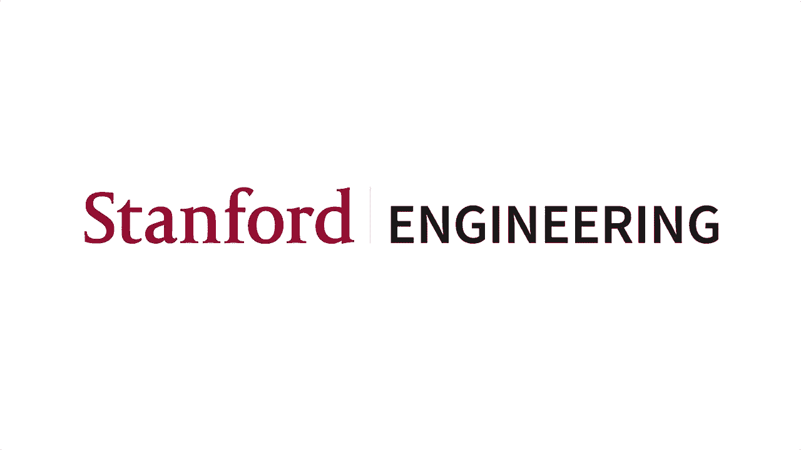

# 【双语字幕】斯坦福CS224W《图机器学习》课程(2021) by Jure Leskovec - P50：16.2 - Position aware Graph Neural Networks - 爱可可-爱生活 - BV1RZ4y1c7Co

现在让我告诉你们位置感知图神经网络将解决。

呃，问题的一部分，所以想象一下图上有两种类型的任务，对呀，我们称之为结构感知任务，我们的任务是有位置的，再一次，这只是为了说明这个概念，关于图形结构如何影响底层标签，在现实世界中，你知道的。

每项任务都有一点结构意识和位置意识，但有些任务会更有位置意识，有些人会更有结构意识，我们希望有可以在两种制度下运作的模式，对嗯，当结构感知任务中的结构，比如说，这个简单的节点的标记，呃。

两个连通三角形的图，如果节点是根据这些标签标记的，这里是a和b，那么呃，这是一种方法，因为，的，节点和邻域的结构基本上定义了它的标签，另一种任务是我们所说的位置感知任务，比如说，如果你考虑社区检测。

社区检测在这里是一项位置感知任务，你知道的，一侧的节点有一个标签，另一边的节点有另一个标签，即使它们是局部结构是可比的或同构的，就像呃，节点一和节点二，嗯，它们周围基本上有相同的邻里结构。

所以在结构感知任务中，它们应该贴上相同的标签，在它们可能被贴上不同标签的位置，因为它们在网络的不同部分，关键是GNN，图神经网络，GCN图圣人，呃，图注意网络，他们工作得很好，呃，结构感知任务就在这里。

基本上我们可以区分v1和v2，嗯，因为我们用的是，因为他们会有不同的，呃，计算图，如图所示，对呀，V 1有以下计算图，V 2有一个不同的计算图，因为v 2有3个邻域v 1有2个邻域，即使在第一跳。

所以我们能够区分它们，这意味着我们可以给它们分配不同的标签，因为它们会有不同的嵌入，因为它们有不同的计算图，1。我们的任务分配得怎么样？现在我们改变节点的标签，你知道吗，让我们说，根据社区。

在这种情况下，飞机GNN将失败，因为节点v1和v2，在图中标记的这个有相同的计算图，因为它们彼此对称，对呀，所以重点是现在嗯，因为它们有相同的计算图，一次又一次，因为我们假设。

没有判别节点特征信息给我们，这两个节点是一样的，呃，局部邻域结构，它们有相同的计算图，这意味着他们将是，它们将有相同的嵌入，这意味着他们会，分类器必须为它们分配相同的标签，嗯，在这种情况下。

我们希望他们，呃，给它们贴上不同的标签，所以问题是，如何将图神经网络深入扩展，学习能够解决或很好地工作的方法，在这个呃，你知道的，玩具示例，试图说明位置感知预测任务的概念，和关键思想，呃。

因为这一部分是锚的概念，因为你知道你的位置的方法是知道，嗯，你的职位是什么？或者呃，呃，对着某个参考点，好的我们将把这些锚称为参考点，如果我知道离，呃，参考点，我是，你知道你离不同的参考点有多远。

然后我们就可以，呃，区分我们的位置，几乎就像，您要对图中节点的位置进行三角测量，通过表征到锚节点的某种距离，原来如此，原来如此，我们的想法是我们想有一个参考点，嗯，并量化位置。

所以我们将使用锚锚节点的概念来给我们这些，呃位置对，所以我们基本上要随机选择这个锚，我们要说让我们选择节点，假设在这种情况下是一个，我们称之为锚节点，然后我们将表示v1和v2的位置。

通过它们与呃的相对距离，锚节点，因为这两个距离，v 1和v 2的uh，在本例中，到锚节点，有一个会不一样，嗯，这基本上意味着这将允许，这将允许我们区分v 1和v 2对吧，所以直觉上。

锚节点几乎就像一个参考点，作为一个坐标轴，告诉我们不同的节点离它有多远，和，这基本上让我们可以三角定位，或者定位节点的位置，呃，在图中，嗯，当然，我们不仅要使用一个锚节点，我们实际上要使用多个锚节点。

因为如果我们可以，如果我们使用多个锚节点，我们可以矢量地表征一个节点在图的不同区域中的位置，所以如果你有多个锚节点，我们能够更好地区分，或者呃，设置呃，我们的立场，我们当然不想有太多。

因为因为这样计算起来就很难了，但你知道有一些，实际上有一个理论，我们想要多少，嗯，那么呃，我们可以表征网络中节点的位置，呃挺好的，这里，在这种情况下，我你知道的，s 1和s 2是锚节点。

v1和v2是感兴趣的节点，我只是说你知道，v 1距离s 1 1跳，距离s 2 2跳，而V2是2，一跳一跳，It’两点，现在这让我们可以区分V一和呃，v二，因为他们离这里的距离不同，呃，锚节点，还有一个。

嗯，这很重要，我们不想只谈论锚节点，我们想谈谈锚套，对呀，所以呃，我们将推广锚节点的概念，从单个节点到一组节点，然后我们要定义感兴趣的节点和锚集之间的距离，作为到任何节点的最小距离，嗯，在锚设置。

对这里的想法是，这将允许我们甚至三角定位，节点在更细粒度级别上的位置，因为锚定集将允许我们提供更精确的，呃，职位信息，对嗯，这将使我们能够保持锚的总数仍然很小，所以我的意思是，比如说，我可以说让我们。

嗯，现在锚套，我有锚节点，我有两个锚节点，但也有一个锚设置，我把它记为s 3，包括节点V 3和呃1，现在我要描述一下，一个给定的节点朝向呃，对着那个锚，在这种情况下，例如，如果我对V3的位置感兴趣。

V 3与锚定点的距离为零，It’三点钟，因为它是锚集的一部分，而v2的距离是1，因为设置为v one的锚中最接近的节点是，呃，一个，跳开，所以呃，这是什么意思，嗯，比如说，如果我们能像以前一样。

如果我只用s 1和s 2作为锚，呃，节点或锚集，然后是v3和vh，彼此无法区分，它们的距离是一样的，但现在，如果我用这个大小为2的锚集，我实际上可以区分，呃，v1和v3，一次又一次。

有一个很好的理论说使用，不同的尺寸，因为然后呃的数量，锚套，坐标数，参考点数，呃，您需要在图中定位一个节点是，呃，相对较小，它比你只用，呃，像s 1和s 2这样的锚定节点，并添加，呃，倍数，呃，锚节点。

那么到目前为止的总结是什么，呃，我们要做的，我们刚刚开发了图中节点的位置编码，我们要表示节点的地方，根据其与随机选择的锚集的距离定位，这个嗯这个嗯编码中的每个维度都会，呃，告诉我，的，呃。

将绑定到给定的锚集上，并且将是与感兴趣节点的最小距离，到锚集中的任何节点，那就是，这就是我们要如何，呃，呃，创建这个，呃，位置的，呃，现在编码，呃，在我继续之前，我将使用这些位置信息。

当然你可以问你需要多少套，它们需要多大，我们要做的是，我们要做以下操作，我们将有一个指数，呃，大小呈指数增长的锚定集，但我们将使用指数级的更少，对吗，所以我们会有很多。

大小1的锚集将有大小2的锚集数的一半，你知道四号锚的一半，八号，十六号，以此类推，嗯，所以这意味着我们将有，你知道一些相对较少的锚集，每一个下一个锚集的大小都将增加一倍，但他们的数量将是我们以前的一半。

这通常是一个很好的方法如何生成这些呃，锚集和属于锚集的节点，我们只需选择它们，呃，均匀地，均匀地，均匀地，然后我们就像我说的，我们描述了呃，节点到，呃，任何节点，呃，在给定的呃，锚定装置。

那么现在我们如何使用这些位置信息，使用位置信息的简单方法，就是把它作为一个增强的节点特性，这在实践中效果很好，所以基本上我们只是用这个来丰富节点的特性描述描述符，呃，位置信息，以最短的路径距离为特征。

呃，到锚集上，这里的问题是，由于位置编码的每个维度都绑定到一个随机锚，位置编码um的尺寸可以随机排列，编码呃可能是，呃，基本上在语义上是相同的意思，嗯，呃，而不改变它的意义，所以嗯，这意味着什么。

想象你排列一个正常的输入尺寸，呃，呃，神经网络，输出会呃改变，那么什么是，什么是比仅仅使用这些位置编码更严格的解决方案，就是设计一组特殊的神经网络算子来维持，呃，位置编码的置换不变性质。

所以基本上位置编码是顺序不变的，你可以通过，让我们说某种呃，一些聚合器或呃，聚合器，顺序不变因为呃，排列，排列，输入特征维度只会导致输出维度的排列，但是每个维度的值不应该改变，然后呃，你知道的。

有一篇文章介绍了图神经网络的位置，我想说如何用更严格的方式来做到这一点，但这里的关键是锚的概念，以及可以量化图中节点位置的概念，通过距离，呃，到锚上，这使得我们现在可以提高图神经网络的表达能力。

因为节点不仅知道它们周围的局部邻域结构是什么，但他们也会知道自己的位置或位置是什么，呃。

