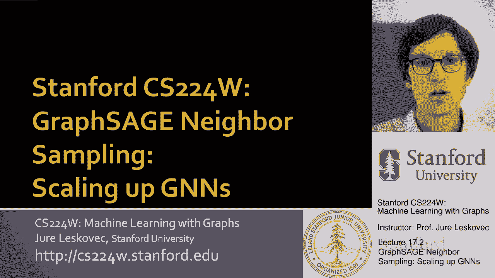
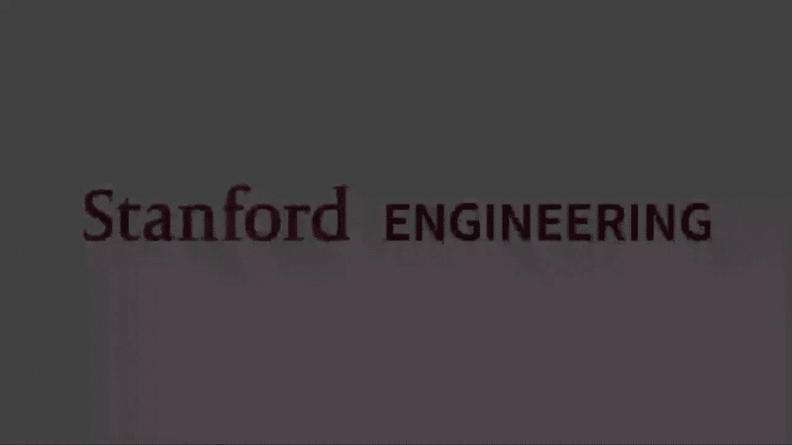

# 【双语字幕】斯坦福CS224W《图机器学习》课程(2021) by Jure Leskovec - P54：17.2 - GraphSAGE Neighbor Sampling - 爱可可-爱生活 - BV1RZ4y1c7Co

让我们来谈谈邻里抽样，这就是图圣人的关键思想，呃，纸或图形鼠尾草体系结构，所以图贤者的工作给图神经网络领域带来了什么，是思考迷你批处理实现的一种方式，在所有实现都是完全批处理之前。

然后人们会运行图神经网络，你知道的，五千个节点图三个，因为这就是他们可以放入GPU内存的东西，呃，图鼠尾草，呃，改变了，他们是，它改变了我们对图神经网络的看法，我们可以想到的创建迷你批的方法。

这也意味着我们可以将它们扩展到，呃，数百亿个节点和边缘，所以现在让我告诉你我所说的。

嗯一个，呃，呃，邻里抽样，所以呃，让我们回忆红色，让我们记住，图神经网络工作，它们通过计算图的概念来操作，其中gnn通过邻域聚合生成节点嵌入，这意味着它们聚合了来自邻居的特征信息。

然后他们创建一个新的信息并将其传递给，所以你可以这样想，如果您说我想为这个节点创建一个嵌入，呃零我会带邻居和邻居的邻居，这是我的计算图，其中节点从零级的单个特征向量开始，呃这些特征矢量聚集在一起。

转换传递到下一个级别，然后同样的事情又聚集在一起，一直转换到节点，感兴趣的节点，进行预测的节点零，注意这里这些节点，你知道这里的节点零意味着这是节点的特征向量，呃零嗯，比如说，这意味着这将是第一层。

节点的uh表示，一二三，这里我有一个零节点的节点的第二层表示，我这么说的意思是实际上节点有多种表示形式，呃每一层一个，这就是，这就是为什么当你做全批的时候，您希望采用零级嵌入来创建第一级，每个人的嵌入。

从每个人创建二级嵌入，但在这里，因为我们有这个当地的观点，我们只需要为节点创建一级嵌入，一二三，因为我们需要这些来创建二级嵌入，呃为结点，呃零，所以那是呃，想法对，所以重要的观察是两层GNN生成嵌入。

对于此节点零，使用两跳邻域结构和周围的特征，呃，这个图，所以如果我想计算层，呃，节点零的嵌入，我需要的是图的结构加上节点周围这两个跳邻域的特征，我可以忽略图表的其余部分，我不需要知道图表的其余部分。

节点零的嵌入将独立于，图的结构是如何超越两跳邻域的，这是一个重要的洞察力，因为这意味着，如果我想有一个K层GNN嵌入到，使用该k跳邻域结构和特性生成节点的嵌入，这意味着我只需要，嗯知道。

当我生成嵌入K跳邻域的时候，我可以忽略网络的其他部分，现在如果K级是，呃相对较小，或者小区面积不太大，也就是说它是，假设大小不变，但整个图形可以大得多，那么这意味着我需要相对较少的信息。

其中用于生成或创建节点嵌入的内存相对较少，呃零和呃，这是主要的洞察力，主要的见解是我们希望，计算单个节点的嵌入，我们所需要的就是围绕那个节点的k跳邻域结构，我们可以忽略网络的其余部分。

网络的其余部分不影响此感兴趣节点的嵌入，嗯，所有影响它的，是该节点周围的K跳邻域，所以这意味着现在我们可以用这样的方式生成迷你批，我们说，让我们在一个小批中对M个不同的节点进行采样，但我们不仅会把。

我们不会把节点放入迷你批处理中，但我们将把整个计算图放入迷你批，所以这意味着我将选择第一个节点，我把它的k跳邻域计算图，这是批处理中的一个元素，然后我要对第二个节点进行采样，创建它的计算图。

把这个放进我的迷你批次里等等，所以现在这意味着我的批次可能会更小，因为批处理现在不是由单个节点组成的，但是批处理是由网络小区组成的，批处理由计算图组成，所以我们将对M计算图进行采样。

然后把这些M计算图放入GPU内存，这样我们就可以计算损失，在这一小批M计算图上，所以再次强调，你知道关键是什么吗，关键思想如下，它从洞察力开始，为了计算给定节点的嵌入，我们只需要知道那个节点的k跳邻域。

所以这意味着如果我创建一个迷你批处理，不基于节点，但基于K跳社区，然后我就能计算了，呃，我将能够以可靠的方式计算梯度，所以基本上不是把节点分成小批量，我们把呃，计算图，或者换句话说。

把街坊邻居分成小批量因为我们已经，嗯嗯，我们把整个计算图，K跳入迷你批的整个网络社区，我们可以考虑以下几点，呃，随机梯度下降策略，呃，训练模型参数，对呀，我们要取样，嗯，假设每个节点有M个节点。

我们现在要对整个k跳邻域进行采样，以构造计算图，我们假设我们有足够的记忆，嗯，我们可以放进迷你批，节点以及它们的整个计算图，现在我们有了完整的信息，我们需要计算，小批处理中每个节点的嵌入。

这样我们就可以计算出这一小批的损失，然后我们可以执行随机梯度下降到，基本上更新模型参数相对于梯度，嗯嗯那个，呃迷你批，呃损失，这是随机梯度，因为批处理是随机创建的，所以梯度会有一点随机性。

但这一切都很好，这只是意味着我们可以做，呃很好，呃更新非常非常快，所以这就是，就是这个意思，所以嗯，如果我们呃这样做，我解释了，那么我们仍然有一个关于这个概念的问题，小批量生产和随机训练。

因为对于每个节点，我们需要得到整个K跳邻域，并通过计算图，并将其加载到GPU内存中，所以这意味着我们需要聚合大量的信息来计算，单个节点的一个节点嵌入，所以计算将是昂贵的，所以让我告诉你为什么它会很贵。

首先，会很贵的，因为嗯，我走得越深，就越大，这些计算图，这些计算图将增加，它们的大小会呈指数级增长，呃，随着计算图的深度，因为即使每个节点只有三个子节点，它会增加，呃指数，呃随着层数，所以这是一个问题。

所以计算图会变得很大，如果他们很深，第二件事是，在自然图中，想想讲座，当我们谈论微软的时候，即时通讯网络，当我们谈到度分布时，我们有这些名人节点，许多其他人连接到的这些高度节点。

或者许多其他节点收集连接到，我们有这样的节点，即使在知识图中，如果你想想你知道，与一个大国相对应的节点，让我们说像呃，美国嗯，它将有一个巨大的程度，因为有太多其他实体与它相关，当然。

一个小国的学位会小得多，因为与之相关的实体数量会减少，所以重点是我们将有这些集线器节点，现在如果一个集线器节点有一百万度，这没什么不寻常的，那么您必须在这里聚合来自一百万节点的信息。

所以这个计算图会很快变得巨大，您很可能会击中这些集线器节点，呃，经常，所以关键是你不能在大多数情况下把整个K跳社区，那么你是做什么的，你要做的是应用一种叫做邻里抽样的方法。

其中的关键思想是通过最多采样来构造计算图，h邻居，呃，每个节点的，所以这意味着每个节点，树中的每个节点，在计算图中最多有，最多是从，所以在我们的例子中，只是给你一个例子，如果我说让我们假设h等于3。

那么我最初的计算图现在将以这样的方式修剪，每个呃，每个聚合都将从最多聚合到其他节点，所以在这里，整个树枝将被剪掉，你知道其他一些节点也会被剪掉，这意味着现在我们的计算图将更容易管理，因为我们刚刚。

即使你击中了一个高度集线器节点，我们只需要固定数量的邻居，呃在集合中，所以关键是我们可以用这些打印计算图，更有效地计算，呃，节点嵌入，那么现在，你是怎么做到的，呃，计算图采样权，基本上。

这个想法是为每一层的每一个节点，对于计算图的每个内部um节点，我们首先要计算k跳邻域，呃从起始节点，然后对于计算图中的每个节点，我们最多，呃，呃，呃，随机，呃，邻居，嗯，这意味着K层GNN将，呃。

涉及呃，最多，嗯，呃，的乘积，呃，呃，计算图中的叶节点，所以我们的计算图仍然会增长，但关键是他们的扇形将是。

会是，呃，上界为h，所以生长不会，呃，那么坏或那么快，我们还能去，呃，相当，现在很深，让我做几个呃，对此的评论，呃第一个评论是，在我们有多少邻居样本正确的情况下进行权衡，就越小，呃。

H导致更有效的邻域聚合，因为计算图会更小，但导致更不稳定，呃训练，因为我们忽略了网络的整个子部分，当我们进行消息聚合时，所以我们的，呃，嗯，呃，梯度估计将更多，呃，吵吵闹闹，他们会有更高的，呃变体。

另一件事是在计算时间方面，甚至邻里取样，计算图的大小，正如我所说的，相对于层数来说仍然是指数级的，但如果h不是那么大，我们不要在K方面走得太深，那它还是，呃，呃，呃，可管理，好吧，嗯，所以你知道。

在GNN上再添加一层使计算增加h倍，呃更贵，现在你知道如果，H可能是五到十个的订单，K也是我知道的一个顺序，你知道五加减，那你还是可以，继续呃这样做，然后最后一个呃。

我想提的最后一件重要的事是第三条意见，这就是这种方法给了你很大的自由，如何选择节点，呃取样，到目前为止，我想我称之为随机抽样，对呀，只是均匀地随机地，在h处撒尿，邻居，给定节点的uh。

但这种方法的问题是，现实世界的网络有这种高度倾斜的度分布，所以有很多单一的节点，网络中的低度节点，然后呃，如果你正在采取一个，呃，给定的感兴趣节点和示例，它的每一个邻居，你很可能会尝试这个，就像一级。

呃，可能不是网络中最重要的节点的节点，而且可能很吵，不是信息最丰富的，这可能是不太投入的用户，这可能是一些不太重要的内容，你没有很好的信号，所以你能做的，这在实践中效果更好。

从感兴趣的节点重新启动随机遍历，绿色节点，然后你的取样策略是，呃，邻居，但不是在，让我们说不是随机的，但是基于，呃，他们的呃，带重启分数的随机游动，所以这意味着在每一层你都要拿H，最重要的邻居。

给定节点的uh，然后呃，这意味着，嗯，呃，你要选择的图形会更有代表性，连接得更好，嗯，它将有它将基于这些更重要的节点，具有更好更可靠的特征信息，这些是更活跃的用户，所以它们为你提供了更多的预测信息。

所以在实践中，这种对计算图进行采样的策略效果要好得多，嗯，你知道，有一个，我想在这里说，有一个房间可以做一个适当的调查，你如何定义，有哪些不同的抽样策略，定义计算图，对计算图进行采样。

在哪种情况下最好的策略是什么，我想这还没有，呃，系统调查，但这样的研究将是非常重要的，呃对于…的领域，呃，绘图机，呃，学习所以呃，总结一下专业人士，邻域抽样方法，其思想是为每个节点构造计算图，嗯。

计算图被放入迷你迷你批处理中，因为计算图可以通过击中一个高度中心而很快变得非常大，节点邻域，然后我们提出邻域抽样，这是计算图随机创建的地方，或被修剪子采样以提高计算效率，它还增加了模型的鲁棒性。

因为现在GNN体系结构本身就是随机的，所以这几乎就像是一种辍学的形式，如果你想这么想，电脑修剪了，计算图用于生成节点嵌入，嗯，警告是，如果你如果你的网络，GNN层数非常深，这些计算图仍然可能变大。

这意味着你的批量必须更小，这意味着你的渐变将是，嗯，呃，有点多，呃不太可靠，所以如果批量小，梯度不太可靠，如果修剪太多，然后再把A渐变，呃，梯度不太可靠，因此，在批量大小和，呃。

计算图的修剪因子或采样因子，但这就是本质上的想法，这真的是我想说的，图神经网络的大规模工业实现大多使用，呃实现放大到工业尺寸的图形，比如说，这是Pinterest使用的。

