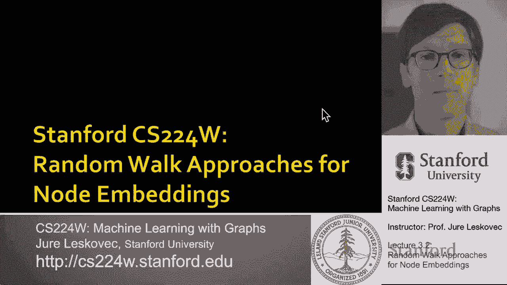
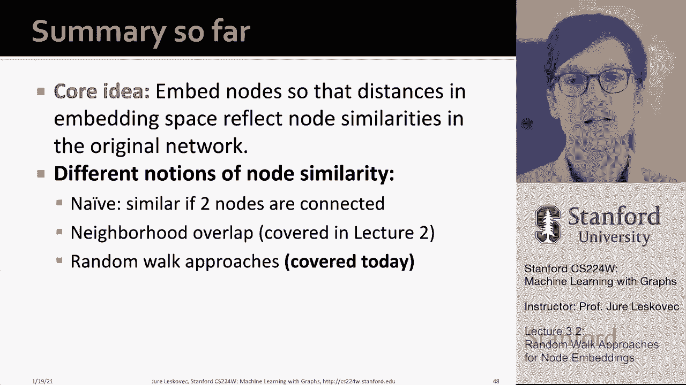

# 【双语字幕】斯坦福CS224W《图机器学习》课程(2021) by Jure Leskovec - P8：3.2 - Random Walk Approaches for Node Embeddings - 爱可可-爱生活 - BV1RZ4y1c7Co

所以我们要讨论随机游走方法，到节点嵌入，这里的想法如下。

我们将学习每个节点的向量z，这将是节点的嵌入，这就是我们的目标，我们还要定义一个概率，基本上会，uh将是给定节点有多相似的预测概率，呃呃到了某个节点，考虑到我们将使用随机游动来定义这种相似性。

这将是概率呃，从节点U开始的一次随机游动访问节点V的预测概率，然后我们还需要两个非线性函数，呃，那就会，呃习惯了，呃，先定义或产生这些概率，我将定义Softmax函数的概念，这是呃。

它返回一个由k个实值组成的向量，嗯嗯和嗯，这些值和为一，所以本质上，给定一组数字，该向量的软最大值将是这些值的概率分布，这个数字就越有可能是向量中的最大值，概率越高，呃，它会有，本质上，你可以这样想。

我拿着这个，用z和i求它们的幂，然后我把一切归一化为一，所以这个想法是，如果这个向量z中的最大值um，当我把它求幂的时候，它会比其他一切都大，所以大多数概率质量，嗯，将集中在这个值。

这就是为什么这被称为SoftMax，因为它是最大函数的一种软版本，然后我们也要定义乙状结肠的概念，它是一个S形函数，将实值转换为，呃一个范围，零比一，软最大值被定义为一比一，加e到负，呃，x um。

这是一个很好的方法如何把生活在，负无穷大到正无穷大，把它压扁，呃对呃价值呃，零一，这是两个重要的功能，呃，我会的，我们现在就用，让我定义随机游动的概念，所以随机游走只是图上面的一个过程。

我们假设从某个节点开始，然后从外面出去，呃，该节点的邻居，在这种情况下，它将是一个三和五，我们随机选择一个，然后移动到它，这是随机漫步的一步，我们在这个节点上，又是五个，我们有四种不同的方式。

我们可以回到四个，我们可以去八六七，我们随机挑选其中一个，然后搬到那里，嗯，这个过程还在继续，呃，让我们说为一个为一个，在这种情况下是固定的，呃，步数，所以你可以这样想，我们基本上模拟了这个，呃。

在这张图上随机游走，让我们说嗯，在固定的步数上，其中随机游动可以遍历同一边缘，可以多次返回，可以来来回回，呃做呃，不管随机行走，呃，想做正确的事，这个随机游走是以这种方式访问的节点序列，呃，在图表上。

穿过，呃，穿过边缘，现在我们如何定义相似性的概念，我们讨论过的这些概率，我们要做什么，就是说我们要学这个坐标z，例如两个节点u和v um的点积相似或相等，就是。

uh近似u和v co在随机游动中发生的概率，呃，在图上，所以这里是这里的想法，先右转，我们需要估计在随机游动中访问节点V的概率，开始，呃，在某个节点u上使用一些，假设随机游走策略。

我稍后会定义随机游走策略的概念，但现在我想这是一个简单的随机漫步我们选择其中一个，呃，呃，邻居均匀地随机移动，我们向它移动，然后我们要优化嵌入，呃，以这样的方式对随机游动统计信息进行编码。

基本上我们想要两个向量之间夹角的余弦，这是与概率成比例或相似的点积，U和V是在同一个地方被拜访的，呃，随机游走，那么为什么随机漫步，我们想用随机游走，因为它们很有表现力，它们很灵活。

它给了我们一个灵活的节点相似性随机定义，它结合了本地和高阶邻里关系信息，对，这个想法是，如果随机行走，呃，从节点U开始访问V um，U和V很有可能相似，嗯，他们有类似的网络邻居，他们彼此靠得很近。

它们之间可能有多条路径等等，有趣的是这在某种意义上也很有效，因为我们不需要考虑所有的节点对，训练的时候，我们只需要考虑随机游动中同时出现的对，所以监督呃，特征学习，呃将执行以下工作。

直觉是我们发现节点在d维空间中的嵌入，保持相似性，我们的想法是学习节点嵌入，使得网络中附近的节点是CLO，都紧密地嵌入在嵌入空间中，嗯，给定一个节点，问题是我们如何定义附近，我们将有这个定义，然后呃。

u的子r，其中，呃，基本上，这是n个标签，通过某种随机游走策略得到的u的邻域，或R右，所以对于给定的节点，呃你，我们需要定义什么是邻域，在我们的例子中，邻域将只是一个节点序列，嗯，呃。

从U开始的随机游走已经访问过，那么现在我们如何将其设置为一个优化问题，给定图形，呃在节点上，和一个边集，e，我们的目标是从节点学习映射，呃他们的嵌入，我们将最大化以下内容，最大似然客观权利。

我们的目标将是找到这个函数，这个映射基本上找到节点的坐标z，这样呃，所有节点的求和，给出节点的对数概率，你呃那个呃，最大化出现在其，呃，在其本地，呃，随机漫步小区，对呀，所以我们基本上想求和。

使总和最大化，这意味着我们想让节点，在相同的随机游走中被访问以嵌入，呃，紧紧地抱在一起，对呀，所以我们想学习预测节点的特征表示，其中，呃，呃，呃，出现在它的呃中的节点，随机漫步小区，呃，呃n。

就是这个意思，那么我们要怎么做呢，首先，我们将短路，从图中的每个节点u开始的固定长度随机游动，每个节点u的随机游动策略r，我们要收集你，它是从节点u多集开始的随机游动中访问的多集节点。

意味着同一节点可以在邻域中出现多次，因为它可能会被多次访问，然后我们要优化，定义一个优化问题并优化嵌入，所以呃，给定节点u，我们希望能够预测，谁是在它的邻域n中的节点，由随机游动再次定义。

所以我们要最大化，呃，呃，这个呃，这里的目标，呃，这个最大似然目标，那么我们怎么把这个写出来呢，我们可以把这个写出来，下面我们我们，我们把它写成所有开始节点的和，u对u附近的所有节点求和。

让我们称这个节点为V，然后我们想最大化对数概率，呃，预测，呃，节点v um在节点u附近，正如我所说，直觉是我们想要优化嵌入，最大限度地提高随机行走的可能性，呃，共发生um，我们要怎么做，嗯。

我们还需要定义这个，呃，概率p和我们定义它的方法是，我们将使用SoftMax函数的概念，我在几张幻灯片之前介绍过，所以这里的想法是我们想做的是，我们想最大化节点uh u和节点v之间的点积。

所以节点U是开始节点，节点V是节点的邻域随机游走邻域中的节点，呃你，我们想要最大化，我们想应用软软麦克斯，所以这是点积的指数值，邻域中节点的，除以一些指数点积，与网络中的所有其他节点对。

所以这里的想法是我们想给呃分配尽可能多的概率质量，到这个点积，嗯嗯，和所有其他的点积一样少，所以现在要写把一切都放在一起，我们可以想到的是，这是我们试图优化这个功能，它是所有节点的和。

对于在随机游动中看到的所有节点v上的每个节点和，从这个节点u开始，然后我们想嗯，呃呃，优化此软最大值的负对数概率，上面写着我想呃，最大化起始节点u和节点v之间的点积，那是在附近。

我们在所有节点上对此进行规范化，呃在网络上，所以现在嗯，你知道吗，这是什么意思，优化随机游动嵌入，这意味着找到这里使用的坐标z，使得这个似然函数是，呃最小化，问题是，我们在实践中如何做到这一点。

问题是这很贵，因为如果你看看这个，我们实际上在网络的所有节点上有两个或两个嵌套的求和，我们在这里对网络中的所有节点求和，对于随机游动的起始节点，在这里，当我们将SoftMax正常化时。

我们再次在网络的所有节点上对其进行规范化，所以这是一个双重求和，这意味着它的复杂度是v的平方，所以这将是呃，网络中节点数的平方，那是昂贵得令人望而却步的，所以让我告诉你，我们做这个，呃实际。

这里的问题是软马克斯有一个问题，我们需要对所有节点求和，基本上将其归一化为节点上的分布，所以我们能近似这个术语吗，答案是肯定的，解决这个问题的方法叫做负采样，直觉上，这个想法是。

与其在这里对所有节点求和，呃，在网络中，我们只对节点的一个子集求和，所以我们要举几个反面的例子然后把它们加起来，所以近似值的计算方式是，嗯，我们嗯，我们就可以，我们可以把这看作是嗯的近似值。

到软最大值函数，我们可以，呃，用近似的方法，呃，以下内容，呃表情，我们取u和v之间的点积的对数乙状结肠函数，这是给，呃，在这里的术语，然后我们说i的负和从1到k，这是我们的k个反例。

在呃之间的乙状结肠函数的对数，起始节点U和负um负样本，呃我，这些阴性样本，这些负节点将被随机采样，但不是均匀随机的，而是有偏见的随机的，所以这里的想法是，与其正常化，关于网络中的所有节点。

我们将针对k个随机负样本或负节点对SoftMax进行归一化，呃，从网络，这些阴性样本会被仔细挑选，那么我们如何选择阴性样本，我们采样k个负节点，每一个都有与其程度成正比的概率。

所以这意味着度数较高的节点，更有可能被选为阴性样本，嗯，在实践中选择K有两个考虑因素，这意味着阴性样本的数量，更高的k值会给我更稳健的估计，但较高的k值也对应于，到更多，呃，到更多，再次采样。

对负面事件有更高的偏见，所以人们在实践中倾向于选择K在5到20之间，如果你仔细想想，这是一个很小的数字，如果你认为一个由一百万节点或十万个节点组成的网络，而不是求和超过10万个节点，呃。

每次在这里你都只是在总结，在这种情况下，你知道五到二十个节点，这样你的方法和你的估计就会很远，呃很多很多，呃有效率，那么现在我们如何解决这个优化问题，我就不说得太详细了，但这些事情今天用，呃。

随机梯度下降，我只想给你们一个随机梯度下降的快速介绍，呃，两张幻灯片，有很棒的讲座，呃，很多很好的教程，什么是随机梯度下降，它是如何工作的，以及对它的所有理论分析，但本质上这个想法是正确的。

如果你有一个平滑的功能，然后你可以通过梯度下降来优化它，通过基本上计算给定点的梯度，然后移动嗯，呃为了呃，作为一小步，在梯度相反的方向上，对呀，所以这是，这就是这里的想法，对呀，你从某个随机的点开始。

在我们的例子中，我们可以初始化节点的嵌入，用随机数，然后我们迭代直到收敛，我们计算似然函数的导数，关于单个节点的嵌入，现在我们求梯度导数的方向，然后我们向梯度的相反方向迈一步，在那里嗯，这是学习率。

这意味着我们迈出了多大的一步，我们甚至可以在前进的过程中调整舞步等等，但本质上这就是梯度下降，在随机梯度下降中，我们以随机的方式近似梯度，所以不是在所有的例子中计算梯度，我们就这么做，嗯，呃结束，呃。

一小批例子或一个单独的例子，那么它的意思是，而不是嗯，呃，评估呃，所有节点上的渐变，所有的负节点，和或给定节点附近的所有邻居，然后做一个做一个步骤，我们要做这个，只为一个，呃，对于邻域中给定节点的给定。

所以基本上的想法是，你知道我们将对节点I进行采样，然后对于所有在呃中的JS，在附近，我们要计算梯度，呃，然后做一个步骤，继续迭代这个，我们当然会得到一个随机估计，对梯度的随机估计。

但我们将能够更快地更新，实际上，要多，呃好多了，所以让我总结一下，我们将从图上的每个节点开始，运行一个短的固定长度的随机游动，对于每个节点u，我们要收集它的邻居。

作为从节点U开始的随机游动中访问的多组节点，然后我们要优化这个嵌入，利用随机梯度下降，也就是说，呃，我们要去，呃，呃，求最大化的坐标Z，呃，这个特殊的表达，我们将有效地近似这个表达式，呃，采用负采样。

在那里我们采样负节点，呃，概率与其程度成正比，在实践中，我们取样了大约五到二十个负面例子，呃为了呃，对于每一步的每个节点，现在我想说的问题是，你知道的，我们应该怎么做这个随机漫步到目前为止。

我只描述了如何优化嵌入，呃对于给定的随机漫步，嗯，嗯，我们谈到了这个统一的随机漫步，基本上我们运行固定长度，从每个节点开始的无偏随机游动，然后呃，这里的想法是嗯，有一个问题，呃类型的相似性。

因为在许多情况下，它可能太受限制了，所以问题是我们能用更丰富的，um随机游动，我们能不能把罐头，我们让随机漫步更有表现力，这样我们就可以调整这些嵌入，呃更多，这就是一个叫做节点到后面的方法的想法。

其中的想法是，我们希望再次嵌入具有相似网络邻域的节点，呃，在特写空间里很近，我们要再次框定目标，就像呃，最大似然优化问题，呃，与下游预测任务无关，这里的关键观察是，我们对网络邻居有一个灵活的概念，嗯。

这导致了更富有，呃，节点嵌入，这个简单随机游走的延伸，我们将开发一个二阶随机游动r来生成，生成网络邻域，呃n，然后我们将应用同样的优化问题，所以深度行走和节点行动的唯一区别是，相邻节点集，定义了um。

以及随机游动是如何定义的，所以这个想法是用灵活的，嗯，有偏见的随机游动，可以在本地和全局视图之间进行权衡，呃，在网络中，我所说的本地和全球是什么意思，当你在做随机漫步的时候，你可以想到，呃，比如说。

深度优先搜索作为探索尽可能多的网络的一种方式，给定从节点U开始的步骤的给定预算，但如果你真的想很好地理解，节点U周围的网络看起来如何，那么也许你会想在广度优先搜索中更多地探索网络，呃时尚，所以这真的是。

这将允许我们做什么，它将允许我们权衡，或者在广度优先搜索之间进行外推，嗯和深度优先搜索，嗯型嗯网络探索，对嗯，呃，就像我说的对，就像嗯，在探索网络邻域的策略方面，嗯，并定义概念，呃的，呃不呃。

从给定的起始节点，u，你可以想象你想在当地探索，并将为您提供一个非常本地的网络视图，这将是这种广度的第一次搜索探索，或者你想先做一个深度搜索，在那里你想有这种网络的全局宏观视图，因为你捕捉到更长更大的。

呃距离右，这本质上是节点背后的直觉，你可以，你可以用不同的方式探索网络，你会得到更好的分辨率，呃，你知道的，在更微观的视野中，呃，微观视图，呃，网络的，那么我们现在如何在实践中做到这一点。

我们如何定义这个随机漫步，我们要做有偏的固定长度随机游动，使得给定的节点u生成它的邻域，呃不，你中的，我们将有两个超参数，我们将有返回参数p，这将说明随机步行化妆的可能性有多大，回溯到上一个节点。

然后我们将有另一个参数，我们要调用in-out参数，它将允许我们在向外移动和向外移动之间进行权衡，先做广度搜索而不是停留在内部，保持靠近起始节点，以这种方式模仿呃，广度优先搜索，直觉上。

我们可以把q看作是广度优先和深度优先之间的比率，呃，网络的探索让这更多一点，呃，精确，这被称为二阶随机游动，因为它记得它来自哪里，然后想象，比如说，在这种情况下在这种情况下。

随机游动只是从节点1到节点W，现在在W随机游走需要决定做什么，你知道它需要选择一个节点，实际上助行器可以做三件事，它可以回到它来的地方，它可以保持在相同的距离，嗯嗯，从呃，从它来的地方像以前一样。

所以你知道它是一跳w是从s一跳一跳，所以是两个，也是从S一跳，所以这意味着你和S 1保持同样的距离，或者你可以航行得更远，意思是导航到某人，与前一个节点距离2的人是对的。

因为我们知道随机行者是从哪里来的，随机行者需要决定回去，保持在同一轨道同一水平，或者更进一步，我们要参数化的方法是使用参数p和q，所以如果我们从非规范化概率的角度来考虑，那么我们可以认为保持同样的距离。

我们用概率与某个常数成正比，我们返回的概率是1/p1，然后我们以1/q 1的概率移动得更远，2比1除以1，就在这里，p是返回参数，Q是走开，那么我们现在要怎么做呢，在实践中本质上是作为随机行者。

假设它从s 1到w，现在它需要决定去哪里，我们将有一个非归一化的跃迁概率分布，要导航到W的哪个邻居，我们将把它归一化为1，然后抛一个有偏见的硬币，它将导航，它将从这四个可能的选项中选择一个，对呀，呃。

返回，停留在相同的距离或航行得更远，呃，比如说，如果我设置p的低值，那么这个第一学期会很高，如果我们想在更远的地方导航，随机行走很可能会回来，我们设置Q的低值，这意味着S 3和S 4会得到很多。

概率质量，嗯，那是呃，基本上就是这个意思，然后再一次，集合n将由这种有偏随机游动访问的节点定义，这是在更远的地方探索和更近的地方探索之间的权衡，呃，到开始节点，It’在这种情况下是一个，所以那是嗯。

那就是，就是这个想法，嗯，那么算法是如何工作的，我们要计算随机游走概率，首先，然后我们将模拟固定长度的有偏随机游动，l从每个节点u开始，然后我们要优化目标函数，同样的负采样目标函数。

我已经在深度行走中讨论过了，利用随机梯度下降，这其中的美妙之处在于在优化过程中有线性的时间复杂性，因为对于每个节点，我们都有一组固定的随机游动，所以它是线性的，呃在图表的大小上。

所有这些不同的三个步骤也是可并行的，这样你就可以，你可以运行它们，呃平行，这种节点嵌入方法的缺点是，呃，我们需要学习一个单独的，呃嵌入，呃对于每个节点，呃单独，所以有了更大的网络，我们需要学习更大。

呃嵌入或更多嵌入，嗯，当然有很多工作要做，嗯，在这些之后，呃，这些呃，初始额，提出建议的文件，这些想法，有不同的种类，人们提议的随机散步，有替代的优化方案。

还有不同的网络预处理技术允许我们定义不同的概念，相似度，这里有一些我链接的论文，嗯，你知道的，如果你有兴趣，很想了解更多，嗯，拜托了，呃，请读一读，这将是一本非常好的书。

所以让我总结一下我们到目前为止所学到的，所以核心思想是嵌入节点，因此，嵌入空间中的距离反映了原始网络中节点的相似性，嗯，我们谈到了节点相似性的两个不同概念，第一个是天真的相似性，哪里呃，如果两个节点。

我们可以，比如说，做连接，做笔记，呃，靠得很近，如果它们只是由一条边连接，我们可以，呃，做呃，邻域相似性，今天我们讨论了随机步行方法，呃，到节点相似性，我们说过，从起始节点随机遍历访问的所有节点。

那些是呃，和它差不多，所以那是呃。

本质上是这个想法，呃，为了呃，为了今天，所以嗯，现在，当然问题是你应该用哪种方法，嗯，没有一种方法在所有情况下都赢，例如，节点到后在节点分类上表现更好，当，比如说，链接预测，一些替代方法可能性能更好。

呃，有一个很好的调查，嗯嗯，三年前戈亚尔和费拉拉，呃，调查了其中的许多方法，并在许多不同的任务上对它们进行了比较，嗯和嗯，一般来说，你知道的，随机漫步的方法，相当高效，因为你可以模拟有限数量的随机行走。

它们不一定能扩展到超级大的网络，但它们可以缩放到，让我们说，中型网络，嗯和嗯，一般权利，必须选择最匹配的节点相似性定义，呃。

