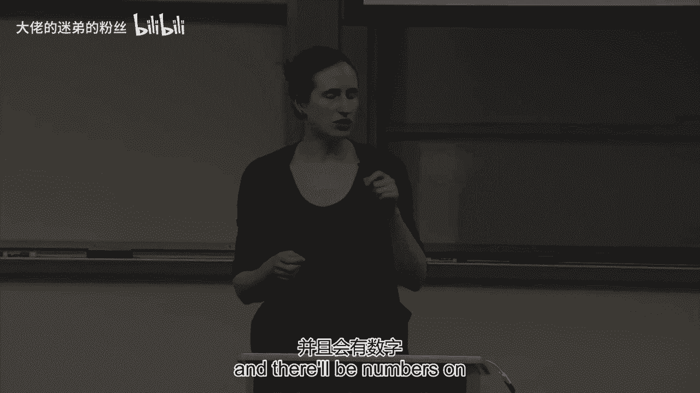
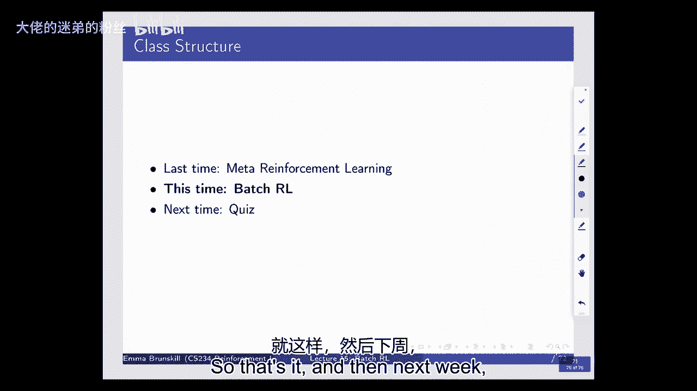

# P14：Lecture 15 - Batch Reinforcement Learning - 大佬的迷弟的粉丝 - BV1Cc411h7QQ

部分，然后是一组部分，你会被提前分配小组，嗯，你所在房间的椅子上会有号码。

这样你就知道该去哪里坐，它的工作方式是，你先做个人部分，你会把它上交的，然后你会接受另一个小组部分的考试，我进去讨论你的答案，就他们达成一致，然后把它刮下来看看你是否做对了，然后当你做完。

你会把它作为你的第一组上交，只是后勤问题，所以又分到两个房间，稍后公布，是呀，大问题，嗯，问我们是否要分开两个房间，是呀，我们又要这么做了，这将是你的任务，嗯，我想很可能和上次一样。

但我会确认我们可能会让它稍微不同，因为一些SCPD学生将加入我们，为了这个以前没有的，反之亦然，所以有可能，尤其是如果你正处于边缘，我们会，这次你们会在不同的房间，所以我们会宣布，嗯，只是提醒一下。

现在我们基本上完成了所有的作业，所以这是一个很好的机会来专注于项目，嗯，你应该得到关于所有这些的反馈，连同，嗯，关于您的项目的一点点信息，评分的人会在上面签名，所以这是一个很好的TA去问问题。

在办公时间或广场上，但你可以去任何办公时间，询问项目问题，海报会议将在，最初宣布的时间，这是次优的，但你能做什么，我们会在期末考试最后一天的早上，这就是我们被分配的，还有人对此有什么问题吗？

谁参加了周一切尔西的谈话，好的，她这样做是为了那些没有看到它的人，切尔西的谈话将在网上进行，这是一个关于元强化学习的很好的谈话，下周的测验将涉及到这一点，但很轻，嗯，因为你还没有接触过这个想法。

所以又一次，作为小测验的回顾，测验将涵盖课程中的一切，但你没有机会真正思考的事情，因为你没有在作业中得到练习，呃，我们会更轻描淡写地测试，它也将是多项选择，我强烈建议你参加去年的测验。

忽略任何我们没有讨论过的话题，嗯，不看答案就这么做，教育研究的一个强有力的发现是，强制回忆在帮助人们学习方面非常有效，强制召回是一种很好的测试方式，所以嗯，这当然是，在你没有被它评估的情况下。

所以你可以用它来检查你是否理解这些事情，看任何东西，我们查找任何你可能有问题的东西，任何其他问题，所有的权利，所以让我们开始吧，嗯，我们今天要讲的是批处理强化学习，特别是安全批处理强化学习。

我来定义一下，嗯，2。我认为这是一个非常重要的话题，我们在我自己的实验室里做了很多工作，我今天要关注的大部分话题都是工作，这是由我的博士后菲尔·托马斯完成的一项工作。

他现在是马萨诸塞阿姆赫斯特大学的教授，但他在和我一起工作之前所做的工作以及我们的一些共同工作，我也会强调一些其他相关的工作，所以让我们想想一个简单的案例，让我们考虑做一个科学实验，你有一群人。

我们称之为A组，他们首先要做这种特殊类型的分数问题，这是我们的一个辅导系统的分数问题，人们要把分数加在一起，然后将总和减少到最低条件，然后他们必须做一些事情，他们做交叉乘法，嗯，然后他们要考试。

他们的平均得分为95分，然后我们有B组做同样的活动，但顺序相反，然后他们的平均得分为92分，问题是给一个新生的，我们该怎么办，你可能想知道什么额外的信息，为了能够回答这个问题，所以尽管大声说出来。

那么你需要做什么，就像现在一个新学生来了，让我们想象一下我们的目标是这次考试得高分，那个学生在这次考试中得了高分，那么你会给那个新生什么样的活动顺序，为了最大限度地提高他们在这次考试中获得高分的可能性。

希望表明他们已经学会了材料，你知道我们有多大吗，一个很好的问题是说这个群体有多大，A和B有多大，你可能想知道这一点有很多原因，比如说，如果A组中的人数是1，B组的人数是两个。

也许这些只是这些区别之间的统计噪声，你还想知道什么轴承，所以我建议你可能想知道方差，那是另一回事，你可能想知道这只是意味着，那么方差是多少，你还想知道什么信息，媒体和，是啊，是啊。

所以其他形式的统计数据，你知道分布，我也在想一些事情，更多嗯，在不同的方向，是啊，是啊，群里的人，所以不管是团体还是高中，团体是或喜欢较低的费率，或者类似的东西所以也许A组是幼儿园的孩子，可能B组就是。

嗯，你知道吗，高中生，我们都在倒退，所以是的，那么这些组里有谁，除此之外，你经常想知道谁是新生，新生和幼儿园或高中生也是如此，好的，所以你真的有很多额外的信息想知道，为了能够准确地回答这个问题。

它涉及到很多不同的挑战，这里的挑战之一是，嗯，B组不同于A组，然后我们有一个基本的问题，即审查数据，你不知道在A组会发生什么，如果他们在B组有相同的SEOR，如果他们的干预顺序与A组相同。

所以这是一个基本的挑战，你永远不会知道会是什么样子，如果你现在在哈佛，还有这个，你只能观察所采取的行动的结果，我们已经看到很多强化学习，在这种情况下也是如此，我们有关于决策序列的旧数据。

所以它需要这种反事实的推理，它涉及的另一件事是概括，所以这里有一个简单的例子，你可以把它看作是两个动作，两个不同问题中的每一个，两个不同问题中的每一个，你可以把这看作是奖励，这是一个延迟的奖励。

也许你的奖励是零，零奖励，然后是考试成绩的奖励，所以这里只有两个动作，谁知道状态空间有多大，这取决于我们想如何树立学生的榜样，嗯，但我们不想组合地考虑，所有不同的行动顺序，嗯。

即使我们写下了一个决策策略，可能会开始非常大，很快，所以我们需要能够做某种形式的推广，跨州或跨行动或两者兼而有之，这样我们就不必进行组合数量的实验，找出什么对学生学习最有效，所以我们今天要讨论这个问题。

我们也可以认为是离线的，所以这必须离线，批RL，这通常是不在政策范围内的，现在我们以前看到过很多非政策学习，Q学习是一种非策略算法，嗯，但我想在这里区分一下，我们将主要关注的是。

今天是有人已经收集了数据的情况，所以我们已经有了一组先前的数据，然后我们会想用它来做出更好的决定，前进，现在这个问题不仅仅出现在我刚才提到的情况下，但在大量不同的领域，你可以争辩说。

像经济学和统计学这样的领域，流行病学一直在问这样的问题，嗯，它出现在维护之类的事情上，你知道吗，你想做什么样的动作顺序，确保你的机器或汽车运行时间最长，嗯，它出现在医疗保健中。

比如我们应该给病人什么样的活动顺序，以便最大限度地取得成果，它们的质量调整寿命年，在许多情况下，它将依赖于状态，因为对病人A最有效的，将不同于对病人B最有效的方法，现在最大的挑战之一是。

当我们考虑到很多情况时，我们有这些旧数据，这将是高风险的，情景，这意味着不管是因为我们有很贵的，你知道的，我们不想出错的核电设备，或者我们在治疗人们，你知道的，真正重要的疾病。

那么我们想确保我们在未来做出正确的决定，所以我们可能有也可能没有很多数据，但是我们所拥有的数据是宝贵的，我们想从中做出尽可能好的决定，所以这意味着，我们需要对它的工作效果有某种形式的信心，前进。

所以我们真的希望对它的性能有一些上下限，在我们部署它之前，总的来说，我们只想要好的方法来估计，如果我们做这个反事实的推理，如果我们想想人们有多好，或者你知道健康的人可能会，如果我们用不同的方式对待他们。

嗯，在我们说服医生使用这个之前我们能有多大的信心，所以我今天要讲的是，这个一般性的问题，我们怎么做批处理，安全加固，学习安全可能意味着很多不同的事情，嗯，当我今天谈论安全的时候，我大部分时间都在想这个。

就这种信心而言，这种说的能力，嗯，在我们部署一些东西之前，我们知道它有多好，嗯，现在有不同形式的安全，有像安全探索这样的事情，确保你不在网上犯错误，有风险敏感性，想着这个事实，嗯。

我们每个人只会经历一个结果，不是期望，嗯，所以我们可能要考虑完整的分布而不是平均，但我们今天要讨论的主要还是考虑预期的结果，但想着对预期的结果充满信心，所以总的来说我们希望能够非常自信地说。

我们将为病人部署的新决策政策，或用于核电站，或者对于其他高风险的场景，我们觉得这样比较好，我们认为这比我们目前所做的要好，你为什么想要这个，你可能想保证单调的改进，尤其是在这些高风险领域。

这是我们本季度早些时候看到的，所以让我们简单地谈谈一些符号，其中一些会很熟悉，我只想确定我们同意，然后我会讲一些不同的步骤，我们可能会考虑尝试创建批处理，UM安全强化学习算法。

所以我们通常用圆周率来表示策略，我们将用t或h来表示轨迹，我经常用大D来表示我们可以访问的数据，这就像电子病历系统，或，你知道的，发电厂资料，等，对于这个词的大部分，我假设我们知道行为政策是什么。

所以我们知道状态到动作的映射是什么，也可能是用来收集数据的行为的历史，你能给我举个例子吗，如果这可能不合理，我们可能不知道的行为，政策，那你对人类就得那么多，对于人类来说，你不知道他们是否都在很多。

许多数据来自人类的情况，我们将不知道圆周率是什么，所以当我们查看医疗健康数据时，我们通常不知道圆周率是什么，所以你知道，如果这是医生产生的，我们通常不知道圆周率会是什么，显然有指导。

但我们通常无法获得人们使用的确切策略，如果我们做到了，他们可能不会把它说成，你知道一个随机过程，就像有人带着概率5走进他们的办公室，他们会用这个来治疗他们，而不是第五点，他们可能用确定性的术语来看待它。

他们可能不会想到这些，如果规则，所以有很多情况下我们没有，我们最近在这方面做了一些工作，其他人也有，我可能会在最后简单地谈一下，但在今天的大部分时间里，我们将假设我们可以访问这个，所以这可以举一个例子。

假设我们有圆周率B是合理的，呃，对呀，如果你的诊断是基于，很像一套指导方针什么的，是啊，是啊，所以在某些情况下，你知道如果有某种类似的东西，有时你有一个算法来做出决定，或者你知道一套明确的指导方针。

你会看到相似的还是不同的，有点不同，所以如果你有一个有维护记录的发电厂，就像一个既定的维护计划，这些记录与你基本上拥有的计划相匹配，这是正确的，是啊，是啊，所以在这些情况下，你有这些固定的协议。

我经常想到的另一个例子是，如果你去很多不同的，比如你怎么知道谷歌提供广告，我们很清楚它是如何提供广告的，必须全部记录下来，有一个，有一个算法在做出决定，所以在许多情况下，我们可以访问用于生成算法的代码。

自动生成决策，在这种情况下，只要我们保存了它，我们就可以查阅它，所以说，和往常一样，我们的目标是思考如何让我们变得好，好政策出台，好政策有好价值，当我们考虑在这种环境下进行安全的批处理强化学习时。

我们将考虑如何将旧数据，所以我们要把我们的数据作为输入，并把它推入某个黑匣子，拿出一项我们认为好的政策，所以我们要有一些算法或转换，也就是，而不是与现实世界互动，做出决定和选择数据。

它将只接收这些固定的数据并输出一个策略，我们想要的一件事是，如果我们将数据输入我们的算法，我们的算法可能是随机的，那么它输出的策略的值，所以我们可以思考A和D，所以现在，这是我们的算法。

它会输出一些策略，可能是一个确定性函数，这可能是一个随机函数，它输出的任何政策，我们希望它是好的，理想情况下至少和行为策略一样好，这就是第一个方程所说的，它说的是我们的算法输出的任何策略的值。

当我们输入一些数据集时，我们希望它和生成数据集的行为策略一样好，不管那个价值是什么，所以这就是保单的价值，用于生成数据，现在我们通常不会，我们通常不直接给出。

但谁能给我举一个例子说明我们如何了解给定一个数据集，是根据该保单期间的保单生成的，使用该策略，就像动态编程或其他什么，在这个小集合上，近似，是啊，是啊，所以我想我们要说的是你知道你可以利用这些数据。

我不知道你能不能做动态编程，因为你不一定能接触到过渡和奖励模型，但你可以做蒙特卡洛估计，你可以平均奖励，嗯，让我们假设在数据集中您可以看到状态，行动和奖励，所以你当然可以平均一下，你知道。

在所有的轨迹上都是平均的，这样我们就可以得到一个估计，我们可以估计，通过看，让我们把它想象成一个史诗般的插曲问题，所以你可以看总和等于一，该轨迹返回的两个轨迹数，这是一个回报。

本质上只是做了一个蒙特卡洛估计，因为您知道这些数据是根据策略生成的，你可以平均一下，所以这将给我们一个估计vπb的方法，但是我们需要一些方法来估计算法输出d的v，这意味着我们要做一些政策以外的事情。

因为一般来说，我们将希望找到比PI B更好的政策，这意味着他们必须做出一些不同的决定，我在这里强调一下，你知道的，有时您可能不仅仅想要比现有的行为策略更好，但你可能需要经常做得更好。

如果我们在考虑真正的生产系统，它需要时间、金钱和精力，每当我们想改变协议时，如果你想让医生改变他们做决定的方式，你想改变发电厂的事情，经常有头顶，如此频繁，你可能不只是需要比现有的艺术状态更好。

你需要明显更好，所以我们所说的相同类型的想法，相对于当前性能的排序，你总是可以在上面加上一个增量，所以因为他们至少要好得多，又是这样，总结一下这个方程，说，上面写着，我想有这样的情况，即政策的输出。

当我插入我的数据集时，我希望这很有可能比我现有的政策更好，所以这里是三角洲，你知道的，将是零到一之间的东西，所以现在让我们谈谈我们如何做到这一点，嗯，我先从政策评估开始，所以在这种情况下的想法，嗯。

好吧，首先，我将简要地介绍一下这三个方面，嗯，然后我们会慢慢地穿过它们，所以就东西而言，这三件事，我们可能想做安全批处理强化学习，每一个都有很大的差异，这取决于我们正在考虑的设置。

我们需要能够做这个非策略批量策略评估，我们需要能够把我们的旧数据，然后用它来估计替代政策会有多好，我们可能想对这有多好有信心，所以这可以让我们得到一些估计，v，a，of，d，or，v，pi，e，e，e。

常用来表示评价政策，我们要评估的政策，所以第一件事就是做政策政策评估，第二件事是，我们如何知道这个估计有多好，所以这是一个估计，可能真的很好，可能会很糟糕，所以你可能需要对这个估计有一些不确定性。

这样我们就可以量化它的好坏，最后我们可能希望能够像你知道的那样，可能策略的ARG最大值，所以你可能想做一些像Arc Max这样的事情，所以总的来说，你不会，只是想能够评估替代政策会有多好。

你会想出一个好的策略在未来部署，这将需要我们进行优化，因为我们通常还不知道好政策是什么，所以通常，我们最终将评估许多不同的政策，所以我们可以把它看作是第一部分，我们要把我们的历史数据，接受建议的政策。

把它插入到一些我们还没有讨论过的算法中，并得出保单价值的估计，我们将讨论如何用它进行重要的采样，然后在那之后，我们将进行高信心政策评估和安全政策改进，获得置信度界限，我们要看看停止，我们以前见过停顿。

嗯，我是我们看到的东西，当我们开始谈论探索的时候，所以当我们看到高自信，当我回想起来，我回想起探索，所以在探索中，我们经常试图量化我们有多不确定，关于策略或其模型的价值，为了乐观，它能有多好。

并利用它来推动探索，但我们也可以计算置信限，即下限，事情会有多好，这在这里会很有用，当我们试图在部署政策之前弄清楚它们有多好时，我们将为之欢呼，然后最终我们将能够想做的事情，比如安全策略的改进。

你能回答这个问题吗，如果有人给你一些数据，他们说嘿，你能给我一个更好的政策吗，一个算法能不能给出一个更好的策略，它实际上更好，就像你去部署它的概率很高，或者算法也能知道它的局限性，说不，就像没有。

我没有办法给你一个更好的保单，所以我觉得有一个，意识到自己局限性的算法，我们现在正在我的实验室里做相当多的工作，所以当使用这些的人，特别是对于循环系统中的人，他们可以理解算法是否在发出垃圾。

所以在这种情况下，我们的想法是，有时如果你的数据很少，你不能以自信的方式进行改进，所以对于那个例子，我之前向你们展示过我们有两种不同的教学方式，你认识的一个人很好地说了每个里面有多少人。

如果只有一个人尝试过这两种方法中的任何一种，有人说，你能明确地告诉我什么对学生更好吗，在未来，你应该说不，因为只有一个数据点，好像没有办法，我们会有足够的数据，你知道的，每组中的一个数据点。

以便在未来能够自信地看到，我们应该如何教学生，所以我认为安全政策的改进需要我们能够说，当我们有信心部署比未来更好的政策时，或者当我们不能的时候，所以我们要看看管道，如何回答这种问题，所有的权利。

所以让我们先回头想想政策，政策评价，所以这样做的目的是得到一个无偏见的偏离政策的估计，所以我们想要一个真正的，你知道的，对嗯的一个很好的估计，替代决策政策会有多好，所以我们现在有数据，它是取样的，嗯。

在某些政策下，我们称之为行为策略π2，所以我们有这样的数据集，这是D，它给了我们这些轨迹的样本，然后我们想用它们来评估替代政策有多好，虽然我们可以通过Q学习来做到这一点。

我们想用一种不同的方法来做这件事，这将使我们获得更好的置信区间，它将是一个无偏估计器，所以在Q学习中，如果我们回想一下Q学习在做什么，你知道，Q学习不在政策范围内，我们不能用Q学习来做到这一点。

Q学习不在政策范围内，它取样，它引导，因为它采样和引导，它可能会有偏见，所以我们现在要做一件不同的事情，这仍然允许我们离开政策，但在某种程度上，我们没有偏见，我们的估计值可能不会系统地高于或低于。

尤其是因为现在我们总是有有限的数据，我们永远不会处于渐近状态，我们有大量的数据，我们可以假设这又消失了，让我们想想回报，GT是返回，只是我们在保单下得到了多少奖励，你知道在有限的步骤上。

就像一集或整个时间，我们的政策只是政策的价值，同样，这只是预期的折扣奖励，好的一点是，如果圆周率是随机的，你正在使用的数据，你从你的行为政策中收集的，然后你可以用它来做关闭策略评估。

这对Q学习也是必不可少的，其中一件好事是，因为我们遵循的是蒙特卡洛类型的框架，你不需要模特，也不需要成为马尔科夫，所以这真的很好，因为我们最终会得到一个无偏的估计器，它不依赖于马尔可夫假设。

在许多情况下，马尔可夫假设是不成立的，尤其是当我们开始考虑病人的数据时，或其他案件，我们只是有一组恰好记录在我们数据集中的特征，谁知道这个系统是不是马尔可夫的，我们在我们的一些项目中确实看到了它不是。

在其中一些情况下，如果你假设世界是马尔可夫的，你真坏，估计你知道得有多好，另一种教学生的方式可能会做什么，那么为什么这是一个难题呢，嗯，这是因为我们有一个分布不匹配，好的，所以如果我们看看，嗯。

想象一下我们只是有一个两个状态的过程，我们认为，你知道的，有点像这个是S，这个是或像那样，我们可以说这是你下一个状态质数的概率，我把它弄得很光滑，我们可以把它想象成这里的高斯，这是在圆周率行为下。

在PI评估下，它可能看起来不一样，与此相对的是，回报的分配，你将获得国家行动奖励的序列，下一个状态下一个动作，下一个奖励，所以这种轨迹，在不同的政策下，轨迹的分布会有所不同，所以说。

这里的毛巾不会看起来像分布，这说明了这两种政策的价值是什么，那么到底是什么，那么这是正确的，如果嗯我，如果在这两个策略下得到的状态和操作的分布是相同的，那么值是相同的，我们在模仿学习中也看到了这个想法。

当我们要做某种状态动作或状态特征匹配时，在这种情况下，我们谈论的不仅仅是状态和行动，我们说的是全分布，因为我们的全部轨迹，因为我们不是在做加价假设，但想法完全一样。

我们定义这个值的唯一方法基本上是轨迹的概率，它的价值，或，你知道的，那个轨迹中的奖励之和，所以如果分布相同，那么值是相同的，我们不在乎政策是否不同，因为我们已经知道如何估计价值。

所以这里的关键问题是它们看起来不一样，这意味着你会在不同的政策下做不同的事情，所以就像你现在知道的，也许你经常去参观国家空间的这一部分，抱歉，打扰一下，而这部分很少，现在你将有一个替代政策。

它只是很少去这里，经常去那里，抱歉，打扰一下，但这样想，让我们知道如何查看那里现有的数据，让它看起来更像那样，有人知道我们该怎么做吗，所以如果有人给你一堆轨迹，你怎么能改变他们。

所以它们看起来像你关心的分布，所以我们可以在这里进行重要的采样，好吧那么，所以让我们回顾和刷新重要的采样，所以这个想法是，对于任何分布，我们可以重新称重以获得无偏见的样本，所以让我们想象一下。

我们有从我们想要的地方生成的数据，从某个分布生成的数据q，我们想估计x的f，所以我们想要在x的概率分布q下得到x的f，所以我们可以用同样的东西乘除，所以合并另一个发行版。

它只是在x乘以q的x f的x dx上的不同分布，所以我们可以把它重写为等于x上的积分，x乘以这个量的概率，也就是x的q除以x的p乘以x的f，让我们想象一下，我们实际上有来自x的p的数据。

所以我们想要x的q的数据，但是我们有来自x的p的数据，所以我们可以用1/n和/i q来近似，我记得几年前我第一次知道这件事的时候，我认为这是一个非常可爱的洞察力，只是想说我们要重新加权我们的数据。

所以我们将关注来自，你知道，我们会在我们关心的分布下取样，我们要给它们称重，所以他们看起来有同样的概率，他们会在，x的q，在我们的情况下，根据我们想要的政策，好的。

所以重要的采样对这个匹配的任何分布都有效，如果您有来自一个发行版的数据，你希望你从别人那里得到它，嗯，你知道这可能会出现在物理学中，你经常有非常罕见的事件，就像希格斯玻色子。

在这些情况下你可能会有不同的场景你可以重新称重，这样你就可以得到真实期望的估计，好的，这只适用于泛型发行版，让我们提醒自己这是如何工作的，用于强化学习设置，所以我们又要有我们的插曲了，我们可以叫他们。

我们可以叫他们tau，这是一个状态序列，行动，和奖励，然后如果我们想做重要的取样或者让我把这个写出来，所以在这种情况下，我们想要得到类似于HJ的p在r下的东西，那么会得到什么呢。

这将是我们初始状态的概率，让我们假设那是相同的，不管你在什么政策下，然后我们就有可能采取特定的行动，考虑到我们处于那种状态，我们进入下一个状态的概率，我们看到的奖励的概率，我们可以求和J等于1。

直到n减去1或lj减去1，所以我们只是反复看看，我们选择了行动，这就是我们对历史的概率，然后如果我们想这样做是为了重要的采样，所以我们想要的是我们想要这个历史的概率，嗯，我们需要能够计算。

x的q除以x的p的比值，对我们来说，这将是历史j或评估政策下的概率，除以历史j下的概率，行为策略，所以我们想这么做，我们希望一切都会取消，因为我们无法获得奖励模型的动力学模型，所以说，幸运的是。

就像我们在一些政策梯度工作中看到的，如果我们有hj除以πb的概率，我们将再次得到初始状态分布，在两种情况下都是一样的，然后我们有这样的概率比率，概率aj除以s j，这是在圆周率下，给定πb的s j。

j除以m的概率，然后过渡模型，和奖励模式，好的，所以这很好，因为这个取消了，这个取消了，因为世界的动态决定了下一个状态，世界的动态决定了这里的奖励和关注，只是为了让这里不那么长，我做了一个马尔可夫假设。

所以这是马尔科夫版本，但如果你可以，你可以以完整的历史为条件，所以这个技巧不需要我们不需要系统是马尔可夫的，因为无论你的动力是依赖于完整的历史还是直接的最后一步，他们在行为政策和动态方面都是一样的。

和评价政策，你可以取消这些，奖励模式也一样，所以这种洞察力不需要马尔科夫式的假设，这意味着我们最终得到的是，嗯，我们根据评估政策选择行动的方式，除以方式的比值，我们会根据行为策略选择行动，在这里。

我们假设相同的轨迹是由两种不同的策略产生的，大问题，是呀，我们假设相同的轨迹是由两种不同的政策产生的，是呀，所以我们说对于这个轨迹，在行为策略和评估策略下，你看到这种情况的概率是多少，因此。

如果在评价政策下更有可能，我们想等待这个轨迹得到的任何回报，如果在评估政策下不太可能，我们想减轻它的重量，所以直觉是我们有一堆轨迹，以及他们的奖励总额，所以我们有这些H，你知道吗，h一个逗号，g一双。

所以我们有这样的轨迹，奖励总额，如果我们有同样的行为政策评估政策，以便了解评价政策有多好，我们只是把所有的G平均一下，但他们是不同的，所以我们想做的是，我们想说的是，在你们的评估政策下，H更有可能。

等待那些在你的评估政策下不太可能的MH，体重下降，所以当你做这些g求值时，你会得到一个真实的期望，g加权，这有道理吗，如果我对那部分有什么问题，所以到目前为止，这只是告诉我们如何重新加权我们的数据。

它允许我们得到一个看起来更像，在我们的评估政策下，我们将得到的轨迹分布，只是为了澄清最后，呃，最后一排，我们有分母，行为策略，是呀，我们得到了一个经验上很好的问题，你知道，行为策略从何而来，基本上就像。

就像，这些概率是什么，问题是，所以我想这取决于，所以在这种情况下，如果你是--如果它是一种用于生成数据的机器学习算法，你只知道就像，你只要查一下你的算法，看看概率分布是多少，今天我们将假设这是已知的。

它是完美的，那显然不是真的，当我们在这些情况下进入人们的数据时，嗯，你可以做一些不同的事情，一个是，您可以构建对错误具有鲁棒性的估计器，所以你可以用其他方法来尝试加倍健壮，如果那个估计量是错的。

另一个是你可以把经验分布，实际上最近有一些很酷的工作，我想是彼得·斯通在奥斯汀的实验室里的，表明有时你使用经验估计比，即使你知道真实的估计，就结果估计器而言，这有点酷，好的。

所以这只是在法律技术上写出来的，而不是重新手写，所以这只是写出了历史的概率，现在我们可以看到我放在这里的方程，所以嗯，您知道要评估的策略的价值，将是历史时间的比例，那段历史的回归，我们在这里说的是。

这是，你知道1/n就是这只是采取每一个动作的概率，我就用圆周率符号来写，这是圆周率，i等于你的轨迹长度除以a i的πb，所有的时间都是那段特定历史的回归，所以美妙的是你可以，这是一个无偏估计器。

这确实给了你一个很好的价值估计，有一些假设，嗯，我马上就会问你们，然后嗯，你不需要知道动态，所以没有动力，有人能告诉我一个案例吗，也许这不起作用，所以我在想你用来跑步的，从您最初的策略到您的最终策略。

他们不可能有那么大的不同，对，因为否则以前董事的样本就没用了，这是个好问题，这正是，有什么好问的，就是，你知道有多不同，圆周率和圆周率能允许我们这样做吗，所以这正是我要问你们的，所以他们能给我，嗯。

他们认为这个估计量有效的条件，比如在某些情况下，你会期望，就评估策略和行为策略之间的差异而言，这可能会做得很糟糕，它与在某种状态下采取行动的概率有关，我是说如果这两个概率中的任何一个都太小。

你会让事情以不好的方式爆炸，是啊，是啊，所以当这两个问题中的任何一个太小时，这可能不好，这两种方法哪一种更糟糕，如果分母太小，如果πb真的很小，或者你知道零，嗯，现在可能真的很糟糕，πb不可能为零。

我们观察到一些东西，所以这很好，因为我们从圆周率B得到数据，所以我们永远不会观察到πb为零的轨迹，但它可能真的真的很小，所以它可能是，你知道你看到了一些东西，在那里不太可能，但你的行为策略会产生，嗯。

如果它是零呢，所以有些动作可能是零，如果它在圆周率不为零的地方为零，那会怎么样，如果某个特定a的πb等于零，但是a/n/0的圆周率，就是，你知道吗，大于零可能是不好的，就像，你觉得这是一个。

让我们举起手来，如果发生这种情况，你认为我们让我们举起你的手，要么是，如果你认为这是一个很好的估计器，或者没有，如果你认为所有的赌注都取消了，所以如果嗯，行为策略是采取行动的概率为零。

但评价政策有采取行动的正概率，举起你的手，如果你觉得，嗯，我认为这个估计器可能真的很糟糕，这是正确的，是啊，是啊，所以你知道，如果你从来没有尝试过行动，就像您从未在数据中看到新评估策略将采取的操作一样。

你不能用这个，所以我们通常称之为覆盖，所以覆盖范围或支持，所以我们经常做一些基本的假设，以便这是有效的，所以我们的覆盖范围或支持通常意味着给定的圆周率b，对于所有a和s，s必须大于零。

使得给定s的pi e大于零，所以你必须得到支持，它这个，不一定到处都是非零，但是对于任何你可能想要评估的东西，如果您真的要从评估策略生成数据，它可能会采取行动，你需要能够达到那种状态。

你需要能够在非零概率的情况下采取行动，那是个很好的术语问题，所以我们称圆周率B和上半部分的圆周率是一样的，对呀，这是正确的，好的，原本，我记得你说过评估政策是你观察到的，从那里得到的数据是正确的。

谢谢你让我澄清，那个，嗯，行为策略总是你观察到的，来自评估的数据是您想要查看的方式，我向你道歉，这里的符号通常有点棘手，因为我觉得人们有时会把评估政策，目标政策或评价政策，或者你知道一两个，嗯。

大多数时候，政策用来收集，这些数据被称为行为策略，是啊，是啊，他们在那里都是零，你只是不喜欢把它包括在问题中，是不是什么，如果他们都是，零，嗯，这是个问题吗，你能从那里得到数据吗？没错，是啊，是啊。

所以如果它们都是零，没关系，所以你实际上不必，这是，不需要你拿着有一个非，在每个状态下采取每一个动作的概率为零，所以可以没事，所以给定s的pi b可以等于零，如果给定s的pi e等于零。

如果是那样就好了，你只是不能有任何情况下，你永远不会到达这个州，或者为您可能在您的，嗯，听起来不太严格，但在实践中，这可能是一件大事，所以如果你想想像蒙特祖马的复仇，对不起，还是不同形式的雅达利。

就像在随机行为策略下，你永远不会看到很多州，你永远不会在那些州采取行动，就像你只是，这是难以置信的不可能，除非你有大量的数据，所以在实践中，你可以想到某种行为策略，你有一种定义，就像嗯，就像一个球。

你可以在下面评估其他潜在的政策，所以如果你有喜欢的，它实际上不是一个球体，但就像你知道的，嗯，如果你这里有行为政策，你可以考虑用一些距离度量，在这种情况下，你仍然可以得到圆周率的良好估计。

所以你有一个半径，这取决于这些本质上是，您支持的政策，以及其他你无法评估的东西，所有的权利，所以总结一下，嗯，你知道吗，重要的抽样是这个美丽的想法，适用于许多统计数据，包括用于强化学习。

想想第一次介绍这个的方式，嗯，我想它最初是用于RL的，我想在做预杯的时候，纸，预杯两千左右，那么它已经存在了很长时间，但是嗯，我认为强化学习，这是第一次使用这个，当然，这些想法也出现在政策梯度中。

类型类型方法，最棒的是，这个无偏见和一致的估计器，就像复习一样，一致的意思是，渐近地，它真的会给你正确的估计，所以你知道，当n趋于无穷大时，我们的估计值，只是一个很好的理智检查，当你得到越来越多的数据。

您将得到正确的估计器，嗯，只是检查这里，这是，你知道吗，在一些假设下，你得有支持，在我们的特殊情况下，我们可以利用事实的一些方面，这是一个时间过程，所以再一次，就像我们看到的策略梯度类型的工作，嗯。

调用策略梯度方法，我们可以利用这样一个事实，嗯，未来不能影响过去的回报，所以当我们考虑生成这些重要性比时，我们只需要在特定的时间，步T嗯，而不是乘以，所以我想只是为了备份，请记住，GT定义为等于。

你知道，奖励，就像奖励的总和，所以当我们考虑这个重要采样的方程时，嗯，让我回到这里，所以这个可以扩展到，你知道，r 1加伽马数，r 2加γ的平方乘以，r三点点点点，而现在，在这个等式中。

就像乘以你的重要性比的全部乘积，嗯乘以每个奖励，嗯，所以我们不做任何，它与作用概率给出的作用概率之比相同，乘以这些不同的奖励条件，既然你知道，R3不能受到我们四个或更长时间内的任何行动的影响。

在某些方面，你只是这并没有错，只是你引入了更多的变体，与我们在政策梯度中看到的非常相似，我们实际上并不，我们只需要乘以比率的乘积，直到我们得到奖励的时间点，所以这使得我们可以根据每个决定进行重要的采样。

所以这只取决于，因为如果未来不能影响过去的回报，这又是独立于它的，是不是马尔科夫，所以这只是一个时间过程的事实，我们不能回到过去，所以总的来说，另一件事是，在重要抽样中，嗯，我们只是这些重量。

这些重量就是这些产品，你知道吗，像嗯的产品，在不同的政策下选择行动，所以我们经常很好地、令人困惑地称呼这些重量术语，我们谈论过的所有重量，函数逼近与加权重要抽样，与重要抽样相比。

只是通过权重之和重新归一化，你可能想这么做的原因是正如我们之前所说的，如果你的圆周率真的很小，这么说吧，这可能是超级小的，对某些轨迹来说超级小，那么这可能意味着你对这些轨迹的重要性权重是巨大的，事实上。

我们有证据证明你知道，一般来说，你的重要性权重的大小可以随着地平线呈指数级增长，嗯，所以在某些情况下，这些重要性的权重可能非常大，所以一个重要的组件所做的是它如此有效地重新正常化，你成功了。

所以你所有的重要性权重都在零到一之间，然后当你重新衡量你的分配时，你就用它了，所以当你这样做的时候，这是一件很常见的事情，这早于强化学习方面，但也被用于强化学习，这是，呃，这是有偏见的。

所以这意味着渐近，它会得到正确的东西，降低方差，所以我们基本上要用偏差方差交换，我们经常看到Q学习与蒙特卡洛估计，蒙特卡洛没有偏见，但非常高方差Q学习自举，所以它是有偏见的，但通常要好得多。

因为你的方差要低得多，加权重要抽样方差低得多，经验上，大多数时候好多了，特别是对于少量数据，是啊，是啊，是啊，是啊，我想知道你对，你知道以前，我们说我们是故意设计一些没有偏见的东西。

所以我们要忽略某些技术，现在我们在最后重新引入偏见，我想当，没关系，我想引入偏见，比如什么时候为什么很好的问题，好的，所以你之前就大张旗鼓地说，让我们不带偏见地走，估计数，现在你告诉我们我们要回到偏见。

在这种情况下，你知道我们如何决定什么时候，这没关系，嗯，我想这完全取决于域名，呃，而且它也，我认为一个挑战和问题是如果事情是公正的，在他们周围有置信区间通常更容易，我们更知道怎么做，当它有偏见时。

通常很难量化，我想我稍后会简短地谈一下，关于我们真的想直接优化偏差加方差的时候，就像我们想看看准确性，均方误差，偏差和方差之和，所以我想你可以，它为您提供了一种直接在这两者之间进行权衡的方法。

因为你就像，如果我知道我想最小化均方误差，这就是这两者的总和，给了我一个方法，就像有原则的方式，如何权衡这些，我想另一件我经常喜欢的事情只是为了检查理智，如果它有偏见，但仍然一致，嗯。

这是一个很好的理智检查，就像没事一样，也许早期有少量的偏见，但最终如果我得到很多数据，它真的给了我正确的答案，在一些函数逼近的东西中，我们看到了Q学习，那不是真的，就像我们只是所有的赌注都取消了。

谁知道渐近发生了什么，但这又取决于，取决于日子，这是个很好的问题，这在这个地区是一个很大的挑战，好的，就像我刚才说的，在这种情况下，嗯，你知道，加权，重要抽样，它非常一致，你会收敛，嗯。

如果你有一个有限的地平线，或者嗯，一个行为策略或有限奖励和菲尔，我说如果你能看看托马斯和布伦斯基尔，我们在ICML 216论文中为RL案例考虑这一点，我们会有这些估计，嗯，如果我们用加权的，它们可能是。

重要抽样，他们可能有点偏见，但方差较小，否则可能会有很大的方差，但低偏置或零偏置，我们还能做些什么，让我们简单地谈谈控制变体，并再次在你的脑海中思考，回到策略梯度并考虑基线，所以从统计学的角度来看，嗯。

你知道的，如果我们有一个X，我们有那个变量的平均值，如果它是公正的，这意味着我们对平均值的估计与真实期望相匹配，然后我们有方差，让我们想象一下，我们只是把这些估计，好的，所以我们要减去一个随机变量y。

在你的脑海中，你可以把它想象成一个Q函数，类似的东西，所以你知道y可能是一个q函数，y的期望值可能是v，如果你认为Q是S，和一个，y的期望值是在那个状态下你能采取的所有动作的平均值。

所以如果你重新定义你的mu，所以x就像，让我们，我们将回去试图得到我们对Vpi的估计，那么如果你减去其他东西，加上它的期望值，你仍然得到一个无偏的估计器，所以我们可以把它写在这里。

所以x减去y加上y的期望值正好等于x的期望值，这是y的期望值加上y的期望值，你可以这样做，你可以在统计学中做到这一点，你可以减去一个变量，然后加上它的期望值，平均来说，这不会改变你最初x的平均值。

但你可能会问我为什么要这么做，所以你可以为任何东西这样做，这里x和y是随机变量，所以这些都是一般的，任何随机变量，其中y被称为控制变体，如果它允许您减少方差，这可能很有用，这意味着你知道y和x有关系。

好的，如果你只是减去一些随机的东西，这可能没有帮助，但是如果你减去一些东西，让你对x有一些洞察力，在我们的情况下，我们会对能帮助我们预测价值的东西感兴趣，那么我们可能会得到一个更低的方差。

所以我们可以看看这个，通过观察这个奇怪的量的方差是多少，穆帽，这里我们有x减去y加上y的期望值，我们可以把它写下来，x减去y加上y的期望值，现在y期望值的方差，没有更多的可变性。

所以我们可以说这是x减去y的方差，所以这意味着我们会得到一些东西，也就是x的方差，y的方差和两者的协方差，所以如果x和y的协方差，意思是他们，你知道这两个变量之间有关系，其中一个给了我们另一个的信息。

如果它大于y的方差，那你就赢了，那么您将得到结果估计器，所以如果这是真的，如果是真的，如果MU帽子的真实方差是，这很好，因为这意味着我们没有改变平均值，我们减少了方差，在某种程度上。

这似乎是一顿免费的午餐，但这不是真正的免费午餐，因为我们使用的信息实际上告诉了我们关于X的一些事情，这与我们使用基线术语和策略梯度非常相似，在那里，不仅仅依靠蒙特卡洛返回，我们还可以减去一个基线。

比如值函数，所以你也可以在重要的采样中做到这一点，其中x是重要的抽样估计器，Y是某种控制变体，通常你知道这可以是一个Q函数，你从马尔可夫决策过程的近似模型中构建，可以是Q学习中的Q函数，嗯。

这给了你一些方法，我们可以把它想象成Q，你知道一些估计，这样做被称为双鲁棒估计器，再次双鲁棒估计器，我们从事统计工作很长时间了，在2011年左右被带到了，杠杆被带到了多武装土匪社区。

就像Dudek的机器学习多臂强盗社区，为什么它们被称为双重健壮，嗯，我的想法是，如果你使用像你正常的重要采样中的信息，嗯，加上一些控制变体，如Q值估计，嗯，你可以健壮，我也是，如果其中任何一个是错的。

所以如果你有一个糟糕的模型，或者你有一个糟糕的估计，如果您的控制变体不好，所以你知道，为什么这很重要，如果我们回到一些问题，其他人的问题，另一种选择就是喜欢，在你的数据上做Q学习，对呀。

但Q学习可能有偏见，或者这可能是一个可怕的估计，谁知道好不好，嗯，但这可能是好的，所以说，如果它是伟大的好，你想说我们有一个很好的估计，还是不好，你会说这是你重要的取样，可以弥补，上面写着要么。

如果你有一个糟糕的模型，或者你对圆周率的估计有错误，这就像那些我们从位置获得数据的情况，我们真的不知道行为政策是什么，所以，如果你有不准确的地方，那你也想，如果你的控制变体是准确的。

那你现在也可以做得很好，在某些情况下，这两者都是不好的，那样的话，所有的赌注都取消了，但它让你对不同的部分有更多的鲁棒性，你在试图估计你的评估政策有多好，比尔和我讨论了不同的方法。

以及以加权的方式做这件事，所以我加入了加权重要抽样，那么这允许你做什么，好的，我将简单地展示这个方程，这里的基本思想是，这些就像重要的采样，重量，这是原始回报，然后我们可以加减这是y，这是y的期望值。

这些可以通过计算来计算，像Q学习或做像一个经验模型，并对其进行动态编程，你可以用很多不同的方法得到π的q值，嗯，他们可能是好的，或者他们可能是坏的，但你可以把它们插上，通常它们最终会在方差方面帮助你。

所以让我们从经验上看看这是做什么的，所以这是一个非常小的网格世界，按喜欢的顺序思考某事，你知道的，大概五乘五，四乘四，这是一个非常小的世界，我们用它来试图说明和理解这些的好处，不同类型的技术。

那么x轴上有什么，这是数据量，所以这是数据集的大小，y轴上有什么，这是卑鄙的squ，这就是我们对评估政策的估计与真实评估政策之间的差异，你希望这个很小，所以更小更好，这是一个对数刻度。

那么我们在这里看到了什么，所以你可以做的一件事是，您可以用您的数据建立一个近似模型，那个模型可能是错误的，就像你在做一个马尔科夫假设，这是错误的，或者也许嗯，你知道还有一些地方你不能很好地估计。

所以这是基于模型的，这只是我们用一个模型，我们为这个模型计算Vπe，所以我们把我们的数据，我们建立一个MDP模型，然后我们用它来，那就像一个模拟器，然后我们可以计算Vπe，所以你可以在这里看到。

在这种情况下，我得记住这里，我想我们用的是不同的数据集，要么，我得再检查一下，不管是不是，就在我们有那么多的剧集之后，模型不会随着进一步的数据而改变，就像模特不是很好。

也许我们没有使用我们应该使用的所有功能，或者这个世界不是真的马尔科夫，所以你有一个固定的偏见，你的模型可能是渐近错误的，你从中得到的估计可能是渐近错误的，如果您的模型不适合环境。

我们可以做的第二件事是我们可以做重要的采样，所以重要的采样是无偏见的，随着我们得到更多的数据，它正在下降，正如我们所希望的那样，最终它应该崩溃到零，但我们想做得更好，所以现在这是按决策重要性抽样。

你可以看到你从杠杆作用中得到好处，奖励不能受未来决定的影响，这减少了方差，给你这种很好的自动换挡，嗯，如果你做双重健壮，你会得到一个显著的肿块，那么双重健壮又在做什么呢，它结合了我们的近似模型加上。

所以你可以在这里再次看到，我们得到了一个显著的颠簸，现在，我主要是从均方误差的角度来讨论这个问题的，但我认为思考均方误差是什么意思真的很重要，嗯，所以均方误差，这里是，你知道的，1。我们估计得有多准确？

v pi e，减去真实的，但我们也可以考虑一下，我们需要多少数据才能得到一个好的估计，所以看看这个，这是，如果你想要一个平均平方或一个，也许这就足够了，也许那不是，就是说，在每一个决定的重要抽样估计下。

你需要两千集，如果是双倍强壮，你需要不到200个，所以这太棒了，因为这意味着我们需要的数据少了一个数量级，为了得到好的估计和许多现实世界的应用程序，我们只是没有足够的数据，你知道的。

你可能不是很多患有特定疾病的病人，你真的希望仍然能够为他们做出好的决定，所以你需要估计器，它需要更少的数据来给你很好的答案，所以这就是为什么这很重要，然后在这些情况下，我们还可以看到，如果你加权。

重要的抽样和加权排序的每一个决定，也最终帮助很大，这里是如果你做加权，再次加倍健壮，回答这个问题，你应该什么时候做，你知道如何在偏差和方差之间权衡，在这里我们可以看到如果我们做某种形式的加权，呃。

双重健壮，这是我们在CML论文中介绍的东西之一，你又得到了一个很大的收获，所以我们把这个放在那里，这个放在那里，对呀，所以现在你需要五集才能达到同样的水平，所以再一次，其中一些改进，这是，当然啦。

网格世界就像这样，你需要一个需要看看这个，也适用于一个人感兴趣的特定领域，但它表明，在其中一些情况下，通过在这些估计量方面做得更好一点，你可以在估计量的准确性方面获得实质性的收益，又好了。

在…开始时继续，就像，你如何平衡方差和偏差，菲尔和我想到的一件事是好的，嗯，你知道你可能想要更低的偏差和变体，你怎么做这个权衡，让我们直接考虑优化它，所以我们的神奇估计器只是试图直接最小化均方误差。

如此如此，让我们说，均方误差，这将是，你知道的，它是偏差和方差的函数，所以如果你知道偏差和方差是什么，你可以直接优化这个，我们知道什么是偏见吗，只是要记住偏见是，我们知道吗，不不幸的是。

如果我们知道我们知道偏见，那我们就不用做别的事了，因为我们会确切地知道真正的价值是什么，所以当我们试图做这项工作时，最大的挑战是，你如何得到一个很好的偏差估计，或者像低估或高估的偏见，简单地说。

我们的想法是说，如果你能得到置信区间，您可以使用一个重要的采样，所以假设我有这些，你知道吗，这是我从重要抽样中得出的估计，我对此有些不确定，所以这给了我一些估计，有一些上下限，所以你知道我想你可以。

假设值是五，正负二，然后假设我有一个模特，我有一个模型，我从这些数据建立，然后我用它来评估，我得到了另一个估计在这里，所以我有一个Vπ，这是使用一个模型，好的，假设这是八个，那么最小偏差是多少。

我的模特必须有，你怎么能利用这些置信区间来得到一个下限，我假设这些置信区间是正确的现在这些是真正的置信区间，所以我们知道真正的价值必须在3到7之间，什么是，我的模型的最小偏差是多少，一右。

因为就是这种区别，好的，所以这给了你一个偏差的下限，那么你离这些置信区间有多远，这给了你一个偏差的下限，很乐观，你的偏见，你的模型可能更有偏见，嗯，但它给了你一种量化偏见的方法。

这就是我们在这种方法中使用的，所以我们结合我们重要的抽样估计量，思考它们有多可变，我们必须得到他们的方差估计以及模型上的偏差，这让我们能够弄清楚如何在这些之间进行权衡，你又得到了。

你可以得到一个真正实质性的收益，经常，这仍然是网格世界，嗯，你会再次得到，在某些领域大约有一个数量级的差异，您可能需要一个数量级的数据，在这种情况下，我刚刚放大了，所以你甚至看不到这些其他方法。

因为有这么高的地方，好的，所以你知道，这是我们可以做的一件事，政策评价估计数，嗯，到目前为止，我还没有和你说太多关于，就像，我们如何得到这些信心界限，但我已经提到了许多不同的方式。

我们可以试着得到一个估计，你知道吗，v pi e，所以我们想对这个新的替代政策有所估计，我们可能想在野外释放，嗯，我将跳过这一部分，我只想简短地说，你知道吗，这里有一些微妙的地方，嗯嗯，你知道的。

你的行为政策支持什么？嗯，以及我们如何做一些不同的加权，我们能改进那种加权的重要抽样吗，答案是肯定的，你可以做一些稍微不同的权重，我会推迟的，还有另一个非常重要的问题，在实践中真正重要的是。

你的分布通常是非平稳的，你知道，想象一下，就像你在看病人的数据一样，在那段时间里，就像一些新的食品金字塔从食品和药物管理局出来，所以每个人都改变了他们的饮食方式，嗯。

所以现在你知道你的病人的动态将与以前大不相同，你希望能够识别，不管你的数据集中是否有某种非平稳性，就像如果世界的动力学模型在变化，所以我们有一些其他的想法来处理这个问题，好的，但现在让我们去说。

让我们假设我们已经做到了这一点，政策评价，得到了这些的一些估计，我们的替代政策会有多好，我们想超越这一点，我们想对此有一些信心，所以再一次，记住我们正在努力走向一个世界，我们可以说你知道概率。

算法的策略输出比以前的策略更好，并说我们很有可能会给你一个更好的政策，这意味着我们不仅需要估计这项政策有多好，但它比你的行为政策好多少，我们该怎么做，所以说，让我们先考虑再次使用重要抽样加加热不等式。

让我们回想一下我们正在做的探索，做高置信度的政策评估，所以就像一辆复习山地车一样，这个简单的控制任务，你让你的经纪人试图到达这里，我们得到了很高的报酬，我们将从一些行为政策中收集数据。

我们想从中学习更好的政策，并能够对其性能获得信心界限，好的，所以请记住，在霍夫廷不等式中，这是一种看待你的意思有多不同的方式，从你到目前为止的平均水平，所以有多大的不同，你怎么能。

你的经验平均值有多大不同，减去你的真实意思，它根据你拥有的数据量给你一个界限，好的，所以它是你拥有的数据量的函数，这取决于变量的范围，所以我们想到了这个武器，奖励可能在零到一之间，然后B就是1。

所以我们可以用希望不等式，我们也简单地谈了一下，为了嗯，您可以使用基于模型的强化学习，让我们考虑在这个非策略评估的上下文中使用它，所以我们也可以用我们的旧数据来估计。

我们对评估策略价值的上下限可能是什么，所以让我们想象一下我们使用十万个轨迹，估值政策是真实的，表现是一分九，如果我们用希望不等式，我们非常有信心，新政策至少有-500万，好的。

我们知道真正的回报在零到一之间，但是霍夫廷不等式给了我们负500万的界限，这是真的，对吧，就像，你知道，就像点九大于负五百万，但信息不是特别丰富，嗯，就像我们知道真正的回报，因为这个域在零到一之间。

如果我们在那里用希望的不等式，我们得到了一些我们称之为空虚的东西，好的，所以你得到了一个正确的界限，但完全没有信息，因为这是难以置信的负面，对呀，就像我们知道，这是真值或真值是所有策略在零一之间。

那么为什么会发生这种情况呢，嗯，让我们来看看重要的抽样，重要的抽样表明我们要取这个重量的乘积，正如我们以前所说的，这可能很小，所以让我们想象一下这就像，你知道吗，一点，所以你有10的L。

比如如果你采取一系列的行动，假设在那个轨迹中的每一个动作，这不太可能是你在山地汽车等领域经常需要的，因为在山地车里，你必须采取一系列非常具体的行动，为了在最后看到一些回报，在一个不是最佳的政策下。

可能不太可能看到这一系列的行动，所以让我们说，你知道的，在您的大部分数据中，你永远不会上山，就像你的一两个数据点，你真的上了山顶，这些都是非常罕见的轨迹，这意味着你的重要抽样权重将非常高，会是这样的。

你知道吗，1除以点，一个到L，这是巨大的，你知道，嗯，所以这些可以开始变得非常大，你的潜在回报范围，我们的潜在回报范围是多少，我们的潜在回报范围是g倍，我们的i等于我们重要性的1到t的乘积，重量。

所以b等于最大值，上面说在最大情况下你的回报是多少，所以这主要取决于你的真实范围，我们的实数g在0到1之间，和这个重要抽样权重的乘积，这就是问题所在，重要抽样权重的乘积可能是巨大的。

因为你有不太可能的行动顺序，然后你得到这个爆炸，所有的权利，所以如果我们看看这里，我们可以得到这个分布，嗯，其中一些非常大，这意味着我们停滞不前的不平等最终，因为再次跳跃，减去b乘以1/n的平方根。

所以如果B让我们说，假设你的弹道长度，大概两百，很像，对蒙特卡洛来说合理，或者对不起山地车，然后你就会有一个超过点的东西，一到两百次，n的平方根的1倍，大致正确，你减去这个，所以这意味着你的界限是空的。

基本上不知道，这个评价政策会有多好，所以我们对此有什么问题吗，关于为什么会发生这个问题，所以菲尔在他以前的一些作品中的洞察力，把那些去掉把它砍下来，嗯，所以如果你把这个尾巴去掉。

这对你的期望值有什么影响，它只是减少了它，所以如果你忽略了那些非常非常疯狂的高回报，你不会再得到估计了，那也一样好，但它只会变得更小，你不会高估它的，所以再一次，如果我们在考虑安全政策的改进。

我们担心部署比我们想象的更糟糕的政策，在实践中，这个要做的是，说我们会低估我们的行为政策有多好，或者我们的评估政策是，所以如果我们低估了它，没关系，因为那样很安全，比如如果我们不部署实际上会很好的东西。

也许有失去的机会成本，但这对世界不会有坏处，嗯，这就是洞察力的目的，你可以把上面的尾巴去掉，所以你不需要读证明，但这个想法是，你基本上可以定义一个新的置信区间，太保守了哈哈哈。

你可以思考你如何选择保守主义，也取决于您拥有的数据量，所以这是一个美丽的带回家的东西，嗯，假设你用20%的数据来计算，如何调整这个置信区间，所以这就设定了你的置信区间，然后你的下一部分计算你的下限。

所以对于具有相同数据量的山地汽车，我们有十万个轨迹，所以这是新的估计器，你得到了，嗯，新的，v pi的估计，所以这是v pi的下界，上面说至少是1点4分5秒，真正的值是点一九。

这与所有其他形式的集中不平等相比较，除了安德森，真的真的很糟糕，所以像关掉气喘吁吁这样的事情，还有其他的，你不必熟悉所有这些，但基本上它只是说，如果你用其他方法来得到这个下限，他们会完全空虚，而这个说。

好的，我们不确定它到底有多好，至少四点一，四，五个，真正的价值是一分九，它并不完美，但你知道，如果你的行为政策是零点五，这足以说明你应该用整洁的东西，所以嗯，他们把这个想法用于数字营销。

这是菲尔与Adobe的一些同事合作完成的一些工作，这件事的好处是，你可以说，你知道的，如果我现在想弄清楚，如果我，我要部署一些东西，得到更有效的数字营销，我可以访问以前的数据，我能自信的说。

我可以部署一些东西，你知道的，产生更高的点击量，获得更多收入，这些信心界限变得足够紧，你可以知道新政策会更好，挺酷的，是啊，是啊，你也可以这样，这是试图获得信心界限的一种形式，事实证明。

您也可以使用T测试，从经验上看，这通常是非常好的，嗯，你们中的一些人可能在，呃，你的一些统计学课，我只想简单地说，因为我们正处于一个你可以把这些想法结合起来的时代，然后考虑试着得到这些下限，嗯。

并将其与优化相结合，所以你可以考虑为许多不同的策略这样做，试图计算所有这些的下限，然后利用这些信息来决定将来部署哪一个，以安全的方式，好的，所以你可以说，我要用我的一些数据来优化。

我的一些数据来评估结果，在我部署它之前，确保它有一个很好的置信度，你可以在数字营销中做到这一点，菲尔的其他一些工作，托马斯和我正在使用糖尿病模拟器，看看我们是否能在胰岛素调节方面提供更高效的政策，嗯。

用相似的想法，在某种程度上，你可以很有信心，在部署它之前更好，我就略过一下，这是一个很大的，但在社区里，这是一个越来越大的工作领域，我想很多人都在思考这个反事实推理的问题。

因为我们有越来越多的来自电子病历的数据，我们想用来改善病人健康的系统，我们有数据，嗯，你知道在网络平台上，等，有很多额外的挑战，比如你如何处理长期的问题，嗯，重要的抽样可能是不公平的，呃。

我这么说是什么意思，我的意思是本质上不同的政策，当你评估它们时，它们可能有不同的方差，取决于它们与您的行为策略的匹配程度，正因为如此，可能很难决定你应该部署哪一个，嗯。

我们最近的工作是思考当行为策略是未知的，我们将这些想法与深度神经网络结合起来，也在思考迁移学习，所以我知道，切尔西周一谈到元学习，这里一个有趣的想法是你正在建立这些形式的模型。

你能在强化学习案例中使用同样的微调思想吗，那么你能考虑为我们的政策评估建立模型吗？利用这些数据，与您关心的保单不匹配的，为了得到更好的模型和医疗保健之类的东西，我认为这会很有帮助。

但在这方面还有很多额外的工作，嗯，还有许多其他团体正在思考这些类型的想法，嗯，也在校园里，如果你对这些想法感兴趣，也有许多同事从其他角度考虑这个问题，人们从经济学、统计学或流行病学的角度来看待它。

这真的很有趣，也和这些人合作，所以简单地弹出一个关卡，在这些情况下要考虑的目标，如果你有一组数据，你想从数据到好的，好的，你希望它在某种程度上是好的，你对它的质量有所了解，在部署它之前。

所以这就是真正的保险政策，政策评估和选择或优化是关于，所以就你应该从这里理解的事情而言，您应该能够定义和应用重要的采样，了解重要抽样列表的一些局限性，几个选择，我知道你为什么想要做这种安全强化学习。

比如这在什么样的应用中可能很重要，因此，为了找到我们在这些情况下得到的什么样的保证，就是这样，下周我们星期一有小考。

