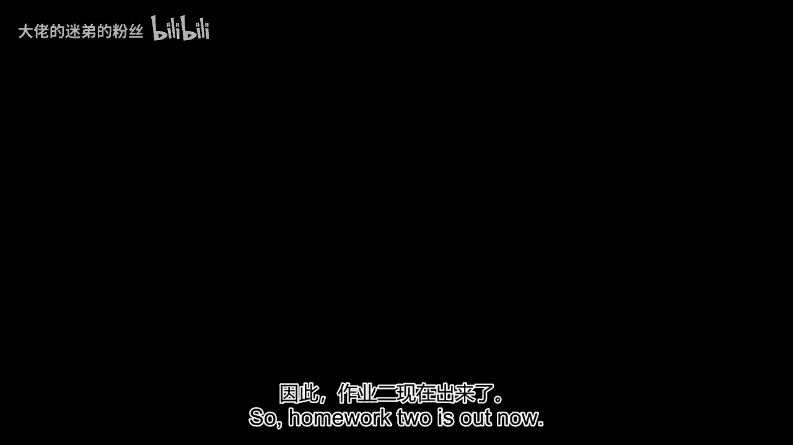
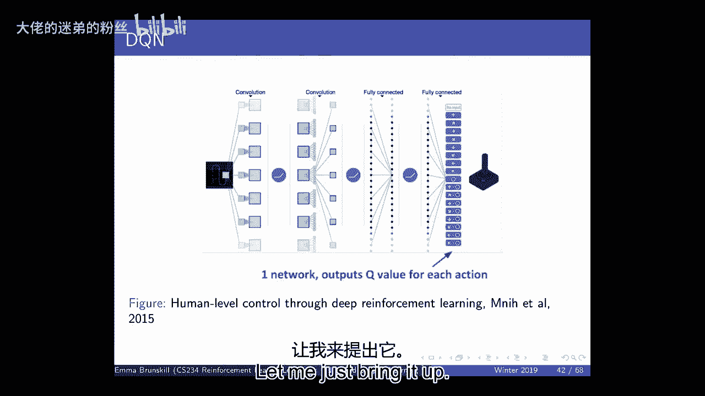
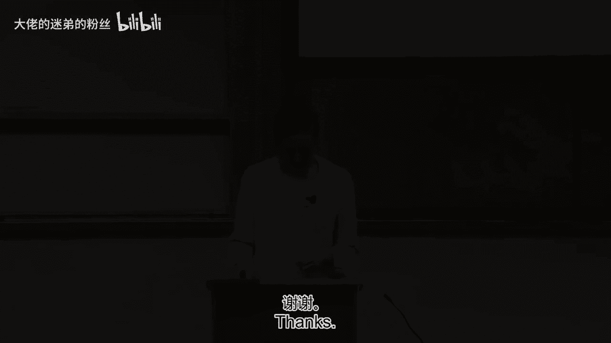

# P6：Lecture 6 - CNNs and Deep Q Learning - 大佬的迷弟的粉丝 - BV1Cc411h7QQ

所以第二个作业现在出来了，我认识到有一个非常广泛的背景，就人们以前是否见过深度学习或上过课而言，或者广泛使用，嗯，只是一个敏捷谦逊的人，你们谁用过TensorFlow还是Pytorch，之前。

你们中的一些人，但不是每个人，所以我们本周要做的是，没有被期望成为或成为一个深度学习专家在这个班上，但是我们你需要有一些基本技能才能做作业，嗯，并能够使用函数逼近与深度神经网络。

所以我鼓励你们本周去参加会议，如果你没有这方面的背景，我们今天要，稍微介绍一下深度学习，但是非常非常非常小的量，嗯，更多地关注深度强化学习，但这些课程将是一个很好的机会来赶上这些材料，嗯，我们还将达到。

呃，明天结束前发布，默认项目是什么，呃这个班，你们可以选择，你是否想做自己的建筑项目，或者呃，默认项目，嗯，这些建议书很快就会到期，在那里一周多一点的时间里，人们现在有什么其他问题吗，是啊，是啊。

停车问题的作业，如果赋值仅限于TensorFlow，我是，我很确定一切都依赖于你使用的张量流，所以是的，请随时在广场上伸出援手，仔细检查一下，但是，我很确定任何。

我们所有的自动平地机都是为TensorFlow设置的，那么这个呢，即使你正常使用Pytorch，请使用张量流，嗯，你们所有人也应该可以获得蔚蓝信用，如果你对建立这个有任何问题，请随意使用广场频道。

上周我们还发布了一个教程，教你如何设置你的机器，所以如果你有任何问题，那是个开始的好地方，如果你看教程，大家可以看一下视频，或者你可以在广场上联系我们，任何其他问题，所有的权利，所以我们要开始了，嗯。

呃，我们今天要讲的是什么，是关于深度学习和深度Q学习的一个非常简短的概述，嗯，就班上的位置而言，我们一直在讨论如何学会在这个世界上做决定，当我们事先不知道奖励模型的动力学模型时。

上周我们讨论了价值函数近似，特别线性值函数逼近，今天，我们将开始讨论其他形式的值函数逼近，特别是，嗯，呃，利用深度神经网络，那么我们为什么要把这件事做得很好呢，我们想开始思考的原因，嗯，啊。

使用函数逼近器就是，如果我们想用强化学习来解决真正复杂的毛茸茸的问题，嗯，我们需要能够处理这样一个事实，即经常，我们将有非常高维的输入信号或观测，嗯，所以我们希望能够处理像素输入，像图像。

或者我们希望能够处理非常复杂的，嗯，顾客、病人或学生的信息，嗯，我们可能有巨大的状态和行动空间，今天我会注意到，我们大多不会谈论太多巨大的行动空间，但是我们会考虑很多关于非常大的状态空间。

所以当我们开始谈论这些，我认为我们要么需要模型的表现，这些意味着动力或奖励模型，T或R或状态操作值，q或v，或者我们的政策可以概括各州和我们的行动，我们的想法是我们可以，事实上。

再也不会遇到完全相同的状态了，你可能再也看不到完全相同的世界图像了，但我们希望能够从过去的经验中总结出来，所以我们想，而不是用一个表来表示我们的值函数，嗯，我们将使用这个泛型函数逼近器。

那里我们现在有一个W，就是一些参数，当我们想这么做的时候，我们说我们要关注的是，我们将关注可微的函数逼近，可微表示的好处是我们可以使用我们的数据，我们可以估计我们的参数。

然后我们可以使用梯度下降来适应我们的函数，试着写那个，写或表示我们的Q函数或值函数，我上次提到过，那个，大多数时候，我们将考虑尝试量化我们函数的拟合度，与真值比较为均方误差。

这样我们就可以确定我们的损失，我们可以用梯度下降法找到参数，优化，作为一个提醒，随机梯度下降是有用的，因为当我们可以慢慢地更新我们的参数时，随着我们得到更多的信息，这些信息现在可能是以插曲的形式出现的。

也可以是单个元组，当我说元组，我通常指国家诉讼，奖励下一个状态，好的是，预期的随机梯度下降与全梯度更新相同，所以只是为了提醒自己，上次我们讲到线性值函数逼近器，这意味着我们要做的是。

我们将有一大堆特征来描述我们的世界，嗯，因为你知道这些特性，我们将输入我们的状态，状态是世界的真实状态，我们会输出我们的特性，所以这可能是我们机器人的激光测距仪，它告诉我们墙在一百八十度的方向上有多远。

我们谈到了这样一个事实，那是世界的别名版本，因为多个走廊可能看起来相同，所以我们的值函数现在是这些特征之间的点积，我们已经了解了这个世界，嗯，用重量，我们的目标函数又是均方误差。

然后我们可以做同样的体重更新，关键的困难是我们不知道这是什么，所以这才是保单的真正价值，问题是我们不知道保单的真正价值是什么，否则我们就不必做所有这些学习，所以我们需要有不同的方法来近似它。

所以我们上次讲的两种方法都是受到我们工作的启发，在蒙特卡洛或在TD学习是，我们可以插入完整集的回归，这是奖励的总和，或者我们可以进行自助返回，所以现在我们在做自举，我们看奖励的地方。

下一个状态和我们下一个状态的值，在这种情况下，我们对所有的东西都使用线性值函数逼近器，这给了我们一个非常简单的形式，这个函数的导数是什么，关于W，基本上只是我们的特性，基本上乘以这个预测误差。

所以人们有时称之为预测错误，因为这是价值之间的差异，或者现在我们用GT作为真正的值，当然啦，在现实中，它只是价值的一个样本，但真实价值和我们估计价值之间的差异，我们想缩小这种差异，所以在这种情况下。

我写的这些方程都是为了线性值函数逼近，但是使用线性值函数逼近有一些局限性，尽管这可能是研究得最充分的，所以如果你有正确的功能集，从历史上看，有很多工作要弄清楚，这些正确的特征是什么，他们经常工作得很好。

事实上，当我们进入，我想我之前简短地提到过，当我们开始谈论深度神经网络时，你可以想到一个深度神经网络，只是一种非常复杂的方法来获得功能，加上最后一层是这些特征的线性组合，当我们谈论深RL的时候。

用深度神经网络来表示Q函数，这就是我们将要研究的代表类型，所以线性值函数通常工作得很好，如果你是正确的功能集，但这是对什么是正确的功能集的挑战吗，关于是否，我们甚至可以写下真值函数，使用我们的一组特性。

我们有多容易收敛到这一点，所以我们上次没有太多讨论的一个选择是使用，一个非常非常丰富的函数逼近类，我们不必直接表示特征，其中一些是基于内核的方法，嗯，有没有人看到像，呃。

在K个最近邻类型方法之前或类似K个最近邻类型方法之前基于内核的方法，如果你学过机器学习，你听说过K个最近的邻居，这些是非参数化的方法，其中表示大小往往随着许多数据点的增长而增长，嗯，然后他们会很好。

它们有一些非常好的收敛特性，用于强化学习，问题是您需要的数据点的数量往往会随着维度而缩放，所以如果你有，假设那一百八十个特征，需要平铺的点数，一百八十度的空间通常随维度呈指数缩放，所以就计算复杂性而言。

这并不那么吸引人，内存需求和样本复杂度，所以这些实际上有更强的收敛结果，与线性值函数逼近器相比，嗯，但它们还没有被广泛使用，嗯，每个人都先说出名字，请帮帮我，是啊，是啊，呃，所以你再想想。

为什么指数行为，是啊，是啊，问题是，为什么指数行为会发生在许多这样的内核中，基于逼近器或非参数逼近器，直觉是我，如果你想对你的值函数有一个准确的表示，你用，说，呃，它周围的局部点，比如说。

类似于K最近邻方法，那么你需要让一切都接近的点数，就像在一个Epsilon球的尺度上，所以基本上你只是把空间网格化，所以如果你想到，如果你想到，如果你想在这条线上有任何一个点，请靠近。

然后你可以在这里放一个点，在这里放一个点，为了拥有一切，对于这条线上的所有点都是epsilon关闭的，有一个在Epsilon距离内的邻居，如果你想把它放在一个正方形里，你需要四分。

这样一切都可以有点接近其中一个点，一般来说，你需要的点的数量会随着维度呈指数级增长，但他们真的很好，我因为它们可以保证是平均数，我们简短地讨论过，上次，查看线性值函数逼近器，嗯，当你做行李员备份时。

它不再一定是收缩算子了，这就是为什么当你做越来越多的备份时，你有时会爆炸，平均数最酷的一点是它的名字，当您使用这种类型的近似值时，你没有，它们保证是不膨胀的，这意味着当你把它们和行李员备份结合在一起时。

它保证仍然是收缩，这真的很酷，所以这意味着这些近似器保证收敛，与许多其他的相比，好吧，但它们不会很好地缩放，在实践中，你不会看到他们，尽管我的同事做了一些很酷的工作，哈佛大学的终结者多希·维勒兹。

谁在考虑将这些用于医疗保健应用，你是如何从相关的病人中概括出来的，所以它们可以很有用，但一般不会缩放得那么好，我们今天要讨论的是深度神经网络，它们也有非常灵活的表示，但我们希望我们能扩大规模，嗯。

总的来说，我们几乎没有理论上的保证，在今天剩下的时间里，我和，但在实践中，他们经常工作得非常非常好，所以它们已经成为强化学习的一个非常有用的工具，在机器学习方面，那么我们所说的深度神经网络是什么意思。

你们中的许多人都是专家，但它通常意味着什么，在这种情况下是，我们要考虑做一个函数逼近器，它是由许多函数组成的，所以我们将有我们的输入x，现在我们要把它输入到某个函数中，它会承受一些重量，所以一般来说。

所有这些东西都可以是向量，所以你要吸收一些重量，并把它们和你的X结合起来，然后你要把它们推入某种功能，然后你会输出一些东西，它可能也是一个向量，然后你可以把它放到另一个函数中加入更多的权重。

我们会这样做很多次，然后在最后，我们可以输出一些Y，你可以把它想象成我们的Q，然后我们可以把它输出到某个损失函数j，那么这在这里是什么意思，这意味着y等于h n的h n减去点的一个，x中每一个的点。

我还没有把所有的重量都写在里面，但也有一大堆重量，然后这是我们的损失函数，像以前一样，你可以把它想象成我们的Q，比如说，但这些在无监督学习中经常发生，比如预测某物是不是猫，或者你知道一个特定物体的图像。

um或用于回归，那么我们为什么要做好这件事，首先，应该清楚的是，当你组成许多函数时，嗯，你可以通过以下方法来表示非常复杂的函数，你知道的，多项式的加减乘除，你可以通过把函数组合在一起来做各种各样的事情。

这可能是一个非常强大的函数空间，你可以表示，但写下来的好理由，像这样，你可以用链式法则来尝试随机梯度下降，那么这怎么工作得好呢，这意味着我们可以写下那个DJ，所以我们真的想，你知道的。

对于所有这些不同的参数，所以我们可以在这里写的是，我们可以写下hn的dj和dw n的dh n，我们可以在任何地方都这样做，所以H二的DJ，dh2的dh2和dhh2dw2。

所以您可以使用链式法则来传播所有这些，你的损失函数的梯度，关于W，通过写下链式法则来追溯所有这些不同的作文，所以这可能很好，因为这意味着你可以把你的输出信号，然后把它传播回来更新你所有的体重。

现在我要和自己约会了，所以当我第一次了解深度神经网络时，你必须用手做这件事，所以你可能会想象这是一个不太受欢迎的任务，然后呃，这叫做反向传播，所以你可以手工推导这个，嗯。

我一会儿就会讲到这些类型的功能是什么，你知道你需要H的可微函数，但我认为那里发生的主要创新之一，你知道的，在过去的五到八年里，汽车差异化，所以现在你不必手动驾驶所有这些坡度，相反。

您可以只写下您的网络参数，然后你的网络包括一堆参数，然后你有像TensorFlow这样的软件来为你做所有的区分，所以我认为这些工具让人们更实用，很多很多的人可以使用，嗯，深度神经网络，因为你没有。

你可以有非常非常复杂的网络，有非常非常多的层，没有手写什么，渐变是，那么这些h函数是什么，通常它们结合了线性变换和非线性变换，基本上它们必须是可微的，所以你知道，这些h需要是可微的。

如果我们要用梯度下降来拟合它们，所以常见的选择要么是线性的，或非线性，我们可以认为hn等于某个函数hn-1，如果它是非线性的，我们通常称之为激活函数，由于时间的原因。

我不打算在课堂上多谈与神经网络的联系，这就是我们大脑内部的东西，这就是鼓舞人心的地方，这些人工神经网络，嗯，但在大脑内部，人们认为有这种非线性激活函数，其中，如果信号通过某个阈值，然后呢，比如说。

神经元会发射，所以这些非线性激活函数可以是乙状结肠函数，或Relu，relu现在特别受欢迎，但是嗯，所以你可以选择线性函数或非线性函数的不同组合，和往常一样我们最后需要一个损失函数。

通常我们使用均方误差，您还可以使用对数似然，但我们需要一些，然后我们就可以区分我们离实现目标有多近，为了更新我们的重量，是啊，是啊，名字第一，所以这个射线环函数是不可微的，对呀，它是可微的，就像你可以。

你可以，你可以用不同的方式做这件事，最近它比乙状结肠更受欢迎，虽然我觉得这是一个，但我不明白渐变下降对这部分有什么作用，嗯，是零，所以结果很好，只是为了在这里，所以问题是对于饶来说，有很多平坦的地方。

所以如果你的梯度为零，然后你的渐变就会在那里消失，总的来说，实际上我们不会在课堂上谈论这个，但肯定有一个问题是，你开始有非常非常深的神经网络，因为其中的一些功能，你有时会结束几乎没有信号回到早期的层。

但我不打算谈论这些，我们谈谈，我们会在会议上讨论这个问题，他们很好地意识到，我们也很乐意给其他指针，但是是的，没关系，你仍然可以有一个，零分，所有的权利，那么我们为什么要把这件事做好呢，这很好。

我们可以使用这种更复杂的表示，嗯，另一件事是，如果你至少有一个隐藏层，如果您有足够数量的节点，嗯，你可以想象好像你不熟悉，这基本上只是一组足够复杂的功能组合，um和函数，这是一个通用函数逼近器。

这意味着你可以用深度神经网络表示任何函数，所以这真的很好，我们不会有任何容量问题，如果我们使用一个充分表达的函数逼近器，这很重要，因为如果你想想我们用线性值函数逼近器做的事情，很明显是这样。

有时你可能有太有限的功能，你就不能表达某些状态的真值函数，通用函数逼近器，um属性说明，对于深度神经网络来说，这不会发生，如果是的话，呃，现在足够富有了，当然啦，你总是可以想到用非常，非常丰富的功能。

然后就等价了，这样你就知道另一个好处是什么，另一个好处是，您可以使用指数级减少的节点或参数，与使用浅网相比，这意味着没有那么多的成分来代表相同的功能，这很优雅，我很乐意在线下谈论这一点。

或者我们可以在广场上谈谈，最后一件事是，你可以使用随机梯度来学习参数，血统，所有的权利，所以这差不多是，你知道的，深度神经网络在五秒钟内，我们现在要谈谈卷积神经网络，一次又一次。

这一切都将是一个相当轻松的介绍，因为你不需要知道细节，为了做作业，除了大部分，理解这些是非常有表现力的函数逼近器的事实，那么我们为什么要关心卷积神经网络呢，嗯好吧，它们在计算机视觉中得到了广泛的应用。

和，如果我们对机器人感兴趣，和其他可以在现实世界中相互作用的代理，我们的主要感觉方式之一是视觉，而且很有可能，我们希望能够在我们的，我们的机器人和我们的人工代理，所以如果你想想这个，嗯。

想想在爱因斯坦的例子中有一个形象，嗯，爱因斯坦身上有一大堆不同的像素，嗯，爱因斯坦的这张照片，假设是一千乘一千，所以它是一千乘一千，嗯，你知道X和Y，所以我们有十到六。

所以这个标准通常被称为前馈深度神经网络，你会有所有这些像素，然后它们将作为输入进入另一层，您可能希望有一堆不同的节点接受输入，从所有这些，所以你可以得到大量的重量，所以你可能有10到6个砝码。

因为这是我们经常想到的，我知道我没有给你足够的细节，但我们通常认为这是一种深度神经网络，在那里我们有许多函数并行，所以它不仅仅是一个单一的，那么所有这些都将以某种复杂的方式变成其他功能。

所以你可以让很多函数并行计算，所以你可以想象你的形象，你有一个函数，计算图像的某些方面，和另一个计算图像其他方面的函数，然后你要结合，以各种复杂的方式将它们结合起来，所以这是在说，对于第一个，也许会有。

你知道吗，一大堆N个不同的函数在计算图像，这里有十个到六个参数，所以如果我们有重量，次数，那么这将是10的6个参数，以吸收所有的x，那是很多，然后如果我们想做不同类型的重量，都是平行的，那将是一个非常。

非常多的参数，我们现在确实有很多数据，但这仍然是大量的参数要表示，它也忽略了一些要点，我们经常用视觉思考，所以如果我们考虑多次这样做并且有很多隐藏的单元，我们可以得到大量的参数，为了避免这种时空复杂性。

事实上，我们忽略了图像的结构，卷积神经网络试图有一种特殊形式的深度神经网络，它试图思考图像的属性，所以特别是图像通常有结构，我们的大脑承诺图像的方式也有结构，以及空间和频率的显著特征。

所以当你有一个卷积神经网络，我们认为有特定类型的运算符，嗯，所以这里的运算符就像我们的函数h 1和h n，我之前说过，它可以是线性的，也可以是非线性的，在卷积神经网络中，我们会有特殊的结构。

这些函数试图，考虑我们可能想要从图像中提取的属性，这里的关键方面是，我们将做大量的权重分担来减少参数，所以我不会说我会有完全不同的参数，每个都吸收了所有的像素，我最终会得到一些相同的局部参数。

然后我把它们应用到图像的不同部分试图提取，例如特性，因为，最终，这样做的重点是，试图提取我们认为有用的特征，预测你是否认识图像中的人脸，或者帮助我们理解Q函数应该是什么，所以关键的想法。

其中一个关键的想法是说，我们将有一个过滤器或接受场，我们会有一些隐藏的单位，所以它将是一个函数，应用于以前的一些输入，在开始的时候，这只是我们图像的一个子集，而不是把整个图像，我们只是要参加。

所以我们只需要一个补丁，现在我们把上面这个角，我们要走中间，所以就像，我们会试着计算一些属性，图像的特定补丁，所以我们可以想象把它通常被称为过滤器，那个小，嗯，我们在补丁上应用的那些权重。

我们可以在图像上到处做，我们经常称之为有一个大步，这意味着你在每个时间点移动这个小补丁的程度，还有一个叫做零填充的东西，即在每个输入层上添加多少个零，这决定了如何，在这种情况下，你的输出是什么。

如果你有一个2 8乘2 8的输入，你有一个五乘五的小补丁，你要在整个图像上滑动，那么你最终会得到一个二，四乘二四下一层，因为基本上你只要拿着这个，然后你把它移过来一点，你把它移过去。

每次你都要拿这两个五，所以这是五乘五，所以你会有两个五输入x，你要用一些重量点积它们，这会给你一个输出，所以在这种情况下，这意味着我们需要两个五砝码，所以一件事是，我们没有完整的x输入，我们只是要接受。

我们将把X输入的不同部分引导到不同的神经元，你可以把它看作是不同的功能，嗯，但另一个好主意是，我们将对所有东西都有相同的重量，所以当我们把这些重量，我们会有一种，你可以想到他们。

试图从图像的子补丁中提取特征，比如说，是否有优势，所以你可以想象，我在尝试检测，在图像的那一部分有一个看起来像水平边缘的东西，我试着，这是由重量决定的，我在说明，我只是把它移到我的整个图像上。

看看它是否存在，所以现在重量是相同的，你只需在整个图像上移动它们，而不是让你知道10到6个重量，我只有两个五砝码，我把这些应用到同样的，只是把它们放在图像的许多不同部分，所以这就是它的样子。

你有这种输入，你去，嗯，隐藏层，是的，是的，你也在向下采样图像，你为什么要把这件事做好，我们认为大脑经常这样做，它试图提取不同类型的特征，事实上，在深度学习之前的许多计算机视觉都试图构建这些特殊的特征。

像特征或其他特征之类的东西，我认为这些特征捕捉到了图像的一些重要属性，也可能对翻译等事情是不变的，因为我们也认为你知道，不管我是在看，嗯，这样的世界，或者我稍微移动一下我的头，嗯。

我看到的特征通常是相同的，我是向左移动还是向右移动，一点点，世界上有一些特别突出的方面，这将与检测有关，是否有一张脸，并与决定我的值函数相关，所以我们想提取特征，我们认为将代表这种翻译，不变性。

所以这也意味着不仅仅是计算你，你可以这样做，您在整个功能中使用相同的权重，整个图像，然后您可以对多种不同类型的功能进行此操作，所以有一个很好的讨论，更深入，从你们中的一些人可能拿走的2-3-1-N。

有一个很好的动画，他们展示了，好的，想象你有你的投入，你可以把这看作是一个图像，然后你可以在上面应用这些不同的过滤器，你可以把它想象成试图检测不同的特征，然后你在你的图像周围移动它们。

并查看该功能是否存在于任何地方，所以你可以用多种不同类型的过滤器来做到这一点，你可以把这看作是试图寻找，不管是那样还是那样，你知道，水平或垂直不同类型的边缘，嗯，这些给你不同的功能。

基本上是被提取出来的，嗯，CNN中另一个真正重要的事情是所谓的汇集层，它们经常被用作一种，向下，对图像进行采样，所以你可以做像最大池这样的事情，检测是否存在特定特征，嗯，或者取平均值或其他方法，呃。

压缩你得到的信息，只要记住在这种情况下，在许多情况下，我们将从一个非常高维的输入开始，像x可能是一个图像，并输出像，嗯，你知道的，Q值，所以我们必须以某种方式进行高维输入，然后放慢速度。

直到我们可以得到一个低维的输出，所以最后一层通常是完全连接的，所以我们可以再次思考之前的所有过程，本质上是计算一些新的特征表示，所以基本上从这里到这里，我们正在计算图像的新特征表示。

然后在最后我们可以取一些完全连接的层，就像做线性回归，并用它再次输出预测或标量，我也知道，对于你们中的一些人来说，这是一种快速的浅层复习，对于你们其他人来说，这显然不在，呃，这将是一个旋风式的介绍，嗯。

但我们不会要求你知道很多这些细节，一次又一次，如果你有什么问题就去参加一个会议，请随时联系我们，好的，所以这些类型的表示，深度神经网络和卷积神经网络，两者都广泛应用于深度强化学习，嗯。

所以大约是在2014年，我在哪里车间，大卫·西尔弗开始谈论，我们如何对雅达利使用这些类型的近似值，那么为什么这令人惊讶，我只是想把所以带回来，在1994年左右，大约1994年，我们有TD双陆棋。

使用深度神经网络，他们使用神经网络，我想有些死深，他们得到了一个世界级的双陆棋玩家，所以那是很早的时候，然后我们得到了周围发生的结果，从1995年到1998年，它说函数逼近，无法收敛。

所以我们上次讨论过这个，一般来说，一旦我们开始做这个函数近似，即使使用线性函数逼近器，嗯，当您结合策略控制引导时，这意味着我们在做TD学习或Q学习，嗯和啊，函数逼近器。

然后你就可以开始有这个有挑战性的三联，嗯，这通常意味着我们不能保证收敛，即使我们保证会聚，解决方案可能不是一个好办法，所以早期有一个令人鼓舞的成功，然后在90年代中期有了这些结果。

我们正在努力更好地理解这一点，这表明事情可能会非常糟糕，有一些，除了理论结果，有一些简单的测试用例，嗯嗯，你知道，这些出错的简单案例，所以这不仅仅是原则上可能发生的，但也有失败的案例。

所以我想在那之后的很长一段时间里，社区有点远离深度神经网络，暂时，人们对使用它们相当谨慎，因为它们显然是简单的案例，函数逼近开始变得非常糟糕，理论上，人们可以证明它可能会变得很糟糕。

所以在很长一段时间里，人们对它的关注较少，然后嗯，深度神经网络的兴起，你知道2000年中期的人喜欢，现在，嗯，所以深度神经网络变得巨大，他们显然取得了巨大的成功，对于视觉和其他领域，有一大堆数据。

有一大堆计算，他们得到了非常非凡的结果，所以也许这是很自然的，就像在，像二十个，DeepMind将它们结合在一起，在雅达利上取得了一些非常惊人的成功，所以我认为这真的改变了人们对，使用，嗯。

这些复杂的功能，近似计和RL，在那个，是呀，它可能无法收敛，是呀，事情可能会变得非常糟糕有时在练习中确实会变得非常糟糕，但也有可能经常，尽管如此，你知道我们并不总是完全理解，为什么他们总是工作，嗯。

在实践中经常，我们现在仍然可以得到相当好的政策，我们常常不知道它们是否是最佳的，我们经常知道它们不是最佳的，因为我们知道人们可以玩得更好，但这并不意味着他们可能不太好。

所以我们看到了对深度强化学习的兴趣的复苏，是啊，是啊，我想从你的角度来看，深度学习解决了什么问题，他们在90年代中期提出的问题，还是只是通过计算能力的增加，以及收集大量数据的能力，当它失败的时候。

这并不重要，我们可以尝试一些不同的东西，比如阅读，你知道的，再试一次，重新把它放在一起，然后一直尝试直到成功，我想我的问题是，我们实际上克服了90年代末出现的任何问题，还是我们只是在努力解决这个问题。

就是，你知道的，我们如何从根本上解决90年代末的一些问题，或者嗯，我们是不是有点残忍地强迫它，嗯，我认为1995年出现的一些问题，就趋同而言，现在有一些算法，更真实的，第十一章介绍的随机梯度算法，嗯。

这样就保证了会聚，它们可能不能保证收敛到最优策略，所以还是有很多，还有大量的工作要做，我认为要理解功能，近似器和非策略控制，我认为也有一些算法的想法，我们将在这节课后面看到。

这有助于性能避免一些收敛问题，我觉得人们在进入2013年的时候就知道了，二十四，所以他们试着好好想想，2。什么时候会发生这种情况？我们怎样才能避免一些事情，比如导致这种情况的原因，所以至少在算法上。

我们可以尝试让人们经常谈论的稳定性，所以我们能试着确保深度神经网络，似乎并没有开始有向无穷大移动的重量，至少在经验上有更稳定的性能，是呀，所以具体到目标，你有没有避免这个问题，我只是不知道，我为自己想。

但事实并非如此，事实上，在最初的实验中他们更新了性能以实时匹配所有这些，他们致力于政策问题，为了避免这个问题，问题是在这种情况下，呃，或者在雅达利的情况下，就像，你知道的，他们是否改变了事情。

以更多地关注政策，或者或者嗯，我们知道它可以更稳定，嗯，他们在做深度学习，在这种情况下，深度Q学习，所以它仍然很不稳定，但他们会做些什么，网络更新的频率，试着让它更稳定，这些都是很好的问题，让我。

我们看看它在那里是如何工作的，任何其他人，好的，很好很好，我们很快就会看到一个突破的例子，嗯，他们的所作所为，嗯，所以再一次，现在，我们将讨论使用深度神经网络来表示值函数，嗯，下周不久。

我们将讨论使用深度神经网络来表示政策，那么我们该怎么办，我们会再次，有我们的重量，我们将有相同的近似值，现在我们将使用深度神经网络，在这种情况下，只是想说清楚，我们将使用Q函数，因为我们希望能够控制。

所以我们要做的是，在这种情况下的控制，嗯，所以我们需要学习行动的价值，在雅达利说清楚，它通常没有一个真正高维度的动作空间，通常在4到18岁之间，取决于游戏，嗯，所以它是相当低的维度，公平地，它是离散的。

相当小，所以尽管状态空间是巨大的，因为它是像素，它的图像，嗯我，动作空间很小，所以作为Q学习的提醒，我们看到的是Q学习是这样的，为了我们的体重，我们必须得到函数的导数，这不一定会是线性的。

但是我们更新体重的方式是，我们做了一个TD备份，我们有这个目标，嗯，但我们现在要拿一个最大值超过一个最大值，我们的下一个州，和我们的行动，我们的重量现在注意到这个方程，你看到的所有W在右手边都是一样的。

所以我们用相同的权重来表示我们的当前值，我们用同样的重量插进去，并得到我们未来价值的估计以及我们的衍生品，我们将看到的一件事是它是另一种选择，好的，所以他们的想法是。

我们真的希望能够使用这种类型的函数逼近器，这些深度函数逼近器来做雅达利，他们选择了部分雅达利，嗯，我想至少德，和，我想戴维斯和大卫都是在电子游戏方面联合创业的，很久以前，我想是在大卫回到研究生院之前。

如果我没记错的话，嗯，所以他们都对这个感兴趣，很明显，游戏对人们来说往往很难学习，嗯，所以这是一种很好的智力展示，他们认为我们可以接触到这个，有一篇论文发表了，忘记了什么时候，可能是2011年。

谈论雅达利游戏和模拟器，作为，对RL来说是一个有趣的挑战，那么在这种情况下会发生什么，嗯，状态将是完整的图像，动作将相当于，你在游戏中通常可以做什么，这通常在4到18岁之间，大约四到十八个动作，嗯。

回报可以很好，真的无论你想要什么，但你可以用分数或其他方面来，嗯，呃，作为代理奖励，一般来说我们会考虑得分，那么会发生什么，嗯，他们将使用一个特定的输入状态，我们以前讨论过一个表示是否是马尔可夫的。

在这些游戏中，你通常需要有速度，因为你需要速度，您需要的不仅仅是当前的图像，所以他们选择做的是，嗯，你需要使用之前的四帧，所以这至少可以让你抓住球的速度和位置，诸如此类的事情，嗯，这并不总是足够的。

有人能想到一个例子吗，可能是雅达利游戏，我不知道有多少人玩雅达利，嗯，我这可能还不够，在你知道的地方，对于最后四个图像仍然可能不够，或者是不够的游戏类型，如果你想在前一个房间拿一件东西。

然后你很晚才用它，在微上是完全正确的，就像蒙特祖玛的复仇，你经常要拿钥匙的东西，然后你得抓住那把钥匙，然后嗯，也许它在屏幕上是可见的，也许不是，嗯，然后呃，但也许它储存在某个地方的库存中。

所以你必须记住你有它才能做出正确的决定，很久以后，或者你可能在早期看到了一些信息，所以有很多游戏和任务，嗯，即使是最后四帧也不会给你所需的信息，但这是一个不错的近似值，这比代表整个历史要容易得多。

所以他们从那个开始，所以在这种情况下，有18个操纵杆按钮位置，或者可能不需要在特定的游戏中使用所有这些，奖励可以是现在分数的变化，请注意，这可能很有帮助，也可能不是，这取决于游戏，所以在一些游戏中。

你需要非常非常长的时间才能到达，任何你的分数可能会改变的地方，所以在这种情况下，你可能会得到很少的奖励，在其他情况下，你会得到很多奖励，所以学习该怎么做就容易多了，他们在论文中做的一件重要的事情。

这是一篇2015年的自然论文，他们在所有游戏中使用相同的架构和超参数，现在我想说清楚，然后他们将学习不同的Q函数和每个游戏的不同策略，但他们的观点是，他们不必使用完全不同的架构。

并对每一个游戏分别进行完全不同的超参数调整，为了让它工作，这真的是那种将军，UM体系结构和设置，足以让他们学会为所有的比赛做出正确的决定，我认为这是对这篇论文的另一个很好的贡献，就是说，嗯。

我们会试着得到一个通用的算法和设置，这将远远超出正常的那种，我们在强化学习论文中看到的三个例子，但它将努力在所有50场比赛中表现出色，经纪人将在五十场比赛中从头开始学习，嗯。

但它将以相同的基本参数这样做，相同超参数，和相同的神经网络，所以同函数逼近器，好的是我认为这实际上是大自然所需要的，他们也发布了源代码，所以你可以玩这个，那么他们是怎么做好的呢，他们要做价值函数逼近器。

它们代表q函数，他们会最小化均方，随机梯度下降损失，但我们知道这可以与值函数逼近器发散，这其中的两个问题是什么，嗯，一个是嗯，在那里，样本之间的相关性，这意味着如果你有，这是一个R s素数，素数r素数。

它是双素数，如果您考虑值函数或返回对于s是什么，值函数和s素数的返回，他们是独立的吗，没有权利，事实上，就像你期望它们高度相关一样，他们可能是你知道的，我的意思是这取决于s质数的概率。

如果这是一个确定性系统，它们之间唯一的区别是r所以它们高度相关，这些不是身份证样本，当我们做更新的时候，有很多相关性，嗯，还有非静止目标的问题，那是什么意思，这意味着当你试图进行监督学习时。

并训练您的值函数预测器，你并不总是有相同的V PI神谕，它告诉你真正的价值是什么，随着时间的推移，这种情况正在改变，因为你在做Q学习，试图估计那是什么，你的政策正在改变，如此大量的非平稳。

所以你没有固定的目标，当你甚至只是试图适应你的功能，因为它可能在每一步都在不断变化，嗯，所以你改变了你的政策，你改变体重，然后你改变你的政策，现在你又要改变体重了，所以这也许并不奇怪，就收敛而言。

事情可能很难，所以那种呃，DQN深度Q学习地址，这些是由经验丰富的重播和固定的Q目标，体验重播，你们很多人都听说过这件事，如果你以前学过DQN，我们将存储所有数据，我们以前谈过一点，在他们的标准方法中。

如何像TD学习一样，现在只使用一个数据点，这里的数据点其实是，A r s素数元组，以最简单的TD学习或Q学习的方式，你用一次，你把它扔掉，这对数据存储很好，而且对性能不太好。

所以我们的想法是把这个储存起来，我们将保留一些有限的先前经验缓冲，我们基本上要重做Q学习更新，记住这里的Q学习更新是这样的，我们会更新我们的体重，这被认为是一个更新，以获取一个元组并更新权重。

就像一个随机梯度下降更新，所以你可以从你的经验中吸取教训，嗯，重播你的重播缓冲区，给定当前的Q函数，计算目标值，然后你做随机梯度下降，现在，注意这里，因为你的Q函数会随着时间的推移而变化。

每次更新相同元组的，您可能有不同的目标值，因为你的Q函数已经改变了，所以这很好，因为基本上这意味着你重用你的数据，而不仅仅是使用每个数据点，一旦你可以重用它，这可能会有帮助，我们一会儿再看。

所以即使我们把目标当作标量，体重会在下一轮更新，这意味着我们的目标值会改变，所以嗯，你可以传播这些信息，主要的想法是我们要不止一次地使用数据，这通常很有帮助，是的，呃，邻居，我的问题是。

这是否相当于在我们的表示中保留了更多的帧，或者这不是很好的问题吗，这相当于在我们的表示中保留更多的帧，它不是，虽然这是一个非常有趣的问题，嗯，更多的帧就像保持一个更复杂的状态表示。

但您仍然可以使用州诉讼，奖励下一个状态元组一次，并扔掉该数据，这就像说我周期性地喜欢，假设我去了一个一个一个一个两个，然后我继续前进，现在我在喜欢三三三三四，所以这就是我在这个世界上的真正位置。

我现在处于第四状态，就像我突然假装，哦等等，我要假装我回来了，1拿了1拿了R 1我去了2，我要再次更新我的体重，更新会与以前不同的原因，是因为我现在用我的第二次更新和第三次更新更新了。

所以我的Q函数一般会和以前不一样，所以它会导致不同的重量更新，所以即使它和以前是相同的数据点，它会导致不同的体重更新，和一般情况下，我们很久以前谈论过的一件事是，如果你做TD学习收敛。

这意味着你像无限长的时间一样检查你的数据，至少在表格中，这相当于如果你学习了一个MDP模型，你学会了过渡动态和奖励模型，你刚刚用它做了MDP计划，这就是TD学习的汇合点。

如果你在无限长的时间内反复浏览你的数据，最终会汇聚到，就像你学会了一个模型和一个动态模型，奖励模型，然后为此做了计划，挺酷的，所以这让我们更接近那个，嗯，我，但我们不想一直这样做，因为有一个计算权衡。

尤其是在这里，因为我们在游戏中，嗯，在计算和获得更多的经验之间有一个直接的权衡，这实际上是一个非常有趣的权衡，因为在这些情况下，这有点像，你是否应该考虑更多，计划更多，使用你的旧数据。

还是你应该积累更多的经验，但我们可以稍后再谈，是啊，是啊，问题和名字第一，拜托了，所以体验重播缓冲区有一个固定的大小，只是为了澄清理解，这些样品在固定的时间后被新的样品替换了吗。

或者有没有特定的方法来选择将哪些样本存储在缓冲区中，大问题，也可以，这可能是一个固定大小的缓冲区，如果是固定大小的缓冲区，你怎么挑，里面有什么，并且是最近的，你怎么把东西弄出来，如何从中删除项目。

这是一个非常有趣的问题，不同的人通常做不同的事情，它通常是最近的缓冲区，嗯可以，比如说，最后一百万个样本，这给了你一个亮点，我们将要谈论的样本有多少，嗯一个，但你可以做出不同的选择，还有一些有趣的问题。

你应该把什么东西踢出去，嗯，这也取决于你的问题是否真的是非静止的，我的意思是，就像现实世界是不静止的，就像你的客户群在改变，当我们试图在继续体验和，比如新的数据点和回复它。

我们会做一些类似于开发和探索的事情吗，本质上就像随机概率一样，只是决定重播关于我们如何在，就像你知道的，获取新数据以及要重播多少，等等，我们能不能做这种探索开发交易，我想这通常是研究不足的。

人们使用很多不同的启发式，经常，人们对他们更新的内容有某种固定的比例，根据经验，重播和得到嗯，把新的样本放在现在，这是一种启发式的权衡，你当然可以想象试图最优地解决这个问题，但这也需要计算。

这让我们进入了一个非常有趣的问题，元计算和元认知，如果您知道您的代理正在考虑如何对自己的计算进行优先级排序，这是一个超级酷的问题，这是我们一直在解决的问题，好的。

所以DQN做的第二件事是它先有它先保持路线，这个旧数据，它做的第二件事是它有固定的Q目标，那么这意味着什么呢，嗯，所以为了提高稳定性，我们所说的稳定是什么意思，这里，我们不想让我们的重量爆炸，走向无限。

我们看到这可能发生在线性值函数中，用于多次更新，所以记住这里，我所说的目标计算是指奖励加上s质数的γv，所以这本身是w的函数，我们要把W修好，我们在S素数的那个值中使用了几轮，所以不要总是更新。

不管最近的是什么，我们只是要去修复它一段时间，这基本上是让它更稳定，是V星神谕的近似值，所以你真的希望先知把这个给你，每次你到达，你知道的，It’全盛时期，或者你采取行动，得到奖励去S Prime。

你希望神谕告诉你真正的价值是什么，你没有那个，每走一步都可能改变，因为你可以更新重量，意思是不要那样做，保持重量固定，曾经计算过一段时间的质数，大概十步，也许走一百步，嗯，这正好使目标。

你试图将损失降至最低的那种事情，相对于更稳定，所以我们要有，嗯，我们仍然有我们单一的网络，但我们将为该网络保持两组不同的权重，嗯，一个是这个重量减去，叫它减号，因为嗯，可能会有其他公约。

但特别是它是旧的一套重量，我们现在不更新的，这些就是我们在目标计算中使用的，所以这些是我们要用的，当我们要算出s素数的值时，然后我们有一些其他的W，这就是我们用来更新的，所以当我们计算目标值时。

我们再次可以从数据集中采样和体验元组，从我们的经验重播缓冲区，我们用我们的w减去计算目标值，然后我们使用随机梯度下降来更新网络权重，所以这个是和负一起用的，这是和当前的一起使用的，我想有两个问题。

比如直觉上为什么这有帮助，为什么它会让它更稳定，其次除了不稳定还有其他好处吗，从做这两个问题，一个是直觉上为什么这有帮助，这是一个很好的问题，其次是稳定之外，还有其他好处吗，所以直觉上。

为什么这有助于稳定性，在稳定性方面，这很有帮助，因为你基本上降低了目标的噪音，如果你回想一下蒙特卡洛，嗯，在那里而不是用这个目标，就像这个引导目标，我们用的是GT，所以蒙特卡洛是GT，我告诉过你。

好处是，它是V pi的无偏估计器，但缺点是方差很大，因为你只是在总结奖励，直到这一集结束，嗯，所以如果事情是高方差，当你试图在他们身上倒退的时候，会更吵，嗯，你可能是方差，想象我们做某事，采取这种极端。

如果我们想嗯，为了稳定，你总是可以让你的目标等于一个常数，总是可以使它等于零，比如说，如果你永远固定你的目标，您将学习将误差最小化为常数函数的权重，然后就稳定了，因为你总是有相同的目标值。

你总是试图预测，最终你会明白你应该把你的w设为零，那就没问题了，所以这只是为了减少噪音和我们试图达到的目标，如果你把这看作是一个监督学习问题，我们有一个输入x和输出y，RL中的挑战是我们的Y正在改变。

如果你做到了你的Y没有改变，它更容易合身，第二个问题是除了稳定之外，是否有任何好处，我想大部分不是，嗯我，这也在某种程度上降低了传播信息的速度，因为你用的是一套不新鲜的砝码，表示状态的值。

所以你可能会错过对一个状态的价值的估计，因为你没有用新的信息更新旧的，这是我们想做的吗，或者线性近似器是一样的，这是针对复杂问题的，这是深度神经网络特有的，或者可以将其与线性值函数逼近器一起使用。

或任何价值，您可以将其与任何值函数逼近器一起使用，这不是具体的，这真的只是关于稳定，体验回放也是如此，我也是，体验重播只是为了更有效地传播信息，这只会让它更稳定，所以这些并不是独一无二的。

利用深度神经网络，我想他们只是更担心稳定性，用这些非常复杂的函数逼近器，是啊，是啊，在红色中，你有更新九减说，哦，我有一个很好的问题，所以这个，问题是我们是否更新过W减，是呀，我们有。

我们也可以定期更新w减，所以在固定的时间表中，说每五十，或者你知道，每n集，或者每n步，你更新得像每一个，你会把w-设置为w，就像我们知道这是为了给布景打分而做的工作，并且您没有使用与渐变相同的结构。

我们用了很好但有不同的功能，减去函数的值，这怎么会像不破大梯度，就像所有这些假设，别拿着，问题没问题，这在渐变方面真的有效吗，这不是，我是说，这是个很好的问题，这些Q学习是不正确的，梯度下降法。

他们是这样的近似值，他们经常做得非常好，鉴于最近的一些，哪个嗯，第十一章对这类gtd或梯度进行了很好的讨论，时差学习更真实，梯度下降算法，这些真的只是近似值，正是这个，嗯作为点，这不能保证收敛，不过。

这有望有所帮助，但我们不能保证，是啊，是啊，所以如果实际上两个人，有一些周期性的模式，以及它们如何刷新用于计算的方式，呃，这个渐变，问题是，你知道的，在实践中，是不是有某种周期性的模式。

你更新W减的频率，是呀，是啊，是啊，通常有特定的模式或超，它是一个超参数选择，可以选择更新的速度和频率，它将在更快地传播信息和可能更不稳定之间权衡，所以如果你，嗯，你知道如果n是一个。

那么你又回到了标准的TD学习，如果n是无穷大，就是说你从来没有更新过，所以有一个，有一个平滑的连续体，在那里，我们知道喜欢W，有比零更好的初始化，如果你考虑到，我想就像平均值和方差一样。

你会初始化w减吗，就两个W，或者对于w-有更好的初始化，讨论是关于，你知道，我们如何初始化W的影响可能很重要，嗯，那就是我们如何初始化w-，通常我们将w-初始化为与w完全相同，在开始的时候。

它的选择也会影响，当然他们的领先表现，伟大的问题，让我继续，因为我想确保我们也能得到一些扩展，总结一下DQN是如何工作的，它的两个主要创新是，它使用经验回放和固定的Q目标。

它在这种重播缓冲区或重播内存中绘制过渡，您从D中随机抽取迷你批，所以通常一个样本，一个小批次而不是一个单一的，所以也许样本十或其他参数，嗯，你做梯度下降，考虑到那些，嗯，你用这些旧目标计算Q学习。

优化Q网络之间的均方误差，和Q学习目标，使用随机梯度下降，还有一些我在这里没有提到的东西，我们通常在做贪婪的探索，所以你在这里也需要一些时间表，如何腐烂，贪婪，所以他们没有做，原始论文中的复杂探索。

所以这就是它看起来的样子，你进去做多个不同的卷积，他们有图像，嗯，他们做一些完全连接的层，然后它们为每个动作输出一个Q值，好吧，让我把它提出来。

嗯，对于那些以前没见过的人来说，所以好的是他们，所以你即将看到突破，这是一款雅达利游戏，他们所做的就是向你展示代理人所做的事情的表现，所以说，记住代理只是从这里的像素中学习，怎么做。

所以当他们在2014年展示这个时非常特别，和它学习的开始，这种政策，你可以看到，做正确的事情并不是很重要，然后随着时间的推移，随着剧集的增加，它开始学会如何做出更好的决定，有趣的是，正如你所希望的那样。

随着它得到越来越多的数据，它学会做出更好的决定，但人们最喜欢的一点是，呃，你可以学习利用奖励功能，呃，所以说，在这种情况下，它发现，如果你真的只是想让我最大化预期的回报。

对我来说最好的办法就是在那里打个洞，然后一旦我能开始在上面弹来弹去，血，嗯，所以这是你知道的事情之一，如果你要求代理人最大化奖励，它就会，只要有足够的数据，它就会学会最大化回报的正确方法，嗯。

所以这真的很酷，它可以发现一些东西，也许你的策略，人们在第一次学习游戏时也需要一点时间来学习。

所以当他们这样做的时候，然后他们在许多不同的游戏中表现出了相当惊人的表现，很多游戏它们可以做得和人类一样好准确地说，哦耶，我只是想知道为什么，嗯，它在打球就像在周围打了很多球，好像不确定自己的动作。

就像它在不同的地方移动，经常喜欢桨，是啊，是啊，是啊，是啊，所以嗯，你可能会看到，我想我可以提到踏板移动了很多，就像特工试图了解的那样，就像我们看到你去，你为什么要从探员的角度。

尤其是如果搬家有成本的话，那么它可能只是在胡言乱语和进行探索，只是想看看什么管用，从我们的角度来看，这样做显然是一个没有经验的球员，那将是一件奇怪的事情，但从代理人的角度来看，这是完全合理的。

它没有变得积极或消极，从中得到奖励，所以它不能区分，你知道吗，保持静止与向左或向右，如果你为移动支付费用，这可能会有所帮助，这可能会在报纸上报道，但是他们为什么要引进一种，里面可能有一个，我在那里。

我不记得完整的网络体系结构问题了，里面是否有汇集层，我想里面可能有，他们必须从图像一直到，但他们有完整的架构，所以你可以在这里看到的好东西是，他们在许多不同的雅达利游戏中获得了人类水平的表现。

这里大约有50场比赛，嗯，我想说清楚，当他们说人类水平的表现时，这意味着渐近，所以在他们训练好他们的经纪人之后，他们说他们不是在谈论他们或他们的经纪人花了多长时间才知道，你们会在第二个家庭作业中发现。

可以是很多经验，有很多时间学习，如何做好业绩，但尽管如此，在很多情况下，就游戏而言，这可能是合理的，嗯，所以他们在一些领域做得很好，有些领域他们做得很差，嗯，人们对这些很感兴趣，尾巴底部的游戏。

通常被称为那些艰苦的探索游戏，我们可能会谈谈，呃，我们将在以后的课程中更多地讨论探索，那么关键的是什么，所以我很喜欢，这篇论文有很多可爱的地方，其中一个很好的事情是他们做了一个很好的消融。

研究和我们了解什么是重要的特征，如果你看看这些数字，我认为很明显，真正重要的功能是重播，所以这是他们的表演，使用线性网络，深度线性网络使用固定队列似乎没有太大帮助。

这里的固定队列意味着使用像固定目标一样的，好的，这让你有点，十比三，你做重播，突然间你就变成了二百四十一个，所以扔掉每个数据点，你用过一次不是一件很好的事情，您想重用该数据，嗯。

然后如果你把重播和固定Q结合起来，你确实得到了进步，但是呃，你真的得到了巨大的增长，至少在其他一些游戏中爆发，通过重播，现在在其他一些，嗯，你开始得到显著的改善，一旦你使用一个更复杂的函数逼近器。

但总的来说，重播是非常重要的，它给了我们一个更好的方法来使用数据，是啊，是啊，在这张桌子上判断，似乎你想在线性模型中使用重播和固定Q，在这里使用深度模型可能是一个错误，你同意这张桌子上的观点吗。

也许你可以用线性的，哦，所以我想我应该说清楚，所以这就是所有的一切，接下来的四个都很深，所以他们没有这里，线性加回放，但你当然可以想象尝试线性加重播，似乎你在这里会做得很好，这可能取决于您使用的功能。

有一些很酷的工作，嗯，呃，在过去的几年里，也在观察，呃，你能不能把这两者结合起来，所以我们用贝叶斯最后一层做了一些工作，用贝叶斯线性回归，这对不确定性很有用，其他人刚刚做了线性回归。

这个想法是你在某种程度上是一个深度神经网络，然后你就做了，嗯，一种直接的线性回归，以准确地拟合最后一层的权重，因此，这可以提高数据效率，但你仍然有一个复杂的表示，所有的权利，所以从那以后。

人们对这个领域产生了巨大的兴趣，又是这样，和自己约会，强化学习过去常常去做一个关于强化学习的演讲，大约40个人会出现，你认识的大多数人，然后，嗯，然后，它开始真正改变，我想可能是在2016年，嗯。

icml在纽约，突然间有四百人在房间里进行强化学习讲座，今年在纽瑞普斯，这是主要的机器学习会议之一，八分钟就卖光了，所以有八千人在那里，人们对深度学习非常感兴趣，和深度学习工作坊。

你有一个2000人的礼堂，所以基于这项工作，有大量的兴奋，我认为这真的是一个巨大的荣誉，大卫的工作，银和其他人一直在做，嗯，以表明这是可能的，呃，我们很快就会经历的一些直接的改进，这里是嗯双DQN。

分清轻重缓急，重播与决斗DQN，比这多得多的文件，嗯，但这些是DQN早期的一些真正大的改进，所以双DQN有点像双Q学习，我们在几节课结束时简短地讨论了一下，我们讨论的是这种最大化偏差。

估计状态动作值的最大值，可以是真最大值的有偏估计器，所以我们简短地讨论了双Q学习，所以在双Q学习中，我们的想法是维护两个不同的Q网络，嗯，我们可以选择我们的行动使用像E贪婪的政策。

我们在这些Q网络之间的平均值，然后我们将在一个状态下观察奖励，我们基本上用其中一个线索作为另一个线索的目标，所以如果你知道，有百分之五十的可能性，我们要更新一个网络。

我们将通过从另一个网络中挑选动作来做到这一点，这是试图区分我们如何选择我们的行动，与我们对该行动价值的估计相比，来处理这种最大化偏差问题，然后有50个其他的概率，我们更新Q 2。

我们从另一个网络中选择下一个动作，所以这是一个相当小的变化，意味着你必须保持两个不同的网络或两组不同的权重，嗯，它可以很有帮助，所以如果您将这个想法扩展到DQN，您有我们当前的Q网络W选择操作。

这个旧的是用来评估动作的，所以你可以把这个放在那里做动作选择，然后你可以用你的其他网络来评估它的价值，其他网络权重，所以这是一个相当小的变化，这与我们已经为目标网络权重所做的非常相似，事实证明。

它给你带来了巨大的好处，在很多情况下为了雅达利游戏，所以这是通常非常有用的事情，嗯，并立即显著提高性能，所以你知道，相当于少量的编码，这是一个想法，这是一种直接的提升，你知道的。

双Q学习第二件事是优先级重播，所以让我们回到火星探测器，例子，嗯，所以在火星探测器上，我们有一个非常小的领域，我们在讨论七个州的表格设置，我们在谈论一项总是采取行动的政策，一个结果大多向左的。

所以我们有这个轨迹，我们从三号州出发，1。我们采取了行动，我们得到了零奖励，我们去了二号，我们在S 2呆了一轮，当我们做一个，然后最终去了一号，然后我们终止了，原来是这样，第一次访问蒙特卡洛时。

每个州的v估计是1-1-0，零零零，alpha等于1的TD估计是这样的，那时我们谈到了TD只使用每个数据点的事实，一次，它没有把信息传播回来，所以TD学习的唯一更新是当我们到达状态1时。

我们采取了行动一，我们得到了一个奖励，然后我们终止了，所以我们只更新了状态一的值，所以现在让我们想象一下你要做什么，所以现在让我们想想你喜欢重播缓冲区是什么，在这种情况下，你会有这样的东西。

你会得到3 a 1 0 s 2 s对1，结束，终止，这就是你的重播缓冲区的样子，所以假设您可以选择两个重播备份来这样做，您有四个可能的重播备份，如果你愿意，你可以选择两次相同的，我会要求你选择重播备份。

以某种方式改进值函数，我想让你想一想，或者和邻居谈谈你应该从这两个中选择哪一个，为什么你会按哪个顺序做，以及这是否有什么不同，也许你只挑这些中的任何一个都无关紧要，你会得到相同的值函数，不管你怎么做。

是不是有两个更新特别好，如果是的话，你会按什么顺序做呢？希望你有机会考虑一下，一秒钟，首先，这有关系吗，所以我首先要问你们问题投票，如果你认为根据价值函数选择哪一个很重要，你出去，这是正确的。

所以根据结果值函数选择哪两个绝对重要，您不会得到相同的值函数，不管你选哪两个，嗯，现在我要求再投一次票，所以问我们应该先做哪一个，我们要不要更新一下，我们应该做四个吗前四个是重播缓冲区的最后一个。

我们应该先做三个吗，我们应该先做两个吗，所有的权利，所以三个人都有有人想解释一下为什么，我想这对你的背部有帮助，将状态一已有的信息传播到状态二，哦耶，是啊，是啊，所以这是对的，所以如果你选择，嗯备份三。

后援3号是什么？是s 2 a 1 0 s 1，所以如果你做备份，那是零，加上s素数s 1的v的γ，这是一个，所以这意味着现在你要倒车了，现在s2的v等于1，所以你可以备份这些信息。

所以我不是很清楚在这里做什么是正确的，但是A，但我最主要的是，我想强调的是，这有很大的不同，那个嗯，就顺序而言很重要，我们下一步该怎么办？我们应该举起你的手吗，如果我们再做三次，举起你的手。

如果我们应该做两个，举起你的手，如果我们应该做一个，是的，有的人有，呃，我想解释一下为什么，是啊，是啊，在后面，和上次一样，现在你必须去，所以你想把它传播回学校，这是正确的，是啊，是啊。

所以如果你想一路去蒙特卡洛，估计你想在这里做什么，你想做的是三一一零二，这将允许您的B中的三个更新为一个，此时你的值函数将与蒙特卡洛完全相同，所以这绝对很重要，重要的是，你做这件事的顺序，如果你做了。

你的S 3也不会改变，所以订购会有很大的不同，所以我们不仅要思考之前提到的问题，但我想说，就像，我们应该在重播缓冲区中放入什么，你不仅要考虑重播缓冲区中应该有什么，而且我们要按什么顺序取样。

在收敛速度方面会有很大的不同，尤其是几年前的一些非常酷的作品，从形式上看，排序是如何重要的，嗯，所以在2016年有一份报纸，试图看看最优顺序是什么，所以想象一下你有一个神谕可以，嗯精确计算，现在。

这将是计算上难以解决的，我们一般不能做到这一点，但想象一下一个神谕可以通过挑选并找出，正确的顺序是什么，然后他们在这个案例中发现对于这种小链条来说，例如，你在收敛方面得到了指数级的改善，这是非常棒的。

那么这意味着你需要做的更新数量，直到你的值函数收敛到正确的东西，它可以指数级地小，如果你仔细更新，你可以有一个神谕，确切地告诉你什么元组，超酷的样品，所以你可以做得更好，但你不能那样做。

你不会把这些都花在，啊，这是嗯，这在计算上非常昂贵或不可能，在某些情况下弄清楚到底是什么啊，甲骨文排序应该是，嗯，但它确实说明了我们可能需要小心，我们做的顺序，所以他们对此的直觉是。

让我们尝试对重播的元组进行优先级排序，根据它的DQN误差，所以在这种情况下，DQN错误只是我们的TD学习错误，所以这将是我们的手推车之间的区别，这基本上是我们的预测误差，这是我们的预测误差。

几乎是我们的预测误差，我就叫它TD，因为它不太，因为我们在做最大值，这就像我们预测的，我会说，如果你有一个非常非常大的错误，然后我们会优先更新更多，你在每次更新时都更新这个安静的数量。

您将新元组的设置为零，一种方法，他们有两种不同的方法来尝试进行这种优先级排序，嗯，但有一种方法基本上采用这些优先级，把他们提升到一些力量，然后归一化，然后是选择那个元组的概率，所以你优先考虑更多的重量。

是啊，是啊，不会先冻僵，请不要冻结旧的重量，或者是传播回信息的计数器，如果你冻结了旧的砝码，我们刚才举的例子，你喜欢繁殖一次回来之后，你就不能再做了，因为你的值仍然是零，提出了一个很好的观点，也就是说。

如果你在修复，嗯，呃你的w减，如果你在看我们以前的案子，那么你就不能继续把它传播回来，因为你还没有更新，是啊，是啊，完全正确，所以会有这种紧张关系，当你修复事情而不是传播信息时，嗯，这是一种紧张。

人们必须弄清楚，不一定有原则性的方法来确定正确的时间表，但这样做是一个超参数，点菜有什么关系呢？如果你在修理，所以你没有改变对吧，那就无所谓什么顺序了，我们以前的都取样了，对吧？好的。

所以基本上秩序问题也是如此，在这种情况下，这仍然很重要，因为我们仍然会做，重播，权重将在其中的时间段内发生变化，将在缓冲区上重播，所以缓冲区可能有一百万，你可能会更新你的体重，就像每50步或类似的事情。

所以在一个，在您的重播缓冲区中，现在考虑这一点很有用，你的体重变了，您需要什么订单？这是个很好的问题，另一边，好的，那么这是什么方法呢，我来澄清一下，如果我们设alpha等于零。

在现有元组中选择的规则是什么，所以出来，所以圆周率基本上是我们的DQN错误，如果我们设alpha等于零，是啊，是啊，所以这种在制服之间的交换，没有优先级来完全选择我喜欢的那个，如果alpha是无穷大。

那么这将是选择DQ和误差最高的一个，所以这是一个权衡，这是随机的，所以他们把这个和原因结合起来，我选了这三个顺序做，它们都是一层一层的吗，所以优先考虑重播和嗯，我想这是优先重播，加DM。

双DQN与仅双DQN，大多数时候，嗯，这是零，会是，呃，香草DQ双DQN更好，上面的意思是优先级重播更好，大多数时候优先级重播更好，这里有一些超参数可以玩，但大多数时候这是有用的，这当然是有用的思考。

你知道吗，在秩序可能很重要的地方，所有的权利，我们剩下的时间不多了，所以我只想做个简短的介绍，只是为了让你意识到这一点，ML 216中最好的论文之一是《决斗》，这个想法是如果你想在这个世界上做决定。

可能有一些状态更好或更差，它们只会有更高的价值或更低的价值，但这是你真正想做的，就是弄清楚在特定的状态下正确的行动是什么，所以你想理解的是这个优势函数，你想知道好了多少还是坏了多少。

采取特定的行动是对的，遵循真正喜欢的现行政策，我不在乎估计国家的价值，我关心的是能够理解哪种行为更有价值，我们在看这个优势函数，所以他们要做的是，与输出所有线索的DQN形成鲜明对比，他们要分开。

他们会首先估计一个州的价值，他们会估计这个优势函数，等于s的q a减去s的v，s的q a 2减去s的v，所以我要把它分开，这是一个建筑选择，然后他们会把这些重新组合成Q，他们争论。

这将帮助我们专注于我们关心的信号，它能够准确地估计哪个动作更好或更坏，关于这是否可以识别，有一个有趣的问题，2。今天我没有足够的时间来讨论这些问题，无法识别，我很乐意在线下谈论所有这些，嗯我那个。

这很重要的原因，它只是迫使一个人做出某种默认的假设，嗯，指定优势，职能，从经验上看，这往往是超级有帮助的，与优先级重播的双DQN相比，我们刚刚看到的，已经比W好了，双DQN，也比DQN好。

这再次给了您另一个性能增益，实质性的，实质性的，所以基本上这是三种，三个不同的，在DQN之后的两年里，它开始制作一些非常大的性能游戏，与完全做香草相比，dqn，嗯家庭作业2，您将实现DQN。

而不是其他欢迎您实施的，其他一些，意识到这一点是很好的，这些都是一些主要的初始改进，以获得更好的性能，雅达利嗯，我把这些留在上面，我们快没时间了，请随意查看这篇文章的最后几张幻灯片。

约翰·舒尔曼的一些实用建议，约翰舒尔曼是伯克利的博士生，那是现在开放的头之一，ai，只有一件事我会确保强调，它可能是超级诱人的，试着从，比如直接在雅达利上实现Q学习，高度鼓励你首先完成作业的顺序。

就像用线性案例做一样，在部署雅达利之前，请确保您的Q学习完全有效，即使是像我们正在研究的乒乓球这样的小游戏，嗯，这是非常耗时的，嗯，所以就理解和调试而言，最好事先确保你知道你的Q学习方法是有效的。

你等了十二个小时看是否，哦，它在乒乓球上什么也没学到，所以有一个原因，我们建立了我们在作业中的方式，另一个实用的技巧，请随意看看那些，嗯和嗯。

