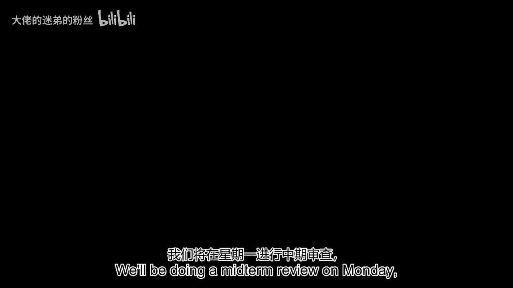
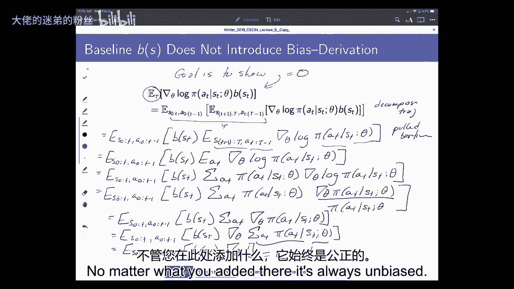
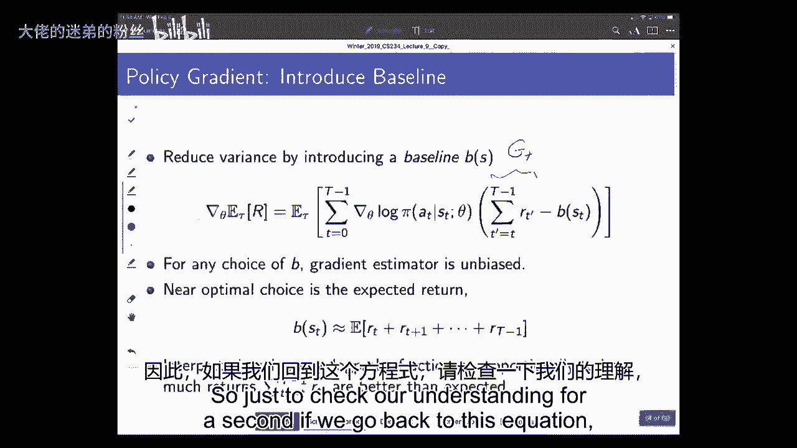

# P9：Lecture 9 - Policy Gradient II - 大佬的迷弟的粉丝 - BV1Cc411h7QQ

所有的权利，欢迎大家回来，在我们今天开始之前，我有什么关于后勤或期中考试的问题吗，或者类似的东西，星期一我们要做期中复习。

然后期中考试就在周三，嗯，因为班上有很多人，我们会把大家分散在几个房间里，我们会，呃，发出关于这件事的指示，可能有任何其他物流问题，学期期间就是上课时间，嗯说明也会在网上，但你可以带一页。

书面笔记的um，嗯，除此之外，一切都关闭了，书的数据类型，它必须被传递的地方，我想我们已经发布了一份政策地图，经过双重检查，已经，好的，在那之前让我们开始吧，我只想说声谢谢，给所有参与课堂反馈调查的人。

这对我和其他人都很有帮助，什么能帮助你学习，什么不能帮助你学习，好的，所以就，嗯，答复，所以注意，你知道所有这些事情，这个班大约有二百三十人注册，嗯，所以对你们中的一些人来说，如果你不给我反馈。

我很难知道什么对你有帮助，或者不帮助你学习，所以我们就用，人们给我们的反馈是什么，嗯，65%的人认为这是正确的节奏，大约27%的人认为它进展得太快了，只有大约8%的人认为进展太慢，嗯。

所以我们要保持大致相同的速度，就像我们以前吃过的那样，嗯，许多人指出，他们希望这是一个学期的课程，我会提到还有许多其他的课程进行强化学习，我非常鼓励你把它们，我提供高级班，本·范·罗伊通常在春天上课。

那更多的是理论上的，这是超级有争议的，我没想到会是这样的分裂，嗯，所以我们在周四和周五提供课程，上座率一直很低，我想我们大概有三到七个人来参加会议，嗯，所以我们认为这将是每个人都想拿出来的东西。

因为它是平分的，我让所有的助教比较，上班时间来上班的人，与来参加会议的人相比，嗯，我们大概有四到五个，X人试图去办公时间，试图去会议，所以我们要改在办公时间，这样我们就可以为尽可能多的人服务，嗯。

所以让我把它写在那里，所以我们要改在办公时间，现在，其他日子仍将提供会议，他们仍然会被记录下来，所以对于任何想在周四和周五去的人来说，你还是可以去的，你仍然可以在缩放上参与，或者你可以观看录制的讲座。

但我们要改在办公时间，因为我的助教们一直在说，他们有几个办公时间，他们要么不得不呆到很晚，或者他们觉得他们没有接触到一些人，又是这样，就服务最多的人而言，我会说当我经历这些回应时。

这真的让我想到了一个事实，在强化学习中，和顺序决策，嗯，我们总是为预期的回报而优化，所以这和我们在这里做的事情完全一样，我知道每个人需要的东西略有不同，我们只是尽力做好我们最好的工作和期望。

但这正是为什么像智能辅导系统这样的东西，其他的东西可能会更好，嗯好吧，就人们认为对他们很有效的事情而言，我们得到了许多关于做工作的积极评价，课堂上的例子，做推导。

很多人真的很喜欢我的iPad在周一出现问题的事实，所以我们在黑板上做了一些事情，所以我们会试着继续做相同数量或更多的导数，人们也普遍对家庭作业持积极态度，就我们反复看到的事情而言，所以我所做的是。

我得到了，我刚整理了所有的免费回复，试图寻找共同的主题和任何出现的东西，你知道的，三五次或更多我认为这是一个常见的问题，人们会喜欢解决，人们会更关注大局，解释，嗯，以及从玩具例子到现实世界的例子。

所以我们会尽量做到这一点，嗯，我也会试着确保我自始至终都在大声说话，几个人说，有时有时很难听到，所以我会努力做得更好，如果你在后面听不到我，请随意举手，人们想要更多的例子，嗯工作的例子。

所以我们要特别确保，在会话中，我们强调工作示例，甚至更多，让我再说一遍，如果这不是你最关心的事情之一，对不起，这学期我们不可能解决所有的问题，嗯，我们肯定，这是一种有趣的经历，这会让人们说完全相反的话。

有时就在一排，嗯，就它是如何整理的而言，比如，有些人不喜欢，幻灯片有空隙的事实，我在课堂上做推导，其他一些人真的很喜欢这样，我在课堂上做推导，嗯，有些人觉得它移动得太慢了，其他人说它移动得太快了，嗯。

所以再次，我们只是要努力做到最好，我们可以满足每个人的需求，所有的权利，所以今天我们将继续讨论策略搜索，那个，正如我之前所说的，这可能是最重要的强化学习，这学期你要学，我觉得这个现在应用非常广泛，嗯。

为了优化功能，我们可以在这里再次想到策略搜索，因为很多事情听起来都很像，当我们在做值函数逼近时，我们在这里考虑的是有一个参数化的策略，我们经常用θ来参数化它，但我们可以用W或其他任何东西。

但我们有一个参数化的策略，嗯，然后我们有一些政策的价值，我们要做的是，正在努力寻找，你知道的，好的最佳状态，试图最大化该政策的价值，我们在模仿学习后立即这样做的原因之一是，就是把它和。

你必须选择一个策略类的想法，指定参数化的方法，因此，从本质上来说，它是一个构建结构的地方，好的，所以作为回顾，我提到到目前为止我们已经在模型上做了很多工作，基于自由值的方法。

我们现在开始研究直接策略搜索方法，今天我们还将讨论更多关于演员评论的方法，我们保持的地方，都是，我们坚持，显式参数化策略和显式参数化值函数，也贯穿所有，你知道的，在过去的几周里，包括昨天或星期一，今天。

我们主要讨论的是案件，我们希望能够在非常非常大的状态空间中工作，我们为什么要把这件事做好，我们一般会，能够保证我们收敛到局部最优，我们并不总是保证基于值函数的方法，嗯，这可能很重要，呃，嗯，这很好。

这是一个很好的财产，嗯，缺点是，如果您通常使用策略梯度方法，我们只收敛到局部最优，上次我给你们看外骨骼的例子，他们使用全局最优方法，所以还有其他的可以基于rl的策略，并不总是能让你找到本地的解决方案。

但是基于梯度的方法通常会，我们谈论的另一个问题，嗯，试图解决这个问题的方法是，嗯，或作为解决，事实上，评估一个政策本身可能是相当低效和高方差的，所以我们之前定义的是一个策略梯度，在哪里，嗯，现在。

在我们考虑用θ来参数化这些东西之前，所以我们可以认为策略的值是由θ参数化的，或θ的pi表示参数化，但是我们经常会谈论值函数，因为最终值函数取决于策略，而策略取决于参数。

当我们思考我们想从这些算法中得到什么时，通常，我们真正想要的是，试图收敛到一个真正好的局部最优，我们通常对此没有太多的控制，但我们经常控制的事情，比如我们收敛到局部最优的速度有多快。

所以我们想让你尽可能快地沿着坡度走下去，如果我们在做一个基于梯度的方法，并尽可能地使用我们的数据，所以我们今天要更多地讨论的一件事是，当我们做这种策略梯度技术时，所以我们要向下移动。

现在我们要有我们的渐变，我们可以有我们的功能，所以这是vπ，这是我们的参数化圆周率，当我们向下移动到某个局部梯度时，嗯，如果当我们更新我们的政策时，它单调地改善，那就太好了。

所以谁能给我一个理由为什么我们想要单调的改进，以帮助保证趋同，答案是我绝对可以帮助保证收敛，虽然我和你们一样热爱数学，这是一个很好的理由，但也许我也在想一个经验原因，为什么我们也想要那个，是啊，是啊。

在后面，尤其是如果你要在高风险的情况下部署这些，所以我们以前看到的，事实上，我的一个学生昨天给你做了一个实习工作演讲，他为DQN展示了这张图表，它看起来是这样的，这就像表演一样，这就是奖励。

现在是时候了，当然它并不总是这样，通常当你去，当你读报纸的时候，人们顺利地跑了很多很多次，但通常看起来是这样的，当你穿越多个剧集或多个时间步时，就像你真的得到了一个非常参差不齐的上上下下的表演。

你对保单的价值，你像你做的那样奔跑，dqn，那么为什么这在，就像高风险的情况，是啊，是啊，在那边，就是这个名字，如果这是很高的赌注，你有好的东西，然后它就下去了，人们会生你的气，你现在做了更糟糕的事。

即使它以后会回升，是啊，是啊，那就是它存在于一个高风险的场景中，嗯，如果你这样做，你知道如果你的政策很有效，然后下一集，下一集，它真的很糟糕，即使以后可能会上涨，嗯，你知道你的老板可能会解雇你，嗯。

我是说，我开玩笑的，但我认为人们往往厌恶损失，而且在，可能不太好，你知道在一个公司说好，这个季度我们做得很好，下个季度我们要做，你知道更糟的是，但最终你知道，经过多次，嗯季度我们会做得很好，就像。

我们可能经常想确保我们是单调的，或者其他类型的高风险，场景或飞机之类的东西，嗯，只是人们可能无法容忍，如果你说这段时间我们会做得更糟，嗯，现在所有这些都有例外，但我想有很多情况下你真的喜欢单调的改进。

如果可以的话，所以说，我认为这是一个真正的除了理论上的好处，呃，它可以帮助我们证明事情，呃，它也可以是对人们有吸引力的东西，实际上能够部署，我们知道总的来说，人们很有风险，喜欢非常厌恶损失。

所以有单调改进的政策是非常好的，和DQN，许多基于价值的方法没有这些保证，嗯，我们也可以更多地讨论这是否总是可能的，嗯，在这方面，如果你想达到全局最优，只是我能证明的一个，虽然，在这些情况下。

关于您可以访问或看到的数据，所以从技术上来说，如果你的生活环境有分布，它可能与您的实际模拟或数据环境有些不同，对呀，你可能不一定有四个改进，即使在政策分级中也是这样吗，一个问题，也就是说。

我们什么时候会，你知道什么，这种单调的改进是什么，在什么条件下这将得到保证或可能，我们这样做是基于我们以前的数据吗，对未来做出一些假设，绝对收集的未来数据，我们将假设我们仍处于相同的决策过程中。

它是静止的，我的意思是，过渡模型和奖励模型是相同的，你知道你可能还没有观察到所有的状态，但在不同的剧集里都是一样的，所以我们不是在处理，事实上，你知道客户的偏好已经完全改变了，或者嗯。

你知道气候变化正在改变你的环境，我们正在处理这样一个事实，如果世界是静止的，那么我们现在就可以保证有单调的改进了，另一件事，否则我就给你看，在某些情况下，我们可以保证另一件非常重要的事情是。

我们希望在期望中表现出单调的改善，所以值函数是预期的，奖励，所以我们希望能说的是，是我们在环境中部署的一系列政策，它们的值函数在上升，那么这意味着什么呢？这意味着，我们希望它小于或等于vπ2。

小于等于Vπ3点，这是我们部署的策略，每次迭代或每一轮，它不能保证一次运行，这个政策更好，所以你可以很容易地拥有它，平均来说，你部署的策略更好，等，但对个别病人来说，这可能更糟。

我认为现在一个非常有趣的活跃研究领域是，安全加固，学习嗯，和安全勘探，很多不同的人都在想这个，我们在小组中看到的一件事是，如何真正有效地找到安全的解决方案，你说安全是什么意思，在这种情况下。

我是说你可能不想匹配最大预期回报，你可能希望能够最大化某种风险厌恶标准，我们想找到真正有效的解决方案，但有很多非常有趣的东西说，你知道的，我们如何尝试进行策略搜索，或者我们如何进行这种改进。

在我们不仅仅关心预期结果的情况下，所有的权利，所以我们今天要做的是，理想情况下，不仅仅是单调的改进，但是大的单调改进，嗯，正如您可能猜到的那样，尝试实现小的单调改进更容易，比保证真正大的单调改进，嗯。

有人有直觉知道为什么这是真的吗，我可能更难，这可以追溯到状态分布，所以如果你经常改变你的政策，国家是否，就你访问的州而言，州分布会发生很大变化吗，如此直观，答案应该是肯定的。

所以我们讨论了一些政策是如何诱导国家分配的，就像你运行了很长时间，你会在状态上有一个固定的分布，如果你的政策真的和你以前的政策不同，那么状态分布可能看起来真的不同，这意味着您可能没有太多数据，嗯，然而。

如果您的政策与以前几乎完全相同，你可能会有一个很好的概念，估计中的价值，但我们以后会有更多的讨论，所以我们今天要做的是试着思考超越，我们上次说的，我们试图做策略梯度方法。

我们试图以一种高效的方式来做这件事，我们将讨论其他方法，使它更有效率，噪音更小，然后尝试去单调的改进，所有的权利，我们上次讲的是我们一开始说，在政策梯度方面，我们可以做什么。

我们可以做的一件事是你做蒙特卡洛回归，这些是蒙特卡洛的回报，有时人们用tau的大r，这是一个轨迹，所以你可以用完你的保单直到世界毁灭，或者每一步，或者无论如何，你在定义你的剧集，嗯，然后看看奖励。

看看对面的奖励，你知道吗，每时间步长，我们也可以用，T表示我们从时间中得到的奖赏，第一集的T步，我们之前说过的是，这是对梯度的无偏估计，但是真的很吵，所以我们开始讨论额外的结构。

我们可以用在强化学习问题上，我们假设世界是马尔科夫的，试图减少这个估计的方差，我们上次讲的是使用时间结构，我们在黑板上做了一个人，直觉是你在某个时间点得到的奖励，嗯可以不受你后来做出的决定的影响。

所以你不必把行动概率的完整乘积，鉴于各州，因为未来的行动不会追溯性地改变，你早期对直觉的奖励，所以我们现在要开始讨论的是其他事情，这是蒙特卡洛的基线和替代方案，那么基线井是什么，基线是，让我们还是想想。

看看我们从这段时间开始得到的奖励总数，所以这和我们经常称之为GT的东西是一样的，这就是我们从这一步到这一集结束的奖励，我们将减去一个依赖于状态的基线，我很快就要展示的是，减去这个只取决于状态的基线。

您得到的梯度估计器仍然可以是无偏的，但它的方差可能不会低得多，尤其是，一个真正好的选择往往是预期的回报，它基本上是值函数，那么我们为什么要做好这件事，然后我们可以看看，我们增加一个动作的对数概率。

与它比基线好多少成正比，总的来说，它最终会有点像优势函数，那么为什么这是真的呢，好的，所以嗯，我们在这里要做什么，我们会说我们现在有一个很高的方差估计，如果我们没有想象我们没有这个，我们没有那个。

我们有我们的，标准估计数，我们上次说到，我想说服你的是，如果我们减去这个东西，它是状态的函数，一个期望，那个附加条款，我们减去的是零，这意味着我们的估计量仍然是无偏的，所以我说我们最初的估计是无偏的。

现在，我们在减去这个奇怪的东西，我们希望证明得到的估计器仍然是无偏的，我们这样做的方式是通过展示这一点，我们的目标是展示，这等于零，所以这就是我们要尝试做的，如果我们能证明。

那么这就证明了为什么我们可以减去这个随机的东西，然后我们可以开始讨论那个随机的东西应该是什么，但首先我们要展示，不管那个随机的东西是什么，如果它只是这个期望值为零的状态的函数，那么我们如何做好这件事。

首先在外面注意到，对tau有一种期望，这就是我们运行当前政策可能遇到的所有轨迹，所以我首先要做的是，我要把它分成两部分，所以这仍然是tau，我在这里所做的只是，我把它分成了第一部分。

这是一直到时间步骤T，第二部分是准时步骤T，一直到最后，所以我只是有点分解，我只是写了什么，嗯，一个轨迹是，然后分解成两部分，我在分解弹道，一旦我们这样做了，那么我们可以看到基线项只是t的函数。

所以我们可以把它从这个内项中拉出来，所以我们要把这个拉出来，因为它不依赖于这些未来的时间步长，它独立于那些，接下来我们要做的是，我们要写出或注意到这样一个事实，在这种情况下，我们在这个内部项中所拥有的。

这里是s t和a t，这样我们就可以再次放弃所有未来的条款，那种，这里唯一的东西是当时行动的概率，给定状态t和θ的步t，所以我们不需要担心未来的状态，或今后采取的行动，我们独立于那些。

所以现在我们拉出第一个，我们拉出基线，而现在，我们要放弃那些我们不需要依赖的东西，所以我们在这里所拥有的只是对所采取的行动的期望，现在我要做的是读，那么这个期望是什么，这是一个超过T的期望，有什么问题。

你知道的，那个期望是什么，我们只是要明确地把它写出来，这取决于我们的政策，所以我们要把这个概率加起来，那个，当然啦，这取决于我们遵循的策略乘以对数的导数，这就是我写出的期望，现在我要对对数求导。

所以这只是关于保单本身的导数，除以a t tθ的π，但是现在我们注意到分子上有一个项，就我们可以取消的分母而言，所以这开始简化，s的b乘以a的和，只是保单的导数，刚刚取消了分子和分母，我们注意到。

我们可以反转求和和导数，这是证明的另一个关键步骤，现在我们要做的是，我们要把导数移出，嗯，这只是一个，因为我们在策略下选择某些行动的概率总是，所以现在我们看到我们只是对1求导，所以我们试着对1求导。

当然，这是一个常数，所以这等于零，所以这很酷，这意味着我们在这个基线中添加了，那是某种功能，这取决于国家，我们还没说是哪一个，我们，你知道，我们还没有讨论所有不同的计算方法，但我们说是什么并不重要。

不管你在那里加了什么，它总是不偏不倚的。

所以只是为了检查我们的理解。

如果我们回到这个方程，如果我把st的b设为常数，梯度估计量仍然无偏，只要八分钟，和你的邻居聊天，说，如果我是这样，根据我刚才说的，如果s t的b等于一个常数，这是一个常数。

不带偏见只要花一秒钟或一分钟和你的邻居谈谈，所有的权利，所以让我们从每个认为它仍然没有偏见的人开始，投票，是呀，伟大，好的，是呀，它仍然必须是无偏见的，现在它是一个函数，甚至不是S的，它只是一个常数。

所以它肯定是s的函数，这是一个微不足道的函数，其中s的值是多少并不重要，所以它仍然是无偏见的，只是在这里注意一下，嗯，如果S是一个，如果基线是状态和作用的函数，你认为这个证据会通过不不对。

因为我们一开始做的一件事是，我们把B个S T一路搬了出去，如果这也取决于行动，我们不可能那样做，所以这是特定于这个存在的，只是状态的函数，不要给你一个公正的B，B有什么函数吗，如果b只是状态的函数。

他们都是无偏见的，是啊，是啊，所以它总是无偏见的，可能真的有我的意思是，就像我放在这里的，嗯，你可以输入一个常数，它可能根本不会减少你的方差，因此，基线的定义肯定是无用的，但都是无偏见的。

所以他们不会影响，你的估计量是否无偏，它们可能会使您的估计器变得更糟，如果他们真的很糟糕，嗯，或者他们真的是他们自己，嗯，非常糟糕的估计量，潜在的，嗯，他们当然可以让它变得更好，最终。

允许我们定义所谓的香草策略梯度算法，嗯，所以香草策略梯度通过，我们使用当前的策略收集一堆轨迹，然后每一次进入轨迹，我们计算从那个时间步到结束的返回，然后我们计算优势估计。

所以好吧，我们将写出香草策略梯度，好的，因此，香草策略梯度的工作方式如下，你启动，您使用一些参数θ初始化策略，你需要从基线的一些估计开始，好的，所以香草策略梯度发生的事情是为了迭代，我等于1到点，点。

点，我们要收集一组轨迹，使用当前策略，然后对于t等于一个点的每一个时间步长，点，点你轨迹的长度，然后你做两件事，您计算返回，这正好等于所有回报的总和，直到这一集结束，然后你计算一个帽子的优势。

正好等于这个返回，我会用i来参数化它，只是为了表明这是第i条轨迹减去s的b，在这里注意一下，嗯，这是到本集结束的奖励总和的回报，这是一个基线，就像一个固定的函数，所以这可能是，你知道的，深度神经网络。

这可能是表查找，但这是一个函数，你输入状态，轨迹中的T步，我和你输出一个标量，这就是基线在那里做的，然后我们做的是简单的政策梯度，然后我们把基线，所以在这种情况下，基线将是GS平均值的估计。

所以在香草策略库中，香草策略梯度，我们要做的是下一步，我们把到目前为止得到的所有轨迹加起来，我们把所有的时间步长加起来，我们基本上只是做一个最小二乘拟合，所以现在这个可以用像，这是监督学习。

我们只是有一个基线函数，可以参数化，我保证在那儿写上“i”，所以我们有一个基线函数，可以参数化，与一些完全其他的权重或参数，然后我们有回报，到目前为止我们所看到的，我们只是试着把距离最小化。

所以基线实际上代表了预期的奖励总和，注意，这在某些方面有点有趣，对，因为我们正在使用我们所见过的所有数据，所以这可以在你见过的所有数据上完成，也可以只做最近一轮，如何做基线有很多选择，嗯嗨。

如果你用你见过的所有数据，嗯，那么这就是它的作用，因为你有来自不同政策的数据，如果你在最近一轮中这样做，那么你就会得到一个基本的v pi的估计，v pi，我喜欢迭代，这最终将接近，如果你只是在轨迹上做。

如果你不这么做，但你把它和这一轮的轨迹相加，我想我写这篇文章的方式有点不清楚，所以让我看看我能不能说得更清楚一点，所以假设我们有一个，我们有D轨迹，所以如果我们这样做，那么它正好等于vπi。

所以i现在是迭代，d是我们在迭代中收集的轨迹，所以这只是对这个特定的保单的平均，的，这一特定政策的轨迹，3。我说我最近有点失常，有人对我们在这个案子里到底在做什么有什么问题吗，所以在这种情况下。

通常会有一系列的回合，这是每个人的，所以我们要吃一系列的馅饼，基本上，然后对于每个策略，我们将有一组轨迹，对于每个轨迹，我们有一组时间步长，这里所说的是所有轨迹的平均值，并将基线与当前策略相匹配，好吧。

一旦你有了，所以这给了你基线，然后我们更新政策，使用渐变，它将是包括这些导数的项的总和，关于政策，和你的优势功能，所以你要把你在这里计算的优势函数，然后你要把它乘以，在给定的状态下。

这些行为的概率是多少，θ是它的对数导数，然后我们把，把梯度的估计变成随机梯度下降或原子，别的东西，所以这是香草策略梯度，在今天剩下的时间里，我们将看到什么，只是这个基本模板上的一些不同的轻微变体。

所以我马上就去找你，但我只想强调，如果你，如果你当你离开，我想让你从，政策梯度的主要思想本质上是董事会上的东西，我们现在要做的是，2。我们买一样东西，我们从中得到了一堆数据。

然后我们必须适应一些类似优势的东西，会有不同的计算方法，我们最终可能会做自助，做某种TD估计，或者我们可以直接用回报，我们经常使用一个随着时间的推移而拟合的基线，然后我们要更新政策。

并且必须根据梯度选择一些步长，所以最重要的是说，嘿嘿，几乎所有策略梯度算法都有一个基本模板，我可以选择不同的东西插在这里，我可以选择不同的方式来调整我的步数，这将定义一系列不同的政策，你看到的渐变算法。

那么我们用什么函数来表示圆周率，这样我们就可以把它的梯度，大问题，所以我问你知道，我们如何表示策略，这样我们就可以把它的渐变，我们必须能把这个放在这里，我们上次简短地讨论过这个。

但它也在接近尾声的黑板上，高斯工作，软马克斯，两者都是你可以分析求导的，我们经常使用深度神经网络或浅深度神经网络，是呀，我在后面看到一个问题，先说出名字，拜托了，我想知道是否有什么问题，像非站。

如果我们像，神经网络的基线，如果有不稳定的问题，是啊，是啊，这是个很好的问题，所以我相信问题是说，嗯，你是，你在问我基线，对呀，就像，你怎么会在那里，非平稳问题，经验上，包括我在内的很多人都在想，嗯。

我们有所有其他的数据，所以当我们现在估计梯度时，通常我们在运行策略，只是你知道D轨迹，然后我们用它来估计梯度，嗯，也许我们可以使用其他数据来做到这一点，但最终却不在政策范围内。

因为这样你就把数据混合在一起了，你从不同的政策中收集到的，经验上，我认为人们最终往往只使用当前运行的数据，然后你基本上只是用这个估计v pi，您不一定要为许多其他策略混合数据，经验上。

似乎经常在政策上很有帮助，你可以重新加权旧数据，但这引入了方差，所以从经验上来说，往往是最好的，我想陪审团还没有定论，对它的研究正在进行中，我们已经看过了，谢尔盖·莱文的小组已经研究过了，但是嗯。

大多数时候，使用on policy数据是有意义的，是啊，是啊，还有问题吗？拜托了，我只想确认一下，所以当你说改装基线的时候，我们在设定基线，等于使函数最小化的值，挺酷的，是的，是的，是啊，是啊，这里。

如果我们这样做，当我们这样做的时候，它本质上是，这基本上和我们做蒙特卡洛政策评估时一样，所以这几乎完全像蒙特卡洛的政策价值，我们有固定的政策，然后我们有一个参数化的函数来表示它。

然后我们只需要符合这些参数，这样我们就可以最好地估计政策，好的，所以我要，有一点关于自动差异的信息，你可以在幻灯片上查看，我们接下来要经历的事情，嗯正在考虑这方面，正如我所说的，然后我们谈谈这个。

所以这部分是我们思考单调改进的地方，因为一旦我们有了渐变，我们得弄清楚要走多远，我们能保证根据我们走多远，我们是否会得到单调的改进，这部分是关于更好地估计我们的梯度，理想情况下。

用更少的数据并减少它的方差，所以它们都很重要，他们做的事情略有不同，所以让我们来谈谈，我们能提前一点吗，请谢谢，好的，就像我们之前开始谈论的，嗯，呃，嗯，让我们，让我们先谈谈，基准。

那么我们应该如何选择基线呢，我们可以为基线做的一件事是喜欢，我们在那里看到的，这是对V pi i的经验估计，所以我们可以说，一般来说，我们只想用v pi i作为基线，这意味着我们必须以某种方式计算它。

我们估计这可能来自蒙特卡洛，也可能来自TD方法，到目前为止，我们看到的是用这些作为一个，如此如此，我猜，我想说清楚，有几个不同的地方我们可以，也许在做蒙特卡洛回归和做TD之间切换，就像一个在这里。

另一个是我们的基线，好的，所以我们在这里有一个基线函数，我们在减去，我们这里也有一个G T素数，所以如果我们再想想我们的一般方程，在这个例子中我们得到的是θ的δθ，这是我们的参数。

这是指定我们的策略参数，我们说过这约等于1/m，i的和等于1到m的奖励，嗯，我把这个放进去，和等于0到，改变我的想法，好的，我要把这个放在这里，因为它最终会成为，一个我们可以用很多不同方式使用的函数。

这是我们一直在研究的基本方程，我们说过，该值对我们的策略参数的导数，近似为m个轨迹之和，我们从政策时代取样了这些轨迹，我们在那个轨迹上得到的总奖励，总时间之和，保单派生的步骤，嗯。

鉴于我们在该州采取的行动，我们很好，我们说很吵，嗯，但不带偏见，现在我们可以把它作为一个目标，所以这是对保单价值的无偏见估计，现在我们可以考虑用其他东西代替，所以我们可以想象在这里做各种各样的事情，嗯。

你知道的，TD或MC方法，如果我们用值函数来做，或者如果我们试图显式计算一个值函数，或状态动作值函数，那么我们通常称之为批评家，所以一个批评家，所以当我们谈论演员的时候，批评方法。

这时我们有了策略的显式参数化表示，我们有一个明确的，状态动作值的值的一般参数化表示，如果我们有，然后我们可以想象用它来改变我们的目标，我想在这里强调的是，所以演员评论家的方法结合了。

这两者结合了政策加上批评，其中最受欢迎的可能是三C，由in和al组成，这是在二十六个ICML中引入的，它非常受欢迎，这是深度神经网络的版本，但是演员，批评家的想法本身已经存在了更长的时间。

但是三C是最流行的版本之一，对于深度神经网络，所有的权利，那么我们如何用值函数排序策略梯度公式，你可以在这里做什么，我会把你能做的放在这个网站上，你可以得到几乎和我们以前一样的方程。

所以相对于值函数等于期望，相对于你可能遇到的轨迹和，在这个轨迹中的所有时间步骤，关于策略参数的导数，s t w的q减去s t的b，所以这里没有你的蒙特卡洛估计，你可以插入你对Q函数的估计。

另一种表示方法是如果我们认为这是对价值的估计，这基本上是我们的优势函数，但它可能是我们的所以我们在这里有一个优势功能，您在这里定义优势函数，但这是那一集蒙特卡洛回归的功能，这是一个不同的优势函数。

也就是Q函数，一个批评家可以坚持这一点，减去你的基线，它是值函数的估计，所以它们看起来很相似，但是你可以在这里插入不同的选择，这些将有不同的权衡，所以蒙特卡洛对回报的估计是无偏的，当前保单价值的估计。

这将是有偏见的，所有的权利，所以我也想在这里强调当我们考虑，得到这个估计器，我们常说批评家要计算这个估计量，嗯，不一定是，只有TD估计或蒙特卡洛估计，但是你可以在这些之间插值，它通常被称为n步返回。

那么这意味着什么呢，所以让我们打电话，让我们把这个写在一个稍微好的地方，我把这个叫这里，所以让我们把这个当成帽子，请注意，你可以把这看作是一个函数，它将是对状态作用值函数的估计，所以我们可以拥有的是。

我们可以有一个估计器，从时间步T开始的值的估计值，等于实际，这是真的，我们准时到了，所以我把这叫做，我要把这种i逗号叫做一，这将是，那么实际的奖励，你很准时，进来吧。

一集i加s t的gamma v加i so，这应该看起来几乎完全像TD风格的估计，我们之前谈过这个，所以这说明我得到了，我看着我得到的实际即时一步奖励，然后我引导，我加上价值。

这将是我为我的批评家得到的这个值函数，我会把它插进去，然后那就是我的目标，然后我会在这个方程中使用，所以这是你做的一件事，你可以做，所以我们看到了这个，我们见过很多这样的事情，我将称之为无限或蒙特卡洛。

这个是你对所有质数的和，一直到这一集结束伽马到T素数减去T，这是蒙特卡洛回归，我们只是总结一下，我们不做任何自举，我们总结了这几集的所有奖励，但正如你在这里看到的，应该有一个。

你知道可能有某种方法可以在这两者之间插值，这些通常被称为n步返回，所以，比如说，你可以这么做，你可以说我会在时间里加上奖励，我和我当时得到的奖励，步t加一，然后我要引导，所以说。

这只是介于这两个极端之间的估计量之一，一个是你只接受一步奖励，另一个问题是你是否总结了所有的奖励，然后你可以在这些之间做一大堆插值，你为什么要把它做好呢？这个通常会有点偏差，但方差小，这将是公正的。

但方差真的很大，没有理由假设，最好的解决办法是在这两个极端中的任何一个，所以你可以在TD估计和蒙特卡洛估计之间插值，所有这些都只是形式返回，然后你可以从基线中减去，所以传统的。

所有这些可能被认为是一个超参数，我们可以通过验证和交叉验证来选择，人们在这里所做的是计算密集型的，所以你只需要挑一些东西，问题是他们是否在做一个破碎的机器学习，这将被认为是某种超参数。

你知道你可以把这变成N，你会决定你做多少步，人们做什么，问题是做什么，在强化学习中，人们会这样做吗，还是觉得太贵了，你当然可以，我觉得这是个有趣的问题，我觉得在这种情况下人们所做的把戏。

我想我可能会看到更多这样的东西，但变化更大，在大量引导过程中使用TD Zero，但这可能取决于您的应用程序域，它可能依赖于的另一件事是，如果你的域真的是马尔可夫的，所以这个案子还在工作。

这是给你一个真实的估计你的政策回报，即使你的域不是马尔科夫，在这种情况下，你在做一个更强烈的马尔可夫假设，嗯，你也可能想做一个，根据您的领域做不同的事情，以及收集数据的成本，所有的权利。

所以这给了我们一种不同的方式来插入东西，到普通策略梯度算法，我放在那里，这样你就可以插入这些目标，在偏差和方差之间进行权衡，当你对梯度进行估计时，所以这个在这里做的是，它正在改变我们的目标，它在改变。

我们如何计算梯度，但接下来我想说的是这部分，一旦我们得到了渐变，然而我们选择了得到它，我们必须弄清楚沿着梯度走多远，为什么这很重要，嗯，可能很重要，因为，嗯，这只是一个局部近似，你得到了梯度的局部估计。

是啊，是啊，更新参数的频率，问题是你多久更新一次批评家的参数，这又是一个很好的问题，视情况而定，这样你就可以，要么，您可以经常异步地这样做，所以你可以为你的评论家提供不同的线程和不同的网络，和你的政策。

嗯和原理，你可以一直更新你的评论家，就像你知道的，您可以为此使用DQN并进行很多很多的备份，嗯，总的来说，这要看情况而定我想你需要有一个时间表，是啊，是啊，很多时候你可能会做大约一百个。

它确实因应用而异，嗯，但是没有理由评论家只需要在相同的时间表上更新，您正在更新策略，异步执行通常很有意义，所有的权利，所以如果我们想想这里发生了什么，这是我们的参数化策略，这就是我们的价值。

我们有一些疯狂的功能，然后我们计算我们的梯度，所以在这里，事情看起来很线性，事情看起来很好，但当然，当我们走得更远时，就像这里一样，会很糟糕的，就像如果我们，如果我们试图沿着梯度走得太远。

我们将得到一个与实际价值非常不同的估计，实值函数，所以当我们测量步数时，在这种情况下，最后很重要的是要考虑到这个事实，你希望你的步数有多大，嗯，让我回到一分钟前，如果我能，好的。

所以我们想知道我们应该在梯度中走多远，这很重要，嗯，现在你可能会说，好的，这总是真的，对呀，就像，你要时刻小心，当你在任何监督学习问题中做梯度下降或上升时，当你使用随机梯度下降时，当然。

你不想在你的步数上走得太远，因为你可能会超调，然后嗯，你在用这个线性近似，而且很糟糕，呃，为什么有人这么做，有人知道为什么，这可能更糟，在强化学习案例中，考虑步长可能更重要，这与数据来自哪里有关。

当你有一个糟糕的政策，那是俱乐部，你可能会去那个房间，那么什么是完全正确的呢，所以它不是在监督学习的案例中，您的数据是由iID分布生成的，你刚刚为你的随机梯度做了什么选择并不重要，在RL中。

这决定了下一个策略，我们在迭代中使用它来收集数据，所以我们不会，你知道的，如果我们采取一个非常糟糕的，如果我们得到非常非常糟糕的政策，我们可能没有得到关于这个函数的实际最佳状态的数据，所以更重要的是。

仔细想想我们要去哪里，理想情况下，希望得到单调的改进，所以这是真的，嗯，这在强化学习案例中非常重要，想想我们是如何做这个步长的，因为这决定了，在我的一个同事谈论类似问题的一个版本中。

他有一张走鹃从悬崖上跑下来的照片，对然后，如果你在一个地方，你的政策真的真的很糟糕，你可能不会得到更多有用的数据，那你就不能得到一个好的估计，在渐变的地方，然后你就被困住了。

你可能会陷入非常非常糟糕的最佳状态，好的，所以我们要仔细考虑这一部分，嗯，所以我们可以做的一件事是做一些类似线搜索的事情，所以我们现在说的是，我们该怎么办，所以说，如何做步长，所以我们可以做的一件事是。

试着沿着渐变做一些线搜索，这样就可以了，但是有点贵，所以很简单，它倾向于忽略线性近似好的地方，所以我们想做得比这更好，所以现在我们要回到我在开始时提到的那一点，这是我们真正希望能够做到的。

就是我们在做这个更新的时候，我们希望确保单调的改进，所以我们可以选择我们的步长，或者选择沿着梯度走多远，以实现单调改善，所以我们的目标是我们想拥有它，所以i加1的v pi大于或等于v pi，和。

我们希望通过改变我们的步长来实现这一点，让我们再想想我们的目标函数是什么，嗯，所以我们得到了，我们有我们的价值，我们的参数化值，所以θ中的b等于我们政策下的期望值，它是由t=0的和的θ定义的。

根据我们的政策，伽马T的无穷大，这就是我们观察一系列状态的地方，我们得到了我们的政策，这就是我们这里的基本方程，在表示参数化策略的值方面，我们想做什么，这里是我们想要一个有更好价值的新政策。

但问题是我们有一份旧保单的样本，所以当我们这样做的时候，我们正在收集政策与皮尼，然后我们试图计算出我们的πi加1应该是多少，所以这将从根本上涉及，嗯，所以我们可以访问，你。

可以获得从θ的圆周率中采样的轨迹，我们现在想预测θ的π的v的值，我把πi i加1，所以我们想，现在，弄清楚一个新的值是什么，如果我们更新这些，以某种方式更新这些参数，并获得最大值。

你知道我们想弄清楚新的参数是什么，但这从根本上说是一个政策问题因为我们有上一次政策的数据，好的，所以我们要做的是，我们首先要表达，嗯，就优势而言，我们政策的价值，哦，就我们的新政策比旧政策的优势而言。

我们的新政策的价值，所以我现在要向下移动新的政策梯度，好的，所以我们有的是，我们有波浪形的v，所以那可能是。

就像，我们的新参数化策略，将等于我们旧的参数化策略的值，所以不管我们以前有什么，加上下面，我们将得到的州和行动的分布，如果我们执行我们的新政策，现在我们不知道，但让我们，让我们忽略这一点。

t的和的一秒钟等于0到无穷大，伽马到T，优势圆周率，所以这通常是成立的，嗯，这不一定要做任何事情，嗯参数化，这只是说任何政策的价值，这里用圆周率作为参数，等于另一个策略的值。

加上你在目标下达到的状态和行动的总和，你接受这项新政策比旧政策的好处，所以这就表达了我们如何说，什么，新保单的价值与旧保单的价值有何关系，这和旧的价值观政策完全一样，加上如果你执行新政策。

你会得到的好处，看看你会遇到的状态动作分布，我告诉他们好处，下标应该是策略吗，嗯是的，所以我们在做，我把这个写下来，所以这个问题很好，让我把这个写出来更正式一点，好的。

所以我们得到θ的v加上所有状态的和，我们要用s的mu pi波浪，所以要记住，这是平稳分布，嗯，我们用它来表示我们将达到的状态上的静止分布，如果我们执行我们的新政策，它是参数化的Tilda，好的。

所以这里的意思是T和T在我们想要的政策下，这里的优势是使用旧的，所以这让我们可以比较，所以它的作用是让我们比较，这是在，所以它允许我们比较它有多好，如果我们采取新的行动，所有的权利。

但问题之一是我们不知道这一点，两个中的一些，哦，太谢谢你了，是啊，是啊，是啊，是啊，是啊，是啊，也如此如此，问题是，有没有，谢谢你让我澄清，所以在这种情况下，我们所做的是，我们对所有的时间步骤都有期望。

这是在我们将到达的轨迹上说的，根据我们的新政策，我现在重新制定了，说得很好，我们在状态上有一个平稳分布，如果我们看看，达到那些状态的概率是多少，然后我们根据优势来权衡。

所以我们从一个平均的时间变成了一个状态，平均，那是有道理的，所以我们可以把我们的值函数，平均我们的值函数跨时间步长，或者我们可以认为这里是所有州的平均值，每个州是什么。

遵循新保单和旧保单的相对价值是多少，青少年做什么，哦对不起，谢谢。然后呢，那些是错别字，所以我们把这个，所以这将是在，所以我们看看每个州的州，按照我们的新政策，我们达到那种地步的可能性有多大？

相对优势是什么，你指的东西不应该，不应该，哦对不起，我们这里有一个波浪形，这是我们原来的价值，加上对所有州的加权优势，所以我在这里做这个只是为了明确高度，我会说皮蒂尔德也是，圆周率参数化，这是一项政策。

以波浪参数化，我只是说这就像，期望你是第一个迹象，你写的，就像你没有演出的时候，所以我只是其中之一，好的，是啊，是啊，我们也不能投票，我只想说清楚，嗯，这个符号经常在使用，你想制定明确的政策吗。

这只是参数，我认为在这里有一个政策和参数更清楚，但我们也经常使用，你可以直接用θ参数化值函数，与θ{\displaystyle\theta}的v pi{\displaystyle v pi}相反。

但我要用这些中的任何一个都可以，有人困惑于，这是，我是说，如果更容易的话，我可以这样走，我可以把这些都去掉，好的，所以这只是每当我说pi tilde，这是由新的参数化的策略，那是你们的新政策，就是这样。

我知道这份爱，所以我们对此有什么问题吗，你是最后一个，名字第一，所以我想我有点困惑，主要是因为它和幻灯片有点不同，我只是想知道幻灯片不会有什么不同，但我想上去想知道，那么在这种情况下。

我们是否对给定状态的可能作用进行求和，或者正如这里指出的那样，我们是否假设我们在每个，呃，使用策略，这就是我们这里的，所有的权利，我忘了，所有的权利，我要走了，再做一次，好的，好的，让我们说。

波浪形的v，与幻灯片完全相同的符号等于θ的v，状态加和，我们在s的圆周率上的平稳分布，这是我们得到的分布，这是我们目标政策下的贴现加权分配，所以这是加权的事情，这是各州下的加权分布。

我们从时域到考虑各州时间的分布，看看我们在目标政策下可能采取的所有行动，以及与我们以前的政策相比，每一种政策的相对优势，这个看起来应该很，在某些方面与模仿学习非常相似，就像这样，我们又在想。

而不是考虑随时间步数的奖励总和，我们在考虑，在新政策下，我们可能得到的固定分布是什么，这与我们在旧政策下的固定分布相比如何，到目前为止，我们看到的是，我们正在研究目标策略下的固定分布，问题是。

我们不知道这个，所以我们不能计算这个，这只是一个表达，但这是未知的，我们没有皮蒂尔德的样品，我们只有圆周率的样本，所以我们不能计算这个，我们为什么要回去，我们为什么要做这些，我们正在努力做到这一点。

因为当我们做香草策略梯度时，我们将设法制定一项新政策，这比我们的旧政策有更好的价值，我们在这里做的是，我们试图估计现行政策的导数，嗯，但我们还不知道一旦我们迈出这一步的价值，所以我们在这里想说的是，嗯。

我们能理解一项新政策的价值吗，在我们执行它之前，我们要试着把它与，我们以前的保单有什么价值，加上旧政策和新政策之间的某种距离，根据我们可以实际评估的东西来理想地计算，使用我们目前的样品。

那就是我们要去的地方，所有的权利，所以我们有一个很好的表情，但我们无法计算，所以我们要做一个新的目标函数，我们要把这个倒着做，因为我们要弥补，然后我们将展示为什么这样做是一件好事，我们想做什么。

我们想用这样的东西，如果我们有这个，然后我们可以比较新保单和旧保单的价值，问题是我们没有这个，因为我们没有，新政策下的固定分布，所以我们要做的，相反，我们将定义一个目标函数l pi，它是这样的。

这是你旧保单的价值，加上你所有州的总和，平稳分布，旧保单的折扣分销，这就是它不同的地方，所以这是旧的，您目前的政策，然后表达式的其余部分看起来是一样的，现在注意我们可以计算这个，好的，这是，嗯。

我们可以把当前这一集的所有轨迹平均一下，我们可以从当前的数据估计我们的平稳分布，我们可以知道新政策的作用，所以如果有人给我一个新的政策，我可以计算这个，我也可以评估优势，好的。

因为这个优势只根据我以前的圆周率来定义，只要我有状态动作值函数的表示，因为我以前的政策，我可以评估一下，所以现在所有这些都是可以评估的，这可能不是一件好事，但我们可以计算出这是传入的，i作为参数。

我只是传入θ，然后把它给圆周率本身，是呀，就符号而言，是否是的，我把圆周率和，你可以想到有一些计算的新参数，所以我们的策略总是由一组参数参数来参数化，你可以把这看作是一项新政策。

或者你可以把它看作是新的参数要么很好，你能解释一下，如果给你，嗯嗨，告诉我为什么你不能计算，呃穆，你没有那么多，所以问题是，如果你得到新政策的圆周率，为什么你不能计算亩，这是个好问题。

因为你没有任何数据，所以有人给了你一个新政策，可能有接近这一点的方法，但你现在掌握的唯一数据来自PI的当前旧策略，所以你已经把这个用完了，m次，你有m的轨迹，这是在你的旧政策下收集的M轨迹。

你没有任何来自圆周率的数据，一般来说，如果圆周率和圆周率不一样，你会得到不同的轨迹，所以你没有任何对每个人都有意义的直接估计，所以如果我们回到香草政策梯度，我们该怎么办，我们有一个政策，皮尼。

我们运行了它，我们得到了圆周率的d轨迹，我们可以用它来估计给我们的政策数据，我们所经历的状态和行为是什么，当我们跟着圆周率，我们没有圆周率的任何数据，我还加了一个，我们还没有运行它。

旧策略的平稳分布估计，呃，你基本上看所有的数据，你有像所有的轨迹，看看你在一个状态下花费的时间有多少，原来如此完全正确，你会怎么从这个，只是原始数据，这些到MU的D轨迹，你可以数数。

你知道我是说总的来说，如果你在很高的维度，你想做一些比那更流畅的事情，你想近似密度函数，嗯，但本质上你可以直接在一种状态下，你可以数数，看看我有多少次达到这种状态并采取这种行动。

然后这将给你一个直接的估计，嗯，一般的缪斯，你会想要某种高维的参数函数，但你可以用你可以，你可以想象这本身就是参数化的，您可以使用现有的策略数据来适应它，直觉上做这项工作。

因为我们假设各州的分布在政策之间不会有太大变化，我的问题是直觉上的，为什么这项工作，3。我还没有告诉你这是为什么，我刚说过这是我们能做的，它是可计算的，我还没有告诉你为什么这是一件好事，但我们要证明。

嗯，这将允许我们得到一个下界，然后我们可以在那些下限上改进，好的，所以这里有一件事要注意，也就是说如果你这样做，如果你做圆周率的L，这就是目标函数，如果你把旧政策插在那里，这正好等于V，因此。

如果您在相同的策略下评估此函数，它只是给你价值，如此保守，我就简短地说几句，我们以后得继续这样做，但是嗯，所以我们可以用它来做所谓的保守策略迭代，保守，嗯，这里的直觉是，让我们先从混合开始，混合政策。

所以想象一下你有一个新的政策，混合了嗯，旧政策和不同的东西，所以你有一个负阿尔法乘以你的旧政策，加上阿尔法时间，一些新政策，π质数，所以这只是意味着你把一些旧的你目前现有的政策，你混合了其他东西，好的。

那么在这种情况下，您可以保证新保单的价值大于或等于，如果你在这里取这个目标函数，你用你的新政策来评估它，所以你拿着你的新政策，根据你的旧政策，你很重视它，你把它插进去，那是可计算的。

因为您有旧策略中的数据，负2εγ，1-伽马平方，α平方，这样您就可以降低新策略的值，不管这个目标函数是什么，当你计算它减去这个表达式时，嗯，我只想用另外两个想法来结束，再次注意，如果你插入，α等于零。

这意味着π新和π旧是一样的，这就归零了，这意味着既然我们知道这等于那，只是说你的新保单必须大于或等于你的旧保单，因为同样，他们的政策都一样，说紧，好的，所以我们，这与我们预期的有点不同。

因为PDF的技术挑战，呃，所以我要用这里来结束，我们接下来要做的是展示，我们可以用它来导出新值函数的下界，我们基本上可以证明，如果我们提高了下限，我们保证实际值函数是单调提高的，所以我们会经历的，嗯。

我还没有决定，我们星期一是否会完成那件事，因为那是中期审查，或者我们是否会等到期中考试后的下周，政策梯度作业要到期中考试后才会发布，所以我们有更多的时间，我会经历，也喜欢政策梯度的主要外卖。

当我们结束这一部分的时候。

