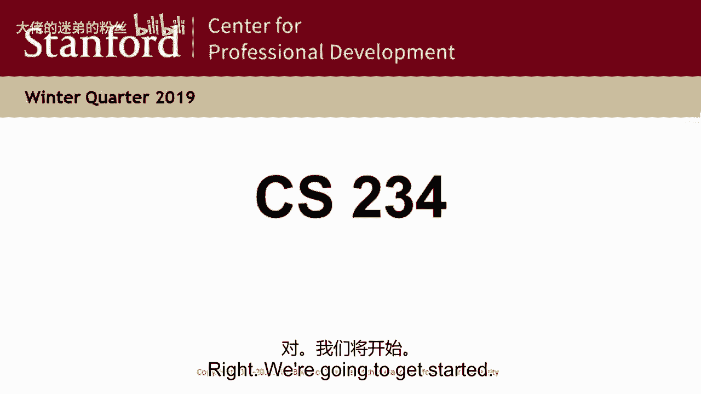
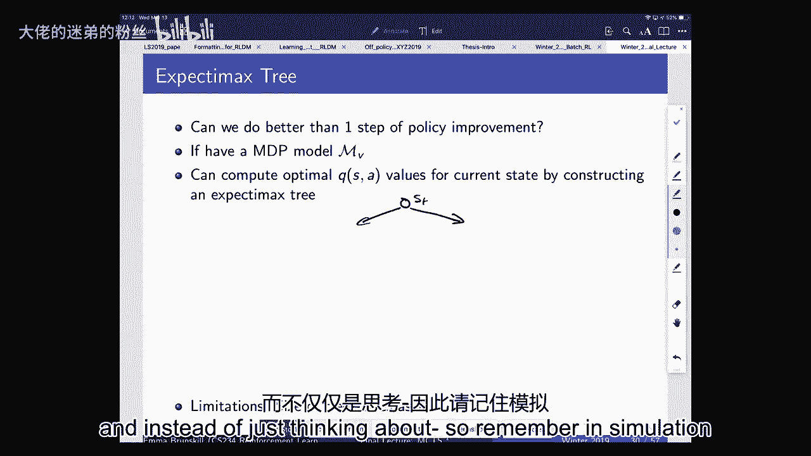
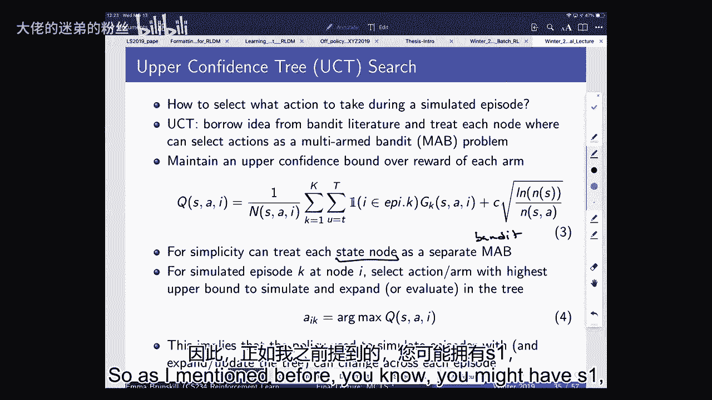
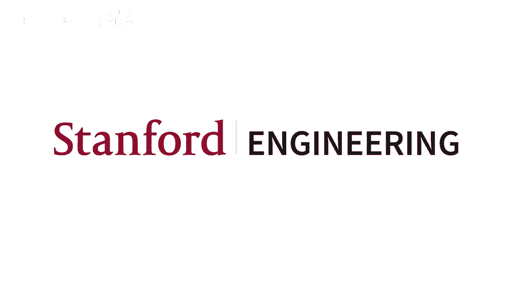

# 【强化学习】斯坦福CS234课程：强化学习中英文字幕 - P15：Lecture 16 - Monte Carlo Tree Search - 大佬的迷弟的粉丝 - BV1Cc411h7QQ

所有的权利，我们要开始了，这是本学期的最后一堂课，当我们开始的时候，我只是一些后勤方面的事情，嗯，所以只是一个友好的提醒，该项目定于20日11点59分完成。m，没有迟到的日子，然后海报展示在周五早上8：

30，你也需要提交你的海报，并同时在线提交到等级范围，我们会提前开放提交，也没有迟到的日子，你应该收到一封电子邮件，里面有关于海报会议的一些细节，任何问题都会向我们提出，所以我们现在有任何问题。

所以最后一周的办公时间，下星期我们没有办公时间，对大多数人来说决赛周，嗯，但你可以在广场上联系我们，或者如果你有额外的问题，你知道吗，我们很高兴有时间，所有的权利，所以我们今天要做的是，所以上一次。

当然是测验，我们会发出，我们的目标是送出成绩，对于每个接受它的人来说，星期一今天把它们送出去，我们快把这些评分做完了，为此有一些人仍然很晚才上，所以我们要给SCPD打分，但其他人应该得到他们的测验分数。

谁拿走了，星期一今天应该能拿回来然后今天我们要做的是，我们要谈谈蒙特卡洛树搜索，以及讨论一些最终的东西，那么为什么蒙特卡洛树搜索，嗯，这里有谁听说过阿尔法戈，所有的权利，是呀，所以我的意思是，阿尔法戈。

你可以说是上一个人工智能的主要成就之一，你知道的，十到二十年，这真的是一个惊人的成就，这比预期的要快得多，是啊，是啊，在棋盘游戏围棋上打败人类，这被认为是一个极其艰苦的游戏。

所以蒙特卡洛树搜索是取得成功的关键部分，加上很多其他附加的东西，但这是我们没有太多地谈论的方面之一，到目前为止在课堂上，所以我想说到蒙特卡洛树搜索，所以你对这背后的一些想法很熟悉，因此。

Alphago um背后的一些想法是有用的，还因为当我们开始考虑蒙特卡洛树搜索时，这是我们思考基于模型的强化学习的一种方式，这是一个非常强大的工具，我们还没有谈论太多。

部分原因是我们在模型的深度学习案例中没有看到太多的成功，我很乐意在今天或离线时更多地谈论这一点，但我认为未来，这可能是一个真正富有成效的研究途径，我们可以讨论为什么这在alpha中特别有用。

所以我们要做的，首先，就是，我们要再谈谈，关于基于模型的强化学习，然后我们将讨论基于仿真的搜索，这就是蒙特卡洛树搜索的地方，其实只是因为每个人都上不同的课，我很好奇这里谁报道过蒙特卡洛树搜索。

在另一个班，刚刚是几班，二，三，它被提到有点像，它其实非常，是啊，是啊，是的，是的，三十七，这是一个一般的游戏，哦耶，一般的游戏将是一个很好的一个来，把它带进来，好的，酷，哦。

也以防万一人们在最后感兴趣，我还会提到一些其他的课程，在那里你可以学到更多关于强化学习的知识，所有的权利，所以基于模型的强化学习，嗯，我们这学期讨论的大部分内容，虽然不是全部。

但是我们这个学期谈论的大部分，尤其是当我们谈论学习的时候，这意味着我们不知道世界是如何运作的，嗯，我们在考虑要么学习一个政策，要么学习一个价值函数，或两者都直接来自数据，嗯，我们今天要讲的更多。

是说学习一个特定的模型，所以只是为了提醒自己，因为已经有一段时间了，是啊，是啊，我们将讨论学习，我们谈了一点，也许我不知道一个数字，几周前，我也在探险中上来了，但一旦你有了模特，你可以用计划来做。

只是为了刷新我们的记忆，规划是我们把一个已知的世界模型，然后我们通常使用值迭代或策略迭代或动态规划，尝试为这些给定的模型计算策略，与之形成鲜明对比的是，当然啦，我们已经讨论了很多关于模型免费RL的问题。

在没有模特的地方，我们只是直接从经验中学习一个价值函数，现在我们要从经验中学习一个模型然后计划使用它，现在我们所做的计划，除了经典决策中已知的方法之外，比如动态编程，也可以是我们讨论过的任何其他技术。

到目前为止在课堂上，所以你知道，一旦我们有了这个，这是一个断开，是一个模拟器，所以一旦你有了，你可以用那个模拟器做模型免费RL，或者你可以做政策，搜索，或者其他你想做的事情。

因为你有一个世界模型基本上就像一个模拟器，你可以用它来产生经验，也可以做一些事情，比如动态编程，你可以做所有这些事情，所以一旦你有了一个世界模拟器，那就太好了，缺点，当然啦，可以是。

如果那个模拟器不是很好，这对最终的估计有什么影响，好的，所以再想想，我们有我们的世界，它产生了行动、奖励和状态，嗯，现在我们要考虑明确地尝试对这些进行建模，所以在很多情况下。

你可能知道奖励功能并不总是有很多实际应用，你就知道奖励功能了，所以如果你设计得像一个强化物，基于学习的客户服务系统，你可能有一个奖励功能，比如订婚或购买，或者类似的东西，但你可能没有一个很好的客户模型。

所以有很多实际的例子，你需要学习动力学模型，含蓄或明确，但奖励功能本身可能是已知的，所有的权利，那么我们如何从循环的角度来考虑这个问题，我们考虑拥有，嗯，一些经验，所以这可能是像你知道的那样的事情。

国家行动奖励，下一个状态元组，然后我们将其馈送到模型中，这将输出一个奖励或一个过渡模型，我们用它来做计划，可以是动态编程，也可以是Q学习，或者我们在这里看到的许多其他技术，策略搜索。

然后这必须给我们一个选择行动的方法，所以这必须给我们一个动作，然后我们可以在这里使用，我们不必计算全值函数，我们只需要知道下一步该采取什么行动，我们要利用这一点，当我们到了蒙特卡洛树搜索。

我们不一定要为世界计算一个完整的值函数，我们也不必有一个完整的政策，我们所需要知道的就是我们应该为这个特定的行动做些什么，所以它的一些优点是，嗯，有很多监督学习的方法，包括深度学习。

我们可以用它来学习模型，他们中的一些人是好是坏，超级呃适合，所以我们的跃迁动力学通常会想到一个随机的，所以我们需要有监督的学习方法来预测分布，嗯奖励模型，我们通常可以把它们当作标量。

所以我们可以使用非常经典的基于回归的方法，基于模型的强化学习的另一个好处是，就像我们所说的探索，嗯，我们经常可以有明确的模型来克服我们对模型有多好的不确定性，一旦我们对我们的世界模型有不确定性。

我们可以利用这一点来传播我们所做决定的不确定性，所以在土匪案中这很直接因为在土匪案中，所以对于土匪来说，我们不确定一只胳膊的奖励，这直接代表了我们对价值的不确定性，因为在MDPS的情况下。

这只是一个单一的时间步骤，我们可以代表不确定性，奖励，以及这些奖金的动力学模型和形式，然后在计划期间传播该信息，这再次让我们思考，我们对不同状态和行为的价值有多了解，会是什么呢，乐观地说。

这会是什么样的，缺点是你知道，首先我们要学一个模型，然后我们要构造一个值函数，近似误差可能有两个来源，在那里，因为我们要得到一个近似模型，然后我们将对大的状态空间进行近似规划，所以我们可以得到复合误差。

那样的话，现在，我们在本课程前面看到的另一个复合错误是，当我们谈到模仿学习时，我们说过如果你有一个轨迹，然后尝试进行行为克隆，学习从状态到动作的映射，如果你得到了这个政策并在现实世界中遵循它。

您可能会在没有太多数据的状态空间中结束，那么你可能会有这种不断升级的错误，因为，一旦你进入状态空间的一部分，它就会复合，在你没有太多数据的地方，那你是在推断，事情可能会变得很糟糕，在这种情况下也是如此。

如果你建立一个模型，你计算出一个政策，最终给你世界上的部分地区，在没有太多数据的地方，你的模型估计很差的地方，然后再一次，策略中的结果值函数可能不好，我想我只想提另一个大优势。

我想到了基于模型的强化学习，它也可以非常强大的转移，所以当切尔西在这里谈论元学习的时候，基于模型的RL的好处之一，如果你学习一个世界的动力学模型，那么如果有人隐式地更改奖励函数，你可以只做零镜头转移。

因为你可以把你的动态学习模型和新的奖励函数，你可以计算一个新的计划，所以如果我是一个机器人，我学会了如何在这个房间里导航，所以就像现在我知道就像你知道这是什么感觉，向前走是什么感觉，等等。

在我总是试图到达那个出口之前，但现在我知道一个动态，我知道这个房间的动力学模型，然后有人说不不不，我不想去那个出口，因为那个你知道关门了什么的，所以去另一个出口，他们告诉我奖励功能，他们说，你知道。

现在在那个出口用一个加一个，而不是在那里，然后我可以用我的动力学模型重新计划，所以我不需要更多的经验，我可以得到零镜头转移，所以这真的很有用，所以这是另一个原因，为什么你可能想建立整个世界的模型。

有一些有趣的证据表明，当人们玩雅达利游戏时，他们可能在系统地建立模型，当我把冰山移到北极熊旁边时会发生什么，嗯，因为这样你就可以把这些模型推广到其他经验中，好的，那么我们要怎么写，写下我们的模型。

在这种情况下，我们将再次进行正常的状态动作，过渡，动力与奖励，我们将假设我们的模型近似地代表我们的转移模型，我们的奖励模式，所以我们在这里假设马尔可夫假设，这样我们就可以代表我们的下一个州。

只是操作中的前一个状态，以及在该状态上的分布，我们也会有同样的，为了奖励，我们通常假设事物是条件独立的，就像我们以前做的那样，所以我们只是有一个特定的动力学模型，它以行动中的状态为条件。

和以行动中的前一种状态为条件的奖励，所以如果我们想做模型学习，然后我们有一个监督学习问题，我们以前谈过一点，你们中有行动中的状态，你想预测你在下一个状态下的奖励。

所以我们有这个回归问题和这个密度估计问题，然后你可以用各种各样的方式来做，呃，你知道吗，使用均方误差，你可以用不同形式的损失，嗯，事实上，我们最近取得进展的方式之一。

政策强化学习是通过使用不同形式的损失，比标准最大似然损失，但总的来说，这里我们要讨论最大似然损失，所以我们可以这样做，当然，在表格中，这只是计数，所以如果你只有一组离散的状态和动作，你可以数数。

我有多少次在这种状态下开始行动，然后进入状态一，相对于我有多少次在这种状态下开始行动，然后进入状态二，你只要数一数，然后正常化，总的来说，有很多不同的方式可以表达这些，嗯。

我认为其中一个特别有趣的是贝叶斯，贝叶斯深度神经网络，到目前为止，他们很难调音，所以另一个人，你知道的，贝叶斯，深度神经网络，我认为这些可能非常强大的原因之一，它们可以明确地表示不确定性，但到目前为止。

他们很难训练，但我认为，你知道吗，很多真的，我们可以使用一些非常简单的模型，以及这些模型的一些非常丰富的函数近似器，好的，所以如果我们在查表的情况下，我们只是平均计数，所以我们只是在数，正如我所说。

这个状态动作，下一个状态元组，除以我们在那个状态下采取行动的次数，我们同样只是平均所有的奖励，所以这应该是我们在那个状态下的奖励场景，采取了那个行动，那次我们得到了什么奖励，步骤，让我们想一个例子。

看看这里是什么样子的，所以很久以前我们介绍了这个B例子，我们有一个州，这将流向国家A，在B状态下开始行动，然后在那之后，它要么进入终态，在那里，我以75%的概率获得了一个奖励，或者它进入终端状态。

在那里，它以两个5%的概率获得零的奖励，想象我们在这个世界上经历了一些事情，所以这里没有动作，你知道有一个单一的动作，这实际上是一个马尔可夫奖励过程，而不是一个决策过程，但我们可以得到观察。

假设我们从A州开始，然后我们得到了零的奖励，我们去了B，得到了一个零，然后我们有一系列的时间，我们有6次B开头的成绩我们得到了1分的奖励，然后我们在B州开始，得到了零奖励。

现在我们可以从这里构造一个表查找模型，只是为了刷新我们的记忆，所以我们讨论了一个事实，如果你做时间差异，用表格表示在这个问题上学习，意味着每个州一行，所以它只是两个状态。

A和B如果你对这组经验进行无限回放，相当于，如果你拿着这些数据，用它估计一个马尔可夫决策过程模型，然后用它做计划，评估最佳策略或您正在使用的策略，收集数据，在这种情况下，这是一个有趣的等价。

TD得到的解与如果你计算，通常所说的确定性等价模型，因为你把你的数据，你估计你把这些数据的经验平均值，所以你可以说如果这是世界上所有的数据，你知道的模型会是什么，可能与最大似然估计有关，然后你做计划。

所以TD做出了这个假设，让我们快速检查一下记忆，做蒙特卡洛方法，在此数据上收敛到相同的解，所以也许花一点时间，转向你旁边的人，决定他们是否这样做，为什么或为什么不，是的，作为一个提供猜测的问题，好的。

我认为蒙特卡罗方法将收敛到最小MSE的解，与MI相反，正确，蒙特卡罗方法并不假设马尔可夫，嗯，因此，它们适用于域不是马尔可夫的情况，所以在这种情况下，它们会很好地收敛到它们，在本政策评估的所有情况下。

它们将收敛到最小均方误差，是的你看如果我们用ml模型，你可能会汇聚一个视频，如果你用的是不同的地段呢，对不起，这是这是，这将收敛到最小MSSE，不是msi上的mla，但如果你用的是不同的地段。

转换相同的喜欢，让我们看看，我要用蒙特卡洛的方法，收敛到那个，我是说取决于损失，或者如果你正规化了，这是个很好的问题，如果你正规化是，嗯，它可能会收敛到不同的解，最小均方误差。

这取决于你如何规范你使用的损失，但总的来说，它不会收敛到同一件事，就像你得到了最大似然估计模型，然后用它做规划或政策评估，关键的区别是蒙特卡洛不是在做马尔科夫式的假设，所以它没有，所以特别是。

在这种情况下，嗯，所以说，我们猜测A的价值是多少，根据蒙特卡洛估计，只有一个样本，是的嗯是的，所以只有蒙特卡洛，这里会说，我只看到从这个特定状态开始的全部回报，没有自举。

所以我们唯一一次看到a是当a的返回为零时，但你知道如果系统真的是马尔科夫，那不是一个很好的解决办法，因为我们有其他证据表明B通常有更高的值，我们不能利用这一点，嗯，而TD这样做，TD可以说得好。

我知道有一次a的v是零，但通常我们认为a的v等于米奖励，另外，在这种情况下没有折扣，所以b的值，我有其他证据证明，在这种情况下，b的值实际上正好等于7。5，因为我们有六个它是1的例子和两个它是零的例子。

所以b的v等于7。5，蒙特卡洛和电视都会同意这一点，因为如果你看看你在b开始的每一次75%，或者你知道，百分之七十五的时候你得到了一个，剩下的时间你得了零分，所以它的值是7。5，所以TD估计也会说，嗯。

a的v等于点7。5，是TD估计，所以这里出现的原因之一是注意到这是一个，这不是由于有限数量的备份，哦对不起，我会小心的，数据的有限使用，这是说如果你在TD中运行很多很多次。

蒙特卡洛估计也获得了所有的数据，只是说这是所有的数据，所以有一个选择是，如果你拿着这些数据建立一个模型，所以现在我们有一个模型说去B的概率，鉴于你已经开始在一个是一个，你总是从A到B。

事实上你只看过一次，但有一次你看到它，你去了B，我们可以用这个来获取模拟数据，所以让我好好，我再去几次，所以在这种情况下，一旦你有了模拟器，你可以用它来模拟样本。

然后你可以计划使用这些模拟数据最初听起来可能像，你为什么要这么做，因为你有你以前的数据，也许你可以直接，你知道的，通过基于模型的无模型方法，比如为什么你要先建立一个模型然后从中生成数据。

但我们现在会看到一个例子，从这种AB例子中可以看出为什么这可能是有益的，所以我们能做的就是，我们可以得到这个，我们可以得到模型的最大似然估计，或您可能想使用的其他估计，然后你可以从中取样。

所以在这个例子中，我们刚刚在这里，我们估计的过渡模型是，每当我们处于，我们去B，所以当我在一个，我可以取样，我会去B，这就给我生成了一个假的数据点，我可以这样做很多次来获得大量的假数据。

现在这些假数据可能看起来像现实世界，也可能不像现实世界，这取决于我的模特有多好，但这肯定是我可以训练的数据，我们会看到一分钟一秒钟，为什么那是有益的，好的，所以如果我们回到这里，这是左边的真实体验。

所以在左手边，我们有所有这些真实的经历，然后我们所做的是，我们建立了一个模型，然后我们可以从中取样，所以我们可以有看起来与我们实际看到的数据非常相似的经验，但我们也可以有这样的经历。

为什么我们能有这个因为我们现在有了一个模拟器，在我们的模拟中，在我们的模型中，我们看到了从a开始到b的情况，在我们的模型中，也有其他时候我们从B开始，我们有一个，所以本质上，我们可以把这种体验链在一起。

模拟一些我们在现实世界中从未观察到的东西，我们在这里利用了马尔科夫的事实，所以如果域不是真正的标记，我们最终可能会得到看起来非常，与你在现实世界中所能得到的非常不同，但如果是马尔科夫。

那么它可能仍然是一个近似模型，因为我们只有有限的数据量来训练我们的模型，但现在我们可以开始看到，我们可能在数据中从未见过的状态和动作的结合，更新我们的模型，因为我们的样品啊好，好的，大问题。

你能更新你的模型来取样吗，但现在我们只是从我们的模型中取样，所以这不是真实世界的经验，所以这可能会导致确认偏差，因为这就像你的模型给了你数据，如果你把它当作真实的数据并把它放回你的模型中。

它不是来自现实世界，所以你最终可能会对一个，因为你在生成假数据，然后特雷，仿佛它是真实的，我们如何判断如何在我们的样本经验中，我想相对于我们有多少训练数据来建立一个模型，所以我想我们怎么。

我们怎么知道有多自信，总的来说你们的模型会很糟糕，有时，如果您的数据量有限，所以我们谈到的一些探索技术，在那里我们可以得到这些置信区间，模特们有多好，它们在这里也适用，所以如果你只有一点点数据。

你可以用加热之类的东西来表示，我对这种奖励模式有多确定，比如说，在今天的大部分时间里，我们不会谈论那么多，但你可以用这些信息来量化你应该有多不确定，这个错误是如何传播的，嗯所以，我想我是想从概念上喜欢。

考虑下一步是我们正在建立这个模型，或者在现实世界中的某种行为方式，如果我们有模型，我们演戏的时候就不能用模型吗，基本上在模型中运行我们的州，得到一个分布，尽最大努力，使我们的行动最大化的行动。

所以我想一旦你有了模型，你可以用它来做很多不同的规划，所以一个是你可以做，如果是小案子，就像这里，这是一张桌子，所以你可以使用值迭代来精确地解决这个问题，没有理由模拟数据。

但是当你开始考虑做雅达利或其他非常高维的问题时，光是规划问题就超级昂贵，因此，您可能仍然希望为您的规划使用无模型方法，用你的模拟数据，你想这么做的原因之一是，我们讨论了在Q中学习更有效样本的不同方法。

就像你有一个重播缓冲区，你可以进行情节重播，但另一种选择是从模拟模型中生成大量数据，然后你重播很多次，所以这是另一种更多地利用数据的方法，是啊，是啊，质疑背后，如果你不想做加价假设，你还能做同样的事吗。

但是呃，过去或早期问题的条件是什么，如果你不想做马尔可夫假设，是呀，你和你能以过去为条件吗，你绝对可以，这意味着你将建立一个完整的历史功能的模型，问题是你没有很多数据，所以你必须。

如果你想要整个历史的条件，本质上是你的状态，就马尔可夫假设而言，你总是很好的，但你只有很少的数据来估计过渡模型，尤其是当地平线继续，所以这往往是一种权衡，就像，你想要更好的模特吗，嗯，这取决于你的域名。

也许真的是马尔科夫，如果这不是真的马尔科夫，你想用很少的数据建立更好的模型吗，所以嗯，一般来说，这就得到了函数逼近误差与样本估计误差的关系，你可能会有错误，因为你没有太多的数据，或者你可能会有错误。

因为你的函数近似是错误的，通常你会想在这两者之间进行权衡，所以这个例子，你知道的，你最终可以得到这个采样体验，看起来和你在现实中见过的任何东西都不一样，嗯，然后在这种情况下。

如果你现在在新数据上运行蒙特卡罗，你可能会得到一些看起来很相似的东西，如果你对原始数据做了TD，所以基本上不是把我们的真实经验，蒙特卡洛将其用于政策评估，另一种说法是，我们真的认为这是一个马尔可夫系统。

让我们模拟一堆数据，然后你可以运行蒙特卡洛在这个上学习，或者TD在上面学习，你可能会得到同样的答案，所以这是，你知道的，与蒙特卡洛以前会聚的地方形成鲜明对比，A的v等于零，b的v又等于7。5。

你可能会说好吧，但我真的想这样做吗，如果我真的不认为这个系统是马尔科夫的，我也不会在我的假数据上运行蒙特卡罗，但我认为这说明了一旦你有了样本你可以做什么，只是展示让你做出各种各样的选择。

所以也许你想有一个两步马尔可夫过程，或者你想做不同的事情，在你的模型中做不同的假设，然后你想用它做很多计划，所以这允许你首先把你的数据，计算模型，然后你可以决定如何用它来做计划。

我们很快就会看到一种特殊的方法来做到这一点，因为你们刚才问我，嗯，如果我们有一个糟糕的模型，然后我们将计算一个一般的次优策略，你知道我们可能非常幸运因为最终的决定，我们只需要决定。

你知道1中的v大于2中的v，所以最终我们要做两两比较的决定，所以你可能有一个非常糟糕的模式，但最终仍然有一个好的政策，嗯，但总的来说，如果你的模型不好，而你做了一般的计划，你的政策也将是次优的。

如果模型是错误的一种方法，就是在原始数据上做无模型强化学习，所以不要做基于模型的规划，不清楚是否总能解决问题，所以这取决于你的模型为什么是错的，嗯，如果你的模型是错误的，因为您选错了参数类。

或者因为系统不是马尔可夫的，他们在做Q学习，那解决不了你的问题，因为Q学习也假设世界是马尔可夫的，所以模型免费，你知道这取决于为什么你知道为什么是错的，取决于为什么这是否有帮助。

另一个是明确地推理模型的不确定性，这又回到了勘探开发，这只处理一种特定形式的错误，它处理了这样一个事实，即您可能有抽样估计错误，但它仍然在做一个基本的假设，即您的模型类是正确的，例如。

如果你把世界建模为多项式分布，你没有很多数据，那么你先前的指标估计就会偏离，但如果世界真的不是多项式，那么一切都很艰难，所以知道总是很好的，我们在算法中做了什么假设，然后我们考虑的是什么样的不确定性。

现在我想我只想说一件事，这有点微妙，我觉得超级有趣，就是嗯，如果你有一个非常好的模型，这是一个普遍的说法，或者如果你有一个完美的模型和对参数的完美估计，这足以做出好的决定，如果你想训练你的模型。

你的数据量有限，或者你的模型的表现力有限，嗯，那么具有更高预测精度的模型实际上可能更糟，当你用它做决定的时候，我喜欢想到的直觉，这是我们几年前发现的吗，别人发现了，我也是，我们在考虑一个智能辅导系统。

挑战是，让我们想象一下，你有一个非常复杂的状态空间，说你在做模特，厨房是什么样子的，当有人在泡茶的时候，有各种各样的功能，你知道的，就像有蒸汽，也许外面有日落，哦，还有水温，为了泡茶。

你需要超过100度的水，事实上，为了成功地泡茶，这是你唯一需要注意的特征，但如果你只是想建立一个世界模型，你在模仿日落，你想模拟蒸汽等等，你可能会试图捕捉大量的特征，在你的那种，你知道的。

可能略显贫乏的神经网络，所以如果你试图拟合最佳最大似然估计模型，它可能不是一个捕捉功能，你需要做出决定，所以，在预测精度方面看起来更好的模型，在决策方面可能并不总是更好，这就是我们几年前遇到的问题。

我认为这说明了为什么我们需要建立的模型，当我们想做决定的时候，不一定是我们预测准确性所需的相同模型，所以在可能的情况下很重要，了解你的哪些功能在效用和价值方面是你关心的，好的。

所以让我们来谈谈基于模拟的搜索，嗯，他们以前在课堂上见过正向搜索，好的，有很多人，但不是每个人，嗯，所以前向搜索算法，我们现在要讨论的是不同的方法，而不是在我们的模拟数据上进行Q学习，好的。

我们有一个模特，还有什么别的办法，我们可以用它来做决定，一种方法是进行前向搜索，那么前向搜索是如何工作的呢，前向搜索中的思想，我们要考虑我们能采取的所有行动，假设这里我们有两个动作，一个一和一个二。

然后我们会考虑下一个可能到达的州，所以让我们说这是一个相当小的世界，所以我们只有一个和两个，在目前的状态下，我可以采取行动一或行动二，在我采取这些行动之后，我可以转换到状态一或状态二。

然后在我到达任何状态后，我再次可以做出一个或两个决定，因为那是我的活动空间，然后在我采取行动之后，我可能会再次过渡，或者有时我会终止，所以这是一个终端状态，可能我的机器人掉下来了或者掉下来了。

或者类似的东西，或者我去了另一个州，我能想到一些未来的分支，我想怎么滚就怎么滚，假设我想考虑下一步，比如说，然后我停下来，一旦我有了，我可以利用这些信息和我的奖励，嗯，我再说一句，也就是，嗯。

就像我做这些模拟期货一样，我可以想象在这些不同的未来下我会得到什么回报，因为现在我假设我有一个模型，所以这是给一个模型，所以我可以考虑，如果我采取了这个状态ST并采取了一个二的行动，我会得到什么奖励。

然后在这里我可以考虑如果我得到了什么奖励，我会得到一个S 2一个2，所以我可以想到创造不同的未来，然后总结奖励，或者在这些不同的道路上获得一系列奖励，然后为了弄清楚这些不同类型的行为的价值。

或者最好的动作，我应该采取我能做的是，我可以拿最大值，我可以带着对各州的期望，我总是知道如何接受这种期望，因为我假设我有一个模型，所以我一直在想我到达那个特定状态的可能性有多大，鉴于我父母的行为。

我来自的州，所以在这种情况下，我会推出所有这些潜在的特性，直到一定深度，在围棋之类的情况下，直到你赢得比赛或输掉比赛，然后我想备份，所以你可以把这看作是在做一种不太有效的动态编程形式。

因为为什么它不那么高效，因为这里可能有许多相同的状态，我不是，我没有混淆那些，或者我不认为他们是一样的，我是说我要分开，想想这些状态中的每一个，我会达到未来的回报。

我会在不同的动作序列和结果状态下从那个状态得到，然后如果我想知道如何表演，我离开我的树叶，我最大限度地克服了这一切，这么说吧，在这种情况下，我只是让我这么做，就像一个简单的小的，这是一个一一个二。

假设在这一点上我终止了，所以我得到了1的r和2的r，所以每当我有一个看起来像那样的结构，我所做的是，我拿最大值，这里的奖励等于，两者中较大的一个，让我们想象一下是一个更大的二，所以如果我想计算。

我基本上把所有这些都推出来计算，比如获得奖励的样本和下一个状态，当我一路走出去，然后获取根处的值，每当我看到喜欢一系列的动作节点，我把他们都拿了最大值，就像我们的行李员备份一样。

我们在行动上采取了最大限度，让我们有最好的未来回报，然后每当我到了各州，我在这里再做一个，所以让我们假设现在我有两个状态，一个和两个，其中一个有这个值，这个值为2，我想弄清楚这次行动，我的新价值是什么。

那么这将等于给定的s 1的概率，假设我从零点来，s 1的v，加概率s 2 s 0 a乘以s的v，这就像我们做行李员备份一样，我们考虑下一个我能去的州，在当前操作和当前状态时间下，其中每一个的价值。

那是有道理的，所以我们可以把这棵树，然后为了计算值，我们做两个操作中的一个，我们取最大的动作，如果是一个动作节点，或者我们采取一种期望，所以这些被称为期望最大树，你们中的一些人可能在人工智能中见过这些。

有时人们经常谈论迷你最大树，所以如果你在玩博弈论，另一个代理试图最小化您的价值，你可以最大化它，这个很像，除了我们在下一个状态下做一个期望，在行动上做一个最大值，它就像动态程序一样，但效率更高。

但我们马上就会明白为什么要这么做，所以我们对此有什么问题吗，所有的权利，所以这就是全部，我们这样做的方法是我们必须有一个模型，因为如果我们现在没有模特，我们不能嗯，精确地计算这个期望最大值。

因为我们使用的是，我们知道我们在这里只扩展了两个状态，嗯，为了计算出我们想增加多少体重，这两个状态中的每一个，我们需要知道到达每一个的概率，所以这就是我们的处境，我们用的是这里的模型。

我们用模型来获得奖励，所以基于模拟的搜索是相似的，嗯，除了我们只是要模拟出来与模型，我们不会计算所有这些，嗯，指数增长的期货数量，相反，我们只是说，我将从这里开始，我有一个模特，我需要一些政策。

但假设我有一个保单圆周率，然后我就用它，所以我看看我目前状态的政策，它告诉我要做什么，我跟着那个动作，然后我进入我的模型，我采样一个S素数，所以我看着我的模型，我说下一个状态是什么。

鉴于我处于这种特殊的状态并采取了行动，我只是模拟下一个状态，这就像我们以前如何从我们的模型中模拟数据一样，这么说吧，这让我到了这里，这是状态之一，然后我又抬起头来，我查阅了我的保单。

我说一号的保单是什么，假设那是二，然后我也跟着它走到这里，让我们按照我的策略模拟一个轨迹，模拟出来，我一直走到它结束，这给了我一个回报，这个政策有多好，所以在这种情况下，我们可以用模型模拟完整的轨迹。

一旦我们有了这些，你可以在这些模拟轨迹上做一些类似于模型自由RL的事情，也可能是蒙特卡洛，也可能是像TD学习这样的东西，所以如果我们把这看作是，就像为了做那个模拟，我们需要某种政策。

所以我们必须有办法在我们的模拟世界中选择动作，当我们想到处于这种状态并采取行动时，我们如何知道该采取什么行动，我们遵循当前的模拟策略，假设我们想有效地进行政策改进的一步，所以你有一个政策，你有你的模型。

然后你开始在一个状态，对于每一个可能的动作，你模拟出轨迹，所以这就像做蒙特卡洛的展示，所以我开始了我的状态，所以这是，假设我真的处于一种状态，St和我需要弄清楚下一步该做什么，所以我从那种状态开始。

S t，然后在我在现实世界中采取行动之前在我的脑海中，我想着我能采取的所有行动，然后我只是在行为策略PI下对他们每个人进行展示，然后我选择最大值，所以我真的在州圣，然后在我的大脑里，我想做一个。

然后我在我的策略圆周率下做了很多展示，然后我做了一个二，做了很多展示，从一个三，这都是我脑子里想的，这基本上给了我一个Q s st的估计，嗯圆周率下的一个，所以如果我采取这个行动，然后跟着圆周率。

我估计的Q函数是什么，我对每一个动作都这样做，然后我可以拿一个最大值，所以这有点像做政策改进的一步，因为这将取决于我的模拟策略是什么，所以我们有一些现有的模拟策略，我还没告诉你我们是怎么得到它的。

然后我们用它来模拟体验，好的，所以问题是，我们是否真的能做得比一步政策改进更好，因为我们如何获得这些模拟策略，如果我们有一个模拟策略，它很好，我们可以做这一步，但我们如何在更普遍的环境中做到这一点。

这个想法是，如果你有这个模型，你可以通过这样做计算出最优值，期望最大树，就像我在州街，而不是只是想。

记住，在基于模拟的搜索中，我们只是沿着一个轨迹，但在期望的最大树中，我们可以很好地想到，如果我做一个1或2，在那之后，我是去了一号还是二号，然后我应该在那里做什么动作。

我可以想到基本上试图计算最优的Q函数，在我的当前状态的近似模型下，问题是这棵树变得很大，所以一般来说，树的大小是按比例计算的，至少用s乘以a到h h是地平线，因为在每一步。

这就是为什么它在动态编程中没有那么有效，在每一步中，你会考虑所有可能的下一个状态，然后所有可能的下一步行动，所以这棵树随着地平线呈指数级增长，如果你想到像Alphago这样的东西，嗯，正在演奏的。

你知道有很多次，在某人输赢之前的步骤，这个h可能在50到200之间，所以如果你有比像这样一个极小的状态空间更大的东西，这是不可能的不可能的，好的，所以蒙特卡洛树搜索的想法是，我们想做得更好。

在任何情况下，我们都需要某种模拟策略，如果我们要这么做，我们不能像计算上那样难以解决，作为满期望最大值，那么我们如何在两者之间做一些事情，如此如此，蒙特卡洛树搜索的想法，就是试图两全其美。

我们真正想要的是期望的最大树，我们考虑所有可能的未来，并在这些，嗯，但我们需要用一种更容易计算的方式来做，为什么可能呢？嗯，让我们考虑一下，让我们嗯，如果我们有我们的初始状态，假设这是我们的一般树。

所有这些应用程序，这些潜在的行为方式可能真的真的很糟糕，所以其中一些可能很早就清楚了，就像用很少的数据，或者很少的推出，事实上，这些是你永远不想下围棋的方式，因为你马上就会失去，这样你就不需要费心了。

继续花费大量的计算努力来充实这棵树，当其他东西可能看起来更好的时候，所以这是一种直觉，我们要做的是，我们要构造一个部分搜索树，所以我们要从当前的状态开始，我们可以在下一个状态下对动作进行采样。

就像在基于模拟的搜索中一样，所以也许我们先取样一个，然后我们再取样一次，然后我们取样一个二，所以我们开始，我们第一轮看起来就像基于模拟的搜索，但我们的想法是，这样我们可以多次这样做，慢慢地填满树。

所以也许下次我们碰巧取样2，然后也许我们取样两个，然后取样一个，所以你可以考虑慢慢地填充这个期望X树，在极限中，您将填充整个期望X树，只是在实践中你几乎永远不会，因为它在计算上很难，所以我们要做的就是。

我们将在一些模拟剧集中这样做，每一个模拟插曲都可以被认为是你从根源开始的，这是根节点，你目前的状态，然后你滚动，直到你到达一个终端状态或一个地平线h，然后你回到开始状态，你又做了另一个轨迹。

当你做完这一切，你也可以做同样的事情，你会在里面做一个预期的最大值，你总是会在行动上拿最大值，在状态上拿期望，但你只会填满树的一部分，所以树的一部分可能不见了，所以为了做到这一点，有两个关键方面。

一个是在树中已经有一些数据的部分做什么，例如，如果您已经在一个状态下尝试了这两个操作，你应该再选择哪个动作，然后当你到达一个节点时，你应该做什么，在那里没有别的东西，或者到目前为止只尝试了一件事。

所以这通常被称为树策略和推出策略，推出策略适用于当您到达您所在的节点时，你知道你只尝试了一件事，或者没有更多的数据，或者你从来没有去过那里，例如，也许你体验了一种你从未达到过的状态。

所以现在是一个新的节点，从那时起，您执行推出策略，我们稍后将展示一个例子，然后这个想法是当我们考虑计算Q函数时，现在这看起来有点奇怪，因为我们不再谈论最大值了，我们不是在讨论如何明确地考虑它。

就像对各州的期望一样，以一种正式的方式，我们只需要平均一下，之所以可以是因为，嗯，我们将以某种方式进行示例动作，这样，随着时间的推移，我们将尝试看起来更好的动作，所以我们期望。

最终数据的分布将收敛到真q，这和模拟的主要区别是什么，在这种不同的平均和运动部件之前，因为之前我们似乎也在做一系列的展示，然后把这些结合起来，所以这部分还是一样的，是呀，是的，圣诞节，是呀。

在许多方面非常相似，但我们仍然要做一些模拟，我们要平均他们，问题是我们用什么政策来做，的，推出通常会随着每次推出而改变，而不是在所有的推出中都是相同的，然后我们平均它们的方法也是不同的。

我觉得最关键的是，就像我说的，简单蒙特卡洛搜索，这假设您修复了一个策略，并从该政策中获得一大堆推出，只是从不同的初始动作开始，但当你搜索蒙特卡洛树时，总是遵循它，你也说K推出，一般来说。

每个k次推出的策略都是不同的，那是故意的，这样你就有希望得到一个更好的政策，所以再一次，只是再后退一步，你知道什么，这里发生的整个循环是什么，所以在这种情况下发生的事情就像你有你的经纪人。

这是我们的机器人，它试图找出一个行动来采取，然后现实世界在s素数和r素数时给出，然后我们现在谈论的，就是它脑子里需要做的一切，就像所有这些展示一样，以便决定下一步要采取的行动，在采取下一步行动之前。

它会做一大堆计划，一般来说，它可能会把整棵树扔掉，然后世界会给它一个新的状态，新的奖励，然后再一起做整个过程，所以关键是我们需要决定下一步采取什么行动，我们想以一种方式这样做，我们将获得最佳期望值。

根据我们目前掌握的信息，一般来说，在蒙特卡洛树搜索中，您可能还有另一个步骤，在这里您可能会计算菜单模型，所以如果你在网上做这个，您可以将最近的数据，重新训练你的模型，给定模型重新运行蒙特卡洛树搜索。

现在决定下一步你要做什么，所有的权利，所以关键是这个树策略和推出，两者都有区别，推出通常是随机进行的，至少在最基本的香草版本中，有很多扩展，而关键部分是树策略，所以最常见的方法之一叫做上置信度树搜索。

这与我们在过去几周讨论的探索有关，所以我们的想法是，当我们推出，假设我们在圣，我们用我们的模拟模型来思考接下来的动作和状态，我们会在，所以假设我有一个州，在这一点上，我想，假设我过去拿了一个1和一个2。

我最终得到了，你知道的，我做了很多这样的展示还有这里的一些展示，假设我得到了三次，假设我赢了比赛，所以三个一，我得到了一个一个，零，所以关键是我应该采取什么行动，下次我在做我的展示时遇到的是一个。

我们的想法是对你目前掌握的数据持乐观态度，所以本质上，我们要把这个当成土匪，把每个决策点都想象成自己的强盗，它自己的独立强盗，说好，如果我已经为我目前的状态采取了所有我能采取的行动，我的平均报酬是多少。

我从每一次行动中都得到了，在我从图和动作中的特定节点获得的任何推出下，我拿了多少次，所以你可以得到那个状态的经验平均值，图中的一个，一个1，加上折扣系数，这通常看起来像是你在那个特定节点上的次数。

这实际上是图中的一个节点，这也是为了那个节点，所以我们每次都在想我在那个节点上，采取了什么特定的行动，我得到的平均报酬是多少？加上我做过多少次了，它只是让你再次使用乐观，它说很好。

当我在使用我的模拟模型之前到达图形的不同部分时，什么东西看起来不错，我要集中精力确保这是树的一部分，我更充实，因为那是我想我会得到的，很可能，达到具有更高价值的策略，所以希望。

这将意味着我需要更少的计算，为了计算一个好的策略，这有道理吗，如果你有一个先知能告诉你最优的政策是什么，那么您只需要填写树的这一部分，我们在这里用的是我们说好，根据我们目前看到的数据，我们只能。

你知道的，把注意力集中在树的部分，这些部分看起来像是，那些，当我们把最大值，行动将会是，我们最终将值传播回根，所以我们对每只手臂的奖励都有一个上限的信心，嗯，用和我们以前做的完全一样的东西。

我们正在处理每个节点，所以每个状态节点作为一个单独的强盗，所以这基本上意味着你知道，下次我们到达树中的同一个节点时，我们可能会做一些不同的事情，因为计数会改变治疗它，我很困惑，这是不是有点像电视。

在某种意义上，这就是对强盗问题的奖励，国家的价值，还是像状态动作对，还是仅仅是这种转变的回报，这是个很好的问题，那么这个强盗的报酬是什么呢，我们要把它当作嗯，本质上是从该节点的完整推出。

因为这就是我们的平均值，我们在计数，这不像TD，从某种意义上说，我们是每个节点这样做的，就像我之前提到的，你知道的，你可能会在图的这一部分出现一个一个。

一个一个出现在这里，我们没有合并他们的计数，我们正在处理每个节点，好像完全不同，尽管我们通常用马尔可夫模型来模拟，但在树上，你基本上可以做到，它的实现变得更加复杂。

如果你现在想把它当成一个图表而不是一棵树，我想你提出的另一点，我们一会儿就回来，就是这个，一个好主意是，是什么，强盗设置的局限性是什么，我们一会儿再来讨论这个问题，所以让我们在围棋的背景下讨论这个问题。

嗯，对于那些没有下过围棋的人来说，或者不太熟悉，它至少有两千五百年的历史了，它被认为是经典的最难的棋盘游戏，嗯，在人工智能中，这被称为一项重大的挑战任务，在很长一段时间里，嗯，只是为了提醒自己，嗯。

这不涉及决策，在动态和奖励模型未知的情况下，围棋的规则是众所周知的，奖励结构是已知的，但这是一个难以置信的大搜索空间，所以如果我们考虑组合学，你可以看到的可能的板的数量，它是，它非常大。

简单来说有两种不同类型的石头大多数人可能都知道，通常是在19乘19的棋盘上演奏，虽然人们也想过，你知道的，有些人在较小的板子上玩，你想占领最多的领土，这是一个有限的游戏。

因为在木板上放石头的地方是有限的，所以这是一个有限的地平线，我将简短地介绍一下这一部分，有不同的方法来写下，你可以写下这个游戏的奖励函数，就a而言，你知道不同的，你可以做不同的功能，最简单的就是看一下。

在这场比赛中白人赢还是黑人赢，在这种情况下，这是一个非常稀疏的奖励信号，你只在最后得到奖励，所以你只需要一路玩下去看看哪种游戏，哪个人赢了，然后你的值函数本质上是，2。

在目前这种情况下你获胜的可能性有多大？那么如果我们做蒙特卡洛评估，这是如何工作的，让我们想象一下这是你现在的董事会，你有一个特定的政策，然后你和静止的对手比赛通常是假设的，然后在最后你看到你的结果。

所以也许你赢了两次，输了两次，所以，那么当前开始状态的值是一半，那么在这种情况下我们要如何进行蒙特卡洛树搜索，你有一个单一的开始状态，所以在这一点上，你还没有模拟树的任何部分。

所以你从来没有采取任何行动，所以你只要随机取样，所以也许你拿一个，然后遵循默认策略，这通常是随机的，虽然对于像Alphago这样的东西，你经常想要更好的政策，但是你可以用一个随机的策略。

你只是采取随机的行动，然后进入下一个州，你一直这样做到最后，你看到你要么赢要么输，在这种情况下，这是一个两人游戏，所以我们做了一个迷你最大树，而不是期望最大，但基本思路完全一样，这是我的第一次展示。

我要做很多这样的展示，在我想出如何真正放置我的作品之前，好的，所以下次这是我的第二次展示，所以这是我脑袋里的第二个滚，我说，好的，好吧，上次，嗯，你知道，我采取了这个行动，所以现在我有了我的默认策略。

所以这次我要采取另一个行动，通常你想填写所有，从当前节点至少尝试一次所有操作，现在你尝试动作的特定顺序会有很大的不同，在早期，通过采取行动，节省了大量资金，现在尝试动作的顺序的启发式。

让我们想象一下你必须平等地尝试所有的动作，所以在这种情况下，现在你采取另一个行动，从那以后，你就再也没有尝试过那个动作中的任何东西，所以你只要再做一次展示，只是随随便便，然后你重复这个。

所以现在当你到了这里，所以假设我以前试过这个，所以现在当我到达这个节点时，我得挑，我得做一个最大值，也许用我的UT，所以我看看这个的奖励是什么，这个奖励呢，再加上你对计数有所了解，所有的权利。

这是暗示说清楚，所以我选择了在展示中看起来更好的动作，到目前为止，我已经为它做了很多，然后我会专注于扩展树的那一部分，你一直这样，你要慢慢地建造这棵树，这样做，直到计算预算到期，然后你走到树的底部。

你一直往上走，在哪里，对于每个操作节点，您取一个最大值，您正在执行的每个状态节点，或者你在做一个，在这种情况下，迷你麦克斯，你只要构造这个，是啊，是啊，当对手像静止的对手一样时对手会怎么做。

就像那是什么意思，大问题，好的，所以嗯现实，我觉得，关于人们为什么要去工作的另一个非常重要的见解是自我游戏，所以通常在这种情况下，您将使用当前代理作为对手，所以我采取了我刚刚为其他八个计算的任何政策。

特别是让我们想象一下，就像我保留了那棵树一样，所以它已经知道它要做什么了，嗯，在我看的每一点上，我会让另一个特工告诉我在那种状态下它会做什么，但其中一个真正如此，所以我认为自我发挥非常重要。

对此的洞察力，为什么它如此重要，因为如果我和特级大师比赛，我很长一段时间都没有得到奖励，对于一个特工来说，这是一件非常难学习的事情，因为没有其他奖励信号，所以基本上你只是在玩这些吨吨吨的游戏。

很长一段时间都没有信号，所以你需要某种信号，这样你就可以开始引导，实际上得到一个好的策略，如果我五分钟前和我比赛，我可能会打败他们，或者至少有一半的时间，也许我会打败他们，所以这允许。

因为你可以有两个都很糟糕的球员其中一个会赢，其中一个会输，你开始得到信号，所以这种自我游戏的想法在游戏的背景下非常有帮助，就像两个人的游戏，因为这可能意味着你可以开始得到一些奖励信号。

关于什么事情是成功的还是不成功的，然后两者都很像，它既能帮助你解决奖励稀少的问题，它给你一个课程，因为你总是在一个环境中玩，这比你想象的要难一点，我真的觉得这真的很酷。

如果我们能想出如何把同样的想法带到许多其他领域，比如是否有其他方法可以让自己在医学或其他方面发挥自己的作用，客户关系，或者类似的东西，那真的很棒，因为通常很难得到你想要的奖励信号。

这是这里真正好的事情之一，所以我们为什么不被困在当地的一些，他们绝对是的，所以没关系，你是怎么得到的，这样你就可以，你总是试图最大化，所以这有点像政策改进，你总是想做得更好一点，你还想赢。

所以你可能会被困在一个案子里，你们两个都是，只是，你知道的，赢了一半的时间，但应该有一些你可以利用的东西，如果有什么你可以利用的，如果你做了足够的计划，你应该能识别它，你能想象会有一个过渡点。

你可能会被添加，从过渡到一个更专业的玩家来对抗自己中受益，你需要慢慢地开始慢慢地进入，但你可能会通过与更难的人比赛来更快地学习，是啊，是啊，就像你知道的，你也会一直想做一些自我游戏吗。

你五分钟前就知道你自己了，或者也许在某个时候，去找一个更难的人会更有效，我认为这是一个很好的问题，我想大概是这样，就像，可能是，嗯，会有这样的情况，你可以做更大的课程跳跃，嗯，这可能会加速学习。

但我认为这是一个棘手的甜蜜点，如果你仍然需要有足够的奖励信号来引导，所以你知道这样做的好处是它成为了这种高度选择性的最佳首次搜索，因为你在构建树的一部分，但你是以一种非常具体的方式构建它的。

目标是你应该比做更有效率的样本，期望最大值，把整棵树，但你会比只做一步政策改进要好得多，有一些固定的，嗯，你知道的，基于模拟的策略，而且它也是，你知道的，随时可并行，任何时候，从某种意义上说，就像。

无论你有一分钟还是三小时来计算下一个动作，你知道三个小时可能很现实，如果是像了解客户推荐这样的事情，文章或东西，这将使，或者你每天只做一个决定，所以你可以连夜运行八个小时，然后计算一个决定。

所以它允许你利用你所拥有的计算，但总是提供答案，不管你需要多快，因为你只是做了更少的展示，嗯，我暂时跳过这个，我只想简短地提一下，嗯，我想这是个问题，有点奇怪，我们在每个节点都做强盗，直觉上。

这有点奇怪的原因，是因为在土匪中，为什么我们在不确定的情况下做乐观，我们这样做是因为我们实际上承担了做出错误决定的痛苦，所以在不确定性下乐观的想法，要么你真的得到了很高的奖励，或者你学到了一些东西。

为计划而这样做的奇怪之处在于，我们没有遭受痛苦，如果我们在头脑中做出错误的决定，本质上我们只是想尽快弄清楚我能采取什么行动，就信息的类似价值而言，这样我就知道从根本上采取什么正确的行动，所以这并不重要。

如果我模拟出不好的行为，如果它能让我在根本上做出更好的决定，我们只是举了一个非常快速的例子来说明这可能是不同的，所以如果你有这样的东西，假设这是Q的潜在值，所以这是一个1的值，这是一个二的值。

这就是我们的不确定性，好吧，如果你是乐观的，你总是会选择这个，因为它有更高的值，但如果你真的想相信一个更好，你应该选择一个二，因为当你这么做的时候，你要更新你的置信区间，现在你会完全确定一个是最好的。

但这种方法不能做到这一点，因为它是它是，我会说不，我要为我的错误行为付出代价，所以我要拿一个，但如果最终你只需要知道正确的行动是什么，那么有时在计算方面，你应该取一个二，因为现在你的置信区间可能会分开。

你，不需要再做任何计算，嗯，所以说，还不清楚在每个节点上设置强盗是否是最佳的做法，但效率很高，所以这基本上就是我要说的，去吧，关于这件事，有一些非常漂亮的论文，包括最近的新延期，嗯。

他们有应用程序国际象棋，以及你知道的其他一些游戏，我想他们真的是，它们是惊人的结果，所以我非常鼓励你们看看其中的一些文件，让我简单地谈谈回到课程结束时，因为这是最后一堂课，所以我只想刷新一下。

你知道课程的目标是什么，嗯，但当我们结束时，你们中的一些人周一有机会练习，但我只是想说出我的想法，我希望你能从中得到一些关键的东西，所以一个是RL和其他所有东西的关键特性，人工智能和监督学习，对我来说。

特工的关键问题是，能够收集自己的数据并在世界上做出决定，所以删失的数据，这与监督学习的iid假设非常不同，这与计划也有很大的不同，因为你依赖于你得到的关于这个世界的数据来做出决定，这可能是第二件事。

对你们中的许多人来说，可能是最有用的，这就是你如何计算出一个问题，嗯，你是否应该把它写下来作为一个rl问题，以及如何制定，我们让你在周一练习了一下，这也是一个在你的一些项目中思考这个问题的机会。

但我认为这往往是真正困难的部分之一，它对解决问题的难易程度有着巨大的影响，而且经常不清楚，有很多方法可以写下描述病人的状态空间，或者描述一个学生，或者描述顾客，在某种程度上。

它又回到了函数逼近与样本效率的问题上，如果我对所有的顾客都一样，我有很多数据，它可能是一个相当糟糕的模型，所以在这些情况下有很多不同的权衡，我相信你们所有人都会想到有趣和令人兴奋的。

解决这个问题的新方法，然后另外三件事是，你知道的，非常熟悉一些常见的RL算法，你们已经实现了很多，理解我们应该如何在RL算法中，不管是经验上的，你知道的，就其计算复杂性而言。

或者像它需要多少数据或者它的性能保证，并理解这次探索，这对RL来说是非常独特的，计划中没有提到，在毫升中没有出现，一次又一次，这是一个关键问题，就像，你如何快速收集数据以便做出好的决定，嗯。

如果你想了解更多关于强化学习的知识，有很多其他的课程，尤其是迈克尔·科纳夫做了一些很好的，本·范·罗伊也做了一些不错的，特别是看它的一些更理论的方面，然后我对它做了一个高级调查，我们做当前主题的地方。

这是一个基于项目的类，我想我会，还有两件事，一个是我想你知道我们看到了一些非常惊人的结果，围棋就是一个例子，我和我们开始在机器人技术上看到一些非常令人兴奋的结果，但我想我们错过了。

我们大多数人的手机上都没有RL，然而，我们的手机上有人脸识别，所以我认为使用这些类型的想法的潜力，对于许多其他类型的应用程序来说仍然是巨大的，所以如果你离开，你做了一些，我很想听到这件事的回音。

在我的实验室里，我们对这些其他形式的应用程序进行了大量思考，我认为另一个非常关键的方面是思考，当我们做这些RL代理的时候，嗯，我们如何在安全的情况下做这件事，公平和负责任的方式，因为通常这些系统将是。

你知道，循环系统中的人，所以，允许特工暴露他们的。

他们的推理和暴露他们的局限性将是至关重要的，所以最后一件事是，让你们，这个反馈，嗯，它允许我们为未来的几年提高课程，嗯，要么确保我们继续做你认为有帮助的事情，或者我们停止做你觉得没有帮助的事情。

所以我真的很感激，如果我们现在能花十分钟来看看课程评估，嗯，直接喂它。

