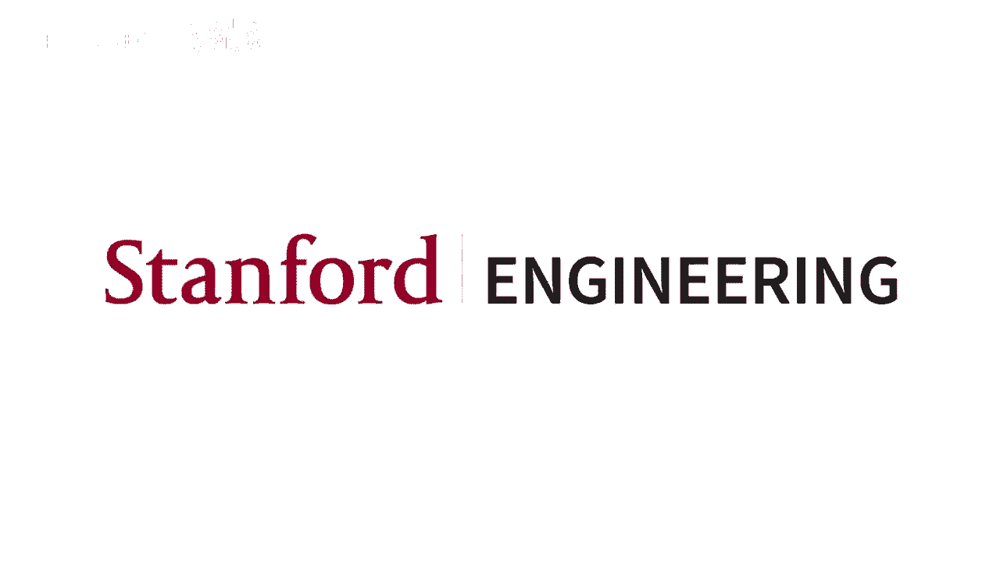
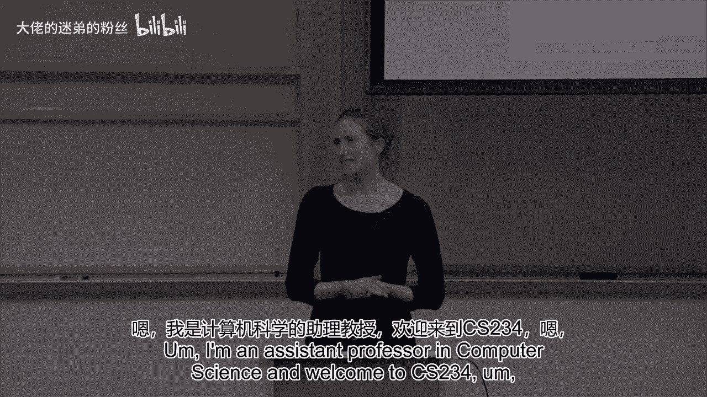

# 【强化学习】斯坦福CS234课程：强化学习中英文字幕 - P1：Lecture 1 - Introduction - 大佬的迷弟的粉丝 - BV1Cc411h7QQ

大家好，我是艾玛·布兰斯基尔，我是计算机科学的助理教授，欢迎来到计算机二三四。

这是一个强化学习班，嗯，它被设计成一种入门级的硕士或博士生，在强化学习导论中，所以我们今天要做的是，我将从一个非常短的，然后我们要进行课程后勤，当我通过课程后勤时，我也会停下来问任何关于物流的问题。

网站现在上线了，所以这也是关于这门课的最好的信息来源，在广场将是最好的信息来源，嗯，所以当我们到了那个部分时，我就停在那里问，如果有什么我没说过的事情你有疑问，如果你对等候名单有疑问。

或任何与你自己的情况有关的特别事情，请在最后来找我，然后课程的第三部分是，在那里我们开始进入，我们在考虑顺序决策的介绍，在不确定的情况下，嗯，只是在我们开始之前我有个感觉，他在这里上了机器学习班。

所有的权利，谁在这里拿走了，我没事，所以少一点，但大多数人都没事，伟大，所以可能这里的每个人都见过一点关于强化学习的知识，嗯变化一点点，取决于你在哪里，我们将从一开始就报道一些事情。

好像你不知道任何强化学习，但随后我们将很快进入其他内容，嗯，这超出了任何被覆盖的东西，至少其他斯坦福相关课程，所以强化学习与这个真正基本的问题有关，一个聪明的代理如何学会做出一系列好的决定。

这是一个单一的句子，总结了强化学习在做什么，以及我们在这节课上要讲的内容，但它实际上编码了很多非常重要的想法，嗯，所以第一件事是，我们现在真正关心的是决策的顺序，因此。

与机器学习所涵盖的许多内容形成鲜明对比的是，我们会考虑特工，智能代理，或者一般的智能代理，可能是也可能不是人类或生物，以及它如何做出不仅仅是一个决定，而是一系列的决定，我们要关心善良，换句话说。

我们会对，第二件事是我们如何学会做出好的决定，我们所说的好是什么意思，这里有一些最优性的概念，我们对正在做出的决定有一些效用度量，嗯，强化学习的最后一个关键方面是学习，但是嗯，代理人事先不知道的。

它的决定将如何影响世界，或者什么决定可能必然与良好的结果相关联，相反，它必须通过经验获得这些信息，所以当我们想到这个的时候，这真的是我们一直在做的事情，我们已经做到了，从我们还是婴儿的时候。

我们试图弄清楚你是如何在这个世界上获得高回报的，有很多非常令人兴奋的工作正在进行，在神经科学和心理学中，试图从人类智能代理的角度来思考同样的基本问题，所以我认为如果我们想解决人工智能或者取得重大进展。

我们必须能够取得重大进展，让我们创造，做强化的代理，学习，那么这是从哪里来的，耶鲁笔尖上有个很好的例子，他是一个了不起的心理学家和神经科学研究员，在普林斯顿，嗯，她给我们举了一个这种原始生物的例子，嗯。

在其生命周期内演化如下，所以当它是个婴儿的时候，它有一个原始的大脑和一只眼睛，它游来游去，附着在岩石上，然后当它成年的时候，它消化它的大脑，它坐在那里，所以也许这表明智力的意义，或者有大脑的意义。

至少在一定程度上有助于指导决策，因此，一旦代理人生活中的所有决定都完成了，也许我们不再需要大脑，所以我想这是，你知道的，这是生物的一个例子，但我认为这是一个有用的提醒，为什么一个特工需要聪明。

它是否从根本上与它必须做出决定的事实有关，当然是现在，在强化学习中出现了一种真正的范式转变，大约在纽里普斯会议上，这是主要的机器学习会议之一，大卫·西尔弗来了又去了一个车间。

并展示了这些令人难以置信的结果，使用强化学习直接控制雅达利游戏，现在这些很重要，不管你喜不喜欢电子游戏，电子游戏是一个非常有趣的复杂任务的例子，人类玩家需要一段时间，经常学习，我们不知道如何提前做。

我们至少需要一点经验，这个例子最不可思议的是，这是一个突破，代理学习直接从像素输入播放，所以从代理人的角度来看，他们只是看到这些彩色像素进来，它必须学习，为了学会打好比赛，应该做出什么正确的决定。

事实上甚至比人更好，所以这真的很不可思议，这是可能的，当我刚开始做强化学习的时候，很多工作都集中在非常人造的玩具问题上，嗯，很多地基都在那里，但这些更大规模的应用确实缺乏，所以我想在过去的五年里。

我们已经看到了正在进行的技术类型的巨大改进，在强化学习中，现在可以解决的问题的规模，不仅仅是在电子游戏中，嗯玩，它也在机器人技术等方面，嗯，尤其是我在大学的一些同事。

我在机器人方面做了一些令人难以置信的工作，并在这些类型的场景中使用强化学习，嗯，试图让特工们抓住叠衣服，诸如此类的事情，现在这些例子，如果你们以前看过强化学习，可能是你听说过的。

你可能听说过电子游戏或机器人技术，嗯，但我认为真正令人兴奋的一件事是，呃，强化学习实际上适用于大量领域，这既是机遇也是责任，特别是我在斯坦福指导人类撞击实验室的人工智能，我们真正感兴趣的一件事是。

我们如何利用人工智能来帮助放大人类的潜力，所以你可以想象这样做的一种方法是通过像教育游戏这样的东西，目标是找出如何快速有效地教人们，如何学习材料，比如分数，另一个非常重要的应用领域是医疗保健，嗯。

这是对癫痫发作的一种剪裁，那个，一些已经完成的工作，麦吉尔大学的乔尔·皮诺，我想现在也有很多兴奋，思考我们如何在一个特定的强化学习中使用人工智能，喜欢与电子病历系统等东西互动，并用它们来通知病人的治疗。

最近也有很多令人兴奋的事情，思考我们如何利用，加固，学习，和许多其他应用程序，作为一种优化技术，当很难解决优化问题时，所以这就出现在自然语言处理和视觉等方面，在其他一些领域，所以我想。

如果我们必须思考强化学习的关键方面是什么，他们可能归结为以下四个，这些是将它与人工智能和机器学习的其他方面区分开来的东西，从我的句子中学习到这一点，我们正在学习在不确定性下做出好的决定，从根本上说。

这涉及到优化，延迟后果，勘探与推广，所以优化自然而然地出现了，因为我们对好的决策感兴趣，有一些相对不同类型的决定的概念，我们可以做出，我们希望能够做出好的决定，第二种情况是延迟后果，所以这是一个挑战。

现在做出的决定，你可能直到很久以后才意识到他们是否是一个好决定，所以你现在吃巧克力星期天，直到一个小时后你才意识到，把两夸脱冰淇淋都吃了是个坏主意，或者嗯，你在电子游戏之类的事情上，就像蒙特祖玛的复仇。

你得拿起钥匙，很久以后你才意识到这是有帮助的，或者你现在周五晚上非常努力地学习，然后三周你期中考试考得很好，所以这样做的挑战之一是，因为你不一定会立即收到结果反馈，很难做到所谓的信用分配问题，也就是。

你如何弄清楚你过去所做的决定之间的因果关系，成果的执行情况以及今后的行动，这是一个非常不同的问题，与我们在大多数机器学习中看到的不同，所以当我们开始思考这个问题时，出现的一件事是，我们怎么做探索。

所以代理人从根本上试图通过经验来弄清楚世界是如何运作的，在很多强化学习中，所以我们认为代理人实际上是，在世界上尝试事物的科学家，就像有一个特工试图骑自行车，在这种情况下，我们所说的审查是什么意思。

你只能了解你试图做的事情，你们所有人都在斯坦福大学，那是最佳选择，嗯，但你并没有真正弄清楚它会是什么样子，如果你上过麻省理工学院，那可能也是个不错的选择，但你不能你不能体验，因为你只能活一次。

所以你只能看到你在这个特定的时间做出的特定选择，所以你可能会想知道的一个问题是，政策我们要做什么，我们会谈论很多政策，政策决定，政策是从经验到决策的映射，你可能会回答为什么小麦需要学习。

所以如果我们思考像内心深处这样的东西，嗯雅达利玩游戏，它从这里学到的是它从像素中学习，所以它本质上是从图像空间中学习，下一步做什么，如果你想把它写成一个程序，一系列if then语句，它绝对是巨大的。

这是不容易处理的，所以这就是为什么我们需要某种形式的概括，以及为什么我们直接从数据中学习可能会更好，以及对任务有一些高级别的代表，所以即使我们遇到特定的像素配置，我们的经纪人还能知道该怎么做。

这是我们从未见过的，这就是强化学习的四个要素，至少在线强化学习，为什么它们不同于其他类型的人工智能和机器学习，所以人工智能中经常出现的另一件事是计划，所以说，比如说，围棋可以看作是一个计划问题。

所以计划所涉及的是优化，常泛化，延迟后果，你可能会采取行动，早点去，如果这是一个好的举动，可能不会立即显现出来，直到许多步骤后，但它不涉及探索，这个想法和计划是给你一个世界如何运作的模型。

所以考虑到游戏规则，比如说，你知道回报是什么，嗯，困难的部分是计算，考虑到世界的模式，你应该做什么，所以不需要探索，有监督机器学习与强化学习，它经常涉及优化和泛化，但通常它既不涉及探索。

也不涉及延迟后果，所以它不倾向于探索，因为在监督学习中，你得到了一个数据集，所以你的代理不是在收集它的经验或关于世界的数据，相反，它被赋予了经验，它必须用它来说，一个图像是否是一张脸，类似的嗯。

它通常只做一个决定，比如这个图像是不是脸，而不是现在就考虑做决定，然后才知道这些决定是否正确，无监督机器学习还涉及优化和泛化，但一般不涉及勘探或迟延后果，通常你对这个世界没有标签，所以在监督学习中。

你通常会得到世界的确切标签，就像这个图像真的是，因为它有没有脸，嗯，在无监督学习中，你通常没有关于世界的标签和RL，你通常会得到介于两者之间的东西，您将获得您放置的标签的实用程序，比如说。

你可能会决定这里有一张脸，它可能会说，好的，是啊，是啊，我们会给你部分信用，因为也许有什么东西看起来有点像脸，但你没有得到世界的真正标签，或者你决定去斯坦福，然后你不知道，你就像，好的。

那真是一次很棒的经历，但我不知道这是不是引用，引用正确的经验，模仿学习，这就是我们在这节课中可能会简要地谈到的东西，而且变得非常重要，嗯，差不多，但有点不同，所以在呃，它涉及到优化，泛化。

以及往往延迟的后果，但我们的想法是，我们将从其他人的经验中学习，所以我们的智能代理不是去体验，嗯，从世界上做出自己的决定，它可能会看到另一个智能特工，可能是一个人，做决定，观察结果。

然后利用这种经验来弄清楚它想要如何行动，这样做可能有很多好处，但有点不同，因为它不必直接考虑勘探问题，模仿学习，我只想在那上面多花点时间，因为它变得越来越重要，所以据我所知，它最初是由安德鲁·吴推广的。

他以前是这里的教授，通过他的一些直升机的东西，他在那里看专家飞行，和彼得·比尔一起，他是伯克利的教授，看看你如何快速模仿，专家驾驶玩具直升机，这是第一个主要的应用之一，邀请成功，学习，它可以非常有效。

可能会有一些挑战，因为，本质上，如果你观察到一个轨迹，让我们想象这是一个直升机飞行的圆圈，你的经纪人学到了一些与专家所做的不完全相同的东西，那个，你基本上可以开始偏离这条道路，冒险进入领域。

你真的不知道该做什么，所以有很多关于模仿学习的广泛工作，这是模仿学习和强化学习的结合，这最终是非常有希望的，所以就我们如何思考强化学习而言，我们可以建立在许多不同类型的技术上，嗯。

然后再想想强化学习所特有的一些挑战，它涉及所有四个挑战，所以这些RL代理真的需要探索世界，然后用这种探索来指导他们未来的决定，所以我们会在整个课程中更多地讨论这个问题，嗯。

一个非常重要的问题是这些奖励是从哪里来的，特工们用来引导的信息在哪里，他们的决定是否好，嗯，谁在提供这些，如果他们错了怎么办，我们会更多地讨论这个问题，嗯，我们不会太多谈论多智能体强化学习系统。

但这也是一个非常重要的案例，以及博弈论方面的思考，所有的权利，所以这只是一个非常简短的概述，关于强化学习的一些方面，以及为什么它与你可能上过的其他课程不同，现在我们要简单地讲一下课程后勤，然后呢，嗯。

开始更多的内容，我会在课程后勤后暂停，就先决条件提出任何问题，我们希望这里的每个人要么接受了人工智能，类或机器学习类，要么在斯坦福大学，要么相当于另一个机构，如果你不确定你是否有适合这门课的背景。

请随时在广场上联系我们，并将做出回应，嗯，如果你在相关的事情上做过大量的工作，一般情况下可能就足够了，我们希望您有基本的Python熟练程度，嗯，你熟悉概率统计和多变量微积分，嗯，像渐变这样的东西。

下降损失导数，嗯，这些对你来说应该都很熟悉，嗯，我想大多数人可能以前听说过MDPS，但这并不完全重要，所以这是一个很长的名单，但我会慢慢经历，因为我认为这很重要，这就是这个班的目标，学习目标是什么。

所以这些是我们所期望的，你们上完这节课的时候应该能做到的，我们的职责是帮助你，能够理解如何做这些事情，嗯，所以第一件事就是，能够定义强化学习的关键特征是很重要的。

将它与其他类型的人工智能机器学习问题框架区分开来，这就是到目前为止我在这门课上所做的一点，去弄清楚，这怎么区分这，RL如何将自己与其他类型的问题区分开来，对你们中的大多数人来说。

你们可能最终不会成为学者，你们中的大多数人将进入工业，所以当你这样做的时候，最大的挑战之一是，那就是当你面临来自老板的特殊问题时，或者当你给你的主管一个问题时，是让他们去思考。

它是否应该被框定为一个强化学习问题，嗯，什么东西适用于它，所以我认为这很重要，但在这节课结束时，你会感觉到，如果你有一个现实世界的问题，比如网络广告，你知道的，嗯，你有一种感觉。

将其表述为强化学习问题是否有用，以及如何在这个框架中写下它，以及哪些算法是相关的，嗯，在课堂上还将向你介绍一些强化学习算法，嗯，您将有机会在代码中实现这些，包括深度强化学习，另一个非常重要的方面是。

如果你试图决定使用什么工具，对于特定的，比如机器人问题或医疗保健问题，就是了解哪些算法可能是有益的，为什么，所以除了经验表现之外，我认为了解一般情况是很重要的，我们如何评估算法。

我们能不能用一些理论工具，就像后悔，样本复杂度，以及计算复杂性，决定哪些算法适合特定的任务，然后呢，最后一件事是强化学习的一个真正重要的方面是探索和开发，当代理人必须弄清楚他们想做什么决定时。

就会出现这个问题，以及他们将学到的关于环境的知识，通过做出这些决定，所以到下课的时候，你还应该能够比较不同类型的勘探和开发技术，这些的优点和局限性是什么，有人有什么问题吗，这些学习目标是。

所以我们有三个主要的作业，我们还要期中考试，嗯，下课时我会有一个小测验，以及最后的项目，这次测验有点不寻常，所以我只想花一点时间谈谈这件事，现在测验是个人和小组进行的。

我们这样做的原因是因为我们想要一种低赌注的方式，让人们用这些材料练习，他们在课程的后半部分学到的，嗯，在某种程度上，这是一种有趣的参与，真的想让你考虑一下，也向同龄人学习，所以我们去年就做了。

我想很多人都有点紧张，它会在，最后真的很享受，所以测验的工作方式是，一开始是多项选择题，每个人都自己做这件事，然后在每个人都提交了答案之后，然后我们在预先分配的小组中再做一次。

目标是你必须让每个人决定什么是正确的答案，在你刮开看看正确答案是什么之前，然后我们根据你是否正确地划下了正确的答案来评分，先还是不先，你不能做得比你的个人成绩差，所以在一个小组里做只能帮助你。

和SCPD学生，他们不成群结队地做，所以他们只是再次写下他们答案的理由，嗯，这是一种相当轻量级的评估方式，嗯，目标是你必须能够阐明为什么，你相信答案就是它们的本来面目，并在小组中讨论它们。

他们用它来计算出正确的答案是什么，最终的项目可能和你们做过的其他项目很相似，在其他班级，这是一个开放式的项目，这是一个推理和思考强化学习的机会，呃，更深入的东西，我们还将提供一个默认项目。

将在接下来的几周内宣布，在第一个里程碑到期之前，如果选择执行默认项目，你的崩溃，将基于你作业中的项目演示文稿，因为我们相信，嗯，你们都是彼此最好的资源，我们使用的广场应该用于几乎所有的课堂交流。

除非是某种私人或敏感的方式，在这种情况下，当然啦，请随时直接联系课程工作人员，嗯，比如讲座、家庭作业和项目问题，几乎所有这些都应该通过广场，啊晚班政策，我们有六天的时间来了解细节，您可以看到网页和协作。

有关详情，请参阅网页，所以在我们进入下一部分之前，我可能有任何关于课堂后勤的问题，好的，让我们开始吧，所以我们现在要做一个介绍，到不确定性下的顺序决策，你们中的一些人以前会看过这些内容，嗯，我们将在。

可能比你见过的这些东西更有深度，包括一些理论，今天不是理论，但在其他讲座中，然后我们也将继续内容，在以后的课堂上，这对你们所有人来说都是新的，不确定性下的顺序决策，嗯，我们事情的根本。

我们在这些设置中思考的是一种交互式闭环过程，我们有一些探员，智能代理，希望这是在采取影响世界状况的行动，然后它回报一个观察和奖励，关键目标是代理试图最大化总的预期未来，现在奖励，这个预期的方面很重要。

因为有时世界本身是随机的，所以代理将在期望中最大化事情，这可能并不总是正确的标准，这是大多数强化学习的重点，但现在有一些兴趣考虑分配，概率rl，和其他一些方面。

这里的一个关键挑战是它可能需要在即时和长期之间取得平衡，定期奖励，它可能需要战略行为来获得这些高回报，表明您可能必须牺牲首字母，更高的奖励，以便在长期内获得更好的奖励，所以作为一个例子。

像网络广告这样的东西可能是你有一个代理在运行网站，它必须选择给客户哪个网络广告，顾客给你一个观察，比如他们在网页上花了多长时间，嗯，你还会得到一些关于他们是否点击广告的信息。

目标是说人们是如何点击广告最多的，所以你必须选择哪个广告给人们看，这样他们就会点击广告，另一个例子是一个正在卸下洗碗机的机器人，所以在这种情况下，代理的作用空间可能是联合运动，嗯。

探员可能得到的信息是厨房的摄像头图像，如果柜台上没有菜它可能会得到额外的奖励，所以在这种情况下通常会有很长时间的延迟奖励，它们将成为柜台上的菜肴，嗯，除非它能把它们都扫下来让它们撞到地板上。

这可能是也可能不是编写系统的人的预期目标，嗯，因此，它可能必须做出一系列决定，在长时间得不到任何奖励的地方，另一个例子是血压控制，嗯，动作可能在哪里，比如开运动处方或开药处方。

我们得到了个人血压的观察结果，嗯，然后奖励可能是加一，如果它在，如果血压在健康范围内，也许是一个小小的负面奖励，如果由于副作用而开药，也许没有回报，否则，好的，所以让我们想想另一个案子。

就像我在实验室里思考的一些案例，就像有一个人工家教，所以现在你可以有一个教学代理，它要做的是选择一个活动，所以现在就选择一个教学活动，假设它只有两种不同类型的教学活动，嗯，它要么给出一个加法活动。

要么给出一个减法活动，它把这个给了一个学生，然后学生要么答对了题，对错，假设学生一开始没有加减法，原来是幼儿园小朋友，那个学生对数学一窍不通，我们正在想办法教学生数学，教学代理的奖励结构是。

每次学生答对了，他们就会得到加分，如果学生答错了，他们会得到负1，所以我想让你花一点时间，向附近的人描述你的想法，一个试图学习最大化其预期回报的代理人会做什么，在这种情况下，它会给学生带来什么样的问题。

这是否正确，让我在这里澄清一下让我在这里澄清一下，让我在这里澄清一下，让我们假设对大多数学生来说，加法比减法容易，所以就像这里说的，问题是，即使学生不知道这些事情，学习加法的技巧比较简单。

对于一个新学生来说，学减法比减法更重要，那么在这些情况下会发生什么，那么，也许你想举起他们的手，告诉我他们和他们附近的人在想一个特工可能会发生什么，在这个场景中，代理人会给他们很容易的加法问题。

这是正确的，这正是实际发生的事情，贝夫·沃尔夫大约2000年有一篇很好的论文，这是我所知道的最早的一个，他们正在使用强化学习来创建一个智能辅导系统，奖励是让代理人给学生出问题，为了让他们正确。

他们已经学会了，但这里的问题是奖励规范，代理人学会做的是给出非常简单的问题，然后可能学生最初不知道如何做这些，但他们很快就学会了如何，然后就没有动力给出难的问题，所以这只是奖励黑客的一个小例子，嗯。

你的经纪人要学会，你告诉他们要做什么，根据您指定的奖励函数，然而在强化学习中，我们经常花很少的时间仔细思考什么，奖励功能是，所以每当你进入现实世界，这是非常关键的部分通常是设计师来选择，奖励功能是什么。

代理人没有内在的内部奖励，因此取决于您如何指定它，代理人会学会做不同的事情，是啊，是啊，后面有问题吗，我想在这种情况下，学生似乎也是一个RL代理，在现实生活中的那个地方。

做得最好的学生可能会问更难的问题，并从这个意义上得到它，那么有没有类似的技术来接近，还是可以，我们忽略了这一点，所以问题是说好，你知道吗，我们还认为人们可能也是强化学习的推动者，这是完全正确的。

也许他们会开始说嘿，我需要得到更难的问题或在这个过程中互动，对于这个班的大部分人来说，我们要忽略，事实上，我们与自己互动的世界也可能是一个RL代理，嗯，在现实中，这真的很关键，嗯。

有时这通常被认为是对抗性的，就像博弈论一样，嗯，我觉得对我来说最令人兴奋的事情之一是当我们想到它的时候，以合作的方式，嗯，那么在座的各位谁听说过机器教学的分支学科，还没有人，嗯。

所以这是一个非常有趣的新领域，它已经存在了五到十年，有些超越了这一点，嗯，其中一个想法是发生了什么，如果你有两个相互作用的智能代理，在那里他们知道对方试图帮助他们，所以有一个很好的经典例子。

对于那些不太熟悉机器学习的人来说，但是想象一下你正在学习一个分类器，来决定沿着这条线事情是积极的还是消极的，所以一般来说，你需要一些样品，如果你在这条线上的点数，你必须得到积极或消极的标签，嗯。

如果你处于积极的学习环境中，一般来说，我想你可以把它减少到大约log n嗯，通过战略性地要求人们在行中标记特定的点，对于机器教学来说，一个非常酷的事情是，如果我知道你想教我在哪里划分这条线。

你只需要一分，或最多两点基本不变，因为如果我想教你，没有办法，我只是随便给东西贴上标签，我只想给你一个加号和一个减号，它会告诉你这条线的确切走向，所以这就是为什么。

如果代理知道另一个代理试图教他们一些东西，它实际上比我们通常认为的学习效率要高得多，所以我认为机器教学有很大的潜力非常有效，但尽管如此，我们将在课程中忽略大部分，如果这是你想在你的项目中探索的东西。

非常欢迎你来，强化学习有很多联系，好的，所以说，如果我们从总体上考虑这个过程，嗯，如果我们想到一个顺序决策过程，我们有这个探员，我们将考虑几乎总是有离散的时间，所以经纪人会做出决定，它将影响世界。

在某种程度上，它会看到世界，将给予一些新的观察和奖励，代理接收这些并使用它来做出另一个决定，所以在这种情况下，当我们思考一段历史时，我们所说的历史只是代理人之前采取的一系列行动，以及它得到的观察和奖励。

第二件非常重要的事情是再次定义状态空间，当第一次讨论这个问题时，这是一种思考，是一些不变的东西，但是每当你在一个真正的应用程序中，这正是你必须定义的是如何写下世界的表示，嗯，我们在这门课上要假设什么。

这种状态是历史的函数，所以可能还有其他方面，可能还有其他感官信息特工想要获得，为了做出决定，但它将被限制在，到目前为止它收到的观察结果，它所采取的行动和观察到的回报，现在也会有一些现实世界的状态。

这就是现实世界，代理人不一定能接触到现实世界，他们可能只能接触到现实世界的一小部分，例如，作为一个人，现在我有一双眼睛，让我向前看，你知道的，大约一百八十度，但我看不见我的头后面。

但在我的脑后仍然是世界国家的一部分，所以世界状态是真实的世界，然后代理有自己的状态空间，它用来试图做出决定，所以总的来说，我们将假设它有历史的某种功能，现在有一个假设，我们将在这门课中使用很多。

你们可能以前见过马尔可夫假设，马尔可夫假设简单地说，我们要假设，代理使用的状态是历史记录的充分统计数据，为了预测未来，你只需要知道环境的当前状态，所以这基本上表明未来是独立于过去的，考虑到现在。

如果现在你有正确的汇总统计数据，所以有几个这样的例子，是啊，是啊，关于的问题，你能解释一下，也许用一个例子，国家和历史的区别，好像我很难漫步，是啊，是啊，所以国家，如果我们想到这样的事情，或者机器人。

假设你有一个机器人在一条长长的走廊上行走，好的，假设有两条长廊，好的，所以你的机器人从这里开始，这是你的机器人开始的地方，它试图向右向右，然后它往下走假设它的传感器，它可以观察到在它面前，啊嗯。

它的任何一边是否有一堵墙，所以机器人的观察空间就在那里，在墙的四边中的任何一边的墙，对不起，后面可能有点小，但代理人基本上有，你知道的，一些局部的量到激光测距仪或类似的东西。

所以它知道它周围是否有一堵墙，就在它周围，正方形，没有别的，所以在这种情况下特工会看到墙最初是这样的，然后像这样，然后像这样，然后像这样，历史将包括这一切，但它的地方状态只是这样。

所以当地的状态可能只是当前的观察，当你下来的时候，这就开始变得重要了，因为有很多地方看起来像那样，所以如果你跟踪整个历史，探员就能找出它在哪里，但如果它只跟踪它在本地的位置，那么就会发生很多部分混叠。

我在这里举了几个例子，所以在高血压控制方面，你可以想象这种状态只是目前的血压，而你的行动就是是否服药，所以当前的血压意味着你知道每一秒，比如说，你的血压是多少？那么你认为这种系统是马尔科夫的吗。

我看到有些人在摇头，几乎肯定不是几乎肯定，还有其他与，你知道吗，也许你是否在锻炼，不管你是不是刚吃了一顿饭，外面热不热，如果你刚坐上飞机，所有这些其他特征可能会影响，你的下一次血压是高还是低。

尤其是对一些药物的反应，嗯类似的东西在网上购物，嗯可以想象这个州只是有点，你现在看的是什么产品，所以就像我打开亚马逊，我在看一些，嗯，你知道电脑，现在就在我的网页上，动作是推荐什么其他产品。

你认为那个系统是马尔科夫的吗，系统不是马尔可夫的，你是说整个系统，但假设是马尔科夫，它就是不适合，问题是系统是否一般是马尔可夫的，这个假设不符合，或者只是一些更多的细节，我在想这个，我在这里的意思是。

这个代表系统的特殊选择，是马尔科夫，所以现实世界正在发生，然后是代理可以使用的世界模型，我在这里争论的是，这些特定的世界模型不是马尔可夫模型，可能还有其他的世界模型，嗯，但如果我们选择这个特殊的观察。

就说目前的血压是我们的状态，这可能不是真正的马尔可夫态，现在这并不意味着我们不能使用算法来处理它，好像是，只是，我们应该意识到我们可能违反了其中的一些假设，是啊，是啊，我在想。

所以如果你在一天中包含足够的历史，你能制造任何问题吗，或者这是一个很好的问题，那么它为什么这么受欢迎呢，你知道，你总是能做一些马尔科夫，一般来说，是呀，如果你包括所有的历史。

那么你总是可以使系统马尔科夫，嗯，在实践中，通常你可以用最近的观察来逃脱惩罚，或者可能是最后四个观察作为一个合理充分的统计数据，这在很大程度上取决于域，当然有领域，也许就像航海世界。

我在那里做模特真的很重要，嗯，要么用整个历史作为状态，嗯，或者想想部分可观察性和其他你知道的情况，也许电流，最近的观察是完全足够的，现在，这里的挑战之一是，你可能不想用整个历史，因为那是很多信息。

你必须随着时间的推移跟踪它，所以有一个足够的统计数据要好得多，嗯，当然啦，随着LSTM和其他类似的事情，其中一些事情正在发生一点变化，所以我们先前对事物规模的一些假设。

随着状态空间的大小正在发生一点变化现在随着深度学习，但从历史上看，拥有一个较小的状态空间肯定有好处，再一次，从历史上看，像计算复杂性这样的事情有很多含义，所需的数据和由此产生的性能。

取决于状态空间的大小，所以只是为了给出一些直觉，那可能是，嗯，如果你把你的州，你生命中发生的一切，嗯，这将给你一个非常非常丰富的代表，但是每个州只有一个数据点，就不会重复，所以真的很难学，因为，嗯。

它们都是不同的状态，和一般情况下，如果我们想学习如何做某事，我们要么需要某种形式的概括，或某种形式的聚类或聚合，这样我们就可以比较经验，这样我们就可以从以前类似的经验中学习，以便做什么。

所以如果我们假设你的观察是你的状态，所以探员得到的最新观察，我们将把它视为国家，嗯，然后我们，代理将世界建模为马尔可夫决策过程，所以它在考虑采取行动，获得观察和奖励，它正在设定状态，世界状态环境状态。

它过去是观察，如果这个世界，如果它把世界视为部分可观察的，嗯，那么它说代理状态是不一样的，它使用了一些东西，比如关于世界国家的历史或信仰，将以前采取的行动和收到的意见的顺序汇总，并利用这一点做出决定。

比如说，在扑克之类的东西里，嗯，你可以看到你自己的牌，其他人有明显影响游戏进程的牌，但你不一定知道那些是什么，这样你就可以看到哪些牌被丢弃了，所以这是它自然部分可观察到的地方。

所以你可以对其他玩家的其他牌保持一种信念状态，你可以利用这些信息或做出决定，同样，经常在医疗保健中，有一大堆非常复杂的生理过程在进行，但你可以监控它们的一部分，就像你知道的那样，血压或体温，等等。

然后用它来做决定，所以就顺序决策过程的类型而言，其中一个是土匪，我们以后再谈这个，强盗这个词是马尔可夫决策过程的一个非常简单的版本，从某种意义上说，所采取的行动，对下一次观察没有影响。

那么什么时候这可能是合理的，所以让我们想象一下，你有一系列的客户来到你的网站，你给他们每个人看一个广告，然后他们要么点击它，要么不点击它，然后你让另一个客户登录你的网站，所以在这种情况下。

你向客户展示的广告通常不会影响谁，哪个顾客来了，现在它可能会以非常复杂的方式，也许顾客一号会去Facebook说我真的真的很喜欢这个广告，你应该去看看，嗯，但大多数时候，你给顾客看的任何广告。

根本不影响下一个登录您网站的人，所以你所做的决定只会影响当地，第一个顾客，然后客户二是完全独立的，强盗真的真的很重要，嗯，至少五十年，人们认为它们是为了临床试验，如何分配临床试验人员。

人们认为它们是网站，和一大堆其他应用程序，MDPS和Palm DPS说不，等一下，你所采取的行动会影响世界的状态，它们影响，经常，你得到的下一个观察和奖励一样，你必须考虑你所采取的行动的闭环系统。

改变世界的状态，所以我推荐给客户的产品可能会影响，客户的意见在下一个时间步骤上，事实上，你希望它会，所以在这些情况下，我们思考实际影响世界状态的行为，所以另一个非常重要的问题是世界是如何变化的。

一个想法是，它是确定性地变化的，所以当你在特定的状态下采取行动时，你去了一个不同的州，但你去的状态是确定性的，只有一个，这通常是一个相当普遍的假设，很多机器人和控制，我记得，嗯，托马斯·洛扎诺·佩雷斯。

他曾经是麻省理工的教授，向我建议如果你抛硬币，它实际上是一个确定性的过程，我们只是随机建模，因为我们没有足够好的模特，所以有很多过程，如果你能写下一个足够完美的世界模型，它实际上看起来是确定性的，嗯。

但在许多情况下，即使很难写下那些模型，所以我们要把它们近似为随机的，这个想法是，当我们采取行动时，有很多可能的结果，所以你不能给别人看广告，他们可能会也可能不会点击它，我们可能只想用一个随机模型来表示。

所以让我们考虑一个特定的例子，所以如果我们考虑像火星探测器这样的东西，当我们在非常遥远的星球上部署漫游者或机器人时，来回交流很困难，所以如果能让这些机器人更自主就好了，让我们想象一下。

我们有一个非常简单的火星探测器，那是，嗯，思考七国制，所以它刚刚着陆，嗯，它有一个特定的位置，它可以尝试向左或向右，我写下，向左或向右，意思是这就是它要做的，但也许你会成功或失败。

让我们想象一下有不同种类的科学信息有待发现，在第一部分中如此，有一点点有用的科学信息，但实际上在七点结束了，有一个非常丰富的地方，那里可能有水，然后在所有其他州都是零，所以我们将通过它作为一个例子。

当我开始谈论RL代理的不同常见组件时，所以一个常见的组件是模型，所以模型只是一个表示，代理人对世界上发生的事情，当它采取行动时，它可能会得到什么回报，所以在马尔可夫决策过程的情况下，它只是一个模型，说。

如果我在这种状态下开始，我采取这个行动，a，我可能到达的下一个州的分布是什么，它还将有一个奖励模式，预测在某一状态下采取行动的预期回报，所以在这种情况下，让我们想象代理的奖励是，它认为到处都是零奖励。

嗯，让我们想象一下，它认为自己的电机控制非常糟糕，所以它估计每当它试图移动时，它有50%的可能性留在原地，百分之五十的可能性它现在真的移动了，模型可能是错误的，所以如果你还记得我在这里放了什么。

实际的奖励是在状态1中你得到加1，在七个州，你得到十个，其他一切你都得零分，我刚才写下的奖励是到处都是零，所以这是一个完全合理的奖励模式，特工本可以，只是碰巧是错的，在许多情况下，模型会是错误的，嗯。

但通常仍然可以被代理使用，以有用的方式，因此，rl代理始终需要的下一个重要组件是策略，政策或决策政策只是我们现在如何做出决定，因为我们在考虑马尔可夫决策过程，这里我们要把它们看作是从状态到动作的映射。

确定性政策只是意味着每个州有一个行动，随机意味着你可以在你可能采取的行动上有一个分布，所以也许每次你开车去机场，你抛硬币，你决定是否走后路，还是你要走高速公路，作为一个快速检查，想象一下。

在每一个状态下，我们做的动作，尝试正确，这是确定性政策还是随机性政策？确定性权利，我们将更多地讨论为什么确定性政策是有用的，当随机政策很快有用的时候，价值函数是在特定保单下未来奖励的预期贴现和。

所以这是一个等待，上面写着我认为有多少奖励，我现在和将来都要得到，根据我对即时回报和长期回报的关心程度来加权，折现系数γ在0到1之间，所以值函数允许我们说，不同的州是好是坏，所以再一次。

在火星探测器的情况下，让我们假设我们的折扣系数为零，我们的政策是尽量走对路，在这种情况下，假设这是我们的值函数，它说处于状态一的值是加一，其他都是零，在S7中的值又是十，这可能是正确的值函数。

也可能不是正确的值函数，这也取决于真正的动力学模型，但这是一个值函数，代理可以有，因为这项政策只是告诉我们，你期望得到的折扣奖励是多少，如果你遵循这个政策，从这个状态开始，在那里你用伽马来衡量每个奖励。

到你到达它的时间步数，所以当我们想到，是啊，是啊，所以如果我们想把这种因素扩展到这个例子中，嗯，会有增加的价值还是减少的价值来奖励，取决于问题有多远，如果这里的伽马不是零，嗯。

所以伽马射线在这里为零表明本质上我们只关心即时的回报，我们是否会开始冒险，开始看到奖励转向其他州，答案是肯定的，所以下次我们会看到更多，但是如果折现系数不为零。

那么它基本上是说你关心的不仅仅是你得到的即时奖励，你不只是近视，你关心你将来得到的奖励，其中一些是基于模型的，这意味着他们在他们的表现中保持了一个世界如何运作的直接模型，比如过渡模式和奖励模式。

它们可能有也可能没有策略或价值函数，他们总是要计算一个策略，他们得想出该怎么办，但他们可能有也可能没有明确的表示他们会做什么，在任何状态模型中，自由方法具有显式的值函数和策略函数，没有模特。

回到我之前用的幻灯片，求值函数时调用，和那个有七个的很好，是啊，是啊，那么为什么不是6的值是10呢，因为如果你在六点尝试，你到了七点，所以他在说好，我怎么做，我什么时候想到奖励会发生，嗯。

下次我们会更多地讨论这个问题，真的，呃，人们有许多不同的方式来看待奖励发生在哪里，有些人认为这是对当前状态的奖励，你在，有些人认为，因为这是你的奖赏，以及你所采取的行动，有些人。

另一个常见的定义是r s a s素数，这意味着在你过渡之前，你不会看到你得到了什么回报，我在这里使用的这个特殊定义，我们假设奖励发生在那种状态下一年，基本上都是同构的，嗯。

但我们会试着小心我们用的是哪一个，我们在类中使用的最常见的是S，它说当你处于一种状态，你选择了一个特定的动作，然后你得到奖励然后你过渡到你的下一个状态，他们是否在维持这些模型、这些价值观和这些政策。

我们有很多交集，所以我真的很喜欢大卫·西尔弗的这个数字，嗯，呃，他在那里思考RL算法或代理，主要分为这三个不同的类别，它们甚至有一个模型或显式策略或显式值函数，然后有一大堆算法，在这些的交集中。

所以像演员评论家这样的事情往往有一个明确的，我说的露骨是什么意思，我是说，就像他们经常有办法这样，如果你给它一个状态，你可以告诉我我可以告诉你价值是多少，如果我给你一个状态，你可以立即告诉我保单是什么。

而不需要额外的计算，所以演员批评结合了价值功能和政策，有很多算法，也是所有这些不同的交集，在实践中，维护其中的许多是非常有帮助的，对于那些感兴趣的人来说，它们有不同的优势和劣势，学习理论的理论方面。

最近有一些很酷的作品，嗯，明确地查看，基于模型和无模型RL之间的形式基础区别是什么，刚刚从纽约的微软微软研究公司出来，这表明基于模型的方法和无模型的方法之间可能存在根本的差距，嗯。

在深度学习方面一直很不清楚，所以请随时来，问我那件事，那么在这种框架下学习做出好的决定有什么挑战呢，首先是我们之前讨论过的规划问题，这甚至是一旦我有了一个世界是如何运作的模型。

我得用它来决定我应该做什么决定，以一种我认为会让我获得高回报的方式，嗯，在这种情况下，如果给你一个模型，你可以在现实世界中没有任何互动的情况下做这个规划，所以如果有人说这是你的过渡模型。

这是你的奖励模式，你可以在你的电脑上做一堆计算，或者通过纸张来决定最佳行动是什么，然后回到现实世界采取行动，它不需要任何额外的经验来计算，但在强化学习中，我们在其他额外的问题上有这个，我们可能需要考虑。

不仅仅是我认为对我来说最好的事情，根据我目前掌握的信息，但我应该怎么做，这样我就可以得到我需要的信息，以便在将来做出好的决定，所以就像，你知道你去一个全新的餐馆，让我们说，假设你搬到一个新的城镇。

你去那里只有一家餐馆，你第一天去那里，他们有五种不同的菜，你会在那里呆很长时间，你想优化最好的菜，所以也许你尝试第一道菜的第一天，第二天你尝试第二道菜，然后第三天，然后等等，这样你就可以尝试一切。

然后用它来找出哪一个最好，所以从长远来看你会选择一些真正美味的东西，所以在这种情况下，代理必须明确地考虑它应该做出什么决定，这样它就可以得到它需要的信息，以便将来它能做出好的决定，所以在规划的情况下。

这已经是一个困难的问题，如果你想想像接龙这样的东西，嗯，你可能已经知道游戏规则了，对于围棋、国际象棋或许多其他场景也是如此，如果你采取行动，你就可以知道，下一个状态的概率分布是什么。

你可以用这个来计算一个潜在的分数，所以使用像树搜索或动态编程这样的东西，我们会更多地谈论这些，嗯，特别是动态编程方面，你可以用这个来决定，给出了一个世界的模型，什么是正确的决定，但坚实。

但是强化学习本身更像是没有真正的书的纸牌游戏，你只是在玩东西，你在观察正在发生的事情，你想获得高额报酬，您可以使用您的经验来显式计算模型，然后在那个模型中计划，也可能不会，您可以直接计算策略或值函数。

现在我只想在这里再次强调，勘探和开发的问题，所以在火星探测器的情况下，它只会了解世界是如何运作的，它在状态2中尝试的动作，如果它试图向左，它可以看到那里发生了什么，然后从那里它可以决定正确的下一个行动。

现在这很明显，但这可能会导致一个两难的境地，因为它必须能够在看起来可能是好的事情之间取得平衡，根据你以前的经验和将来可能会好的事情，但也许你以前运气不好，在探险中。

我们经常有兴趣尝试我们从未尝试过的东西，或者尝试到目前为止看起来很糟糕的事情，但我们认为将来可能会很好，我们正在尝试被期望是好的事情，根据过去的经验，这里有三个例子，就电影而言。

探索就像看你最喜欢的电影探索就像看一部可能不错的新电影，或者这可能是可怕的广告是显示广告产生，最高点击率，到目前为止，探索正在展示一个不同的广告驱动开发正在尝试最快的路线。

考虑到你以前的经验和探索是驾驶一条不同的路线，是啊，是啊，在后面的问题中，关于这个权衡，回到例子，去餐馆，有五天，对于有限视界的优化不是这样吗，就像你知道的，跟着五个，你只能活一次。

并为有限的视界优化策略，就是经常做同样的政策作为一个记忆问题，或者你可以再重复一次，大问题，也就是，让我们想象一下这个例子，我说你只在城里呆五天，在这种情况下，你会计算出策略。

如果你在有限的地平线设置中，与一个人相同或不同，你知道你将在这里生活无限的时间，下次我们会更多地讨论这个问题，但他们是不同的，特别是，嗯，通常情况下，如果你只有一个有限的视界，策略是不平稳的。

这意味着你将做出的决定取决于时间步长，以及无限视界情况下的状态，假设马尔可夫集合中的最优策略是平稳的，这意味着如果你处于同样的状态，不管你是在第三步还是在第三步，你总是会做同样的事情，嗯。

但是在有限视界的情况下，那不是真的，作为一个关键的例子，所以说，我们为什么要探索它，我们探索是为了了解我们将来可以使用的信息，所以如果你在有限的地平线设置中，这是最后一天，今天是你在好莱坞的最后一天。

你知道你在努力决定该做什么，嗯，你不会去探索，因为探索对未来没有好处，因为你不再做任何决定，所以在这种情况下，你总是会利用，开发总是最佳的，所以在有限视界的情况下，嗯。

你所做的决定必须取决于你所获得的信息的价值，改变你的决定和剩下的地平线，这在实际情况中经常出现，是啊，是啊，有多复杂，如果有有限的视界，但你不知道它在哪里，只是我的意思是，这是一件事，我记得博弈论。

这往往很复杂，在这个问题上看起来怎么样，就是我所说的不确定视界问题，哪里有一个有限的地平线，但你不知道那是什么，这可能会变得非常棘手，一种建模的方法是把它作为一个无限的地平线，终止状态问题。

所以有一些状态本质上是同步状态，一旦你到了那里，这个过程就结束了，这在游戏中经常发生，嗯，你不知道游戏什么时候结束，但这将是有限的，嗯，嗯，但这是棘手的，在这种情况下，我们倾向于把它建模为无限的地平线。

看看达到不同的终止状态的可能性，你把开发和探索混合在一起，潜在的子问题，比如它特别适用于驾驶，似乎你最好利用路径，你知道真的很好，也许探索子路径，你不知道哪里好。

而不是像全新的一样尝试这种探索的混合是如何发生的，也许在汽车的情况下，也许你不会完全随机地尝试事情，你可能需要一些证据来证明他们可能是好的，这是个很好的问题，嗯，一般情况下，混合勘探开发较好。

在某些情况下，尽早进行所有的探索是最好的，或至少相等，嗯，然后你从所有的信息中得到了以后，但这取决于决策过程，我们将在课程的大部分时间里，在对勘探开发的中期思考之后。

这绝对是强化学习的一个非常关键的部分，嗯，尤其是在高风险领域，我所说的高风险领域是什么意思，我是说影响人们的领域，所以不管是顾客、病人还是学生，这就是我们所做的决定实际上影响到真实的人的地方。

所以我们想尽快学习，尽快做出正确的决定其他问题，如果你在一个，如果你处于一种你从未见过的状态，你还有其他更好的选择吗，随机行动喜欢，离开那里，或者是的，你能用你以前的经验，即使你从未去过那里，很高兴说。

如果你处于一个新的状态，你以前从没来过，你是做什么的，你能做任何比随机更好的事情吗，或者你能用你以前的经验，嗯，做推广的一个非常棒的事情，意味着我们将使用通过深度学习学习的状态特征。

或其他代表试图共享信息，所以即使新的，这个州可能不是你以前去过的州，您可以共享先前的信息，以尝试告知什么可能是一个好的行动，当然啦，如果你分享的方向不对，你可能会做出错误的决定，所以如果你过来。

呃过度概括，你可以适应你以前的经验，和，事实上，在新的领域有更好的行动要做，对此的其他问题，在接下来的几节课中，我们要讲的一件事是，这是两个真正基本的问题吗，也就是评估和控制，所以评估是问题所在。

如果有人给你保单，如果他们说嘿，这是你应该做的，或者这就是你的经纪人应该做的，这就是你的机器人在世界上应该如何行动来评估，有多好，所以我们想弄清楚，你知道你的经理说，哦，我想这是正确的方法。

我们应该给顾客看广告，嗯，你能告诉我它有多好吗，点击率是多少，嗯，所以一个非常重要的问题是评估，你知道你可能没有世界的模型，所以你可能还是要出去收集数据，试图评估这项政策，但你只想知道它有多好。

你不是想制定新政策，至少现在还没有，你只是想看看现在的这个有多好，然后控制问题是优化，它在说，让我们试着找一个真正好的政策，这通常涉及作为子组件评估，因为我们通常需要知道什么是最好的。

最好意味着一个真正好的政策，我们如何知道政策有多好我们需要做评估，现在，强化学习的一个很酷的方面是，我们可以在保单之外做这个评估，这意味着我们可以使用从其他策略收集的数据来评估。

不同政策可能会做什么的反事实，这真的很有帮助，因为这意味着我们不必详尽地尝试所有的政策，所以嗯，就这些问题是什么样子而言，如果我们回到我们的火星探测器的例子来进行政策评估。

如果有人说你的政策在你所有的州都是这样，你应该采取的行动是正确的，这是折扣系数，我关心的是，嗯，请帮我计算或评估，这份保单的价值是什么，在控制案例中，我只想让你给我，任何政策都有最高的期望。

奖励折扣金额，实际上有一个关键问题，这里还可以，期望从什么中折扣一些奖励，所以他们可能关心一个特定的起始状态，他们可能会说我想让你找出最好的政策，假设我从第四集开始，他们可能会说。

我想让你从所有开始的状态计算出最佳策略，嗯，或者是一些普通的，所以就剩下的课程而言，我们要做什么，是啊，是啊，我只是在想，如果有可能了解最优政策和奖励，点击通过，比如说，如果我相信回报会是什么。

或者给定状态下某种操作的点击率，事实证明这是错误的，我必须在培训中重新开始，以找到最优的政策，或者我可以用我到目前为止所学到的，除了上面的某种入侵，带着信念回报结合，那个伟大的问题，也可以。

假设我有一个政策开始，我正在评估，嗯，我不知道奖励功能是什么，我不知道最优的政策是什么，原来现在这个不是很好，我需要重新启动吗，或者我可以利用以前的经验来告知下一个政策是什么，我试着，嗯。

或者可能是一整套不同的政策，您可以使用以前的经验来通知下一个策略是什么，你试试我们的下一套政策，有一点警告，你需要一些存货，你所采取的行动，所以如果你只采取同样的行动，你知道一个状态下的一个动作。

你不能真正了解你会采取的任何其他行动，所以你需要假设某种概括，或者你的政策中的某种随机性，以便使这些信息对评估其他策略有用，这是一个非常重要的问题，这是一个反事实推理的问题。

我们如何利用我们的旧数据来计算我们在未来应该如何行动，嗯，如果旧的政策可能不是最优的，所以一般来说我们可以，我们会经常谈论这个，这是一个非常重要的问题，所以我们首先要开始，讨论马尔可夫决策过程和计划。

讨论我们如何进行评估，当我们知道世界是如何运作的时候，这意味着我们得到了一个过渡模型和一个奖励模型，当我们不在的时候，然后我们还将讨论模型自由策略评估和模型自由控制，然后我们会花一些时间进行深层加固。

学习与强化，用函数逼近进行一般学习，这是一个巨大的增长领域，嗯，我想把这个地区现在有多少报纸做一个图表，这是相当不可思议的，嗯，然后我们将讨论策略搜索，我认为在实践中。

尤其是在机器人方面是目前最有影响力的方法之一，然后我们会花很多时间在探索上，以及一些高级主题，所以总结一下我们今天所做的是，谈谈强化学习，与人工智能机器学习的其他方面相比有何不同，我们经历了课程后勤。

并开始谈论不确定性下的顺序决策。

作为下次的一个小提示，嗯，我们会试着把演讲幻灯片贴在，嗯，提前两天或在两天结束前，你知道，提前两天晚上，这样如果你想打印出来，嗯，在课堂上。

