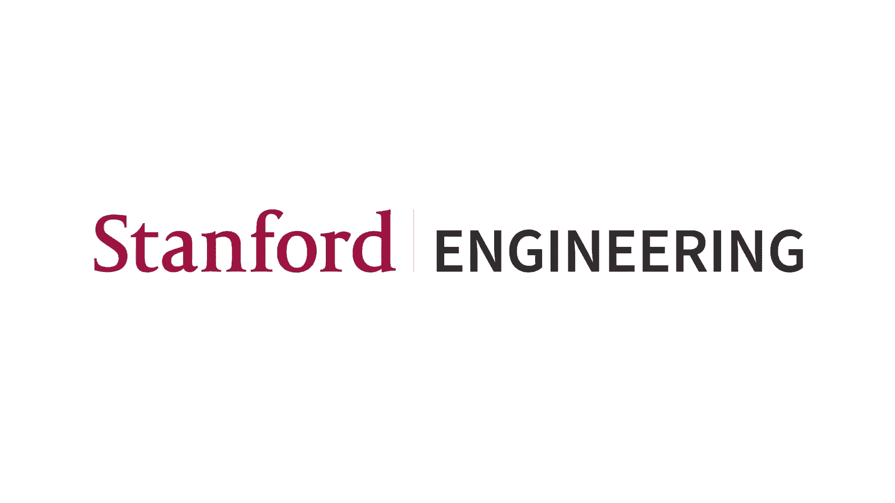
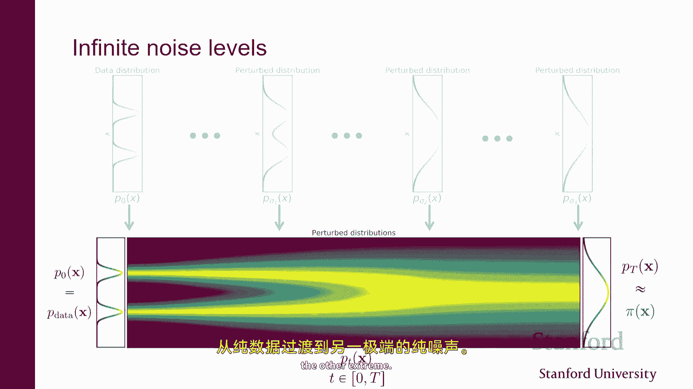
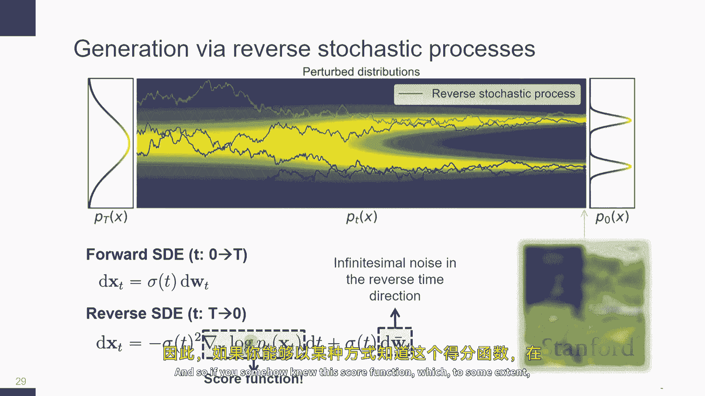
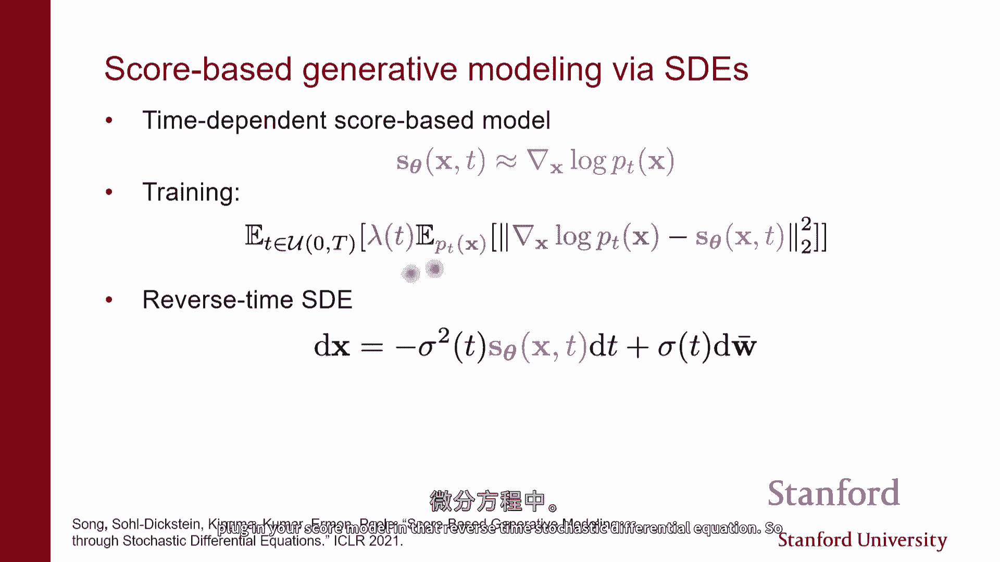
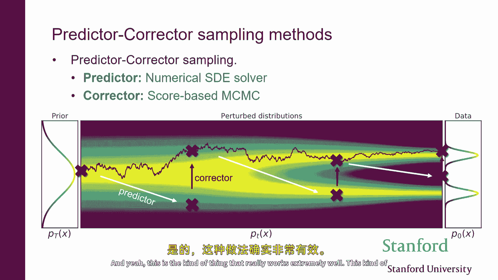
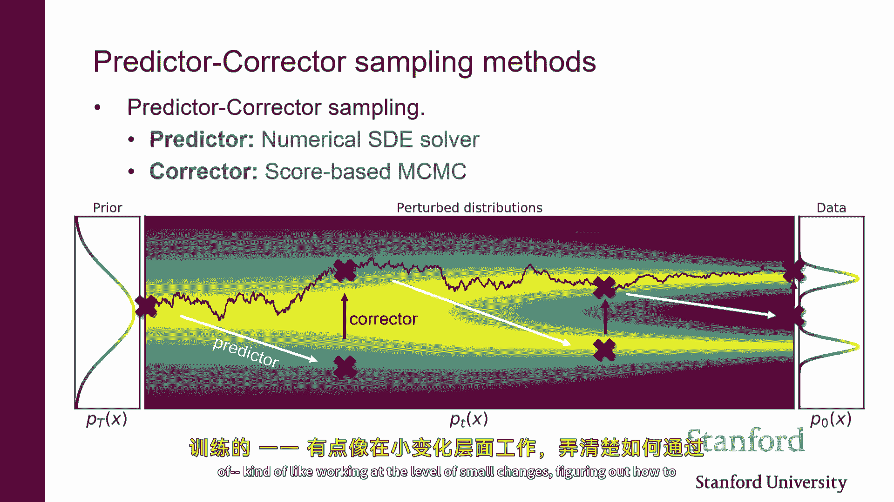

# P14：p14 Stanford CS236： Deep Generative Models I 2023 I Lecture 14 - En - 加加zero - BV1NjH4eYE1v

好的，所以今天的计划是继续讨论基于分数的模型，我们将看到它们如何与扩散模型相连接，所以我们 kind of like 看到，一些目前已被用于生成图像的先进技术，视频。

我们在非常 first 的介绍性讲座中看到的一些东西，所以简短提醒，这是大致的课程今天路线图幻灯片，我们正在谈论扩散模型或基于分数的模型，你可以把它们看作是定义这种家庭模型一种方式，通过参数化得分。

然后通过基本上使用某种类型的得分匹配损失来学习数据分布，你知道我们已经看到那个，是的，那有点像，关键理念是，要表示概率分布，我们将使用一个向量值的神经网络，所以对于每个点，它都给你一个向量。

并且那个向量应该代表得分的梯度，"在那个点上的对数似然"，因此，你可以把它看作是一个向量场，"就像你看到这里的，由某个神经网络参数化的那个"，"因此，当你改变重量时"，"你获得不同的向量场"。

"我们已经看到，将这些模型拟合到数据上是可能的。"，"通过做分数匹配"，因此，我们已经看到你知道，"这个"，我们在讨论基于能量的模型时提到的那种机器，可以非常自然地应用到这些设置中，因此。

有一种方法可以将估计的梯度拟合到真实梯度中，通过最小化这种损失，这仅取决于模型，这是我们通过部分积分得出的东西，是的，这是一种原则性的模型拟合方法，问题是，它在实践中不工作。

如果你因为雅各比术语的迹而处理高维设置，但基本上，它需要很多反向传播步骤，因此，如果你试图说模型图像，它不会去工作，因此在上一堂课中，我们讨论了两种使得分数匹配更可扩展的方法，第一种是去噪分数匹配。

其中，想法是而不是试图模型数据分布的分数，我们将尝试模型这个噪声扰动的数据分布，并且通常我们获得这个噪声扰动的方式，一个分布是通过从一个数据点开始，然后应用这种扰动核，这将给你概率。

由于你有一张干净的图像，X e，在噪声图像x tilde上的分布是什么，并且它可以是像这样的：让我们向x添加高斯噪声，并且，结果发现，估计这种噪声扰动数据的分布得分实际上在计算上更加高效，因此。

通常的得分匹配损失，其中你做回归，带有某种偏差损失，在噪声扰动的数据密度的估计得分和真实得分之间，这就像是这里的主要区别，我们不再估计p数据的得分，我们估计qsigma的得分。

结果发现它可以以这个过渡核的得分的形式重新写，扰动核，给定x的qsigma的xtilde，这就是让我们说一个高斯分布，所以您知道，在正态分布的情况下，主观功能基本上对应于去噪，因为呀。

基本上高斯得分就类似于与均值差异的本质上，所以你可以等价地想象去噪得分匹配，作为解决去噪问题的方法，你所做的是你采样一个数据点，你采样一个噪声向量，然后你将数据加噪声喂给得分模型作为theta。

得分模型的目标是试图估计z基本上，这是您添加到清洁数据x的噪声量，因此，噪音日分数与学习之间的等价性存在，扰动密度并执行无，正如你看到的那样，这要更有效得多，因为我们不再需要处理雅可比元的痕迹。

这就是一切，它是，它是一种你可以高效优化作为函数参数之一的损失，因此，散文是，是的，这更加可扩展，它与去噪的意义有一种直观的对应关系，那个，可能对于去噪工作良好的架构也将工作良好，对于这种得分估计任务。

这种方法的负面影响是，我们不再估计清洁数据分布的得分，我们现在正在估计这种噪声扰动的数据密度的得分，因此我们在这里改变了目标，因为啊，是的，我们不再估计真实数据密度的分数，但我们在估计分数。

即使我们在解决这个问题方面做得很好，即使我们可以将损失驱动到零，我们不会过拟合，一切都很好工作，我们不再估计我们开始时的东西，但我们在估计这个，嗯，噪声扰动的数据密度分数，然后。

我们看到的另一种方法是做一些随机投影，这就是切片得分匹配方法，其中基本上，而不是试图在每个点匹配真实梯度与估计梯度，我们尝试仅匹配它们的投影在某个随机方向上，V 因此。

在每个点我们都根据某种分布采样方向向量v，我们投影真实得分，在每个点投影后的估计得分，你获得标量，然后您比较投影，如果向量场确实相同，然后投影也应该相同，结果发现再次。

这个目标函数可以重写为一个只依赖于你模型的形式，类似于积分分部技巧，而现在这个是可以，高效评价的，作为theta的函数可以高效优化，因为本质上它只涉及方向导数，因此它比原始的分数匹配更可扩展。

它还估计真数据密度的分数，而不是数据密度加上噪声，但是，它与匹配噪音的速度稍微慢一些，因为你仍然需要取导数，基本上，嗯，所以这就是我们结束的地方，有点像上次的讲座，然后我们谈论的另一件事是。

你知道如何做推断，我们说，如果你能够某种方式估计出底层的梯度向量场，通过做一些种类的分数匹配，然后，有一些使用某种类型的随机动态过程来生成样本的方法，你基本上会这样做。

这门课程有点像告诉你你应该朝哪个方向走，如果你想增加你的数据点的概率，只要你按照这些箭头走，你就可以基本上生成样本，我们看到的是，这种方法在实际中并没有起作用，这个，这个方法的变体是有意义的。

但它对于几个原因而不工作，一个是至少对于图像来说，我们期待数据大致像，分布在低维流形上，意味着得分并不是一个真正被明确定义的对象，嗯，我们有一种直觉认为，我们不期望能够学习到准确的得分。

当我们远离数据密度高的区域时，有点像，如果你考虑损失，这取决于你从数据分布中抽取的样本，大多数样本都来自高概率区域，当你远离时，你有一个看起来像什么都没的东西，让我们说像一张图片。

你在训练中从未见过这些东西，你不太可能能够准确地估计得分，这是一个问题，因为然后动态上更大依赖于这种信息来找到高概率区域，所以啊，你可能迷路，你可能无法生成高质量的样本，然后嗯。

我们看到长期动态的收敛速度存在问题，甚至可能不收敛，嗯，如果你有零概率的区域，在某处他们可能无法从一个状态区域移动到另一个区域，从一种可能的图像空间移动到另一种空间，所以这也有点像一个问题。

所以今天我们要看到的是，嗯，实际上，所有这些问题的解决方案都非常简单，嗯，就是我们刚刚讨论过的问题，基本上涉及到添加噪声，添加，让我们假设是正态噪声到数据中，为了看到这一点，我们现在注意到，一个问题是。

如果数据位于一个子空间，然后，分数并没有真正被定义，但是，当你将噪声添加到数据中，那么它就变成了在整个空间上被支持的噪声数据，嗯，你知道你在添加噪声，所以。

任何像素值的可能组合在这个噪声扰动分布下都有一些概率，因此，尽管原始数据位于流形上，当你添加噪声时，你离开了流形，它变成了在整个空间上被支持的，在噪声数据上进行分数匹配将允许我们基本上更准确地估计分数。

这有点像一些实证证据，你知道，如果你尝试在清洁图像上对c进行分数匹配，损失非常，非常波动，你学习得不太好，但是，当你将噪声添加到数据中时，对于你数据的噪声量，有一些微小的标准差，然后。

损失会收敛得更加平滑，嗯，并且它解决了分数匹配在低密度区域不准确的问题，我记得好像直觉是知道，大多数你的数据点都来自，让我们说如果你的数据是一个混合的高斯分布，一个在这里，一个在那里。

大多数数据都将来自训练样本中看到的这个区域或那个区域，数据分布的两个角落，因此，如果你尝试，你知道，使用数据拟合分数模型，中间有一个真正的分数模型，中间有一个真正的分数，右边有一个估计的分数。

它将在高密度区域准确，所以它在远离时将不准确，但如果你再次考虑添加噪声，这对我们来说是一件好事，因为如果你向数据添加噪声，就像它会，噪声样本的密度被扰动，再次分散在整个空间中，所以。

如果你考虑你即将看到样本的地方，如果你在训练中添加足够的噪声，样本将分散在整个空间中，如果你添加足够的噪声，样本将分散在整个空间中，他们将在整个空间中散布，这意味着如果你愿意向数据添加噪声。

并且你添加足够的噪声，那么我们可能能够准确地估计分数在整个空间中，现在，当然，这很好，因为它意味着我们可能能够从我们的长寿命动态采样器中获得有用的信息，如果我们依赖于这些箭头指向高概率区域。

动态采样器如果这样做可能会工作，问题是我们已经不再像近似一样，我们正在估计，我们不再是ah，如果你在这些估计分数上动态地做洗衣服，你将产生，你将从嘈杂的数据分布中生成样本。

所以你将生成类似于这种图像的图像，而不是生成这种图像，所以这就是这里的一种权衡，是的，我们将能够更准确地估计分数，但我们正在估计错误的东西，基本上我们讨论了估计与去噪是同一件事。

所以我猜测它们有什么不同，就像那个概念，因为我们展示了分数匹配是去噪的目标，所以对我来说，我对我们只是向数据添加噪声有些困惑，所以我们在做什么不同，我意思是，之前我们做的事情是。

我们正在估计嘈杂数据分布的分数，所以这里你知道，如果你这样做，是的，你将使用嘈杂的分数匹配，你将解决一个去噪问题，你将学习嘈杂数据分布的分数，现在跟随那个分数，并产生噪声样本，我明白了，他跟随我们做的。

我们将得到嘈杂的图像，我们将得到嘈杂的，但那是问题，这就是我理解的，所以从一方面，你想要的sigma，你添加到数据上的噪声量应该尽可能小，因为那样你将学习到清洁数据的分数，所以如果遵循那些分数。

他们应该生成清洁的样本，另一方面，如果你这样做，我们不期望能够准确地学习分数，所以这就是这里的定理，基本上，这就是与去噪分数匹配之间的区别，那就是去噪分数匹配，我们在真实数据样本上添加噪声。

并估计那个噪声样本，但最终我们将学习新的数据样本，如果噪声小，但这里我们，我们实际上是在估计我们使用噪声，它从第一个地方采样，如果我们使用噪声和分数匹配，并且如果我们使用噪声和分数匹配。

我们将向噪音中添加噪音，然后没有，没有，没有，实际上，你可以使用正方形匹配来估计分数，实际上这就是我们最终要做的，所以你可以，如果你使用去噪匹配，你将取数据，你将添加噪音，你将解决去噪问题。

你最终学到的是扰动数据的分数密度，所以你最终学到这个，但这不是这个，这是你想要的，这不是清洁数据密度的分数，因此，特别是，如果你接着跟随这里的分数，你将产生根据扰动数据密度的样本，因此，特别是。

图像将看起来像这样，不像这样，你是说这个等价于只是继续做匹配写作，所以我没有说如何做这，或者你可以，嗯，所以你甚至可以在这里做切片分数匹配，或 vanilla，正如你可以做切片匹配，例如。

不是 vanilla，但你可以在这里做切片核心匹配来估计这个，嗯，gnostic 分数匹配将是一个更自然的选择，因为它更快，并且它自动给你扰动数据密度的分数，所以是的，我只是说即使你能估计出这些分数。

它们不是你想要的，使用 denoscore 匹配将是一个非常自然的方式来估计这个课程，这就是我们实际上要去做的，你说像真实数据一样，它们存在于两个引号中，你喜欢，用不同的话说，但这意味着什么。

像现实生活中，做这些工作有效，什么可以工作，他们可能会打电话什么，是的，基本上意味着像，如果你还记得上一张幻灯片，我们正在说，好的，如果你对数据进行PCA，并且你保留足够的组件，你需要构建数据几乎完美。

这基本上意味着图像中的不同像素，它们不是线性独立的，它们它们像，一旦你知道它们的一部分，你可以自动获取其余的，这基本上意味着图像躺在某种平面上，本质上这是大致的我像这里可视化的形状。

所以并非所有可能的像素值在数据分布中都是有效的，本质上存在一些约束，你可以将其视为编码，这种曲线，我们数据集中的所有图像，它们躺在表面上，因此得分并不完全明确，因为离曲线意味着什么。

然后基本上概率在离曲线时变为零，因此它可以爆炸，基本上，一旦你是噪声，然后基本上任何像素值的组合都是有效的，对吧，因为总有一些概率可以添加正确的噪声量，使得这种组合成为可能。

如果你想象数据躺在平面上或这种表面上，然后添加噪声，你像是在移动值一点，然后它不再躺在那个平面上，或不再躺在表面上，所以你打破了对真实数据的那个约束，不再适用于噪声扰动的数据，这有助于估计梯度。

像真实数据一样，如果它躺在低维子空间中，那么像有一些点从未发生过，嗯但就像当你添加像这样的小量噪声时，它仍然感觉像有一种低数据问题，或像任何真的很远，随机的像素组合，永远不会像，基本上永远不会发生。

即使它有一个非常好的概率，那么是像，或者我们看到像，基本上一个太小的噪声量，你做的，这个像什么都没改变，所以是的，所以噪声稍微大一点变得更加稳定，但你有这个问题，像你所说的，如果你添加了足够的小噪音。

你知道它会大致像，实际上没有真正的断裂，所以是的，你添加了一个非常小的噪音，你的噪音每株草数据分布非常接近你想要的，所以这很棒，但你实际上并没有解决我们这里的问题，基本上这就是像。

我在下一张幻灯片中的东西，这有点像问题，我们想要添加的噪音量是多少，你想要添加一点点小的噪音吗，你想要添加大量的噪音吗，有一种，如果你思考，你知道你可以添加的不同噪音量，你将得到不同种类的权衡。

你可以想象你知道有真实的数据密度，有真实的路线，如果你试图使用分数匹配来估计它们，将会有很多错误，就像在这个区域，如我们所讨论，那么你可以说，好的，我要，我要添加一点噪音，所以我不再估计正确的事情。

所以到处都会有一点错误，因为我在估计噪音，而不是真正的分数，但我的估计开始变得稍微好一点，然后你可以添加更多的噪音，然后到某个点就像你做得很好地估计了分数，但你在估计完全错误的东西。

因为你给数据添加了太多的噪音，也许这就是极端，你有大量的噪音，你完全分散了注意力，破坏了数据中存在的结构，所以你估计的东西与你从开始的清洁图像无关，但你在分数估计上做得很好，因为变得很容易。

这些都是你需要平衡的，你知道我们想要准确地估计分数，所以我们希望添加尽可能多的噪音来做到这一点，但同时，添加噪音会降低我们生成的东西的质量，因为我们在估计噪声扰动的数据密度的分数。

所以我们不再估计我们想要估计的东西，这个是我们上面有的東西是哪個，但是，我們在估計一個被大量噪音添加後的數據分布的得分，噪聲認為的得分匹配東西，所以，那就是帖子已經發出來了。

這就是它被限制於的不僅僅是你可以估計這些，你不僅可以用於匹配來估計這些數據分布的得分，但是，它將會進行啊，它可能變得非常壞，類似於，如果你添加的噪聲量非常小，所以这就像你看到的那样，在这里你看到的东西。

这可能是干净的得分，或者这可能有一些噪音，嗯，噪音匹配对于匹配来说效果不会太好，你可以使用的技术，仅在这个课程中，对于任何好事，但我们实际上正在改变分数，就像是击球，随着我们获得更多的分数。

没有匹配的denoscore并不是估计噪声分数的方法，带有任何必要噪声的扰动数据密度，问题是你想要添加多少噪声，你想要添加尽可能少的噪声，因为你想要估计接近真实数据的东西，但是，你添加的噪声越多。

估计就越好，而且，不清楚如何做到，就像当我们添加一些噪音时，我们实际上是在做，是一种具有间断性的函数，种特性，所以如果你做像扰动一样，你可以大致计算出梯度，很容易超过另一个。

然后我们 sort of 使函数平滑，这样找梯度就容易，但它并不准确，是的，你在错误的地方使用了你的估计梯度，是的，所以这可能是另一种思考这个问题的方式，比如，想象一下。

数据 somehow 躺在这条曲线上，这就像二维空间中的一条曲线啊，你知道，你的大部分样本都将接近那个，接近我们 here 的这个厚线，正在发生，所以如果你远离黑色曲线估计分数，估计将会相当不准确。

那么你可以想象，好的，让我们添加大量的噪声sigma三，那么大多数样本都将是，你知道，离黑色曲线相当远，所以我们将得到相当好的方向信息，当你远离一个干净的样本时，从一个干净的样本中，但它将会不准确。

当你接近真实的地方，那里真实数据存在时，然后你可以想象一个场景，你有一种像，一个由不同噪声水平组成的集合，你不仅仅是考虑一个噪声水平，但你是考虑许多他们，因此，你可以在远离时获得良好的方向信息。

当我们稍微靠近，稍微靠近时，到真实数据分布，这有点像扩散模型或基于分数的模型的主要基本思想，关键思想是我们不仅仅是要学习数据的分数，或者是我们不仅仅是要学习数据加上一个单一的噪声量。

或者是我们要尝试学习被扰动的数据的分数，以不同数量的噪声，这有点像直觉，所以具体来说，我们将考虑不同数量的噪声，sigma一，sigma二，一直走到sigma l。

我们将使用被称为anneal the longein dynamics的东西，基本上来生成样本，基本想法是，你知道当我们开始时，我们初始化我们的ladynamics程序，样本中可能会有非常少的结构。

它们不像自然图像，因此，我们可以做的一件事是，我们可以跟随对数据分布的得分估计，加上大量的噪声，一段时间，你知道如果你继续运行这个东西，那么你将能够从当时的数据分布中生成样本，加上大量的噪声。

这并不是我们想要的，但我们可以做的是，我们可以使用这些样本来初始化另一个更大的动态过程，在那里我们稍微减少了噪声的数量，然后你基本上在你的动态过程中继续运行你的洗衣服。

按照数据密度对应的分数加上一个小量的噪声sigma two，然后您甚至更少，您初始化，因为您越来越接近，有点像向高数据密度区域，然后我们知道现在开始看到数据中更多的结构，因此我们应该跟随数据密度的分数。

再加上一点非常小的噪声，然后，你再次跟随箭头的方向，然后你正在生成我们实际上喜欢的样本，就是我们实际上想要的样本，因为到这个时候，我们可以得到最好的两种世界的结合，因为到最后一步。

我们正在从数据中生成样本，再加上一点非常小的噪声，但在采样过程中，我们始终像在获取相对准确的分数估计，因为我们在考虑多种噪声尺度，所以，在最开始的时候，当数据中没有结构时。

我们正在跟随对应于数据加上大量噪声的分数，然后，随着我们对数据的结构添加越来越多，因为我们正在向这些箭头所指向的更高概率区域移动，然后，我们可以承受减少，基本上考虑被较小噪声扰动的数据的梯度。

这个程序将像我们一样得到最好的两种世界，因为长期动态永远不会丢失，我们始终在跟随一个相当准确的梯度估计，但同时，到最后，我们能够为包含噪声的数据分布生成样本，其中噪声水平sigma3可以非常，非常小。

所以，你产生的最终样本将几乎在多少不同噪声和序列指示上干净，以及它们应该看起来什么样子，是的，所以，人们通常使用一千，那是魔法数字，但在讲座的第二部分，我们将谈论无限数量，所以我们将谈论一个无限的数量。

所以，做事情的自然方式是实际上在那里，嗯，是不够的，这基本上是得到许多结构的最佳方式，许多令人感兴趣的，所以，这就是直觉，你可以在这里看到，另一个例子是如果你只是运行lain动力学，嗯。

它基本上有这个问题，你看到太多的粒子在这里，因为它混合得不够迅速，尽管这里应该有更多的概率质量，意味着更多的粒子应该结束在这里，他们只是像太多在这里，因为箭头基本上，是的，你没有准确地估计事情。

如果你运行新的lain动力学，所以，你用这个程序，其中你运行多个lain动力学链，对应于不同程度的噪声，最后，它给你正确的分布，在那里，你看到很少的粒子在这里，代表事实，那里应该较少的概率质量，嗯。

是的，这是另一个例子，大致展示这个，但我想念跳过，那么在实践中意味着什么，在实践中这意味着为了做这件事，你需要能够估计分数，不仅仅是数据密度的分数，不仅仅是数据密度的分数，再加上一定的固定噪声。

但是你需要能够共同估计数据的得分，再加上不同程度的噪声水平，各种程度的噪声水平，所以你需要能够知道数据的得分，再加上大量的噪声，你需要能够知道数据的得分，再加上稍微少一点的噪声。

一直到数据中添加的非常非常小的噪声，在那里，它几乎就像是，真正的数据密度，而且这很好，因为如果你在动态中启动一个新项目，即使这个核心只有在数据密度高的区域才能准确估计，我们仍然有这个问题。

比如这里的得分不会在每个地方都被准确估计，它只有在你很接近时才会被准确估计，让我们说一张真实图片，但这很好因为我们正在使用这条动态程序线，我们只会在采样的末尾使用这一分数模型。

当我们已经对想要什么样的图像有了一个相当好的想法时，而这里的得分，这是数据，再加上大量的噪声，我们将能够相当准确地估计出来，在采样的开始，每个地方都将表现得很好，但我们不想只是简单地跟随那个。

因为我们想要能够从接近清洁数据分布的地方采样，因此为了提高效率，我们可能会做这样一件事，你知道，你可能可以训练不同的得分网络，一个为每个噪声水平，如果你有，让我们假设有一千个噪音水平。

那意味着有一千个不同的神经网络，有点像训练，每个网络都被训练在一个不同种类的向量场上，为了在实际中提高效率，你可以做的一件事是你可以有一个单一的神经网络，它接受一个额外的输入参数，Sigma。

这基本上就是我们考虑的噪音量，而单一的神经网络将共同估计所有这些不同向量场，所以当你在这里输入一个大的sigma值时，然后网络知道它应该估计的向量场是，让我们说，数据加上大量的噪声很好，当你输入时。

一个小的sigma值，然后网络知道它需要估计的向量场是数据密度，加上一个小量的噪声，所以这就是基本上一种方式，可以使计算更加高效，因为我们现在有一个训练所有这些不同估计问题的单一模型。

它将比单独训练一千个模型差，但它将更加高效，因为你知道我们只是在那个点训练一个神经网络，所以在这种情况下我们学习向量场，不是概率分布，但是当你对基于能量的模型进行分数匹配时。

那么在这种情况下我们是在学习一个有封闭形式解的ode，我们隐含地假设因为我们的输出是概率分布的梯度，而不是只是学习向量场，所以，在，是的，所以我们在这里学习的是，这些向量场并不一定是保守的。

除非你以某种方式参数化网络，你可以潜在地参数化网络，使其是能量函数的梯度，实际上，这样做对性能影响不大，但它实际上似乎并没有帮助，所以在实践中，你可以使用自由形式的神经网络，它从，例如，图像到图像。

这不成问题，但你是对的，它不一定是能量函数潜在能的梯度，所以，奇怪的事情可能会发生，如果你沿着一个循环走，概率可能会上升或下降，即使真的有一个潜在的能量，不应该改变对吧，概率，所以这可能是一个问题。

但在实践中，它工作，是的，你不总是水平化，你可以从一个真实的点到多个扰动点，所以我们得到假设，噪声级别的数量，这不是问题，但它确实，给定噪声水平，它是生成多次使用一次真实的啊，所以你的意思是。

当我们在lain程序中时，或者当数据，或者嗯，你可以生成，所以，我们现在还没有讨论我们如何实际学习它，我只是在说模型看起来什么样子，所以模型将是一个单一的神经网络，它将尝试同时估计所有这些分数。

我们如何实际学习它，我们将通过分数匹配的噪声来学习它，所以会有这样一个条件噪声得分网络，它将是一个联合估计所有这个向量场得分的网络，你知道，我们应该如何训练这个，你可以做切片得分匹配。

使用去噪得分匹配更加自然，因为去噪得分匹配已经给你了噪声扰动的数据密度得分，你完全可以直接使用那个，所以因为我们嗯，因为我们试图模型数据加噪声的得分，我们最好直接使用噪声和得分匹配。

因为那样稍微更有效率，然后，损失函数将会是某种，像加权组合的噪声得分匹配损失，因为我们想要同时解决，假设一千个不同的任务，所以损失函数可能看起来像这样，我们中有一个噪声条件得分网络，它接受输入。

一个数据点和噪声水平，并试图估计在给定噪声水平和点的数据分布上的得分，我们有X，我们希望训练这个得分网络在不同的噪声水平上都能表现良好，所以如果你有l个噪声水平，这个噪声网络，这个噪声条件得分网络。

应该能够解决所有这些不同的回归问题，尽可能好，所以这里有一个lambda sigma i参数，基本上控制你如何关心准确地估计在不同的噪声水平上的得分，因为数据现在已经被扰动了，我们不添加额外的扰动。

是的，所以损失将看起来像这样，所以数据像你说的那样干净，然后您添加与您关心的sigma相应的噪声，然后您尝试去噪那个数据点，所以从去噪的角度来看，我们不仅仅是学习如何去噪已经被扰动的数据。

以固定的噪声量，我们基本上在学习一个去噪器的家族，每个一个都处理不同量的噪声，所以有一个在数据被错误地腐蚀时工作的去噪器，并且有大量的噪声，并且将有一个在数据被错误地腐蚀时工作的去噪器。

从几乎不添加到数据上的噪声一直到少量的噪声，这些是不同的去噪问题，相当于对应于估计不同的分布，被噪声扰动的数据分布，不再必须是样本，是的，所以当噪声非常大时，基本上去噪非常困难，如果我有无限量的噪音。

基本上所有的结构和原始数据都会丢失，你最好的做法是基本上输出平均图像，基本上正确，这就是你唯一能做的，没有，在x中没有有用信息，关于x的波浪线，所以最好的做法是。

基本上如果你试图最小化l2损失来预测平均值，你可以想象，如果你只有这些，那么你就无法生成好的照片，但是因为你知道如何用比，如果你知道所有这些评分模型，那么你就可以做那个neo lain动态过程。

并且你可以实际上在最后生成干净的照片，你说我们可以自定义lambda函数来分配权重，但从实际应用的角度来看，我们正在寻找什么样的lambda函数，所以是的，我们将讨论在理论上哪些事情关于羊羔有意义。

如果你有无限的容量，这个模型无比强大，甚至都不重要，因为它可以基本上完美地解决每个任务，在实际应用中，重要的是你如何权重这个问题，这些不同的评分匹配损失，我们将讨论这个问题，是的，所以但是。

损失函数基本上看起来像这样，这是一个分数匹配的混合体，去噪，在所有我们考虑的不同噪声水平上，分数匹配的目标，你说像纠正的那样，如果你如果你有不同的噪声水平，那么梯度是否会以某种偷窃因子的方式相关。

因为总体方向是一样的，所以对我来说，我有些，我想像，我们为什么不能学习一种模型，然后只是放大它，因为它们有点像学习率，所以像您知道，如果您离得很远，尝试估计它，像您知道，我只粘上一个估计来创建。

然后只是放大它，然后只是通过大量的放大并移动方向，当你越接近，你知道，把它写下来，这样你知道你会收敛，那么为什么不这样做，因为如果你像你可能的高斯形状，我假设我们应该能够放大梯度也，但是仍然是得分。

我的意思，所以不是那么简单，所以事实是他们都与彼此有关，理论上如果你知道在某一噪声水平上的得分，理论上你可以恢复不同噪声水平的得分，但这不仅仅是放大，所以有一种叫做福克克-普朗克方程的东西。

如果你要解决这个方程，最终就是pd，但如果你能够解决这个pd，这基本上告诉你得分如何相互关联，但在tractable上你是，是的，你可以尝试强制执行它，我们有许多关于这种尝试的论文。

我们有许多论文试图强制执行这个条件，因为在某种程度上，这是将所有这些任务视为独立的，但我们知道，正如您所建议，它们彼此相关，因此，你可能能做得更好，如果将损失联系起来，因为你知道。

如何从一个解决方案移动到另一个解决方案，在实际中，这似乎没有帮助多少，但你是对的，有一种叫做是的，如果你能解决福克克-普朗克方程，你可以从，是的，从任何得分移动到任何其他得分，至少在连续时间，酷。

所以现在我们需要，我们有几个选择要做，我们需要选择，嗯，我们将考虑哪种类型的噪声尺度，因此，我们需要决定我们将添加多少最大噪声，我们需要决定我们将添加多少最小噪声，我们需要决定如何在这两个极端之间插入。

本质上，对于最大噪声尺度，你可能想要选择它大约是任何两个数据点之间的最大对角线距离，想法大致是，如果你有数据集中的两张图像x1和x2，你想要噪声的量足够大，所以基本上从一个数据点到另一个数据点是可能的。

如果你添加一些噪声，本质上，所以如果你从数据点一开始，并且添加了足够的噪声，应该有一个合理的概率生成数据点二，并且相当于反过来，在另一个方向，这基本上确保了像一开始那样，当你做，你开始你的动力学程序时。

添加了大量的噪声，这些噪声将混合，它将会相当高效地探索空间，因为基本上可以从任何一点到达任何其他点，这就像，对于这个选择的直觉，啊，最小噪声尺度，你可能希望它足够小，这样。

图像加上噪声几乎难以与清洁图像区分，所以mac，最小噪声尺度应该非常小，非常小，然后嗯，另一件事是要决定你从最大值到最小值如何过渡，所以如何从这两个极端之间插值，再次。

想法是如果你考虑那个动力程序中的启动，我们想要确保这些不同噪音技能有足够的重叠，这样当你初始化对应于下一个噪音级别的动态链时，你开始与有意义的东西，所以如果你想象你有这个，一种球体。

你在越来越对应于像样的，你将得到的结果，或者概率大致就像你增加的噪声量越多，嗯，然后你走到sigma two，Sigma one sigma three，基本上你想要确保的是当你有。

让我们说数据加上噪声水平sigma two，应该有足够的重叠与你预期的数据点类型，当你有数据加上噪声水平sigma tree，所以当你使用通过运行更大的动态获得的样本时，使用sigma来调整噪声水平。

然后你们用它们来初始化与噪声水平对应的拉因链，sigma三，你有一种有点像有意义的东西，因为如果没有重叠，所以您去非常极端，您有像噪音水平大幅降低的情况，所以您从大量的噪音过渡到稍微好一点的噪音。

在运行大量噪声的拉因链后，您不会得到下一个噪声水平良好的初始化，但如果这些噪声水平之间有足够的重叠，那么你就有点像，你可能期待这个anneil lain动态过程实际上能工作得很好，是的。

我们必须读出除了是的其他内容，是的，所以我们知道，你知道，我们正在决定如何计算sigma，是的，所以你可以做，你可以实际上计算出来，你知道一些关于什么是有意义的数学知识，而且它大致上讲也有意义。

根据这个启发式，基本上使用不同噪声水平之间的某种几何序列，这种确保了不同壳之间的重叠足够，随着你增加或减少添加噪声的数量，你得到的不同壳，并且这是一个启发式，它不是必然的唯一选择。

但就像这是我们做的第一个，看起来有效的，选项，"其他的嗯"，"有点" 或 "稍微"，嗯，我们可以决定的是等待的因素，"记住，我们是在共同解决与不同噪声水平对应的所有估计问题。"。

我们应如何关心由这个lambda sigma控制的不同噪音水平？"一种决定你如何赋予权重的超参数"，"损失的各个组成部分"，"那么，我们如何选择这个加权函数呢？"，"想法是。

你想要平衡损失中不同组成部分的重要性"，并且一个再次工作良好的合理启发式是，在实际应用中，选择等于你添加的噪声量的那个，那个鼓励我们喜欢的，忽略，像嗯，像嗯，更精细调整，像嗯，噪声看起来。

这是因为箭头的大小改变，此外，它的缩放方式，我在这里有它吗，所以损失将看起来像这样，基本上，嗯，是的，实际上，在不同的噪声水平上，你最终会携带相同的东西，如果你做出选择，由于各种缩放因子。

所以他们记得这里有一个ci，所以这是，所以这是再次，这更像是一个选择，其他选择也可以工作，但这是我们做的事情，是的，它是我之前有人问过的方式，epsilon theta被定义为，基本上是分数的缩放版本。

 epsilon数据有什么含义吗， epsilon数据代表什么，是的，所以 epsilon数据在这里基本上是一个噪声预测，因为基本上就是估计被添加的，噪声，有各种参数化，你可能想要预测，如我们所讨论的。

当噪声水平非常高时，你可能想要预测平均值，所以有各种参数化方式，网络应该输出的东西，这是最简单的一种，你在预测，噪声，这是一种任务，所以是的，最终的损失看起来像这样，你基本上采样一个小批量的数据点。

然后采样一个小批量的噪声索引，所以你，你基本上等价于选择了一堆噪声水平，一个为数据点，啊，这是对不同噪声尺度我们愿意考虑的均匀采样，这可能是l这里可能是一千，如果你有一千个不同噪声水平，嗯。

然后你做的就是你采样噪声独立，每个数据点一个噪声向量，然后你基本上训练这个分数网络，来解决每个数据点的去噪问题，实质上，使用我们之前有过的加权函数，基本上，使用 epsilon 数据，然后嗯，那就是嗯。

然后您基本上只需要对这个损失进行随机梯度下降，试图找到参数theta，使它们最小化这个去噪损失，这相当于基本上估计这些各种噪声水平下的数据密度得分，以及您所能做到的，然后嗯，嗯。

所以基本上一切都与训练单个一样高效，嗯，得分模型，因为所有的东西都被摊销，并且有一个单一的得分网络，它被共同训练来估计数据的得分，再加上不同噪声强度的噪声，所以最终的东西看起来像这样，嗯，你有数据。

干净的数据，然后在最后你有噪声，所以那将是相应的有点像不同的，嗯，被扰动的数据分布的版本，从清洁数据中逐渐增加大量的噪声，中等程度的扰动数据，一直到数据，再加上大量的噪声，基本上结构完全被破坏。

所以从视觉上看，你可以把清洁数据想象成，再加上一点噪声，更多的噪声，更多的噪声，更多的噪音，一直到巨大的噪音量，甚至你都不认识你从哪里开始，你知道，在时间安排上，我们总是喜欢这样，去一个大的汤圆。

所以几何序列总是有，或者有像不同的，所以你在考虑增加和减少，并且做其他的事情，啊，我认为从原则上来说，你可以做这种实际上的，是的，人们，我意思是你可以，但是不是这样，在学习过程中，我想总会有。

我意思是它是一个标量，因此，总会有一个排序，因此，你将始终在考虑，他们将始终从最小的噪声量到最大的噪声量进行排序，进行推理，可能会有意义做不同于我所描述的像洗衣房动力学那样的事情，从穿着大量噪声开始。

然后一直走到清洁的数据，有一些版本你可能不想这样做，因此，你可能想要直接从噪声到数据，然后可能一点噪声，然后返回，嗯，所以是的，有很多灵活性，然后，训练时间，你需要估计所有这些，总是有一个平均值。

总是有一个最大值，然后你可以考虑你怎么，嗯，是的，你怎么排列它们，再说一次，预处理问题的问题，是的，如何并行训练它们，我们训练了所有这些，是的，是的，是的，是的，所以所有这些是，有一个单一的模型。

它被共同训练来解决所有这些去噪任务，实际上，你可以获得更好的性能，如果你愿意考虑多个，像现在一些最先进的模型那样，它们没有一个，它们可能有几个，因为他们能负担得起训练许多不同的去噪模型，这可能有意义做。

因为这是纯粹的计算技巧，如果你能，它将更好地结合单独估计每个噪声级别的分数，所以然后对于每个噪声级别，将有不同的噪声级别，将有对应于每个噪声级别的数据密度加噪声，我们将其表示为p sigma one。

这与我们开始时的两个sigma相同，所以你可以认为数据变得越来越腐败，随着你从左到右移动，每个噪声级别的数据，将有一个对应的分数，一个模型，所以所有这些分数都将因为添加了越来越大量的噪声而不同。

然后有一个单一的神经网络，它被共同训练来估计所有这些向量场，网络接受数据x，你在这个图中的位置，和sigma，它将估计那个级别的噪声的分数，嗯，我们共同训练它们通过这种混合噪声分数，匹配目标，嗯。

这就是混合常规分数匹配玻璃的混合，然后我们再做一次长棒动力学采样，所以你会做这样一件事，你将你的分子初始化为随机的，假设这大约等于纯粹的噪声，所以我们在这里初始化我们的分子。

然后我们跟随p sigma 3的分数，这是大量的噪声加上数据，我们正在逐渐接近数据密度更高的区域，然后，我们使用这些样本来初始化一个新的更大动态链，对应于数据密度，加上稍微少的噪声。

我们再次跟随这些箭头，你看到分子正在向原始数据密度的高概率区域移动，所以它们在某种程度上变得越来越有结构，然后，我们使用这些分子来初始化另一个更长的链，对应于甚至更小的噪声量，最后。

我们得到非常接近原始数据密度的样本，因为sigma 1 非常非常小，所以这几乎与清洁数据相同，在整个过程中，我们得到了很好的信息，从分数模型中，我们得到了很好的方向信息。

因为我们使用了与数据密度中相应的噪声水平，它似乎更像是一个确定性的过程，对于给定的噪声水平，你总是得到分布中的一个特定模式，就像日落，如果它是生成器的工具，你期待像是多模态，我猜想核心功能。

和感觉你可以，你应该有一个微小的概率去任何模式或任何，我猜想这里的簇，和我猜想像，那是我在这里看到的东西，所以只是好奇，像你的观点，是的，所以那是一个好问题，虽然箭头指向你的方向是正确的。

但方向只有一个，因为它是确定性的，记住，在动力学中，内衣跟随箭头移动，但它也在每一步中添加噪声，因此，无论你在哪里，如果你运行它足够长时间，在很长一段时间内，你可能最终结束在某个完全不同的地方，所以。

尽管你初始化了粒子在同一点，也许你初始化在这里，由于长期动力学的随机性，你可能结束在完全不同的地方，这意味着你将生成完全不同的，让我们说，图像，因此，这就是，程序，嗯，Neo Lain动力学。

在这里你可以看到它如何工作，嗯，这是大约会发生的事情，如果你按照那个确切的程序处理实际数据集，嗯，让我再播放一次，所以你可以看到你从纯噪声开始，然后你像是在跟随这些箭头，你在跟随这些梯度。

你慢慢地基本上将噪声转化为数据，在这里你可以看到一些图像数据集的例子，例如，C4。10等，你可以看到它具有从噪声到数据的这种风味，通过跟随这些，这些核心模型，是的，我们有多少数据，以及类似的，是多少。

这是一个很好的问题，你想要做多少步，尽可能多地做，在实际中，嗯，这很昂贵，所以你可能想要做一到两步，或者可能十步，每一步都很昂贵，因为它需要全神经网络的评估，因此，这也是一个超参数，你应该尽可能多地做。

但做的越多，生成样本就越昂贵，一般来说，所有的图片都是，这些都是通过布林动力学和莱恩动力学程序生成的，哦，是的，所以MNIST基本上是一个数据集，包含手写的数字，它们看起来大致是这样的，然后。

你有人们的面孔，你看十个样本，所以，这些都是由这个模型生成的相当好样的样本，它们有正确的结构，而且，母亲能够生成看起来合理的图像，是的，在训练中，我们选择几个离散的系统值并拟合模型，是的。

并且在一周中一顿饭，我们可以像，从连续中选择，所以什么会变为连续，嗯不久，是的，目前，是的，这些都是离散的，你需要按照同样的时间表下跪，是的，我想就像现在你们看到的，主要是这种模型被使用。

我想使用高效的模型比舞蹈有客观的好处，就像，我想从理论角度看，因为我们看到他们在实践中得到更好的结果，但那是否从理论上得到支持，出于某种原因，这不是理论上的根基，我认为一个关键优势是嗯，如果你想想。

他们在推理时可能会更昂贵，就像想象你在动态链中运行洗衣房，这可能涉及到评估神经网络一百万次，所以如果你想想，从那个角度来看，我们有一个非常深的计算图，你在推理时被允许使用。

但在训练时你永远不会真正展开它，这就是关键洞察，你在推理时允许使用大量的计算，但训练它并不昂贵，因为它不像那样再次训练，通过生成完整的样本并检查，我应该如何更改我的参数来使样本更好，它以增量的方式训练。

类似于稍微，改善样本一点，然后在推理时重复那种程序，然后你可以得到伟大的样本，所以我认为这就是他们为什么稍微最大化的原因，但这不是我的观点，我想就像，是的，我想他们两者都将是等价的。

至少从数据生成或类似的角度来看，匹配某种分布或类似的东西，这将是一个目标，从那个角度看，扩散模型处于一个最终的规模，是的，我想他们正在以完全不同的方式训练，没有双样本测试，他们展示了一个分数。

架构的匹配是不同的，你在训练和推理时间使用的计算量是不同的，所以有很多东西改变，很难说，没有关于这为什么是更好的理论论据，但在实践中，是的，它似乎正在主导，它也更容易训练，因为所有的东西都是分数匹配。

所以没有最大化，我认为当我们讨论世界时，有一个类比，所有这些跟踪的，如何会那样，但还不是扩散模型，是的，所以我们将希望稍后讨论那个，但我们很快就会看到流模型，是的，所以，是的，现在。

如果你看看我们将在后面讨论的一些特定类型的指标，她在几堂课上讲过，但你知道，这是第一个实际上能够击败GANs的模型，在那时，GANs就像图像生成的状态-of-the-art，这是第一个。

暗示这些类型的模型实际上可以超过GANs，尽管投入了大量的，你知道，年复一年，大量的资源在优化GANs上，这个实际上能够根据某些指标提高样本质量，嗯，你知道。

这些是在 different 类型的数据集上，稍微扩大模型，它可以生成相当合理的人的面部和纪念碑等图像，和类似的东西，是的，稍微扩大一点，模型可以生成相当合理的人脸和纪念碑等图像，和类似的东西，是的。

那就是度量的起始度量指标，是的，我们将在未来的讲师中更详细地讨论这些指标，但是，有一些指标试图量化样本的质量，它们与样本的匹配程度有多近，它们与，样本的视觉吸引力有多高有关，它们是自动化的。

所以没有人类在循环中，它们与样本的质量有一定的相关性，但不是非常重要的，他们确切是什么，但重要的是，它是一种有点像第一个模型的东西，实际上，这种模型与GANs相当竞争，这就是那种像样的提示。

关于如何大规模扩展这些模型的后续工作，噪声水平是作为一个例子的，作为什么的，嗯，是的，所以这非常有前途，你可能也会好奇，我认为我也在这里被稍微带起来了，就像嗯，噪音不是这个样子吗。

你在推理时使用的噪音水平必须与训练时看到的噪音水平相匹配，我们可以使用更少的噪音级别吗，所以，自然而然地思考会发生什么，如果你有无限数量的噪音级别，我们现在有一种像清洁数据分布的情况，哪。

让我们说它是两个高斯分布的混合，所以这里，你知道黄色是高概率密度，你知道蓝色是低概率密度，然后到目前为止，我们所说的是我们将考虑这个数据分布的多个版本被扰动，随着越来越大的噪声量。

所以sigma一sigma二sigma三，其中sigma三是一个非常大量的高斯噪声，所以这种数据结构基本上被完全丢失，所以如果你从一个分布开始，这只是两个高斯分布的混合，在你添加了足够的噪声后。

你只剩下纯粹的噪声，本质上，并且你可以想象，嗯，使用你知道的，也许我在这里有三种不同的信噪比，你可以想象一个井，你知道，并且你可以总是像这些密度一样绘制，所以您有，您知道大部分概率质量在这里和这里。

因为它是由两个高斯分布混合的，然后您可以看到概率质量分散，随着您向数据中添加越来越多的高斯噪声，现在您可能会想，如果我们考虑多个介于两者之间的噪声水平。

如果我们添加一个介于零和sigma一之间的噪声水平，那么你将得到一个介于这两个之间的密度，在极限中，你可以思考如果你考虑无限数量的噪声水平，从零到最大量，那么你将得到无限数量的数据密度扰动。

随着越来越大的噪声，它们现在由t索引，t是一个连续类型的随机变量，从零到您右上角的最大量，另一方面，所以这里的每一片，每一条垂直的切片基本上就是，数据对话的密度，我们添加了对应于这个连续索引的噪声。

t right，所以你可以看到我如何来到这里，我们开始时有一个有限的噪声水平，所有的概率质量都在这里，然后它分散，然后您可以考虑更细的，一种插值，越来越细，直到您有连续的东西。

所以你从时间零的纯数据开始，在这里在左边到极端的纯噪声，嗯，对应于您添加到数据上的最大量的数量，所以现在，而不是有一千个不同版本的数据，它们被扰动得越来越大的噪声，您有无限个数据密度，嗯。

它们被扰动得越来越大的噪声，嗯，所以您可以想我们之前在做什么，就像是在这里选择一千个不同的切片，并模型这些数据分布，但实际上有无限个它们，这个视角实际上是非常有用的，正如我们将看到，嗯，非常有用。

所以您有这个种序列的分布，P零只是干净的数据，Pt在另一个极端是您添加最大噪声时得到的结果，您可以将其视为某种噪声分布，在那里数据的结构完全丢失，这相当于基本上纯噪声，这对应于基本上纯噪声，因此。

当你从左到右移动时，你正在增加你添加到数据中的音量，所以你从纯数据到纯噪声，在另一个极端。

现在你可以想象，嗯，如果你，嗯，用越来越大量的噪声扰动数据，会发生的是，你从开始分布于p零的点开始，按照数据密度分布，例如，你从这些四个图像开始，然后当你从左到右移动时。

你正在逐渐向这些数据样本添加噪声，直到你只剩下纯噪声，所以你可以想象有一个随机变量的集合，Xt一为每个时间步，基本上描述你从左到右移动时发生的事情，当你从纯数据到纯噪声时，所有这些随机变量。

你可以认为它是一个随机过程，只是一个集合，和无限数量的随机变量，它们都有密度，Pts，就是这些数据，密度加上我们一直在谈论的噪声，我们可以描述这个的演变或这些随机变量如何随时间变化。

如果你把这个轴视为时间滑块和维度，那么所有这些随机变量都与彼此相关，我们可以使用称为随机微分方程的东西来描述它们的关系，它不是非常重要的是什么，但它基本上是一个简单的公式，关系这些随机变量的值。

它与普通微分方程相似，这将只是某种确定的进化，因为我们的差异基本上在每个步骤中都是噪声，所以你可以想象粒子从左到右进化，遵循某种确定的，动力学，我们在每个步骤中都添加一些噪声。

特别是它 turns out 如果你只想从纯噪声，从数据到纯噪声，你所需要做的就是，你可以用随机微分方程非常简单地描述这个过程，我们基本上只是 xt 如何无限小地变化。

是由在每个步骤中都添加一些噪声决定的，你可以认为这是某种像随机行走的东西，在每个步骤中添加一些噪声，如果你持续运行这个随机行走足够长的时间，你将得到一个类似于纯噪声的分布，再次，这并不是非常重要的。

但是，有趣的是，我们可以开始思考如果时间方向逆转会发生什么，如果我们逆转时间的方向，现在我们有了一种随时间演化的随机过程，在这里，从左到右，你从数据到噪声，现在。

你可以开始思考如果你逆转了时间的方向会发生什么，然后你从大T到零，所以你从纯噪声到数据，这就是我们想要实现的，如果你想要生成样本，如果你想生成样本，你基本上想要反转这个过程，你想要改变时间的方向，并且。

结果发现，有一个简单的随机微分方程可以描述反向时间的过程，有趣的是，你可以，嗯，用随机微分方程描述这个过程，它相对简单，实际上，你需要的唯一东西是你需要这些噪声的得分函数，扰动的数据密度。

所以如果你 somehow 有访问这个的能力，这些密度的得分函数 pt ts 对应于数据加上时间 t 对应的噪声，那么有一个简单的随机微分方程，你可以使用它来描述这个过程，或者从噪声到数据。

所以如果你 somehow 知道这个得分函数。

你知道到一定程度，我们可以近似，嗯，使用基于得分的模型，我们可以做，我们可以从这个解释中构建一个生成模型，因此，想法是我们要训练一个神经网络，就像以前，我们估计所有这些得分模型或这个真实得分。

这些是数据加上噪声的分数，现在噪声的水平有无限多个，这就是我们以前做的，除了现在t不再取一千个不同的可能值，t可以取无限多个不同的值，但它以前是一样的，我们只是估计p对于千个不同选择的噪声水平的得分。

现在我们为无限数量的它们做这件事，我们通过执行常规的噪声分数匹配目标来做这件事，所以我们想要能够训练一个单一的神经网络作为theta，那共同估计所有这些无限的分数，所以这就是我们之前有过的。

除了不是一千个不同噪声级别的和，现在是对无限多个不同键的积分，我们在图中的所有时间步，如果你能 somehow 训练这个模型很好，你可以将这个损失驱动到 uh 到一个小数字。

这意思是这个得分模型准确地近似真实得分，然后，你可以基本上将你的分数模型插入到那个反向时间随机微分方程中。

所以，记住我们之前有这个sd在这里，使得如此，如果你知道这个得分，然后，你可以解决随机微分方程，你会从噪声转向数据，你取这个精确的方程，你替换真实得分以估计得分，然后你得到和得到那个，而且这个好处是。

现在这是一个被广泛研究的问题，你只需要一个随机微分方程，你只需要解决它，并且有许多数值方法你可以使用，来解决随机微分方程，最简单的一种是基本上类似于欧拉方法在所有ds中，其中你基本上只是离散化时间。

然后你只是通过这个方程步进，所以这是一个连续时间，种进化，你可以只取delta t的增量，然后你基本上将这个连续的量离散化，所以我猜测这里的delta t是负数，所以你减少时间。

然后按照确定的部分在这里走一步，这是由得分给出的，然后在每一步添加一些噪声，所以你看，这就是基本上与lain动力学相同的，它总是某种跟随梯度的形式，并在每一步添加一些噪声，所以你可以将其解释为。

这只是这个随机微分方程的离散化，这告诉你如果你想从噪声到数据应该怎么做，我们这里的采样就像茶样采样，就像就像，嗯，它如何继续，我们不再是通过噪声函数来确定噪声水平，所以有连续的它们。

所以t是一个在零和t之间的均匀连续随机变量，所以有无限的，让我看看我在这里有没有，所以存在一个无限的数量，噪音水平，嗯，而我们所做的是，我们基本上在数值上积分这个随机微分方程，从噪音到数据。

所以你从这里开始，基本上从纯噪音分布中采样，然后它走小步，你知道你仍然需要，但是，你有选择自由的权利，在那个时候，你不一定总是必须取长度千分之一，你可以应用任何，而且。

有许多更高级的数值方案用于解决随机微分方程，一旦你成功地形成了采样问题的形式，解决随机微分方程，然后，你可以使用许多高级的数值方法解决随机微分方程，所以你通过时间步进，并进行离散化。

你试图找到这个轨迹的解决方案，它从噪声到数据，基本上。

这有点像，分数基于扩散模型的主要思想，实际上，它与我们之前看到的有联系，你知道我们之前看到的，在我们做更大动态之前，这个与数值sd解决策略有什么关系，你可以把它看作是一种像数值sd的。

解决策略会尝试一步，它试图近似sd的真实解决方案，就像我在这里显示的红色轨迹一样，你可以用它作为解决策略，并在每一步帮助它通过做长动态，长动态就像是一种允许你从这个切片中采样的程序，所以你可以做的是。

你可以结合，或者只是，你知道，你可以要么只是使用校正步骤，在这种情况下，基本上你会得到我之前提到的程序，你在动态中做新的洗衣服，你只是跟随一段时间，然后跟随对应下一个切片的线，并跟随对应下一个滑块的线。

以此类推，或者，你可以将这些数值方法应用于尝试跨越时间，你可以将它们结合起来，以最终得到可以生成样本的东西，所以，如果你从这个角度看待它，解决sd的方法又有很多种，包括使用更大的动态。

来从您改变时间维度时得到的中间密度中采样，是的，这就是真正工作得非常好的东西，嗯，这种模型又再次是，我们可能没有确切地谈论过指标，但它在多种图像基准上达到了最佳状态。

你可以看到由这个模型生成的一些高分辨率图像，嗯，这种模型又再次是，我想我们可能没有确切地谈论过指标，但它在多种图像基准上达到了最佳状态。

你可以看到由这个模型生成的一些高分辨率图像，嗯，这些是，你知道，假样本，这些人不存在，但你可以看到模型能够生成非常高质量的数据，基本上通过解决这个随机微分方程，并将纯噪声映射到具有正确，结构的图像上。

我猜他们几乎与真实样本无法区分，这可能已经得到了回答，但我看到大多数图像当他们有手指时，这就是问题所在，他们已经见过，哦是的，手指是一个尚未解决的问题，嗯，这是一个。

这是一个对这些模型来说很难学习的问题，如何制作手，嗯，我想在这个数据集中，通常只有脸，所以你不必担心它，但这一直是一个，我认为人们在这方面也取得了进步，随着更多的训练数据，我认为人们已经能够，你专攻。

你在训练集中展示了许多手，模型好像，学习如何做这件事，哪里有，嗯，职业道路，在我们训练之前，这是一个，有许多数据集，我们在其中拥有名人的 faces，然后可以在那里训练一个模型，是的，这是我们的，哦。

他的照片非常出色，可以创建，你训练一个模型，然后生成看起来与你训练集中的人相似的新的人，但实际上不存在的人，这是从稀有的照片中产生的，也来自人们的脸或其他类别，一直是脸，是的，所以你在脸上训练。

然后生成其他人的脸，是的，是的，那么你如何验证这一点，就像生成的图像，并不只是你训练集样本的样本，是的，这是一个很好的问题，你怎么防止过拟合，你可以从损失的角度来看待它，比如如果你相信平方误差损失。

就像，你可以看到它如何泛化到验证或测试类型的数据，我们还进行了广泛的测试，我像是在数据集中尝试找到他们的最近邻居，我们非常自信它经常能够生成新的图像，你没有见过的，当然，有一些情况下。

尤其是文本到图像扩散模型实际上记住了，嗯，这可能是可以的，我的意思是，我不认为记住一些数据点是错误的行为，但是，人们已经能够创建出这样的标题，如果你要求模型生成一个带有标题的图像。

它产生训练集中的精确图像，记忆确实发生了，但不是到只复制训练集中的图像的程度，它当然能够生成新的图像，包括以有趣的方式组合东西，嗯，这些不可能被看到，我甚至认为在互联网上，所以它确实显示了一些泛化能力。

我认为看损失是一个相当好的方式来看到这一点，确实没有过拟合，以及你见过的分数匹配损失，训练集与在验证集上看到的分数非常接近，未见数据，所以没有过拟合，至少我们还没有达到这个水平，所以样本为什么更真实。

是因为像扩散模型，可以估计真正的数据分布，比其他生成模型更准确，就像再次或什么，还有别的原因吗，是的，这是一个，这是一个混合，我想不回去我们之前说的，像模型是通过分数匹配训练的，所以从计算图的角度来看。

这是一个更加稳定的训练目标，如果你考虑会发生什么，如果你解决了一个sd问题，这有点像一个无限深的计算图，因为到这个时候，就像你有一个，我意思是你在离散化它，当然，但在原则上，你可以让它有多深你想要。

因为如果你选择越来越小的时间步长，这可以成为一个非常深的计算图，你在推理时可以使用，所以再次，这有点像你的关键优势，你可以有一个非常深的，你可以在推理时使用大量的计算来生成图像。

而不必在训练时付出巨大的代价，因为模型是通过这个分数训练的，匹配，有点像在变化的小级别工作。

有点像找出如何通过一点点改进图像，然后您将这些小改进堆叠起来，您得到一个可以生成非常高质量数据集的非常深的计算图，所以在树中，这有很多，对吧，所以这真的很像你这样做，相同的变量发生这些事情，您分解。

是的，所以后来的变量，我想我今天没有时间谈论它，不幸的是，但从一个角度来看，有一种方式，结果发现，有一种方法可以将这个模型转换为正则化流，到那时您将有潜伏变量，并且机器看起来像这样。

像我们有这个从数据到噪声的随机微分方程，结果发现，有可能描述一个随机过程，它有相同的边缘分布，但它是完全确定的，所以有一个普通微分方程，你可能在其他课程中见过的那种，具有随时间的相同边缘分布，再次。

这个普通微分方程依赖于分数，所以如果您能够估计分数，您实际上可以生成样本，您可以从，嗯，从噪声到数据通过解决普通微分方程，而不是解决随机微分方程，并且到那时，因为像您可以想。

普通微分方程基本上定义了一个正则化流，因为从初始条件到普通微分方程的最终条件的映射是可逆的，所以您可以从左到右，沿着这个绿色，这白色的轨迹，或者从左到右，或者从右到左，那就是一个可逆的映射，所以本质上。

这种机制定义了一个连续时间的归一化流，其中，可逆的映射由解决普通微分方程给出，像这样宽的轨迹，它们是同一普通微分方程的解，具有不同的初始条件，它们不能相交，因为这是我们的普通微分方程，所以，对应于不同。

嗯，它们不同的初始条件，它们不能，它们永远不会相交，这基本上意味着映射是可逆的，这基本上意味着这是归一化流，所以，我猜我可能没有时间谈论它，很遗憾，但是，嗯，如果你愿意从归一化流的角度看待它。

那么你可以从数据到噪声，噪声有点像一个编码数据的潜在向量，潜在向量和隐藏向量的维度相同，因为在这里你知道，清洁的图像加上噪声的维度相同，它实际上就是归一化流，潜在变量确实具有简单的分布，它是纯粹的噪声。

它就像，从噪声到数据的映射由解决普通微分方程给出，这是由得分模型定义的，所以它是一种没有通过最大似然训练的流模型，它被得分匹配训练，你可以把它想成一个具有无限深度的流，这是另一种思考方式。

这意味着你也可以得到似然度。

