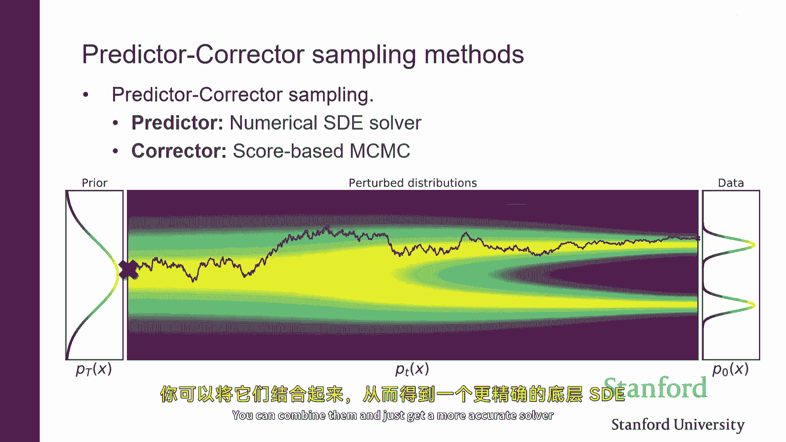

# 【深度生成模型 CS236 2023】斯坦福—中英字幕 - P16：p16 Stanford CS236： Deep Generative Models I 2023 I Lecture 16 - Sc - 加加zero - BV1NjH4eYE1v

好的，"那么让我们从今天开始吧"，"我们正在讨论扩散模型"，"我认为我们还有几件事情没有来得及讨论"，所以，我们将具体看到如何做，嗯，"将基于分数的模型视为扩散模型来思考"，"所以。

这个名字的来源在哪里？"，"并且，分数匹配中的噪声与什么关系？"，"你可能之前见过其他一些培训目标"，嗯，"我们看看如何思考一个扩散模型，甚至是一个基于分数的模型。"，"在某种程度上。

作为一种变分外编码器类型"，"到了一天结束时"，"层级的"，"但实际上，这是一种变分外编码器"，"并且证据之间将有一些联系"，"下界和我们看到的降噪分数匹配损失"，嗯。

"然后我们会回到将扩散模型解释为正则化流的方式上"，这是将sd转换为ode的一种想法，我们之前短暂讨论过的，但我们没有时间深入讨论，这将允许我们精确计算似然度，因为它是流模型。

然后我们将讨论如何使采样效率高，所以利用你生成视图的事实，我看到某种类型的常微分方程或随机微分方程，然后您可以使用高级数值方法来加速采样，然后我们将讨论可控制的生成，所以如果你想构建一个文本到图像模型。

或者你想要使用某种类型的控制，某种类型的一些信息到，让我们说生成图像，你怎么把那个带入方程，你怎么改变模型来允许你做那个，所以让我们从分数基模型的简要回顾开始，回忆一下基本思想。

有那个我们 gonna 模型一个概率分布通过与得分函数工作，这是对日志似然度的对数密度的梯度，实质上，相对于输入维度，所以你可以认为它是一个向量场，基本上告诉你，你应该向哪个方向移动。

如果你想增加可能性，我们使用深度神经网络来建模它，和这个分数模型，就像一个神经网络，它接受一个，让我们说，一张图片作为输入，并将其映射到相应的分数或梯度，即在那个点的对数似然度，的评估，我们见过。

分数可以从数据中估计出来，使用分数匹配，种类的损失，而且，它就像一种相对简单的回归损失，其中，你试图比较估计的梯度到真实梯度，你可以真正看到这两个向量在数据分布上的l2距离的平均值，我们见过。

可以将这种损失重写为可以，至少在理论上，计算和优化的函数，作为那个不可行的，或者至少从数据维度来看是昂贵的，但我们看到有一种叫做去噪分数匹配的东西，基本上来说，比这更有效，这种基本的想法是。

而不是试图估计数据分布的得分，你估计一个由数据分布版本构成的分布的得分，那个已经被扰动的，让我们说，高斯噪声，所以你有一些种核或噪声核，那就是最终就像高斯一样，它会取一个样本x，然后我们会给它添加噪声。

这就基本上定义了一种新的分布，Q sigma，这基本上就像通过卷积原始数据分布得到的什么，这是用一些高斯核未知的，所以，它更像是数据分布的一种平滑版本，结果，估计q sigma的得分。

而不是p数据实际上更有效，并且有这种种，你知道，如果你看通常的像回归损失一样，你在哪里将你的模式与那个进行比较，与噪声数据分布的真实得分平均过的，噪声数据分布，结果显示，那个目标可以重写为一个去噪目标。

所以基本上如果你可以训练一个模型作为theta，那它可以处理一个噪声图像，X加上噪声并试图基本上估计添加到图像的噪声向量，所以如果你能从这个噪声图像到这个清洁图像。

或者等价地你可以找出添加到这个图像的噪声向量是什么，如果你减去，会返回你干净的图像，所以如果你能去噪，然后你也可以估计噪声数据分布q sigma的分数，而且这不涉及到雅各比矩阵的任何种迹。

而且它不涉及任何种，嗯，微分就是直接的损失，这基本上就是去噪，我们做去噪的原因是，因为，通过解决你看到的第三条行中的去噪目标，你实际上是在学习噪声扰动的数据分布的分数，这就是有一个好的东西可以访问的。

因为如果你有得分，那么基本上你可以使用伦敦动力学来有效地生成样本，所以你有点像如果你知道如何去噪，那么你知道在哪个方向上扰动你的形象会增加最有可能性的快速性，所以你可以有像泰勒。

对每个数据点的日志似然度的近似，并且你可以使用这些信息来指导你产生，你导出显示，并生成样本，交易的是，你不再估计清洁数据分布的得分，但你在估计噪声数据分布的得分，所以是的，它大大扩展了，它归结为去噪。

但交易的是你不再估计数据分布，你估计的是噪声扰动的数据分布，然后嗯，一旦你有得分返回到问题中，如果你 somehow 能够估计得分，然后你可以通过基本上做某种方式生成样本，它是噪声随机的。

有点像一种梯度上升过程，你只是初始化你的粒子在某处，然后你跟随箭头，实质上在每个步骤中添加一些噪声，试图向高概率区域移动，我们已经看到为了使这工作，实际上使它有意义的不仅估计数据分布。

被扰动以一个单一的噪声强度，但你实际上想要估计多个版本的数据分布，那基本上是每个版本都被扰动以不同程度的噪声，所以你有，有点像这些不同的数据分布视图，它们已经被扰动以越来越小的，在这种情况下的噪声量。

你做的是，你训练一个单一的模型，一个单一的得分网络，它依赖于噪声水平，所以它接受一个sigma作为输入，并会估计得分，嗯，对于所有这些被扰动的不同数据分布，它们以不同程度的噪声，如果你可以训练这个模型。

然后你可以做基本上的长动态，其中你会做，你初始化，如果你有这个好的分数模型，然后你会初始化，它是你通过估计得分估计的，匹配你会做lain动态，你会初始化你的粒子，在某种方式。

然后你会跟随对应于被扰动数据分布以更大噪声量的梯度，你减少你，你稍微提高了样本的质量，然后，你用这些样本来初始化动态链的新豪华，在你打算使用扰动后的数据分布得分的地方，使用较少的噪声。

再次跟随这些梯度稍微，然后，再次取这些粒子，你初始化一个新的链，使用甚至更少的噪声，你继续这样做，直到你的信号足够小，基本上，你在采样从非常接近真实数据分布的东西，这就是新的洗衣动态。

你可以在这里看到它如何工作，所以你将从纯噪声开始，然后你将运行这一系列的长期动态链，最终你将生成与清洁样本相当接近的东西，所以你可以看到它有这种去噪风味，你从纯噪声开始，然后逐渐去除噪声。

直到揭示像样本一样的东西在最后，这只是在每个步骤中都更大动态，你只是在大致跟随梯度，最后你将走向清洁的数据样本，所以现在我们已经回顾了这一切，嗯，我们要做的就是，我们将开始将这个过程视为一个。

作为一个可变性外编码器，所以如果你想想，在这里发生的事情是我们基本上是从右到左，如果你考虑多个被扰动的数据分布的版本，随着噪声量的不断增加，我们做的是，我们开始从纯噪声，然后。

我们迭代地通过运行这个较长的链来去除噪声，所以我们运行一个大链，试图像，尝试将maxt转换为来自数据分布的一个样本，带有相当大的噪声，然后，我们使用这些粒子来初始化一个新的链。

我们在其中跟随对应于带有稍微较少噪声的数据分布的梯度，然后我们运行一段时间，然后，我们一直继续，直到我们像生成最终的清洁样本一样，所以，我们可以认为以前我们看到的程序。

基本上相当于试图迭代地从这些随机变量x零到xt生成样本，其中，这些随机变量本质上是你从真实数据样本中得到的，然后你应该向它添加噪声，因为那就是我们估计这个噪声分数的方式。

扰动了确实通过取数据并添加噪声获得的数据分布，对那就是噪声条件分数网络的整个想法，所以这基本上是一个直观的层次，发生了什么，非常迭代地减少我们样本中的噪声量，所以这个过程的逆向就是我们使用的过程。

用来基本上训练网络生成与去噪匹配损失的样本，我们可以考虑逆过程，如果你想要從數據轉換到純噪音，會使用哪個？這是一個非常簡單的過程，在每個步驟中，你只是需要添加一點噪音，所以如果你想要從x零轉換到x一。

你取一個數據點，並添加一點噪音，如果你想要從x一轉換到x二，你從x一取一個樣本，你添加一點更多的噪音，隨著你從左到右移動，你添加越来越多的噪音，直到最后没有任何结构剩下，然后你被留下基本上纯粹的噪音。

所以你可以开始看到，这种有点像有某种风味，有一点点的vae，哪里有一种像编码过程的东西，然后这里有一个解码过程，我们会让这个更正式，但这就是这种直觉，所以更具体地说，基本上，这里发生了什么。

我们是否在使用一个相对简单的程序来生成这些随机变量，从x1到xt的所有x，那个程序只是添加噪声，在每个步骤，你所做的就是如果你有xt的样本，你想要生成来自xt加1的样本。

你所做的就是你取xt并添加噪声给它，就是正态噪声，所以这定义了一个条件密度集，给定xt-1的xt的分布，这些就是高斯分布，嗯，这些高斯分布基本上有一个给定的均值和一个给定的方差。

而均值就像当前的样本xt-1缩放的，它不是特别重要，里面有一个缩放，但是，你要生成给定样本xt的xt-1的样本，你会，从均值为的高斯分布中抽取一个样本，Xt-1是。

你会从一个均值为的高斯分布中抽取一个样本，这就是xt减去一预缩放的结果，"并且一些固定的标准差或固定协方差"，因此，我们可以将这个从数据到噪声的过程视为一种思考方式。

"作为一种类似于马尔科夫过程的形式"，"在每个步骤中，我们添加一点点噪音"，"也许我们以某个固定的常数进行缩放"，"β并不重要，关键是你要进行缩放"，"但那就是如此"，嗯，"这通常被做"。

因此我把它放在这里，只是为了与文献保持一致，这基本上定义了一个联合分布啊所以给定一个初始数据点x零，存在所有随机变量x一x二一直到xt的联合分布，嗯，这就是所有这些条件的乘积，它们是高斯分布的。

所以这有点像定义了一个联合给定一个初始数据点x零，存在所有其他随机变量x一至xt的联合分布，其中，联合由条件产品的乘积给出，所以它有点像自回归模型，但是，由于它是马尔科夫的，所以稍微简单一些，所以。

x t的分布不依赖于所有的前一个，嗯，但是，它基本上只依赖于xt减去一在之前的时间步，我正在使用标记cue的符号，因为最终会发现这确实像编码器，在变分自编码器中，所以你可以认为这个过程是从x零开始。

并将其映射到这个向量随机变量x one通过xt中，作为一种编码，而且编码器恰巧很简单，因为所有的你只需要做的就是，你只需要向原始数据点x零添加噪声，所以在典型的vae中，你会做的事情是你会取x零。

然后你可能将它通过某些神经网络映射，这将给你一个均值和标准差，表示在潜在空间上的分布，我们获取潜在空间分布的方式在这里是，在这种情况下，x一到xt是通过这个程序的，所以没有什么被学习到。

你只是向原始样本添加噪声，像零，所以这定义了一些基本有效的程序，定义原始数据点的多个视图，X零，其中每个视图都像是数据点以不同程度的噪声的版本，对于这个编码器的输出，嗯，比X零高维，从意义上说。

它是所有不确定变量的集合，嗯，每个不确定变量，Xt的维度与X零相同，这是原始数据点的 t 倍，嗯，是的，原始数据点的维度，是的，映射是不可逆的，我们在每一步都添加了噪声，所以这定义了一种基本方式。

即将数据点映射到一些潜在变量，或通过这种非常简单的程序，将数据点映射到一个潜在变量向量，你只需要向它添加噪声，结果，添加高斯噪声非常方便，嗯，因为你也可以计算，因为基本上所有事情都是高斯分布的。

所以这个分布的边际也是高斯的，所以如果你想要计算，一个观察特定，比如数据点x零在t步后的噪声视图的概率，那是另一个高斯，那个高斯的参数基本上取决于这些贝塔系数，我们再次之前有过的，不是很重要。

你怎么取贝塔并组合它们来获取阿尔法，重要的是，如果你在每个步骤中添加一些高斯噪声，多次应用这个核的结果，也是另一个高斯，只是不同的平均值和标准差，但你基本上可以计算它们在封闭形式。

从x零过渡到xt的概率，嗯，是通过到xt，是另一个高斯分布，其中，这个高斯的参数基本上取决于影响，你从时间xt过渡的个体转换的效果，这对几个原因很重要，嗯，首先，嗯，基本上这是非常高效的模拟链。

所以如果你想在时间步t生成样本，你不必生成通过这些步骤的全过程，你可以直接从这个边际分布采样，而不必模拟整个链，是的，如果你选择了，你知道参数在正确的方式。

这基本上是我们为denoising score matching程序生成训练数据的相同，嗯，精确的方式，记得在denoising for matching程序中，我们做的是，我们取干净的数据。

并添加不同数量的噪声，对应于不同的，你知道时间步或不同的信号水平sigma，生成所有这些不同视图，就像原始数据对应于不同的信号水平，所以它仍然达到了相同的效果，但我们正在考虑它作为一个过程。

每个步骤都逐渐添加噪声，在这个过程中，你可以把它想成一个扩散过程，对吧，你可以想这里正在发生的事情是一个扩散过程，有一个初始分布过数据点，这是数据分布，这可能是例如两个高斯的混合，它看起来像这样。

这些颜色基本上表示的，数据的强度，在那个点，PDF的大小如何，所以，黄色点，倾向于具有更高的概率质量，让我们说，这些靠近这两个高斯分布尾部的蓝色点，正在发生的事情是，是我们基本上定义了这个噪声扰动的。

数据分布，通过基本上添加噪声，所以，我们随机从数据分布中抽取一个样本，然后我们向其添加噪声，通过这样做，我们定义了所有这些受到噪声扰动的分布，其中，正如你可以看到的，这个分布的形状改变。

当你添加更多的噪声时，你看到这里没有概率质量在这里，但如果你对原始样本添加一些噪声，那么你在这里的中间会得到一些概率质量，然后如果你添加大量的噪声，那么基本上一切都变得无标度，所以你可以把它看作是一个。

嗯，作为一个扩散，其中基本上给定一个初始条件，嗯，这就是这条线上的一个数据点，然后你可以想象模拟这个过程，你在每一步都添加噪声，最终概率质量将全部分散，所以像整个空间一样，这种就像热扩散的过程一样行为。

假设你现在知道在一个固体或某种形式中，所以这就是它被称为扩散的原因，因为存在一种过程，它取概率质量，然后扩散到整个空间，这种过程的定义基本上由转换核定义，在理论上，转换核就是高斯分布，是的，你需要像。

如果你把它想象成一个井，我可能会在几页后面回来讨论这个问题，但是，在某种程度上，你需要一些东西，你需要能够，一，平滑出类似于摧毁结构的东西，这样你最后得到的分布就会是，容易从其中采样的。

因为本质上我们在推断时将要做的事情是，我们将尝试反转这个过程，并试图从噪声到数据，所以首先你需要定义一个过程，它摧毁结构并从数据到噪声，你在最后得到的噪声必须是一些简单的，它必须是高效的。

所以你需要能够高效地模拟这里的任何切片，因为我们将看到学习目标最终将成为匹配的噪声，因此，你需要能够从它中高效地采样，如果你想使用笔诺伊斯或其他不同于那种目标的匹配目标，基本上是的。

你将得到一个有效的概率模型，如果你有这两个东西，那么你基本上可以使用这个机器，而且事实证明，反转这个过程精确的方法涉及到得分，所以如果你有诺亚，如果你有得分，那么你可以反转过程，或者从vae的角度来看。

正如我们将看到，那么你也可以尝试基本上反转过程，通过尝试学习一种像解码器那样的东西，它将试图反转，你可以认为这个过程，或者从数据到噪声作为编码器，然后你可以尝试只使用训练和肘部，仅仅通过变异。

尝试学习一个反向操作的操作符，这可能不涉及得分一般，但如果一切都正态分布，那么确实，你需要的是得分，重要的是这里的原始数据分布，好的，它是一个正态分布的混合物，但它可以是任何东西，它不需要接近正态分布。

它必须是连续的，以便这个机器可以直接应用，尽管我们将在后来讨论潜伏扩散模型时看到，你可以实际上最像，将离散类型的数据嵌入到连续的空间中，然后从va的角度来看，一切都会自然得出，显然。

最初的分布不需要正态分布，它可以是我们的自然图像分布，远非正态分布，重要的是，你使用的传播核来散布概率质量是正态的，所以，就像你以可控的方式破坏结构一样，你知道，添加足够的正态噪声后。

你将有一个正态分布，信号到噪声的比例基本上非常低，并且在那个点，从纯噪声中采样与从数据点开始添加大量噪声是一样的，基本上，这就是扩散，并且基本上映射从左边的数据点到这边的纯噪声。

这表明可能有一种生成样本的方法，基本上涉及到这个过程的反转，从这里的数据映射到右边的纯噪声，这表明，这可能有一种生成样本的方法，基本上涉及到这个过程的反转，所以我们有一个简单的程序，从数据到噪声。

只需在每个步骤中添加高斯噪声，所以我们有一个包含一些明确定义的随机变量的集合，嗯，联合分布，它只是像以你已知的q定义的高斯那样，给定xt-1，嗯，你定义下一个，嗯，下一个一个由，你知道。

只是添加噪声给它，如果我们能，我们可以尝试生成嗯，样本通过反转这个过程，所以我们可以做的是，我们尝试最初采样这个随机变量的值，X大T，我们知道X大T来自一些已知的分布，例如只是纯高斯噪声，嗯。

这里的这个y，你可以把它看作是一个先验，一个基本收敛到这个扩散过程的固定分布，这很容易，然后我们可以尝试做，我们可以尝试基本上反转这个过程，通过采样这些条件，所以你将采样xt-1给定X大T。

然后我们可以回到一步一步，从一个纯噪声到一个数据，这个程序将工作，嗯，完美地，如果我们有一些方式知道这个分布，所以我们知道如何定义q给定xt-1的Xt，这只是一个高斯，但反向核从xt到xt-1。

从右到左的那个，嗯，实际上是未知的，这就是为什么这个程序不能直接使用，但我们可以尝试做，我们可以尝试学习一些像对这个反向的近似，一个从右到左的核，基本上阅读，学习如何。

所以我们可以学习基本上如何如何从噪音中删除声音，基本上这就是我们定义的核心理念，你现在可以看到，如果你要找到一个解码器或迭代解码器，嗯，它有VAE的味道，你开始由一个简单的先验采样潜伏变量。

这可能只是一个高斯分布，然后我们从右到左通过从这些条件中采样来移动，xt-1给定xt的概率，它们是，嗯，从变分定义的意义上来说，这些就像是，这是我们的生成模型，这就是我们通常，你知道。

就像在vae中一样，解码器是通过某种神经网络定义的，在这种情况下，给定xt，xt-1的概率密度是一个高斯分布，和往常一样，高斯的参数由某种神经网络计算，所以它是VAE的同一种风味，在这里。

你从简单的先验中采样z，你将z输入到神经网络中，例如，在这里的μθ来获取对x高斯分布的一个参数，然后你从那个分布中采样，在这里，它有类似的风味，意味着嗯，反向过程是通过这个有条件的定义的变体来定义的。

这些是以神经网络参数化的，因此，存在一个真正的去噪分布，它将您从xt映射到xt，减去一，我们不知道这个对象是什么，我们将用它来近似一些高斯分布，其中，高斯的参数像往常一样被学习，就像在变分近似中一样。

我们将尝试选择theta，以便这两个分布从直觉上接近彼此，这就是我们通过采样得到的结果，从这个反向过程的变分近似中，我们得到的结果接近我们将从真实去噪分布中采样得到的结果，如果你从真正的去噪分布中采样。

所以更具体地说，这基本上定义了一个联合分布，这将是我们的生成分布，其中，我们基本上首先对应于我刚刚描述的采样程序，其中，存在对最右边变量的先验分布，这个xt，我们知道它来自一个简单的分布，如高斯，然后。

你将从所有余下的变量中采样，一个接一个，从右到左，通过从这些条件中采样，这些都是高斯分布，参数由一些通过神经网络定义，这里的关键点是我们选择参数，所以我们选择这个阿尔法，使得基本上到最后没有信号与噪声。

所以你基本上只剩下纯噪声，所以基本上这个，嗯，嗯，阿尔法杠t趋近于零，基本上通过选择，基本上你知道，你可能想象如果你有一个足够的噪声量，你开始的地方在哪里并不重要，一切都看起来差不多。

所以这就是一种技巧，你需要定义一个扩散过程，这样你只需要运行它足够长的时间，或者可能像同样的事情，这样你几乎可以忘记初始条件，或者你最终达到一种稳定的状态，其中嗯，这是知道的，它是某种像高斯分布。

有一些有一些已知的像平均值和标准差，所以到最后你可以从它中采样，所以这就是，这就是正在发生的事情，在这里，有一个分布，Q，T，它将确实接近某个高斯，例如，你可以总是设置它，你选择过渡核的方式正确。

正如我们将看到，你可以通过使用ladynamics做类似的事情，所以，因为事实证明，如果你训练这个东西变分地，你学到的这个mu基本上就是得分，所以，正如我们将看到，基本上有一种生成样本的方法。

这基本上只需要t步，或者你只是一步一步地做t次，直到你得到干净的，或者你得到一个好的有些什么，希望得到一个对干净数据点的好近似，但你实际上不知道，只取决于你如何学习这个逆过程。

如果你愿意投入更多的计算资源，你可以实际上做像，在每个步骤中投入更多的计算资源，以尝试更好地逆转过程，嗯，一种方法是做ladynamics，所以ladynamics就是生成样本的一种一般方法。

它是像mcmc过程来生成分布样本的，到最后，我们知道我们从这里试图采样的分布是什么，这就是像噪声数据分布，如果你有这个分布的得分，并且你可以从它中生成样本，所以我们将看到有一种方法可以像。

纠正如果你只是使用原始程序可能会做的错误，"但是增加计算资源"，"如果你想从离散集合中采样"，"你应该做的事情是"，"你将采样xt"，"然后，你将采样xt-1"，"X减二"，"从头到尾的x零"。

"目前动力学中没有洗衣服这一项"，所以，这不是确定性的，而是随机的，"因为这个转变是正态分布的"，所以你需要从高斯分布中采样，其中参数由神经网络给出，所以神经网络部分是确定的，但就像VAE解码器一样。

它是随机的，映射是随机的，好的，所以现在我们定义了基本上我们有的两个东西，一个编码器，在这里我们有一个解码器，它由这个神经网络参数化，新的θ，我们可以做的就是，所以我们可以开始把这种视为一种层次化的。

就像va或者只是va，其中存在编码器，它接受x零一个数据点，并将其随机映射到一个序列的潜在变量上，这些潜在变量就像x一，X二，X三一直到xt，并且存在对潜在变量的一种像先验分布，这就是xt中的p。

只是简单的高斯分布，然后，有一个解码器，基本上会反转这个过程，在当前情况下，解码器就像往常一样，只是使用神经网络参数化，这些将被学习，所以，就像在vae中一样，这里有一个真实的，有一个编码器和解码器。

所以它有一种像vae的味道，除了那种像潜伏变量的，存在一系列按时间索引的潜在变量，它们具有特定的结构，其中编码器实际上是固定的，编码器中没有学习到任何信息，编码器只是向数据添加噪声，所以，它就像AE。

其中编码器是固定的，或者是一种非常特殊的结构，所以，像普通的VAE的回忆将看起来像这样，你有一个潜在变量模型，你有一个潜在变量z，它具有简单的先验分布，如高斯分布，然后，有一个解码器，它将接受z。

将其映射通过几个神经网络，μ和σ，然后，给定z的x的概率p定义为一种简单的高斯分布，参数由这些给出，由这两个神经网络给出，然后，你有编码器，它做相反的事情，它接受x，并基本上尝试预测z，再次。

这通常是一些简单的高斯分布，参数通常由其他神经网络计算，它作为输入，给你分布过潜伏变量的参数，我们知道你会通过最大化肘部，证据下限来训练这个模型，它将看起来像这样。

所以你基本上使用编码器猜测潜伏变量的值，然后，你有观察到的变量和潜伏变量的联合分布，由编码器推断，然后，你有这个术语，这基本上是鼓励编码器中的熵高的，这是基础版本。

我们这里有一种像基础vie的层次化版本，所以，如果你替换这个单一的潜伏变量z为两个潜伏变量，你将得到像这样的东西，生成过程将从采样z的两个偏差从一个简单的先验开始，然后通过第一个解码器生成z一。

然后另一个解码器生成x，所以你有一个联合分布，这就是所有这些的乘积，先验z对第一个编码器和第二个编码器的分布，然后第二个解码器，抱歉，然后，你有一个编码器，你将使用它来推断给定x的潜伏变量。

所以它是对z一和z二的分布，然后，你将有一个证据下限，它将看起来像这样，在这里，我们有一个简单的先验z，如果你替换这个为vae，那么你将得到我们这里看到的东西，所以，那将是训练目标。

这就是我们在扩散模型中拥有的确切内容，所以在扩散模型中，嗯，我们不仅有两个，我们有一系列的潜伏变量，但它本质上是一样的，我们有一个联合解码分布，这是你从右到左得到的，然后，我们有一个编码器，它固定不变。

它只是向图像添加高斯噪声，你训练这个模型的方式是通过最小化一些肘部损失，或最大化肘部，你知道，平均于数据分布，所以就像以前，目标函数将看起来像这样，所以x零的q就是数据分布。

所以你想要最大化真实对数似然于数据分布，但我们无法访问它，所以您使用证据下界，这就像通常的情况，嗯，给定x的z的q，x，z的概率除以给定x的z的q，这是通常的证据下界，并且只有轻微的符号。

因为我想要作为函数θ的最小化那个目标，那么您将插入什么，q是固定的，这就是这个高斯产品的集合，这是每一步添加噪声的过程，pθ是有趣的部分是您从某些简单的先验开始得到的分布，比如纯高斯噪声。

然后通过神经网络的序列传递它，这将试图从其他高斯中推断参数，您从其中采样来执行采样程序，所以这个数据项在分母中的定义是，它以这种方式定义，嗯，pθxt-1给定xt，所以就像你知道的，你可以尝试你。

你可以优化这个损失作为函数θ，所以实际上它比通常的vae简单一些，在通常的vae中，Q本身是可学习的，记住您这里有这五个参数，q是固定的，所以你不需要实际上优化它，所以它更像是一个va，它是。

它是就像一个va，除了编码器是固定的，它不是可学习的，那是通常的肘部目标，我们记得这些解码器是参数化的，都是高斯，并且他们有这种简单的形式，要从xt-1采样，您将xt传递给神经网络以获取平均值。

然后它们将固定像样的方差，有趣的是，如果参数化这个，嗯，神经网络，嗯，如果参数化这个，那么它将能够学习到数据的内在结构，这将给你使用此形式使用这些高斯分布所需的手段，再次，这取决于这些贝塔。

并且这个阿尔法并不重要，但大致上像，如果你以epsilon参数化网络，接受xt作为输入的网络，然后试图预测添加到xt的噪声并减去它，从xt中减去这个估计的噪声，以获取x t减去一的猜测，然后。

你可以证明这个肘部目标实际上等于通常的denogence，或匹配损失，最小化负肘部或最大化平均的下限，嗯，块，似然实际上与尝试估计这些噪声扰动数据分布的得分相同，因此，如果你，是的，基本上它。

如果你参数化这个均值网络说，好吧，取你的数据点并减去一些使它看起来更现实的东西，你确实做了，这个网络实际上最终试图估计这些噪声扰动数据分布的得分，所以，虽然我们从变分外编码器的视角推导出了一切。

但它实际上你做的是估计得分，所以，基于得分的模型将采样不同，所以，我在这里只是声称损失将与一个上限到某种程度的相同，我想有一些缩放，但大致上，如果你看它，你基本上从数据开始，你是一个噪声向量。

你将这个噪声图像喂给这个网络epsilon，你试图估计添加到数据上的噪声向量，所以，训练目标，如果你选择这种参数化，损失将是相同的，然后，你有不同的选择在如何从它采样方面，如在基于得分的模型中。

你将通过在这里做大量采样来采样，你不组装，使用laine，你将基于仅通过解码过程进行采样，对吧，所以，这是denoising diffusion概率模型bpm的训练过程，如果你看损失。

损失基本上就是得分匹配，就像如果你看这里损失，你有这里的损失，就像如果你看这里的损失，那就是我们之前有过的匹配损失去噪方法，采样实际上也非常类似于，嗯，你在基于分数的模型中会做的事情。

如果你看看你如何生成样本，是，你从纯噪声开始，与基于分数的模型相同，然后在每一步中，你基本上，跟随梯度，它是epsilon theta，并且添加一些噪声，因为这是你应该做的事情。

如果你要从高斯分布中采样，那就是p(xt|xt-1)，所以你通过迭代采样得到的采样程序实际上非常类似于动力学中的洗衣服，你只是基本对，嗯，这个量的，规模进行了不同的处理，这有点像，跟随梯度。

在梯度交互处迈出一步，然后添加噪声，你基本上只是添加不同量的噪声，但它是大致相同的过程，通常你会一起学习编码器和解码器，他们试图互相帮助，在某种程度上，编码器试图找到结构。

而解码器试图利用结构更有效地生成数据在这里，编码器是固定的，它只是添加噪声，所以解码器只是在尽力，基本上在最小化他们关心的东西，他们，他们消除你将会有的分歧，或者基本上最大化肘部。

这是与生成过程相反的同一件事，嗯，结果发现，为了做到这一点，你需要估计这个，分数，到你能尽可能好地完成这个过程的程度，那么你就可以生成好样的样本，似乎你会更容易，实际上允许你自己学习编码器。

但是实际上这不起作用，所以它会给你更好的视野，但质量更差的示例，你也可以做一步的滞后，但在实践中，这就是你会做的事情，因此，在那个时候，我的意思是，两者有什么区别，我的意思是，本质上是一样的事情，嗯。

我认为基于分数的模型视角的一个优势是，你可以实际上把它看作是像，在无限数量的噪声水平限制下，正如我们将看到，这并不是你不能的，从VA视角获取这些可能会有些困难，但某种程度上，它们是本质上相同的事情。

从肘部视角，你将得到更好的数字，如果你学习了编码器，但我不知道是否是优化问题，但在样本质量方面，你得到的结果，你将得到模糊的样本，有点像VA中的那样，嗯，与渐进编码有关一些直觉，在实际应用中。

人们并不优化肘部，在实际应用中，人们会优化肘部的缩放版本，肘部我有吗，嗯，是的，所以肘部基本上看起来像这样，这里有一个lambda，T的控制它如何关心不同的时间步，在无限容量的极限下，这不重要。

但在实践中，人们会将它们设置为所有一，这不同，这不是你应该做的，如果你想优化肘部，所以问题是优化似然度，它并不直接与样本质量相关，即使编码器固定，并且它非常简单，如添加纳什噪声，相反不是。

它需要你有分数，所以实际上反转它并不容易，但你可以争论，如果以一种更结构化的方式破坏结构，也许甚至更容易反转生成过程，是的，它们到一定程度可以泛化，但不是离散分布，所以如果你在它们训练猫的图像上。

它们不会生成狗的图像，因为它们从未见过它们，也没有理由为他们分配概率质量，所以它真的基于你实际数据分布的基础，你拥有访问权限，你正在使用来训练模型的，所以当你添加大量的噪声时。

消除噪声的最好方法是基本上预测数据集中的平均图像，所以你已经看到，如果你训练它于猫的图像，当t等于大写字母T时，网络会做什么，它将基本上输出训练集中的平均图像，因此它将完全偏离，因为我认为主要原因是。

如果考虑到，你在生成时间可以投入的计算量非常大，因为你会像，像一千个血管一样，实际上，t通常等于大写字母T，这里通常是一千，所以，你可以在生成时间使用非常深的血管堆，然而，由于训练时的设置。

你永远不会实际上看到这整个非常深，非常昂贵的计算图，你可以像，一层一层地，增量地训练它，而不必实际看到过程，所以尽管你只是本地训练它来在每个步骤中得到一点改进，这是非常高效的，它正在分解，是的，是的。

在某种程度上，所以这堆的堆实际上是会给你像这样的，如果你如果问题在于如果解码器，如果编码器不是按照某种方式结构的，你可能无法做这种技巧，即基本上跳过，记住我们之前有过很多，这个过程。

这里从x0到xt非常容易，如果这些线索是任意的神经网络，没有一种方法可以让你从x0跳到xt一步，因此，事实是这些线索非常简单，你可以，你可以将它们组合在封闭形式中，允许你得到一个非常高效的训练过程。

不是所有的层次化vae都将非常高效地训练，但这是一种特定的层次化vae，所以当然有一些如果只是训练vae，可能会很效率，你通常得到的损失，如果你去计算，最终会变成同样的东西，似乎反直觉。

你想要修复编码器，成为像这样一种奇怪的东西，你在其中添加噪声，但你没有减少维度，但是如果你一旦开始做出那个选择，那么法律最终就变成了与匹配损失的降噪相同的东西，历史上我们首先提出了分数匹配。

并证明了它的有效性，然后人们说哦，你可以取一个vae，你可以得到基本上相同的东西，这可以在你推断时节省你一些麻烦，因为你不再需要处理洗衣动态，你可以直接从iva采样。

所以lambda基本上只是变成一种有点像，你关心不同程度的程度，不同的，嗯，在不同噪声强度下的去噪损失，并且有一个原则就像如果你只是做数学并且通过肘部，那么存在一个lambda t的值你应该选择。

如果你真的很在意证据，在实际应用中的下限，人们只是选择那是一，所以你实际上没有优化肘部，Beta是参数，β的t's是，阿尔法正在以β的t's来计算，这基本上控制着如何，你如何快速地向数据添加噪声。

你可以选择它，所以第一次我们做起时从随机噪声开始，然后移动回类似于清洁数据的数据，但是做起来好像有点道理，假设你也可以一步完成，比如你可以想象一个vae，其中编码器是固定的，处理图像并带有很多噪声。

假设你需要学习的那个逆分布，这是哪个，我在哪里能找到它，这里尝试反转过程的这个程序，从噪声到数据的过程将会非常复杂，嗯，如果，有点像你x和xt-1基本上是一样的东西，只是添加一些噪声，假设是反转的。

这也将会相对容易，所以我们像是在分解这个复杂的问题，从噪音到数据，再到一千个小问题，你所需要做的就是稍微去除一些噪音，这在实践中效果更好，因为子问题更容易学习，所以你做的就是你从一个数据点开始。

你随机选择一个t，这相当于一个索引，在这个时间序列中，随机选择有噪声的随机变量的序列，然后你从标准正态噪音开始，然后你生成xt，基本上添加了正确的噪音量，所以这就像是一种噪音和得分匹配的方式，所以这。

你输入到epsilon theta中的这个论据仅仅是从q中的x t采样的，给定x零，是的，所以架构与，作为噪声条件得分模型，所以你有同样的问题，你需要学习一堆解码器，一个为每个t。

而不是学习一千个不同的解码器，你将学习一个可以大致在整个键上摊销的解码器，所以你有同样的，嗯，像这个epsilon theta网络，它试图预测噪音，基本上它接受图像xt，它接受时间t的噪声图像。

被编码在某种方式，这两者都是输入给网络的，然后他们被用来预测噪音，这就是与噪声条件得分网络相同的，你在xt中取，你取sigma或t，然后您使用它来预测噪音，所以是的，架构基本上将是一些通常的某种单位。

因为我们正在尝试做一些像密集图像预测的任务，我们从图像到图像，单位类型的架构通常在这种任务中表现良好，这仍然，我的意思是，人们还在使用transformers，但这仍然是解决学习问题的最佳性能模型之一。

我们有一篇你可以查看的论文，并试图使用一个层次化的vae来解决一个问题与层次化的vae，基本上，如果开始学习编码器，它不是可识别的，有许多不同的方式来你，你基本上想要编码输入的信息跨越所有这些潜在变量。

但是有许多不同的方式来做它，比如你存储哪些信息，在哪些潜在变量中是非常不确定的，这取决于编码器和解码器来确定，结果，如果使用某种编码策略，那就是迫使模型以一种特定的方式分散位。

那么你可以接近使用学习编码器的性能，你可以接近这些种类模型的性能，但是，仍然不清楚如何做到，有多篇论文，我正在尝试找出好的无噪干扰表，有许多不同的选择，嗯，重要的是，最后你，唯一的真实限制。

是在最后你基本上信号到噪声比是零，所以基本上你摧毁所有有用信息，然后关于如何调整噪声的灵活性很大，比如在不同步骤的噪声量，这样你就可以得到你想要的结果，嗯，你可以甚至尝试优化它，如果你从肘部视角来看。

你可能只是学习一个简单的函数，那种控制你在不同步骤中的噪音量，所以你仍然只是添加一个高斯噪音，但你可以尝试学习如何，所以有方法可以甚至学习时间表，我会朝着这个方向走，也许让我们学习编码器。

或者让我们使它更灵活，在实际中，我的意思是有许多论文，其中人们尝试了不同的策略，不同的结构破坏方式，被称为扩散，他们已经展示了一些实证成功，但在实践中，人们仍然主要使用高斯分布。

我们现在可以做的是开始思考会发生什么，你知道我们有这种扩散模型视角，层次式vae，种视角，在我们有干净数据的情况下，然后我们有一千，让我们说数据分布的不同版本，被越来越大的扰动所扰动，有点像噪音的量。

确实如此，如果你从扩散过程的角度来看，扩散过程是一种连续时间，一种过程，如果你考虑热量如何扩散，或者一根金属棒，那个过程不是在离散的时间间隔内发生的，它更自然地被看作是在连续时间内发生的事情。

其中时间是连续的，所以，另一种思考方式是，你可以想象将这个离散化越来越精细，也许你会发现你仍然，我们仍然将采取层次化的视角，但你可以开始思考会发生什么，如果你取得更多的步骤，如果我们从一千，两千四千。

我们使这一步骤越来越小，越来越小，越来越小，直到最终我们基本上得到这个分布的连续体，这实际上对应于扩散过程，所以，我们在通常的左边有，我们有干净的数据分布，这是两种高斯分布的混合，其中，有点像这两个点。

其中大部分概率质量在这里，这是，然后，这里有一个持续时间的扩散过程正在发生，那就是在扩散概率质量，嗯，随着时间的推移，直到最后，在右边，你得到这种纯噪声类型的分布，所以实际上。

在这里发生的事情是我们正在考虑一个非常，非常，非常精细的离散化，或者很多不同的阶段，在我们从纯噪声到的数据的过程中，从数据到纯噪声，所以如果你一点一点地破坏结构，你会得到。

你可以想象在极限情况下你会得到，过程是连续的，嗯，所以不像有一千种不同的分布，我们现在有无限数量的分布，现在是由t索引的，其中t现在是像时间变量一样，从零到大写的t，就像以前一样。

但不再取一千个不同的离散值，它取无限多个值，所以它是一个连续的随机，它是一个从零到大写的t的连续变量，所以我们像往常一样有一手数据，然后，另一个极端上是纯粹的噪音，所以。

我们现在如何描述所有这些现在按时间索引的随机变量之间的关系，啊，我们可以用随机过程来描述它，所以，基本上有一个随机变量的集合，现在，有无数的随机变量，在vae的情况下，我们有一千个不同的随机变量。

现在我们有无数的随机变量，Xt，所有这些随机变量的密度再次按时间索引，"而不是使用这些编码器来描述那种关系"，"我们可以通过随机微分方程来描述它们之间的相互关系"，"这基本上就是方法"。

"你将描述这些随机变量现在由连续时间变量索引的值"，它们彼此相关，"所以我们想说的是嗯"，"在一个小的时间间隔内"，"dx/dt x 的改变量由一些确定的漂移量决定"。

"并且有一些你基本上在每个步骤中都添加的微小噪音，不是很重要。"，"那个公式意味着什么"，但是，出于一般性考虑，你可以思考一种非常简单的随机微分方程，它描述了扩散过程，其中。

所有的事情都在于在微小的时间增量dt内发生，你做的是，你改变x的值，通过添加一个无限小的噪声，基本上，这就是如何描述编码器的，或所有这些随机变量如何通过这种基本上的扩散过程相互关联，现在，有趣的是。

就像以前，我们可以思考从噪声到数据的反向过程，并且随机变量是相同的，我们没有改变它们，但它们可以以不同的方式被描述，通过另一种随机微分方程，现在，时间从大到小流动，从大T到零，有趣的是。

这种随机微分方程可以，你知道，有一个封闭形式的解，再次，这不重要，公式是什么，但你只需要知道，为了能够描述随机微分方程，你需要知道得分函数，就像在离散情况下，在vae的情况下，就像，如果你知道得分。

那么你将得到最佳解码器，并且你可以在连续时间内逆转生成过程，如果你有所有得分函数，你可以逆转生成过程，从纯噪声到数据，是的，对于得分函数，直到它未知，都是接近的，它是未知的，所以可能有一点，但你知道有。

你知道基本上这就是方程，这正好反转了原始的随机微分方程，如果你知道得分函数，但你不知道，所以你是对的，我们不知道它，但如果你知道它，那么你就可以精确地反转过程，所以随机性基本上是dw t。

基本上在每个无限小的步骤中，你添加一些噪声，在反向过程中，你也在做同样的事情，所以在这个意义上，它是随机微分方程，如果那个术语是零，如果我们没有这里，那么它将是一个普通的微分方程，进化是确定的。

给定初始条件，就像如果这个，如果这里大于零，或者这个部分不存在，那么你将只有一个普通的常微分方程，给定初始条件，你可以大致地积分它，并且你可以得到解决方案，这个稍微复杂一些，因为每一步你都添加一些噪声。

所以这就是你为什么有一些路径在这里，这些路径有一些小的锯齿，曲线中的，这是因为有一些噪声，如果你想在连续时间内做事情，每一步都会有其他的方式，我们可以做的，我们可以尝试学习这个所有得分函数的模型。

这就像以前是一样的，将要是一个神经网络，它接受输入，X和t，并试图估计在时间t被噪声扰动的数据密度的得分，在x处评估，所以这就是我们以前有过的连续时间版本，以前我们为1000种不同的茶做了这个。

现在我们做它为每个t，从零到大写字母T，t 可以是一个实数值变量，我们再次估计它，进行分数匹配，分数匹配，所以这就是我们通常做的事情，你知道，估计噪声扰动的数据密度的得分，我们可以做去噪分数匹配。

并且那个回归问题的解决方案基本上就是一种去噪类型的目标，然后我们可以做的是采样，而不是使用解码器，然后通过解码器的一千步，实际上，我们可以尝试数值解逆时间随机微分方程。

我们将我们的真分数估计值插入到真分数函数中，所以这里我们有精确的随机微分方程，好的，抱歉，这个显示不正确，但看这里，是的，所以我们有了这个涉及真分数的微分方程，现在我们正在使用我们的分数模型来近似它。

然后我们可以做的是，我们可以尝试，现在在实际中，我们也可以在连续时间内解决这个问题，在实际中，你还是必须通过取小步来离散化它，你知道，那里有一些数值求解器，你可以使用它们来求解随机微分方程。

并且它们都有相同的味道，基本上，你将更新你的x，遵循得分，然后，在每个步骤中添加一些噪声，如果你取一千个不同步骤，那么你基本上会这样做，那种机器有点像使用解码器。

这基本上对应于解决这个随机微分方程的特定方式，这就是这种这种这种离散化，欧拉马里亚雅马种离散化，什么是噪声，基于分数的模型将做的事情是，它会有点像尝试像样地纠正，你知道因为有数字误差，你会犯错误，所以。

基于分数的模型将做的事情是，它会尝试通过运行洗衣管来基本修复错误，对于那个时间步，所以你可以 kind of like 组合，只是常规地从扩散模型中采样，在那里，你将采取一千个不同步骤，或者甚至更少。

使用mcmc风格的采样来 kind of like 更正，我们基本类型的错误的错误，它不是分布的，所以它是初始条件下的正态分布条件，但边际远非正常，过渡是肯定的，那就是关键，是的。

因为那样我们就可以非常有效地模拟它向前，但是稍微地它们不是，dpm只是这，它就像对底层的一种特定类型的离散化，基于分数的模型将尝试以稍微不同的方式解决这个sda，基本上有两种类型的求解器，预测器求解器。

角色解决策略，基本上基于分数的模型，这包括mcmc或发射动力学，这是一种被称为sd正则化方法的东西，所以它是以一种不同的方式解决相同的基础随机微分方程，所以dpm只是预测器，基于分数的模型只是纠正器。

你可以将它们结合。

并得到对基础sd的更准确的解决策略，对于基础sd，Dd，我是一种不同的束流工作，基本上通过将让我跳过这个来转换，但基本上将sde转换为ode，所以我猜我们时间到了，但再次，嗯，结果发现，有可能定义uh。

一个具有t处相同边缘分布的普通微分方程，与我们从开始的随机微分方程相同，所以现在，演化完全确定，每一步都没有添加噪音，所以你可以看到这些白色的轨迹是多么的善良，每一步都没有添加噪音，它们基本上是直的。

但稍微地，它们定义了相同的密度，所以，随着时间的推移，你看到的概率是相同的，无论你运行这种简单的扩散，或者是这种布朗运动，或者是这种东西，或者是你做这种确定的默认，确定的路径，你看到的边缘，如何处理。

你多久看到，这个轨迹通过空间的不同部分，是相同的，所以有兩個優勢，一個優勢，再次它仍然依賴於分數函數，一個優勢是，是的，正如你所說，你可以更有效，另一個優勢是，嗯，現在它是一個確定的可逆映射。

所以現在它是一個流模型，所以我們已經將vae轉換為流模型，基本上發生的是，如果你記住，你可以想這些隨機變量這裡作為某種生成模型的隱藏變量，從vae的視角來看，我們在推斷這些隱藏變量。

通過隨機模擬這個擴散過程，但如果你解決ode，現在你正在確定地推斷隱藏變量，因為你們都有獨一的解決方案，映射是可逆的，所以你可以基本上將這個模型，一旦你有了分數，你可以將其轉換為具有相同類型的流模型。

如時間上的邊緣密度，流模型的一個優勢是現在你可以確切地計算似然度，所以現在你可以使用類似於變量變換公式，實際地計算落在任何特定點的機率，你只需要解決ode，這是相同的，如逆流，然後計算在先驗下的概率。

然後你做變量變換公式，你可以得到確切的似然度，通過將vae轉換為流。

