# P1：p1 Stanford CS236： Deep Generative Models I 2023 I Lecture 1 - Intr - 加加zero - BV1NjH4eYE1v

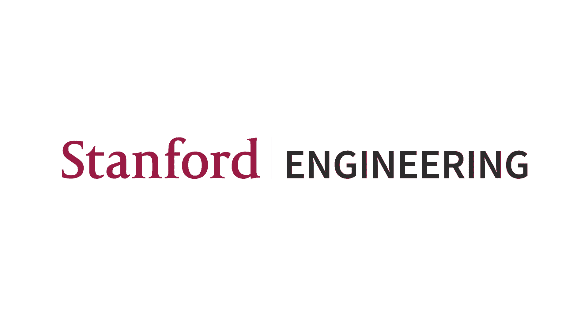

欢迎，嗯，我对看到那么多人对深度生成模型感兴趣感到非常兴奋，嗯，我是斯蒂法诺，我是这门课程的讲师，我已经教这门课程几年了，我想我们大概在知道所有生成AI的炒作之前开始教这门课程。

而且在这个主题在工业中如此流行之前，所以你知道你现在，你是幸运的，你可以体验到这个主题的一个相对成熟的版本，你知道这个季度将会非常激动人心，这是当前工业中最热门的主题之一，当然。

对于语言模型等生成模型有很多兴奋，关于图像和视频的生成模型，这门课程的目标是给你提供真正的基础，让你理解在工业和研究论文中使用的方法实际上如何工作，希望你能跟上所有必需的基本概念，以便构建生成模型。

也许在未来开发出更好的系统，开发出更好的模型，将它们部署到工业中，开始自己的公司，利用这些技术，嗯，从高处看，你知道，我认为这些模型在AI和机器学习中变得越来越重要。

是因为它们真正解决了我们在AI的许多子领域中遇到的一种基本挑战，如计算机视觉，自然语言处理，计算语音，甚至机器人学，等等，如果你想想在这些设置中，你面临的基本挑战是理解一些复杂的高维信号或对象。

如图像或语音信号，或一个序列的标记，或一个序列的字符，写在某种语言中，这是因为从计算机的角度来看，如果你考虑一个图像，它就像一个大的数字矩阵，困难的是理解它，试图找出如何将那个非常复杂的。

高维对象映射到一个对我们决策有用的表示形式，对于我们关心的各种任务，如确定图像中的对象是什么，它们之间的关系是什么，它们由什么材料制成，它们是否在移动，那种东西有多快，你知道，同样地，如果你考虑nlp。

是一个类似的故事，你有一个字符序列，你需要理解它，你需要理解它的含义，也许你想要用不同的语言翻译它，挑战真的很理解这些复杂的对象真正意味着什么，理解和这些对象很难，甚至不清楚理解一张图片意味着什么。

但我喜欢使用这个由这个引言启发的比喻，在某个时候，他说我不能创造的，我就不理解，我认为这是他们在他死后在他白板上找到的，你知道他的意思，在这个情况下，他是在谈论数学定理，他说。

如果我真的没法自己推导出证明，我对这个概念理解还不够深入，但我认为类比是，我们可以看看这个的逆否，而且像人工智能中生成模型方法的哲学背景是，如果我声称我能理解一张图片的含义或者一段文字的含义。

那么我应该能创建它，我应该能生成新的图片，我应该能生成新的文本，所以如果你声称你理解苹果是什么，那么你应该能在头脑中像画一样画出一个，也许你不能创建苹果的照片，但你知道大致是什么意思。

或者如果你声称你能说意大利语，那么你应该能大致产生，你应该能说那种语言，你应该能以那种语言写文本，这就是构建这种图像生成模型理念背后的哲学，或者文本生成模型，或者多模态生成模型，如果你有这种能力。

所以你能够生成连贯的文本，它像大型语言模型一样有意义，比如chagpt，那种东西，这可能意味着你有一定的理解水平，不仅对，规则，语法，语言的语法，也对常识有理解，关于世界上正在发生的事情，换句话说。

你只有达到一定的理解水平，才能做好生成有意义文本的工作，如果你达到了这个理解水平，你就可以利用它，并用它来解决我们所关心的所有任务，我们如何构建可以生成，例如图像的软件和代码，让我们说。

或者可以生成文本，嗯，你知道这并不是一个必然的新问题，不是我们第一次考虑的事情，嗯，计算机图形领域的人，例如，已经很长时间在思考编写可以生成图片的代码，并在这个领域取得了很多进步。

所以你可以把这种设置想象成，你被给予一个场景的高级描述，也许有各种不同颜色的对象，不同形状，也许你有一个视角，并且目标就像是，编写一个渲染器，它可以产生对应于该高级描述的图像，再次。

想法是如果你能做到这个，那么你可能对，一个立方体的概念有一个合理的理解，一个圆柱体的概念，相对位置的颜色意味着什么，而且实际上，如果你能做得很好，那么你就可以想象一个程序，试图反转这个过程，你知道。

给定一张图片，你可以尝试找出产生这个场景的高级描述，到 extent 你没有 sort of like 计算约束，而且你可以高效地做这件事，这给你提供了一个思考计算机视觉以逆向图形的方式的方式。

所以如果你有一个可以生成图像很好的过程，并且你似乎能够反转它，然后，你就在向计算机视觉任务进行进步，因为你能够真正理解这些场景的高级描述，而且你知道这不会是一门计算机图形课程。

我们将会看非常不同种类的模型，但它们会有相似的结构，许多它们会有相似的结构，其中会有一个生成性的部分，然后，通常还会有潜伏的变量，你可以像推断一样理解，给定在这种情况下的原始感官输入。

你可以使用它来获取特征以获取表示，你可以使用它们来微调你的模型以解决计算机视觉任务，因此，这种哲学和这种结构实际上将在，我们在课堂上构建的模型中出现，所以我们要处理的模型类型，它们不是基于图形的。

它们是统计模型，所以我们只谈论基于机器学习技术的模型，所以我们要处理的生成模型，将基于数据和先验知识的组合，所以您知道，先验总是必要的，但你可以想象，存在一个光谱，你可以更多地依赖数据。

你可以更多地依赖先验，你可以把这种计算机图形想象成处于这个极端，其中你利用大量的物理知识，关于光线传输，关于物体的属性来产生好的渲染器，这门课程将专注于更多数据驱动的方法，我们将尝试使用的地方。

尽可能少的前期知识，而是利用数据，嗯，大量的图像或文本数据集，也许在网上收集的，嗯，是的，从非常高的角度来看，这些生成性模型只不过是对数据的概率分布，假设图像x或以上的文本序列x，因此，从某种意义上说。

它们是统计的，我们将使用数据的组合来构建这些模型，你可以把它看作是从这种概率分布的样本，在这种情况下，先验知识基本上就是，您将使用的架构类型的混合，您将用于训练模型的损失函数的类型。

您将使用的优化器类型，以，你知道，尽可能多地产生损失函数，并且这种组合能够访问好的数据，以及正确的先验知识，这就是使你能够构建可能良好的统计生成模型的关键，但最终，就像是，抽象来说。

我们将与概率分布工作，你可以把它看作是一个函数，该函数接受任何输入x作为输入，让我们说任何图像，并映射它到一个类似于标量概率值的值，这基本上告诉你根据我的生成模型，输入图像x有多可能。

这可能不像直接的生成模型看起来，像这样，它看起来像如果你有这种类型的对象，实际上如何生成数据，想法是，你可以基本上从这种概率分布中生成样本来创建新的对象，所以你训练一个模型，你学习这种概率分布。

然后你从它中采样，通过这样做，你生成新的图像，它们希望看起来像你为训练模型使用的图像，所以这就是结构，所以从某种意义上说，我们试图做的事情是，我们试图构建数据模拟器，所以。

我们常常认为数据是我们的机器学习问题的输入，在这里，我们更像是在改变，翻转事情，我们正在考虑数据作为输出的想法，所以，我们需要考虑不同类型的机器学习模型，我们可以使用它们来模拟，来生成数据，当然。

这看起来有点奇怪，因为我们刚刚说我们将使用数据来构建这些模型，所以数据，你知道我们将使用数据来构建模型，那个，然后我们可以用它来生成新的数据，这对我们有用，因为往往我们感兴趣的是模拟器。

我们可以通过控制信号来控制，嗯，我们将看到一些控制信号的例子，你可能想要使用这些控制信号来控制你的生产过程，例如，你可能想要，你可能有一个可以生成图像的模型。

你可以通过提供你想要的图像类型的描述来控制它，你可能有一个又可以生成图像的模型，你可以通过提供可能是黑白的图像来控制它，你可以用它来产生图像的彩色版本，也许你有一个可以产生英语文本的数据模拟器。

你有控制生成过程的控制权，通过输入不同语言的文本，可能是中文，这就是你构建机器翻译工具的方法，嗯，API将再次成为概率分布的形式，所以实际上，你将能够为许多这些模型，他们也能够以潜在数据点查询模型。

并且模型将能够告诉你，它们是否有可能由这个数据模拟器生成，或者是否不是，在某种意义上，它也允许你建立一种对什么样的数据点有意义的理解，以及哪些不是，这将对一些应用有用，实际上。

这个数据模拟器最终是一个统计模型，它是我们称为机器学习的东西，一个生成模型，而且在这个课程中，我们将会思考深度生成模型，我们将会使用神经网络，深度学习，一些想法来实施这段代码，使它具有生成数据的能力。

并且给你一些例子，如果你有一个图像生成模型，你可能能够控制它，让我们假设，使用草图，也许你画画不好，而且你只能产生卧室的粗糙草图，然后你将其作为控制信号插入到你的生成模型中。

你可以使用它来产生真实的图像，这些图像具有您提供的笔触绘画的结构，但它们看起来更好，或者你可以做可能文本到图像这样的东西，其中，如果你有一个在画作上训练过的生成模型，然后，你可以通过字幕来控制它。

你可以要求模型生成新的画作，这相当于用户提供的描述，你可能立即不会想到的其他例子，它可以是像你有一个生成性模型覆盖医疗图像一样，在这种情况下，你可能使用来自MRI机器或城市摄像头的实际信号。

你可以使用那个信号来像重建医疗图像一样，你真正关心的事情，给定来自实际机器的这种测量，并且在这种应用中，生成性模型已经显示出非常高效，因为它们可以减少像测量数量这样的东西，你需要给患者提供的辐射量。

以获取测量，足以产生，医生需要来诊断的医疗图像，你可以做的事情的一种例子，如果你能评估概率，可以做异常检测，你将在作业中处理这个问题，这种变体，如果你有一个理解交通信号的生成性模型，你可能能说可以。

这看起来像是一个合理的交通标志，你可能在街头遇到，嗯，如果我给你喂食这样的东西，某种对抗性的例子，有人试图，你知道，给你自己驾驶的汽车制造麻烦，模型可能能说不，这看起来像是一件低概率的事情，这很奇怪。

做点什么，也许不要信任它，询问人类帮助，或者像这样，现在是研究生成模型的一个非常激动人心的时期，因为已经在许多不同的模式上有了很大的进步，我将从图像开始，因为那是我做过的地方，在我研究中做了很多。

当我大约十年前开始在这个空间工作时，我们能够生成的是这样的图像，甚至那样就已经像是非常，非常惊人的，人们非常惊讶机器学习系统可以训练出来，产生一种黑白的人脸图像，它们大致有正确的形状。

我们对这种结果非常印象深刻，你可以看到，过了几年，这种进步主要由生成对抗网络驱动，这是我们要讨论的一种生成模型类别，你可以看到生成的图像正在变得越来越好，更高分辨率，更详细，更真实的人像图像。

在过去的两年或三年里发生的一项重大改进，实际上是从斯坦福出来的，在我组里的年轻博士生，提出了使用分数基础的想法，扩散模型，这是一种不同的生成模型类型，我们在这门课程中也要讨论这种模型。

并成功地推动了该领域的前沿，例如，生成图像，非常高分辨率的图像，看起来像这样，像这些人不存在，它们是完全由这些生成模型合成的，这真的很，嗯，融合模型真的就是真的，驱动许多文本到图像系统的技术。

你可能见过的那种，像稳定扩散，或达利或其他或中程旅程，我们都认为基于这种类型的生成模型，这种基于扩散模型的概率分布表示方式，一旦你有一个好的扩散模型，你可以尝试使用标题来控制它。

所以现在你得到这种真的很酷的文本到图像系统，你可以，你知道，询问用户输入，你想要为哪种类型的图片添加标题，系统应该能够产生的图片类型，例如，一个骑在马上的宇航员，这就是你可以用这种系统得到的结果。

我们今天的系统，这真的很酷，你是说，这些模型已经在大量的数据上进行了训练，但显然它们可能在互联网上没有见过像这样的东西，它们可能见过宇航员，它们肯定见过马，但它们可能没有见过这两样东西一起。

所以模型能够像再次一样理解'宇航员'和'马'的意义，非常令人印象深刻，理解'宇航员'的意义，理解'马'的意义并将它们结合起来，以及它能够生成这种图片的事实。

告诉我存在一定程度上理解'它意味着什么'的水平，宇航员意味着什么，骑乘意味着什么，马意味着什么，甚至如果你看风景，我不知道这可能是，感觉好像可能在其他星球上或者什么。

所以这里有一些对这些概念的理解在展示，这超级激动，我认为这是因为它意味着我们在这个空间中真的取得了进步，并理解图像文本的意义，这种关系，"那就是推动它的原因"，"许多成功"，"我们在这乱世之中所见的"。

嗯，"这是另一个例子"，"如果你问一个关于完美意大利菜肴的系统"。

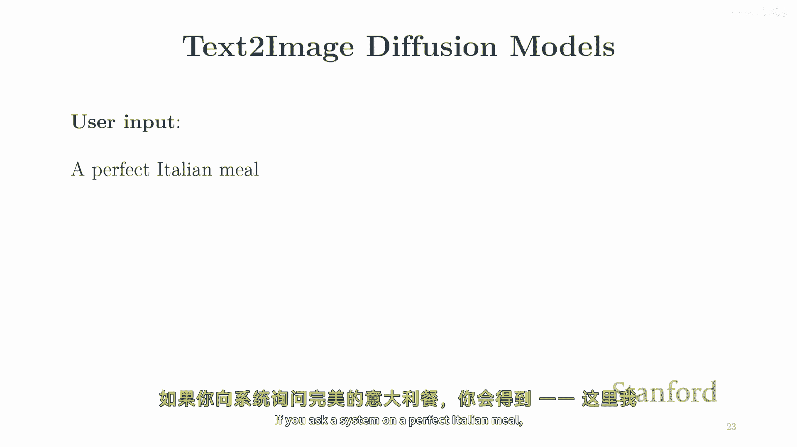

嗯，"你到这里来"，我正在生成多个样本，"所以因为它是概率分布"，正如你可以想象，你可以从中采样，并且它会生成不同的答案，所以生成是随机的，不同随机的城市，每次我看到它们，它们都会产生不同的结果。

我们可以看到四个，该死的，我认为它做得相当好，我的意思是有些东西显然是编造的，但是，那就是一个，很有趣，它 kind of like 甚至从窗户捕获出来，是那种你在意大利可能会看到的建筑类型。

然后它 kind of like 有正确的味道。

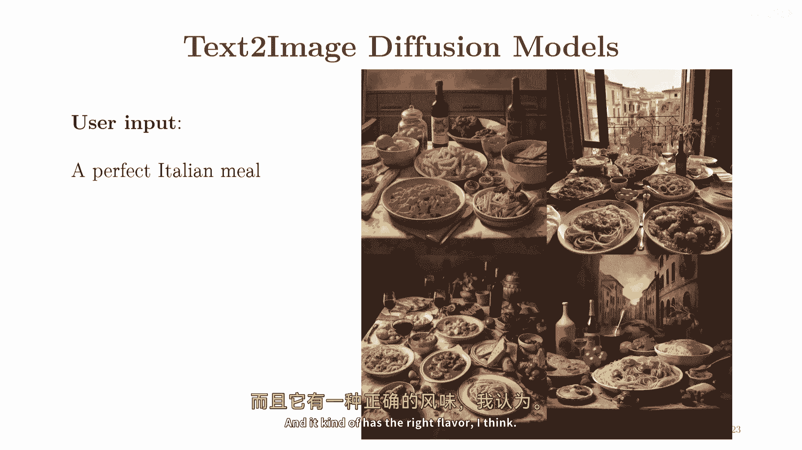

我认为它很很令人印象深刻，那种东西，这是另一个来自最近在中国开发的系统示例，这是一个穿着-costume 的泰迪熊，站在最高和谐大厅前，在北京歌剧院唱歌，又是一种相当疯狂的标题，并产生了像这样的东西。

相当相当令人印象深刻，嗯。

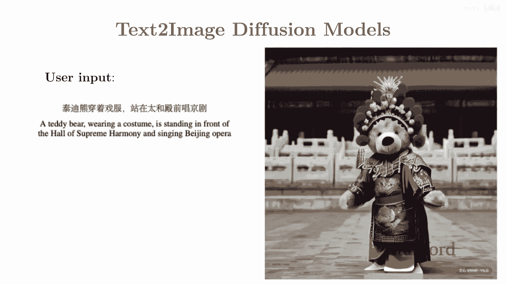

这是近期刚刚出来的最新版本，我们还不清楚这个模型是基于open ai的dali three构建的，这是来自他们博客帖子的一个例子，你，你在问模型生成，你可以自己看到标题，又很酷。

再次展示了对概念理解的高级水平，并且是一种很好的将它们组合在一起的方法，所以这是一项用于图像生成的测试，嗯，又再次，这些模型的一个好处是，你可以经常控制它们，正在使用不同种类的控制信号。

所以我们在这里使用文本控制，使用标题，但你可能，再次有许多逆问题，这是一个已经被研究很长时间的领域，人们一直在思考如何给图片着色，如何对图片进行超分辨率，如何在图片上进行绘画。

这些问题变得基本上更容易解决，一旦，你有一个好的系统，那真的能理解你通常在图片上看到的所有像素值之间的关系，所以，已经在，比如超分辨率方面取得了很多进步。

你可以从像这种低分辨率的图片转换为像那种高分辨率的图片，或者色彩化，你可以拿旧的黑白照片，然后你可以像画画一样，有意义地色彩化它们，所以如果你有一张图像，其中一些像素被遮蔽，你可以要求模型填充它们。

他们做得相当好，这些可能不是最新的参考，但你可以大致理解为什么，这些模型在现实生活中如此有用，这里是一个来自sd edit的例子，这是其中一件事，再次出现，我的一个博士生开发了它，这是回到草图到图像。

在这里，你可以从一个类似于绘画或图像的草图开始，我能做到的那种东西，然后，你可以要求模型细化它并产生一些像样的图片，它有正确的结构，但它更好看，我永远无法产生底部的图像。

但我可能可以想出顶部你看到的草图，是的，在这里，你可以看到更多例子，你可以做草图到图像，或者你可以做甚至笔触编辑，也许你从一个图像开始，然后，你在上面添加一些，你想要根据一些粗略的感觉来改变它。

你想要图像具有什么样的感觉，然后，模型将为你做得漂亮，它不一定是编辑，或者就像你不必通过笔触来控制它，另一种自然控制这种编辑过程的方法是通过文本，所以，而不是实际上绘制你想要的东西，你可以要求模型。

你可以告诉模型你想要如何编辑你的图像，所以，你可能从一个鸟的图像开始，但现在你想要改变它，你想要展开翅膀，你可以告诉模型翅膀如何展开，它有能力做这种更新，或者你有一个包含两只鸟的图像，现在。

你想要鸟儿接吻，然后这就是你产生的结果，或者你有一个包含盒子的图像，你现在想要盒子打开，你可以看到一些在图像编辑方面的令人印象深刻的结果，或者改变这只狗的姿势，甚至改变图像的风格的绘画。

你从真实图像转变为某种像绘画的图像，再次做得很好，你可以看到它正在犯一些错误，如这个，这把刀在这里被更改的方式并不完全是我们想要的，它们还不是完美的，但这些能力已经非常令人印象深刻了，非常有用，酷。

是的，回到可能不总是适合这个框架的更奇特的一个，只是为了给你一个关于这些想法有多普遍的感觉，如果你有一个医疗图像的生成模型，你可以用它来基本上改善我们如何做医疗图像，嗯，在这种情况下，控制信号。

它是你从实际测量中获得的，让我们假设一个城市可以机器制造，然后，你可以使用CT扫描机的测量来控制生成过程，这可以大大减少辐射量，然后，这个有一个你需要获取的一系列测量，以便得到清晰的图像。

你可以展示给医生，这与绘画非常相似，只是在绘画中处于稍微不同的空间，你可以大致感受到，这是大致相同的问题，生成模型的进步，在现实世界中的应用中，这带来了显著的改进，嗯，好的，现在，让我们转向不同的模态。

语音，音频是另一个人们已经能够构建一些相当好生成模型的模态，这是最早的一个，Wavenet模型，回溯到，我认为是2016年，你可以看到一些例子，希望这能工作，这是一个例子，这有点像深度学习之前的东西。

他们并不是，这些不是伟大的文本到语音，《蓝色泻湖》是一部1980年的美国浪漫冒险电影，由兰德尔·克莱瑟执导，然后Wavenet模型，这是一个基于深度学习的文本到语音模型，你将看到它显著更好。

《蓝色泻湖》是一部1980年的美国浪漫冒险电影，由兰德尔·克莱瑟执导，嗯，这些可能是最新的，基于融合模型的，所以，这很好，这是一个扩散模型和自回归模型的组合，但这里你可以看到一些2023年的东西。

一旦你有第一个标记，你想要预测，给定输入的第二个标记，和第一个标记使用多头注意力，所以你可以看到它更真实，有一些口音，这里有一些情感在那里，它感觉不像机器人那么多。

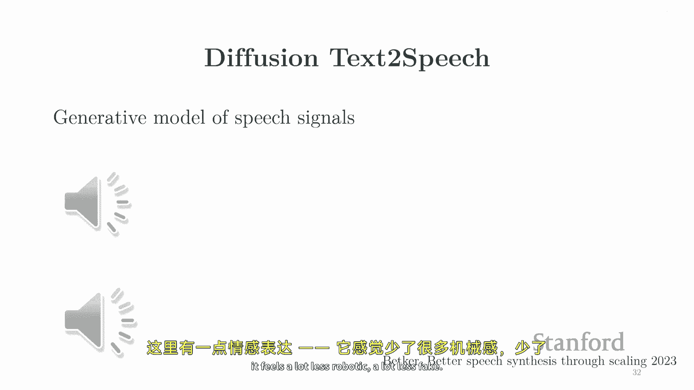

不像那么假，这是另一个例子，这是一个，你知道，只是文本到语音，你输入文本，并产生与该文本对应的语音，Cs two，Three，斯坦福最好的班级是六，嗯，再次，你可以用这些东西来解决逆问题。

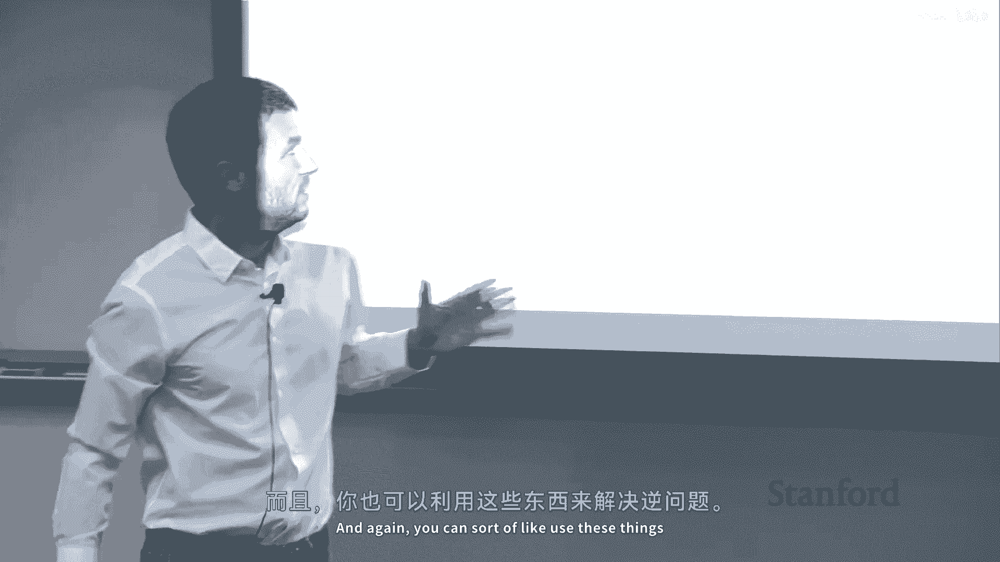

所以你可以在音频空间进行超分辨率，所以你可以基于像低质量信号这样的东西进行条件，你可以得到的东西，可能在手机上，一个是投资，一个是改革，然后你可以超分辨率它，一个是投资，一个是改革再次。

这个问题基本上与在这里的绘画相同，像你错过了一些像素，你错过了一些频率，你可以要求模型为你填补它们，到它理解这些值之间的关系的程度，你也可以把它看作是图像，他们可以做得很好，超分辨率的奇数，语言，当然。

这是另一个空间，已经有很多进步，并且对大型语言模型有很多兴奋，嗯，这些基本上是，模型，可以在互联网上收集到大量文本后训练的，常常，然后它们学习一个概率分布，过哪些句子是有意义的或不是有意义的。

你可以再次使用它来，做一些类似于绘画的事情，你可以要求模型创建一个以某种提示开始的句子，例如，这是一个旧的语言模型，我想在2019年，我认为嗯。

你可以要求模型继续一个以to get an a plus开始的句子，在深度生成模型中，学生必须，然后让我们看看这个语言模型会做什么，然后它会为你完成它，对吧，然后它说它不是那么合理。

他们必须愿意与省份工作，它们更感兴趣，过去，你知道，并不是很好，并不完美对于今天的标准，但是再次，当这个东西出来的时候，它是非常令人惊叹的，你可以构建一个可以生成这种质量的模型。

我尝试在chagpt上做了类似的事情，这次我尝试做一些更难的事情，如这里，我对你说在深度生成模型上得A+，我在这里尝试了，我应该怎么做才能在斯坦福的CS 2-3-6课程中得A+，所以我甚至没有告诉模型。

JGPT，什么，CS 2-3-6是，它实际上知道CS 2-3-6是深度生成模型，在这里，它给你一些实际上相当好的建议，告诉你如何做得好，在课堂上，他们参加讲座，保持组织，寻求帮助，完成他们的作业。

它给你十五份，我在这里剪断了提示，但你知道它是，你能做这些事情真的很令人印象深刻，再次，它可能意味着存在某种程度的理解，嗯，这就是这些模型如此强大的原因，人们正在使用它们来做各种各样的事情。

因为它们可以生成，意味着它们理解一些东西，然后，你可以使用知识来解决我们关心的各种任务，嗯，当然，你知道的，这个空间的一个好处是，你可以经常混合和匹配，所以你可以使用各种控制信号来控制这些模型。

一旦你能够进行生成，你就可以使用不同的控制信号来引导生成过程，在这里，一个自然的控制信号可能是生成英语文本，基于另一种语言的一些文本，所以也许中文，所以你有，而且这就是机器翻译，对吧。

所以生成模型的进步基本上直接翻译为机器翻译的进步，如果你有一个真正理解如何生成文本的模型，你知道在英语中，然后，"并且它可以很好地利用控制信号"，那么这就意味着基本上它能够进行翻译得比较合理。

"并且在关于进步的许多方面，"，像，"我们在这个课程中要讨论的模型和架构"，"这些是背后的想法"，我们今天拥有的那些相当不错的机器翻译系统。

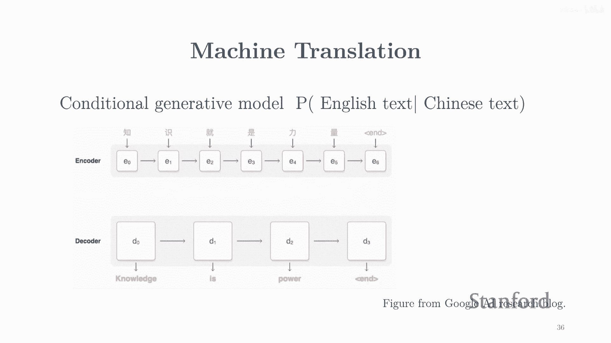

另一个例子是代码。当然，非常刺激，作为计算机科学家，其中许多人是计算机科学家，编写大量的代码，一天的结束时代码会被征税，如果你有一个理解哪些文本序列有意义的模型，以及哪些不有意义的模型。

你可以用它来为你编写代码，所以，这里有一个今天存在的系统示例，你可能喜欢，尝试让模型自动完成，让我们说，基于对函数应做什么的描述，函数的主体，并且，再次，这些系统并不完美，但是，它们非常。

它们已经相当好了，就像，它们可以做很多，它们可以解决许多令人感兴趣的有趣任务，它们可以解决，编程作业，它们可以解决他们在竞争编程比赛中表现得非常出色的比赛，所以再次很酷，因为他们理解自然语言。

他们理解编程语言的语法，他们知道如何将东西组合起来，所以使他们能做正确的事情，他们 sort of 能够翻译，在这种情况下，从自然语言到正式语言，并且在这种情况下是 Python，并且能做正确的事情。

所以对这种类型的模型也有很多兴奋。

嗯，另一个很酷的是视频，这是其中一个活跃的，第一个系统正在被重新构建，你可以想象各种各样的用户界面，通过许多不同的东西来控制生成过程，一个自然的被征税，你可能说你从一个标题开始，然后问你的模型生成视频。

对应于标题，这是一个例子，像视频现在不是很短，那就是一个限制，但你能看到吗，哦，是的，好的，在那里显示出来，嗯，这里还有一个例子，你在要求它生成一段情侣在雪地上滑坡的视频，在整个罗马教堂风格。

这就是它产生的大致效果，你知道一天结束时的短视频，你大致认为视频是一系列图像，所以如果你能生成图像，那么相信你也能生成图像堆，这基本上就是视频，嗯，能够看到图像之间的连贯性，真的很令人印象深刻。

帧之间的连贯性相当好，它大致捕获了用户要求的内容，你知道质量非常高。

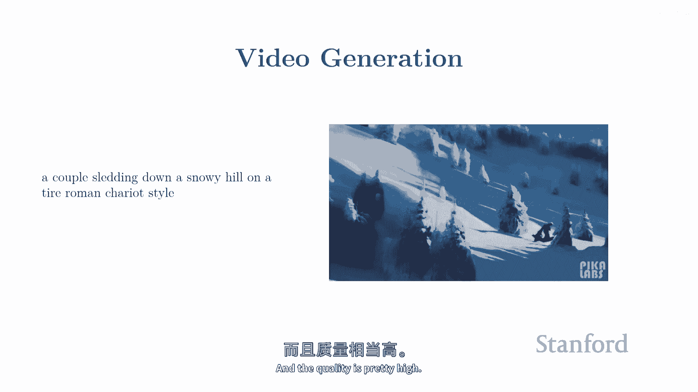

你知道，如果你愿意努力工作，并将许多不同的视频拼接在一起，你可以生成一些非常酷的东西，糟糕。

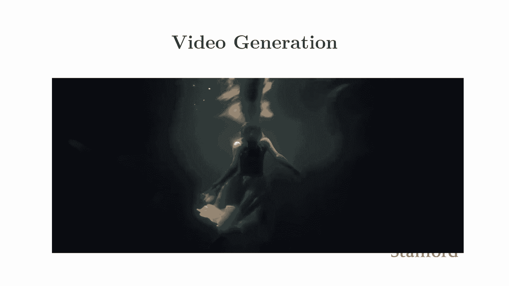

这基本上就是之前系统生成的视频拼接在一起，嗯，你知道，你可以看到它并不完美，但它真的很惊人，我的意思是，我们还没有达到可以直接要求系统为你产生电影的水平，带有特定情节的，或者你最喜欢的演员。

但它已经能够产生高质量的内容，人们愿意观看并参与，所以我们正在目睹一种令人兴奋的发展，视频生成模型，我认为当这开始工作，并且我们在这个空间看到的进步像我之前为你展示的图像一样，它就正在发生。

我认为当人们发现这一点并得到非常好的系统时，他们可以生成高质量的长视频，这可能会极大地改变我们，你知道，我们许多媒体行业都需要关注这个问题，问题，是的。

是的。

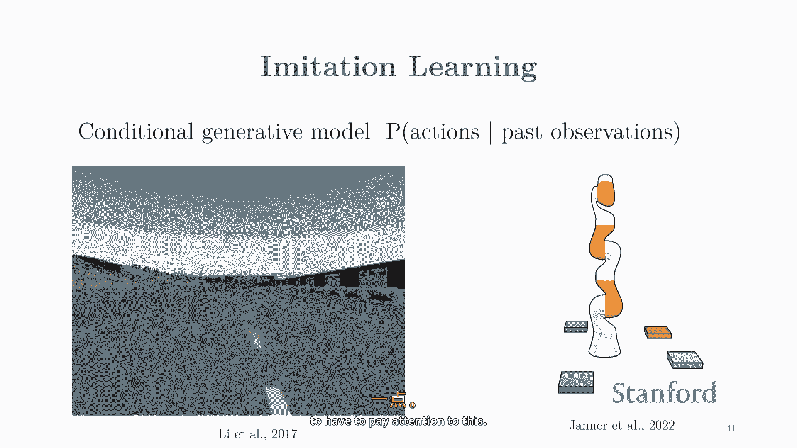

生成那一代，是的，像生成模型，或者你需要做一些手工缝合，因为你知道，现在这可以说是我见过的最令人印象深刻的视频生成视频，所以，如果你继续关注这个，那就是惊人的，这些完全是由警察生成的。

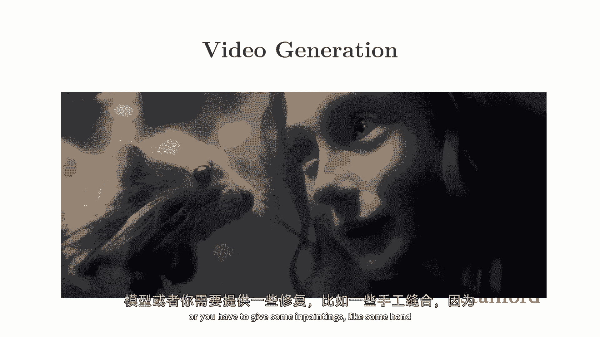

好的，我必须说这个，我会继续关注这个，太棒了，这些完全由警察生成，好的，这个我必须，我不知道确切地这个包含了什么，我没有自己制作它，但我知道系统允许你也通过标题和种子控制它，并生成图像，你知道。

如果你可能已经知道你想要你的角色看起来什么样子，那么你就可以使用它并动画，假设一张给定的图像，再次，这是一个，这是一个控制生成过程的例子，你可以通过文本控制它，你可以通过图像控制它。

有许多不同的方法可以做到这一点，是的，这实际上是来自我们组的一个博士生，一个前博士生，在我们组的博士生，所以是的，这是他们正在开发的系统，它是非常好的，我同意你，真的很令人印象深刻，一旦你学会这个。

你就可以做这种事，这个，这个材料掌握得很好，好的，另一种完全不同的应用领域，有点像决策制定机器人，嗯，这些领域有很多，你所关心的是在世界中采取行动以实现某个目标，例如，驾驶汽车或堆叠物体，所以到最后。

你可以把它看作是生成一系列有意义的行动，再次，我们在这门课程中谈论的机器，很大程度上可以应用于我们所谓的模仿学习问题，其中你被给予，良好的行为示例，可能是由人类提供的，你想要你的模型生成其他良好的行为。

例如，你想要模型学习如何驾驶汽车或如何堆叠物体，所以这里是一个例子，你可以如何使用我们在课程中谈论的技术，来学习如何在这个视频游戏中驾驶汽车，啊，你知道，你必须找出哪些行动是有意义的，当然。

什么样的行动才合理，不撞到其他汽车，保持在道路上等，再次，这不是一件容易的事，但如果你有一个好的生成模型，你就可以控制它，有许多不同的方法可以做到这一点，是的，然后你可以。

在这个模拟器中你可以做出好的决定，这是一个你可以像训练扩散模型一样训练的例子，在这个情况下堆叠对象，所以再次，你需要找出什么样的轨迹有意义，如果你有一个理解哪些轨迹具有正确结构的好模型。

你可以使用它来堆叠不同的对象集，你可以控制模型产生高质量的策略。

嗯，科学界充满了兴奋，嗯，围绕生成模型的一些科学和工程，你的任务之一是世界级的生成模型专家，来合成具有特定属性的分子，或者像具有特定属性的蛋白质，并且在你知道结构的层面上，甚至甚至在三维层面上，就像是。

真正理解这些分子的布局，"是的"，"对于围绕建筑物的空间生成模型设计药物的兴趣非常大"，或者设计更好的催化剂，所以，到了一天结束时，你可以把它看作是又一次，"来自某种生成模型"。

"你需要想出一个在某项任务中表现良好的食谱"，"如果你用大量的数据来训练一个模型"，"在什么样的"，"让我们看看蛋白质在某项任务中的表现如何"，"然后你可能能够生成一系列能够执行的氨基酸序列"。

那甚至比我们现有的东西更好，或者你可能能够设计一种药物，它能以一种特定的方式结合，因为你正在瞄准，让我们说，你知道，新冠或者什么，因此，对于构建生成模型，周围有很多兴趣，对于与典型模式有所不同的模态。

它不是图像，它不是文本，但是，它是同一种生成性模型，仍然是扩散模型，或者是要变成自回归模型，它将是这种模型，我们在这门课程中要讨论的模型，嗯，是的，所以有很多兴奋，还有其他的，你知道。

还有很多其他模态我没有放在幻灯片中。

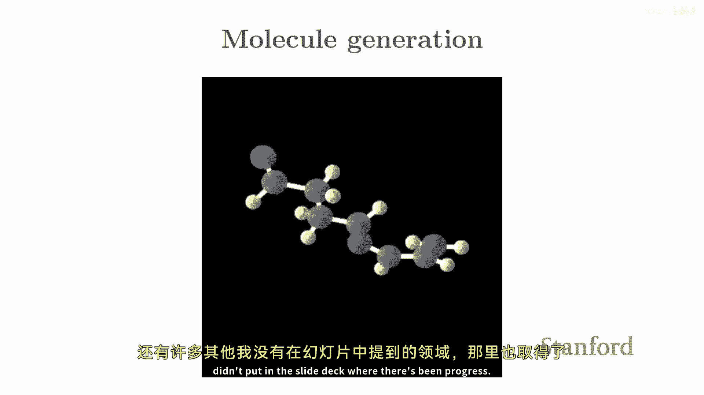

在那里产生了生成三个d对象的进步，所以这是另一个非常令人兴奋的，有点像区域和许多更多，当然嗯，还有一丝，嗯，嗯担忧和嗯，希望我们能在课堂上讨论一下，在课堂上。

我们都知道计算机正在变得越来越擅长生成难以与真实内容区分的内容，你知道，关于深度伪造的问题有很多，你知道哪个是真实的，哪个是假的，我的学生又产生了一个，但你能感受到这种技术可能带来的危险。

这种系统的滥用潜力很大，所以我们在课堂上可能会讨论这个问题，好的，这就是大致的情况，引言希望能让你对这个主题充满热情，而且有点像，展示了在这个领域工作的确是一个非常激动人心的时期。

这就是为什么有这么多的热情，不仅在这个行业，而且在学术界围绕这个主题也有很多热情，每个人都在努力创新，构建系统，找出如何在实际世界中使用它们，发现新的应用，所以这是一个非常激动人心的时期来研究这个。

这门课程旨在真正给你提供并覆盖，我们认为的核心概念，在这个空间中，一旦你理解了所有不同的建筑块，这些模型面临的种类，这些模型所做的种类权衡，然后，你不仅可以理解现有系统的工作方式，但希望你也可以。

你知道，设计下一代这些系统，改进它们，找出如何在新的应用领域再次使用这些方法，这门课程设计的系统应该是相当严格的，将会有大量的数学，它将深入探讨关键概念，所以我们将谈论很多关于表示的问题。

正如我们讨论的关键构建块是统计建模，我们将使用概率分布，这将是关键构建块，所以我们将谈论很多关于如何表示这些概率分布的问题，如何使用神经网络建模概率分布，在我们有许多随机变量的地方，那就是挑战。

我的意思是你已经看到了像高斯这样的简单概率分布，以及像这样在这个空间中不工作的东西，因为你有太多的不同的东西需要考虑，并且你需要同时建模，因此你需要想出聪明的方法来表示。

如何所有图像中的不同像素相互影响，或如何句子中的不同单词它们相互连接，因此，很多内容都将，课程的内容将侧重于不同的想法，你在构建这些模型时必须考虑的不同权衡，当你构建这种模型时，我们还将再次讨论学习。

这些将是，你知道，统计生成模型，因此，总是有数据，你将使用数据来拟合模型，并且有许多不同的方法来拟合模型，你有许多不同种类的损失函数可以使用，在融合模型中使用的是一种东西。

在生成对抗网络中使用的是一种东西，在大型语言模型中使用的是一种东西，自攻击模型，这些本质上归结为比较概率分布的不同方法，你有数据分布，你有模型分布，并且你想要这两件事情相似，所以当你从模型中生成样本时。

它们看起来像来自数据分布的那些，但你又知道概率分布，回到第一个点，它们非常复杂，如果你有一个非常复杂的对象，非常高维的对象，所以直接比较到概率分布并不像测量一样简单，它们有多相似，所以你不得不像。

你有一个数据分布，你有一个可以从中选择的模型家族，你 kind of 不得不选择一个接近数据的模型，但是，测量相似性非常困难，取决于你如何测量相似性，你将得到在不同的场景中工作良好的不同种类的模型。

然后，我们将谈论推断，我们将谈论你知道如何从这种模型中生成样本，有时你有足够的概率分布，但它可能不直接来自它，所以我们将谈论那个，我们将讨论如何反转生成过程，如何从这些对象中获取表示，嗯，例如。

有点像有点像按照，并使视觉的概念成为逆向图形，稍微更具体一点，嗯，因此，我们将讨论无监督学习和不同的方式进行聚类，因为最终，这些模型做什么，它们必须找到数据点的相似性，当你试图完成句子时，你需要做的。

你需要遍历你的训练集，你需要找到相似的句子，你需要找出如何将它们组合，你需要找出如何，如何完成您给出的提示，一旦你有生成模型，你通常也可以获取一些像样的表示，你有方法可以聚类具有相似意义的数据点，嗯。

是的，再次，你可以获取特征，你可以做像，在无监督学习中你想要做的事情，这是做机器学习时你没有标签的情况，你只有，你只有你有，但你没有y，你想要对特征做有趣的事情，嗯，所以这些就像是。

在模型中即将出现的三个主要概念，我们将首先讨论，可能是最简单的一种模型，其中基本上你有直接访问似然度的访问权，这些将是，在这个空间中，将有两种类型的模型，出自回归模型和基于流的模型。

自回归模型是大型语言模型使用的模型，以及我今天提到的其他几个系统，基于流的模型是一种不同的想法，常常用于图像和其他连续数据，嗯，是用于图像和其他种类连续数据的一种常见方法，我们将讨论隐含变量模型。

使用隐含变量来增加生成模型的表达力的概念，本质上，是你的生成模型的表达力，我们将讨论变分推断，变分学习和变分编码器，层次变分外编码器，在这里，我们将讨论隐式生成模型的那种想法，想法是。

而不是代表x的概率分布p，你将代表你使用生成样本的过程，这有 tradeoffs，它允许你非常高效地生成样本，但训练模型变得困难，因为你不再有访问似然度的访问权，所以你不能使用最大似然估计。

那种我们理解得非常好的想法，并且我们知道有良好的性能啊，所以我们将讨论两种样本测试的离散度，以及不同的培训方法，这种系统，特别是我们将讨论生成对抗网络和如何训练它们。

然后我们将讨论基于能量的模型和扩散模型，再次，这基本上是一种现状，在像图像生成这样的词汇中，音频生成，人们开始使用它们，也用于文本，嗯，那是我之前向您展示的视频生成技术的技术基础，嗯。

所以我们将深入探讨它们如何工作，以及如何将它们视为潜在变量模型，以及与所有其他事物的联系，是的，再次，这将是一个相当数学的课程，所以将有很多理论，将有算法，我将详细介绍应用，将有作业。

我们将有机会与这些模型玩耍，嗯，是的，在预修课程方面，我们期待您已经完成了，至少，嗯，一门机器学习课程，我们将尝试覆盖，尽可能多地从零开始，但可能很难接受这门课程如果您从未做过任何机器学习。

您应该熟悉概率，这个概念，你知道，基本的概率理论微积分，我们将使用梯度下降，线性代数，贝叶斯规则，那种东西，基本微积分，那种东西，变量变换公式，是的，你应该再次熟悉那个，你可能可以掌握它。

但如果你不熟悉，可能会很困难，如果你以前从未见过这种想法，然后，是的，将有编程作业，所以你应该熟悉希望是Python，我们将使用PyTorch，所以我们将有一个关于那个的部分，如果你以前从未见过。

但如果你没有做过任何这些之前，可能会很困难，嗯，在物流方面，嗯，我们有一个网站并不完全更新，所以有些信息可能会改变，所以请定期检查它，我们正在完成一些日期，并试图确认中期考试和海报会议的房间，所以。

但希望这将很快完成，我们没有一本实际上不存在的教科书，这实际上是，我认为，几年前在这里首次提供的第一堂课，在这个主题上，没有任何类似的存在，所以我们不得不从零开始创建它，我们汇编了一套讲座笔记。

你可以在那里访问，我们试图覆盖，你看到在幻灯片上的基本内容，其中一些内容可以在深度学习书中看到，你可以在那里看到，所以这是一个有用的参考，它可在线获取，所以你可能想要检查它，嗯，是的。

我们有一个伟大的教学助理团队，嗯，是的，现在网站上应该有一个日历，包含我们的办公时间，当然，欢迎你来，大多数他们将在下周开始，但是是的，否则，欢迎随时通过，如果那个是的。

如果这个星期我们不能亲自见到你们，但是是的，我们总是很高兴聊天，嗯，在评分和作业方面，所以将有三份作业，所以第一份作业将于下周一发布，它们占总成绩的15%，每个占5%，总共，它们将覆盖理论以及再次。

将与所有这些作业相关联的编程任务，我们将有期中考试，它将在课堂上亲自进行，期中和课程的主要部分将是一个项目，我们认为在这个空间中有这么多事情要做，所以它对你们来说真正探索是合理的，将占，你知道。

总成绩的40%将是一个相当重要的部分，有许多里程碑，你将从提案开始，将有一个报告，关于事情进展的，你需要提交，嗯，在最后，将有一个海报演示，然后关于你做的工作的最终报告，嗯，是的，项目，嗯。

我认为我喜欢这门课，它确实给你提供了一个探索的机会，在这个空间中有这么多事情可以做，所以嗯，有许多有趣的项目想法最终变成了论文，变成了公司想法，这里充满了兴奋，你可以在组中工作，假设是至多三名学生。

通常这些是三种情况之一，有时学生将现有的生成模型应用于新的数据集，也许他们来自应用领域，并发现在解决新问题上使用模型的新有趣方式，有时人们会尝试比较不同的生成模型和新的数据集，有时人们会努力改进模型。

你知道 again，这些东西还很新，我们不太可能已经找到了解决这个问题的最佳方法，所以仍然有很多改进的空间，常常你可以结合不同的方法，你可以选择一个扩散模型，你可以添加一些生成对抗训练的元素，嗯。

口味的食物，这样你可以得到显著的改进，常常你可以，这些东西可以在顶级机器学习会议上发表，如果他们工作得好，有时人们会进行更多的理论分析，这将会有大量的理论，大量的数学，因此。

在试图理解这些模型何时有效时，仍有改进的空间，当它们现在失败时，一切都非常非常经验性，我们确实需要一个更好的理论来解释为什么，像你之前展示的那样的事情是可能的，因此。

在这个空间中有大量的机会来发展一个更好的理论，此外，还将提出可能的项目建议，所以，看看，一些关于可能由tas或其他校园教师提出的项目建议的信息，我们能够提供一些谷歌云优惠券，但不幸不多，至少有一点点。

嗯，所以我们会想出一个方法来将这些优惠券分发给学生，如果你想得到一些关于过去几年人们做了什么项目的灵感，你可以去查看2019年和2021年的所有网站版本，你可以了解人们做了什么样的项目。

以及你可以了解什么样的，所以可以了解，嗯，一个项目需要多少，哪些成功了，哪些没有，可以得到一些想法，嗯，是的，我想我今天基本上已经覆盖了所有的内容，我很高兴回答问题，然后下周我们将开始背景。

攻击性模型等。

