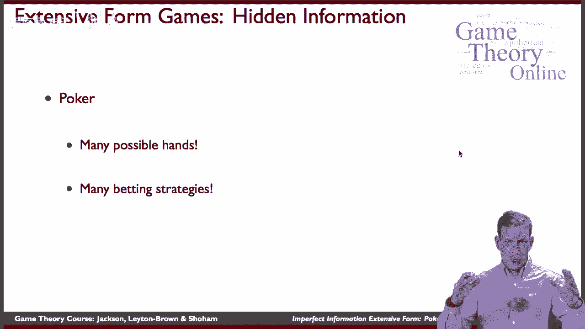
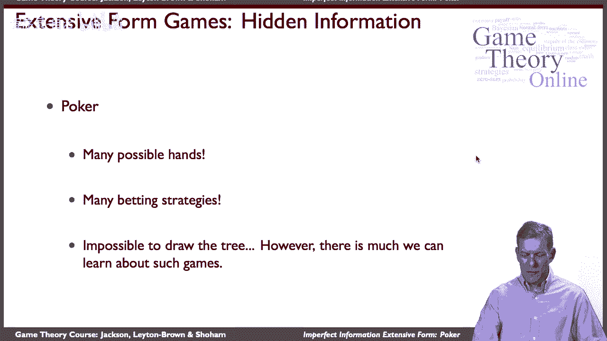

# P31：【斯坦福大学】博弈论（30）不完美信息拓展形式：扑克游戏 - 自洽音梦 - BV1644y1D7dD

又见面了，乡亲们，嗯，所以这是马特，我们现在谈论的是广泛形式的不完全信息，所以我们现在要讨论游戏，我们有一些顺序的动作，玩家的头脑中可能会有一些不确定性，关于其他人可能的回报和其他人可能遵循的策略。

所以我们就从，你知道的，给你一些关于这个的想法，让我们来谈谈扑克。

这是一个非常受欢迎的游戏，最近，呃，既适合人们玩，也适合电视和其他类型的东西，是最古老的游戏之一，经验，对很多人来说，扑克的一个关键方面是，床上用品实际上有顺序游戏，呼叫，折叠，所以一个玩家得到。

你知道做决定，就他们要下多少赌注而言，在某个时间点，其他玩家必须对此做出反应，所以顺序播放，你在许多这样的游戏中看到一些牌，但不是全部，所以你可能会看到其他玩家拿着的一些牌，但你不知道他们的手有多有力。

你必须推断他们可能的牌，两者都来自游戏中的赔率，根据他们在战略方面所做的，嗯，所以你看到赌注了，你对他们的反应，你必须在此基础上做出推断，嗯，所以这包括对动机的信念，其他玩家的理性，他们的收益是什么。

他们的潜在回报是什么，在扑克中可能来自纸牌。

嗯，所以当我们想到这些游戏时，你知道有很多可能的手，这将使扑克成为一个相当复杂的游戏来跟踪，有很多击球策略，这意味着我们要处理的整个树。

会很复杂，嗯，所以实际上画这棵树几乎是不可能的，就像在屏幕上画出来一样，嗯，但尽管如此，关于分析这类游戏，我们还是可以学到很多东西，分析他们的策略类型，我们如何用完整的信息表示广泛的形式游戏。

我们怎么能不讲道理呢？嗯，而且会有更简单的设置，呃，你知道的，扑克实际上是一种相当复杂的游戏，嗯，还有其他相当复杂的游戏，但赌注很高的游戏，例如，你知道我们可以让一个国家考虑入侵另一个国家。

潜在的战争或冲突，嗯，他们试图决定另一个国家将如何回应，所以说，如果你入侵，他们会怎么做，那是一个不完全信息的游戏，因为你可能不知道它们到底有多强，或者怎么，人民愿意与政治上可能发生的事情作斗争，嗯。

他们有多强壮，如果发生战争，所以在这种情况下，一方可能必须先行动，预期对方的反应，嗯，第二个必须预测，他们被入侵的事实，意味着对方的力量，你投降了吗，你们打架吗，所以那些是游戏。

它们将具有与这些相似的特征，开发一套，表示这些东西的一种方式，以及分析这些，那就是我们接下来要去的地方。

