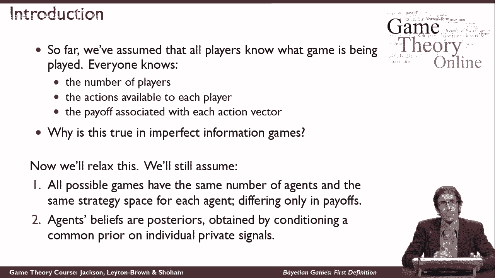
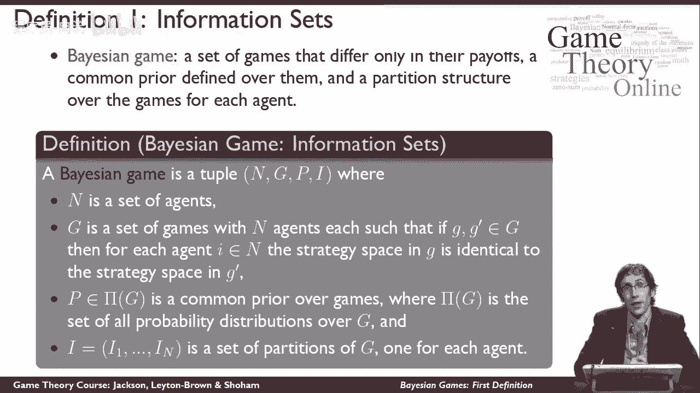

# P43：【斯坦福大学】博弈论（42）贝叶斯博弈：第一个定义 - 自洽音梦 - BV1644y1D7dD

事实证明，有几种不同的方法来定义贝叶斯博弈，这个视频将给出第一个定义，所以在考虑贝叶斯博弈之前，我们所想到的一切，假设所有的玩家都知道正在玩什么游戏，那就是每个人都知道世界上有多少球员。

每个玩家都有什么动作，如果每个人都有一个完整的行动概况或行动向量，会有什么回报，所以让我给你一个机会停下来想想为什么，这在不完美的信息游戏中仍然是正确的，因为直觉上你可能觉得这不是真的。

所以你现在可能想暂停视频，考虑一下，然后我会告诉你答案，所以不完美的信息游戏仍然让所有这些事情都是真的，就是，在一个不完美的信息游戏中，你不记得的是，其他玩家此刻都玩了什么动作，当你要采取自己的行动时。

但情况仍然是，你知道每个人都可以采取什么行动，如果你知道什么，情况仍然是这样，每个人都做了一个完整的动作简介，会有什么回报，现在我们来想想这些假设不再正确的游戏，所以我们还是要做一些新的假设。

所以让我告诉你，所以我们放松的是，所有的玩家都知道正在玩什么游戏，所以说，我们现在要考虑这个想法，玩家可以考虑不止一个可能的游戏，在所有这些可能的游戏中，玩家会推理，它们都将是具有相同数量代理的游戏。

每个代理的策略空间相同，所以它们会有什么不同只是在效用函数中，这很重要，因为很难建模，在这种情况下，你不太确定你有什么策略空间，现在还不清楚该如何行动，你可能会发现对游戏进行推理很有用。

你不确定还有什么其他特工，事实证明，在这个框架内捕获实际上是可能的，那样的话，你会一直相信每场比赛都有最多的特工在场，但是你要以一种方式设置效用函数，有时一些特工在场并不重要，因为他们不能影响任何东西。

我们要做的第二个假设，这与代理人对这些不同可能游戏的信念有关，所以为了让这个工作，必须是这样，代理人对世界上可能发生的事情有明确的信念，我们要说的是，特工们从一个共同的先验开始，所以这就是。

每个人对世界上可能发生的事情都有相同的信念，什么游戏是可能的，然后他们可能会得到关于，事实上正在玩什么游戏，然后他们会做贝叶斯更新，所以他们最终会有一个事后的信念，它是从这个共同先验开始获得的。

并根据他们的私人信息更新，所以这是一个假设，我们可以相信特工有不同的先前信念，但这不是我们在贝叶斯博弈中假设的。

这里有一个关于信息集的贝叶斯博弈的定义，所以说，贝叶斯博弈是一组只在收益上不同的博弈，也是对这些游戏定义的一个共同的先验，以及每个代理的游戏上的分区结构，所以说，换句话说，贝叶斯博弈是由四个元素定义的。

第一个是一组代理，第二个是一套游戏，回想一下，一个游戏被定义为一组代理，一组操作配置文件，对不起，一套动作集，每个特工一个，和一组效用函数，每个特工一个，所以我们要限制这组游戏。

都有相同的代理集和相同的动作集，所以这些游戏只会在效用函数上有所不同，然后呢，p是博弈中所有可能概率分布的集合中的一个元素，这将是我们的优先分配，所以这将告诉我们从集合G开始的每一个游戏的可能性有多大。

最后，我们将为每个代理设置一组g-1的分区，所以这将是一组等价类，它会说，从代理人的角度来看，某些游戏彼此无法区分，还有一些不是。

让我们看一个例子，所以这个例子通常有点做作，我们将用贝叶斯博弈来建模，一些在世界上有某种意义的东西，在这里，我们真的看到了一些人造的东西，但这是一个小例子，仍然让我们思考一切重要的事情，关于贝叶斯博弈。

首先要注意的是有四种可能的游戏，匹配的便士，囚徒困境，两性的协调或战斗，顺便说一句，这里的囚徒困境是以不同的收益玩的，比你以前可能看到的，但这并不重要，从战略上来说，这是同样的游戏。

我们在游戏中有一个共同的优先顺序，所以玩家有30%的机会，事实上是在玩，是匹配便士，他们有百分之十的机会真的在玩，囚徒困境，20%的协调机会和40%的性别战斗机会，现在我还没有标记这些游戏中的动作。

但我们的假设是它们必须是相同的，假设1号博弈者有两个选择，上面或下面他可以选择上面或下面的动作，每场比赛都一样，同样2号玩家可以选择左或右，他在每场比赛中都有左或右动作，所以说，这里有趣的是什么。

当然啦，我们有这些信息集，所以一号玩家会发现，比赛在这两盘中的哪一盘，这意味着，事实上，大自然将决定哪个游戏被如此随机地玩，就要决定了，根据共同优先顺序进行的四种游戏中的哪一种，假设最有可能发生的事情。

玩家们最终会玩性别之战，那样的话，一号玩家会发现，他在这个等价班而不是这个，所以这意味着他肯定知道他不是在玩，匹配的便士还是囚徒困境，但他会认为他可能在玩任何一种协调，或者性别之战，他将无法区分他们。

现在2号博弈者有不同的等价类，所以2号玩家认为这两个游戏是无法区分的，并同样认为这两个游戏是无法区分的，继续我们以前的例子，如果这真的是大自然随机选择的游戏，那么二号玩家就会发现他在这个等价类。

而不是这个，这意味着他会认为正在玩的游戏要么是囚徒困境，或者性别之战，最基本的事实是事实上性别之战正在进行，他会认为有可能，囚徒困境正在上演，我们已经看到那个球员了，人们会认为这是可能的，协调正在发挥。

这意味着当玩家决定采取什么行动时，他们将不得不玩一个动作，在不完全知道将要玩什么游戏的情况下，他们必须对对手的所作所为进行推理，在不完全知道对手会怎么想的情况下，他们确实知道这个设置的一切。

所以这整个画面是玩家知道的他们知道共同的先驱者，他们知道自己的等价类，他们知道对手的等价类，所以如果我是一号玩家，我想知道2号玩家要做什么，我知道我在这个等价类，我也知道二号玩家如果游戏真的是协调。

我相信这是可能的，那么二号博弈者认为他在这个等价类，并认为匹配的便士是可能的，即使我知道这是不可能的，或者另一方面，如果性别之战是真正的游戏，那么我知道2号博弈者认为他在这个等价类。

这意味着他会认为囚徒困境是可能的，即使我知道这是不可能的，我会离开去拍未来的视频，实际上我们是如何推理这些游戏的，但我们在这里学到的是如何定义贝叶斯博弈，把它写成概率分布。

