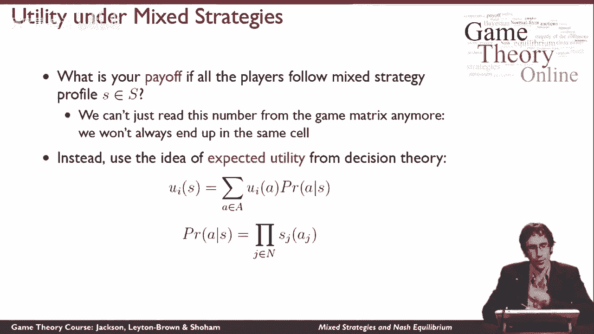
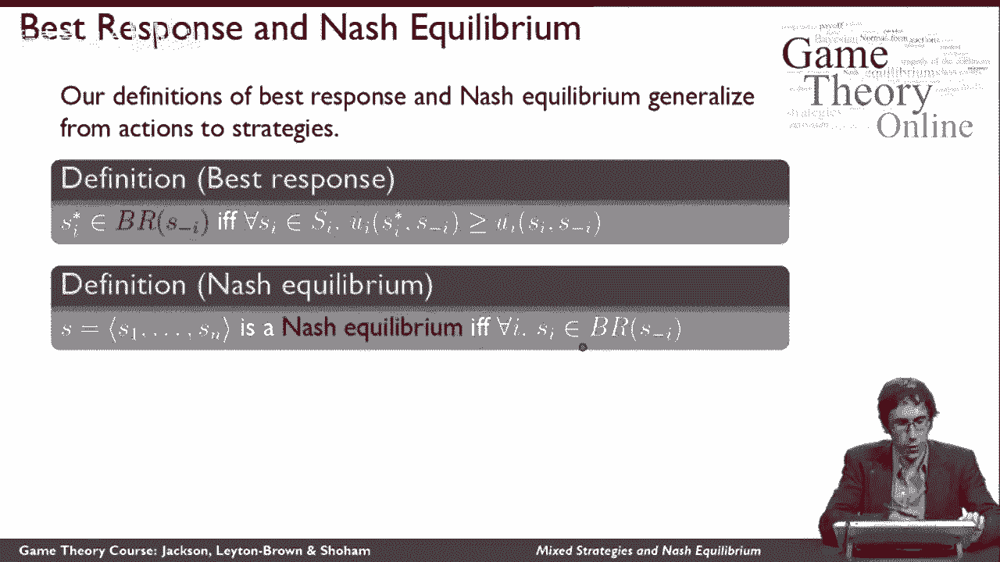
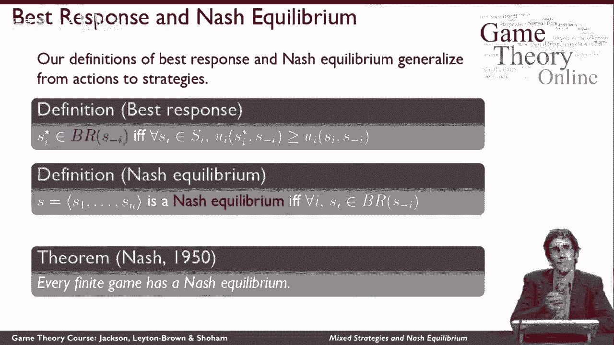
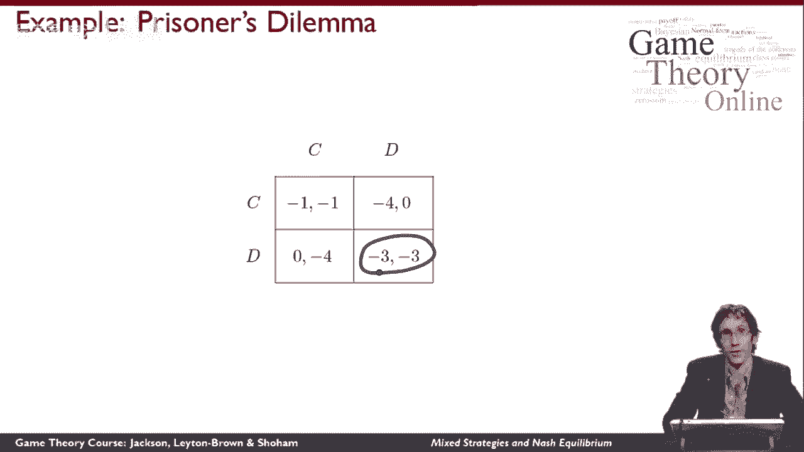

# P13：【斯坦福大学】博弈论（12）混合策略与纳什均衡(II) - 自洽音梦 - BV1644y1D7dD

这堂课将介绍混合策略的概念，并将我们以前的纳什均衡概念扩展到这个新定义，让我们从看配对便士游戏开始，召回，那个，在这个游戏中使用任何确定性策略都是一个非常糟糕的主意，比如说，如果二号玩家玩人头。

玩家1想要通过玩人头来获得一个的回报，意味着二号玩家更愿意换成尾巴，这样他就可以得到一个，意味着一号玩家更愿意换成尾巴，这样他就可以得到一个，意味着2号玩家更愿意变回正面，为了得到一个的回报。

意味着一号玩家也更愿意变回正面，为了得到我们开始的回报，所以你可以看到，有一种循环，我们只是在这个游戏矩阵的不同细胞之间跳来跳去，从本质上说，没有一对确定性策略对双方都有效，那么什么对双方都有效呢，嗯。

从本质上来说，玩家互相混淆是有意义的，通过选择随机播放，所以直觉上，而不是说我要承诺玩人头，否则我就玩牌，我可以说我要掷硬币，玩任何出现的一方，所以让我们试着让这个想法正式一点。

在我们讨论纯策略的想法之前，我们只是把它等同于玩动作，现在，让我们从概率分布的角度来考虑事情，假设代理的策略是任何概率分布，玩家可以使用的动作，和纯粹的策略，那就是我只玩一个正概率动作的特例。

混合策略是说我将以正概率玩不止一个动作，可能会有几个不同的动作，我赋予了喜欢的正概率，在我的例子中，用匹配的便士，我要打电话给我的混合策略的支持者，获得正概率的动作集，例如，当我抛硬币的时候。

当我玩配对便士，正面和反面都支持我的混合策略，我的支持是固定的头，尾巴，我将为一个代理定义所有策略的集合，我是大写的，次级i，我将定义所有策略配置文件的集合，资本是不同代理人的这些策略集的笛卡尔积。

现在我有一个问题，我已经详细阐述了我在游戏中的策略定义，但是在这些有限集合上的所有概率分布的无限集合，这是一个问题的原因是我只有一个动作配置文件的实用程序定义，现在我允许事情发生，我没有公用设施。

因为也就是说，我不能从游戏矩阵中读出一个数字，去弄清楚玩家们有多开心，当事情发生时，因为在一个规模大于一个的支持的混合策略下，我不会总是在母体的同一个细胞里结束，所以我可以在这里扩展我对效用的定义。

利用决策理论中的期望效用思想，所以这些方程解释了这意味着什么，它看起来比实际复杂得多，所以我在这里要说的是，i在混合策略配置文件下的效用，其中小s是某种元素，所有可能的混合策略配置文件的集合。

大S等于游戏中所有动作配置文件的总和，你可以直觉地想到这一点，在游戏的正常形式中，所有单元格的总和，其中我利用每个单元格的效用，我把它乘以，在给定的混合策略中到达该单元的概率，到达细胞的概率，战略简介。

a，我很抱歉，操作配置文件，给定的战略概况，然后呢，当然，我需要定义这个概率实际上是什么，这里给出了，我得到给定动作配置文件的概率，给定一个战略配置文件。

只是每个玩家在动作配置文件中扮演他的角色的概率的乘积，所以说，比如说，如果这个玩家在每个动作的概率点五，这个玩家在玩，我到达这个牢房的概率是2。5，此动作剖面以概率点二五出现。

因为这种事情发生的时间有一半，这种事情发生的时间有一半，所以我们必须把这两个概率相乘，得到这个动作剖面的联合概率，所以那是，这就是这里的定义所说的，所以总共。

我对策略配置文件的实用程序是我的预期实用程序，对所有的动作配置文件进行期望，以支持该战略简介，并根据动作剖面实际出现的概率对每一个进行加权。

好吧，现在我已经定义了什么是策略，我可以回到我对最佳反应和纳什均衡的定义，基本上他们的工作方式和以前一样，除了我把所有的A都改成了S，所以这意味着我必须再写一遍这些定义，我会再检查一遍，但在概念上。

如果你明白最佳反应和纳什均衡在行动的情况下意味着什么，然后一切都会恢复正常，所以我要说一个策略明星，i是对战略配置文件s减i的最佳响应集的一个元素，当以下条件对所有其他策略为真时，该玩家。

我可以为那个玩家选择一套可能的策略中的所有策略，注意这是一个无限集合，不过没关系，定义仍然有效，那么玩家扮演一个明星I会得到的效用，当其他人都玩策略简介的时候，我至少和他玩另一个策略时一样大。

我再说一遍，S星I是对战略配置文件的最佳响应，s减去i，如果它至少和其他东西一样好的话，考虑到其他人都在玩，s减去i，现在我们可以说，策略配置文件S是纳什均衡，如果对所有特工来说，每个人都在玩最佳对策。

顺便说一句，您可能会注意到，我在这里使用了一个集合成员资格运算符，而不是等号，这是你可能期望看到的，我不用等号的原因是，因为最佳反应集可能有不止一个东西，所以最好的反应可能不只有一个。

有时会有多个最佳反应，所以我想说的是，战略简介是最好的回应之一，如果这个条件为真，我是说战略布局处于灰平衡，如果每个人都在玩他们最好的回应之一，好吧，这可能看起来像是无事生非。

我介绍了随机化作为一种策略的想法，我重新定义了效用，然后我利用了这个重新定义的效用定义，顺便说一句，这就是我在这里用的，当我谈到策略配置文件定义最佳响应的效用时，然后我在这里利用了最佳响应的定义。

讨论纳什均衡，总数。

我只是说了你已经听到我们说过的一切，但重要的是，现在我们有了纳什均衡的新定义，我们能够陈述一个我们以前没有的定理，这就是纳什的著名定理，这就是纳什以他的名字命名纳什均衡的原因。

这也是纳什获得诺贝尔奖的主要原因之一，这个定理实际上没花很长时间就证明了，但这对博弈论来说是一件非常重要的事情，定理是每个有限博弈都有一个纳什均衡，首先什么是有限博弈，这听起来像我在这里对冲。

但这不是一个很大的树篱，有限博弈只是意味着博弈需要有限的空间来写下，所以它有有限数量的玩家，它对每个玩家都有有限数量的动作，这意味着它在游戏中有有限数量的效用值，因为效用值的数量是由玩家的数量决定的。

以及每个玩家的动作数，所以只要游戏有有限数量的玩家，不仅仅是两个球员，不仅仅是两个动作，但也许是一场非常重要的比赛，那么不管收益值是多少，不管我们在这里谈论的是什么战略形势，不管现实世界的互动是什么。

这是建模，在这个博弈中至少有一个纳什均衡，这是一个相当深刻的事情，就是说，总会有一些稳定的事情，所有的球员都能做，如果他们知道每个人都在做什么，他们都不想改变策略，那个，这基本上是为什么。

我们关心纳什均衡的这个想法，因为我们知道无论游戏是什么，我们可以找到这样一个纳什均衡并对此进行推理，这就是为什么纳什均衡是如此强大的东西，只有当我们对纳什均衡有了更全面的定义时，这才是正确的，这里。

我们刚刚从策略的角度定义了，当我们讨论纳什均衡时，我们看到了这一点，在我们现在从现在开始，称为纯策略纳什均衡，而不是s的，那纯粹是策略，纳什均衡，可悲的是，我们没有得到一个定理。

它说每个有限博弈都有一个。

纳什平衡中的这种混合能总是存在的，让我们举几个例子，所以记得匹配便士，我们只是在这个视频的开头有效地争论了一下，匹配的便士没有纯策略纳什均衡，但它确实有一个混合策略纳什均衡，它有一个，那就是。

就像我之前建议的那样，两个玩家随机五五开，这并不意味着总是要对半分，这恰好就是这里的纳什均衡，这来自于收益的对称性，但这是纳什均衡，让我们回到协调游戏，我们以前看到过这两个策略配置文件，而你。

我在盘旋结果，但请记住，结果不是平衡的，你知道一个一个不是平衡，这样说是不对的，正确的说法是，左左是一个均衡，右是一种平衡，但事实证明这里还有另一个平衡点，结果又是，这里也是纳什均衡，这有点好笑。

因为看起来不像五点，在这场比赛中，五分是一件很好的事情，但你可以向自己确认，如果1号博弈者通过玩50，那么二号博弈者只能随机选择，现在你会注意到2号博弈者也可以玩别的游戏，如果一号玩家玩五五开。

一号玩家也很乐意向左走，但特别是1号玩家如果1号玩家对半分，2号玩家只能自己五五分帐，反过来也是如此，那就是五十个，五十，五十，五十，以及协调博弈的纳什均衡，让我们来看看囚徒困境中的囚徒困境。

我们以前已经看到这是一个均衡，这是严格占优策略中的均衡，我们之前讨论过均衡和严格占优策略是唯一的，所以这确实意味着，囚徒困境不存在混合纳什均衡。

