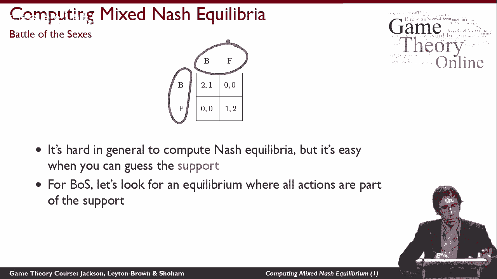
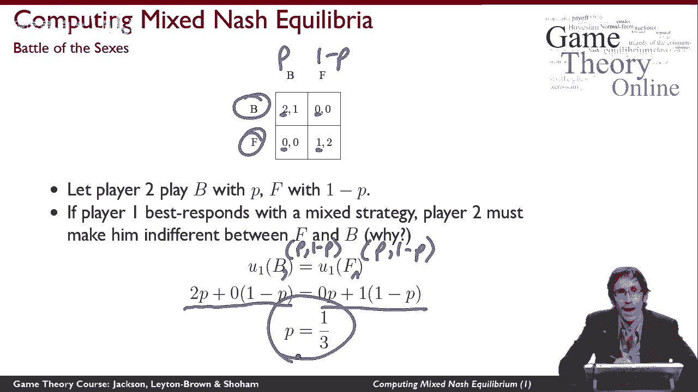
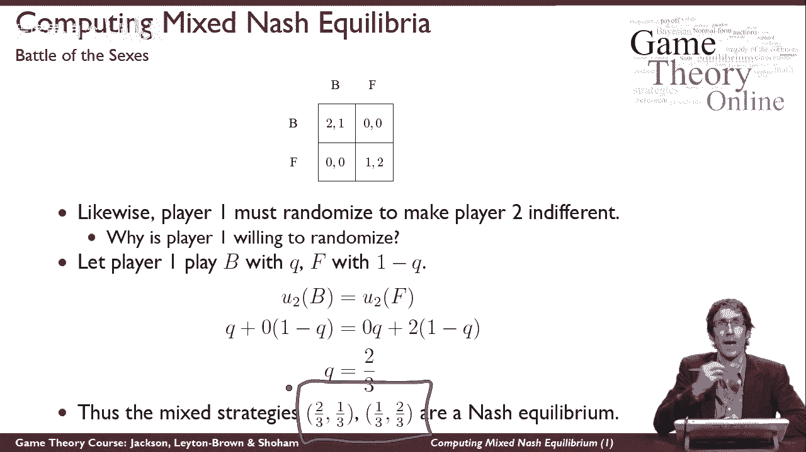
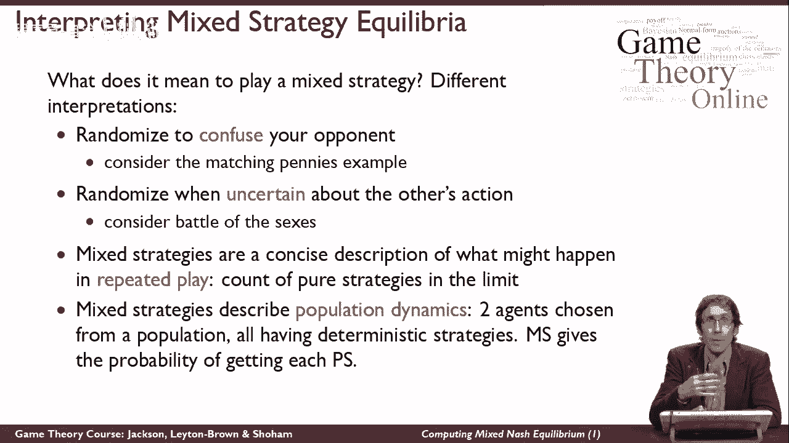

# P14：【斯坦福大学】博弈论（13）计算纳什均衡的复杂性 - 自洽音梦 - BV1644y1D7dD

在这个视频里，我们要看看如何计算混合纳什，正规形式博弈的均衡。

特别是我们将通过性别之战的例子，到目前为止你所看到的关于均衡的，这表明很容易找到一个平衡点，但事实上，随着游戏变得越来越大和普遍，有时找到博弈的平衡点是很棘手的，纳什定理是一个有趣的定理。

因为它告诉我们有些东西存在，但它没有告诉我们如何找到它，它只是告诉我们它必须在那里，这是一个非建设性的论点，所以我今天要告诉你们的是一个起点，寻找平衡，这足以让它在小游戏中工作，事实上。

你可以把它变成一个通用的算法，但不一定是找到平衡的最有效或最有洞察力的方法，所以我今天想告诉你的是，计算纳什均衡很容易，如果你能猜出平衡的支撑是什么，那么回忆一下，什么是支持，支助。

是接收正概率的纯策略集，在玩家的玩家的混合策略下，所以平衡支撑是一组以正概率发生的动作，比如说，这可能是平衡的支持，所以对于性别之战来说，让我们猜猜，让我们猜测均衡的支撑是所有的动作。

所以让我们直观地看看，如果这个博弈有一个混合策略均衡，那看起来像它应该是的，所以让我们猜猜那是支持，然后试着推理平衡必须给予什么支持。

所以让我们引入一些符号来使这个工作，让2号玩家来玩，概率为p和f，概率为1减去p，如果1号博弈者对这种混合策略的反应最好，不管是什么，都要采取混合策略来应对。

那么我们可以推断2号博弈者一定设置了p 1减去p，以一种使玩家1对自己的行动B和F漠不关心的方式，所以这是推理混合策略如何工作的重要一点，所以我鼓励你在这一点上停止视频。

在我告诉你答案之前好好想想为什么会是这样，所以一号玩家需要加入的原因，我在幻灯片上没有答案，我来告诉你1号玩家为什么要无动于衷，他在给自己玩一个混合策略，这意味着有些时候他在玩B，有时他玩得很好。

因为这两个都在支撑中，他们都以非零概率被玩，如果这是平衡的，那么这是一号玩家发挥良好的最佳反应，如果1号玩家可以玩B，有些时候和F，一些时候，并发挥最佳反应，他玩b和f肯定是无所谓的。

如果他不是无动于衷，如果B更好，那么他就可以得到更多的效用，通过减少他在f上的概率，增加他对b的概率，事实上，他可以通过在f上完全没有效用来获得最大的效用，B上的所有实用程序。

所以他真正想玩混合策略的唯一方法是，如果他玩B和F是一样的，这意味着我们可以推断2号博弈者设定了他的概率，1减去p使得1号博弈者，我们费心思考这个问题的原因是，我们可以用数学写下来。

所以我们可以说1号玩家玩B的效用，在这里我有点滥用符号，你应该真正理解这意味着玩家1玩B的效用，给定玩家1玩p 1减去p，等于1号博弈者再次玩F的效用，假设玩家2玩p 1减去p。

所以我们可以简单地把它展开，所以我们可以说，如果是这种情况，给定相同的概率p和一减p，那个玩家1在玩B和玩F之间是无关紧要的，那就意味着好，当他弹B的时候，然后他得到两个概率为p的。

他得到零的概率是1-p，这就是我们在这里写的，当他玩F的时候，他的概率p为零，概率1减去p为一，这就是我们在这里写的，现在我们只有一个简单的单变量方程，所以如果我们重新排列，我们最终得出结论。

唯一能让一号玩家无动于衷的方法是，b和f是如果p等于三分之一。

用同样的方式，我们可以推断如果2号博弈者随机，我们刚刚以为他是，那么一号玩家必须让他无动于衷，为什么1号玩家愿意随机选择，因为他同时被二号玩家弄得无动于衷，假设1号博弈者用概率q玩b。

以1-q的概率玩f，所以现在我们可以做和以前一样的事情，你应该明白这意味着q 1减去q，这里也一样我们可以说我们可以用同样的方式扩展它，所以如果2号博弈者玩b，然后他得到一个概率为Q的。

他得到零的概率是1-q，如果他玩F，他的概率q为零，2，概率为1-q，我们现在又有了一个一元方程，我们可以重新排列它，发现q等于三分之一，这里发生的重要事情是，一号玩家和二号玩家都愿意随机化。

所以我们最终得到了有意义的数字，我们最后得到了p和q，那是概率，他们在零到一之间，这意味着实际上有可能以这样的方式设置它们，一号玩家和二号玩家实际上会无动于衷，如果收益不同。

我们可能在这里得到了一些东西，比如13，如果q是十三，这意味着B必须比B发生的频率高13倍，比F更重要，因为一号玩家无关紧要，因为这不是一种可能性，这到底会告诉我们什么，没有办法让另一个玩家无动于衷吗。

这将告诉我们不可能有一个平衡与支持，我们得到的可以解释为一种可能性，这意味着在这个支撑下有一个平衡，因为我们所看到的是，如果一号玩家这样玩，2号玩家这样玩，然后他们彼此冷漠，如果他们都让对方无动于衷。

那么他们都愿意玩这些混合策略，因此，最终，这个混合策略配置文件是一个纳什均衡，所以我们所做的是计算纳什均衡，在猜到支持之后。

这就是我们开始做的，所以我最不想想的是，玩混合策略意味着什么，原来有不同的解释，现在你真的可以看到发生了什么，在混合策略中，你会更好地理解这些不同的解释，所以第一个也是最自然的。

就像在匹配便士的例子中发生的那样，那就是你随机化来迷惑你的对手，所以在匹配的便士中，我们每个人都想要相反的东西，我们彼此平衡的唯一方法，如果你对我要做什么有某种不确定性，如果你确定我在玩人头。

你只是确定你要做什么，这是我不喜欢的东西，所以在这个游戏中没有纯粹的策略，所以我们能保持平衡的唯一方法是，如果我们都对对方有点困惑，这并不能真正描述刚刚在匹配的便士里发生的事情，对不起，性别之战的例子。

我们刚刚在这里玩的，另一个玩家，我想协调一下我们最终在不同地方的情况，我们中的一个去看足球赛，我们中的另一个去看芭蕾舞，对我们俩来说都是一件不愉快的事情，我们都喜欢的是我们都在同一个地方。

游戏中唯一的战略元素，来自于我们对自己最喜欢的活动有不同的偏好，所以在混合策略均衡中，这是一件不愉快的事情，因为，当然啦，当我们玩这个三分之二的时候，我们刚才在性别之战中看到的三分之一的平衡。

我们有两个零一二，如果我们混合，有可能我们最终会，在这些我们都不喜欢的不协调的结果中，那只是一件不愉快的事情，关于我们在玩完全支持均衡的事实，所以我们不可能随机化，故意混淆对方，相反。

我们应该真正理解这种随机化反映了不确定性，所以如果我不确定对方的行动，然后，然后我最好的回应，鉴于不确定性，我这样做的方式让你有点不确定，以一种特殊的方式，我们也可以发现自己处于平衡之中，这是真的。

我理解平衡稳定性的方式，在性别之战中，如果我们让对方不确定，以精确的方式，我们可以发现自己处于平衡之中，尽管我们真的更喜欢它，如果我们最终处于这些纯平衡中的一个，我在这里要提到另外两种解释。

只是为了完整，我们也可以把混合策略看作是对会发生什么的简明描述，如果真的没有人随机，但我们只是反复玩游戏，所以你可以想出一个混合策略，作为极限内发生的纯策略的计数，你可以看到。

这也可能描述了在性别之战游戏中发生的事情，在哪里，如果我们只是在不同的策略之间来回跳跃，把自己放在那三分之二里，第三种方式我们将处于平衡状态，有时我们会不协调，最后一种解释是混合策略描述了种群动态。

所以如果我们有大量的玩家，和2号玩家的全部人口，我们从人群中抽取球员样本，他们每个人都有一个确定的策略，所以如果一个人口有三分之二，是和三分之一的F，其他人口有三分之一B和三分之二，f。

如果我们在这些人群中取样，这些种群将相对于彼此处于平衡状态，所以这是另一个我们可以讲的故事，这解释了均衡可能意味着什么，它意味着玩一个纯粹的策略。

对不起，混合战略，在那里保持平衡。