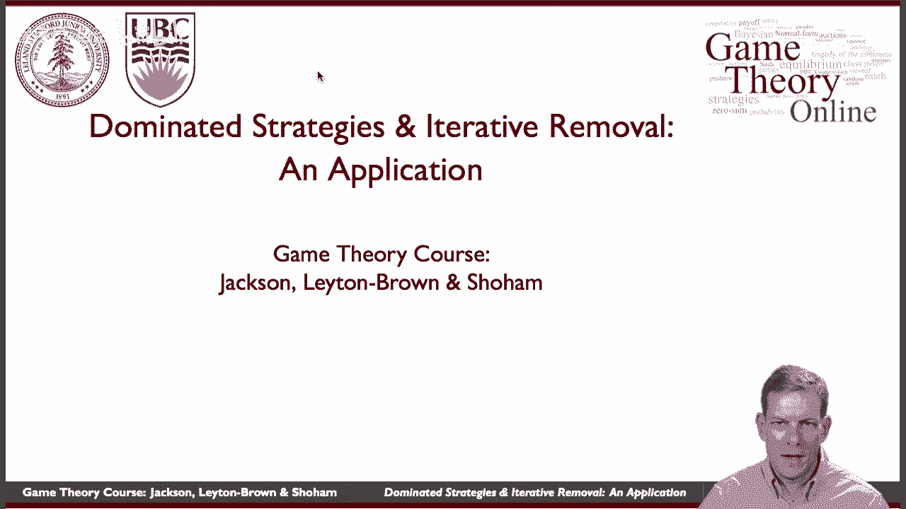
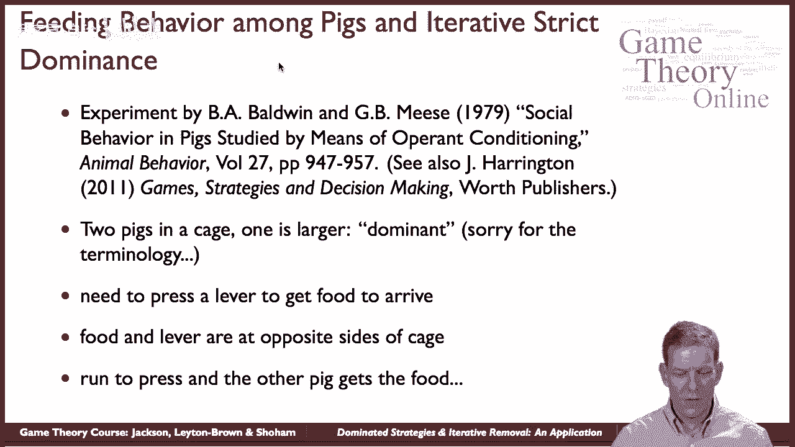
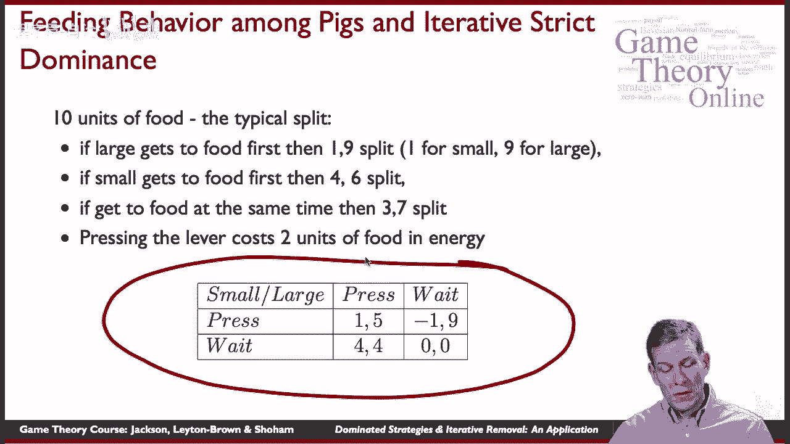
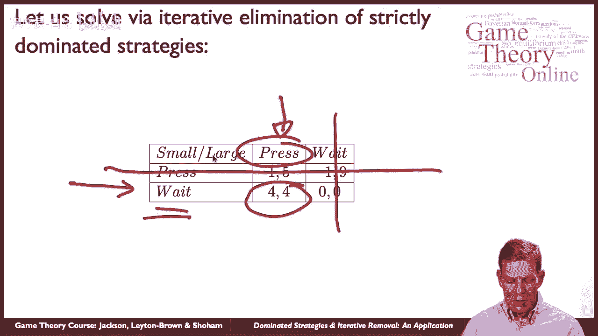
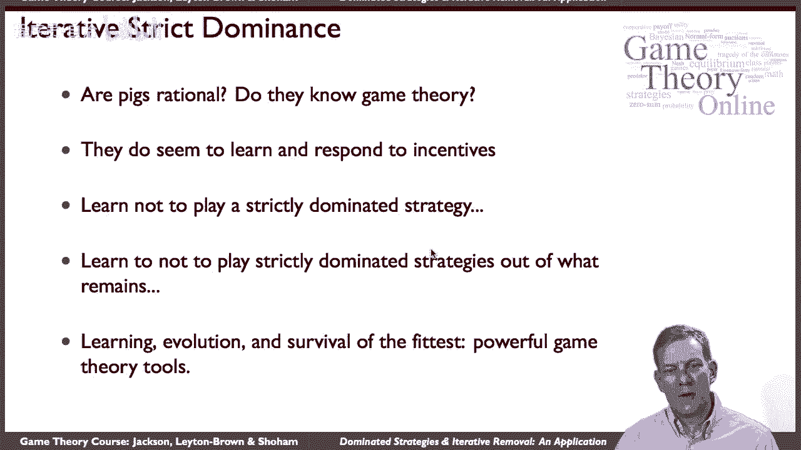

# 【斯坦福大学】博弈论 （全） - P21：【斯坦福大学】博弈论（20）优势策略与迭代去除的一个应用 - 自洽音梦 - BV1644y1D7dD

嗨，伙计们，现在让我们看一场比赛，在那里我们可以开始看到，严格占优策略的迭代消除在应用中是否有任何作用。

为了做到这一点，我们要看看鲍德温和米斯做的一个实验，在二十世纪七十年代末，他们实际上是在观察猪的社会行为，所以所以这个，我们游戏中的玩家将是猪，实际上有一个有趣的讨论，这是乔的。

哈灵顿的《游戏策略与决策》一书，这个想法有点有趣，嗯，你在笼子里关了两头猪，好的，所以他们被关在笼子里，几米笼，其中一头猪比另一头大，我们就叫它优势猪，或者我是说，会对术语感到抱歉。

所以我们实际上会用更大的猪这个词，嗯和嗯，他们需要做的是食物到达，但他们需要按下杠杆才能让食物到达，好的，关键是控制杆在笼子的一侧，你过去，你按下杠杆，然后食物到达笼子的另一边，所以把猪放在笼子里。

这个笼子，他们最终了解到，如果他们击中这个杠杆，食物出现在另一边，所以如果它们想吃东西，他们必须搬过去，跑到笼子的一边，敲击杠杆，跑回另一边，得到出来的食物，吃东西，几粒食物，然后他们回去。

再按一下操纵杆，跑回笼子的另一边，吃点东西，好的，现在困难的是笼子里有两头猪，所以如果我们把两只猪放在同一个笼子里，一个比较大，然后当他们都试图得到食物时，这些是猪，大的最终会得到食物。

小一点的吃的会比较少，好的，这就是这里的基本思想，然后我们可以把它分析成一个游戏。

所以特别是，让我们更详细地看看收益是如何工作的，所以当食物出来的时候，有十个单位的食物，比如说出来的食物颗粒，让我们看看典型的分裂最终是什么，如果笼子里有两头猪，一个更大，一个小一点的。

如果大的先吃到食物，然后基本上是一个九分，这意味着小猪最后只吃了一粒，大一点的猪最终会得到九个单位的食物，所以如果大的先到达那里，小的很难得到任何东西，他们往往平均得到一个，但并非一无是处。

如果小猪先吃到食物，然后他们以4-6的分裂结束，好的，那么是四六十，所以小猪得到的还是少，越大的猪得到的越多，但小猪至少在这里有战斗的机会，嗯现在，如果他们同时吃到食物，然后它是一个三七分裂。

所以大一点的猪得到的，另一件事是你知道，跑过去按压杠杆实际上会消耗一些卡路里，所以让我们把它，就能量而言，他们把它理解为两个单位的食物，好的，所以我们有这些不同的分裂等等。

所以我们能做的就是写出一个简单的，嗯，正常形式的游戏，所以考虑到所有这些数字，嗯，这边有只小猪，这边的大猪，现在他们有两个选择，他们可以跑过去按下杠杆，或者他们可以坐在那里，坐在食物的旁边。

等另一只猪按下操纵杆，如果你们两个都去按杠杆，然后他们回到食物上，同时这将是一个三七分裂，但这是一个三七分裂，然后你减去两个来回跑的成本，所以他们每人损失了两个单位的食物，所以三减二我们得到一个。

7减去2我们得到5，所以我们最后得到了一个五，如果他们两个同时做，在一种情况下，比如说，小猪按压杠杆，大猪就在那里等着，那就是一九分成，但小猪最终损失了两个单位的能量，在这种情况下。

他们实际上最终得到了净负数，等等，所以你可以把这个放进一个正常的游戏中，我们最终得到的是一个简单的矩阵形式，二对二比赛，它是这样的。

好的，所以我们可以分析这个游戏，很简单，让我们把它，和，让我们说，我通过严格劣势策略的迭代消除来分析它，那么在这个游戏中什么是真的，嗯，谁有严格劣势策略，嗯大猪，大猪没有严格的劣势策略，他们想等。

如果另一个按，他们更喜欢按，如果另一个在等待，所以这里没有统治，但请注意，小猪总是得到更高的回报，四对一，零对负一，他们总是宁愿等待，所以在这种特殊的情况下，小猪有一个严格的占优势的称重策略。

所以我们应该摆脱媒体作为小猪的策略，一旦我们做到了，现在剩下的，大猪要按，所以我们最终得到的是，当我们迭代地消除严格劣势策略时，我们最终预测小猪应该等待，大猪应该是按杠杆的那只。

所以让我们看看他们对猪的实际行为，在实验中，所以他们在这里所做的是，他们给了他十五分钟的时间做这件事，嗯，他们在猪单独关在笼子里的地方做了十次测试，所以你们最初的十个测试，猪在那里坐了十五分钟。

并学会如何按操纵杆获取食物，然后他们把猪放在一起再做十个测试，每人15分钟，好的，所以他们在这里做的是，这是每十五分钟推杠杆的频率，我们可以看看当大猪，猪分开的时候，他们两个都在那里，我们大致可以看到。

大猪每15分钟移动75次按下控制杆，我是说这些猪真的在来回移动来获取食物，小猪说了70次跑来跑去拿食物，嗯，所以他们都是，如果让他们一个人呆着，他们去，他们按下杠杆，他们跑来跑去，如果他们在一起。

那么发生了什么，预测是较大的猪应该做压制，对呀，他们应该按压，小猪应该等着，而且确实嗯，他们多久推一次杠杆，小猪很少现在只有五次了吗，而大猪的速度是0到5倍，所以说，事实上。

我们看到他们看到他们在紧要关头紧逼和等待，正如理论所预测的那样，事实上，大猪做得更紧迫，部分可能是因为他们得到的颗粒越来越少，因为小猪坐在旁边，吃一些大猪生产的小球，按压杠杆。

好的，所以呃，我们从中学到了什么猪是理性的，他们有吗，他们知道博弈论，嗯嗯他们，他们可能没有坐下来解决，范式博弈，并迭代消除严格占优策略，但有一点是真的，他们确实学会了，他们似乎确实对激励做出了反应。

嗯，和，我想，所以你学会了不要玩严格劣势的策略，对呀，因为它总是给你较低的回报，最终你放弃了这样的策略，这样玩家就不会坐在那里玩严格的劣势策略，如果他们有其他策略的经验，一旦他们停止演奏。

知道你就学会了不要玩严格指定的策略，从剩下的东西中，这样小猪就能学会，跑过来压一下操纵杆是不值得的，因为大猪得到了一切，所以他们停止按杠杆，他们只是坐在那里等着，最终大猪做了按压。

所以你学会了不要用剩下的东西来玩严格劣势策略，优胜劣汰，这些都是强大的博弈论工具，博弈中严格占优策略的迭代消除，在有一些力量的地方，这些东西最终会，嗯，你知道的。

做一些预测。