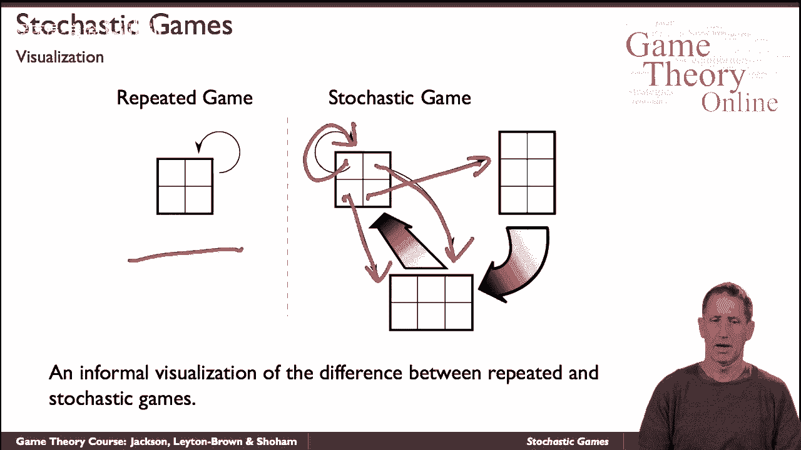
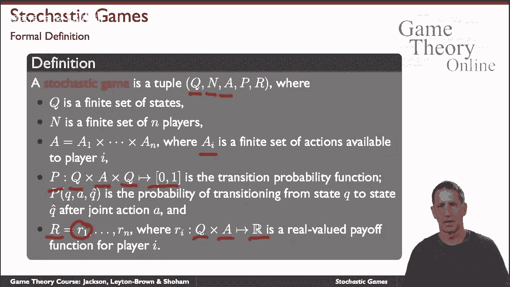
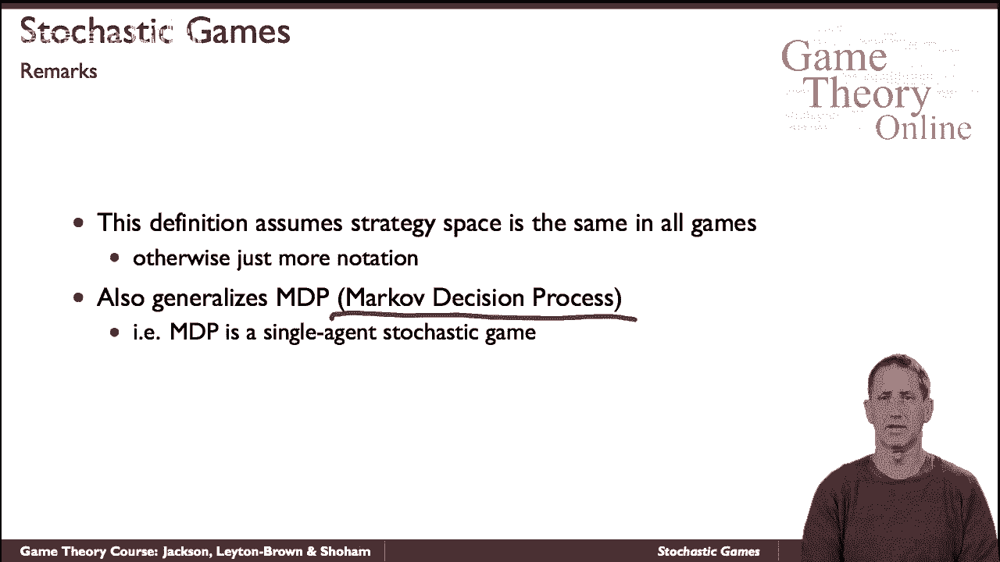

# 【斯坦福大学】博弈论 （全） - P37：【斯坦福大学】博弈论（36）随机博弈 - 自洽音梦 - BV1644y1D7dD

现在让我们简单地谈谈随机博弈，这是一个需要长时间讨论的话题，也是一个相当复杂的话题，但我们会触及要点，并将其定位在我们正在讨论的主题中，所以策略，起点是重复的游戏，正如我们所知。

重复博弈只是正常形式的博弈，例如，我们一遍又一遍地重复，例如，我们来玩囚徒困境一次，两次，三次，也许是有限的时间，也许无限次，我们积累了所有的回报，一直到一些整体奖励，随机博弈是随机博弈的推广。

我们反复玩游戏的地方，但不一定是同一个游戏，所以我们玩一个游戏，嗯，取决于我们怎么玩那个游戏，比如说囚徒困境，我们每个人都得到了一些回报，但取决于我们如何玩游戏，我们也有可能过渡到其他游戏，依次播放。

最后这个过程还在继续用图形化的方式来看就是这里，如果这是一个重复的游戏，在那里你一遍又一遍地玩同样的游戏，在这里你玩游戏，然后如果你碰巧玩这个，你会过渡到这个游戏，如果你发生这个玩这个。

你可能会过渡到同一个游戏，如果你玩这个，你在这里转换，如果你玩这个，也许你会再玩这个游戏等等，从你可能转换到其他游戏的每个游戏，呃。

这是一个随机游戏，呃正式地说，它是，它是，它是下面的元组，有很多记号，但这个概念正是我们看到的，我们有一个有限的状态集，Q我们有一组球员，我们有一组操作，其中操作可用于，呃对特定的球员，所以一个潜艇。

我是可玩的动作，然后我们有两个函数，我们有跃迁概率函数，所以根据我们所处的状态，以及我们所采取的行动，我们搬到其他任何一个州，或者是同一个状态，有一定的概率，同样，奖励是奖励函数。

它告诉我们在某种状态下特工是否采取了某种行动，那么这是对那个特定特工的奖励，给每个代理，所以我们的潜艇I是对，呃，给代理I，这是正式的定义，请注意，它隐含地假设你有相同的操作空间，这里。

你可以定义它，否则它就会涉及更多的符号，没有任何关于动作空间的内在重要的东西，在随机博弈中的不同博弈中是相同的，所以最后的评论，首先因为我们，呃，因为我们看到这显然是一般的，概括了重复博弈的概念。

但它也推广了MDP或马尔可夫决策过程的概念，如果a，如果一个随机博弈，如果一个重复博弈是只有一个博弈的随机博弈，MVP上的马尔可夫决策过程是一个只有一个玩家的游戏，所以你有这样的状态。

代理采取代理采取行动，获得立即的奖励，概率转移到其他状态，唯一不同的是他是片场唯一的演员，我提到过这个，因为呃，嗯，mdps已经在不同的学科中得到了大量的研究，从优化到计算机科学到纯数学等等。

也是概括的这两个视角，重复游戏和MDPS，让你对随机博弈的理论和研究有一个了解，所以从重复的游戏中，我们继承了聚合奖励的不同方式的定义，随着时间的推移，你可以拥有，而从文献上看，马尔可夫策略这些都与。

我们也有关于潜在转移概率结构的可达性概念，又是这样，这些都是我们在这节课中不会深入讨论的问题。

