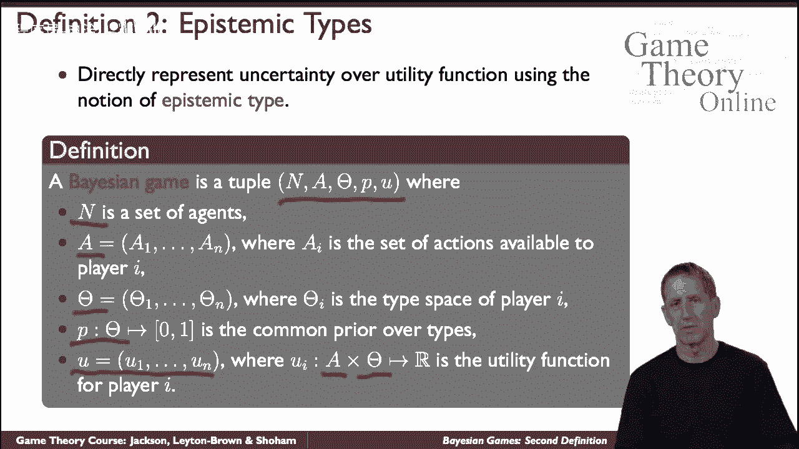
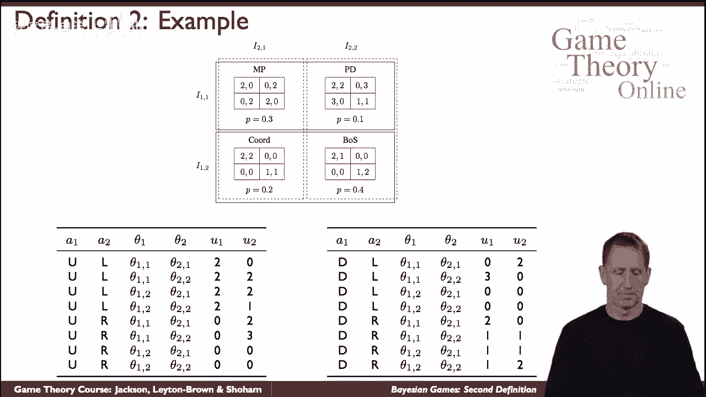

# 【斯坦福大学】博弈论 （全） - P45：【斯坦福大学】博弈论（44）贝叶斯博弈：第二个定义 - 自洽音梦 - BV1644y1D7dD

所以这里有一个贝叶斯博弈的替代定义，在数学上本质上是相同的。

它是基于类型或更完全的认知类型，代理的类型应该捕捉一切，那是特工的私人信息，所以如果你看看我们看到的视觉游戏的第一个定义，与注释前类型的确定性有关，那么特工的类型是她的私人信号，这是所选游戏的信息集。

谎言以及由此产生的一切，即她对其他代理人可能信息的信念，以及其他特工关于她自己的信息，以此类推，所有这些都被折叠到类型的概念中，所以这在数学上是非常方便的，将所有这些信息打包到一个类型中，正式地说。

那么贝叶斯对策定义如下，是这样的，我们有一组探员，我们有代理可用的行动，所以现在我们没有成套的游戏，我们有非常直接的行动可供代理人使用，现在我们有了关心的类型抽象数学对象，捕获代理的私人信息。

所以我们对每个探员都有一个类型，我们有一个共同的先驱者，就像游戏的第一个定义一样，我们有一个共同的先驱者，但现在游戏还没有结束，已经超过类型了，所以代理，每个特工都有，先验是常见的。

类型是根据所有代理都知道的概率分布来选择的，每个特工都知道自己的类型，因此他们也有一个关于其他代理人类型的后验和关于什么的信念，其他特工可能会相信，关于他们自己的类型等等，等等，这是代理的类型。

我们现在有了效用函数，嗯，不仅取决于代理人采取的行动，而是他们的，这又是正式的定义，从数学上来说，在某种意义上，非常简单，但直觉很复杂，因为类型的概念包含了很多东西。

所以让我们看看它的行动，当我们再次讨论游戏的第一个定义时，我们看到的这个游戏，我们选择了四种可能的游戏，但本质上是随机的，根据这个先验，我们抱着，我们收到了私人信号信息显示特工们发现自己在这里。

是这方面的类型透视图吗，那么代理可以采取什么行动，很简单，行代理具有向上或向下，呃，行动行动，还有呃，列代理具有从左到右的操作，回报，然而，这将取决于它们的类型，所以让我们让我们看看，比如说。

这里发生了什么，那么当代理，行代理发挥了作用，列播放器发挥了良好的作用，这取决于代理的类型是否是这种，是什么类型的，类型现在与他们拥有的信息相对应，第二个玩家的类型是这样的，好吧，道路是什么。

那么路径现在对应于这个单元格，就在那里，当他们上场比赛离开时会发生什么，所以你得到和零，当类型是原样的时候，让我们在这里随机举一些其他的例子，让我们清理滑梯，让我们举一些其他的例子来清理幻灯片。

让我们看看，例如在向下，嗯，什么是，什么是，什么，什么是，有哪些类型，所以类型是SIG，是这个吗，所以这个，这是第一个代理可用的信息，第二个探员有这个信息，这意味着这里是正在玩的游戏。

DL D是什么意思，我们正在淡化和离开，所以应该是这个，因此，回报将相应地为零和零，所以您可以查看其他示例，并弄清楚基于类型的公式意味着什么，在这里随便排一排，弄清楚为什么排是这样的。

在我们继续分析之前，最后要说的是，在这个特殊的例子中，通过固定类型，你最终得到了一个非常具体的，呃，游戏，这是一个复杂的话题，事实上，如果你想把它映射到游戏的不确定性，你可能没有一个独特的游戏。

你需要看看游戏的集合和那里的期望，但我只是把这个作为一个话题，我们所讨论的会给你一个很好的处理，论贝叶斯对策的两种公式，游戏列表中的显式和它们的共同优先顺序，和代理的分区结构。

