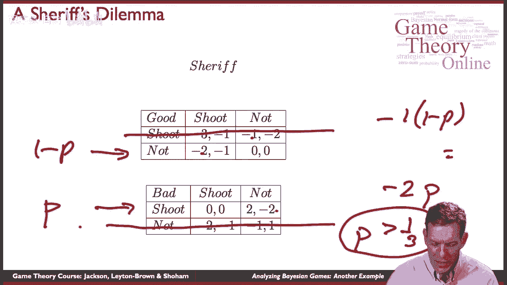
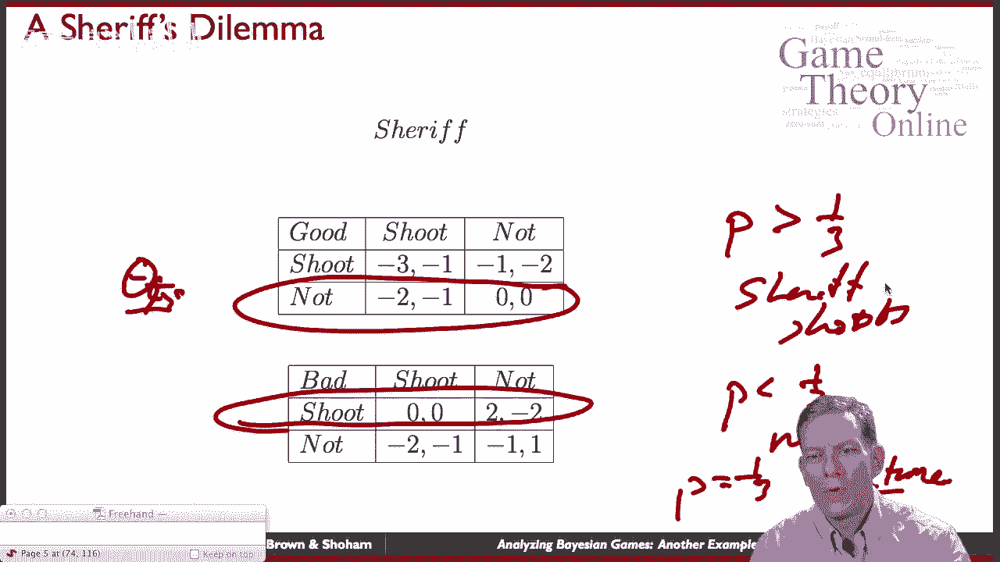
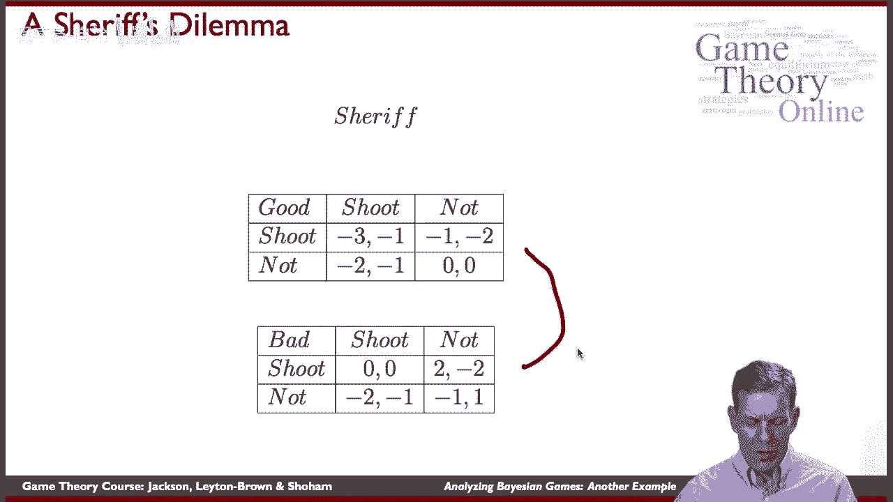
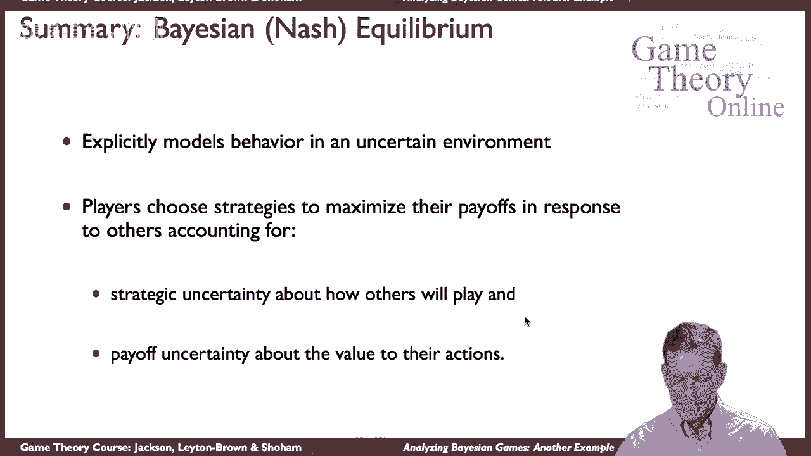

# 【斯坦福大学】博弈论 （全） - P47：【斯坦福大学】博弈论（46）贝叶斯博弈分析样例 - 自洽音梦 - BV1644y1D7dD

嗨，伙计们，我是马特，在这里告诉你更多关于贝叶斯游戏的知识，所以我们要看一个快速的例子，只是为了说明一些概念，至少在一个简单的例子中可以看到，你会怎么想解决这些游戏中的一个，在课程的后期。

我们会更多地讨论拍卖，这样你就有机会看看，也看看一些拍卖，嗯好吧，呃，贝叶斯，纳什均衡，它又做了什么，它对每个玩家都有一个行动计划，所以我们有他们要做什么作为他们信息的函数，他们的类型。

它最大化了你的预期效用，期待他们认为其他球员会做什么，并期待其他球员的类型，这可能会影响他们的回报。

让我们看一个非常简单的例子，所以这是一个好莱坞风格的例子，所以我们称之为治安官的困境，所以这是一个非常简单的场景，你有一个警长，他们面对的是一个武装嫌疑人，嗯，想象一下他们都拔出了枪。

他们手里拿着枪站在那里互相凝视着，他们必须决定是否向另一个开枪，嗯和我们，你知道我们可以在狂野的西部做这个，等，但这个想法是你你面临着这个困境，你到底拍不拍，当你面对持枪嫌疑犯的时候，在这种情况下。

让我们假设嫌疑人要么是罪犯，概率为p或不为p，概率为1减p，所以要么他们犯了什么罪，或者他们是无辜的，尤其是当我们想到这一点时，警长宁愿不开枪，嗯，如果嫌疑犯要开枪，他宁愿开枪，所以如果你要被枪击。

你想为自己辩护，嗯，但如果嫌疑人不是，你宁愿不开枪，不管是不是罪犯，你不想开枪打那个人，如果他们不开枪打你，如果是罪犯，你宁愿把他们送进监狱，如果是无辜的人，你宁愿根本不开枪打他们，嗯。

所以警长宁愿不开枪，如果，如果嫌疑犯没有，但会为自己辩护，罪犯宁愿开枪，即使警长没有，所以这是一种情况，如果他们，他们会意识到他们会被抓住，如果他们不开枪，嗯，所以他们，他们会想要拍摄。

嫌疑人宁愿不开枪，即使警长向他们开枪，因为他们意识到如果警长开枪，他们会死的，也许他们宁愿不开枪，也不愿因枪杀警长而被铭记。

所以说，所以这就是，游戏的设置很简单，嗯，让我们来看看可能的收益，这个的结构，所以让警长来做专栏，所以他们可以开枪也可以不开枪，在这里就代表性而言，我们可以想到有两种不同类型的球员。

有一个θ代表无辜的嫌疑犯，还有一个θ代表有罪的嫌疑犯，所以他们可能是坏人也可能是好人，然后呃，这是发生在，嗯，所以清白发生的概率是1-p，有罪的事情发生的概率是p，所以这个概率p。

你让这个有罪的人在无辜的人和治安官身上减去P，嗯，不知道个人是什么类型的，嫌疑犯没事，所以我们在这里得到了收益，收益反映了我们之前讨论过的基本结构，所以特别是，嗯，你知道如果你，如果你要被枪杀。

如果警长会被枪杀，他们会从射杀不在的人中得到更好的回报，无论哪种情况，他们都宁愿，你知道这是一个负回报，所以所以实际上，呃，如果你不开枪，他们就会开枪打你，这是一个糟糕的回报，你会被杀的。

如果你开枪还击，你最终可能会，伤害一个人，在这种情况下，你知道他们得到的是负回报，因为他们实际上是在枪杀一个无辜的人，无辜的个人，嗯等等，所以你知道，你知道的，不在这里对这些人来说是最好的回报。

当你看着一个罪犯的时候，罪犯个人，嗯再次，他们宁愿开枪，如果罪犯要开枪，嗯，他们，他们，在罪犯没有，他们会从抓住一个罪犯并把他们带走中获得一个回报，等等，所以我们可以看到收益，你可以更详细地研究这个。

然后问题是实际上会发生什么，就这个游戏的玩法而言，好的，所以我们能做的就是开始分析，好的，如果我们，如果我们面对的是好嫌疑犯，无辜的人，那他们要怎么做，让我们先试着计算一下嫌疑犯要做什么。

我们在这里看到的是，在这种特殊情况下，嫌疑人有条件，一旦他们看到自己的善良类型，那他们应该会在这里结束，他们得到负1的回报，如果他们零发，如果他们不，所以他们宁愿不在这里拍摄，他们得了负3分。

如果他们打出负2，如果他们不，所以我们最终采取了严格的主导策略，不开枪，如果你行的话，所以本质上，这告诉我们，如果我们在寻找贝叶斯均衡，优秀的选手，不管他们认为警长应该做什么，不应该射对。

这样我们就可以把这个划掉，说一个好玩家唯一可能的策略，他们不会开枪，好的，现在我们去找坏玩家，我们做一个类似的计算，基本上罪犯会在这种情况下开枪对吧，所以我们看0对-2，二对一。

一旦坏球员知道了他们的类型，他们就不会严格地控制投篮，所以这告诉我们要么是一个临时计划，或者即使我们回到x ante，试着弄清楚这些球员应该做什么，基本上好的不应该开枪坏的应该开枪。

现在我们得到了一个概率p，1减去p，我们想问，警长最好的回答是什么，好的，嗯，基本上如果他们开枪会发生什么，他们会得到什么，他们在这里得到零，警长在这里得到了一个负一，所以你得到负1次，一减p。

如果他们开枪如果他们不开枪，如果他们射得不好，他们会得到什么，他们在这里得到零，这里是负2，所以他们得到了负两倍，所以我们可以考虑情况，什么时候拍比较好，什么时候最好不要，你可以在这里检查。

如果p大于三分之一，对呀，所以如果你找到这两个完全相等的点，这将是p等于三分之一的点，如果p大于三分之一，那你更有可能在下面，你更有可能想开枪，如果p小于三分之一，那你就不想这样了，取决于p是多少。

你会有贝叶斯均衡，所以这个博弈的贝叶斯均衡是。

呃，的，好的类型，嗯还是对不起，天真无邪的那种，我猜，呃，有罪的人最终应该开枪，然后警长，如果p大于三分之一，警长开枪，p小于三分之一，他们没有，对于p等于三分之一，任何混合物，为了警长。

警长可以抛硬币，他们对拍摄完全漠不关心，不是一个P正好是三分之一，所以我们有一个贝叶斯均衡，在这种情况下，贝叶斯均衡将是唯一的，只要p不是三分之一，它就会是唯一的。

他们是否决定开枪取决于他们的回报是什么。

所以这个例子说明了一件事，这是一个相当简单的例子，但它仍然抓住了贝叶斯均衡的基本要素，怎么这么好，有几件事发生了，首先，两个参与者的收益取决于类型，所以无论警长从枪击中获得的回报是高还是低。

它到底是如何工作的取决于，他们面对的是一个好的或坏的嫌疑犯，这也决定了另一个玩家的策略，因此，对于另一个参与者将做什么，既有战略上的不确定性，这取决于状态，有回报，对治安官来说。

最好的事情是基于州的不确定性，把这两件事放在一起，我们解决，我们得到一个贝叶斯均衡，我们最终做出预测，好的，所以这是一个简单的游戏，嗯，但你知道，它会捕捉到很多东西。

就玩家如何在不确定的环境中做出决定而言，贝叶斯均衡使我们离应用更近了一步，在现实世界中的很多很多游戏中，你不确定收益会是多少，其他玩家会怎么做。

贝叶斯纳什均衡概述，我们得到了什么，它是，它是一个在某些环境中显式捕获的模型，玩家再次选择策略，均衡概念，所以你在最大化你的收益，以应对其他人将如何玩耍的不确定性，不同行为的收益是什么。

所以它是一个非常强大的工具，有很多应用程序，其中一些我们会在一些附加的讲座中看到。

