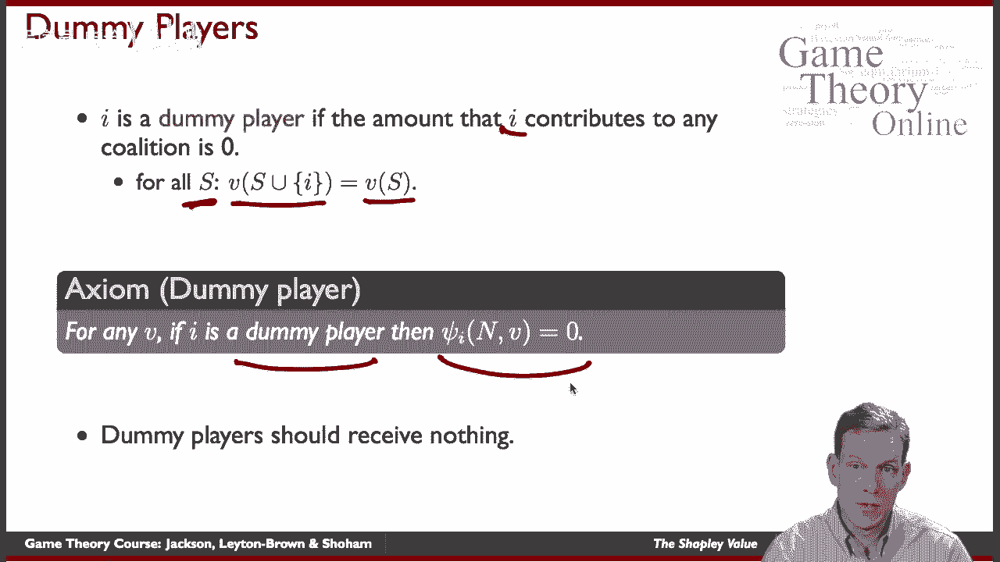
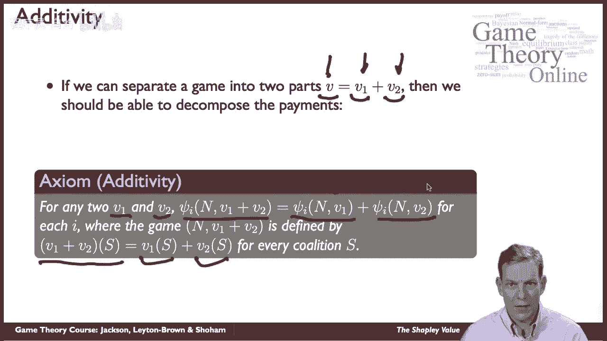
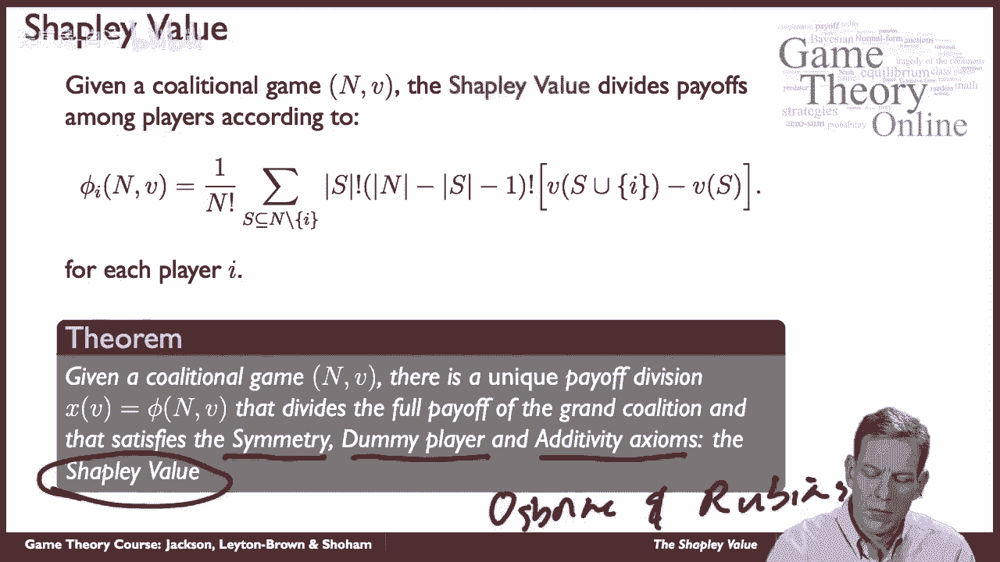
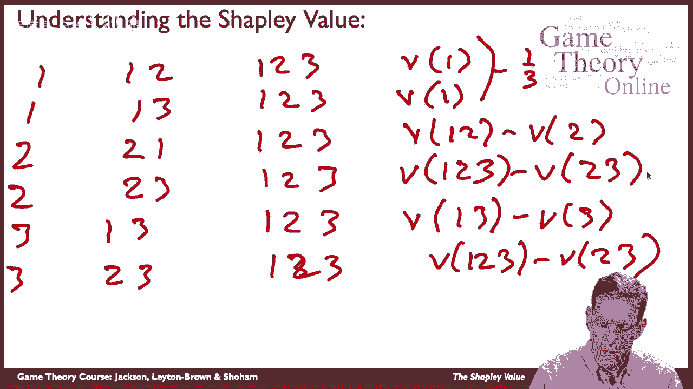
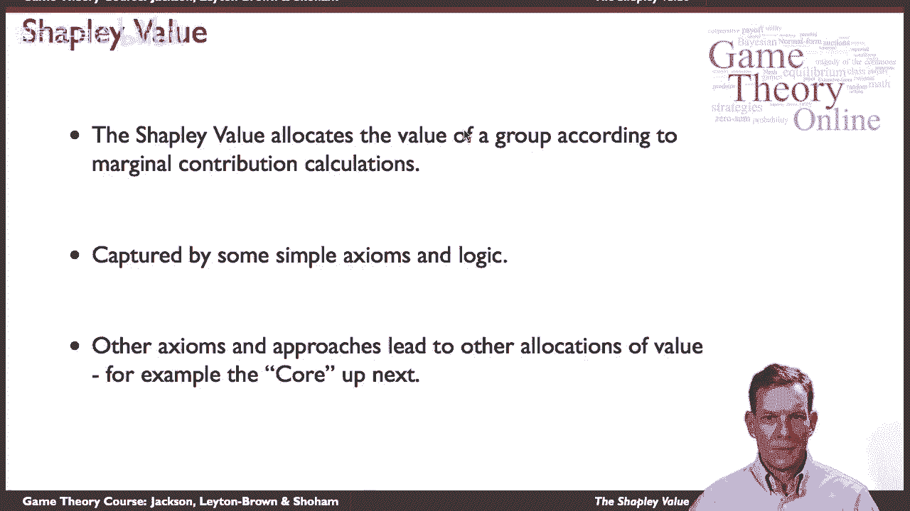

# P50：【斯坦福大学】博弈论（49）公平实现效用分配的方法：夏普里值 - 自洽音梦 - BV1644y1D7dD

嗨，伙计们，又是马特，我现在要告诉你们一点沙普利值，这是划分一个社会价值的最突出的方式之一，其成员中某些个体的生产价值，你知道联盟或合作游戏的基本思想，就试图弄清楚。

分配价值就是对正确的做事方式有一些概念，我们甚至可以用引号说，说，一个联盟分配其收益的公平方式是什么，这显然将取决于我们对公平的定义，然后呃，你知道的，文学基本上采取了，以公理为主要表达方式，嗯。

什么的性质，呃，所需的性质是划分事物的规则，所以我们要做的，然后有一些我们想要满足的公理或性质，然后看看这给了我们什么，嗯，沙普利值，呃，IS是基于劳埃德，Chaplay的想法。

即成员基本上应该接受东西，与他们的边际贡献成正比，好的，所以基本上你看什么，当我们把一个人添加到一个组中时，他会添加什么，他们应该得到一些反映他们对社会附加值的东西，好的，那么这个有什么棘手的地方呢。

让我们举一个简单的例子，这会让我们知道为什么，1。我们做这件事时一定要非常小心，所以让我们假设一个社会中的每个人都可以产生一个，但如果我们缺少任何社会成员，我们得到零分，所以这是说。

所以如果它缺少任何成员，它不能让它决定任何事情，所以在这种情况下，我们该怎么办，所以我们有，你知道的，n的v等于1，s的v为零，如果我们看任何小于n的s，所以在这种情况下，呃，什么是真的，那么边际贡献。

如果我们把这个群体中的任何一个人，他们的边际贡献是一项权利，所以每个人都是产生这个的关键，所以每个人对代码的边际贡献，没有他们的社会是一个，在这种情况下。

我们不能向每个人支付他们在领导方面所负责任的工资，最终到大联盟，所以我们将不得不考虑一些加权贡献的方法，为了，想出一个合理的东西，和，很明显，因为这个特殊的规则是合理的，把事情加起来是n的1。

所以每个人都得到他们贡献的一端，但在规则中，在可能存在一些不对称不对称的情况下，就谁贡献了哪个价值而言，我们将不得不相当仔细地考虑如何加权，好的，所以谢伊的公理将给我们一个处理这个问题的方法。

所以让我们来看看那些，嗯，所以第一个想法很简单，在这种情况下，你会想到的任何规则都是，会满足，所以如果我们想到一个社会的两个不同成员，说i和j，如果他们为每一个可能的联盟贡献同样的东西。

他们可以成为其中的一员，它们是完全可以互换的，所以如果我们看到一个既没有i也没有j的联盟，如果我们把I加入那个联盟，我们得到的值与我们在这个联盟中加上j时得到的值完全相同，如果它们是可以互换的。

那么他们应该得到相同的价值分配，所以如果PSI是，我们在瓜分一些联合博弈的价值，那么我们应该给i和j同样的东西，当它们完全可以互换的时候，好的，这是一个相当没有争议的公理，嗯它。

它确实抓住了公平的基本概念，如果你知道，如果个体完全等价。

他们应该得到同等的报酬，好的，下一个公理，假人玩家，所以我相信每个人都有和这样的人在一起的经历，有什么想法，有一种情况，你把一个人加入联盟，他们绝对没有添加任何东西，所以，不管我们看什么。

如果我们把i加到一个特定的s上，我们得到与这种情况相同的值，没有那个人，所以基本上这个人完全一文不值，不管我们在看什么联盟，嗯，所以这个想法是，那么公理是，如果一个人是假玩家，那我们就什么都不给他们。

嗯现在，你知道这是一方面，这是一个相当合理的公理，如果某人什么也没贡献，他们没有理由得到任何东西，另一方面，这在很大程度上取决于你的观点，所以如果我们考虑一个社会，3。可能是由于种种原因。

我没有做出任何贡献，所以发生了一些事情，他们出了意外，或者由于某种特殊原因，它们无法工作，社会可能仍然想分配一些东西给这些人，所以这真的取决于时间视角，我们是否在考虑社会保险等等，但尽管如此。

这是一个相当直观的公理。

这将是一个相当强大的，呃，在它所提供的东西中，下一个是可加性，这是一个你可能会想到更多关于分配价值的过程，所以让我们假设我们可以考虑一个合作博弈，或者联盟游戏，我们可以，它很好地分为两个不同的部分。

所以我们可以把它看作是你有一个，合作博弈，你还有一个，然后我们想，当你把这两件事加在一起时，你会得到什么，这个想法是，如果我们看两个不同的合作博弈，然后我们思考会发生什么，如果你试图分配一些东西。

当你总结它们时，你应该从分配一个中得到同样的东西，根据第二个分配，然后把这两件事加起来，所以这里的想法是，如果我们在看一个合作博弈，任何联盟的价值都是在第一场比赛中得到的，加上它在第二场比赛下得到的。

那么我们分配价值的方式应该是我们在第一个博弈中分配东西的方式，加上我们在第二个游戏下是如何分配东西的，所以你知道这是一个，就它的含义而言，这是相当明显的，从数学上来说，你如何解释这个故事。

为什么你可能想要满足这样的AOM，那有点难，你可以把这看作是一个故事，你知道的，也许有一天社会会根据V一产生，第二天根据V2，如果它产生的东西，第二天不取决于第一天产生了什么。

那么我们应该我们应该能够分配，呃，第一天的劳动成果，因为它们根本不相互作用，我们应该可以分开做，一个人得到的只是这两件事的总和，这样你就可以，你知道的，为这种公理想一个相当合乎逻辑的故事。

好的，那么我们从这三个公理中得到了什么，嗯沙普利值，让我们看看你是如何定义Shapley值的，所以价值，Shapley值将是边际计算，什么是个人，当我们添加i时，我添加到没有i的联盟中。

所以我们在里面有我的联盟，没有我的联盟，我们然后看看这产生了多少，然后我们要做的是称重，通过不同可能的方式，我们可以得出这个边际计算，然后用我们可以做到的所有可能的方法来划分，好的。

所以我们要确保我们平均所有这些东西，这样所有的东西都加起来就是全部的价值，好的，这是沙普利值，我们一会儿将更详细地剖析这一点。

定理是什么，定理是，如果我们看一个联盟博弈或合作博弈，有一个独特的方式啊，瓜分了大联盟的全部收益，所以如果我们要确保我们把所有的东西都分了，满足，对称性，假人和添加剂，所以如果你把这三个公理放在一起。

只有一个办法，这样就是Shapley值，所以有一种独特的A波确实满足了这些，它是沙普利值，所以这是一个相当强大的定理，有一个相当优雅的证据证明这一点，嗯，它是，我们不打算详细讨论这个问题。

但我们会对此进行一些解释，你可以很容易地找到证据，在许多不同的地方，实际上有一本奥斯本的好书。

它是免费的在线，它有证据证明这一点，但是有很多地方你可以找到这个，好的，让我们看看实际价值，就这是如何分解的而言，然后我们看一些例子，所以我给的个人是，根据这个公式看起来有点令人望而生畏。

但直觉相当简单，所以让我们认为我们在考虑边际贡献，他们进展如何？嗯，所以我们要做的是，我们将考虑所有不同的可能的方法，我们可以建立社会，例如，我们可以通过首先增加一个人来建设社会，然后加人说三。

然后加上人二对，所以我们可以这将是一个秩序，在这个秩序中，我们可以建立一个社会，嗯，我们也可以通过首先增加第二个人来建立它，然后加上第三个人，嗯，比任何人都有权利，所以有一系列不同的方法。

如果我们有一个三人社会，我们可以建立这些东西，在每种情况下，根据这些顺序中的每一个，都会有不同的集合，一路上不同的边际贡献，所以在这里，第一个人贡献了一些东西，然后第三个人加入他们的制作。

和人添加他们的生产等等，所以我们最终得到了这些不同的贡献，这就是这将捕捉到的，所以我们要做的是观察这些不同的序列，我们要做的第一部分是计算，当我们沿着序列前进时。

我加了什么，当它们被添加到，接下来我们用不同的方法来衡量，呃，在我去之前就建立了联盟，我们也按不同的顺序等待，我们可以添加不同的方式，还没有添加的个人，在我被添加后，所以有很多人，减去已经在。

S减去我嗯，所以这是还剩下的人的方式，事实上，把它带到阶乘上，给出了我们有多少不同的顺序。

我们还可以把人加进去，所以我们以此加权，然后我们把所有可能的组合加起来，呃，在我之前就有的联盟，然后我们除以不同顺序的总数，我们可以在一个社会中超越人们，好的，所以这是我们看重的镜头，嗯。

就再次理解这一点而言，我们能想到的，就，我们分裂社会的方式，我们可以想到，你知道，先加人一个，然后一二一二三我们可以先加一个，然后三一二三，我们可以先加两个，然后呢，三个第一，然后两个三个，以此类推。

所以我们可以用一系列不同的顺序来做这件事，所以有六个这样的权利，六种不同的订单，所以，例如，如果我们想知道一个人添加了什么人，当我们把它们加起来的时候，在第一种情况下，这是V三分之一的情况。

他们在添加什么，他们在加v 1 2减去v 2，那已经在那里了，第三个案子他们得到了一二的v，三减去二三的v，那是第四例了，第五例，嗯，我们得到一三减三的v，嗯等等对吧，所以我们到了这里，一二的v。

三减去二三的v，好的，那是沙普利值，所以这些东西的重量都是六分之一，嗯，在这里，结果是得到总重量的三分之一，嗯，在这里，我们会得到三分之一的重量。

然后这两个每一个都有一个6的重量向右，所以这给了我们Shapley值的总价值。

这告诉我们在这种情况下应该找什么样的人，嗯，你知道的，让我们看一个简单的例子，只要两个人，试着弄清楚沙普利值到底是多少，所以这是两个人，他们结成伙伴关系，所以只有一个人在生产一个。

第二个人产生了两个人的产量，他们说，哇哦，让我们聚在一起，结成伙伴关系，我们可以做得更好，单独，它们产生的总价值为4，所以这是一个很好的超级添加剂，当我们把两者结合在一起时，我们得到了更高的价值。

现在他们在最后他们试着说，好的，嗯，我们该怎么把这四个人分给他们呢，嗯，在这种情况下，我们可以先加一个，然后一个想出一个二，另一种可能是我们先得到两个，然后得到一个2。

所以我们只有两种不同的方法可以建立社会，所以第一个人，如果我们想知道该给某人什么，在这里他们会得到V一正确，也就是这里的1他们会得到，他们添加的边际贡献，如果他们加第二个，这是边际贡献。

如果他们一开始是，嗯，这个值是多少，此值为2，每一个都有一个重量，最终的一半，因为我们有两个这样的东西，所以我们加了一个的一半，二分之一，1。我们得到一块五等于一，你可以通过，你可以检查2。

5美元那就等于2美元，我们得到的结果是什么沙普利值给了我们，如果这些是，人们所做的贡献，你最终会得到1。5分，作为给人一个的正确金额，两块五给二号人，好的，所以在这种情况下，他们每个人都得到了一些价值。

这取决于，所以它考虑到了这些值在，试图把四个分开，所以他们不只是说，好的，让我们平分四五五，嗯，他们是，他们在做不同的计算。

出来的时候是1分5秒2分5秒，在这种情况下，好的，那么Shapley值呢，它根据边际计算分配一组的价值，它被一些非常简单的逻辑和公理所捕获，嗯，你可以做的是你可以想到其他公理，你可以想别的办法。

其他公平理念，或其他你希望你的规则满足的事情，这将会出现并做出不同类型的预测，接下来我们来看看核心，这是另一个，它使用了一种不同于Shapley值的逻辑，为了做出预测。

