# P11：CS 182- Lecture 4- Part 1- Optimization - 爱可可-爱生活 - BV1PK4y1U751

欢迎来到今天的课程四，我们将讨论优化算法，我们将比以前更深入地研究它。

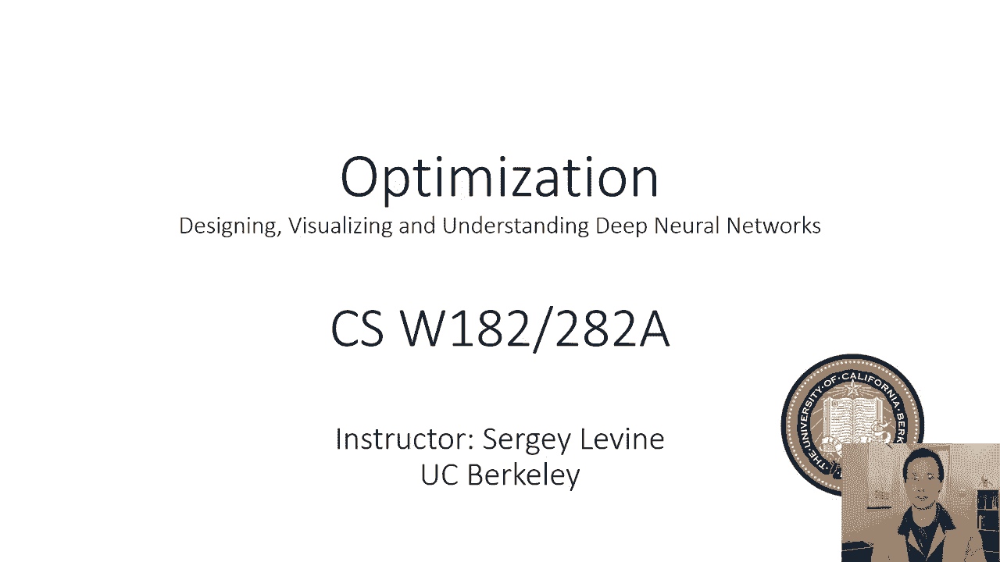

当我们在第二讲第一次讨论Logistic回归的梯度下降时，所以首先让我们从梯度下降的回顾开始，所以我们有损失函数，我们在第二讲学到了，一个很好的损失函数是负对数似然，这就是我在这里写的，但一般来说。

你可以使用任何你想要的损失函数，我们将用字母l来表示损失函数，它是我们参数的函数，假设θ是二维的，所以我们要学两个数字，我们可以这样可视化我们的损失函数，所以我们可以把它想象成一个图形。

其中两个水平轴是θ的二维，垂直轴是损失，所以你可以想象这张照片基本上代表了损失的景观，它表示θ的l的函数，如果我们在某个时候开始，呃，在这张图中，在θ1和θ2的某个值上，由这里的黑色圆圈表示。

找到θ1和θ2最佳设置的方法之一，使θ的l最小的那个，就是找出一个我们可以前进的方向，用这个箭头表示，它将减少θ的l，所以我们可以找出一个指向它的方向，呃，图上的极小点，我们朝着那个方向前进。

那么我们就会提高我们的价值，并希望最终收敛到尽可能好的价值，所以向一个特定的方向移动只是意味着，求lθ减小的方向，然后把θ设为原来的θ+v乘以某个小常数α，这个小常数被称为学习速率或步长，直觉上。

它表示你向v方向移动的速度，你不想动作太快，因为如果你用一个非常大的alpha，你实际上会超过最低点，你会从另一边出来，对呀，想象一下我在照片中的箭头，如果那支箭再长十倍，它实际上会下到底部。

然后一路回到另一边，很可能降落在一个比它开始的地方L值更高的地方，所以你想用一个小常数。

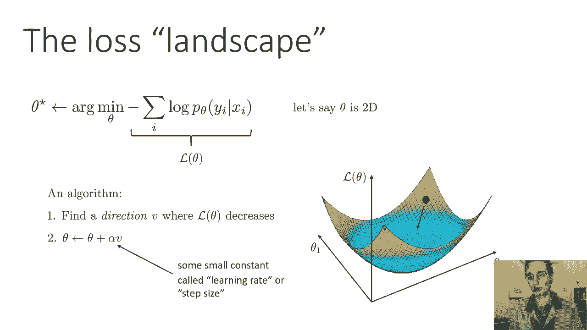

那么我们如何选择前进的方向呢，也许在一维中得到一些直觉是最容易的，假设θ是一维的，这是我们的图表，如果我们位于这个特定的点，我们可以计算出图形的斜率，如果斜率为负，然后我们往右边，如果斜率为正。

然后我们往左边往右边，这将使我们更接近最小值，一般情况下，如果我们有一个多元函数，然后我们简单地对每个维度单独使用这个过程，我们怎么知道斜坡在哪里找到斜坡，我们要做的就是计算导数，所以在更高的维度上。

我们可以做的是，对于每个维度，沿着该维度的斜率相反的方向，斜率是通过导数得到的，该维的偏导数，所以v 1会被设置为l的偏导数的负值，相对于θ1，将v 2设为l的偏导数的负值，关于θ2，现在一般情况下。

我们可以取所有这些偏导数，并将它们堆叠成一个向量，所以我们可以构造一个向量，其中第一个条目是dl dθ1，第二个条目是dl dθ2，等，这个向量叫做梯度，所以梯度只是用来指向量的术语。

由关于θ的每一维的偏导数组成，这个向量的维数和θ的维数是一样的。

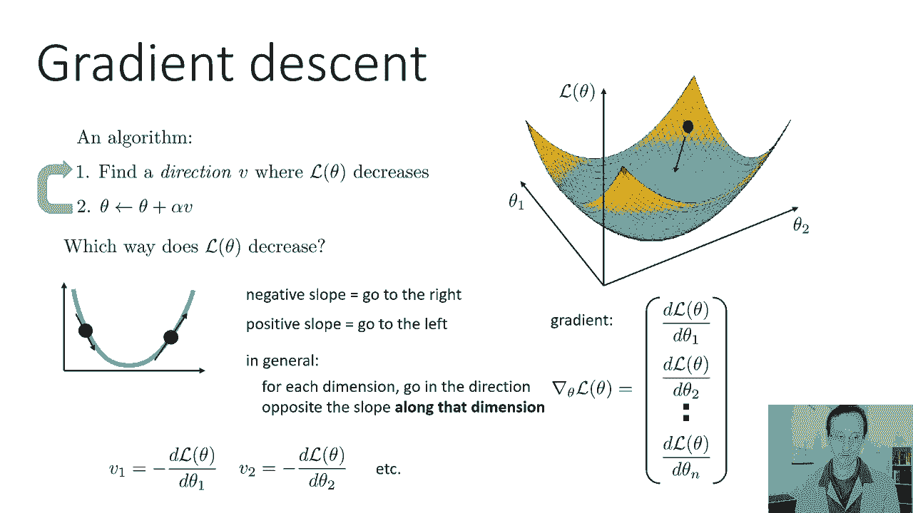

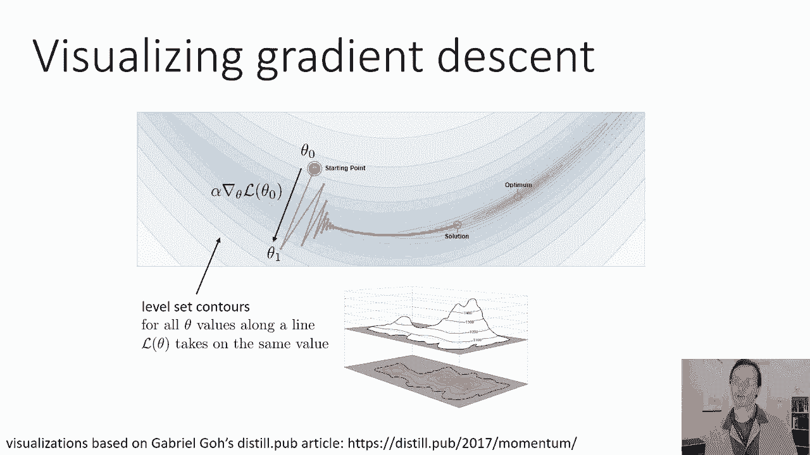

当然还有，以防不明显。

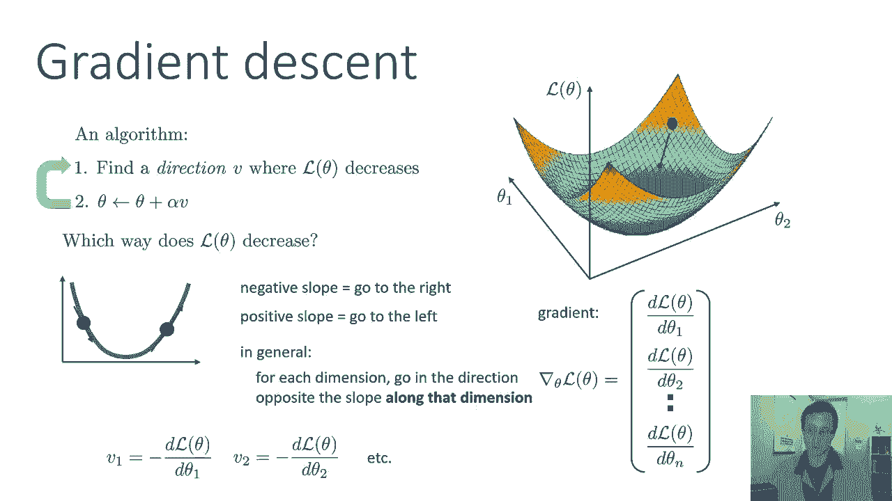

你只要把v设为梯度的负值，在今天的讲座中，我们将详细讨论，呃，梯度下降起作用的情况，它工作不力的情况以及我们如何改进它，我们会看到很多很多梯度下降的图片，被形象化，我们会经常看到的一种图片是等高线图。

所以在这个呃，等高线图，线条对应于水平集等高线，所以对于沿着这些等高线的所有θ值，θ的l具有相同的值，这很像地图上的高程图，所以如果你想象一下看一些山的地图，你会看到这些等高线。

这些等高线以同样的方式代表等高程的线，在这些梯度下降的地块中，这些线对应于Lθ等值的线，我们将用直线可视化梯度下降的优化路径，所以每一个都有一个点，每个线段的每个端点表示θ的一个值。

在梯度下降的一次迭代上，这些点之间的线段表示步骤，然后这个台阶，当然啦，是梯度方向乘以学习速率alpha，好的，所以这是一个梯度下降的可视化。

我们会看到很多这样的可视化，让我们看看梯度下降的演示，所以在这里看这张照片，我们可以看出这是一个有两个参数的函数的优化，所以θ1和θ2，这里是一个大圆圈，橙色的大圆圈代表起点，较小的圆圈表示终点。

现在看这个函数，你可以看出这不是一个特别容易的函数，它有这种狭窄的山谷，所以如果你想象这是一张地形图，风景，它可能是一个峡谷，一条细长的峡谷，这是一件很难优化的事情，所以我要做的是，我要移动起点。

当我移动起点时，你可以看到渐变下降的步骤，它们计算得很快，所以这就是为什么它立即出现，梯度下降的台阶沿着山谷向下移动，然后它们逐渐沿着山谷移动，当我增加步长时，你可以看到他们会沿着山谷走得更远。

但随着步长变大，然后当你到达谷底的时候，你实际上跑上了另一边的斜坡，你最终向右摆动，所以你去了价值的底部，你超调了，在另一端来，然后回到另一边，所有的权利，所以我们从这个可视化中看到。

有许多挑战突然出现，当我们做梯度下降的时候，我们有一个振荡问题，我们从另一边上去，我们似乎也有一个问题，我们不能一直达到最佳状态，所以当我们沿着这个山谷旅行时，我们变得越来越慢，越来越慢。

我们实际上并没有达到确切的最低点。

那么这是怎么回事，并不总是朝着最佳梯度的方向移动，下降总是采取最陡峭的下降方向，但是最陡峭的下降方向，实际上不是直接走向微分点的那个，你可以在这张照片中看到我们从起点迈出的第一步，实际上正在远离最优右。

它正沿着山谷向下移动，但向下移动实际上使它离最佳状态更远，一般来说，梯度下降并不总是选择最好的方向，它选择最陡峭的方向，所以再想象一下这种功能，这是一个等高线图，所以每个圆或每个椭圆代表，呃。

等于lθ的点，所以你可以想象这是一个椭圆形的坑，最佳在中间，假设我们从这里开始，现在，最陡下降的方向总是垂直于切线，到水平集，所以如果在这样的照片中，你想知道最陡峭的下降方向是什么。

只要画一条与等高线相切的线，和那条线正交的箭头，将是最陡峭的下降方向，所以这是导数，这是渐变，如果我们朝那个方向走，我们最终会去山谷，也许从另一边出去一点，在这一点上，如果我们计算出最陡的下降方向。

我们走另一条路，然后最陡峭的方向会变成另一个方向以此类推，这正是我们在演示中看到的，给定无限梯度步长，最终这将达到最佳，但可能需要相当长的时间，所以最陡峭的方向并不总是最好的。

现在我们想知道有没有一种方法可以更好地计算出方向，有没有办法计算出一个走向最优的方向，而不仅仅是最陡下降的方向，我们稍后再讨论这个问题，实际上有一些方法可以计算更好的方向。

但首先让我们更好地理解梯度下降带来的挑战。

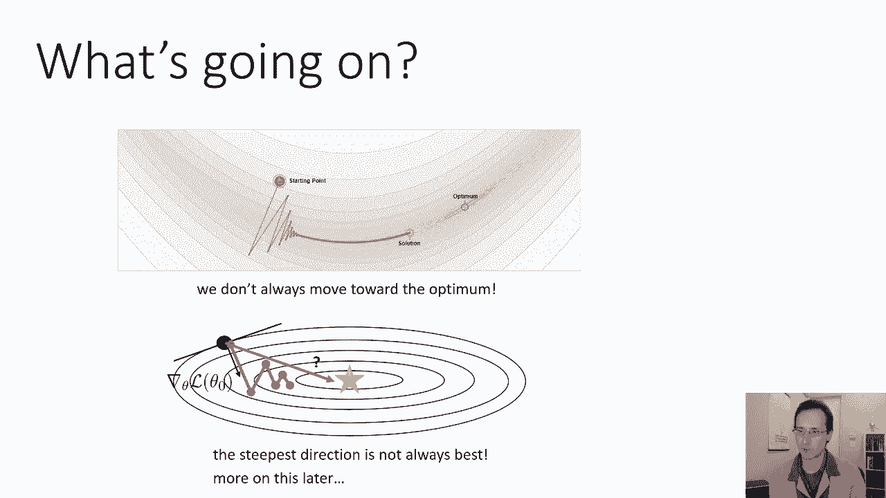

所以我在丢失的表面之前画的丢失的表面，当我们讨论逻辑回归时，它是一个非常好的损失面，现在，损失面非常好意味着什么，很好很好，基本上意味着梯度下降会很好地处理这个损失面，为什么呢，这个损失面有很多优点。

一个是它没有狭窄陡峭的山谷，所以从任何一点，如果你走最陡峭的下降方向，它会指向最佳的，在这片失落的土地上，条条大路通罗马，左下角丢失的风景不是这样，现在我们的损失函数实际上很好，如果我们在做机器学习。

我们的损失函数真的很好吗，我们在做逻辑回归，所以逻辑回归，这就是我们在第二课所讲的，这是一种分类方法，其中类的概率由软最大值给出，输入的线性函数，所以参数θ显示在指数中，在分子和分母中。

这是Logistic回归中Logistic概率的方程，我们取概率的对数，这就变成了我们的负对数似然损失，Logistic回归的负对数似然损失，保证是所谓的凸函数，凸函数通常很好。

这不是一个明显或琐碎的陈述，所以如果你学过，呃，凸优化，你可能会问自己，嗯，为什么逻辑回归是凸的，它它不明显，但有可能向节目展示它相当参与，我不会在这节课中证明这一点，但让我向你解释一下凸性是什么意思。

为什么凸函数，呃，往往优化得很好，所以这里有一个一维的函数，函数是凸的，如果该函数上任意两点之间的线段完全位于图的上方，意思是我取任意两点，我在他们之间划清界限，那条线将完全在图的上方，它不会与图相交。

相比之下，这个函数对于这个函数不是凸的，如果我在两点之间画一条线，它实际上会与图相交，它将与图相交，对于每一对点，存在一对点，你将，现在这个函数也碰巧有两个最优值，它有两个槽。

其中每一个都包含一个局部最优值，一般来说，即使函数只有一个最优值，它也可以是非凸的，所以这个函数有一种平台，它只有一个最优解，但因为那个高原，如果我在这两点之间画一条线，它实际上会拦截。

所以一个函数是凸的意味着它只有一个最优值，但是一个非凸的函数并不意味着它有多个，凸函数很好，在某种意义上，像梯度下降这样的简单算法对凸函数有很强的保证，有可能证明，凸函数上的梯度下降会找到全局最优。

在一些不太大的迭代中，在多次迭代中，多项式，这并不意味着梯度下降实际上对所有凸函数都有效，比如说，幻灯片左下角的函数也是凸的，但正如我们之前在那个函数中看到的，梯度下降将采取非常间接的路径达到最佳。

但是凸函数一般是。

你知道的，我们可以希望的更好的事情之一，现在神经网络丢失的表面呢，所以Logistic回归是一个相对简单的算法，我们将学习更多关于神经网络的知识，并在随后的讲座中学习，但为了今天讲座的目的，神经网络。

你知道是一个更复杂的函数，作为一个有许多参数的函数，多层表示，其次是具有更复杂数学操作的SoftMax，这些操作的精确定义将在后面的讲座中定义，很难想象神经网络的损失面，因为神经网络有非常多的参数。

所以你不能用两个参数来建立一个有意义的神经网络，因此，很难画出神经网络丢失的表面，但我们可以试一试，所以有一篇李等人的论文，叫做可视化神经网络的损失景观，它使用了一些巧妙的降维技巧。

试图大致可视化神经网络失去的景观，它可以被精确地可视化，因为它是一个更高维的物体，但通过一点点巧妙的降维，我们可以制作一些看起来，你知道的，有点现实，这至少给了我们一些关于发生了什么的直觉。

我们都想出了一个共振模型，在imagenet上没有跳过连接，这张照片是，现在把这张照片和我在上一张幻灯片上看到的美丽的失落风景进行比较，这东西看起来更糟，所以有当地的，这是你的全球最佳，和，嗯，是啊。

是啊，这是呃，有点糟糕，所以你有所有这些局部最优，如果这是一张中世纪的地图，会说这里有龙，对呀，那么这些是非常危险的地方，你可能会被困在那里，有很多平坦的大高原，你可以很快地走到那里，真的很慢。

非常不凸起，大量局部最优，很多复杂的特征，现在有些网络更好，这是一个带有跳过连接的Resnet模型，我们稍后会讨论什么是跳过连接，这看起来像是一个更好的失落景观，还是不太好，它还是有很多平坦的区域。

但至少它没有那么多的峭壁，和缝隙和讨厌的地方卡住，所以神经网络损失景观肯定不是凸的。

在一个失落的景观中，我们应该担心哪些地理特征，我想告诉你三个特点，重要的知识，一个是局部最优，另一个是高原，第三个是鞍点，有趣的是，这三个特征，我按照他们的知名度列出了他们，很多人都知道本地选择。

很少有人知道鞍点，奇怪的是，他们有多糟糕，尽管局部最优是最明显的问题，它实际上是最不糟糕的之一，尽管鞍点是最不明显的，它们也是最糟糕的事情之一。

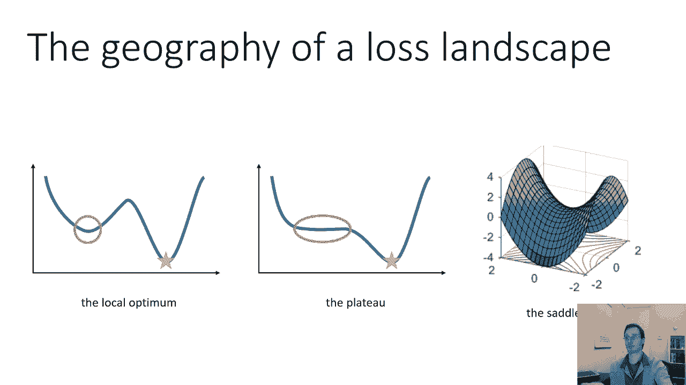

但让我们谈谈，呃，这些功能是什么，所以本地最佳，这是你们中的许多人可能已经知道的事情，这是非凸损失景观最明显的问题之一，也就是说，你可能有不止一个点，其中导数为零，所以在这些局部最优中的任何一个。

导数为零，这意味着没有改进的方向，无论如何，你在这个点附近的任何方式都只会增加你的损失价值，所以全局最小值是，呃，也是当地的最低限度，所以在全局最小值，任何一步都会增加你的损失价值，不过没关系。

因为你是最棒的，呃，它可能是，但是这个图中左边的局部最优也有这个性质，任何本地步骤都只会增加您的损失价值，导数都是零，这意味着梯度为零，你想不出改进的方向，所以这是人们过去担心神经网络的一个重要原因。

众所周知，神经网络具有非凸损失景观，因此它们必须具有局部最优，有理由担心，局部最优原则上是非常可怕的，因为梯度下降可以收敛于解，比全局最优值任意差，当你看导数时，你无法知道，你就是看不出这是全球最优的。

如果导数都为零，呃，你坐在峡谷底部，任何一步都只会增加你的损失，你不知道这是最好的观点还是第二好的观点，或者第一百个最佳点，它可能比全球最优值更糟糕，有点意外，对于非常大的神经网络来说。

局部光学实际上变得不那么重要了，这是一个已经在经验和理论上研究过的问题，这太令人惊讶了，很长一段时间以来，这对很多人来说都不是一件明显的事情，具有多参数的神经网络在其丢失的景观中肯定具有局部最优。

几乎任何合理的损失，这意味着似乎没有太多的局部最优，那里的损失比全球最优要严重得多，这不是又不是一件明显的事情，这其实有点令人惊讶，这是报纸上的一个情节，Germani在多层网络中丢失的表面。

让我解释一下这张图在横轴上显示的是什么，我们有损失价值，损失的数值为负对数似然，梯度下降发现的解的损失，这是一个直方图，所以垂直轴表示梯度下降的次数，每个人都从不同的随机位置出发，实现了损失。

所以它是在绘制导致损失的运行频率，不同的颜色代表不同大小的网络，所以这里更大的数字对应于更大的网络，有更多的参数，粗略地说，这些数字基本上直接缩放优化中的参数数，你可以看到，对于黄色显示的最小网络，嗯。

不同的损失值分布广泛，还是没那么宽，所有的数字都在零点零八和零点零一之间，所以这是一个相当小的范围，但有一些可变性，这意味着优化正陷入局部最优，具有一系列不同的损失值，但随着网络越来越大。

实现不同损耗的网络频率变得更加紧密，所以对于红色，最大的网络，你可以看到损失仍然有一些可变性，但是解决方案聚集得更密集，有点在呃的范围内，零点零七二和零点零七八，大致正确，所以这个范围。

你得到的不同局部最优值要低得多，你可以想象这种趋势会越来越远，随着网络越来越大，丢失值的范围越来越窄，这意味着他们确实有局部最优，但是这些局部最优值都非常相似，他们其实都很不错。

没有非常非常糟糕的局部最优，或者如果有的话，它们现在似乎很少见了，这是一个经验观察，这是从那以后的一些旧作品，也有相当多的理论分析，在这一点上，有相当有力的证据，大型神经网络的局部最优并没有那么糟糕。

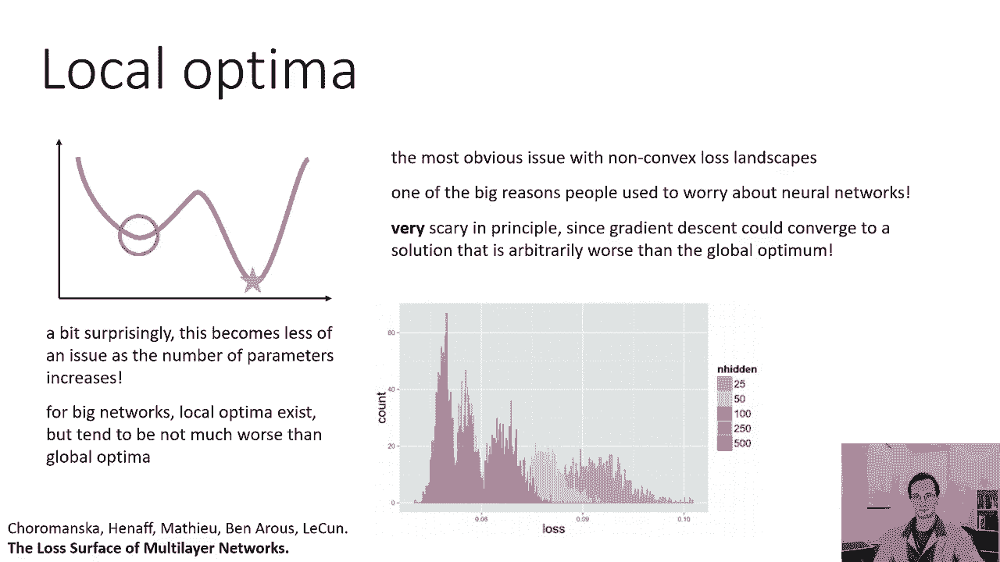

这是相当令人惊讶的，好的，高原，这个就不那么明显了，我们可以想象一个失落的风景，我们有一个局部最优，但我们有一个很大的区域，损失的梯度非常小，我们在峡谷底部看到了这样的东西，在演示之前对。

所以峡谷的两侧有非常陡峭的坡度，但当你到了底部，你有一个相当小的坡度，让你沿着峡谷走，所以高原实际上在神经网络损失景观中非常常见，你不能仅仅选择微小的学习速率来防止这种振荡，在值的底部。

因为如果你选择一个很小的学习速度，你要花很长时间才能穿过高原，这实际上是一个很大的问题，因为如果不是因为这些高原，你只使用很小的学习率，我们会缓慢而稳步地朝着最佳方向前进。

但是当这些高原真的很平坦的时候，小的学习率，可能意味着你要花很长时间才能穿过高原，所以你需要足够大的学习率，以免陷入平台，像这样，稍后我们将学习动量，这对解决这种问题很有帮助。

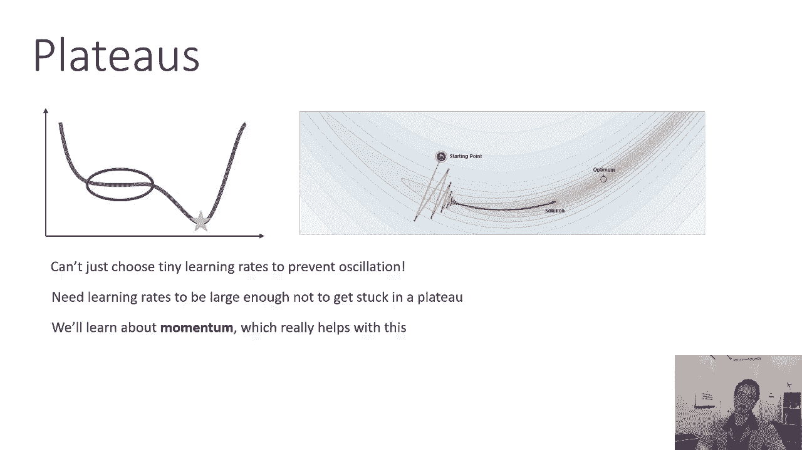

所以这是最后的高原，让我们来谈谈鞍点，鞍点对一维函数来说是不存在的，但是对于更高维的函数，鞍点实际上相当常见，所以鞍点是一个，你可以把它看作是一些维度上的局部最小值，而是沿其他维度的局部最大值，在鞍点。

关于函数各维的偏导数为零，但是函数在某些维度上是增加的，在其他维度上是减少的，所以一个二的鞍点的可视化，D函数显示在左边中间，我显示了一个表示梯度向量的抖动图，为了那个鞍点，所以他们有点难看到。

因为它们很小，但如果你看看蓝色的小箭头，当你远离鞍点，蓝色箭头做了正确的事情它们就像你想做的那样，你想向左还是向右，因为函数在那里增加，所以这个功能，呃，是我们的减少，所以一个函数左右递减。

它上上下下增加，所以当你远离鞍点时，蓝色箭头，它们向左弯曲或向右弯曲，这正是我们想看到的，但是当你靠近鞍点的时候，渐变消失，它们变得非常非常小，这意味着即使他们会，你最终会离开两边，你就会，你就会。

你会适当地优化功能，当你接近鞍点时，你在迈出这些非常微小的一步，就像一个非常糟糕的平台，所以右图上的绿线显示了梯度流，它们显示了你在梯度下降中遵循的轨迹，当它越来越接近鞍点时，梯度下降开始变得非常缓慢。

现在你可能会认为这是一个深奥的问题，喜欢好，有多大机会降落在坡度，呃，其中函数在某些方向上减少或增加，在其他方向上减少，似乎不太可能，非常随机，所以中间的纹路很小，需要很长时间才能摆脱鞍点。

这并不经常发生，事实上，是呀，这就是我们对函数的直觉，从思考低维，思考一个或两个维度实际上在两个维度上是非常误导的，像这样的鞍点似乎很深奥，这似乎不太可能，也很具体，但事实上。

神经网络损失景观中最关键的点是鞍点，这是因为在更高的维度中，事情的工作方式与它们在低维度中的工作方式不同。

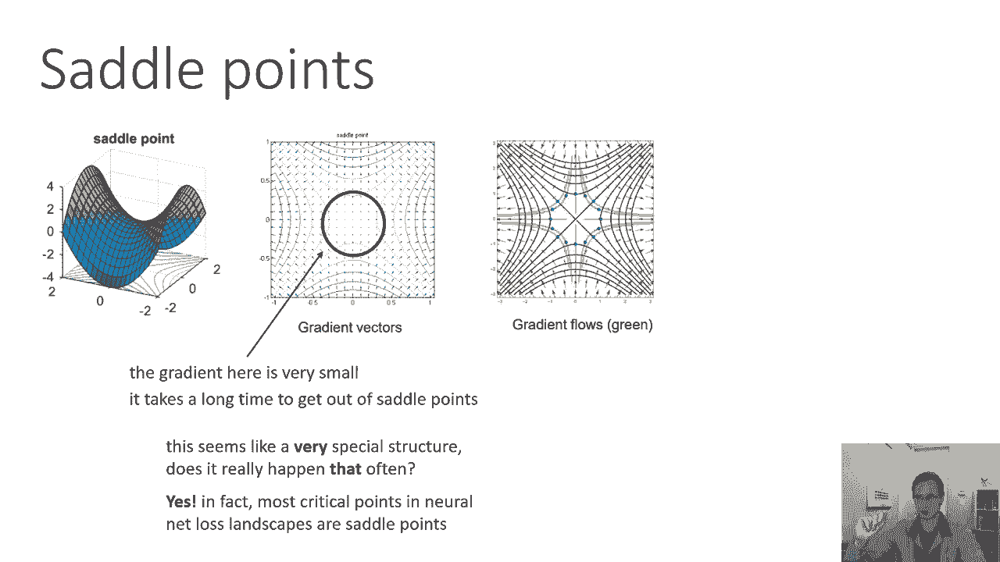

所以让我们，呃，让我们先多谈谈这个，什么是临界点，临界点是梯度为零的任何点，这意味着L关于θ的每一维的所有偏导数都为零，现在有不同类型的临界点，所以临界点是导数为零的点。

但你可以要求给定的临界点是在最大最小值或鞍点，嗯，你知道的方法是通过看二阶导数，所以在一维，如果你处于临界点，二阶导数为正，这意味着图形是向上倾斜的，这意味着你在当地的最小值，对呀。

所以如果你在当地最低限度的底部，导数为零，一阶导数，但是二阶导数是正的，因为你是，当你向右走时，你会向上弧形，如果二阶导数为负，那么这意味着你在一个局部最大值，当你向右移动时，图形会向下弧形。

但在更高的维度中，你可以有一些二阶导数是正的，一些是负的，一般来说，我们可以构造一个叫做黑森矩阵的矩阵，黑森矩阵基本上是梯度的二阶导数等价，所以梯度是一个向量，其中每个条目都是偏导数。

相对于theta的相应维数，黑森矩阵是一个矩阵，其中每个项都是二阶导数，关于theta中的两个条目，所以条目1是关于θ1和θ1的二阶导数，条目一二是关于θ一和θ二的偏导数，所以它只是一个二阶导数矩阵。

鞍点处的黑森矩阵将有，对角线项，对于某些维度是一个，对于其他维度是负的，例如，为了这个非常好的功能，黑森矩阵可能是一零零，负一，这意味着你有一个二阶导数，这是一个沿着其中一个维度是正的。

沿另一维的二阶导数为负，现在它不一定是对角线，它实际上不必在对角线外的条目上有零，条目不必是一个，这只是一个例子，现在，这只是一个最大值或最小值，所有的对角线条目都是正的或负的，或者一般情况下。

对于非对角矩阵，你会希望它是正定的或负定的，如果你不知道肯定的定义和否定的确定是什么意思，你就不知道，别担心，你可以考虑对角线黑森矩阵，就目前而言，这只是为了建立一些直觉。

现在想象一下在更高的维度会发生什么，在更高的维度上，哈希中有许多条目，所以不是两个两个，可能有一千，乘一千，你在对角线上有一千个不同的条目，所有这些条目都有相同的符号的情况会有多频繁，对呀。

所以对于一个二维函数，嗯，两者都是一个或都是否定的，一个似乎很有可能，事实上，它同样可能是一个最大值或最小值，因为如果他们是，如果条目只是随机的，但在更高的维度中似乎不太可能每一个对角线入口都是正的。

或者每一个对角线条目都是负的，所以在更高的维度中，大多数临界点实际上是鞍点，这实际上有点令人惊讶，如果你想想你从两个D函数得到的直觉，但在更高的维度，只是不太可能所有的条目都有相同的标志。

所以这就是为什么在更高的维度，大多数梯度为零的点实际上是鞍点。

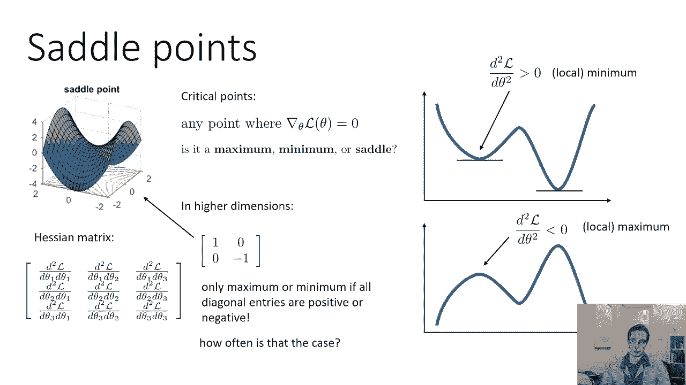

所以让我们谈谈我们应该往哪个方向走，当我们优化一个函数时，所以在我们谈论最陡峭的下降之前，这就是梯度下降的作用，但在这些复杂的神经网络损失景观中，我们不知何故需要我们的改进方向，带我们四处走走。

所有的龙和怪物，所有局部最优，所有的高原，扭动我们的方式，呃，达到最佳的权利，我们怎样才能做好呢，记住我们并不总是朝着最优的方向前进，如果我们选择最陡峭的下降方向，由于振荡，我们得到了各种各样的问题。

在这些值中，由于高原，由于鞍点，所以我们想要的是不要来回摆动，像这样，我们想找到一个更好的方向，一个更直接地走向最佳的。

