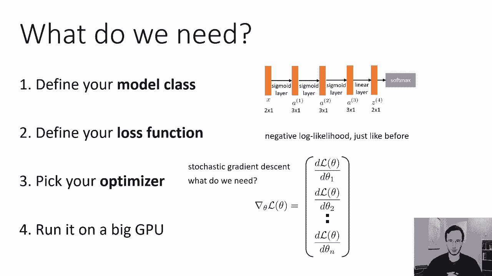
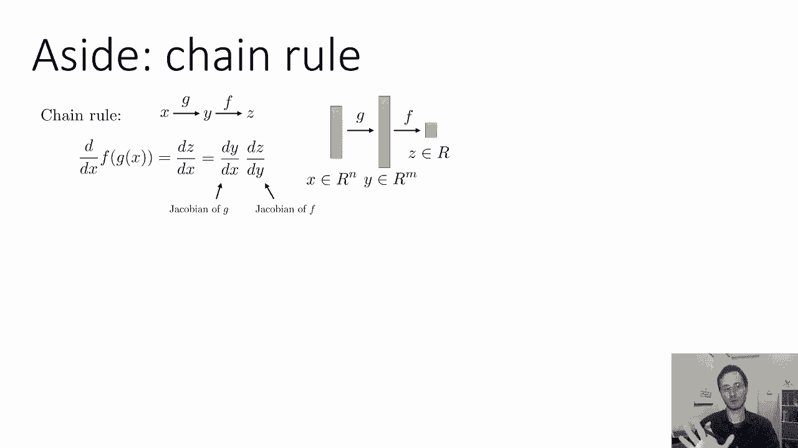
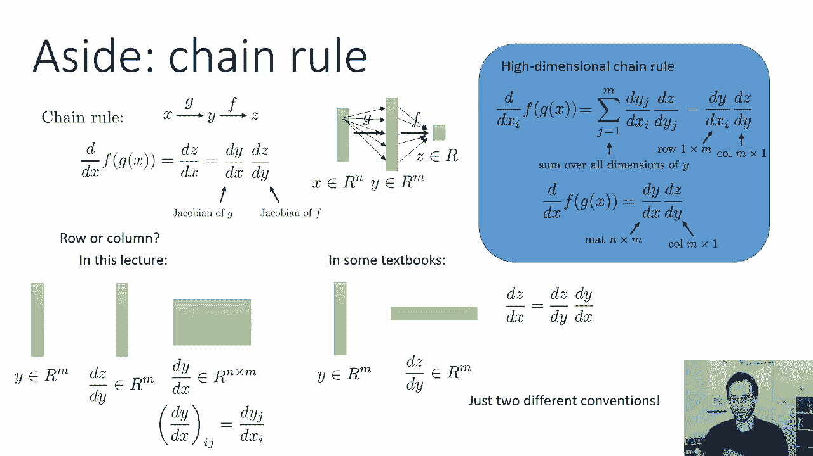
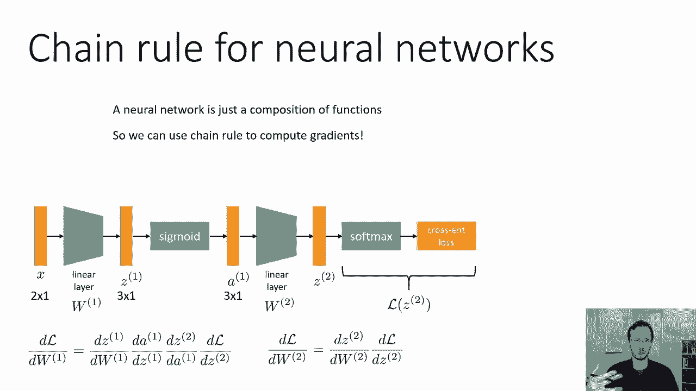
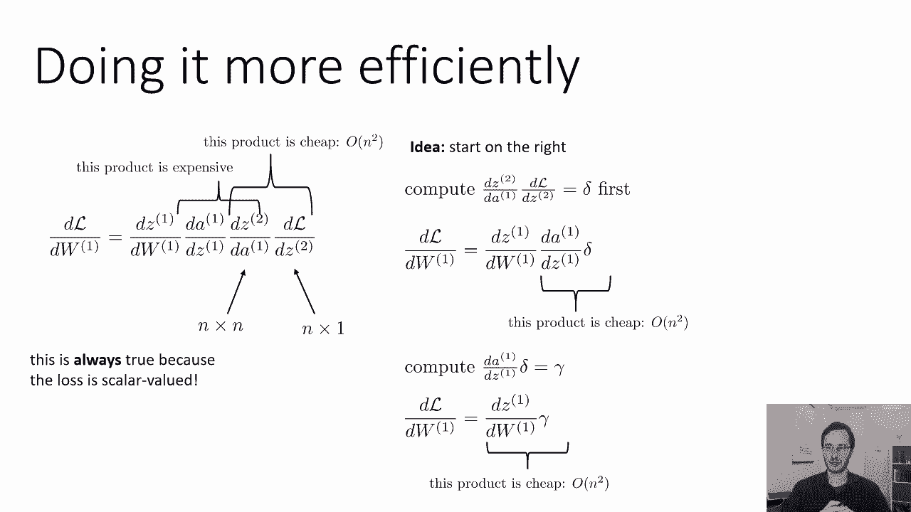
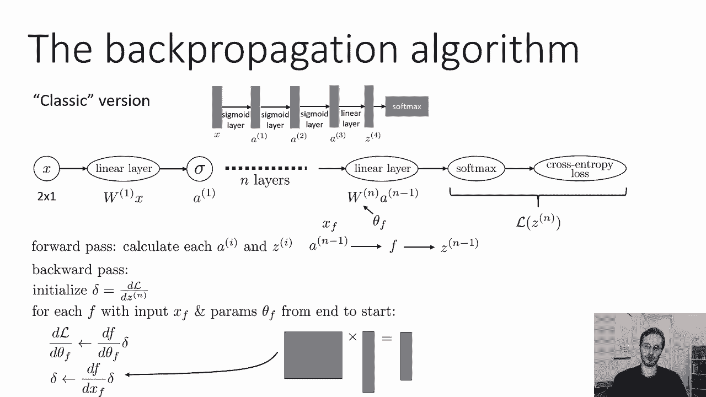
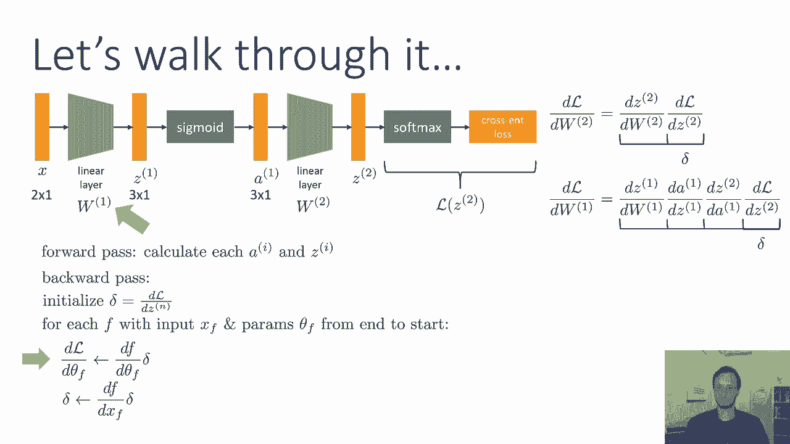

# P15：CS 182- Lecture 5- Part 2- Backpropagation - 爱可可-爱生活 - BV1PK4y1U751

在上一节中，我们讨论了如何设计多层神经网络，接下来我们要谈谈我们现在如何训练他们，弄清楚如何用神经网络获得完整的学习算法，我们将遵循第二课的相同步骤，所以解决任何机器学习问题的步骤，第一步定义模型类。

我们定义了神经网络，所以这就是我们要做的，第二步定义损失函数，我们现在坚持负对数似然，就像以前一样，尽管我们将在这里讨论的一切都很容易概括，几乎任何其他类型的损失函数，第三步。

我们现在必须选择我们的优化器，在上一次讲座中，我们详细地讨论了梯度下降及其许多变体，所以这就是我们要做的，我们将采用随机梯度下降，扩展我们在这里将要讨论的内容是非常简单的，动量，梯度，原子等等。

我们需要什么，为了将梯度下降或随机梯度下降应用于神经网络，嗯，我们真的只需要一样东西，我们需要能够计算梯度，梯度是一个大向量，它对每个参数都有一个条目，该项必须包含损失相对于该参数的导数。

在我们讨论逻辑回归之前，参数由每个可能类别的权重向量组成，然后我们把它们堆叠起来，得到我们的渐变，逻辑回归的表达式很简单，我们可以写出方程，呃，在一页上，在一张纸上，然后我们可以用微积分的规则。

导出该表达式相对于每个参数的导数，现在这很容易做到，我们可以用神经网络做同样的事情，我们实际上可以计算出关于每个权重矩阵中每个条目的导数，构建我们的渐变，但是因为神经网络包含许多功能。

它的表达式可能很复杂，计算出这些导数可能需要很长时间，更糟糕的是，如果你去改变你的网络，比如说，通过添加另一层，现在你必须重新导出所有的导数，这将需要很长时间，所以我们真正想要的。

是一种可以通过神经网络自动计算导数的算法，不用我们手工算出所有的微积分，然后我们可以实现任何我们想要的神经网络，运行这个算法，得到一个梯度，所以我们要推导的算法，在讲座的这一部分被称为反向传播。

这是一个非常经典的算法，这是当前几乎所有深度学习方法的核心，一旦我们能推导出反向传播，我们可以通过神经网络自动计算梯度，然后我们要做的就是在GPU上运行这个并得到一个解决方案。

在我们讨论如何做到这一点之前，我们需要回顾一下链式法则是如何工作的，所以神经网络是由许多函数组成的，通过函数的组成求导，微积分的链式法则帮助我们，不要与完全无关的概率链式法则混淆，好的，所以呃。

这里是微积分链式法则的概述，如果您有以下表达式，你有f的g的x，所以你有一些输入x，你对它应用函数g得到y，然后你对它应用另一个函数f得到z，你想把这个表达式和x区分开来，这意味着您要计算dz dx。

f的输出对g的输入的导数，链式法则告诉你导数是由，g的导数为d dx的乘积，乘以f的导数，即直流d，所以你只需要计算各个函数的导数，然后把它们相乘得到它们组成的导数，现在。

你们大多数人可能学过单变量函数的链式法则，但同样的精确表达式也适用于多元函数，我们只是需要对订单小心一点，因为标量乘法是可以交换的，我们可以把订单折价，对于向量值乘法则不是这样，类矩阵向量乘法。

所以如果你有多元函数，也许x是rn中的向量，所以x是一个n维的向量，y是m维为rm的向量，所以g从n维向量映射到m维向量，然后f就像我们的损失函数是标量的，所以f接受一个以rm为单位的向量。

它输出一个标量的单个数字，现在，我在这一页上写的同样的连锁规则现在仍然有效，dz d是一个向量，而d y d x实际上是一个矩阵，但是，如果你对如何导出向量值导数感到困惑，向量值函数导数。

你总是可以回到标量，所以在这种情况下d dx是g的雅可比矩阵，它是每个条目的矩阵，对应于y的一维，在x的另一个维度中，d y是f的雅可比函数，但如果我们不记得这一点。

或者我们不记得他们去的顺序，我们总是可以回到标量，所以我们可以这样做，我们要做的是，我们将写出关于x中某一特定项的导数，所以这是一个标量的导数，相对于另一个标量，现在在中间，我们求导的东西恰好是多元的。

但我们计算的实际导数只是一个数字，z的导数，也是一个标量，因为我们不对g做任何假设，也许把它乘以Y的每一个条目，然后y的每一个条目都可能影响f的输出，这意味着为了计算这个导数。

我们需要对Y中所有可能的条目进行求和，并考虑它们的影响，所以我们在y的所有维度上有一个很大的和，然后通过每个维度，我们只是应用了规则的单变量链规则，所以对于y的每一个维度，我们做d dj对不起。

我们做d d j d x i，所以第j项和y项的导数，关于x中的第i项，那是一个单数乘以dz dy j，另一种思考方式是，我们只是把这个向量函数g，好像它只是一堆标量函数，Y中的每个维度都有一个。

所以这总是真的，这不需要任何东西，任何线性代数，这只是规则的单变量链，然而，如果我们看这个表达式，我们可能会认识到这正是点积的表达式，对于两个向量之间的内积。

特别是向量d y d x i和向量d z d y，右d z d y是一个向量，因为Y中的每个条目都有一个条目，也是一个向量，Y中的每个条目都有一个条目，现在这就给出了关于i的导数，th，X项。

关于所有x的全导数也是一个向量，现在请注意，如果我们想把它看作一个内部产品，我们必须使d，y，d，x，i，成为维数为m的行向量，和dz dy一个维数为m的列向量，这将产生一个数字。

如果我们要产生一个向量，对x的每个坐标都有一个条目，我们能做的就是，我们可以用矩阵向量乘法来代替，所以不是做d y d x i，它是一个乘m的行向量，我们可以叠起来。

d x i对于x到矩阵中的每一个坐标，其中每一行都是d y，d x i表示不同的i，然后我们可以把关于全向量x的导数写成d x，t c y，其中d dx只是一个矩阵。

其中每一行都是y对x中一个元素的导数，而且那个，产生我在左边写的链式法则，所以它只是一个矩阵向量，乘法，所以dy dx是一个n乘m的矩阵，d z d y是m乘1的列向量，这里的简短评论。

尤其是对于那些以前见过这样的多元微积分的人来说，对于是否用向量输入表示函数的导数，有两种不同的约定，作为列向量或行向量，所以在这个班上，我们要说，如果y是一个有m维的向量，函数f吸收y并产生z。

那么dz d y也是一个m维的向量，所以说，函数的雅可比函数沿第一轴具有相同的维数，作为该函数的输入，然后是d dx，g的导数，是一个矩阵，它已经有了，其中行数等于输入中的行数，也就是x，那是n维的。

它有m柱，因此列数等于输出的维数，它是y，它有n个维，特别是，这意味着d dx中的ij项记住当我们索引到矩阵中时，第一个数字是行，第二个数字是列，所以第一个指数是分母，第二个索引是分子，这是一个惯例。

这是现在这个班的常规用法，在一些你可能见过的教科书中，或者在其他一些课程中，惯例是不同的，有时你会看到的惯例是，如果一个函数接受一个m维向量，那么它的导数是一个m维行向量，所以雅可比总是有列数。

等于输入维数，在这种情况下，链子会以相反的顺序写，那样的话，dx等于dc d y乘以d y dx，这只是两个不同的惯例，它们的意思完全一样，它们只是写得不同，经常使用行向量约定的原因是因为。

如果你对线性函数求导，比如说，矩阵乘法对被乘向量的导数，你只要回到同样的矩阵，所以函数的导数就是它本身，映射与输入相同维度的函数，与输出相同的维度，在我们的大会上，这是转置，所以说，这有点尴尬。

如果我们说的是函数的线性化，但事实证明，它在深度学习中非常方便，因为现在，我们将能够把所有的导数存储在向量和矩阵中，与原始权重向量和权重矩阵具有完全相同的维度。

好的，所以现在，让我们来谈谈如何，我们可以用链式法则来计算神经网络的导数，神经网络只是由许多函数组成的，所以我们可以用这个链来计算它的梯度，以一种非常简单的方式。

让我们回到我们在有输入之前看到的神经网络，x，然后我们用一个线性层，我们得到z 1，然后我们对z中的每个条目应用乙状结肠得到一个，然后我们有另一个线性层得到z 2，然后我们应用软最大值和交叉熵损失。

W1和W2是两个线性层的权重，所以加在一起，W1和W2表示该模型的参数，所以θ，全参数向量，只是由W1和W2的串联变成了大，长向量，我们将把软最大值和交叉熵损失组合在一起，因为当我们做梯度下降的时候。

我们真的只需要损失权的导数，我们不需要计算关于输出本身的导数，我们只需要损失的导数，所以每当我们有一个软麦克斯，我们马上就要输了，所以我们不妨把它们结合在一起，因为那些永远不会分开，我们称之为l。

l是z 2的函数，现在我们实际上可以用链式法则写出，比如说，损失对W 2的导数，这就是z对w 2的导数，因为W2只影响Z2，乘以损失对z 2的导数，对其他任何东西都没有影响，这就是链式法则的直接应用。

就像上一张幻灯片一样，用同样的方法我们可以写出关于w 1的导数，但这有点复杂，因为在W 1和损失之间有更多的函数，从右边开始我们有dl dz 2，乘以dz 2 d 1，乘以d 1 d z 1。

最后由DZ一DW一，这就得到了关于w的导数，所以我们刚刚应用了链式法则，通过我们的神经网络写出导数，把它们写下来实际上很简单。

只是计算它们要复杂一点，所以说，我们实际上可以在这个链式法则表达式中评估每个Jacobian，比如说，你知道z 2等于w的2乘以1，你可以算出dz2d1是w 2转置，作为旁白，如果你记得索引。

为什么要很好地转置，如果你，如果你，如果你想要矩阵中的第Ij个条目，这将是z j对ai的导数，而如果你想要格式，正好相反，所以因为我们的惯例，因为我们希望列向量有列向量导数，当我们计算雅可比时。

我们必须转置矩阵，那只是因为我们使用的惯例，现在，把这些雅各布人建造成，基本上算D一个一，D C一，d z 2 d 1，等，等，等，然后把它们相乘在一起，我们可以这样做，我们完全可以做到这一点。

只是在计算上非常低效，所以这里有一些直觉来解释为什么会这样，这么说吧，每个z和a都有n维，我是说他们都是，它们都有不同的维度，但假设它们平均约为n维，这意味着这些雅可比矩阵中的每一个都是n乘n矩阵。

我们把它们相乘在一起，现在矩阵乘法是一个O的n次方运算，现在这实际上是相当昂贵的，我们的价格永远不会比n的平方更便宜，因为我们需要n的平方来存储我们的权重矩阵，所以我们可以说，嗯，我们真的在乎这个吗。

真的有那么糟吗，那是n的立方，嗯，结果其实很糟糕，比如说，亚历克斯网络模型，一个非常经典的图像识别模型，有一些完全连接的层，有一些线性层，有四千九十六个单位，所以说。

n的o的立方算法和n的o的平方算法的区别，将是四千人的一个因素，这意味着你的渐变需要4000倍的时间来计算，因此，网络将需要4000倍的时间来训练，所以这是一个巨大的区别。

所以我们真的想避免这些立方体操作，以下是我们如何更有效地做到这一点，中间所有这些雅各布人，他们将以n比n的速度前进，但最后一个雅可比总是n乘以1，这总是正确的，因为损失总是标量值，损失总是输出一个数字。

这意味着最后一个雅各比总是一个接一个的东西，所以中间的这些产品还是挺贵的，因为它们是n的立方，但是最后一个产品，最右边那个还挺便宜的，因为它总是向量乘以矩阵，所以大约是n的平方。

下面是我们如何利用这种直觉，实际上建立一个更有效的算法，我们的想法是把这些雅各布人繁殖在一起，但我们实际上不会明确地构造它们，我们实际上从右边开始，我们将继续计算他们的产品，首先我们要计算dz2da。

这是一个矩阵乘以一个向量，我们称之为三角洲，而且这个很便宜，n的平方，所以现在，dl dw 1由dz 1给出，dw 1 d 1 d z 1乘以delta，现在我们再做同样的事情，最后一个乘积也很便宜。

因为它是矩阵乘以向量，所以我们计算d1dz乘以delta，让我们称之为伽马，比如说，现在我们有了，dl，dw，1是dz，1，dw，1，times，gamma给出的，那又便宜了，所以从右边开始。

我们可以使n的每一个运算都是平方的，从来不用做这些立方体的东西。

所以基于这种直觉，我们可以推导出经典的反向传播算法，假设我们有某种多层网络，所以可能有N层，我们要做一个向前传球，我们基本上只是把网络向前运行，计算每一个ai和z i，然后我们做后传。

这就是反向传播指的，我们首先将我们的delta向量初始化为损失的导数，关于上次激活，关于最后一个Z，然后我们将从网络的末端回到前面，对于网络中的每一个功能，我们要动手术，所以在这种情况下。

网络中的一个函数基本上是，任何线性层或非线性，所以每一个线性层都是一个函数，以及每个激活函数，每个西格玛，每个乙状结肠是A是一个函数，所以对于这些函数中的每一个，我们称它们为f。

假设x f引用它们的输入，θf表示它们的参数，例如，第一线性层，它的参数是w 1，所以它们是θf是w 1，我们要做下面的操作，好的，所以呃，这是我们的f f，比如说，在最后一层接受n减去1。

这就是我们所说的，它产生Zn-1，及其参数θf或w，我们要计算dl，d，theta，f，as，d，f，dθ乘以δ，所以你可以看到在最后一层这是完全合法的，因为在最后一层你有dl dcm。

最后一层产生ZM，所以df dθf乘以dl dz n给了我们，你知道dl dθf其中θf就是w，然后我们将通过在左边乘以df来更新delta，dx f，所以这将把delta变成损失的导数。

关于此函数的输入，所以在循环的开始在循环的顶部，delta总是l对这个函数输出的导数，在循环的底部，它总是l对该函数输入的导数，这样我们就可以对上一层重复循环，所以这总是涉及矩阵向量乘法。

这就给了我们另一个向量，它的维数与f的输入相同。

也就是x，所以让我们通过这个来看看它是做什么的，这里有两个关于w 2和w 1的导数的表达式，使用正则链的价值，现在我们将看到反向传播算法实际上是如何计算的，所以首先我们将delta初始化为dl bcn。

这里最后一层是两层，所以这就变成了DL DZ 2，那是三角洲，现在我们进入循环，我们的F是什么，我们的f是最后一个线性层，我们的x f是多少，我们的x f是1，我们的θf是多少，是两个。

所以这意味着dfdθf只是dz2，dw 2，所以这一步计算这个量，这样我们就得到了损失对W 2的导数，然后我们进入下一步，这里是1，那是这个函数的输入，所以df dx乘以delta计算dz 2。

d a 1乘以dl dz 2，所以这给了我们这个小队，现在我们通过循环，我们再一次执行前面的函数，那是乙状结肠，现在乙状结肠输入x f是z 1，它的输出是1，它没有参数，所以θf不存在。

这意味着我在这里强调的这一步实际上什么也没做，但是前一步确实做了一些事情，这里是什么，输入是z 1，输出是1，所以dfdxf等于d1dz1，所以当你把Δ乘以，你得到Δ等于这个量，然后你再循环一次。

下一个向后的函数是第一个线性层，这个就在这里，它的输入是x，它的输出是C 1，所以x f，这里是xθf是w 1，所以这个运算将我们的delta乘以dz 1 dw 1，正是这个数量，而现在，我们计算过。

我们神经网络所需的所有导数，好的。

