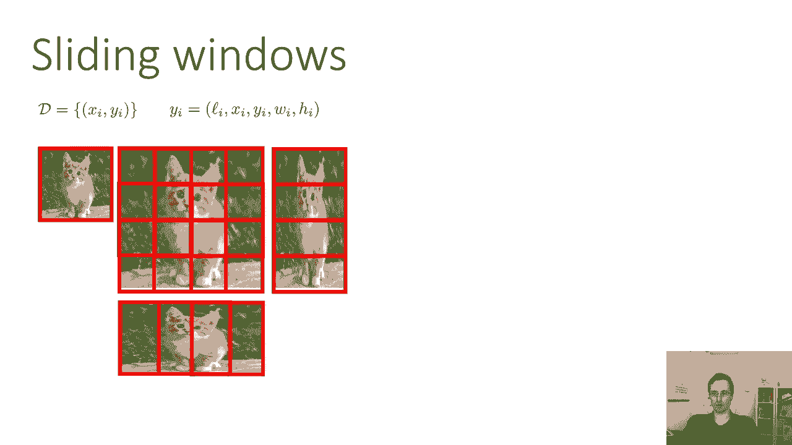
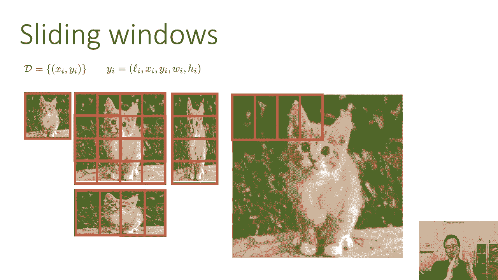
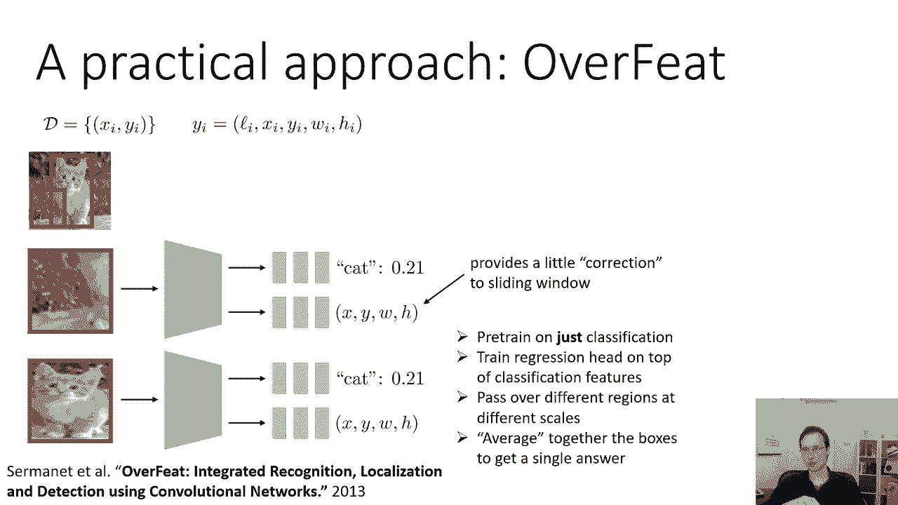
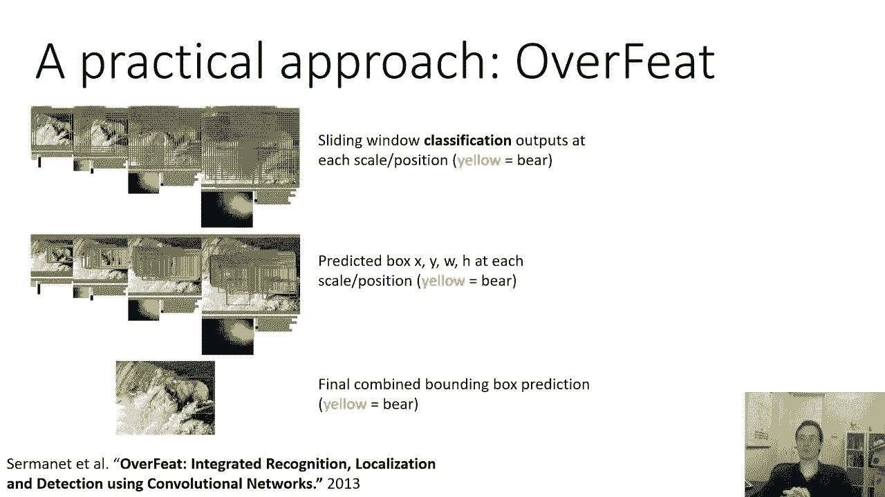
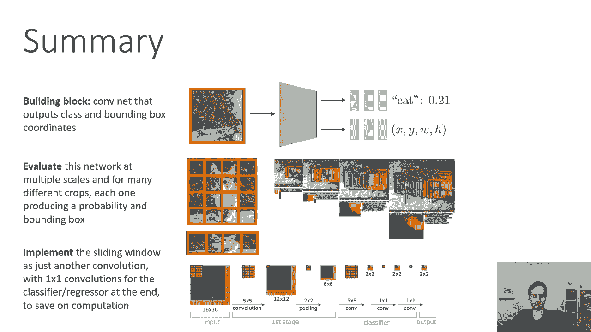

# P24：CS 182- Lecture 8- Part 2- Computer Vision - 爱可可-爱生活 - BV1PK4y1U751

所以第一个问题陈述将讨论对象本地化，我们能想到的最简单的方法之一，对象定位是一种回归问题，所以让我们用一个传统的图像分类器，就像我们在前面的讲座中谈到的，我们可以做的是，我们可以简单地把它的卷积层。

我们可以在它们之后添加另一组完全连接的层，它们的工作是输出，不是语义范畴，但是只有边界框的xyw和h坐标，有各种各样的方法来训练这个，你知道你可以想象联合训练这个，呃，从字面上计算一个损失函数。

这是猫的分类损失，和X的某种回归损失，Y W和H并向后将两个损失传播到这个网络中，因此，您将使用交叉熵损失作为类标签，和某种回归损失，就像高斯原木，边界框位置的似然或均方误差，实际上有一点细微差别。

如何正确地设置这些多任务目标，这节课我没有时间讨论这个问题，但如果你想了解更多，一定要看看我要参考的一些论文，尤其是我以后会讲到的Yolo纸，A是这方面的一个很好的例子。

您可以阅读所使用的损失函数的类型，并确保你用这些想法让你的东西发挥作用，但为了理解这些技术是如何设置的，你可以想象一下这个，高斯对数似然，或者均方误差损失，我在之前的偏差和方差课上描述过。

不同的方法之间也有一点不同，至于这两个头，所以这些完全连接的小层被称为头，如果这些头部与卷积层一起训练，或者另一种常用的设置是分类器训练的设置，就像上一节课一样，然后这个，这个新的回归头。

只是在该类的卷积层之上训练的，而不改变那些卷积层，所以说，这有时被称为，只是在现有的conv堆栈上训练一个新的头，或者将分类和回归首尾相连地一起训练，两者都是合理的选择。

取决于你使用的是哪一个取决于你的系统是如何设置的细节，现在这是一个非常简单的设计，可以联合多任务训练，也可以先分类训练，然后训练一个回归头，作品种类，效果还可以，而是自己，通常。

这不是大多数真正有效的本地化方法所使用的方法，我们一会儿就会讨论为什么，所以我想说的是如果你只想要一个快速而肮脏的物体，定位系统，也许是为了你的最后一个项目什么的，这是个不错的开始。

但如果你想要最好的结果，要把它做好需要很多小细节，我们接下来会讨论这些，所有的权利，所以你可以采用另一种方法，而不是试图训练一个单独的头部，实际预测边界盒的位置，你可以做的是使用一种叫做滑动窗口的东西。

你可以这样想，让我们把伯爵的原始图像，然后呃，我们可以问，如果我们对图像中的每个补丁进行分类，会怎么样，所以不只是拍摄整个图像，我们可以裁剪出一小块图像并将其分类，看看那是不是一只猫。

我们基本上可以把每一种可能的作物，我们的分类器预测猫的最大概率，表示猫的边框，所以我们可以把这个小补丁，我们可以通过分类器运行它，我们的分类器说是的，这是零点二百分之一的可能性是一只猫，好的。

所以这可能不是正确的边界框，我们可以拿着这个补丁在分类器里运行，也许对于这一个，我们得到零点八分之一的猫的概率，所以也许这是正确的边界框，现在你可能想知道为什么猫笨拙地伸展成这样，请记住。

我们的分类器容纳固定大小的图像，所以不管我们剪出什么补丁，我们必须调整它的大小，使其与分类器期望的大小相同，这可能会导致一些尴尬，um各向异性标度，所以它可能需要用不同的方式拉伸或压扁图像。

这其实没关系，如果你训练你的分类器来处理这种压扁和拉伸，所以如果你训练你的分类器在不同的作物上，不同的长宽比，它实际上可以计算出这是一个计数，即使它已经被拉长了，所以这其实没关系，所有的权利，所以现在。

当然我们接下来要问的问题是我们种植哪些作物，我们将在下一节讨论对象检测时看到，这个问题实际上有一些相当微妙的答案，但就目前而言，我们实际上会考虑一个非常简单的解决方案，在一定范围内种植所有可能的作物。

所以我们可以这样做，我们首先要考虑不同的尺度，所以最大的比例是你把整个图像，所以如果你把整个图像，那么唯一可以使用整个图像的裁剪，那是一种作物，然后你可以放大图像你可以通过不同的因素来放大它。

我用二的幂做这件事，但在实践中，您可能会比这更细粒度，你也许你把它放大20%，百分之五十，百分之七十五，类似的东西，但假设你把它放大两倍，如果你现在抓住同样大小的补丁，你可以像这样把它们铺在图像上。

所以现在你有多少你有九个不同的边界盒在这个比例下，在现实中，你会铺得更细，你甚至可以偏移一个像素增量，所以在每一个尺度上，你都会有比这个更多的包围盒，但只是为了让它更容易形象化，我说你有九个。

现在您还将考虑具有不同宽高比的缩放，所以再一次，如果我们做二的幂，也许我把这个图像垂直拉伸了2的幂，现在我有多个边界框，现在这些边框是长方形的，想象一下他们在原始图像中会是什么样子。

你觉得在最初的图像中这些边框会是宽的和短的吗，还是又高又瘦，又宽又矮又高又瘦，想象一下在右边重新缩放的图像中取一个矩形，想象矩形在原始图像中覆盖了哪些像素，它实际上是一个又宽又短的长方形，例如。

上面的长方形正好是猫的头，和背景中的草，所以如果你垂直拉伸图像，你在伸展的图像中取出等大小的盒子，它们对应于原始图像中的宽框和短框，同样地，你可以用另一种方式拉伸图像，并将其平铺，呃。

包围框并对每个框进行分类。

然后你可以把图像放大一些，平铺它，等等，所以在实践中你会有很多，更多的鳞片和更细的瓷砖，甚至可能和每一个像素一样精细。

一旦你有了所有这些分类，你该怎么办，你可以选择类概率最高的边框，顺便说一句，看着我在这张幻灯片上的边框，哪一个是正确的，哪个框代表猫周围正确的边界框，嗯，实际上是这个，因为这里的图像被水平拉伸。

这意味着当投影回原始图像时，边界框会很高，瘦骨嶙峋，也就是猫的这个方面，更一般地，你不必选择概率最高的点，你可以使用更复杂的技术，有时被称为非，最大抑制，当我们谈论物体检测时，我们将更多地重温这些。

但是对于这个本地化问题，因为你知道图像中只有一个正确的边界框，简单地拿最大值可能很好，性能最好的方法通常会做比这更聪明的事情，但这并不是一个糟糕的启发式，只是采取最高概率的盒子，现在。

让我们来讨论文献中进行本地化的一种实际可行的方法，本质上是把这两个原则结合起来，这是基于Pierre Sermonet的一篇论文，名为Overfeed，现在你可能会问，为什么我们要把这些原则结合起来。

我们可以输出一个边界盒的连续坐标，或者我们可以用滑动窗口，两个看起来都很好，你可能想把它们组合在一起的原因，是因为它们实际上弥补了彼此的弱点，滑动窗口的方法非常简单优雅，它不需要预测连续的坐标。

问题是覆盖每一个像素可能非常昂贵，你可能没有得到非常正确的边界框，除非你真的通过一个像素偏移量，所以它可以很有帮助，即使您有一个滑动窗口来输出框的连续坐标，基本上允许分类器稍微修补一下盒子。

所以你可能会给它一个窗口，里面有猫，然后说是的，里面有一只猫，但这有点离谱，就像那边的几个像素，你也不必在每一个可能的宽高比中考虑每一个可能的缩放，因为模型微调的能力。

那个边界盒的精确坐标可以很大程度上补偿这一点，如果你想考虑所有可能的各向异性缩放，有很多对吧，因为如果你的形象是，比如说两百乘两百像素，可能的呃，你可以有200乘200的分组。

因为你可以沿着每个维度缩小一个像素，所以那是非常非常大的，我们希望减少天花板，并使用这些连续的坐标输出来微调边界框，所以我们要做的是，我们要采取不同的补丁，为什么，滑动窗口方法。

对于每个补丁将输出猫出现在该补丁中的概率，以及边界框相对于该补丁的坐标，如果补丁正好在猫的中心，也许坐标会覆盖整个补丁，这没关系，但如果他们有点不对劲，我们没有非常正确的宽高比，他们可能会把它修补一点。

所以本质上，连续的取值输出对滑动窗口提供了一点校正，过馈模型训练的特殊方式，在这一点上，这可能有点过时，因为这是七年前的，但论文中训练它的特殊方式是预先，对网络进行公正分类培训。

然后在分类特征之上训练回归头，然后你把这个模型以不同的比例传递到不同的地区，对于每一个，你得到一个类和一个边界框位置，在这一点上，你可以拿着，呃，类概率最大的窗口，实际的纸张所做的是。

它实际上结合了来自不同补丁的预测，你可以把它看作是一种加权平均风格的方法，但这是一种设计决定，所以特定的纸张平均从不同的盒子，按概率加权的窗口，大致上比那要复杂一点，但这是基本思想。

但你也可以以最高的概率使用补丁。

嗯，所以这里有一些报纸上的实际照片，举例说明，滑动窗口加边界框回归在实践中是什么样子的，所以你在顶部看到的是不同的鳞片，对于每一个尺度，模型只预测阶级，所以你在顶部看到的只是班级。

不同的窗口在这里用颜色编码，所以你可以看到它们都是相互重叠的，它们的颜色编码，所以那里有很多不同的班级，所以看看黄色的盒子，黄色的盒子是那些标记为裸的，你可以看到，对于更大的范围，对于第四个图像，呃。

最右边的，许多雄鹿没有被贴上熊的标签，左边的许多只有水的地方，没有熊被贴上别的标签，我不知道别的东西是什么，可能是鲑鱼，也可能是水什么的，在中间的一排，什么，呃，他们显示的是预测的x y w和h。

或者每个位置刻度的边界框，这样你就可以看到，比如说，在最左边，你知道补丁几乎覆盖了整个图像，但在熊的周围，边界盒被预测得更紧，所以实际上x，y，w，h是好的，经常调整那个窗口，现在你还可以看到。

边界框并不完全一致，所以每个窗口都有一个稍微不同的边界框，他们中的一些人比其他的更正确，他们中的一些人认为熊的概率比其他人高，但是一旦这些包围盒结合在一起，然后在底部。

最后的组合边界框预测实际上很好地将熊居中，如果你想知道这种热图看起来像什么，在底部，它对应着，这只是可视化图像中每个位置的熊的概率，在每个窗口，更黄色的颜色对应于更高的概率，你可以看到。

尤其是在更大的尺度上，最大的可能性往往集中在窗户周围，窗户很好地覆盖了熊，好的，这就是对象定位，我们可以回归，呃，到边界框位置，我们也可以做滑动窗，我们可以把两者结合起来，我们可以有一个滑动窗口。

其中对于每个位置，我们输出一个边界框。

然后以某种方式把它们结合起来，现在，你现在可能在想的一件事，滑动窗口方法在计算上相当昂贵，比如说，如果你有三个六个窗口，如果你在每个维度上有六个，你天真地，你会付三个，计算成本的六倍。

如果你在做一些更像过喂纸实际上在做的事情，您可能有数百个窗口沿着图像，并支付数百倍的费用，幸运的是，我们可以让这种方法便宜得多，通过利用卷积网络的一个特殊性质，对此建立一些直觉，让我们回到这个，呃。

三乘三给猫铺瓷砖，这看起来很像一个卷积，在卷积中的右，我们在图像上传递过滤器，现在我们把整个修道院都传给了这张照片，所以也许我们可以跨窗口重用一些计算，就在那些窗户重叠很多的时候。

也许我们不必重新计算卷积层，从头开始激活每个窗口，也许我们可以重用到目前为止的计算，所以这里有一个想法可以帮助我们思考这个问题，假设我们在一个非常大的图像上有一个卷积网络。

可能是原始图像大小的两倍的图像，所以我们计算卷积激活，就像我们以前做的那样，所以这些都在这里，假设我们表示一个两层卷积网络，然后我们在最后有分类器，我们把最后一个卷积图压扁成一个完全连通的向量。

然后用普通的线性层连接它们，现在我们不打算使用整个卷积图，我们就用左上角，所以这就是我们正在做的，比如说，如果我们在这个图像上传递一个窗口，那是图像的一半大小，我们只想评估左上角，这样左上角的红框。

这样我们就可以把猫分类在左上角，如果我们也想把上中分类，然后我们会在那里放一个小过滤器，我们会我们会拿出一大块激活地图，把它压平，穿过一些完全连接的层，右上角，我们会拿出一些大块，压平。

穿过那些完全连接的层，最重要的是你拉出来的大块，它们实际上是重叠的，因为如果你还记得我通过过滤器的时候，对不起，当我通过那个分类器时，不是图像顶部的分类器，实际区域，我拉出的窗户只有图像的一半大。

但我有三个这样的窗户沿着顶部，所以它们每个都有大约50%的重叠，这就是我们现在正在做的，一种方法是建立一个修道院，呃，图像大小的一半，然后当我们把整个卷积较小的层压平时，但正如你从这张照片中看到的。

你也可以把整个图像，运行整个图像的所有卷积层，然后在最后当你想分类的时候，你只要拉出最后一张卷积图的一大块，但实际上，如果我们看看这个，我们可以认识到这些分类器，完全连接的位，本身只是卷积层吗。

并且可以这样实现，所以我们实际上不需要编写任何特殊的代码来做到这一点，我们实际上可以实现分类层，那些完全连接的层作为卷积，同时通过向前传球，这种新的卷积分类器得到了猫的概率，每一扇窗户，在这种情况下。

有九个窗口，我们将得到九个输出，我们对每个类都有一个对应的概率，在我们有两个完全连接的层之前，我们如何很好地实现这一点，在我们的卷曲之后，他们每个人都有四千九十六个单位，但我们想评估每个位置的卷积层。

很抱歉每个位置的那些完全连接的层，这基本上是一个卷积，只是一个接一个的卷积，所以每一个完全连接的层只接受前一个完全连接的层作为输入，除了第一个，第一个是卷积响应图的整个补丁。

但之后的一个只接受前一个的输出，所以这实际上是一个接一个的卷积层，有四千九十六个过滤器，一个接一个只是意味着它只访问前一个位置，所以如果你先把左上角分类，你必须把整个反应图弄平。

这将成为您的第一个完全连接的层，第二层连接层只看第一层的输出，这样它就不会偷看邻居了，这正是你用一个接一个的卷积得到的，所以具体来说，为了使这一点非常精确，第一次手术，压平，它进入第一个完全连接的层。

现在变成了一个规则的卷积，步幅相当大，下一个完全连接的层是一个接一个的卷积，以一个的步幅，然后最后一层，软麦克斯，还有一个步幅一个一个的卷积，所以如果你，如果你不确定这是如何工作的。

我鼓励你把它写在一张纸上，画出在这九个位置中的每一个位置都有一个单独的分类器的样子，然后思考如何用卷积对其进行编码，由此产生的网络将是完全卷积的，根本没有完全连接的层，在这种情况下。

它的输出实际上是三乘三乘，比如说一千，如果你有一千个不同的类，所以这实际上是过度喂纸的基本作用，但他们的情况除外，输入，呃，呃，每个位置都要大得多，所以他们在这里说明的是如何。

如果你对你的修道院有十四乘十四的投入，输出一个类，你可以把它变成一个修道院接受16乘16的输入，左上角类的概率的二乘二输出，右上角，左下角，底部现在在这里，有更多的重叠比在我的小简单的图表。

但想法完全一样，你只是把那些非卷积的，顶部完全连接的层变成一个接一个的卷曲，这允许你在每个位置产生一个类标签，这是一个非常重要的想法，我们将看到，当我们谈论检测和分割时，一次又一次地出现，这种想法。

卷积网络可以在图像的不同位置产生预测，同时重用卷积层中的激活，所以这种计算在大陆的定位问题上是非常强大的，我们会在其他部分看到它的变体，所以总结一下我们本地化系统的构建块，是输出类和边界框坐标的大陆。

我们可以在多个尺度上评估这个网络，对于许多不同的作物，每一个都产生一个概率和一个边界框，我们可以把滑动窗口作为另一个卷积来实现，而不必重新计算每个位置的所有激活。

