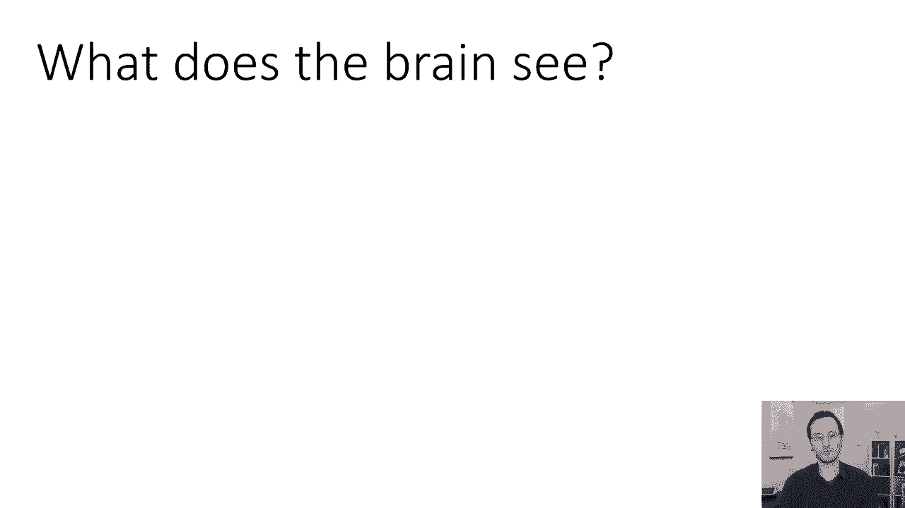
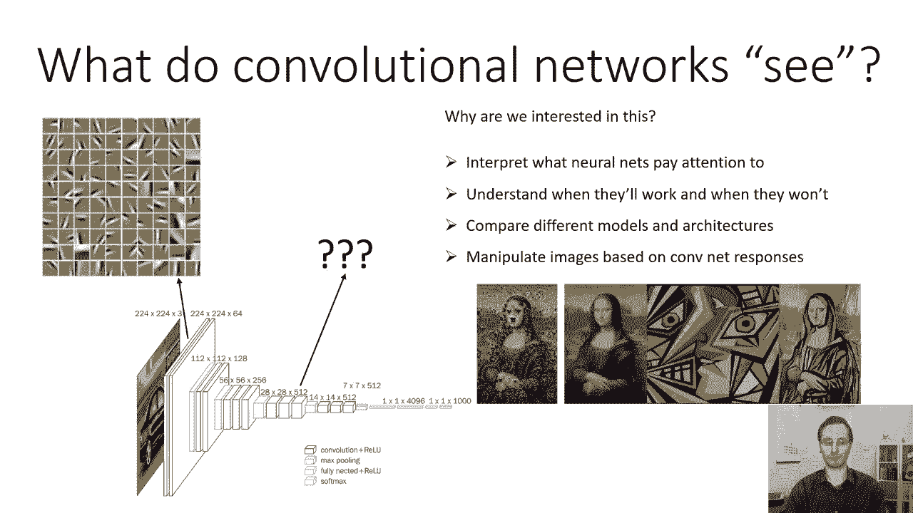
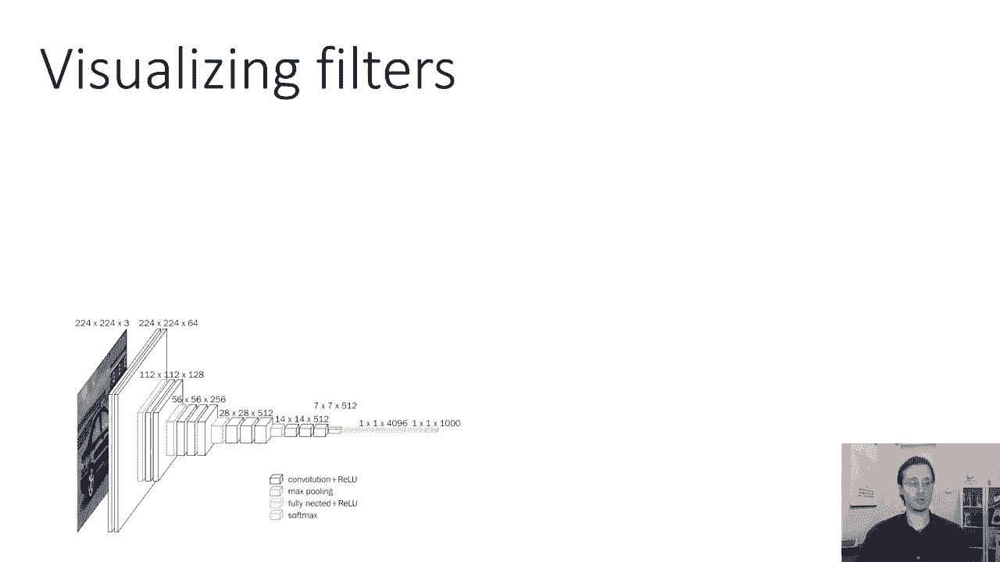
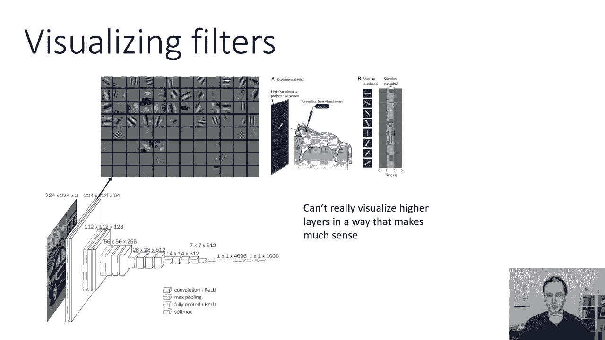
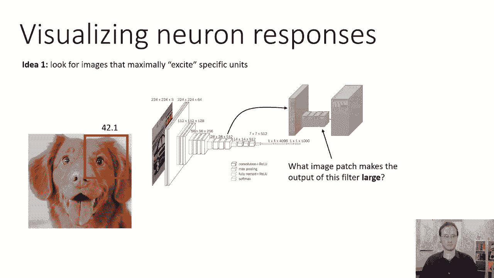
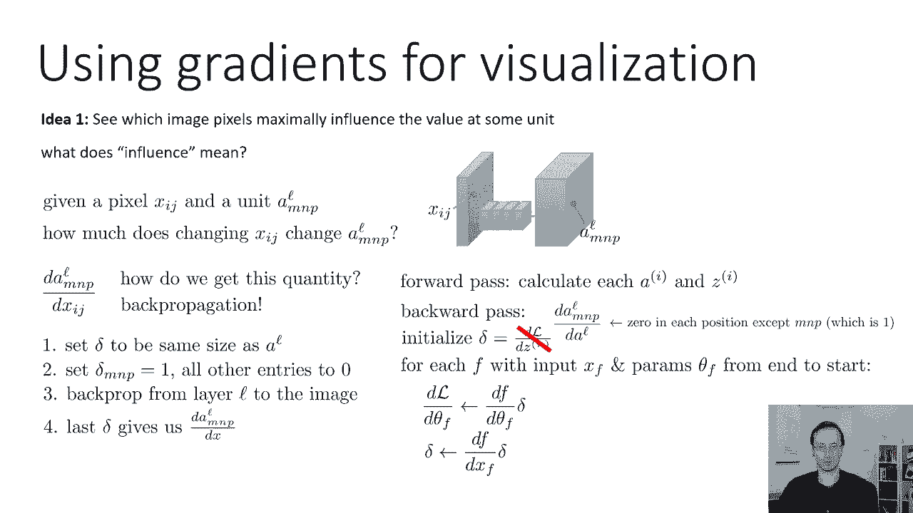

# P27：CS 182- Lecture 9- Part 1- Visualization and Style Transfer - 爱可可-爱生活 - BV1PK4y1U751

欢迎收看第八十二节第九课，今天我们要谈谈如何理解，卷积神经网络在做什么，以及如何实际使用它们来生成图片，在我们进入卷积网络的细节之前，让我们简单地谈谈一些实验。

Torus、Wisel和David在神经科学中做的一些非常著名的实验，胡贝尔，研究真正的哺乳动物大脑如何处理视觉图像，当我们讨论修道院时，我们会看到很多类似的地方，所以说，胡贝尔和威塞尔。

最著名的是他们对哺乳动物大脑视觉处理的研究，他们最著名的实验是向猫展示不同的视觉刺激，记录猫大脑神经元的激活，他们发现的是，那个，猫脑中的单个神经细胞，负责识别不同方向的边缘，这是他们进行的实验的图表。

屏幕上显示了猫不同方向的边缘，从这里，他们能够重建，猫大脑中的不同神经元是如何对不同方向的边缘做出反应的，这很有道理，因为视觉世界中的物体是由边缘勾勒出来的，所以说。

如果你能很好地检测不同方向的定向边缘，在不同的地方，然后你会有很好的视觉处理，事实上，这些天你知道这些实验被广泛复制，我们知道哺乳动物大脑的早期视觉处理倾向于识别，定向义齿和这些神经元的感受野。

基本上它们最积极回应的模式看起来是这样的，它们有点小边缘，一边是光明，另一边是黑暗。

这告诉你那里有一个边缘，所以我们可以同样地问，嗯，卷积神经网络看到的是什么，他们是否也以类似于大脑的方式看待事物，事实上，这些卷积神经网络的早期层，倾向于。

实际上非常像我们在古巴鼹鼠实验中看到的定向边缘，但当然，我们可以征求我们的意见，嗯，这就是早期发生的事情，后面的层发生了什么，嗯，我们为什么对这个问题感兴趣？它可以让我们解释神经网络实际上关注的是什么。

他们是否在识别图像，在某种意义上，出于正确的原因，这可以帮助我们了解我们的大陆何时会工作，当它们可能不起作用时，它允许我们比较不同的模型和架构，非常相似的概念也可以帮助我们操纵图像。

基于卷积神经网络响应的，夸大这些图像的某些特征，例如，你可以问一个大陆，它是否在蒙娜丽莎的画中看到了不同种类的动物，然后夸大那些特征，或者你甚至可以让它产生幻觉，如果蒙娜丽莎是由不同的艺术家画的。

以不同的视觉风格，我们将看到我们用来分析反应的相同技术是如何，卷积网络实际上可以使用，以这些创造性和艺术性的方式修改图像。

但首先，让我们来谈谈将反应形象化，和卷积神经网络滤波器，首先我们需要好好问问，我们应该想象的是什么，我们有两个选择，一种选择是可视化筛选器本身，所以说，让我们不要担心激活或不激活的图像，目录。

让我们看看过滤器本身，看看，如果这能给我们一些关于它所接收到的东西的直觉，对于第一个卷积层，这是相对简单的，因为对于第一个卷积层，我展示的这张照片实际上不是哺乳动物的大脑，实际上来自一个大陆。

我们可以很容易地想象这些滤镜会捕捉到什么样的视觉特征，所以你可以这样想，这些是一堆不同滤镜的图片，我们可以说好，每个过滤器对应于什么图像特征，我们把我们的形象像这只狗，然后拿一个过滤器。

想象一下把它覆盖在图像的一个补丁上，现在问问自己，如果你用点积，的，如果你能把这个过滤器和图像像素相乘，然后把它们都加起来，那个点积是一个大的正数还是一个大的负数，还是会接近零。

所以如果它是一个大的正数或一个大的负数，这意味着过滤器对补丁的响应非常强烈，但如果是一个很小的数字，接近于零，然后它对那个补丁没有反应，所以这里，你可以看到狗耳朵的边缘一边有一种颜色。

另一边是不同的颜色，所以这些定向边缘过滤器中的一个可能会对此做出非常强烈的反应，在这种情况下，实际上，因为背景比狗轻，过滤器在往另一个方向走，它实际上会有很大的负面反应，但你可以想象。

也许在网络的某个地方有这个过滤器的底片，或者另一方面可能会有很大的积极反应，如果你把这个过滤器覆盖在另一边，边缘不对齐的地方，所以这里的边缘是从左下角到右下角，但是狗零从左上角到底部，就在这里。

因为它们没有对齐，这些之间的点积实际上不会很大，因此过滤器不会在此位置开火，这就是你如何获得一些直觉，过滤器真正代表的是什么，不幸的是，这真的只适用于第一层过滤器，因为第二层滤波器不是用图像像素表示的。

它们用第一层过滤器的激活来表示，这些对我们来说几乎是不可解释的，所以我们有的另一个选择是尝试将刺激形象化，激活特定的神经元，修道院里的神经元是什么，嗯，神经元是特定过滤器的特征。

通常当我们对视觉刺激激活的问题感兴趣时，哪个神经元，我们真的在问所有图像位置的问题，所以我们可以问是什么激活了第三个功能，7在坐标2处，五层两个十七，但通常我们不太关心坐标。

所以我们更关心的问题是什么激活了功能二，五层七层，所有地点平均，所以我们有我们的修道院，我们可以把中间的一层，我们可以在中间层要求一些过滤器，什么图像补丁会使这个过滤器的输出变大，我向你道歉。

视频中的文字就会被剪掉，但它说是什么图像补丁使这个过滤器的输出变大。

我们实际上可以尝试生成图像补丁，特定层中的特定过滤器输出大量的，然后我们可以看看那个补丁是什么样子的，我们会找到一些能接受人脸的过滤器，一些能让狗接受的过滤器，和一些过滤器，可以接受更抽象的东西。

比如圆形的形状，这种探测卷积网络的方式在概念上是，实际上与我前面提到的Huber和Zell实验非常相似，就像他们在猫的大脑里放了一个电极，测量哪些视觉刺激最大限度地激活，这里的哪个神经元。

我们正在对我们的大陆进行探测，试图理解哪些视觉刺激最大限度地激活，那个过滤器，所以让我们呃。

让我们试着做到这一点，呃，可视化过滤器，这很简单，你只需直接打印出过滤器中的数字，所以如果你有，假设在VGG的第一层有64个过滤器，你可以把它们放在一个有64个单元格的网格里，每一个对应于不同的过滤器。

你可以猜到其中一些是在看边缘，其中一些着眼于不同的频率，这几乎是你所期望的，事实上，这有点引人注目，可能一开始，我们看到的过滤器，在大多数卷积网络的第一层，看起来与人类卑鄙的接受场极其相似。

在哺乳动物大脑中观察到的，这其实不是意外，事实上，虽然最初有点，这对计算机视觉研究人员来说有些震惊，看看卷积网络现在获得了这些类型的过滤器，我们实际上知道几乎任何合理的学习算法当应用于真实的图像补丁时。

实际上会发现这些定向边缘滤波器，在独立分量分析中包括K均值，稀疏编码，和许多其他人，而这其中的原因并不是，因为所有这些算法的工作方式与大脑的工作方式相同，实际上是因为这些是自然图像中的主要特征。

自然图像不仅仅是像素的随机排列，他们是，你知道的，向我们呈现物体和场景，主要由边缘组成，所以这些网络学习边缘作为第一层过滤器是有意义的，非常，非常始终如一，但又一次，我们很不幸。

不能以一种有意义的方式可视化更高的层。

所以对于更高的层，我们必须使用选项二，那么我们如何可视化神经元的反应，这是选项二，一个想法是寻找能最大限度地激发特定单位的图像，所以收集大量的图像，评估每个层中的每个过滤器，对于这些图像中的每一个。

然后为每个过滤器对它们进行排序，他们激活过滤器的程度，然后我们可以看到最大限度地令人兴奋的图像，所以对于一些层，选择一些过滤器，说什么，问什么图像补丁使这个过滤器的输出大，让我给你们举一个小例子。

假设我在看，你知道的，第7层中的12个过滤器，作为一个例子，假设红框代表过滤器的接收场，然后呃，你知道这里的感受场覆盖了大约四分之一的图像，我要在图像上滑动这个接收场，这个数字将表示过滤器的激活。

所以这里是十二点三，这里是三，七点四，这里是17点1分，这里是两个，一点四，这里是四十二点一，所有的权利，嗯，我再重播一遍，十二点三七点四，十七点一，211。4，四十二点一。

所以我向你们提出的问题是基于这些数字，你认为这个过滤器实际上在关注什么，你认为它在图中寻找什么？一次又一次，这个补丁是四十二点一，这个是21。4，这个是十七点一，这是37。4，这是十二点三。

所以你可能会注意到，过滤器的反应往往更强烈，当窗户盖在狗的眼睛上时，它的左眼或者右眼，所以您可能会由此得出结论，这个过滤器正在寻找，我喜欢特征和图像。

事实上，如果我们真的做这个实验，如果我们真的试着用一个真正的网络，和，查看特定单元的顶部区域，这是在看，呃，五层池中的单元，我相信这是为了VGG网络，虽然可能是为了亚历克斯·内特，我不太记得了。

这是来自R cnn的原始论文，你可以看到有过滤器显然可以接受特定的，通常语义上有意义的事情，到人们的脸和上半身，第二个过滤器似乎主要对狗有反应，虽然它也能捕捉到有圆圈的东西，所以可能它对狗有反应。

因为它真的在寻找，就像两只眼睛和一个鼻子，像三个黑眼圈，还有这些上面有圆孔的木板，你知道的，上面有多个圆形特征的表面，所以狗和圆圈的田野，嗯，第三排似乎收了玫瑰，你知道吗，斑点的排列，斑点红色的东西。

它似乎最能捕捉玫瑰和面条，第四行似乎接收了一些文本，经常乘以文本两千零六年，因为某种原因，嗯，第五栋房子，第六个圆形闪亮的形状，包括左边一个秃顶男人闪亮的额头，和抛光的木制。

第六集布景中的一件家具的尖端，从左边开始的柱子，所以你知道，不是，都是语义上超级有意义的，就像，你知道的，把闪亮的额头和抛光的木头聚集在一起，呃，那个帖子，也许这并不完全合理，但从视觉上看。

它们是相似的，所以也许这是有道理的，这将是一个大陆的中等水平特征，我们可以做一些不同的事情，而不是只是，这应该说，想法二，而不仅仅是寻找已经激发修道院特定过滤器的现有图像。

我们可以试着找出哪些特定的像素，最大限度地影响某单位的值，这可能会让我们更清楚地了解这个单元到底在做什么，顺便说一句，当我说单位、神经元或过滤器时，这些都是同义词，所以神经元是一个更古老的术语。

在神经网络的激活中引用特定的数字，那些是最近的，这些被称为单位，但在一个大陆上，它们也被称为过滤器，所有这些都意味着相同的时间，好吧，所以我们想找到在某个过滤器上对值影响最大的像素，影响力意味着什么。

影响意味着如果你有一些像素，在l层，在mn位置有一个单位，它是过滤器P，所以a l m和p，如果x i j影响该单位，j应反映为单位的重大变动，是什么量化了这一点。

什么量化了一个值随着另一个值的变化而变化的程度，这正是导数所做的，如果我们拿一些像素，我们取一些激活和一些过滤器，该单元的激活相对于该像素的偏导数，直接量化那个像素对那个单元的影响有多大。

所以如果我们关心一层一层的m和p，j，然后d a m和p l/d，J直接量化了这种影响，顺便提一下，通常我们不关心过滤器在特定位置的激活，我们更关心过滤器在所有位置的平均激活，在这种情况下，我们会。

我们会在激活图上的位置上求和，然后看看通道，但这里只是为了简单，我不会那么做的，那么我们如何得到这个偏导数，结果是我们可以用同样精确的方法计算这些偏导数，我们用反向传播计算了关于参数的导数。

其实也没那么难，这是我们之前看到的反向传播的伪代码，你有一个向前传递，在那里你计算神经网络中的所有激活，然后你有一个向后传球，其中初始化delta，作为您相对于最后一层激活的损失的导数。

然后从最后到开始的每一层，你计算关于该层参数的导数，我们不会在乎的，因为现在我们不关心参数，然后计算前一层的增量，把左边的旧三角洲相乘，被那一层的雅各比人，当你到了最开始的时候，当你到达第一层。

更新增量时，用这种方式，Delta实际上最终会成为你的损失相对于原始输入的导数，也就是图像，所以我们要做的就是让传播回来，量化这种影响是以稍微不同的方式初始化delta，而不是在最后一层放一个损失函数。

我们将在L层初始化Delta，我们想要的单位相对于该层的值的导数，初始化有一个非常特殊的结构，到处都是零，除了我们想要的单位np，因为d，a，m，and，p，over，a，d，a，m，and，p。

只是一个，所以您只需将delta初始化为与L层的激活映射相同的大小，除了你想要的位置，到处都是零，您将其设置为1，所以这就像你的专业，就像古巴和巴西一样，有一个电极，他们把它放在猫的大脑里。

你要对修道院进行一点调查，就像一张到处都是零的激活图，除了你想探测的地方有一个，如果你想探测一些单位的和，比如说，如果您想探测特定筛选器在所有位置上的一些激活，然后在过滤器的所有位置都放一个。

然后在所有其他过滤器的所有位置为零，因此，该过程将delta设置为与l相同的大小，并将其设置为单元的一个，你想为其他人探测和归零，然后从L层跑回道具，一直跑回图像，然后读出你想要的数量。

你得到输入图像的最后一个图像，这样它的大小就和图像一样了，其中的数值将代表，图像中的每个像素对您关心的单元有多大影响，在实际实施方面，其实很简单，你可以用一模一样的背面，用于训练神经网络的传播实现。

只是现在，你要训练它计算这些激活的导数。

关于图像，所以让我们看看这在实践中是如何工作的，假设你在这里有一个看起来像亚历克斯·内特的网络，你在一张猫的照片里喂食，如果你真的去计算中间层激活的导数，相对于输入图像中的每个位置，你会得到这样的东西。

好的，不是很好，你可以看出它或多或少是猫形的，虽然到处都是噪音，我们真的不知道发生了什么，但是，如果您稍微修改反向传播，你实际上可以得到这张照片，所以我马上告诉你这个修改是什么，但在这张修改后的照片中。

它实际上清晰多了，这个单位在找什么，你可以看到背景中的大部分草都没有出现，这个单元主要是强调猫的脸，所以它更多地看着猫，大眼睛大鼻子等等，它没有那么关注其他一切，事实上，即使是眼睛，那个呃。

特定的颜色通道本身实际上是有意义的，所以你可以在这张渐变图像中看到，眼睛其实是蓝色的，这意味着如果你把这只猫的眼睛弄得更蓝，这会更激活那个单位，所以这是一个寻找蓝色大眼睛的单位，好的。

那也许是件明智的事，如果你想找到可爱的小猫和照片，那么修改是什么，嗯，这里的修改叫做引导反向传播，这是本文介绍的一个技巧，叫做追求简单，全卷积网，这有点像黑客，我也没有一个很好的解释，这太重要了。

但它似乎大大提高了你得到的图像质量，通过分析这些梯度，所以引导反向传播背后的想法是这样的，嗯，普通的背部道具不是很容易解释，因为网络中的许多其他单位，将为给定单位贡献正梯度和负梯度。

所以这个单位A和P可能会受到其他单位和前面层的积极影响，它也可能会被抑制，它可能会受到很多其他单位的负面影响，这些消极的抑制往往非常复杂，而阳性抑制，而积极的贡献往往更简单一点，不完全清楚为什么是这样。

但似乎就是这样，所以也许如果我们只保持正的梯度，我们将避免一些复杂的负面贡献，并获得一个更干净的信号，所以引导反向传播的作用，每次你回来的时候，它都会引入一个启发式的变化，通过relu传播。

通常当你通过Relu反向传播时，如果Relu之前的激活为阳性，然后你只需将你的增量乘以一，如果是阴性，这意味着杀死激活的导轨，你乘以零，你在引导反向传播中所做的是你也把，这个渐变，如果输入梯度为负。

所以如果增量中有负值，负值变成零，呃，当它向后穿过一条实际上不应该发生的射线时，因为在常规的反向传播中，如果激活进入真正的阳性，那么relu的Jacobian是一个，所以即使回来的梯度是负的。

该梯度应该通过循环返回传播，而这个方法只是说不，不要做那个零没有，这几乎就像在向后传球时加上一个relu，还有前传，那么为什么这个能起作用呢，这并不完全明显，直觉是它消除了这些负梯度，这些抑制性梯度。

和抑制梯度，往往比支持特定单元的渐变复杂得多，所以通过只保持正梯度，只有让单位开火更多的梯度，去掉那些让它着火更少的，看来我们能恢复得更多，对一个特定单位正在寻找的东西的可解释的印象，但这有点启发式的。

好的，所以如果引导反向传播的工作方式还不完全清楚，也许报纸上的这张照片会有助于说明它，所以这里f fi是在relu l加1之前的单位的激活，i是那一层之后的三角洲，你可以看到的是。

常规的反向传播只是设置，层的导数，作为下一层的导数，乘以单位是否为正的指标，这是因为导轨的导数是1，如果它是正的和零的，如果是负数，然后引导反向传播，就是最下面一行的东西，也把它归零了，此外。

如果导数本身为负，所以只有正导数会重新传播，有点启发式。

但这就是它的工作原理，所以事情是这样的，嗯那个，这篇论文的作者和我们一起想出了，六层和九层不同单元的一些可视化，我相信这是给VGG的，但我不确定，所以他们生成这些可视化的方式是。

他们首先发现了最大限度地激活不同单位的补丁，然后他们用这种渐变方法来计算哪些特定的像素，在这些补丁中负责激活，所以你可以看到CON V6，这些是一些较低级别的功能，激活它们的补丁似乎是，你知道。

我说第一排，主要代表狗鼻子的圆圈，但并不总是，特定的像素实际上是鼻子本身，在九号，这在网络中更高，所以感受野更大，特征比较复杂，在这里你可以开始看到一些更有趣的模式。

你可以看到对第二排人的脸有明显的偏好，对第三行圆圈的明显偏好，你也会注意到在每个图像中你知道有些东西实际上被删除了，比如说，在底部图像中，在最下面的一行，这是一个似乎有偏好的单位，也适用于圆形的东西。

所以对于左边的牛仔来说，给那个戴牛仔帽的人，牛仔帽非常强调，而衬衫相对不那么强调，特别是对着图像的底部，所以这真的是在研究这些补丁的特殊性质。

