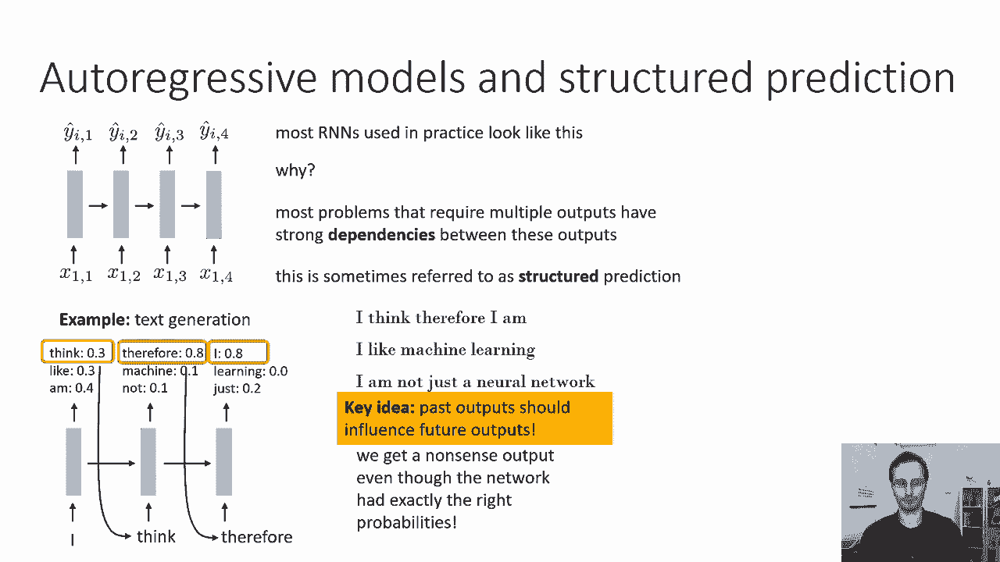
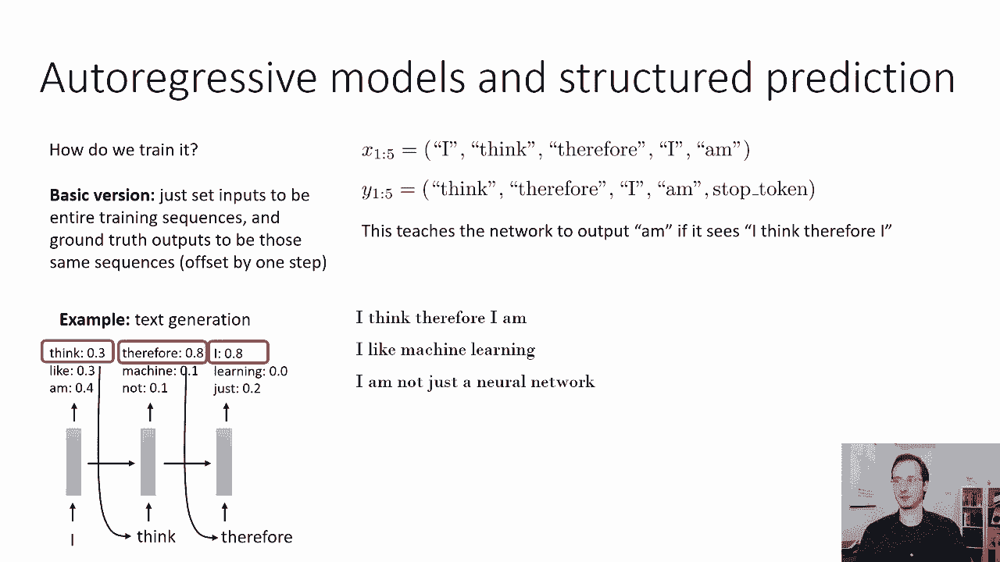
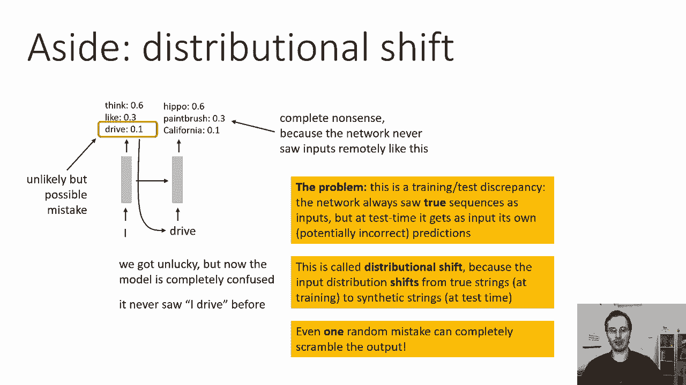
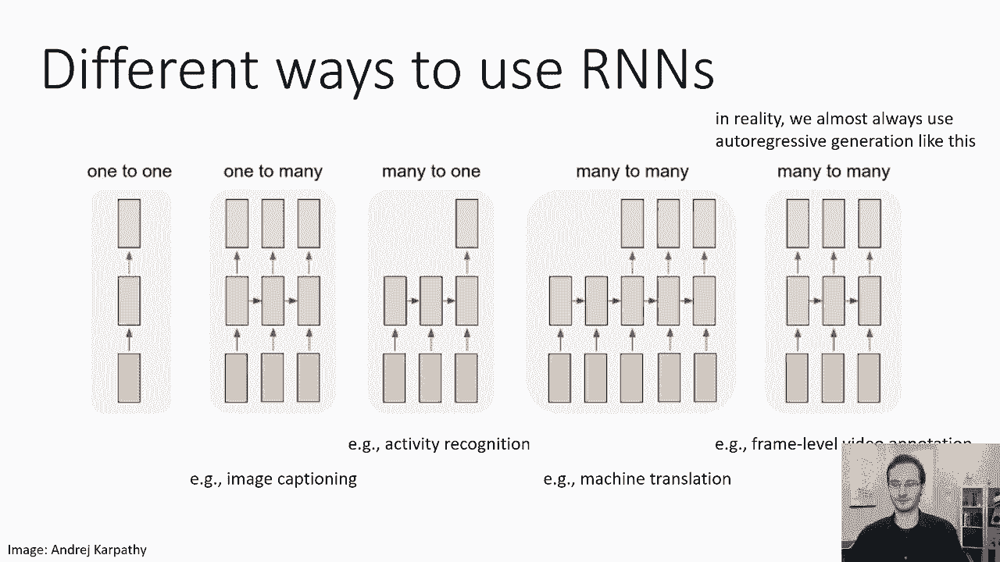
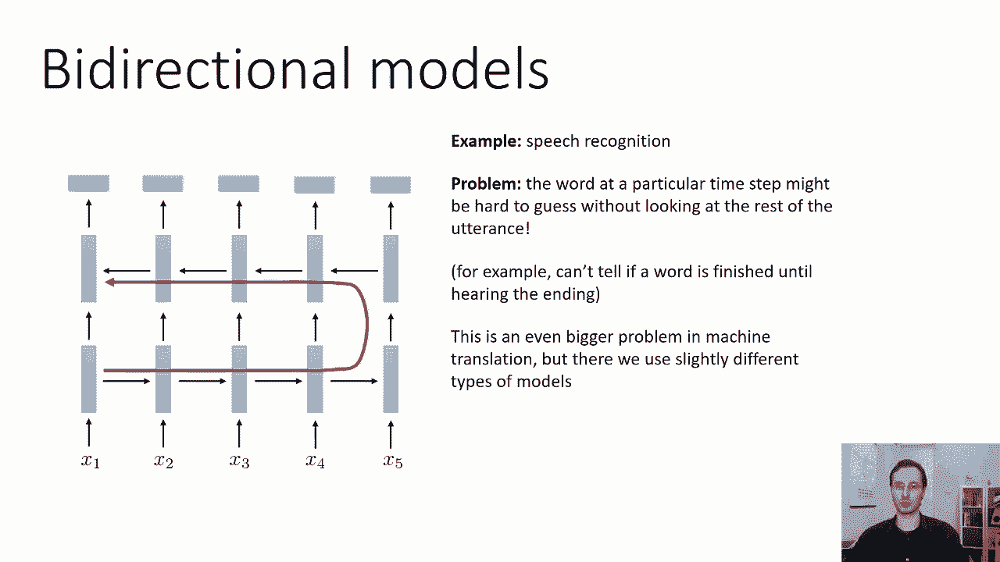
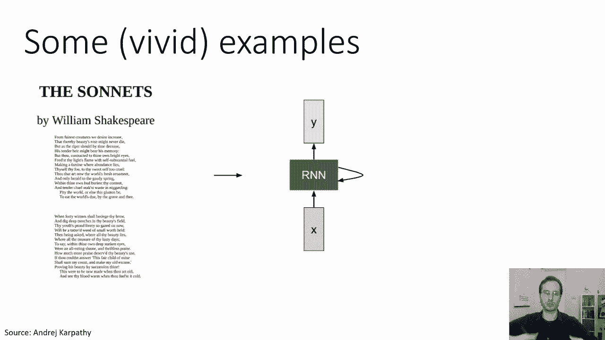
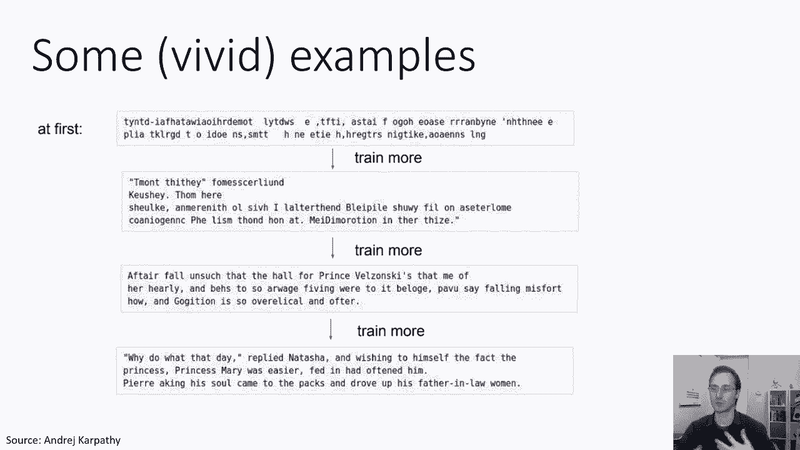
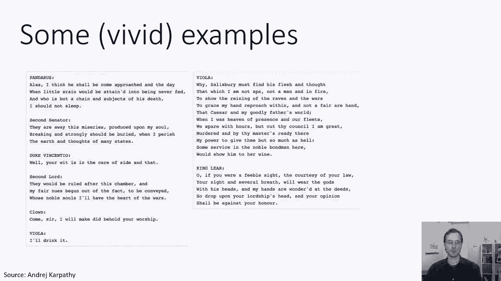
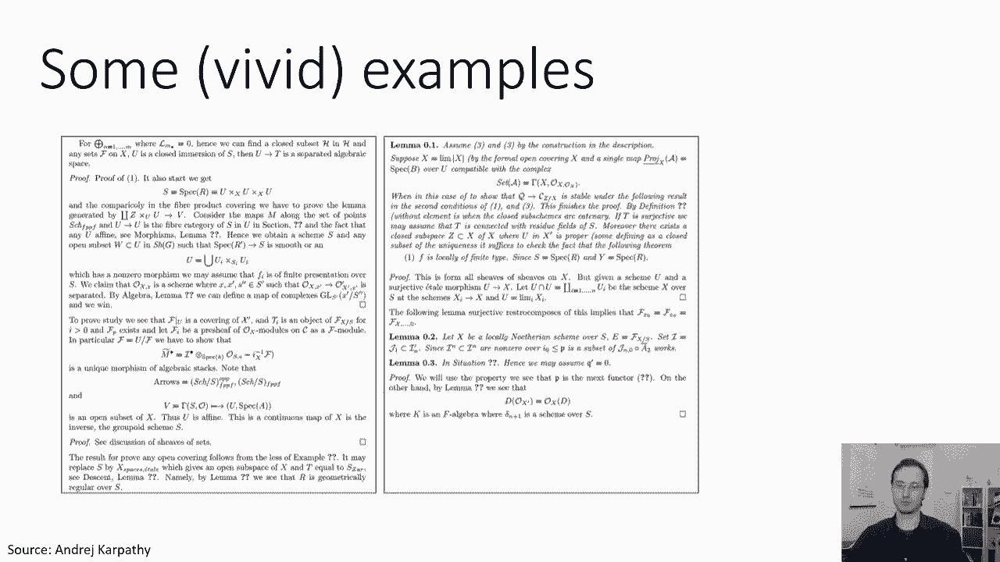
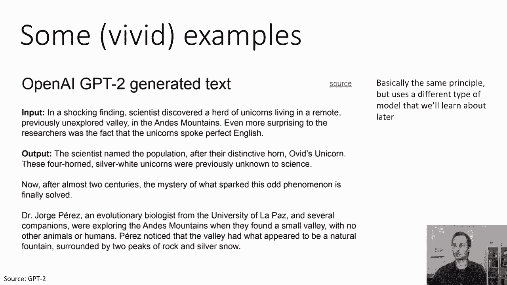

# P32：CS 182- Lecture 10- Part 3- Recurrent Neural Networks - 爱可可-爱生活 - BV1PK4y1U751

在今天讲座的最后一部分，我们将利用我们在，第一部分和第二部分，实际上谈论如何，我们可以使用RNNS来建立解决实际问题的实用模型，我们要讨论的第一件事实际上很重要，是自回归模型和结构化预测。

所以我简单地提到了，在上一部分的末尾，我们在实践中实际使用的大多数rns都有多个输入和多个输出，一开始这可能有点令人困惑，因为，我们想要解决的许多问题，实际上要么有单个输入和多个输出。

要么有多个输入的单个输出，那么为什么我们通常使用rnns，具有多个输出和多个输入，嗯，这是因为大多数需要多个输出的问题，这些输出之间有很强的依赖关系，这似乎是一个有点神秘的语句。

所以让我们试着让它更直观一点，这类问题有时被称为结构化预测，他们指的是结构化预测，因为你预测的事情，输出序列具有结构，与标签之类的东西形成对比，标签没有结构，标签只是单个离散变量的值。

如果你输出像文本这样的东西，文本具有内部结构，基本上与文本输出的答案是否正确分开，单词和文本之间的关系决定了它是否是有效的文本，所以基本上如果我问你一些问题，如果我问你，比如说，你知道你周末做了什么吗？

你可以告诉我，你会告诉我一些句子，你可以告诉我，我驾驶宇宙飞船去月球，现在，这不是正确的答案，那是那不是真的，那是假的，但这是一个有效的英语句子，你可以说，你知道我胡言乱语，紫色木琴，对呀。

那既不是事实也不是有效的句子，所以我们想要真实的输出，但我们也想要有效的输出，服从内部结构的，这就是为什么我们称之为结构化预测，所以一个经典的例子，这是文本生成，假设你有一个由三句话组成的训练集。

我想所以我是我喜欢机器学习，我不仅仅是一个神经网络，让我们暂时假设你不关心概括，你只想让你的模型基本上记住这三句话，我们将把单词看作范畴变量，所以每一步都会有不同的词，它只是，你知道的。

n个可能的单词中的一个，所以你的神经网络会读作输入，也许我们会提示，它会用句子中的第一个单词提示它，所以我们给它输入，然后我们要求它完成句子，它可以用三种不同的方式完成它，所以也许这是一个非常好的网络。

在第一次步骤，它知道基本上有三个词可以跟随，跟随这个词，我和他们的可能性差不多，像AM一样思考，这是每个句子中的第二个单词，然后我们在这些上有一个软最大值分布，所以软最大值把这些变成概率。

我们有零点三的概率思考，点赞零点三，m的零点四，然后我们将从这个Softmax分布中随机采样到，实际上选择第二个词，所以也许我们随机选择这个词，这么想现在网络正在完成句子，正如我所想的。

然后我们进行下一个时间步骤，所以我们计算，呃，你知道吗，我们有一个线性层，它使用以前的激活，计算新的激活，我们在第二步有输出，这又经历了一个SoftMax发行版，问题是网络不知道。

从那个软最大值中随机抽取了哪个单词，所以网络认为它产生了30%的输出，三成喜欢，和百分之四十的上午，不知道你在下一个时间步骤中取样了什么，它仍然会在这种可能的句子的叠加中，所以它会说，嗯，我告诉过你。

句子中第二个词的分布是什么，现在你问我，句子中第三个词的分布是什么，第三个词同样有可能，因此机器而不是对的，因为这是这些句子中的第三个词，所以网络正在做你要求它做的事情。

问题是你试图独立地对这些词进行取样，所以在第二步中，你要随机取样，或者你随机得到机器，然后第三个时间步，同样的，它给出了句子中四个单词的分布，你可能会取样，现在您的网络正在正确地执行所有操作。

你的网络实际上通过这三句话了解了分布，但你得到的完成度是，我想机器，只是为了让你们这一代人毫无意义，尽管网络实际上在学习这种分布方面做得很好，所以我们得到一个无意义的输出。

即使网络在每个时间点上都有完全正确的概率，这是因为在这项任务中，单词之间的协方差很重要，就像得到正确单词的概率一样，所以我们可以做些什么来解决这个问题，和。

这就是为什么拥有接收可变长度输入的网络如此重要，和可变长度输出，当我们实际运行这个网络来完成一个句子时，我们要做什么，我们要在第一步从SoftMax中取样，然后我们将在第二步输入我们的样本。

这基本上会告诉网络我们取样的是什么，所以现在网络知道它是，它不仅仅是预测任何句子中的第三个单词，它是在预测一个句子中的第三个单词，其中第一个单词是，我觉得，现在它会正确地预测，如果前两个字是。

我想第三个词可能是，它会对那个词进行采样，把它作为输入输入，然后完成第四个单词，最有可能的是我，所以说，然后它就会正确地生成，我觉得，所以我是，如果在第一步，它随机取样，然后在第二次台阶上。

它会给机器分配更高的概率，所以关键的思想是过去的产出应该影响未来的产出，和，你获得过去输出以影响未来输出的方式，就是把昨天的产出当作今天的投入，和，这个基本设计几乎用于所有的RN，必须输出结构化序列。

像图像字幕模型这样的东西，视频预测模型，他们都会使用这种模型，所以基本上你很少有多个输出没有多个输入，因为您希望过去的输出影响未来的输出。

现在我们怎么把这个东西训练好，最简单的训练方法，最明显的是将输入设置为整个训练序列，和地面真相输出是相同的序列，但偏移一步，所以基本上不是让神经网络在训练中想象一个句子。

你真的在要求它完成你在时间步上说的一个句子，把时间的所有单词从第一步到T，并在时间步t加一输出单词，所以你的X将是，句子中的所有令牌，除了最后一个，我想因此我很抱歉，句子中的所有令牌。

你的基本真相输出将是所有的标记向后移动一个，然后最后一个将被停止令牌替换，所以基本上这个网络被教导，如果它看到i，它应该输出，我想如果它看到了，我想它应该输出，因此，如果它看到。

我想因此我是它应该输出一个停止令牌，表示句子已经完成，这样在测试的时候，当你用这个来预测一个句子时，然后你最终会得到一个停止令牌，然后你知道网络用那句话结束了，所以这教会了网络，比如说，输出单词am。

如果它看到，我觉得。

因此，i，这是自动回归模型的基本设计，这个有点问题，我在上一张幻灯片上的基本设计，如果你用它来训练一个网络，很有可能，会很好用的，但如果你用它来训练非常复杂的网络，以适应非常长的序列。

你可能会开始看到一些问题，你可能开始看到的问题是由于一种叫做分布转移的东西，所以麻烦来了，假设你有和以前一样的例子，但是网络犯了一些小错误，所以也许对于第一个令牌。

它分配了60%的概率来思考30%的概率，比如，百分之十的概率是一些随机的词，让我们说这个词是驱动，为什么它做得那么好，也许它只是训练得不太好，可能会犯一些错误，你知道所有的模型都会在很小的概率上犯错误。

通常你不会担心这个，因为最有可能的代币实际上是一个非常合理的代币，但假设你在解码，你运气不好，你取样了这个词在实践中驱动的10%的东西，实际上可能发生的是你可能会得到一些输入，这和你以前看到的很相似。

但不完全一样，但在这个例子中你知道在这个例子中你现在有一个很低的概率，但这也是一个潜在的问题，现在您将在下一个时间步骤中使用此作为输入，在这种情况下发生的问题，网络以前从未见过此令牌用作输入。

只是一些随机的信物，它真的不属于这个句子，你在第一步上犯了个小错误，你还是可以恢复的，你仍然可以把这个变成一些合理的句子，问题是，您现在正在向这个网络提供一个令牌，这与我所看到的句子的完成是如此不同。

你知道的，也许您在另一个上下文中看到了这个令牌，但在这种情况下从未见过，这将是完全混乱的，所以在第二步，它会输出一些完全疯狂的东西，一些彻头彻尾的胡说八道，当它从那些完全胡说八道中取样时。

它基本上它是它为它做，它不会产生任何合理的东西，所以它会产生完全的胡说八道，因为它以前从未见过这样的输入，它不知道该拿它们怎么办，它没有产生合理的结果，这背后的问题是训练和测试之间的差异。

因为在训练过程中，网络总是把真实的序列视为输入，但在测试时，它突然得到了自己的输入，这可能是不正确的，问题不在于它一开始犯了一个小错误，那个小错误的问题使问题复杂化了，但到那时就变成了模型的错误输入。

如果我们不给它输入，它可能还会恢复它，可能，你知道吗，它仍然可能产生一个不完美的句子，它可能会说你知道，我开车，所以我是，但这至少是一个理智的判决，就像大部分句子都是合理的，但一旦它得到这个疯狂的输入。

它现在会产生完全的垃圾，因为它只是不习惯看到如此疯狂的输入，这就是所谓的分布转移，因为输入分布在训练时从真弦转移到测试时的合成弦，本质上，真字符串与假字符串的分布不同，网络被训练成以真字符串作为输入。

现在它正在假弦上测试，这不是它不习惯，因此它不能正确地处理，这是个大问题因为即使是在一个时间步骤中的一个随机错误，可以完全扰乱整个输出。

所以一个被提出来处理的解决方案，这实际上是受到一个用于训练RNN的强化学习的老把戏的启发，和嗯，至少在RNN世界中的方法称为强化学习中的计划抽样，它还有其他名字，当我们以后讨论模仿学习时。

我们会真正了解到这一点，这是预定取样纸上的图表，说明了训练中的基本思想，通常我们希望输入真实的字符串作为输入，但我们要做的是定期取样，我们将在时间的每一步都有一定的概率做出随机的决定。

我们会在那个时候给网络真实的输入步骤，用1减去这个概率，我们现在实际上会把它以前的输出作为输入，关键是我们不能通过这条边缘区分，所以网络不知道它得到了自己的输出作为输入，这非常重要。

因为通过随机抽样来区分是非常非常困难的，所以你基本上可以把这看作是随机的，在上一个时间步用网络自己的输出替换真实输入，有一定的概率，这真的很有帮助，因为现在在训练的时候，网络将自己的输出视为输入，因此。

当它在测试时看到，它现在不是完全糊涂了，它还是不知道怎么改句，所以基本上这会教会它说，我开车，所以我现在是我开车吗，所以我是一个合理的判决，嗯，可能不是，如果它训练得很好，它最终会停止说驱动。

开始说东西，但它仍然有助于弥补许多错误，它基本上会让它恢复，它不会以非常优雅的方式恢复，但总比完全失败要好，所以现在这里有一个思想练习，我们要如何选择这个概率，用于用模型自己以前的输出替换真实输入。

所以如果我们总是用模型以前的输出替换真实的输入，这个模型可能真的很难训练，因为在早期，该模型主要产生垃圾，所以在第一个步骤中，它会得到一个真正的单词作为输入，然后在未来的时间台阶上有一堆垃圾。

我们可能会学会忽略输入，只是生成任意的单词，所以这不好，那不是我们想要的直觉上我们想要的是，我们希望在开始时主要输入真正的输入，一旦网络变得很好，这样它的输出在最后实际上是有意义的。

我们希望主要提供模型自己的预测，以减轻这种分布转移，那么本文作者推荐的，这就是为什么他们称之为预定，抽样是对这个概率制定一个时间表，在这种情况下，使用真实输入的概率开始很高，然后逐渐下降。

由于使用模型输出的概率为1，减去这一点，这意味着随着时间的推移，你逐渐减少使用真正的输入，模型的输出更多，他们提出了许多不同的时间表，你可以尝试，像线性时间表或指数时间表，但它们的味道都是一样的。

使用真实输入的概率一开始就很高，然后在训练快结束时下降到零，在训练结束时，您主要是在训练网络自己以前的输出，当然除了，对于第一个输入，它总是来自数据。

嗯，所以这是一个简短的旁白，并在实践中，呃，你不必使用计划抽样，特别是对于较短的序列或较容易的模型，你经常可以通过定期训练逃脱惩罚，但是计划采样确实有助于更复杂的模型。

现在我们可以以多种方式在a中使用rnns，RNN的一大优势，它们提供了很大的灵活性，所以有了常规的前馈网络，你基本上有一对一的映射，所以一个输入，一个带有RNN的输出，您可以有一个输入到多个输出。

多个输入到一个输出，多输入多输出，您首先读取所有输入的地方，然后产生所有的输出，以此类推，所以这第一个一个对很多，那是，你知道的，也许很适合像图像字幕这样的东西，其中输入是图像，输出是文本序列。

许多对一个可能很适合像活动识别这样的东西，其中输入是视频中的帧，输出是对该活动进行分类的标签，你知道，打篮球或赛车，许多对许多，呃，您首先读取所有输入的地方，然后产生所有的输出。

这可能是机器翻译之类的好设计，因为您可能希望用英语读取整个字符串，然后用法语制作整个弦，你不想逐字逐句地把英语翻译成法语，你想在整个句子中读到，然后翻译它的意思，而且这种很多，太多太多的设计。

我很抱歉德克萨斯将切断，对一些人来说，这可能是一个很好的设计，可能是帧级注释，因此输入是视频中的单个帧，你想用现在帧中发生的事情来注释每一帧，正如我之前在实践中提到的，如果你有很多输出。

你实际上会有很多输入，所以在现实中，一对多和多对多可能会像这样实现，因为你想有一个自动回归的过程来产生这些输出，这实际上是我们在现实中看到的。

现在让我们简要地讨论一些实现细节，我们经常用RNN做的事情之一，我们的模型中有一个RNN主干，在中间的某个地方，然后我们使用一个非循环编码器，如果你有像视频这样的图像输入，这尤其常见。

所以你可能有一个规则的卷积网络，然后馈入RNN，因此卷积编码器被放置在RNN层之前，这在图像输入中是非常常见的，现在你也可以有某种复杂的解码器，因此，您可以将RNN或LSTM单元的输出，并将其送入多层。

在产生输出之前，可能有多个完全连接的层，那也是，你知道的，有时做，这有点不常见，因为您可以使用更多的rnn层，这样前馈编码器，使用卷积层之类的东西是很常见的，特别是对于图像，有时使用多层解码器。

但有点不常见，现在您还可以有多个RNN层，这是完全合理的，所以基本上你可以在特定的时间步长获得rnn层的输出，馈入另一个RNN层，然后最终进入软麦克斯，因此很容易根据需要堆叠尽可能多的RNN层。

您甚至可以实现循环或LSTM卷积层，所以如果你真的想让你的网络在每一层都完全循环，你真的可以做到，你实际上可以使你的卷积循环，我也是，在计算上有点贵，但概念上很简单，基本上你对LSTM有这个操作。

这是LSTM中唯一使用学习参数的操作，你只要用卷积代替这个，所以我把它放在幻灯片上，这是一个矩阵乘法，但你会做一个卷积，这基本上意味着每个过滤器都变成了一个小的LSTM单元，因此。

每个滤波器都接受其当前的接收场作为输入，和之前的HT减一，你可以把它们想象成。

现在，您可以使用rnns的另一个技巧是称为双向模型的东西，让我们用一个像语音识别这样的例子，所以在语音识别中你的输入是声音序列，你想产生相应的单词，现在，大多数情况下。

在特定的时间步骤中的单词将取决于顶部的，在萨拉特上，那个时间步，但不完全是因为有时声音的其余部分会影响单词，你觉得，这是因为你知道演讲往往是含糊不清的，它不仅仅是在时间上整齐地排列。

所以问题是这个词在特定的时间步长，如果不看整个话语，可能很难猜到，所以你真的想要未来时间步骤的声音来通知你的猜测，关于当前时间步长下的单词，比如说，你可能无法判断一个单词是否完成，直到你听到帧的结尾。

这是一个比机器翻译更大的问题，现在我们可能会使用稍微不同类型的模型，但这种双向模型可能工作得太对了，因为在机器翻译中，你不想逐字逐句地翻译，你想看到整个话语，然后翻译它，所以双向模型基本上是一个RNN。

其中首先有一层循环连接向前运行，然后你在它上面有另一层向后运行，这意味着在每一步你都有来自过去和未来的信息，然后你，然后你有一个软最大层，输出答案，所以你向前传球的方式。

在这个双向RNN中实际上是这样的，所以在你可以在第二步产生输出之前，您必须通过步骤三运行底部RNN，四和五，这样您就可以通过步骤5开始向后运行rnn，四，三和二，现在你有了处理当时答案所需的一切步骤。

所以实现明智，这真的很简单，呃，从底部的RNN服务输出y帽，作为输入到顶部RNN和反向传播的工作方式完全相同，使用我在第二部分中描述的反向模式自动差分，所以实现明智，其实实现起来很简单，在概念上。

可能需要一点时间来把你的头缠在一起，这东西到底在做什么，但它真正做的是，它允许你整合过去和未来的信息，当你想在一个特定的时间步骤做决定时，所以这实际上是一个更强大的模型。

尤其是在你想要未来的信息来做出更明智的决定的环境中。

在现在，这是讲座的技术部分，现在我想通过几个例子，你知道RN在实践中做很酷的事情的生动例子，这些是安德烈·卡帕蒂的一些例子，他使用lstms学习生成，对于各种不同的数据类型，所以在这里你训练一个RNN。

莎士比亚文集，所以他只是拿了一堆莎士比亚戏剧的文本，等。

用他们在这里训练RNN，呃，这实际上是我认为来自其他一些文献，但原理相似，在这里，他展示了模型在训练的不同阶段的输出，所以在训练的早期，它只是产生了一些垃圾字符，后来，它开始产生看起来更像文字的东西。

然后它就开始了，你知道，主要是说合理的话，有几个拼写错误，然后最终一个人得到了整个短语，甚至看起来合理的句子。

然后他用这个来生成一种假的，假莎士比亚，基本上，如果你仔细观察，你可以看出这显然不是一部真正的戏剧，它确实放入了角色的名字，但名字并不完全合理，也许这就是从朱利叶斯·凯撒身上学到的东西，嗯。

然后你有像公爵文森托，现在，那真的说不通，不同时间段，但在高水平上，呃，这是一种明智的游戏，喜欢看文本，现在。

这是几年前，这是在二十六年左右，呃安德烈，我也做了一些，你知道，更多愚蠢的实验，在那里他下载了代数几何教科书的LX源代码，他让他的RNN基本上生成假法律技术。

那个假拿铁实际上可以编译成一个真正的PDF文件，就像，假定理和假引理之类的，等等，现在如果你愿意，如果你真的关闭这些引理，在其中一些证明上，他们没有意义，就像，比如说，引理零点三表示情况问号。

因此我们可以假设q素数等于零，那是无效的限制语句，但在高水平上，它实际上看起来有点，你知道的。

像一个像一个明智的逻辑这些天，呃，这些类型的生成模型变得更加复杂，这是一个叫做GPT Two的模型中的一些例子，这实际上不是一个RNN，它实际上是一种不同类型的模式来改变谷歌发明的A，但在这里。

它被以类似的方式使用，有一个输入提示符，呃，这些文本是由一个提供给模型的人写的，上面写着，在令人震惊的发现中科学家们发现一群独角兽生活在一个偏远的地方，安第斯山脉中以前未被探索过的山谷。

更让研究人员惊讶的是，独角兽能说一口流利的英语，这是一个人类写的文本，然后告诉模型，看这篇课文，然后完成它，基本上生成更多的文本，这些文本似乎是遵循这个提示的文本，其余的由模型生成。

上面说科学家们以他们独特的角命名了这个种群，奥维德独角兽，这四只有角的银白色独角兽以前不为科学所知，现在在将近两个世纪后，引发这一奇怪现象的谜团终于解开了，豪尔赫·佩雷斯博士，拉巴斯大学的进化生物学家。

和几个同伴在安第斯山脉探险，当他们发现一个没有其他动物或人类的小山谷时，等，所以你可以看到模型实际上在做一些非常明智的事情，在语法和结构方面，也许更令人惊讶的是，它实际上得到了一些语义细节。

一些非常微妙的细节，比如，比如说，生物学家有一个似是而非的名字，拉巴斯大学一位科学家的名字，谁会在安第斯山脉工作，对呀，所以它没有像一些，你知道的，听起来像南亚人或东亚人的名字，或者欧洲的或者西欧的。

或者盎格鲁撒克逊人产生的，对某人来说听起来似是而非的名字，呃，你知道吗，一所大学将暂停，所以即使是像这样微妙的细节也被捕捉到了，所以我们将讨论这些类型的模型，在后面的课程中，当我们谈论NLP时。

我们会有更多。

所有的权利，简单总结一下递归神经网络的要点，这些是可以处理可变长度输入和输出的神经网络，你可以把它们想象成每一层都有输入和输出的网络，你可以把它们看作是基本上可变深度的网络，或相当。

你可以把它们看作是有时间概念的网络，非常努力地训练rnis，你有消失和爆炸的渐变，但是您可以使用特殊类型的RNN设计，如LSTM和GRU，在一定程度上普遍解决这些问题，虽然。

您仍然需要花大量时间调优超参数，让他们好好训练，在实践中，我们几乎总是在每一步都有输入和输出，这是因为我们通常想要结构化预测，所以如果你想要可变长度的输出，您希望将以前的输出作为输入。

允许网络捕获时间依赖关系，然后可以使用计划采样来处理结果的分布移位，有许多用于各种目的的RNN变体，序列到序列模型，通过方向模型等，你甚至可以清除一个卷积层。

如果你想这样rnare一个非常灵活的基本设计，这是我们要建立的基本基础。

