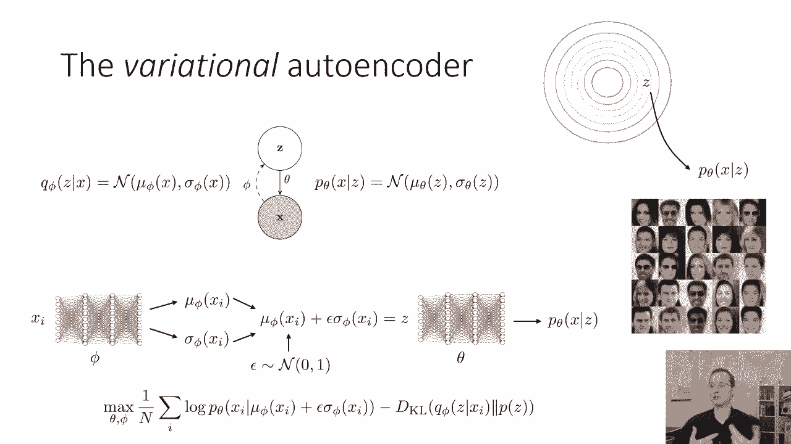
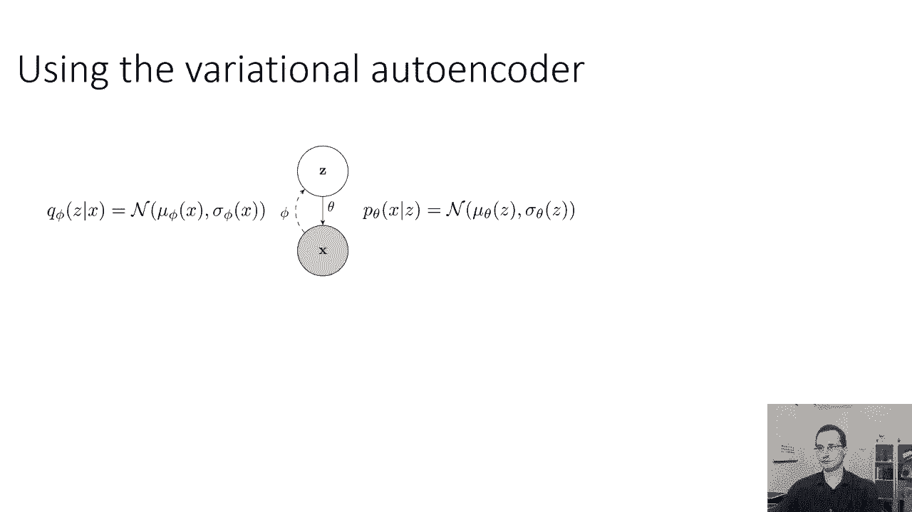
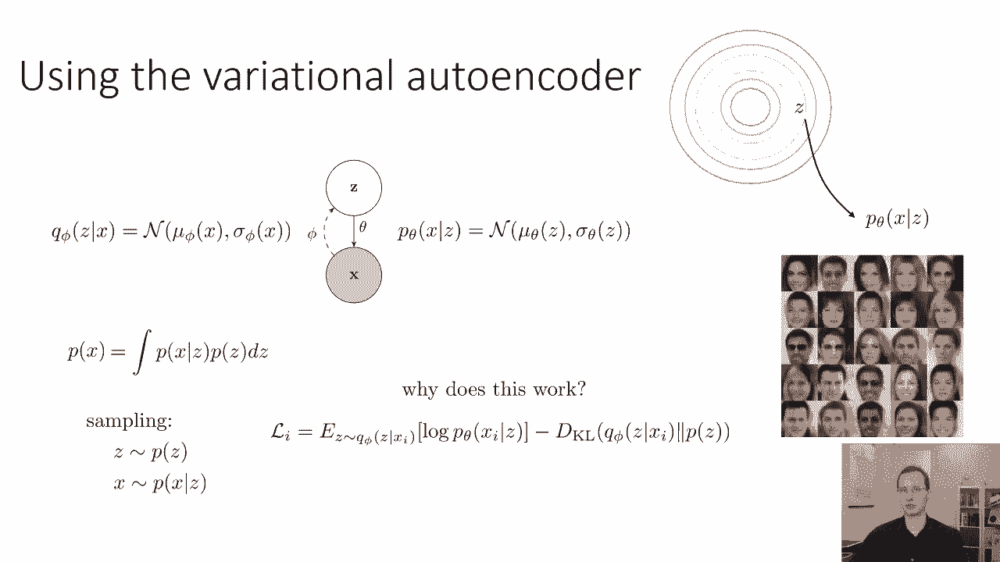
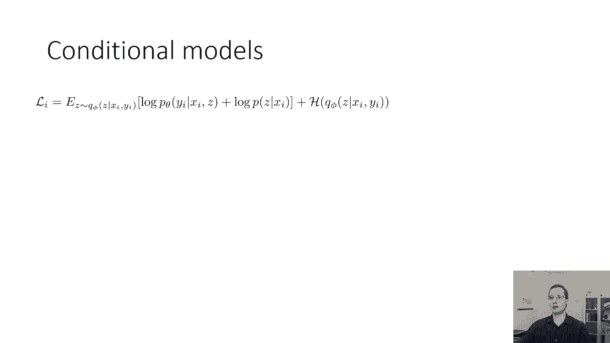
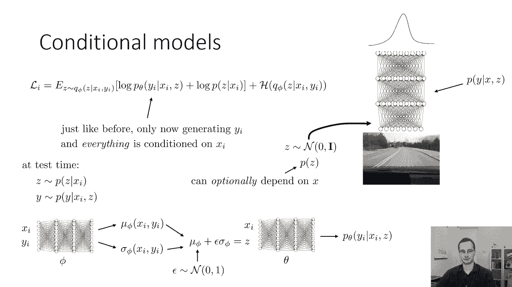
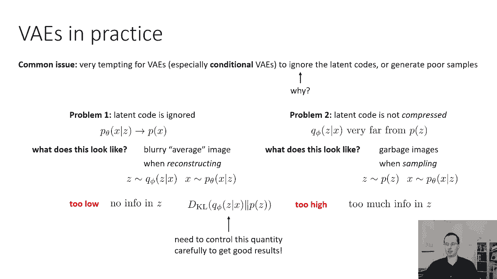
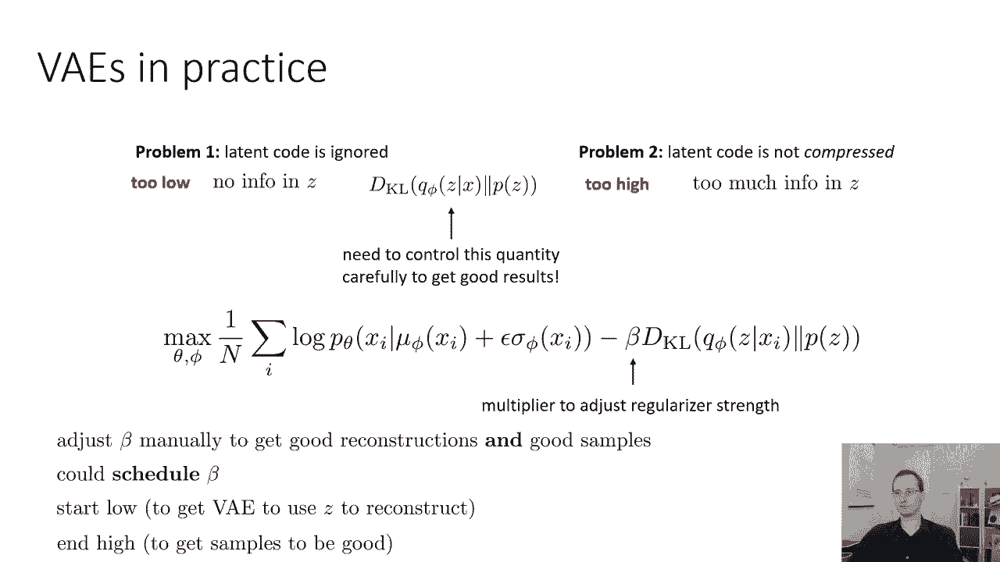

# P56：CS 182- Lecture 18- Part 3- Latent Variable Models - 爱可可-爱生活 - BV1PK4y1U751

好的，现在，让我们把东西放在一起，通过完整的变分自动编码器，所以变分自动编码器是一个潜在的变量模型，具有高斯先验的潜在变量z，它观察到变量x，可能是一个图像，它有一个编码器来执行推理，也就是q5。

给定x，q，i，of，z，给定x，是一个神经网络，它吸收x，它产生了z上的平均值和方差，给定z，x的解码器pθ接收a z，它产生了x上的平均值和方差，因为这基本上意味着图像中每个像素的平均值和方差。

独立，所以你可以把它看作是一个正态分布的球形潜在变量，你从那个潜在的变量中取样，然后在给定z的情况下生成x的pθ。

您可以使用变分自动编码器，在他们被训练实际生成新图片后，与去噪自动编码器形成鲜明对比，或瓶颈自动编码器，它可以学习表示，但不能生成，所以说，在这里你看到的是面孔的照片，实际上是由变分自动编码器生成的。

它是通过使用我在上一节中展示的体系结构来训练的，然后经过训练，你只需从先前的Z中取样，从呃从z的p，然后使用解码器生成图像，这部分不使用编码器，这是我在前一部分向你们介绍的建筑，目标是这样的。

所以你会注意到目标的第一部分，基本上看起来像一个自动编码器，通过μ+ε乘以sigma得到z，然后解码得到x上的结果分布，你试图最大化真实图像的概率，你在这个分布下编码的那个。

所以这是第一部分是自动编码器的目标，第二部分可以被认为是一种惩罚，这惩罚了给出多少z的q i，从这里，我们可以推导出一点直觉，关于变分自动编码器工作的原因。

所以所有这些关于变分推理的数学给了我们数学基础，但直觉是，因为那是第二个，kl，分歧项，鼓励编码的Z看起来与来自Z的P的样本相似，通过制造类似的东西，创造了一个在测试时，如果你从z的p中取样。

解码器会知道如何处理这些Z，他们对解码器来说会很熟悉，我们就能把它们变成现实的首字母，因为在训练的时候，编码器被鼓励产生与先前相似的Z，因此，解码器被训练使用Z产生合理的图像。

那么我们如何使用变异编码器，嗯，变分自动编码器近似于这种潜在的变量分布，所以如果我们想从中取样，我们只从先前的p中采样z，然后从给定c的x的p中采样我们的图像，为什么它工作得很好，它之所以有效。

是因为正如我在KL分歧项之前所说的，目标中的第二个术语，鼓励编码器产生这些看起来类似于Z的，我们将从Z的优先级中得到。

现在我们还可以用变分自动编码器训练条件模型，这实际上是相当简单的，如果你有一个条件模型。

然后将x映射到某个输出变量y，如果给定x，你希望y的p是一个相当复杂的分布，我们用和以前一样的直觉，给定x，y的p可能是复的，但是给x逗号z的y的p是简单的，所以现在我们的解码器给我们y给定x逗号c。

我们的编码器给我们c给定x逗号y，所以一切都和以前一样，只是现在我们生成x，所有的东西都是有条件的，现在我们生成y，一切都以x为条件，那是，这是我们唯一要做的改变，你可以这样做，比如说。

如果您想要一个多模态策略和模仿学习，或者如果你想要一个可以生成图像的VAE，对其他信息的条件，比如说，为特定类别的对象生成图像，所以架构很简单，就像在你有接收x和y的编码器之前。

这就产生了mu和sigma，就像在你品尝你的噪音之前，用μ+epsilon乘以sigma得到z，然后你有一个解码器，解码器现在也接收x和z并产生y，所以一切都以x为条件，然后Y是自动编码的内容。

这给了你一个条件，逗号z，你有一个选择，所以这可能是另一个神经网络，或者你可以有一个固定的先验，所以z可以按照无条件分布来分布，这是你可以做出的设计选择。

所以这是一个变体自动en的条件，现在，让我们更多地谈谈神经网络的体系结构，用于变分自动编码器，特别是我们如何设计具有卷积的变分自动编码器，让我带你了解一个潜在的架构，我们可以用于V，带卷积的d。

所以你有你的形象，首先你的图像必须进入编码器到Q文件，所以假设你的形象是六十岁，四乘六十四乘三三色通道，也许你的第一层有五乘五的conv和三个两个通道，它有两个步幅，因为我们需要降低一点分辨率。

这意味着你的第一张卷积图将是30乘30，三十二，然后你就有了一个3乘3乘64的圆柱，你会得到一个14乘14乘64的反应图，然后你就有了一个三乘三乘一二八列，你会得到一个六乘六乘一二八的反应图。

然后你把它压平，穿过一个完全连接的层，假设你得到一个完全连接的层，一千零二十四个单位，这绝不是您使用的唯一体系结构--只是一个示例体系结构，只是向您介绍一个到目前为止的示例。

一切都和任何其他卷积自动编码器一样，但现在我们将有一个完全连接的层，输出亩，和另一个输出西格玛的完全连接层，假设这两个的维度都是2，5，6，所以我们从六个维度中选择两个作为隐藏代码的维度数。

然后我们要取样我们的正态分布epsilon，所以他们是，所以说，它是一个向量，其中每个条目都是从正态分布中采样的，均值为零，方差为一，这个矢量的长度是多少，花点时间想一想，猜猜向量的长度是多少。

向量的长度需要与Z的维数匹配，所以会是2，5，6，然后我们用西格玛乘ε，然后我们把这个，这就给出了Z的维数，嗯，这和穆一样，西格玛·埃普西隆将是2，5，6，这是我们的瓶颈表示，如果我们想做。

如果我们想使用变分自动编码器进行表示学习，比如说，用于下游分类任务，这是我们将用作图像压缩表示的向量，所以如果我们想在此基础上训练一些分类器，我们会在Z上面训练，但是为了训练VA，现在我们还需要解码器。

对于解码器来说，我们将使用转置卷积，所以也许首先我们有一个完全连接的层，这将Z提升到更高的维度，比如1024，然后我们可能有三层转置卷积，一路采样回到64乘64的图像，然后我们训练这整件事。

使用两个损失项进行端到端反向传播，图像的负对数概率，由mu z和sigma z确定的分布之间的kl散度，和我们先前的p of z，这通常是零平均单位方差，高斯，还要记住，我们的解码器实际上输出，呃。

每个像素可能有两个数字，均值和方差，所以两个数字或者解码器可能只输出每个像素的平均值，方差可能固定在某个固定的数字上，比如1，比如说，我们也可以有一个离散解码器，我们也可以输出，让我们说。

每个像素的256路SoftMax，或者更复杂的东西，就像离散的逻辑，正如我们在周一的讲座中所描述的那样，现在有一个问题需要你思考，我们能设计一个完全卷积的，这个建筑有点像。

我们在课程开始时看到的一些完全卷积的网络，当我们谈到语义分割时，我们能不能设计一个全卷积变分自动编码器，答案是我们实际上可以机械地非常简单地，我们会有一个mu和sigma的卷积响应图。

我们将对Epsilon的卷积响应图进行采样，所有的操作都是完全相同的，但你做这个的时候要小心一点，因为你先前的z的p有一个单位协方差，这意味着你假设你的潜在代码是独立的，沿着它们的所有维度，因此。

虽然实现完全卷积的va非常简单，这往往不是一个好主意，因为，卷积响应图中的值不太可能，彼此独立，你的前任是独立的，所以你可能很难最小化KL发散，使用完全卷积的VE是完全可能的，人们已经做到了，但请记住。

它有一些概念问题。

现在对AES在实践中的几点评论，这些是你可能会看到的一些常见陷阱，当您尝试实际使用变分编码器时，一个常见的问题是对Vees来说很有诱惑力，特别是有条件的，忽略潜在代码或生成糟糕的示例。

为什么这种情况--尤其是对有条件的，为什么忽略潜在的代码很有诱惑力，为什么忽略Z很有诱惑力，原因是，如果你能用一个规则的高斯分布来近似你的x，做这件事容易得多，尤其是对有条件的人来说。

因为最初Z看起来像噪音，所以弄清楚如何使用C可能很难，尤其是当你的目标，使Z看起来更像先验分布，所以它很想拉，将Z分布一直推到先验，使它完全没有信息，因此毫无用处，所以V有两个问题，当他们在训练的时候。

一个是忽略潜在代码，这意味着你的x的p给定z开始看起来像x的p，基本上它忽略了Z，你怎么知道这是怎么回事，嗯，当您对特定图像进行编码时，您可以看出这是发生的，你解码它。

你得到的东西看起来不像你编码的图像，基本上是编码一些东西，然后再解码回来，在重建时产生一种模糊的平均图像，所以这和取样无关，只是当你重建图像时，你会看到这个，你把x编码到q phi。

然后你通过pθ解码回来，你得到的图像看起来不像你放进去的东西，相反，它看起来有点像模糊的平均图像，就像你数据集中所有图像的平均值，所以当你取z时，根据q5，z给定x，根据pθ取x给定z。

你得到一个模糊的平均图像，这意味着您的潜在代码可能会被忽视，你可能会遇到的第二个问题，这是一个非常不同的问题，潜在代码没有被压缩，在某些方面，这是相反的问题，在这种情况下，给定x的z的qφ离z的p很远。

如果这就是你的问题，你的重建会看起来很棒，这基本上就是问题所在，其中变分自动编码器太像恒等函数，看起来怎么样你的重建会很棒，但是当你从p中取样时，当你从p中取样时，然后解码你会得到垃圾。

你会得到一个非常丑陋的不切实际的形象，所以如果你有第二个问题，这意味着你的重建看起来很好，当你用z的p而不是给定x的q5，然后解码你得到的废话，这两个问题可以用不同的kl散度值来表征，这是第二个术语。

羽衣甘蓝分歧惩罚在你的VA目标，所以我现在要告诉你，对于其中一个问题，kl散度太低了，因为另一个太高了，你能猜出哪个是哪个吗，对第二个问题来说太低还是太高了，是太低太高还是太高，花点时间想想这个。

你可以暂停视频，再考虑一下，然后当你准备好看到答案的时候，您可以继续观看讲座，所以答案是对于第一个问题，它的典型特征是kl散度太低，通常如果问题一发生，那么q 5 z给定x基本上忽略x。

只输出一个零均值，和一个单位方差，这意味着Z没有关于X的信息，这意味着你的解码器Pθ不使用Z，这就是为什么它产生那些模糊的平均图像，Z中没有对实际重建X有用的信息，问题二的特点正好相反。

羽衣甘蓝网络太高了，这意味着有太多的信息被打包到Z中，它与先前的相去甚远，这意味着你可以完美地重建X，而是因为它与先前的相去甚远，当你从先前的Z中取样时，你的解码器不知道该怎么处理它。

理解这两个问题是非常重要的，这两个问题是非常不同的，因为如果你在VAE中遇到这样或那样的问题，解决方案通常非常不同，所以这意味着你需要非常小心地控制羽衣甘蓝的分歧，才能得到好的效果。

那么我们怎样才能做好呢，为了使VA的训练更有效而使用的一个非常常见的技巧，就是在KL发散之前放一个乘数，按惯例，我们通常用字母beta来表示这个乘数，它只是一个标量值，你选择的是一个超参数。

你调整这个超参数，取决于您看到的问题，所以如果你有第一个问题，如果你的Z被忽略了，然后你需要羽衣甘蓝的发散度更高，这意味着你减少了贝塔，你让KL发散变得不那么重要，使va可以自由地提高kl散度。

而不招致那么多的惩罚，如果你看到问题二，这意味着你的KL分歧太高了，你需要更积极地把它往下推，这意味着你增加了贝塔，这将使您的样品质量更高，所以这就是为什么理解这些问题中的哪一个是非常重要的。

你看了你的重建，如果你的重建不好，低贝塔，然后看看你的样品，如果你的指示很好，但你的样品不好，然后提高贝塔，通常，您可以手动调整测试版，以获得良好的重建和良好的示例。

但有时很难找到既能产生好样本又能进行好重建的测试版，在训练的早期直觉，在训练的早期，B A需要学会注意Z和以后的训练，它需要做一个更好的压缩工作，这样你就可以取样了，在训练过程中。

实际安排测试版来改变测试版通常是非常有用的，比如说，你可以从非常低的beta值开始，这样VAU就可以学会使用Z，然后提高贝塔，以获得良好的样本，所以一旦你的重建看起来很好，你可以增加贝塔。

然后你的样品也会变得更好，所以当你训练DS的时候请记住。

