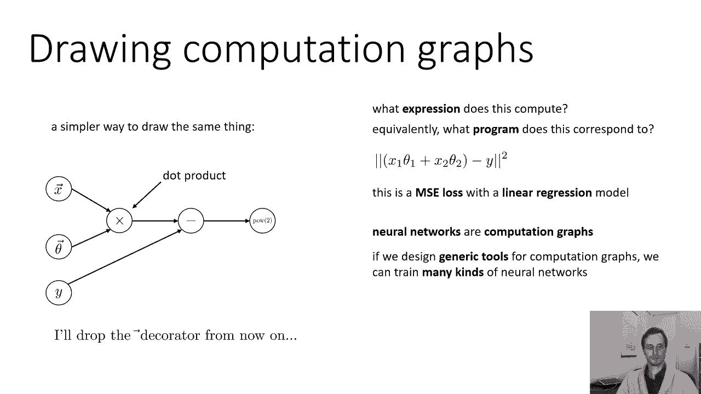
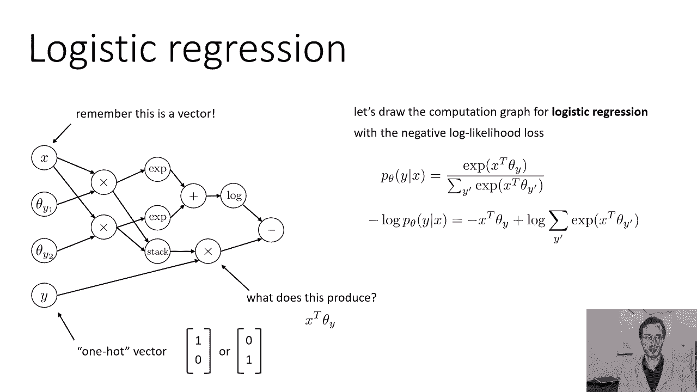
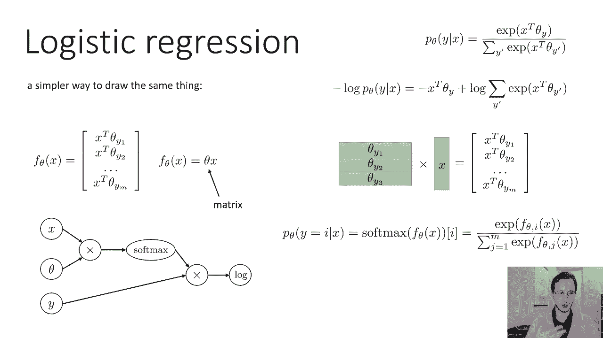
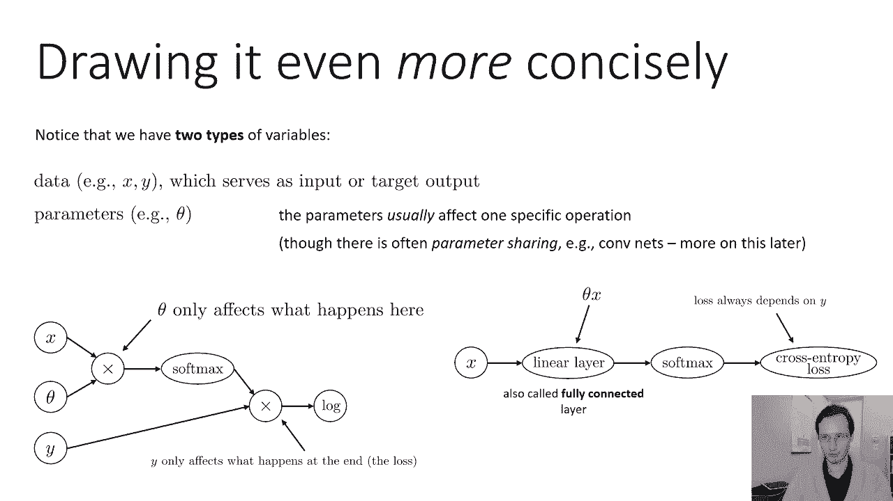
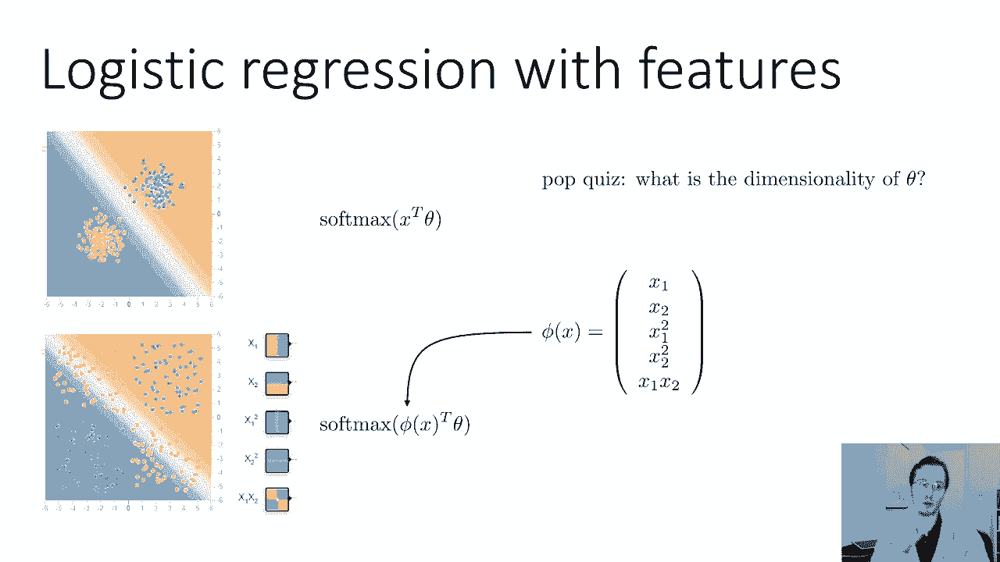
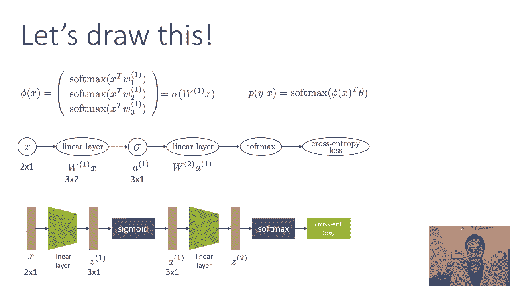
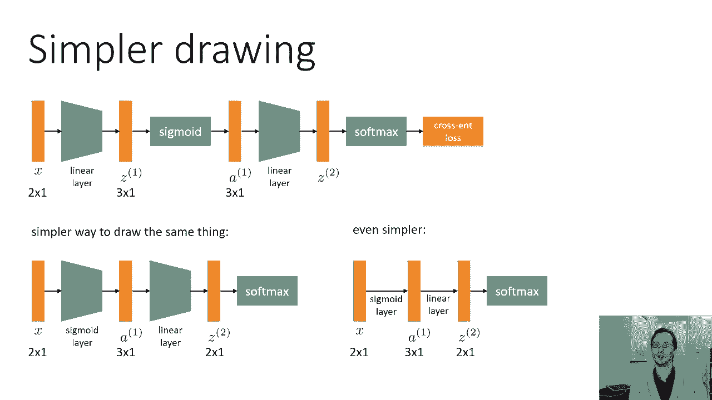
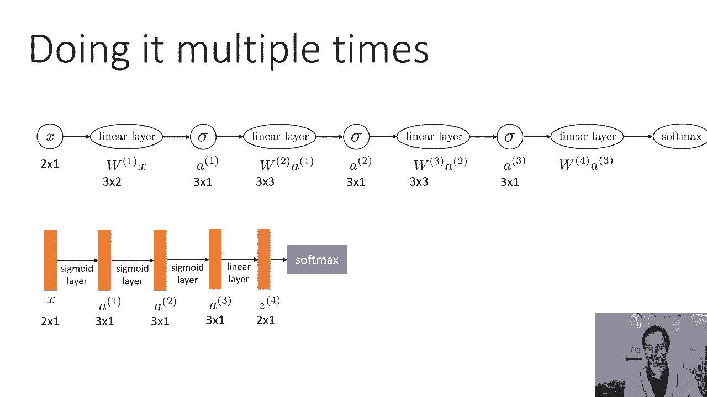
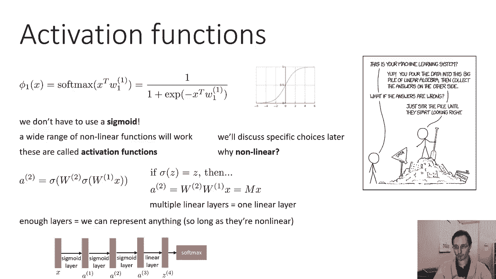
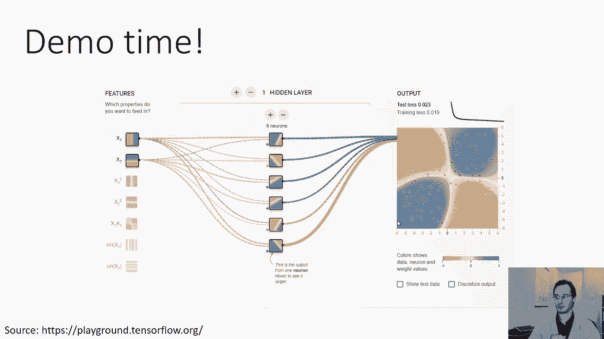

# 【双语字幕】伯克利CS 182《深度学习：深度神经网络设计、可视化与理解》课程(2021) by Sergey Levine - P14：CS 182- Lecture 5- Part 1- Backpropagation - 爱可可-爱生活 - BV1PK4y1U751

欢迎来到今天的课程五，我们将讨论反向传播和神经网络。

所以在我们描述神经网络是如何工作的之前。

我们需要谈谈计算图，见，正如我之前提到的，我们正在学习的所有这些机器学习算法，它们基本上是一个带有一些参数的程序，我们可以可视化这个程序的方法之一是画一个图表，表示计算流。

这对理解神经网络是如何工作的非常有用，后来用于开发自动计算神经网络梯度的算法，这样我们就可以使用我们在上一节课上学到的梯度下降算法，下面是计算图的样子，假设我们有两个输入，x1和x2。

所以这基本上是一个二维的向量，假设我们有两个参数，θ1和θ2，计算图是一个有向无环图，其中节点对应于数学运算，所以这里，比如说，我们有两个乘法节点，乘法接受两个输入，两个数字相乘，所以呃。

这里我们计算x乘以θ，x 2乘以θ2，然后也许我们把计算结果加在一起，也许我们也有一些地面真理标签Y，我们将从计算结果中减去标签y，然后把相应的量平方，所以这个计算图描述了一个程序或函数。

它能很好地描述哪个程序或功能，花点时间想想这个，这个计算什么表达式，或者等价地，这对应于什么程序，是我们在上一节课中看到的一种特殊类型的模型，花点时间想想可能是什么，所以这个计算图表示线性回归，对呀。

我们计算x乘以θ1，加x 2乘以θ2，那是我们的模型，这是我们对正确回归的估计，呃输出，然后我们减去y，平方差值，这给了我们均方误差损失，这是线性回归模型的均方误差损失，一般来说。

当我们为神经网络或其他类型的模型绘制计算图时，我们真的在画一个结合损失函数的图表，所以在图的末尾，结果应该是表示损失的标量值，因为那样，当我们要使用一些优化算法，如梯度下降。

我们将通过整个计算图计算梯度，这就给了我们梯度，我们需要优化我们的损失，所以神经网络是计算图，尽管它们通常要复杂得多，和比我在这张幻灯片上的大得多的计算图，在我们真正绘制神经网络的计算图之前。

我们需要谈谈向量和矩阵，在我们这样做之后，我们可以为计算图设计通用工具，然后用这些工具训练许多不同种类的神经网络用最少的额外工程。

所以让我们画一个和之前一样的线性回归图，但通过使用向量，方法要简单得多，现在我有一个节点x，它现在表示两个条目x1和x2的向量，我将有一个节点θ，它也表示一个有两个条目的向量，θ1和θ2。

现在我也有一个乘法节点，只是这次的乘法是点积，这意味着我要做x转置θ，所以两个向量相乘基本上是内积，或者这两个向量的点积，然后我减去我的标签y，我平方差值，这与我之前展示的计算图完全相同。

只是现在它用矢量表示法写得更简洁了，在后面的幻灯片中，我实际上会画一个小呃，符号顶部的矢量修饰符，你应该假设除非另有说明，x和θ等等都是，向量。

好的，这是线性回归的计算图，逻辑回归呢，如果你还记得第二课，Logistic回归是一种分类算法，Logistic回归预测离散标签，和我们谈到的损失函数，当我们讨论逻辑回归是负对数似然时，所以说。

让我们画出逻辑回归的计算图，负对数似然损失，因此，Logistic回归的标签分布由SoftMax给出，将SoftMax应用于线性模型，然后如果你取这个的对数，并对其进行否定，得到负对数似然损失。

方程可能看起来很复杂，但我只是通过取上面概率的对数得到的，然后否定它，因此Logistic回归的负对数似然损失为负，x转置θy，其中它们y是与真标签y相对应的参数向量，加上x的指数之和的对数。

为所有标签转置theta y prime，y素数，所以这来自分母，我如何获得这个表达式，嗯，我们可以取一个比率的对数，它变成分子的对数减去分母的对数，分子的对数正好是x转置θy。

但是因为我必须否定它才能得到负对数可能性，这就是负号的来源，所以让我们画一个计算图，我们有X，正如你现在所记得的，是一个向量，我们有他们，它是标签一的权重向量，我们有他们两个，它是标签二的权重向量。

假设他们只有两个标签，所以我们取内积或者x和θy 1之间的点积，我们取x和θy 2之间的内积，然后我们把这两个叠好，所以内积给了我们一个数字，标量值，我们有一个标量值作为标签Y的内积。

另一个数字表示标签Y2的内积，这样我们就可以把它们堆叠成一个有两个条目的向量，那么我们就有了真正的标签，Y和我们将代表我们真正标签的方式，y是所谓的单热向量，所以y不是整数，这不像一两个。

y本身就是一个向量，它到处都有一个零，与真实标签相对应的条目除外，其中包含一个，所以在这种情况下，只有两个可能的标签，所以向量有两个条目，如果真正的标签是第一个，呃标签，那就是一个零。

如果真正的标签是第二个标签，那就是零，如果有五个可能的标签，而真正的标签是第二个，一个热向量是什么，所以五个可能的值，这意味着有五个维度，真正的标签是第二个，这意味着它将是零，一，零，零。

所以这是一个非常重要的概念，我们将一直用这个来进行神经网络分类，所以现在我们要做的是，我们实际上要把这个热向量之间的内积，和内积形成的堆叠向量，在x和θy 1和x和θy 2之间，我们为什么要做得很好。

因为我们本质上想要一个选择器，我们想在负对数似然中计算第一项，负x转置，这需要在堆叠向量中选择与真实标签相对应的条目，所以如果真正的标签是第二个标签，我们应该取第二个条目，它对应于x转置θy 2。

如果真正的标签是第一个，那么我们应该取对应于x转置θy 1的第一个条目，因为一个热向量到处都是1和0，取内积基本上是一个选择操作，这就给出了负对数似然中的第一项，对呀，这就是我们在这里生产的，否。

现在我们还需要计算第二项，和的对数，x转置θy素数的指数的所有可能标签，有两个可能的标签，那么我们需要做好什么，我们需要指数这两个内积，把它们相加，取对数，想象一下，相应的计算图会是什么样子。

我们已经有内饰了，我们已经计算过了，所以我们所要做的就是取每一个内积，并将它们求幂，然后把它们相加，然后我们要取对数，所以现在我们已经计算了第一部分和第二部分，所以第二部分位于末尾的日志节点。

第一部分是坐在乘法不，所以现在我们需要x的负值转置θy，加上指数之和的对数，所以我们有一个减法节点，对呀，所以我们取指数之和的对数，我们减去x转置，在这里计算，这就给了我们负对数似然损失。

所以这个计算图可能看起来有点复杂，但它在计算逻辑回归的损失函数。

现在我们也可以把这个做得简单一点，我们让它变得更简单的方法是使用矩阵，所以在我们用向量使线性回归变得更简单之前，现在我们要用矩阵来简化逻辑回归，如果你还记得第二课，我们可以用矩阵表示法写出逻辑回归。

作为某个矩阵θ倍，第二讲的向量x，我实际上有一个是用另一种方式写的，我有x转置，西塔在这里，我有，我刚刚用了转置，这以后会很方便，因为当我们谈论神经网络时，我们实际上会使用这种形式，所以θ。

这是一个矩阵，它是通过对每个标签取权重向量而形成的，把它们堆成一行，所以矩阵的第一行，西塔是你一个吗，第二排是他们两个，第三排他们三个，所以当我们把这个矩阵乘以x，记住当你把矩阵乘以向量时，你取向量。

旋转90度然后用右边的每一行点缀，这就给了我们这个包含x转置θy的矢量，x转置θy 2，通过x转置θy m，其中m是标签总数，好的，所以嗯，这还不是SoftMax的结果，然后我们取这个矢量。

然后我们把它插到软最大值，这给了我们概率，在矩阵表示法中，事实证明，我们可以更容易地编写Logistic回归计算图，所以我们有x，它是一个向量，我们有θ，现在是一个矩阵，θ的维数是多少，它有多少行。

有多少列，所以从照片上看，行数等于标签数，列数等于x的维数，所以我们要做矩阵向量乘法，所以我们将θ乘以x，这就得到了包含x转置θ和1的向量，x转置θy 2等等等等。

然后我们将对这个向量应用Softmax函数，对呀，什么是SoftMax函数，嗯，我们在第二课看到的就是这个函数，它是一个接收向量并输出向量的函数，所以它是一个向量化输入的矢量值函数，每个条目都被计算。

通过取输入向量中相应条目的指数，然后除以指数之和，向量中所有项的指数，所以一旦我们计算了软最大值，然后我们把我们的地面真值标签y像前面一样表示为一个热向量，我们只需将它和我们的Softmax之间的点积。

对呀，所以软最大值的输出是一个向量，其中每个条目对应于潜在标签的概率，所以通过用一个热矢量点缀它，在与真实标签相对应的条目中有一个，这就产生了一个标量值，这是地面真相标签的概率，然后我们取它的对数。

我们也要否定它，这给了我们负对数似然，这是Logistic回归的计算图，现在用矩阵写，用这个Softmax圆圈来表示这个，你知道的，有点复杂的软最大值函数，所以我带来了一点抽象，但这是一种更紧凑的写法。

只是瞥了一眼，我们可以知道发生了什么，所以花点时间想想这个计算图，确保你真的很清楚图表的意思，以及它如何表示逻辑回归，因为从现在开始，模型将变得更加复杂。

这样我们就可以更简洁地画出逻辑回归，请注意，在这些计算中，我们有两种类型的变量，我们有像x和y这样的数据变量，它们是输入和目标输出，每个数据点的数据都是不同的，x必须在整个计算图中传播。

好像这一切都是为了对X做一些事情，然后把它和Y比较，所以在这一点上，我们说的是机器学习特有的东西，所以你可以为其他类型的程序编写计算图，没有数据的，但是如果你在做机器学习，你通常有X和Y，他们有点特别。

因为Y总是在损失函数的末尾出现，然后你有其他类型的变量，这些变量是参数，这些都是这些西塔，对呀，这些参数也有一个特定的使用模式，比如说，参数通常影响一个特定的操作，θ，就是用一个地方乘以x。

很可能在其他地方，尽管我们经常会看到一些参数共享，例如，当我们稍后讨论卷积神经网络时，但通常这些参数的功能是非常本地化的，就像在计算图中有一个地方使用了这个参数，基本上就是这样，所以说。

如果我们注意到这些性质，我们实际上可以更简洁地总结这个计算图，这不是在说什么数学，这只是一种不同的画法，所以我们知道θ只会影响一个地方发生的事情，它基本上影响乘法，所以你可以把θ看作是乘法的一个参数。

对呀，所以乘法只是一个数学运算，但你可以说，对x做了一个运算，这个运算乘以θ，所以你可以把θ折叠到乘法节点中，你知道Y只会影响损失结束时发生的事情，所以我们可以画同样的画，但更简洁地说。

我们称之为线性层的操作，为什么我们叫它线性层井，因为它是矩阵向量积，这是一个线性操作，所以这个线性层有参数，这些参数是θ而θ只会影响一个圆，它不会在其他地方进来。

所以线性层只是执行θ乘以x矩阵向量的乘法，这有时也被称为全连通层，它被称为完全连接层的原因会更明显一点，当我们稍后讨论卷积时，但它基本上是一个矩阵向量积，然后这个进入软最大值。

然后SoftMax进入损失函数，这是交叉熵损失，如果你还记得第二课，交叉熵损失只是负对数似然的同义词，所以交叉熵损失是y的来源，1。损失撒于人，也没有什么不是损失永远取决于为什么对。

因为如果你是模特取决于为什么，那你就是作弊，在你给出答案之前，你会先看答案，所以只有损失才能取决于为什么，损失必须取决于Y，所以我们其实不需要画y，我们知道它将为损失付出代价，如果我们。

如果我们写交叉熵损失，我们知道它必须依赖于Y，我们也知道，在它之前的任何事情都不能取决于为什么，否则你就是在作弊，否则你会在给出答案之前先看看答案，所以我们可以用这种方法等价地画逻辑回归。

现在看起来简单多了，这只是一个操作链，取x乘以左边的θ，然后应用软最大值，然后将其输入交叉熵损失，这基本上会拉出真实标签的概率，取它的对数，然后否定它，所以这只是另一种绘制逻辑回归的方法。

这可能更清楚一点，因为它消除了一些垃圾。

好的，所以现在我们有了这个大大简化的计算图形图，我们可以把它和其他的并排对比一下，人们用来可视化神经网络的常见方法，所以绘制神经网络图的一种常见方法，与这个计算图非常相似的是将变量可视化。

在网络中作为盒子，所以一切开始的第一个变量是输入，x和x是长度向量，两个，所以我们说是两个接一个，所以它有，这是一个，它是一个有两个数字的列向量，只有一列，然后我们有一个线性层。

你会经常看到梯形用来表示层，这变得更加明显，为什么我们在讨论卷积时使用这个特定的形状，但你知道这是一个线性层，这是一个矩阵向量积，从技术上讲，线性层依赖于另一个变量，即θ。

但我们经常从我们的照片中省略这一点，因为通常这些参数的作用很低，所以θ会影响这一层，情况并非总是如此，我们有时会有参数共享，在这种情况下，我们必须以某种方式表明这一点，但默认情况下，如果你有一层。

该层有参数，这些参数不与其他人共享，除非另有说明，所以我们经常不画标有θ的盒子，因为每一层都有参数，所以如果你画一个层，这意味着你有参数，所以这个线性层将x转换成我们计算图中的一些中间表示，在左边。

我们没有指定任何标签，我们没有为这些中间表示分配名称，但现在我们会把它叫做Z 1，所以z 1是应用第一个线性层的结果，所以上标，一个表示它是逻辑回归的第一层，这是唯一的一层，所以这是第一个也是最后一个。

但稍后我们会有更多，然后我们把这个z 1输入软最大值，所以SoftMax只是一个函数，SoftMax没有任何参数，这就是为什么我把它画了一个不同的颜色，和软最大值，它只需要这个二乘一的向量。

它输出另一个二乘一的向量，包含概率，然后这就变成了交叉熵损失，这考虑了这些概率，并输出表示损失的单个标量值，我们经常不抽亏，因为交叉熵几乎总是跟随软最大值，所以如果你在计算软最大值。

它通常意味着你要把一个十字架，它结束时的熵损失，所以如果我们经常画，神经网络将完全省略交叉熵损失，我们可以进一步简化这个图，这是你会在很多研究论文中看到的图片。

比如说，在那里我们当然会减少损失，因为我们知道交叉熵损失总是跟随软最大值，我们也会省略绿色的梯形，取而代之的是用图层标记箭头，所以第一个箭头表示一个线性层，你知道如果它是线性层，它有参数。

所以不会绘制参数，也不会绘制绿色梯形，你只有一个箭头代表，呃一层一层，线性运算，所以在某些方面，右下角的图几乎是左边图的对偶，因为左边的图只显示了数学运算，而右下角的图主要显示了中间变量。

但这是你在研究论文中经常看到的图表，好的，所以再一次，这里没有数学上的变化，这只是我们之前所做的逻辑回归，正在讨论把它画成一幅画的不同方法。

好的，所以现在让我们来谈谈超越逻辑回归，所以逻辑回归很棒，如果您的数据是线性可分的或接近于它，所以如果你有分类问题，就像这里显示的那样把橙色和蓝色分开。

那么像Logistic回归这样的线性模型就会很好地工作，所以如果你只做x转置θ的软最大值，你可能会找到一个非常好的分类器。

但是如果您的数据看起来像这样呢，你有这种棋盘图案，左上角和右下角的橙色东西，蓝色的东西在左下角，现在在上面，你真的不能画一条线，把所有的橙色和蓝色干净利落地分开，好吧。

这里显示的线实际上是一个非常糟糕的分类器，但是，如果您使用特性，您可以划清界限，所以不是在二维空间中绘制由x 1和x 2表示的线，相反，您将用额外的功能来增加空间。

比如x 1的平方x 2的平方x 1乘以x 2，然后在那个特性空间中进行逻辑回归，所以不做Softmax x转置θ，你现在要做的是φ的软最大值x转置θ，其中x的phi是一个向量，更大的矢量。

可能它包含x1和x2，但它也包含x 1的平方和x 2的平方，x 1乘以x 2，也可能是x 1和x 2的其他函数，所以如果你选择了一个好的特征向量。

那么Logistic回归实际上可以分离出不可线性分离的类，在原始输入空间中，顺便说一句，在这种情况下，θ的维数是多少，所以在θ之前是两个接两个，或者如果你有一个偏见术语，应该是两个三个。

这里有这个特征向量，θ的维数是多少，我们有五个功能，我们有两个类，所以如果θ是2乘5，或者如果你有一个偏见的术语。

它将是二乘六，让我们，呃，让我们来谈谈如何学习这些特性，而不必手动指定它们，所以问题来了，我们如何表示所学到的特征，你知道的，我们可以做一些数学运算，就像x的平方x的立方x到第四，嗯。

以某种方式在其中选择，但我们想要一些特征的表示，我们可以通过梯度下降来学习，那么我们如何表示我们的特征呢，嗯，我有个主意，如果每个特征都是自己呢，二元Logistic回归模型的输出，对呀。

所以我们将在最后做逻辑回归，让我们对每个特性进行逻辑回归，来计算该特性，我们将进行二元逻辑回归，所以我们的每个特性都是一个介于零到一之间的数字，记得在第二讲的最后，我们讨论了如何。

在事物是二进制的特殊情况下，你可以，你只需要一个权重向量而不是两个，因为它是等价的，对呀，所以我们看到了乙状结肠函数，加上负x的指数转置θum，我们用来为二进制情况获得软最大值，这就是我们在这里要做的。

我们要做二元逻辑回归来得到我们的特征，这是五五一的第一个特性，我们会有很多功能，但这是第一个，五一，五个，X中的一个，它只是由应用于x转置的二进制软最大值给出的，哇一一，为什么我把它叫做w 1而不是θ。

因为现在我们将在特性中有一些参数，和顶部分类器中的一些更多参数，所以我想用一个不同的符号，我要改用小写w或大写w来代替θ，对于神经网络来说，这也是更传统的，这将使我们更容易区分哪些参数消失了。

所以西塔会消失，我们会到处都是W，如果我用theta，我用θ来指代模型中的所有参数，这些参数将分布在许多不同的权重向量和权重矩阵中，所以我通常用w，但如果你看到θ，这意味着所有的参数，所以W有一个小写。

有一个上标和一个下标，表示权重，也就是第一层特征的参数，然后我要把这个乙状结肠贴在上面，把x转置，w，1，放入0到1的范围内，所以上标表示哪一层，所以这是第一层，第一层特征和下标表示哪个特征和哪个特征。

它基本上是指权重矩阵的哪一行，就像我们可以为逻辑回归写一个矩阵一样，我们可以为这个特性写一个矩阵，矩阵中的每一行都将是不同特征的权重向量，所以我们可以有很多这样的功能，不仅仅是一个。

所以phi 1是通过应用这个二进制软最大值得到的，所以这也叫乙状结肠，或者逻辑函数x转置w 1 1，第二个条目是通过将该函数应用于x转置w 2 1而获得的，第三个1 x转置w 3 1。

一个方便的速记是把它写成函数sigma，应用于矩阵w乘以x，因为当你取矩阵w，你把它乘以x，然后得到一个A列向量，其中每个条目对应于其中一个特征向量乘以x，所以第一个条目是x转置w 1 1。

第二个是x转置，w，two，one，依此类推，依此类推，然后函数sigma是每个元素的函数，它获取输入向量中的每个元素，并将这个二进制软最大值应用于它，所以它是一个单元素乙状结肠，它把每一个元素。

对于那个元素是负的1/1加指数，无论向量的值是多少，这和软麦克斯不一样，因为软最大值应用于大向量时，将由该向量中的指数之和归一化，这是逐元素操作，所以这里的每个特征都是独立的。

每个特性都独立地给出了这个二进制软最大值，也称为乙状结肠或逻辑函数，所以它很像软麦克斯，但它是按维的，每个维度都会受到这个1+指数负的打击，不管是什么入口都可以，所以这是一个很大的接受。

所以让我们简单地回顾一下我们正在学习我们的特性，我们的特性是由一个看起来很像Logistic回归的模型产生的，但是我们有很多特点，因此，每个单独的特征都是应用二元Logistic回归模型的结果。

相当于乘法，取x与某个权重向量的内积，然后应用乙状结肠函数，也就是说，你把内积，你做一比一加上指数负内积，但是你有很多这样的功能，所以用矩阵表示法写它的一个方便的方法是说，我们取矩阵大写w乘以x。

这就给了我们一个矢量，其中向量中的每个条目都对应于这些x转置w事物中的一个，所以第一个条目是x转置w 1 1，下一个是x转置w 2 1，等等等等，然后我们应用这个函数sigma。

它只是一个每个元素的软最大值，因此，它接受第一个元素，并对其应用二进制Softmax Logistic函数，它需要第二个元素，并将这个逻辑函数应用于它，它需要第三个元素，以此类推。

这和我们之前学过的SoftMax是不一样的。

所以呃，让我们把这个东西画个图，所以现在我们要学习我们的特征，我们的特性将由sigma w 1x给出，然后在这些功能之上，我们将使用我们以前的呃，软最大模型，如果我们想用我们以前的约定来画它。

对于这些简化的计算图，这是一个二乘一的矢量，然后是一个线性层，所以x在左边乘以w，如果我们有三个功能，W是三乘二，这是W一，这是对应于第一线性层的权重，然后我们有我们的乙状结肠函数。

乙状结肠函数没有任何参数，所以它接受一个三乘一的矢量，它产生一个三乘一的向量，我们有时用1来表示这个向量，然后我们有另一个线性层，我们将第二个线性层的参数称为w-2，然后我们有一个和以前一样的软麦克斯。

这是逻辑回归部分，然后我们有交叉熵损失，所以我们在这里添加的，与以前的Logistic回归模型相比，是附加的线性层和乙状结肠，现在把它们放进去，我们允许模型学习特征。

我们也可以使用绘制神经网络的约定来绘制这个，这里我们说，我们首先有一个线性层，从x到一些中间表示，我把它叫做Z 1，然后我们有一个乙状结肠，它把z变成1。

然后我们有另一个线性层，它产生z 2，然后是软麦克斯，然后是交叉熵损失，所以我们有一个模型，扩展了逻辑回归，让我们学习特征，这是一个基本的神经网络模型，这些特征是由类似于逻辑回归的东西给出的。

其中我们对输入进行线性运算，然后应用一个非线性，在这种情况下是乙状结肠，然后这些特性用于下一层，这是一个标准的Logistic回归层，它实际上产生了不同类的概率。

我们可以用更简单的方式来画。

所以画同样东西的更简单的方法可能是，省略写着乙状结肠的方框，并将这些层标记为乙状结肠层而不是线性层，所以如果有人说我有乙状结肠层，或者有一个逻辑层，他们的意思是线性运算，然后是一个乙状结肠和。

当然就像我们之前看到的，我们可以省略那些绿色的梯形，然后根据箭头所在的层给箭头贴上标签，如果你看到这样的东西，那你就知道是怎么回事了，有时人们称之为乙状结肠层，全连通层。

如果他们有其他手术而不是乙状结肠，它会被贴上带有它名字的标签。

现在，当然啦，你不必有一层特征提取，深度学习的全部意义在于使用多层，这样你就可以，比如说，有一个线性层，然后是一个乙状结肠，然后是另一个线性层，然后是另一个乙状结肠，然后是另一个线性层。

然后是另一个乙状结肠，然后是另一个线性层，然后是软最大值，然后事情就从页面的末尾消失了，因为它们太大了，这就是绘制神经网络的更紧凑的方法的用武之地，真正得心应手。

因为现在我们可以用更紧凑的多层来绘制这个神经网络，仅仅通过标记乙状结肠层的错误，所以现在我们有三个乙状结肠层，而不是只有一个，然后我们在顶部有同样的逻辑回归。

好的，让我们来谈谈这个叫做激活函数的东西，所以我之前提到过我们的每一个功能都是通过线性操作产生的，呃，输入的，然后把这个，我所说的二进制软最大值，也就是乙状结肠函数，但你不必使用那个函数。

您可以使用任何其他您想要的功能，你不必用乙状结肠，实际上，许多非线性函数都可以工作，所以你只要用其他东西代替这个软麦克斯，我们稍后将讨论此函数的具体选择，它叫做激活函数，有很多选择会奏效。

但它必须是非线性的意思，它必须是矩阵乘法以外的东西，为什么一定要非线性好，让我们想象一下，呃，它是某种线性函数，特别是，恒等函数，所以第二层的激活是用w的两次sigma得到的，w的sigma乘以x。

对呀，我刚刚写了第二层的等式，神经网络中的激活，假设西格玛是身份，如果sigma是一个不是恒等的线性函数，你只要把它折成w，所以你不妨把身份，这是一个线性函数，对呀，这是我们不想要的。

如果sigma是线性的会发生什么，那么2就是w 2乘以w 1乘以x，对于其他矩阵，它等于x的m，I’事情是这样的，当你组成两个线性运算时，在这种情况下，W 2和W 1，这个组合的结果本身总是线性的。

这意味着它可以用另一个矩阵表示，所以按顺序有两个线性层是没有用的，因为它和有一个线性层是一样的，但是如果你把它们之间的非线性，那么有两层实际上是有用的，这就是为什么激活函数必须是非线性的。

如果它们是线性的，然后所有这些层基本上都崩溃了，这和只有一层没有什么不同，所以多个线性层和一个线性层是一样的，但是如果你把它们之间的非线性，然后他们实际上在计算一些更复杂的函数。

现在你在选择什么非线性操作方面有很大的自由，你可以想象一个神经网络，几乎像一堆像一堆，呃，数学运算的，就像数学上的千层面，在矩阵乘法层和非线性层之间交替，所以矩阵非线性。

矩阵非线性，就像线性代数千层面，你可以表示任何东西，只要你的层是非线性的。

它让我想起了一点漫画对吧，这是你的机器学习系统，是的，你把数据倒进这一大堆线性代数里，然后收集另一边的答案，神经网络只是一大堆线性代数，穿插着非线性，但也许千层面是一个更好的比喻。

因为你必须交替它们才能有意义，如果答案是错的呢，你能搅拌一下直到它们看起来合适吗，在讲座的下一节，我们就来谈谈怎么搅拌这堆东西。

但在那之前，让我们做一个小演示，让我们看看逻辑回归和神经网络在起作用，所以这是一个，这个演示是使用一个非常好的工具--游乐场TensorFlow org制作的，你可以自己结账玩。

那么本期视频我们要做的就是，我们首先在一个线性可分的例子上运行Logistic回归。

你可以看到当它线性可分的时候，逻辑回归是完美的，现在我切换到一个不可线性分离的例子，我运行逻辑回归，你可以看到损失在减少。

但它有大约50%的误差，因为它不能线性地将它们分开，我要增加一个功能，我要加上这个x乘以x 2的特性，对于这项任务来说，这是一个非常好的特性，所以我们就刷一下，只要钉好就行了。

但当然我必须知道该选择哪个功能，所以如果我不想呃手动设计这个功能。

我再加一个隐藏层，我将添加额外的线性层和乙状结肠，然后当我训练我的神经网络时，它得到了一种东西，一种好吧。

让我增加功能的数量，神经元的数量，现在它得到了一个更有趣的决策边界，正如你所看到的，训练需要相当长的时间，但随着决策边界的转移，最终就位并找出正确的分类器。

这部分的最后一点是靠边站的，他们决定我们解释为什么我们称之为神经网络，我在第一节课上提到过这一点，但我想重温一下，这些神经网络有什么神经的，嗯，一个简单的神经元模型可能有点像这样，神经元中有一些树突。

树突接收来自其他神经元的信号，来自其他上游神经元，然后神经元会决定是否发出电信号，是否开火，基于传入信号，现在真正的神经元是相当复杂的，而是一个粗制滥造的，神经元的计算模型可能会说神经元会决定发射。

根据从其他人那里得到的信号，所以也许神经元会以某种方式将所有这些信号加起来，如果它们足够大，然后它就会开火，如果没有，那它就不会开火了，然后如果它真的决定FY，然后轴突将信号传递给下游神经元。

这是神经元如何工作的一个非常理想化的模型，因为还有神经递质，神经元之间的突触真的很复杂，所以不是真的没那么简单，而是一个非常粗略的阶近似值，这可能就是我们如何粗略地认为神经元。

现在让我们想想神经网络中的特征是做什么的，我们的每个人工神经元都总结了来自上游单元的信号，第一层只是接受输入，所以总结它们意味着你只需要把所有进来的东西，你把它加到神经网络中，你一起拥有它。

按相应权重加权，所以如果重量都是一个，那么w转置x将x中的项相加，但重量不是一个，这与突触的强度相对应，但这是某种总和，基本上是加权总和，如果这笔钱够大，那么这个单元就会发出一个很大的数字。

然后这个计算神经元决定发射多少，基于传入信号，那个决定是非线性的，所以函数sigma取很低的值，并将它们映射到接近于零的数字，取非常大的值，并将它们映射到接近1的数字，和介于两者之间的土地之间的数字。

你几乎可以把它想象成一个软门槛，所以这就是为什么我们称之为激活函数，它是一个决定你激活多少的函数，根据您收到的传入激活的总和，因此，激活被传递到下游单元，所以这些特征，我之前叫PHI的东西。

