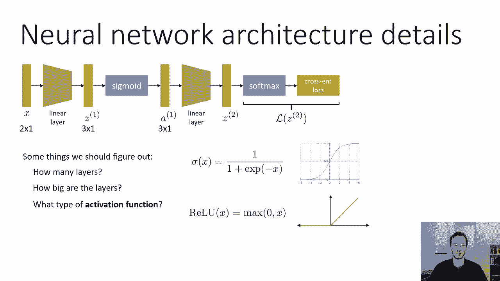
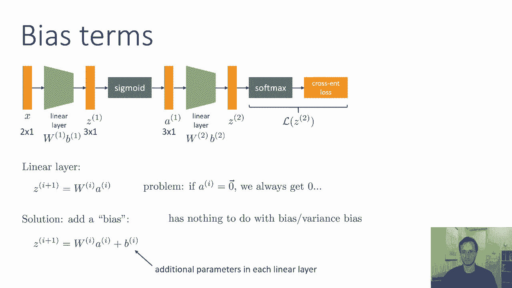
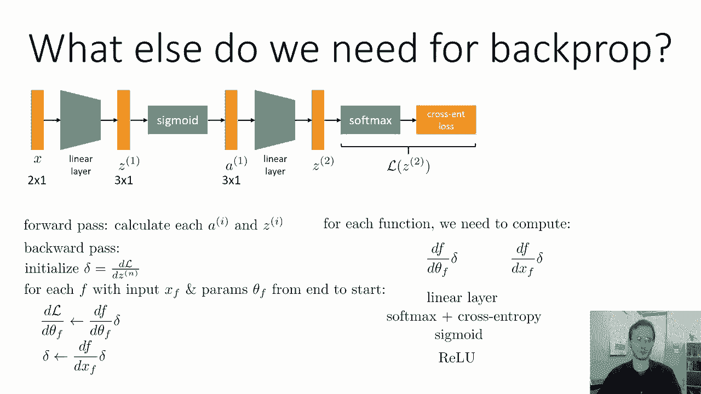
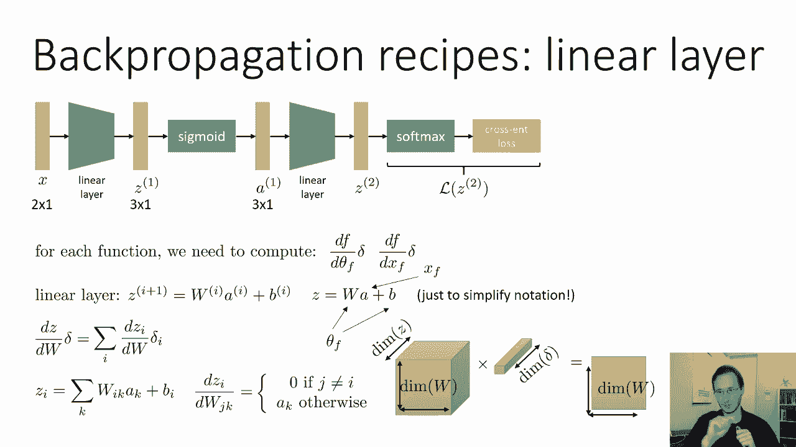
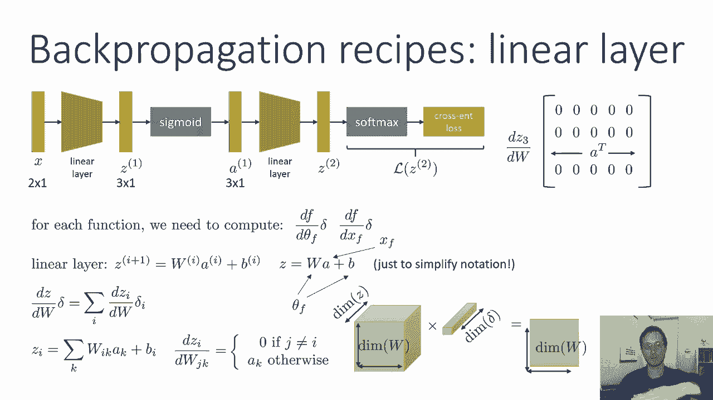
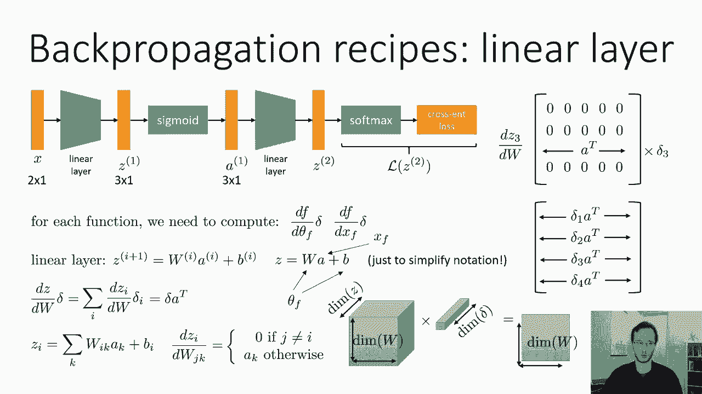
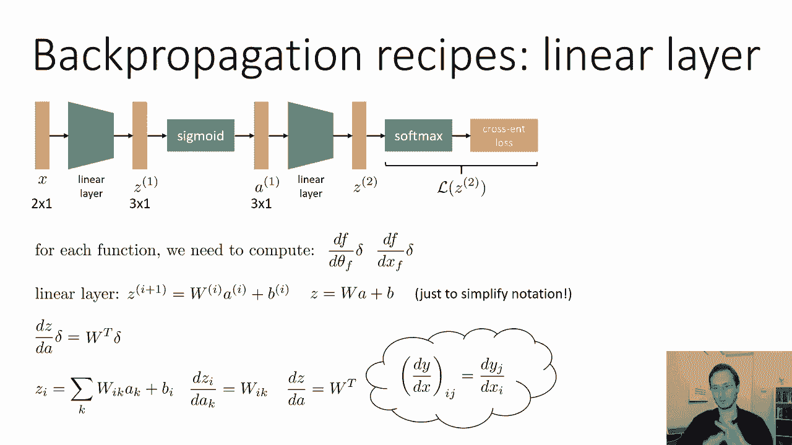
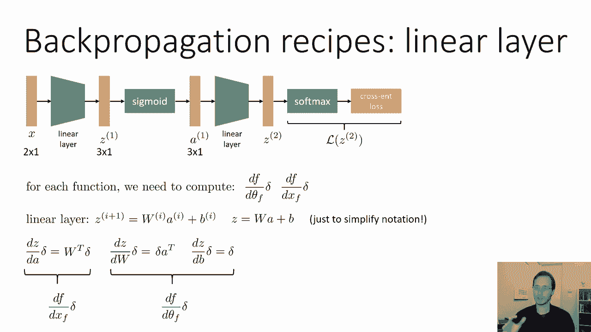
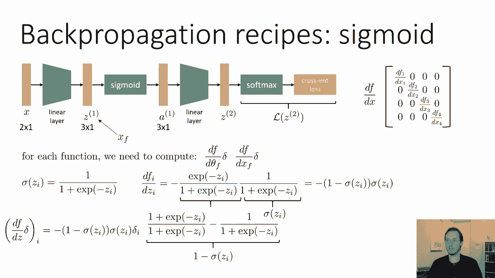
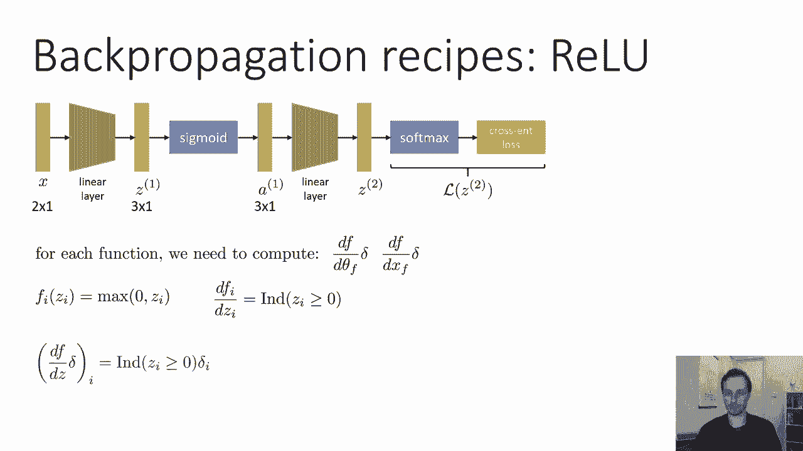

# 【双语字幕】伯克利CS 182《深度学习：深度神经网络设计、可视化与理解》课程(2021) by Sergey Levine - P16：CS 182- Lecture 5- Part 3- Backpropagation - 爱可可-爱生活 - BV1PK4y1U751

在今天讲座的最后一部分，我们将讨论神经网络的一些实际实现细节。

这是我们在上一节中看到的神经网络。

在我们真正训练它之前有几件事我们需要弄清楚。

具有反向传播和梯度下降，网络应该有多少层，这些层有多大，关于激活功能，我们应该使用什么类型的激活功能。

一个，我们在第一部分学到的一个选择是乙状结肠。

我们讨论了乙状结肠是如何得到的，如果你想象每个特征都是一个二元逻辑回归问题。

但你不必用乙状结肠。

您实际上可以使用许多其他激活函数，一个特别受欢迎的选择是一种叫做整流线性单元或relu的东西，整流的线性单元接受先前的激活，让我们说z 1，它将1设置为零和相应的z-1项之间的最大值，所以说。

而乙状结肠看起来像这个弯曲的东西，我在幻灯片中间的，Relu是这样的，它只是有一个积极的分支，那是呃，一种完全线性的，然后它有一个扁平的负分支。

起初，这可能看起来像是一种特殊的激活功能，对呀，就像线性函数的一半，好像有点，也许不是，它不够非线性，但实际上它最终工作得很好，它有许多非常吸引人的特性。

一个非常吸引人的属性，这在计算上非常便宜。

这意味着对于非常大的神经网络，它实际上可以大大加快它们的速度，Relu的另一个好处是它的衍生品真的真的很简单。

这也使它们的计算效率更高，也更容易使用。

所以在这些天的实践中，实际上relu是迄今为止最流行的激活功能。

尽管乙状结肠和像10h函数这样的东西有时也会被使用。

所有的权利，我们必须谈论的另一个细节，用于实际实现神经网络，是偏差项，这就是我之前描述的线性层，这个线性层有一个主要的限制，让我们想象AI只是一个零的向量，在这种情况下。

线性层永远不能产生任何非零的输出，这意味着你将永远到处都是零，这意味着如果网络x的输入本身是所有零的向量，你只会复制零，这意味着这种神经网络永远不能表示某些函数，它不是一个通用的函数逼近器。

解决这个问题的办法是加上所谓的偏置向量，这与偏差方差完全无关，只是调用相同的东西，但完全不相关的常数，这就把线性层变成了这样，它说z i加1等于w，加上一个常向量，这有时也被称为仿射层，事实证明。

如果你有一个有这些层的神经网络，和像乙状结肠这样的非线性，如果这些层足够大的话，您可能可以将任何函数近似到任意精度水平，如果你没有这些偏见，你就不能那样做，所以现在，神经网络的参数将由权重矩阵组成。

w 1和w 2，偏置向量B1和B2，这是一个非常标准的，几乎总是，如果你有一个线性层，你会有这些偏见。

现在到目前为止，我们几乎完成了神经网络所需的一切，我们还需要什么来实际实现反向传播。

嗯，我们需要能够计算，对于每个函数。

所以对于我们网络中的每一个功能。

这两个量需要是可计算的，我们甚至不需要建造雅各布人。

我们只需要实现一个函数，将左边的delta相乘，由雅各比人。

一旦我们对神经网络中的每一种函数都这样做，那我们就这样做了，我们需要对线性层这样做，对于软麦克斯，乙状结肠的加交叉熵。

对于劳斯等等，这些大部分都很容易，但我将在这节课中介绍其中的一些。

只是为了解决它们，希望剩下的。

你可以自己想办法，可能最复杂的实际上是线性层。

它也是唯一一个有参数的，这也是它如此复杂的原因之一。

所以线性层是由这个表达式给出的，So z，i加1等于wi乘以a i加b i，或者只是为了符号上的方便。

我会去掉上标，我把它写成z=w a加b，只是为了保持简洁。

现在，真的很快，什么是xf，xf是此函数的输入，所以x f是。

参数的θ是多少。

嗯，参数为w和b，如果你真的想把它们变成矢量。

你会把W的所有列堆叠成一个巨大的列，然后在底部加上B。

这就给了你一个巨大的矢量，叫做θf，所以我们真正需要的是关于w的导数，对b的导数和对a的导数。

我们需要他们所有人，所有的权利，所以我将简化符号，把上标去掉，θf表示w和b。

除了第一个a，所以让我们从一阶导数开始，这其实是最难的一个。

dz dw乘以delta，使这变得困难的部分原因是w实际上是一个矩阵。

但如果你还记得我们在讨论多元链式法则时所说的，当某事不确定时。

只需使用标量写出所有内容，所以z z i的第i维等于k上的和。

在w y k乘以k加i的a中的所有条目上，对吗。

我刚写好。

线性层的矩阵向量乘法表达式实际上是对的。

所以现在这里的一切都是标量，zi是标量，w，i，k是标量，a k是标量，等。

现在，dz，dw乘以delta可以在dzi的delta中的每个条目上得到一个和。

dw乘以delta i，这不是一个明显的说法，事实上，这里有一点复杂。

因为dz dw是向量对矩阵的导数。

这意味着它实际上必须是一个三维量，所以你可以把它想象成一个立方体。

每一个，立方体的每一个切片都是一个与w维数相同的矩阵。

片数是z中的维数，所以对于z的每一维。

有一个不同的W形导数，现在delta和z有相同的维数。

所以如果我们要用这个立方体乘delta。

我们做这件事的方式是，我们实际上最终将每个切片乘以相应的delta条目。

所以你可以把它想象成，长而细的东西三角洲。

然后把它拉出来，所以它是立方体形状的，重复每一个条目，然后逐点将它们相乘并压扁它们。

把它们加在一起，这就是这里显示的表达式。

这将给你一个与w维数相同的矩阵。

因为你基本上是把这个立方体的所有切片求和，所以我们需要计算dzi dw j k。

它会给我们这个立方体中每个条目的数值。

我们可以通过观察标量值表达式来做到这一点，对呀，使用单变量微积分实际上非常简单。

如果我们只看这个表达式。

我们将看到z i只依赖于w i k。

现在K的每一个值都依赖于WI，但只对i的相同值。

所以这意味着如果我们想要dzi dw j k，我们知道对任何j都是零。

那和我不一样，因为任何w j k都不会影响i。

如果j不等于i，或者换句话说，只有那些索引与i的索引相同的w行。

实际上影响Z中的条目。

如果行匹配。

然后dz i d w i，k，和j一样。

k只是一个k，因为那是，乘以w i的东西。

k，在左下角的表达式中。

在视觉上我们可以想象，让我们说，Z中第三个项的导数，关于w将是一个到处都是零的矩阵。

除了第三行，第三排只是。

呃，一个的转置，所以我们只在第三行加上一个，其他的都保持为零。

这就是dz i dw的样子。

然后乘以Δi对。

所以在这种情况下，if是三，那么这个dz，3，dw就会乘以dz，3。

所以每个dzi dw实际上在不同的地方有一个非零行。

所以如果我们想取这些的总和，我们只是把所有的行堆叠在一起，所以总和只是由一个矩阵组成。

其中每一行都是转置乘以增量中的不同元素。

如果你对线性代数有点熟悉，只是看着这个。

你可能会注意到这正是delta之间的外积。

所以你也可以把它更简洁地写成delta，转置，所以这真的很方便。

因为我们有一个可怕的三维东西，但我们实际上变成了一个表达式，我们可以用正则线性代数计算。

我们很熟悉的，只是三角洲，转置。

这是最难的部分。

剩下的就容易多了，让我们再看看dz db乘以delta，我们将写出Z的表达式，只是为了避免对多元微积分发疯。

在这里其实很容易，我们可以看到dzi d b j为零，如果j不等于i，因为只有我影响词，如果他们是平等的。

那就只有一个，这意味着您可以将dzi db j作为指示器。

对于i等于j，意思是如果i等于j和0，它就是1，否则，这意味着矩阵dc db只是单位矩阵。

它是一个对角线矩阵，一次在对角线上。

这意味着dcb乘以delta正好等于delta，非常非常简单。

最后一个DZ D三角洲右。

这就是导数，再次相对于输入。

我们写出z的表达式，从这里我们可以看到dz i d k是正确的，因为它是一个线性函数。

非常直接，现在记住，与我们的公约。

矩阵的第一个索引是分母，第二个索引实际上是分子，所以dz da实际上不是w。

它实际上是w转置，因为索引顺序不对，所以如果你有一些D DX，你想要Ij个条目。

那是d j d x i，这意味着如果你有一个Jacobian，我们想要条目k i。

这将是DC i d k，这将是W i k。

所以这意味着dz da实际上是w转置。

这意味着我们想要的是w转置δ，你可以检查这是真的。

因为您知道delta将具有与函数输出相同的维数。

而w uh将有许多等于输入的列。

所以你要把它换位，如果你想有一个有效的矩阵频谱乘法，所以你需要w转置δ。

好的，现在我们基本上完成了。

我们有一个表达，dz da乘以delta，直流dw乘以delta和直流db乘以delta。

第一个基本上是df，dx，f，第二个加在一起形成df dθf。

所以我们已经弄清楚了如何用这些线性层进行反向传播。

剩下的就容易多了。

乙状结肠，所以对于乙状结肠，输入x f是z 1。

输出是1，你可以这样写乙状结肠，负z i的正指数，这是输出的第i个条目。

乙状结肠是每个元素的操作，这意味着雅可比df，dx，dx，f正好是对角线。

所以没有对角线外的条目。

因为输出中的每个坐标只受输入中相应坐标的影响。

所以你所要做的就是计算出单变量导数，把它们插在矩阵的对角线上。

所以让我们算出导数，呃。

我们可以通过微积分的规则来算出来，我们有一个。

我们有一个1比什么，所以你知道1对某物的导数，是那个平方的负数，然后你有一个指数，它的导数就是这个量，这里实际上有一个错别字。

负号不应该在那里，前面的负号。

所以你知道这是x的平方，你可以把它写成x上的1，乘以1/x，第二部分是完全相同的乙状结肠。

第一部分的那个，你可以写出负Z的一加指数。

负z的一加指数，负1/1+指数负z。

对呀，因为分母是一样的，当你有分子时。

呃，一个取消了，剩下的表达式与第一项相同，现在你可以识别为1-sigma c。

所以这意味着全导数是由，我向你道歉，有一种类型的负号不应该在那里。

导数是一负西格玛乘以西格玛，这意味着如果你想把它乘以delta，得到i，该导数的第1项。

减号是个错别字，这是一个负西格玛，齐次西格玛齐次。

非常非常简单，也没有参数，所以没有df dθf。

因为没有θ，雷卢，RAU就更容易了，所以RAU的表达式是最大值为零，逗号z i。

这意味着对z i的导数为零，如果z i是负的，如果它是正的。

所以它只是z i大于或等于零的指示符，非常非常简单。

所以总结一下。

反向传播算法是从最后一层开始的算法。

对于每一层f，输入x f，参数θf，它计算dl d，θf乘以df dθf乘以delta，它计算出一个新的增量。

l对其输入的导数，用df dx f乘以delta。

这意味着对于每一个函数，你需要计算这两个雅各比，或者至少是那些带有Delta I的Jacobians的产品。

对于线性层，乙状结肠和导轨，你可以在家计算的SoftMax加交叉熵，它是，你知道的，体面的直率。

只是有点乏味，用一堆，呃。

