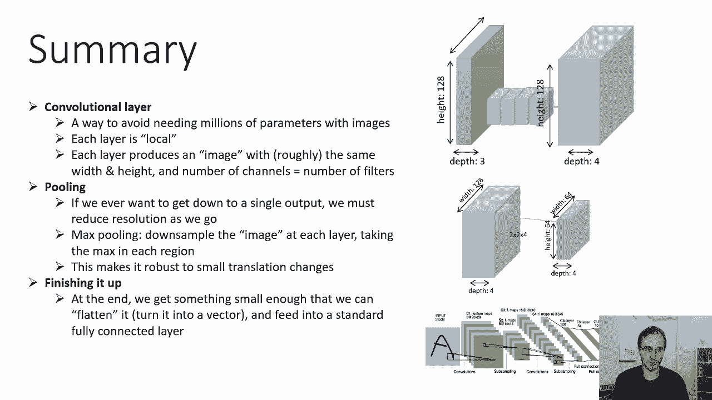
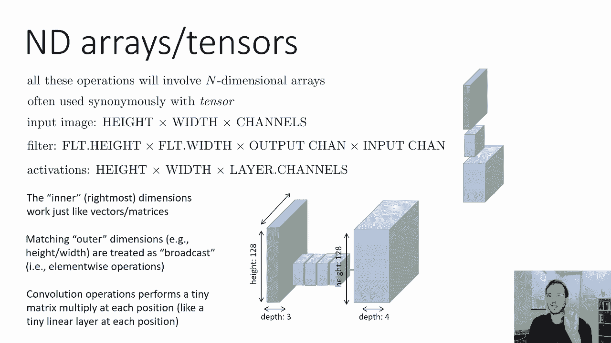
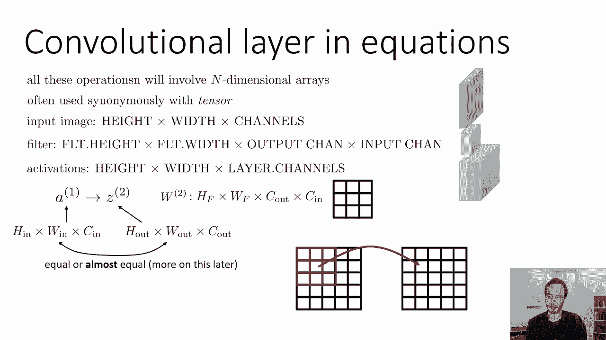
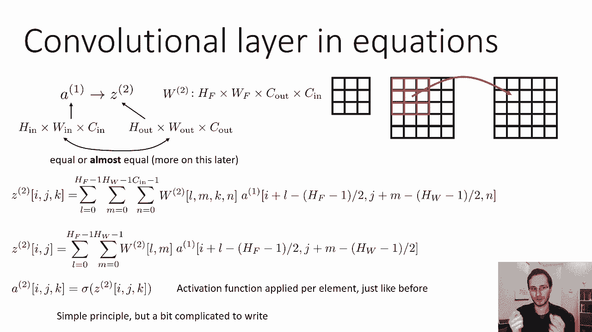
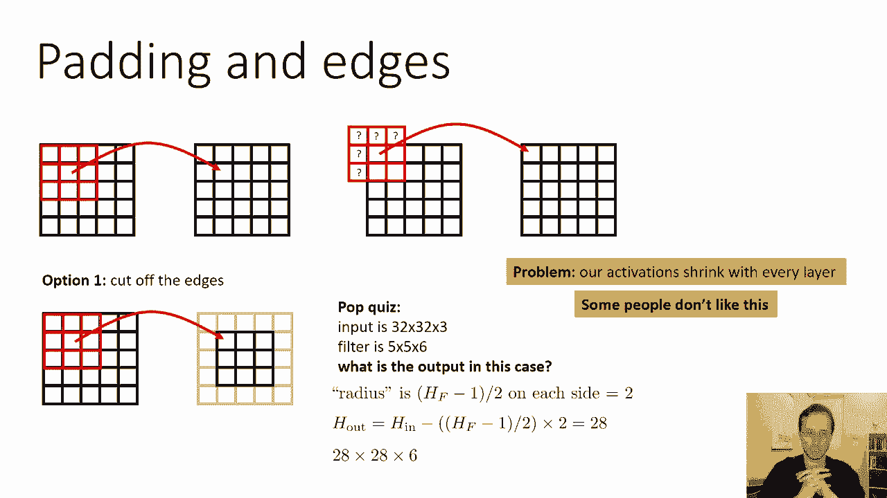
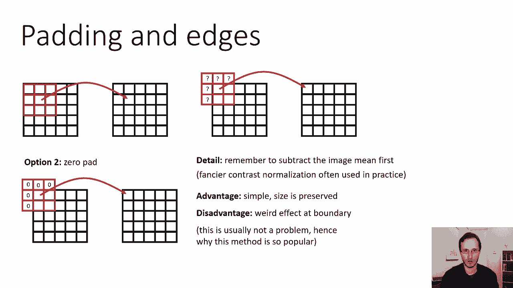
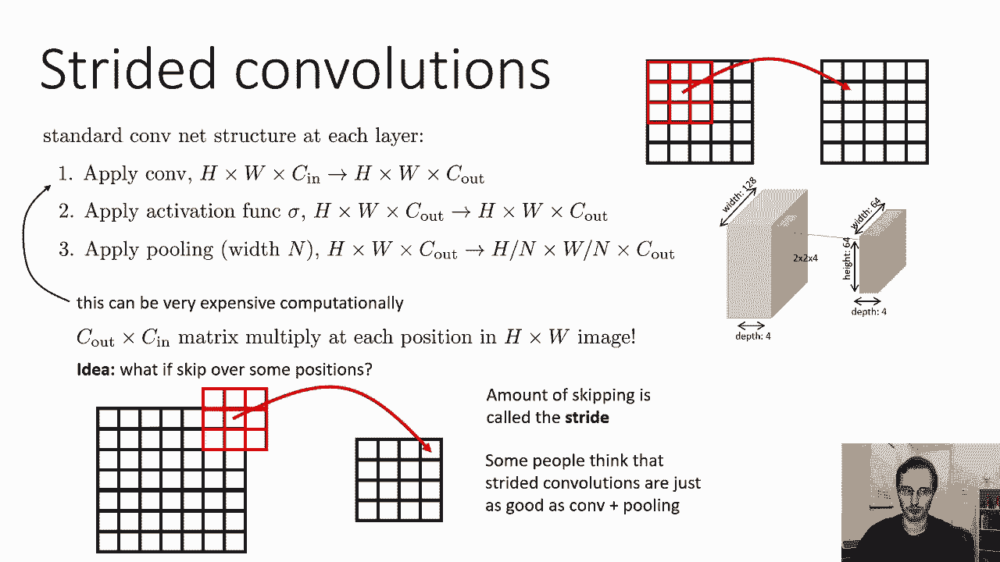

# 【双语字幕】伯克利CS 182《深度学习：深度神经网络设计、可视化与理解》课程(2021) by Sergey Levine - P18：CS 182- Lecture 6- Part 2- Convolutional Networks - 爱可可-爱生活 - BV1PK4y1U751

就在讲座的下一部分，让我们谈谈如何在实践中实际实现卷积层，总结一下关于卷积的主要思想，从第一部分开始，一个卷积层基本上是，这是一种避免图像需要数百万个参数的方法。

也是为了更有效地学习因为在一个位置上有用的功能，呃，在卷积层的另一个位置也可能有用，我们建立了这个小过滤器，我们把它滑动到输入图像的每个位置，所以每一层都是局部的，因为每个过滤器只看一点点，呃，区域。

但它着眼于每一个这样的区域，这在下一个激活卷中产生了一个不同的点，每一层都产生一些你可以认为是图像的东西，宽度和高度与前一个大致相同，但是通道数等于过滤器数，然后应用激活。

在这个三维体积的每个位置独立的函数或非线性，那么如果你想降低这些层的分辨率，你可能会这样做，这样你最终就可以产生一个单一的答案，那么您需要一个池操作，所以如果你想得到一个单一的输出。

你必须边走边降低分辨率，最常见的池类型是最大池，对每一层的激活图像进行采样，在每个区域取最大值，最重要的是，这里的区域不重叠，所以对于卷积，你把它滑过每一个位置，所以你有这些重叠的过滤器来汇集。

它们不重叠，这使得它对微小的平移变化具有鲁棒性，我也是，所以如果图像稍微移动一点，那么每个区域的最大值可能通常保持不变，一次，您已经使用了卷积非线性池来降低足够的分辨率。

最后你要把它变成一个完全连接的层，所以在最后，你得到一个足够小的东西，你可以通过把它变成一个矢量来压平它，然后将其送入标准的全连接线性层，就像我们在上一节课中讨论的那样，所以这是基本的，呃。

卷积神经网络背后的一种想法，现在让我们来谈谈我们如何真正实现这一切。

我们需要n维数组，也叫张量，所以所有这些操作，所有这些过滤器，激活映射，图像，它们都将涉及n维数组，术语n维数组现在经常与张量和深度学习同义，如果你熟悉物理或数学中的张量。

你知道张量还有许多其他重要的性质，它们是矩阵的高维推广，在某种意义上，在深度学习中，我们，当我们处理张量时，我们通常使用一种简化的定义，所以你基本上可以把张量想象成n维数组，例如。

输入图像将是一个三维数组，尺寸、高度、宽度、通道数，三个颜色通道通常是三个，过滤器是四维过滤器高度由过滤器，激活通常也是三维的高度、宽度和通道数，这有点类似于我们看到的重量和激活。

在上一课的标准神经网络中，我们有二维的权重矩阵和一维的激活向量，所以这里的过滤器，转换总是比激活多一个维度，激活是三维的，滤波器是四维的，通常，内部或最右边的维度会像向量和矩阵一样工作。

所以如果你想让一个四维的东西相乘，一个三维的东西，基本上相当于对每个位置做矩阵向量运算，沿着前两个维度，匹配外部尺寸，高度和宽度基本上允许您将操作视为广播作为元素，智慧运算卷积，虽然很特别。

因为对于卷积来说，高度和宽度不匹配，所以对于卷积，你实际上在每个位置执行一个微小的矩阵乘法，就像每个位置的一个微小的线性层，你把这个滑过每个位置。

所以让我们来弄清楚那是什么样子，假设我有一个激活，我要把它变成Z 2，这也可能是15到Z16，也可以是x到z 1对，记住激活的顺序是x z 1 a 1，z 2 a 2 z 3 a 3，等。

所以这只是这个链中的一个卷积，所以一个1的维数是h输入和w输入，通过C输入或H一W一C一，如果你喜欢的话，z 2的维数是h out w out c out，或者H 2 W 2 C 2如果你喜欢。

现在我们只假设w几乎相等或相等，但我们将更多地讨论如何，W和W L将相互联系，所以有几个选择要做，但就目前而言，这么说吧，他们是平等的，不用担心，一个权重矩阵，只是它不再是矩阵了，现在它是一个四维物体。

一般情况下，我们也会有偏见，就像我们对线性层所做的那样，但就像上一节课一样，我暂时省略偏见，只是为了让事情变得简单，但请记住，但他们真的存在，也有这些偏见，好的，那么W2井的维数是多少，它将是h，f。

w，f，c，out，c，in，因为它会把c映射到cn，如果我们有偏差w，或者我们有偏见，这种偏见的维度是什么，它是hf乘wf乘c，所以现在你们大多数人可能，或者对W2要做什么有一些想法。

但实际上把它写成一个方程并不完全是微不足道的，所以W2将是一个过滤器，所以如果你投射到前两个坐标，h，f和w，如果你能把它想象成一个三乘三的网格，但实际上这个三乘三网格中的每个细胞。

如果hf和wf等于3就是它本身，实际上是一个维度为c的小矩阵，所以不仅仅是一个数字，它实际上是一个小矩阵c除以c n，也许我们的激活是另一个网格，但它实际上是三维的，所以这里的每个点都是一个小向量。

维数为，所以这是输入，这是输出，卷积运算将采用这个小过滤器，将其放置在输入映射中的每个位置，并在输出图上生成相应的位置。

所以让我们把它写成一个方程，我要用这种符号，有点类似于Python中的索引，我将把索引放在方括号中，只是为了说清楚，所以我们要写出z，2，i，j，k的方程，这是我沿着垂直轴的位置，j沿着水平的。

和K深度，这是输出映射中位置i j的特征k，我们将把我们的每个位置加起来得到它，在过滤器中沿着一维，因为它会从0到hf-1，所以这是零索引，m从0到h w减去1，然后n从0到c，在-1。

然后我们在l逗号m处得到w-2之间的乘积，逗号k逗号n右，所以L索引是过滤器的高度，m宽度，k是输出维度，n是输入维度，所以k是c是go是从0到c，从0到c，n减去一。

然后我们将它乘以输入激活图中的一个点，我们得到这一点的方法是，我们将它集中在ij，然后我们向左或向右，取决于l和m，所以实际上写出这个表达式有点不简单，下面是表达式，但让我带你走过，你会往左走多远。

如果您的过滤器宽度为5，假设它的中心是j，我们说的是横轴，所以它的中心是j，宽度是5，所以这意味着你要向左两个，向右两个，所以你去左边给你两个，那是三个，然后你有两个在右边，又来了两个，所以一般是五个。

对于每个维度，假设你说的是第一维度，你要往后退hf-1/2，和h的负1/2向前，然后你有你集中的点，所以你又多了一个，所以hf-1/2，加HF-1/2，加1正好是hf，所以说。

在输入映射中索引的方式是通过将点，我在你的中心，然后加上l，您在筛选器中的位置，然后减去hf-1/2，所以这意味着对于l等于零，你开始我减去h f 1减去1/2，当我往上走的时候，你最终会在，呃。

我加上呃，hf-1/2，所以说，然后A的最后一个索引就是n，从零到c n减去一的索引，这是如何计算值的表达式，在输出激活映射中的每个点，但请记住，输入和输出中的每个点都是一个小向量。

滤波器中的每个点都是一个小矩阵，所以我们也可以这样写，我们可以说z 2 i逗号j，这现在是索引一个向量，维向量c out等于滤波器中每个位置的和，两个在lm，这是一个矩阵a c乘以c n。

位于与以前相同位置的向量中的向量，所以现在我写下了水平和垂直位置的索引，但我用矩阵和矢量表示法来表示通道，这就更清楚了，本质上在卷积中，你在每个位置都有一个微小的线性层，你只是把这个东西滑过去。

然后在你这样做之后，当然啦，别忘了运用你的非线性，所以你，你用卷积把1变成了z 2，现在你需要把z 2变成一个2，通过应用一个non，独立于每个位置的线性，这可以是Relu或乙状结肠。

或者你想要的任何东西，现在通常会使用带有开始的值，所以这基本上是你现在写卷积的方式，在实践中，这些通常用矩阵向量乘法实现，因为它在硬件上更有效，通常有高效的卷积GPU实现，因为它们在计算上确实相当昂贵。

它们没有那么多层，所以他们没有那么多参数，但他们确实有很多要求，就需要做的计算次数而言，因为这些矩阵向量乘法需要做很多，很多，在每个地方多次，对呀，所以计算实际上是相当昂贵的，Gpus可以加快速度。

因为这是在每个位置评估的相同操作，Gpus真的很擅长这一点，所以卷积原则上很简单，你只是在输入图像上滑动这个过滤器，写出来有点复杂，主要是因为索引，或者你必须得到索引。

索引正好用看似复杂的数学来表达一个相当简单的概念。

在我们拥有一切之前，我们需要实际使用卷积，还有最后一个细节，好吧，我们必须谈论的最后几个细节，其中一个是填充和边缘，到目前为止，我很方便地避免谈论任何事情，关于边角发生的事情，对呀，所以我告诉你，你去。

你知道如果你的过滤器有五个，你向左走两步，向右两步，然后你抓住中间，但如果你向左走两步呢，你离开了图像的末端，如果你最终得到负指数或指数呢，大于图像宽度的，所以这在这张照片中不是问题，但想象一下。

我们正集中在其中一个角落，嗯，你打算用什么来乘你的w，对于这些实际上不在图像上的点，解决这个问题基本上有两种选择，一个选择是简单地剪掉边缘，基本上不允许筛选器被评估。

在某些索引变为负数或大于图像宽度的点上，在这种情况下，如果你有一个三乘三的滤镜和一个五乘五的图像，结果是三乘三，因为这些角会导致这些无效的值，那是完全合理的做事方式，我们可以通过一个小例子。

试图了解这将如何改变激活映射的大小，所以如果你的输入是三二乘三，二乘三，你的过滤器是五乘五乘六，输出是什么，在这种情况下，花点时间好好想想，所以我们可以这样想，我们可以想象过滤器有一种半径。

我们可以计算出你知道的，hf-1/2右，我们假设通常我们的过滤器有奇数，宽度和高度，几乎总是这样，所以如果你有一个奇数，宽度或高度，你先减一再除以二，它告诉你你向左移动多少像素，你向右移动多少像素。

所以如果你的过滤器是5号的，你可以说2是它的半径，如果这个半径偏离了图像的末端，那就无效了，所以两边被切断的位置数等于这个半径，所以如果你有一个五乘五的过滤器，你要切断左边的两个位置，右边两个位置。

顶部的两个位置，底部有两个位置，如果你的过滤器是三乘三，就像这张照片里一样，然后你要在顶部剪掉一排，底部一行，一排，左边的一列，右边的一列，这意味着对于每个维度，该维度的大小将减少的量将是半径乘以2。

因为你在开头和结尾都切断了，所以总的来说，输出高度，让我们说，就是输入高度减去半径h减去1除以2乘以2，因为你在两端付出了代价，所以如果我们的过滤器是5号，那么我们的半径半径是二。

所以这意味着我们的三个二乘三，两个物体将减少两倍，每个维度减少两倍或四倍，所以输出将是两个，八乘二八乘输出滤波器数，在这种情况下是六个，对呀，因为我们的过滤器是五乘五乘六。

所以我们最终会得到一个二八乘二，八乘六输出，如果你回想一下我在前一部分展示的勒奈特的照片，这就是为什么，安妮特实际上有这些卷积地图，这些地图的大小正在下降，即使你不拼车，所以他们从一个三开始。

二乘三二像，他们实际上有一个五乘五的过滤器，所以他们得到了20英镑，八乘二十八，然后他们两个两个地汇集，这让他们得到了14乘14的分数，所以当你像这样把边缘剪掉的时候，我们的激活实际上随着每一层而收缩。

这通常很好，但有些人真的不喜欢这样他们不喜欢这样因为，尤其是当这些激活映射在你的网络末尾变得非常小的时候，现在这种减少实际上是相当显著的。

所以我们可以用的另一种选择，这实际上是一个相当流行的选择是做零填充，所以零填充，你确实评估了角落和边缘的过滤器，任何爆炸的点，图像或激活映射的末尾只替换为零。

这可能看起来是个奇怪的选择因为这个零会影响你的结果，如果你用这个来记住减去图像，这也是非常重要的，平均第一，对呀，因为呃，在输入图像中，通常我们所有的像素值都是正数。

所以你放进去的这些零看起来会有点奇怪，因为它们会低于原始图像中的任何激活，所以通常你要做的是把平均像素强度，你从每个位置的像素强度中减去它，这样图像就有点居中了，所以零是平均强度，这往往会更好地工作。

人们在实践中实际使用的对比度归一化技术，但是呃，只要减去平均值，那是那可能没问题，零填充的一个优点是它在某种意义上更简单，激活映射的大小被保留，你不用担心东西变小，你在边界上有这种奇怪的零效应的缺点。

这通常不是问题，这就是为什么这种方法如此流行，只是概念上，可能有点尴尬。

在演讲的这一部分，我想讨论的最后一个概念，是一种叫做大步卷积的东西，所以我们到目前为止讨论过的每一层的标准大陆结构，看起来第一步，应用你的卷积把你的h乘w乘c n变成，a h乘w乘c out。

如果您使用零填充，如果你要离开边界，然后是h减去一些小数w减去一些小数c，然后第二步应用你的激活功能，这样就保持了维度，因为激活函数是独立地应用于每个单点的，第三步以一定宽度n应用池，减少了维数。

使分辨率降低n倍，所以如果你有h乘w乘c，变成h除以n乘以w除以n乘以c，你知道的，两四个之类的，这里应用这个卷积的第一步在计算上可能非常昂贵，它不需要那么多参数，但它很贵。

因为你要做这个矩阵乘以很多很多倍，事实上，这个c乘以c和矩阵，基本上发生在H乘W图像中的每个位置，所以这里有一个主意让它便宜一点，如果你跳过一些位置呢，所以如果不是在输入图像的每个点评估过滤器。

你实际上跳过了几点，所以如果你从这里开始，然后你滑到这里，然后你滑到这里，然后你滑到这里，所以请注意这里我们是，我们跳过了两个像素而不是一个像素，过滤器仍然重叠，我们只是跳得更远，所以这叫做大步卷积。

步进卷积是一个完全合理的选择，你跳过的量叫做步幅，所以在这里，当我们跳过两个，这叫做两步，默认情况下，你会有一个步幅，步进卷积与池不同，因为在池中，你实际上计算了每个位置的激活，然后你取最大值。

而地层卷积，你完全跳过了一些位置，不像池，地层卷积是一种便宜得多的计算，有些人认为，地层回旋几乎可以和规则回旋一样好，很多人仍然使用池，部分原因是GPU确实会进行定期的卷积，你知道相当有效率。

但是如果你想要非常快的神经网络，通常刺耳的卷积会便宜得多，尤其是在激活分辨率非常大的早期，所以这是一个重要的概念，和，和，我们会在一些神经网络中看到它。

