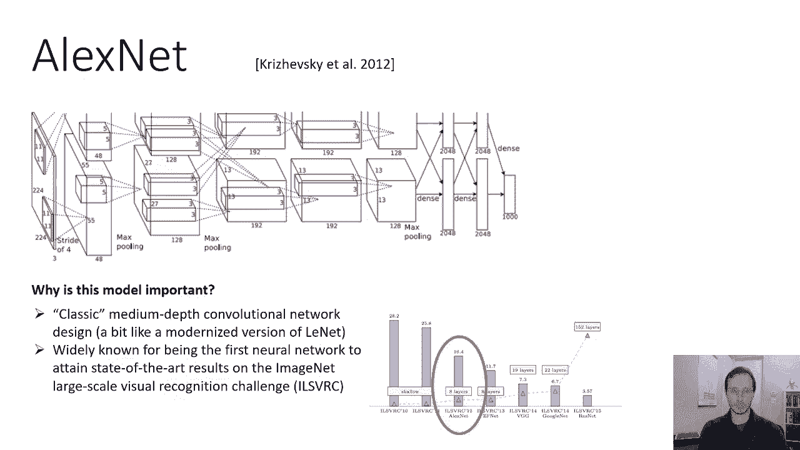
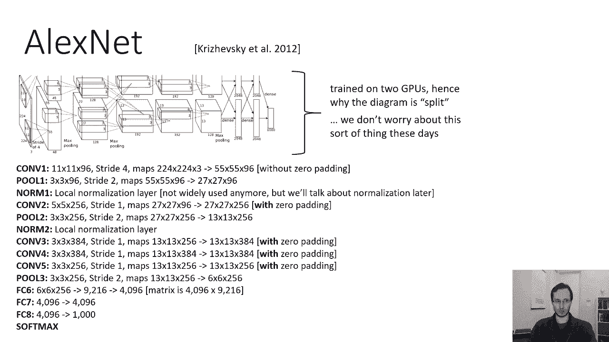
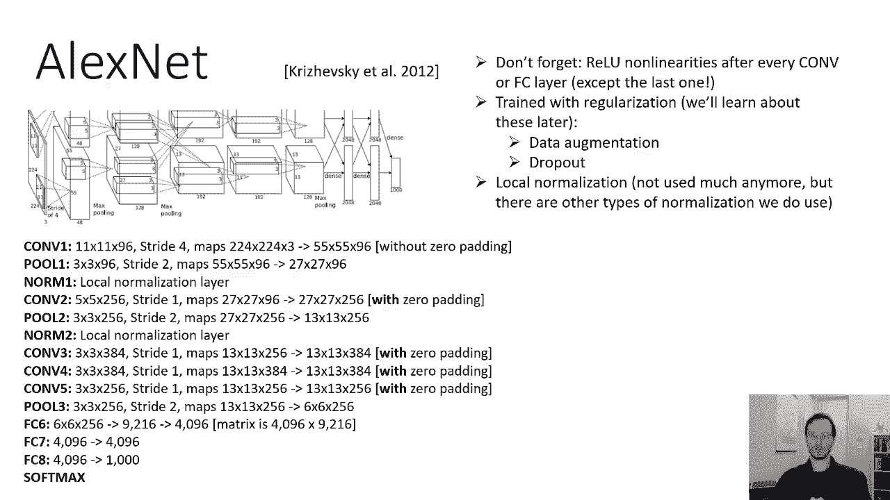
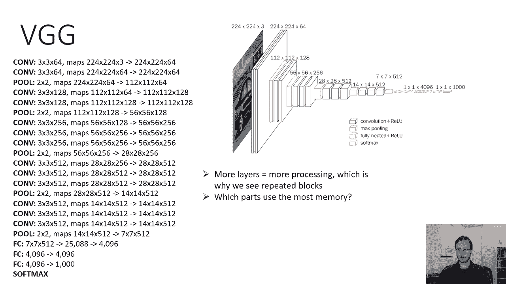
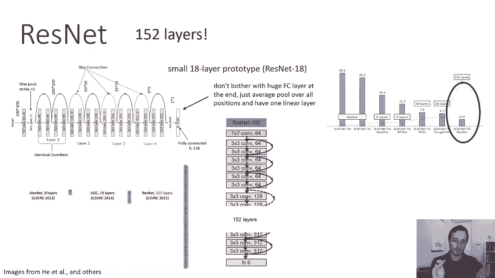
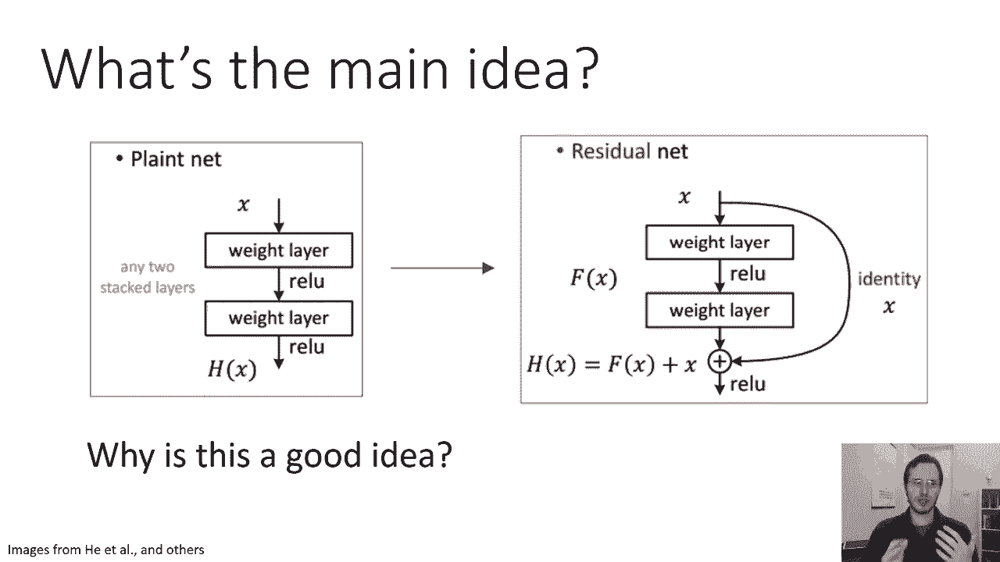
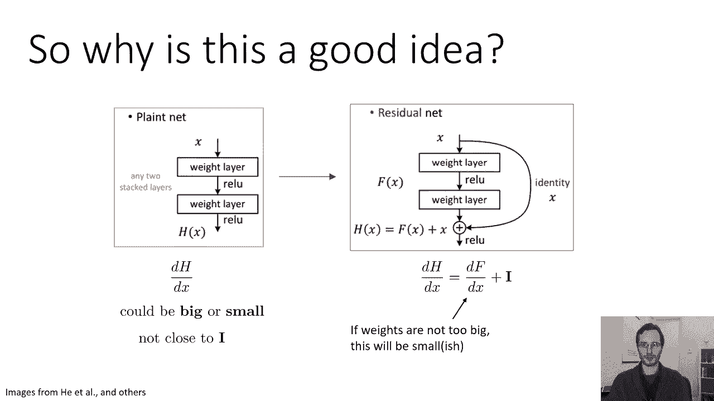
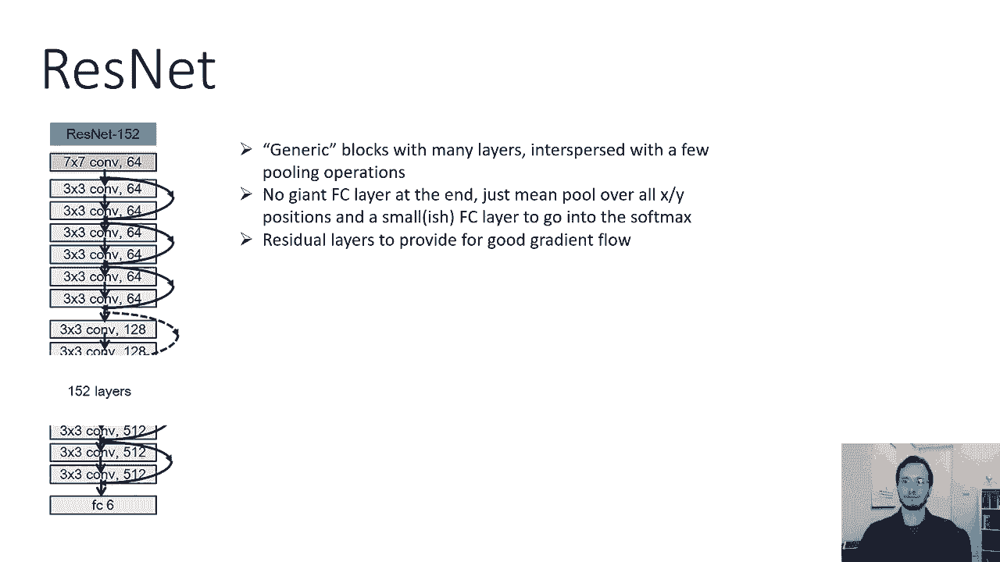

# 【双语字幕】伯克利CS 182《深度学习：深度神经网络设计、可视化与理解》课程(2021) by Sergey Levine - P19：CS 182- Lecture 6- Part 3- Convolutional Networks - 爱可可-爱生活 - BV1PK4y1U751

所有的权利，在今天讲座的最后一部分，我们将通过一些实际的例子，用于计算机视觉任务的卷积神经网络，看看我们学到的一些组件是如何在实践中使用的。

所以我们要开始的第一个网络是Alex Net模型，亚历克斯网络模型是由亚历克斯·鲁舍夫斯基和他的合作者设计的，在，并在他们的212篇论文中首次描述，这是一个相当著名的模型，原因有几个，我们要研究一下。

部分原因是，这是一种非常经典的中深卷积神经网络设计，那是一个，你知道的，相当典型的中深度设计，以前使用过，有点像现代版的勒奈特，但这种特殊的模型最著名的是。

是第一个在Imagenet上获得最新结果的神经网络，大规模视觉识别挑战或IVRC，也俗称Imagenet IVRC，很重要，因为它是，呃，与以前的数据集相比，数据集大小的最大增长之一。

当时计算机视觉界认为，成为一个重要的进步，就它对机器学习方法提出的问题的现实性而言，所以嗯，Alex Net以第一个真正击败如此的深度学习方法而闻名，称为ImageNet上的浅学习算法。

这被认为是计算机视觉界的一个里程碑式的成就，这是在2012年，你可以看到亚历克斯·内特比之前的获胜者有了巨大的进步，所以在2011年它的误差是25。8%，亚历克斯·内特获得了16。4%的误差。

这在当时被认为是一个巨大的进步，现在什么是Imagenet。

为什么这是一件大事，嗯，Imagenet是一个大交易，原因有几个，首先，Imagenet训练集非常大。

它由150万张图像组成，正如我在课程的第一节课上提到的，以前的数据集通常有数万张图像。

所以150万张训练图像在尺寸上是一个巨大的进步。

而且图像的视觉识别挑战也很难，它有一千个不同的视觉类别，而以前的基准测试任务可能有一百个左右的类别。

其中一些类别实际上很难，所以这些是ImageNet中实际图像图像的一些例子，所以首先你有一张有趣的照片，展示了不同种类的，呃，书写工具，它的标签是尺子，图像中有一把尺子，还有很多其他的东西。

你在下面看到的文字，红色的不一样，神经网络模型可能会对这幅图像做出的猜测，然后左边第二个图像，那是帝王蟹或阿拉斯加蟹，但就像放大了一样，很难说出发生了什么事。

那么您就有了一个标记为Sidewinder的图像，那是一种蛇，你可以看到蛇在图像中，它实际上占据了图像的一小部分，然后你有一个盐瓶，但你能真正分辨出它是盐瓶的唯一方法，就是读到上面写着盐。

这里的模特认为这是一个药丸瓶，然后你有一个卷轴，这是指钓鱼卷轴，它实际上是一张人们站在周围的照片，但你可以看到其中一个实际上拿着一个钓鱼卷轴，所以我的意思是这些都是特别困难的例子，但总的来说。

这些都是相当嗯，代表了这些模型必须应对的一些挑战，当试图对Imagenet中的图像进行分类时，所以它们应该是来自现实世界的图像，它们实际上是从Flickr中收获的，这些是真人放到网上的照片。

然后通常由机械terer标记，所以这被认为是困难的一大步，与以前的图像识别基准相比，在真实感方面有了很大的进步，所以深度卷积神经网络可以，所以说，呃，大大优于以前最好的计算机视觉方法。

远离以前使用的特征工程方法，并走向几乎完全依赖卷积神经网络，或多或少延续至今，所以这就是为什么这个结果真的很重要，Alex Net模型的实际设计，然而，实际上是相当传统的，所以在很多方面，呃，它已经。

你知道的，它反映了许多与Lynette相同的设计决策，但为了适应这项更大更困难的任务，它的规模扩大了很多，所以让我们来谈谈这些设计，这张图表摘自亚历克斯·科夫斯基的《二十二》论文。

这对我们来说有点奇怪因为这里的网络是画的，好像我们被分成了两部分，画成那样的原因是因为亚历克斯，Kurzvi实际上实现了这个模型，在两个Gpus上运行，必须手动将它分成两部分才能在这两个GPU上运行。

现在在2012年，我们没有像TensorFlow和Pytorch这样的工具，所以这实际上是手动实现的，亚历克斯必须对它进行编程，指定将在哪个GPU上评估网络的哪个部分，这个数字是为了反映。

这实际上对网络的功能没有任何影响，所以两个GPU的实现，它的工作方式，它和在一个GPU上是无法区分的，但这就是为什么它是这样画的，所以我们现在真的不担心这种事情，因为现在Gpus有足够的内存。

把整个网络保持在一个GPU上没什么大不了的，即使对于非常大的网络。

事实上，在许多方面，VRAM数量的增加，在Gpus上，部分是由这类网络规模的增加刺激的，因为如果你想让GPU在数据中心训练神经网络，他们需要有足够的内存，你不想做所有这些手工工程，跨多个GPU拆分网络。

会很开心地为你做多GPU训练，虽然通常，最好是分批，而不是把网络的一部分放在不同的GPU上，但你也可以这么做，所以说，亚历克斯网的输入是240乘220，三色通道四像，第一卷积层有十一乘十一的过滤器。

它有96个，这些过滤器以四个步幅应用，所以它们是重叠的，因为它们是十一乘十一，但有了这个尝试四，所以你不会把它放在每个地方，使用比一个大的步幅是相当常见的，当你的输入分辨率如此之高，所以如果你的输入是。

呃，几百像素以上，你真的想用更大的步幅，否则，这样做在计算上会非常昂贵，你最终会得到你的第一个卷积响应图非常大，如果我们做一点信封后面的计算，我们可以通过这种过滤器来计算，你将把图像的大小缩小大约四倍。

减去边缘效应，做两边的衬垫，所以这实际上给了我们一个激活地图，就是五五乘五，五个，深度九十六，这是一个，这是亚历克斯网络中的第一个卷积层，在这个卷积之后，就像往常一样，我们用放射性激活，一般来说。

对于我今天要描述的所有网络，如果有卷积或完全连接的层，接下来是瑞利激活，这些通常用于更深的网络，原因我将在这部分的最后讨论，所以我通常会省略铁路部分，但请记住，它总是在那里，每次你看到。

Convar FC，后面总是有栏杆，除了最后一个完全连接的层，因为这将进入软最大值，好的，所以第一个conv层产生了5 5乘5，五个，深九十六，你可以在顶部的图表中看到，它显示了第一层护航层是五五乘五。

但它实际上被贴上了四八的标签，因为它分成了两部分，所以有两个部分，每个部分是四八，你可以想象把它们叠起来。

你得到九十六，然后有一个最大池层，这个最大池层是三乘三，但它实际上有两步，所以在我们讨论池层通常是不重叠的之前，但它们可能是重叠的，这里碰巧是一个重叠的池层，所以它把所有东西都集中在一个三乘三的区域里。

然后以两步的速度滑动这个三乘三的窗口，所以每个游泳池之间都有一点重叠，通常游泳池的大小和步幅是相等的，但在这里他们不是这样，因为步幅是二，这实际上是对图像进行了两倍的采样，除了边缘效应，所以因为呃。

因为三乘三的尺寸，侧面实际上有一点衬垫，所以，这就是为什么你减少到2 7乘2 7，对呀，五五除以二，但是你会因为图案而失去一个像素，所以你最终会得到两个七乘两个七，深度被保留了下来。

因为池是在每个特征上独立完成的，然后你就有了下一层卷积，所以这里没有重叠区域的汇集，然后你有下一层卷积作为一个突击测验，Alex的第一个卷积层有多少参数，净额，以便确定参数数。

我们知道我们只需要看看过滤器的大小，因为参数的数量与输入和输出大小无关，只取决于滤波器，过滤器是11乘11乘96，现在记住每个卷积层中权重矩阵的大小，是过滤器宽度，过滤器高度，按过滤器宽度，按输入尺寸。

按输出尺寸，所以96是输出维度，输入维度为三，因为图像有三个颜色通道，所以你最终得到的是11乘11乘3，权重矩阵乘以96，所以其中的条目数，呃，在Conv 1的权重矩阵中是11倍，十一次，三乘以九十六。

就是三千三，四千，八百四十，八，我们是不是漏掉了什么，这些都是conv one中存在的参数吗，花点时间想想这个，我们还需要什么参数，如果你回想一下那些线性层，如果你还记得我们讨论过如何对于线性层。

我们有权重矩阵，但我们也有一个偏置向量，我们有卷积，我也是，现在偏置向量中的参数数不依赖于，关于输入数，它只是取决于输出的数量，输出数总是96，所以偏置有96个参数，这意味着每次我们评估过滤器。

我们经过11乘11区域的每一个点，做我们的，你知道九十六乘三矩阵，乘法和，所有这些加在一起，然后对于产生的96个条目中的每一个，我们加上相应的偏置维数，所以又增加了96个数字，这是一个相当小的数字。

这导致参数总数为30个，四千，九百四十四，这是相当多的参数，这仍然比我们所需要的要低得多，如果我们有一个完全连接的层，如果我们有一个标准的线性层，直接从图像到完全连接的激活层。

好的，现在，我不打算把亚历克斯网的其余部分一块一块地画出来，因为那会花我一辈子的时间，所以我要把它写出来，所以第一个conv层，正如我之前提到的，十一乘十一，由九十六个过滤器，步幅为四，它们映射到两个。

四乘二，两个，四乘三的图像变成五个，五乘五，五乘九十六激活，他们实际上没有零填充，所以这就是为什么尺寸的缩小实际上比，只是一分为二，四乘四，您又有了没有零填充的池，这让我们从五乘五下降到五。

五乘九十六到二七乘二七乘九十六，那么Alex Net实际上有一个叫做局部规范化层的东西，这已经不被广泛使用了，但它意味着每个补丁中的激活，把它们放在大致相同的尺度上，所以低频差异不大，这对图像很有用。

因为如果光线有变化，比如阴影，这往往会，呃，让它不那么明显，这已经不被广泛使用了，还有其他类型的规范化，我们将在下节课中讨论，所以不要担心这些正常的层，然后是另一个卷积层，这个有5乘5乘256个过滤器。

所以过滤器更深，它们是更多的过滤器，但它们更小，为什么它们变小了，因为第一个骗局是在二二四乘二二四的图像上操作，所以你想要更大的过滤器是有道理的，因为你有一个高分辨率的图像。

第二个conv层在一个二七乘二七的激活映射上运行，所以你不需要这么大的过滤器来合并一个大的空间区域，有更多的过滤器，因为你想基本上拉出更复杂的，呃，更抽象的信息，那个，直觉上，意味着你有更多的数字。

用来描述每个地方发生的事情，对呀，所以这有点，这不是网络真正在做的，但你可以在这里想象一个故事，原始图像中的每个位置都有三种颜色，第一个激活映射中的每个位置。

可能描述了在conf 2之后的那个位置存在什么样的边缘，也许它描述了在那个位置存在什么样的部分，不同的部分比不同的边缘要多得多，还有更多不同的边缘，不仅仅是三个颜色通道。

所以你想要更多的过滤器是有道理的，更多的功能和更低的分辨率，因为你在网络中上升，所以你想要更多的功能因为有更多不同的事情可能会发生，你想要更低的分辨率，因为最终你想只做一个标签，所以在conf 2之后。

我们有另一个池层，就像以前一样，三乘三，两步，好的，那种东西呃，我想亚历克斯·克里科夫斯基喜欢，所以3乘3乘2 5 6步长2步长7乘2，7乘2 5 6把地图分成13乘13乘2 5 6再一次。

它不完全是两个因素的原因，是因为边缘加了填充物，因为它是三乘三而不是二乘二。

然后您有另一个局部正常化，然后是另一个conv层，这个是三乘三乘三三八十四，所以你可能看到了一个模式，过滤器的大小减小，深度上升，13乘13乘2乘5乘6变成13乘13乘3，八十四，这次我们用的是零填充。

为什么我们突然对conf使用零填充，而我们不是在第一层井，因为第一层有如此高分辨率的图像，两边失去几个像素没什么大不了的，但当我们到十三乘十三的时候，如果我们不做零填充。

我们会在侧面损失很多可能会错过一些有用的信息，然后我们在这一点上有另一个conv层，我们不需要在里面再贴一个池层，因为我们已经减少到十三乘十三了，所以进一步减少可能会适得其反。

所以我们会在上面贴上另一列，步幅为1，这样大小就会保留下来，所以我们把13乘13乘384，我们把它带到另一个13乘13乘384。

所以我们只是在这一点上做一些处理，我们不是想减少样品，然后有一个稍微小一点的卷积层，三乘三乘二五六，所以我们的13乘13乘3，八十四变成十三乘十三乘二到五六，这里有个小错别字，上面写着。

十三乘十三乘二五，六到二五六，应该是三四五。

六，这是我们最后一个池层，在这一点上，我们只是试图把东西拉下来，这样我们就可以把它变成一个数字。

所以我们要把13乘13乘26，我们会做一个有规律的步幅。

两池，呃，虽然这里又是一个三乘三的游泳池，步幅为二，所以我们还是剪掉了最后一个像素，我们得到一个6乘6乘2，5，6。

在这一点上，物体足够小，我们可以简单地把它们压扁成一个大矢量，这样我们就得到了第一个完全连接的层。

第一个完全连接的层是6乘6乘2 5 6。

它把它压扁成一个巨大的矢量，这意味着我们基本上把这两个五六个长度的。

呃，一个接一个的特征向量。

每一个六乘六的位置，所以我们有三个，这两个D6长度向量中的六个，它们都堆叠在一起。

它的总长度是九千二百一十六，和第一个完全连接的线性层。

到了四千九十六，随后是一项规定。

当然啦，这意味着这个矩阵的大小是四千九十六，到现在九千二百一十六，所以它实际上是一个非常大的矩阵，它有数以百万计的参数。

事实上，就参数数量而言，它是最大的层。

然后我们有另一个完全连接的层，需要4000，九十六到四千九十六，最后一个需要四千九十六到一千，因为我们有一千个可能的类。

在这之后就没有铁轨了，只有一个软最大值输出答案。

这就是Alex Net的体系结构，而且有点临时。

所以有一些实验继续设计这个，但你可以看到一些模式。

您可以看到池层减少了激活的大小。

就其空间范围而言，我们可以看到，随着你深入，功能的数量往往会增加，所以我们试图总结图像中的所有信息，分辨率较低的激活图更深。

这让我们，帮助我们，表示更抽象的特征，一旦事情变得足够小。

然后我们把它们压平，把它们穿过几个完全连接的层，以产生答案。

现在别忘了，我们在每一个卷积RFC层后都有relu非线性。

除了最后一个和这个网络。

呃，在亚历克斯·拉夫斯基的报纸上，接受了一些正规化技术培训。

这是为了让它更好地工作，包括数据扩充。

我们以后再谈，但实际上这基本上包括拍摄你的图像并以各种方式改变它们，比如改变色调饱和度和亮度，基本上教你的网络一些不变性，以及一种叫做退出的正则化技术，我们将在后面讨论，以及这些局部规范化层。

已经不怎么用了。

但是，我们将在下节课中讨论其他类型的归一化。

这是亚历克斯网络，这个网络是，你知道在某些方面相当经典。

它相当具有代表性的一种中等深度的大型网络，末端完全连接的层。

这些是，你知道的，相当流行的一类网络。

然而，现在处理视觉输入的最好的网络往往更深。

所以接下来我们要谈谈VGG网络，用一个过于诗意的比喻，如果亚历克斯·内特是一件艺术品，BGG是一项工程工作，基本上，我们将开始在VGG网络中看到的模式，将是一定程度的标准化和模块化。

这将真正帮助我们当我们必须建立非常，非常深的网络，因为有了亚历克斯·内特，很明显，每一层的参数都是手工精心选择的，用vgg，我们将开始看到一种常见的主题重复多次，作为增加模型深度的一种方式。

那么为什么VGG网络很重要呢，它今天仍然经常被使用，所以现在人们通常不太使用Alex Net，但GG有时会被用来，VGG比以前的最佳模型在深度上有了很大的增加。

所以IVRC上的UVgg是在2014年首次报道的，亚历克斯网两年后，它的层数比之前的获胜者增加了两倍多，所以这里是PGG，我们开始看到这些同质的多重卷积堆叠，穿插着分辨率降低。

会一次又一次出现的相当标准的主题，随着我们进一步增加这些模型的深度。

所以让我们来看看VG的体系结构，右边的图表实际上很好地显示了它，你可以看到这些特征层是如何变得更深更小的，但让我们来看看他们的样子，所以我们用bgg做的第一件事是我们把我们的两个，二四乘二。

二四乘三图像，我们大步向前，一个零填充卷积，所以没有分辨率降低，这些是巨大的激活图，但过滤器实际上很小，过滤器只有三乘三乘六十四，所以我们有这些小过滤器，它们被应用于这些巨大的图像和激活地图。

这意味着我们要把24乘以2，二十四乘三到二十四，二二二十四乘二，二十四乘六十四，然后我们再做一次，然后我们降低分辨率，我们不想停留在二二，四乘二，二十四太久了，因为这需要大量的计算。

和大量的内存来计算所有这些位置的过滤器，这里的参数数实际上很少，事实上，这些层具有一些最小数量的参数，但是激活映射需要最大数量的内存，所以我们将把它的样本减少两倍，所以这是一个标准的两个不重叠的游泳池。

所以很直截了当，把我们的2 2 4乘2 2 4变成1 12乘1 12，然后我们要用三层抱歉来打击这个，两层相同的卷积，这些是三三一二八，所以就像以前一样，我们在前进的过程中增加了深度。

所以我们降低分辨率，像之前一样增加深度，但现在这是一种非常非常方便的，只要增加两倍，从六十四到一二八，所以我们最终得到了一个十二个一个，十二乘一二八，图片，当然是一点点是不对比例的。

深度实际上比这一点的宽度大，然后我们再把它集中起来，标准的二乘二游泳池把它减少到五个，六乘五，六乘一二八，我们又有三层相同的卷积，呃大步，一个零填充五十，六乘五，六乘二，五六，好的，所以分辨率减半。

深度翻倍，你可能开始看到这里的主题，我们还有2乘2的泳池，决议二八乘二八乘二五六，然后我们有更深的卷积，三乘三乘五十二雷亚尔减半，深度翻倍。

然后我们再做三次，那我们现在再玩一次，在这一点上，我们有深度5 12的过滤器。

也许我们不需要更多，所以我们会保持在5点12分，再来一次，所以现在你可以看到这里的图案，呃。

我们有两到三层的卷积，根本不会降低分辨率。

穿插着将分辨率降低一半的池层。

每次我们把分辨率降低一半，我们通常增加过滤器的数量，然后我们再集合一次把它缩小到7乘7，五点，十二，在这一点上，它足够小，我们可以建造我们的第一个完全连接的层，当我们把所有512个特征向量叠加在一起时。

七乘七个位置中的每一个，我们实际上得到了一个很长的矢量，超过两万五千个条目。

所以第一个完全连接的层实际上是相当巨大的，它有超过1亿个参数。

然后我们就有了常规的四千乘四千的完全连接层。

然后又有一个进入一千个类别，然后我们的软麦克斯。

就像以前一样，那么我们在这个网络中看到了什么。

我们看到每个池操作之间有多层。

所以在某些方面，你可以把这看作是Alex Net的一个稍微整洁的版本。

每个池之间只有多个缺点，而不仅仅是多一层意味着更多的处理。

所以这就是为什么我们看到这些重复的块，我们只是在填鸭式地做更多的加工，在决议削减之间。

这个网络的哪个部分使用的内存最多。

嗯，最多的内存实际上是在开始时使用的。

因为一开始我们有这些巨大的激活图，所以即使过滤器很小。

存储这200个所需的内存量，两个，两个。

两个，四乘二，两个，四乘六十四激活映射非常大，所以大部分内存使用。

而且大多数计算最终发生在早期的层中。

哪个零件的参数最多，嗯，那个呃，参数数实际上是最大的在完全连接的层，我们平坦的，呃，激活成一个巨大的矢量，稍后会再出现的，所以VGG中几乎所有的参数实际上都存在于第一个完全连接的层中。

其余的参数数实际上要小得多，在卷积层中，这两个参数的峰值，这两个，八乘二，八乘五，十二层，对呀，这些就是三乘三乘五，十二，呃，过滤器，这其实不是一件好事，我们以后会看到的，呃，在最近的体系结构中。

人们实际上已经摆脱了这个，你实际上不希望你的大部分参数生活在第一个完全连接的层中，但除此之外，这个设计值得注意的是你有这些图案，你重复多次以增加深度，所以我们要谈论的最后一个网络是Resnet。

Resnet是一种非常流行的建筑，今天被广泛使用，当它第一次被引入时，它是用152层介绍的，从那时起，人们就用类似的想法将网络扩展到数千层，但是Resnet一五二实际上还是很不错的。

所以实际上不清楚你还需要多少，虽然你可以，如果你想挤出最大的性能，ivrc，你可以做得更大，所以呃，有反应，这是二千零一万五，一百五十二层，3。57％的错误率，这实际上比人类水平的表演还要好，至少。

根据安德烈·卡帕斯的说法，这是Resnet的可视化，与亚历克斯·内特和凯敏海的BGG相比，现在谁是Resnet论文的第一作者，当然，你必须缩小所有的东西来适应所有的层，所以你几乎不知道发生了什么。

你可以看到亚历克斯·内特是左边的这个小块，vgg是中间稍微大一点的块，Resnet是最右边的一个巨大的怪物，为了了解Resnet是如何工作的。

查看稍微缩小的图表可能会有所帮助，使用非常熟悉的模式，模式并不完全不同于VGG，所以它是这三乘三的卷积的集合，过滤器的大小每次池时会增加两倍，但是有很多，在每个池操作之间有更多的。

所以既然我们可以画出完整的共振模型并把它放在这张幻灯片上，我要给你看什么，取而代之的是一个高度简化的18层原型的图表，完整的152层版本基本上类似于这个，除了一切都延伸了很多，实际上。

所以我们从一个七乘七的conv开始，这是唯一常见的七乘七，这只是因为初始分辨率相当大，所以这让我们得到了一个稍微低一点的分辨率，然后我们有这些三乘三卷曲的重复块，它们之间的分辨率降低了。

过滤器的数量增加了两倍，我们一直走，直到你达到5-12，然后你就呆在那里，实际的卷积运算，这里和VGG中的标准有点不同，我们以后再谈，这就是小跳过连接标签向我们展示的，但现在别担心。

这个模型的另一个显著特点是，这是在其他地方出现的东西，呃，当时的模型不是在末端有一个巨大的完全连接的层，我们只需将最后一个卷积响应图，我们平均汇集，这意味着我们平均每个位置的特征向量。

这样我们就不会把它们叠起来，我们只是把它们加起来平均一下，这意味着我们最后有512个过滤器，将留下一个大小为512的向量，不是两万八千什么的，然后我们只有一个线性层直接进入软最大值。

所以我们把5-12直接放进1000个标签里，所以我们基本上剪掉了最后整个完全连接的块，这可能看起来很奇怪，因为这些完全连接的块在之前的参数数量方面真的真的很大，但事实证明。

这些模型实际上最终完成了大部分的视觉处理，在卷积层中，你可以去掉最后完全连接的部分，只做平均集合只有一个矩阵直接进入1000个类，这实际上最终效果很好，所以通过这样做，我们消除了很大一部分参数。

给我们留下了更多的处理和参数来处理卷积层。

哪些是将要做的，所有的重担，所以让我们谈谈为什么，呃，Resnet实际上可以用这么多的层进行训练，这些是由Resnet论文的作者进行的一些实验，研究效果，随着我们层数的增加，这是一个更简单的数据集。

这是CFR十，这是一种，它是一个比imagenet小得多的数据集，类也少得多，在左边你可以看到，嗯，他们用标准卷积网络进行的实验，当你把层的数量从20层增加到32层再增加到4层，四到五六。

你可以在这里看到错误率实际上增加了，随着层数的增加，这是为了非常深的网络，记得亚历克斯吗，net和vgg都小于二十层，所以如果你去10个或5个或3个，然后你会看到相反的趋势，所以本质上发生的是。

当您增加传统卷积网络的层数时，精确度提高，因此错误下降，但过了一段时间，它又回升了，所以它会减少，减少，减小到大约GG的深度，然后当你超过20岁的时候，它又开始增加了，什么呃，Resnet的人发现。

通过对，对神经网络架构进行小的修改，你实际上可以扭转这一趋势，你实际上可以得到它，所以呃，你知道的，二十层，你知道他们的准确性差不多，但是随着层数的增加，他们的设计，精确度在CFR10上继续提高。

它似乎饱和在100左右，但是CR ten是一个比Imagenet更容易的数据集，所以对于Imagenet来说，当你把它做大的时候，你会继续看到增加。

那么主要的想法是什么，是什么让Resnet的人能够训练这些更大的，更深的网络，嗯，这个想法被称为残余层，从规则层到剩余层的变化，如图所示，借回家，所以在这里你可以看到在普通的网络中你有你的体重层。

可以是卷曲的，也可以是完全连接的，这并不重要，所以不管它们是什么，假设它们是卷积，你只需将它们串联应用于剩余网络，你取每一组两个卷积，你把输入带到第一个，我们把它叫做X，你把它添加到第二个的输出中。

如果你能考虑每一组两个卷积都在计算某个函数，残差网络中x的h，那组两个卷积将计算x的h，等于x的f，就是两层加x，所以你得到了这种跳过连接，你可以绕过那些在最后添加的卷积，你几乎可以想到。

因为每对层都在计算对激活的修改，而不是全新的激活，所以它把旧的x加上x中的f，为什么我们要跳过两层，这是一个相当武断的选择，不一定要两个，但这是一个方便的选择，所以直觉是你计算x的变化。

而不仅仅是一个全新的X，为什么这是个好主意，为什么这实际上使训练更深的网络成为可能，事实证明，这实际上有一个很好的数学原因。

去理解数学理性。

我们首先需要了解一点，为什么训练非常深的网络如此困难，让我们回想一下我们的例子，呃，当我们试图将链式法则应用于我们的两层小网络时，所以链式法则看起来就像是一群雅各布人的乘法。

所以通常对于一些任意深的网络，你可以想象损失的导数，相对于第一层的权重矩阵，将是大量雅可比矩阵的乘积，最后乘以dl dz，所以这些雅可比矩阵，它们可以是各种各样的东西，非线性导数，呃的衍生物，线性层。

卷积导数，但有一大堆。

它们都是矩阵，你把它们都乘在一起，所以如果我们把许多，许多数字加在一起，我们会得到什么，让我们暂时忘记它们是矩阵，让我们把它们想象成数字，它们只是标量值，如果我们把大量的标量值相乘，答案会是什么，嗯。

你可能会说，我不知道你还没告诉我数字是多少，但实际上，如果有足够的，在大多数情况下，只有两种可能的答案，奇怪但真实，如果你把许多，许多标量值在一起，如果有，如果有大量的，通常你会得到两个答案中的一个。

这两个答案是什么，嗯，如果大多数数字小于1，你会得到零，因为大多数数字都小于1，那么你的答案看起来就像一个小于1的数字，上升到非常非常大的指数。

每当你把两个都小于一的数字相乘时，你会得到比这两个数字中的任何一个都低的东西，所以如果你把很多很多的这些相乘在一起，最终你会非常接近零，如果大多数数字大于1，然后你得到无穷大。

因为如果你把两个都大于1的数字相乘，结果大于这两个数字，所以如果你乘以很多，许多大于1的数字加在一起，你就得到了无穷大，如此奇怪但却是真的，如果你把许多，许多数字加在一起，只有两种可能的答案。

在大多数情况下，有一小部分案例的答案更有趣。

在这一小部分情况下，所有的数字都接近1，所以这意味着你得到合理答案的唯一时间，从一起繁殖，很多，很多，许多雅各布人是，如果他们都很接近一个。

因为否则事情就会变成零或无穷大，同样的逻辑实际上适用于矩阵，顺便说一句，这是，为什么我们喜欢用整流的线性单位而不是乙状结肠，因为，整流线性单位的导数，是输入是否为正的指标，要么是零，要么是一。

这意味着这些导数中的很大一部分只是一个，有的也是零，但其余的都是一体的，所以对于矩阵，呃，接近一个并不意味着每个条目都是一个，这实际上意味着矩阵接近单位元，更一般地，如果你精通线性代数。

实际上有一个更普遍的条件，实际上矩阵的特征值需要接近1，但如果是身份，这就够了，所以这是足够的，但不是必要的，好的，所以我们希望我们的Jacobians看起来像身份矩阵，如果我们能帮上忙。

因为这将防止他们的乘积为零或无穷大。

在常规的呃，坎瓦图层，我们的衍生DHDX可以是大的，也可以是小的，它不一定要接近一个，这意味着如果你有大量的conv层，当你把他们的雅各比人加在一起，得到的导数可能为零或无穷大，通常它最终会归零，如果。

但是你有这个残留层，dhdx是df dx加标识，因为你只是在加x，所以只要Conv层中的重量不太大，你可能希望这个DFDX也不会太大，所以第一个学期会很小，你会有一些小东西加上身份。

这将是非常接近身份的，事实上，只要df dx的中心为零，你基本上最终会有身份加上一小部分，或者任何减去一个小数，这些偏差现在可能会以这样或那样的方式走得太远，这将允许你把很多很多的雅各布人聚集在一起。

这就是为什么共振工作的大致想法。

所以Resnet的成分，我们有这些具有许多层的通用块，其中穿插着一些池操作，所以我们采取了类似于VGG中的方法，我们有三乘三的东西，我们多次应用它们，但都是残块，末端没有巨大的完全连接的层。

只是意味着汇集所有x y位置，和一个小的完全连接的层进入软最大值，最后不到一百万个参数，残余层提供良好的梯度流动，这就是这个网络运行得很好的原因，这个基本的设计实际上是现在非常流行的视觉处理。

这是建立深度网络的好方法。

