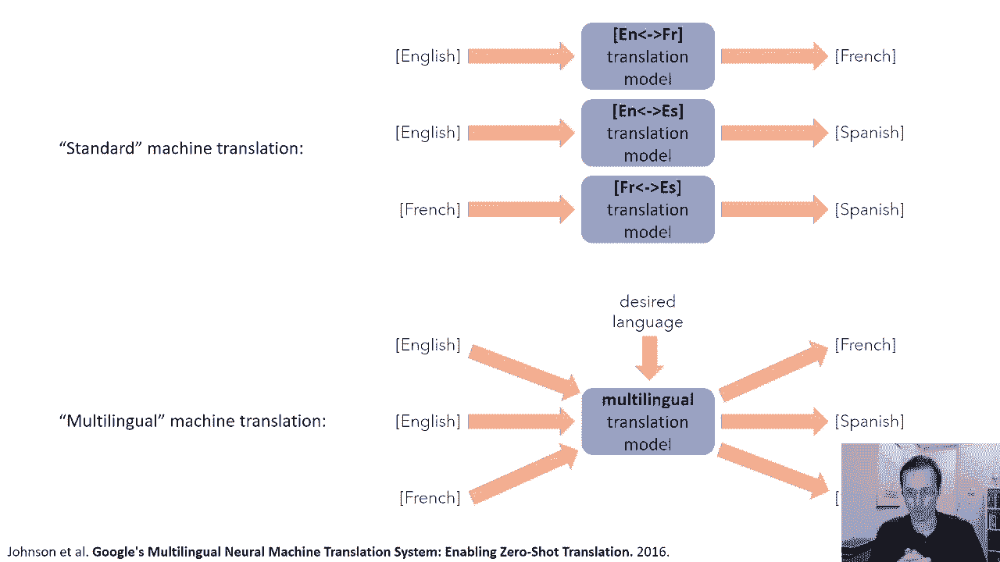
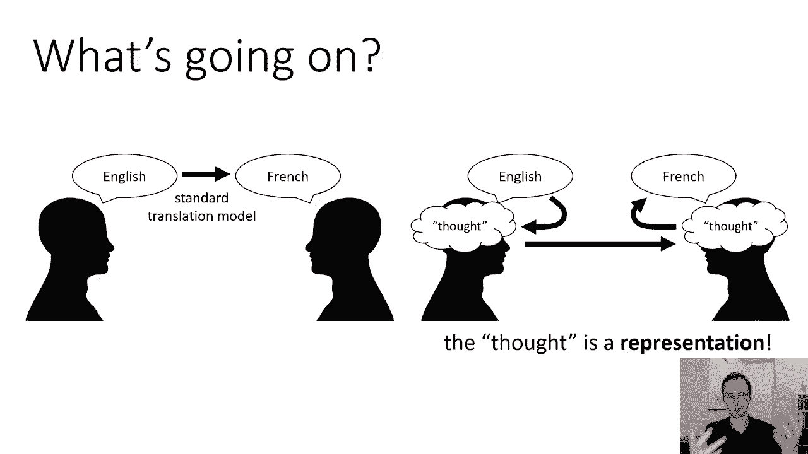

# 【双语字幕】伯克利CS 182《深度学习：深度神经网络设计、可视化与理解》课程(2021) by Sergey Levine - P1：CS 182- Lecture 1, Part 1- Introduction - 爱可可-爱生活 - BV1PK4y1U751

世界上有六千多种不同的语言，然而，如果我们想训练一个模型从一种语言翻译成另一种语言，比如说，用于机器翻译系统，我们通常需要配对数据，意思是，我们需要一种语言的句子示例和相应的另一种语言的翻译。

比如这个例子，我觉得，因此，我在英语中对应于法语dron，不要扫，所以我们训练机器翻译系统的方法是，我们通常会取一个大的配对例子语料库，一种语言中的意义句子及其相应的另一种语言的翻译。

然后在此基础上训练一个翻译模型，一旦那个模型被训练好，它可以吸收源语言的句子，并以目标语言制作相应的译文，但是如果你考虑到有多少种语言，这种方法可能会相当麻烦，尤其是当涉及到晦涩难懂的语言时。

或者没有那么多使用者的语言，这些有时被称为低资源语言，例如，你认为有多少个成对的句子，在现有的数据集中有将马耳他语翻译成藏语的数据集，当谷歌的研究人员不得不与这个问题作斗争时，对于谷歌翻译。

他们想了更有创意的解决方案，我想告诉你其中一个，因为我认为它说明了深度学习的一个重要原则。

因此，一个标准的机器翻译系统将为每一对语言训练单独的模型，所以如果你想把英语翻译成法语，你会得到一个英语句子及其相应的法语翻译的语料库，你还可能得到一个英语句子及其相应的西班牙语翻译的语料库。

也许是另一个法语句子和相应的西班牙语翻译，等等，这些人想用低资源语言来缓解这个问题，是建立一个多语言机器翻译模型，而不是对每对语言都有单独的模型，他们会有一个单一的模型，可以阅读任何语言的句子。

然后把它翻译成任何其他想要的语言，当提供指定目标语言的附加输入时，所以你会把这个多语言模型，给它你的句子，不管它碰巧是用什么语言，然后你会告诉它，把这个变成西班牙语，它现在会输出相应的西班牙语句子。

至关重要的是，像这样的模型可以在完全相同的数据上训练，作为上面列出的标准模型的集合，你只需把所有配对的英语和法语句子，给那些贴上目标语言法语的标签，你把所有的法语句子都换成西班牙语。

将其标记为目标语言西班牙语等，如此可以想象，您还可以告诉模型源语言是什么，但模型通常可以通过查看源句子来解决这个问题，所以训练这样的模型不需要任何其他数据，你只是拿着你已经拥有的数据。

现在以不同的方式使用它，为什么这可能是个好主意，嗯，你们中那些会说多种语言的人可能已经在猜测，至于这里发生了什么，许多语言有共性，所以如果你会说西班牙语，例如，那并不意味着你会说意大利语，当然啦。

意大利语和西班牙语是不同的语言，但这确实意味着你可以经常做出一个体面的有教养的猜测，关于个别意大利语单词的含义，因为西班牙语中可能会有基于相似规则的相似单词，对呀，所以这种多语言模型，它的例子相对较少。

它可以做出有根据的猜测，关于如何翻译成这些语言，这样的模型可以做的另一件事是，在不需要特定配对的情况下执行翻译，所以如果你把英语翻译成西班牙语，和英语翻译成法语和英语，日本人。

你的模型可能已经建立了英语句子的某种内部表示，所以如果你，呃也训练上，比如说，把日语翻译成汉语，但是你从来没有把英文翻译成中文，你的模型也许能弄清楚英语句子，当它被读入时，变成了某种通用的表示。

然后可以解码成你想要的任何语言。

那么这些研究人员发现了什么，他们发现的东西之一，当然啦，这样的方法可以提高效率，尤其是在翻译低资源语言时，这种方法可能比模型更有效，那么如果使用标准的单一语言模型。

I和更多通用语言的加入使资源较低的语言翻译工作得更好，所以如果你的资源很低，呃，使用与西班牙语和法语相似词根的浪漫语言，包括大量的西班牙语和法语数据，也会提高你翻译成这种低资源语言的质量。

所以这是有道理的，他们发现的另一件事，这有点令人惊讶，你实际上可以完成零镜头机器翻译，这意味着你有一对你从未见过配对数据的语言，现在，这并不意味着你从未见过这种语言，所以也许你学过英语到法语和法语。

到英语和英语到西班牙语，现在你可以把法语翻译成西班牙语，你以前见过法语，你以前见过西班牙语吗？但你从来没有见过例子从一个到另一个，这种零镜头翻译正是我之前所说的，如果模型在内部有一些内部表示。

对语言不可知论的，这是有道理的，它需要看到所有的语言对，这些研究人员做的另一个有趣的实验是他们研究，如果他们让模型解码会发生什么，翻译成多种语言现在这是如何工作的技术方面。

我们将了解更多关于这一点的信息，当我们在几周后更多地谈论监督学习时，但在高水平上，其实很容易，当您有一个以分类变量为条件的模型时，就像一种想要的语言，也来测试一下，以这些变量的混合为条件。

因为通常当这些变量传递到模型中时，它们被表示为位的集合这些位可以具有值，通常这些值是零和一，但您也可以将它们设置为小数值，而无需对模型进行任何更改，嗯，所以这意味着很容易拿着这个模型问它。

而不是制作英语、法语或西班牙语，要求它生产40%的西班牙语和60%的法语，看看它用它做什么，所以这是一个奇怪的实验，但它让我们对这个模型的思想有了一点了解，它会给我们一点洞察力。

关于它实际上是如何处理这些多语言问题的，所以这里有一个实验，我们正在接受一个英语句子，然后要求模型输出西班牙语和葡萄牙语的混合，左边的数字是葡萄牙人的体重，所以如果它是一个点零。

这意味着你在要求模特生产纯正的葡萄牙语，如果是零点零，这意味着你要求生产纯正的西班牙语，中间的任何东西都是混合体，现在，我不会说西班牙语或葡萄牙语，但只要看看这些句子，你可以感觉到发生了什么。

单词被交换出来，一次一个，一次三个中的两个，因此，它逐渐用葡萄牙语取代了一些西班牙语单词，直到它把句子变成完整，呃，葡萄牙语，所以你可以花一点时间看看这里的句子，另一只豚鼠欢呼被压制，好的。

那是英语句子，然后呃，在第一线，大家可以看到，呃，你知道这个西班牙语这个词，大概是，小白鼠是康妮，印度和EMO，我想我不会说西班牙语，但我想就是这样，呃，而如果你看看底部的葡萄牙语翻译。

你可以看到这是一个非常不同的词，这在葡萄牙语中大概是豚鼠的意思，这里有另一个有趣的例子，这是把英语翻译成呃的混合，日语和韩语，所以这里的数字代表韩国人的百分比，所以如果你要W KO一分零。

那就是说你要的是纯正的韩语，如果你要求零点零，也就是说现在是纯日本的了，日语和韩语使用不同的脚本，有趣的是，实际产生的产量，它不会花很多时间制作，日本和韩国字符的混合，好像有什么东西，我们在零点五八度。

但主要是纯日本角色或纯韩国角色，我不得不再次相信作者的话，因为我不懂日语或韩语，但显然句子中的语法实际上是逐渐产生的，从日语到韩语的切换，所以很明显是零点零，这是日语语法，显然在中间五分，八点六十。

它从日文字符切换到韩文字符，但语法看起来更像日语，然后是470。9和1。0，语法变得越来越韩语，好的，所以这很有趣，但这是我最喜欢的例子，也许这是我的最爱，因为我实际上，呃，能读懂语言，但在这里。

他们从英语翻译成俄语或白俄罗斯语，现在，然后这里的数字代表现在的百分比账单例行公事，有趣的是白俄罗斯语实际上是一种资源很低的语言，非常呃，即使在白俄罗斯，真正说白俄罗斯语的人也相对较少。

所以白俄罗斯语的翻译大概依赖于，更多关于其他相关语言的信息，比如俄语，所以在零点零，这是一个，这是俄语的正确翻译，我不会说白俄罗斯语，但这两种语言几乎可以相互理解，呃，对于白俄罗斯人来说。

底部的句子看起来很合理，我想有趣的是中间发生的事情，你可以从单词中看出，即使你看不懂剧本，一些出现在4。4点和4。6点的单词，看上去也不像，俄语顶部的单词，或者U中底部的单词，有趣的是。

在中间产生的第四点的句子，四，四点，六种实际上是另一种语言，这种情况下的语言是乌克兰语，这实际上很有道理，因为嗯，从俄语到双语的跳跃，你知道有点像从，俄语对乌克兰语，你知道两者和乌克兰人都是，你知道吗。

但受到了呃的更大影响，你知道吗，波兰语和其他中欧语言，而不是俄语，在更东边的地方，所以这很有道理，白俄罗斯语数据相当有限的模型，将利用来自，也在学习翻译成乌克兰语，你就会得到这种乌克兰人的判决。

在翻译过程中突然出现，呃，当你从俄语插值到开发人员时，所以现在很酷，我为什么要告诉你们这个轶事来开始上课，嗯，我想这个，呃，这个关于多语言模型的故事说明了深度学习的一个重要观点。

我认为这是深度学习如此令人兴奋的很大一部分原因，这个故事对我来说真的是，如果我们想出一种非常字面化的方法把一种语言翻译成另一种语言，我们会说好，让我们用英语说一句话，就像试着用法语变成一个句子。

这是一种标准的翻译观，但另一种思考翻译问题的方法是说，你得到的外表，它是用英语说的，但这是演讲者某种想法的结果，这种思想在某种意义上是语言不可知论的，所以它就像那个短语的语义内容。

如果你能弄清楚这个想法，我不是想和你住在一起，我不是说，我应该弄清楚他们在想什么，而是找出一些不可知论的语言来表达潜在的意义，然后想象一下一个说法语的人会是什么样子，产生与同样思想相对应的文字。

那么你就可以有一种非常强大的翻译方法，因为这样你就不需要看到所有可能的语言成对，对，思想是语言不可知论者，所以思想从一种语言转移到另一种语言，所以如果你知道说法语的人和说西班牙语的人。

说英语的人和说白俄罗斯语的人把思想变成文字，你知道如何从这些语言中的单词中找出思想，那你就不需要看到所有的配对，你只需要看到每种语言，如何将这种语言转化为一种思想，以及如何将这种思想转化为相应的语言。

所以你不需要所有的配对，如果你如果你能做到这一点，这是机器翻译变得容易得多的另一种说法，如果你有合适的代表，所以我在这里称之为思想，非常松散，实际上是一种表示，在这种情况下。

它是那些包含语义的短语的表示，嗯，没有与特定的语言结合来表达这种意思，现在，当然，这是一种非常崇高的说法，在现实中，当然啦，模特做得不太好所以一些如此花哨的东西，它并不真正理解这些词的意思，但尽管如此。

它产生了某种对语言更不变的表示。

呃，比文字本身，所以让我们来谈谈表征学习，机器学习问题的经典观点，基本上是从x预测y的问题，当我们学习基本的统计数据时，统计拟合，以此类推，我们看到一张图片，看起来像这样，你有你的X，您在横轴上的输入。

你有你的Y，您在垂直轴上的输出，你的工作是想出如何把这些X，通过拟合某种模型来融入这些Y，在这种情况下，它是线性拟合，所以这里我们拟合了一个线性模型，但我觉得，关于机器翻译的故事。

让我们对机器学习实际上可以做什么有了一些不同的看法，所以说，什么是X在实践中和实践中，它可能是另一种语言中的句子，它可能是一个图像，可能是一种声音，可能是某人说的话，所有这些都比一个数字复杂得多。

它们内部包含了更多的结构，像深度学习这样的技术如此强大的主要原因，近年来引起了如此多的兴奋，他们可以获得这些复杂输入的表示，适合实际做出有意义和复杂的预测，处理如此复杂的输入需要表示。

深度学习方法允许我们自动学习这些表示，所以深度学习的力量在于能够从数据中自动学习这样的表示。

