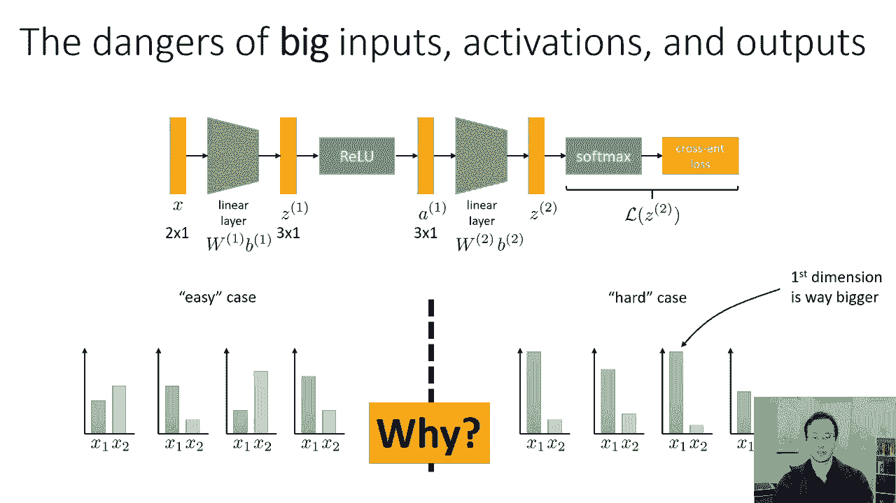
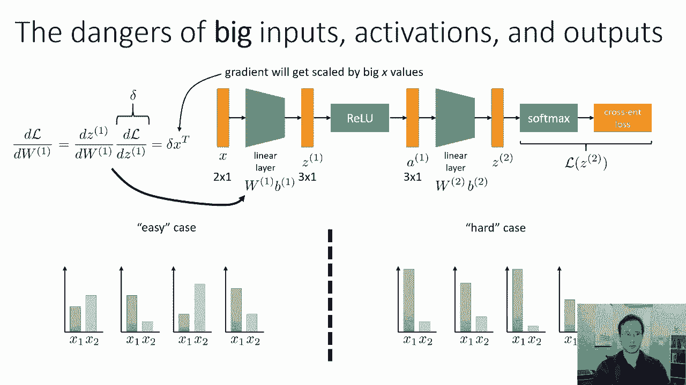
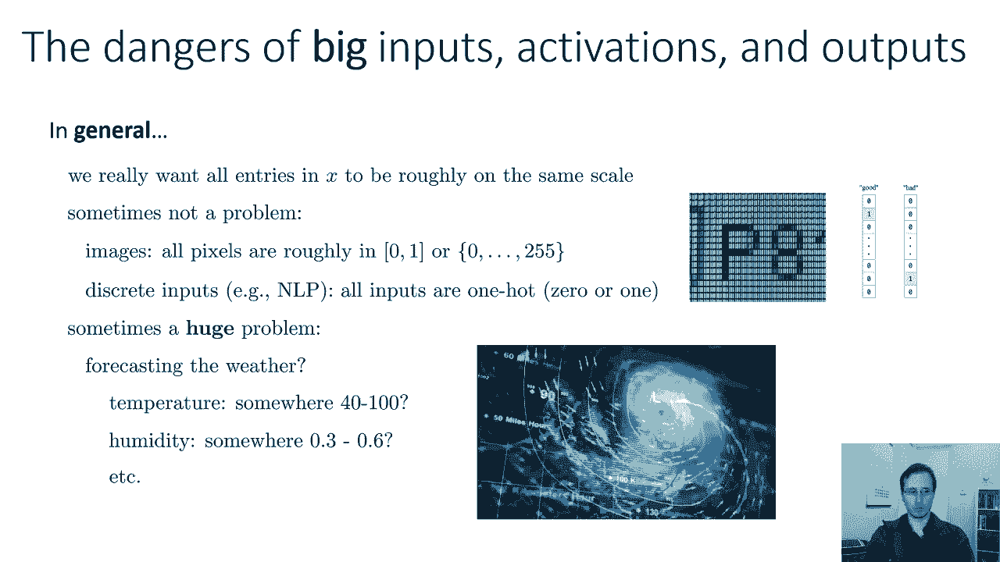
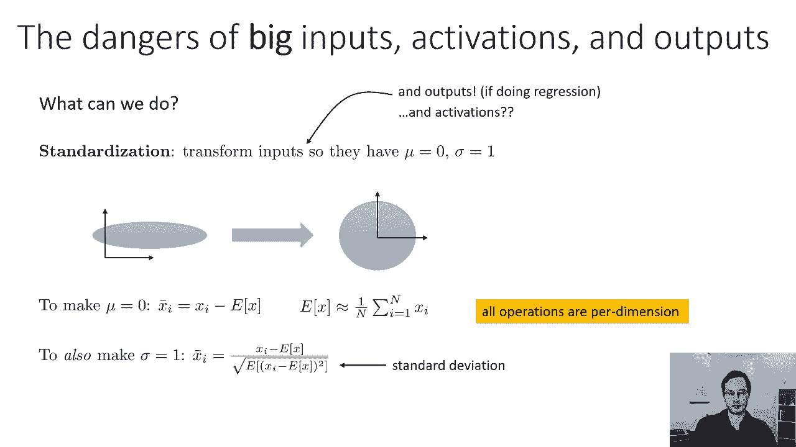
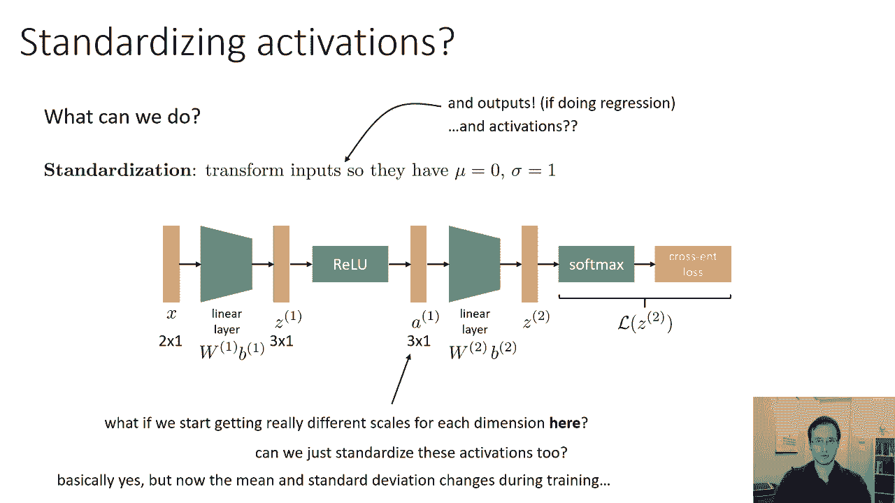
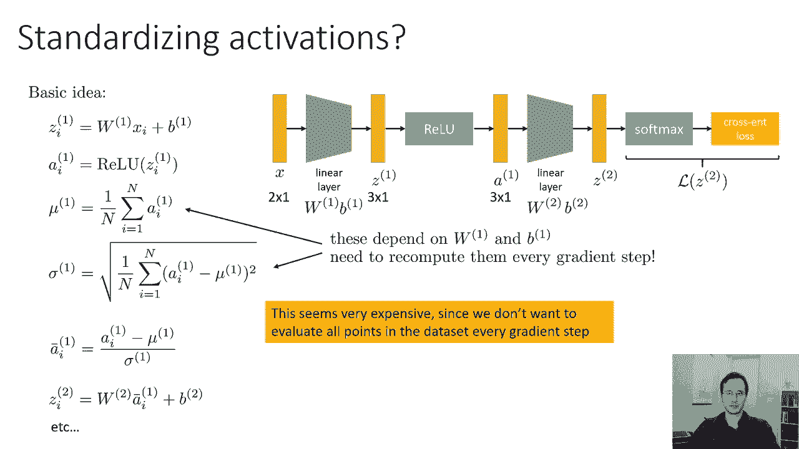
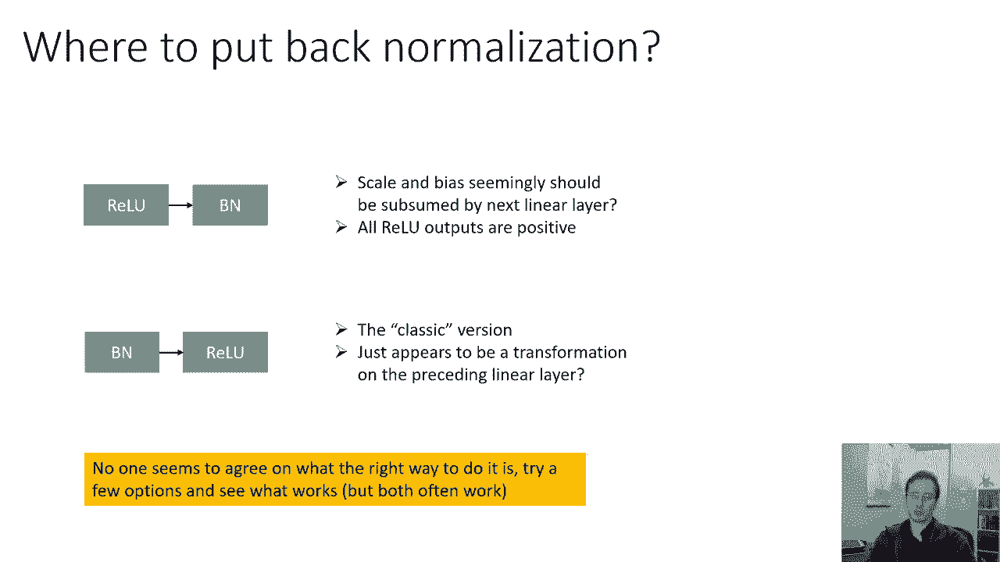
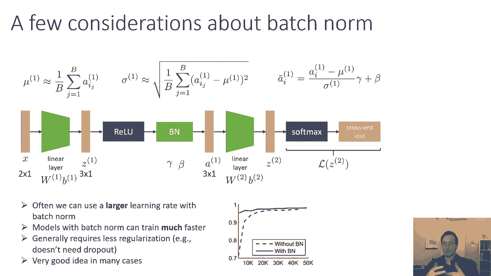

# 【双语字幕】伯克利CS 182《深度学习：深度神经网络设计、可视化与理解》课程(2021) by Sergey Levine - P20：CS 182- Lecture 7- Part 1- Initialization, Batch Normalization - 爱可可-爱生活 - BV1PK4y1U751

所有的权利，欢迎收看第七讲，今天一八十二，我们将讨论如何让神经网络更好地训练。

所以呃，在这次讲座中，呃，基本上我们将讨论以下问题，如果你遵循我在以前的讲座中建议的所有东西，你建立了你的神经网络，然后你试着训练它，事情不太顺利，即使你把所有东西都正确地植入了，你训练了它很长时间。

这没什么不寻常的，所以要记住，神经网络优化景观是有问题的，到处都是怪物和龙，神经网络很混乱，他们需要很多技巧才能训练好，了解这些技巧对取得好成绩真的很重要，就像理解所有理论上的细微差别一样重要。

所以我们今天将讨论这些技巧中最重要的一些，我们将讨论如何使，或使输入和输出标准化，我们将讨论正常化激活，我们将讨论一种称为批处理规范化的技术，这真的真的很有帮助，我们将讨论如何初始化权重矩阵和偏置向量。

我们将讨论一些技术来获得更多表现良好的渐变，然后是一些关于超参数优化的最佳实践，还有一些很好的合奏技巧，正规化和辍学之类的事情。

所以让我们呃，从正常化开始，我将首先解释为什么这是一个问题，然后我会讨论一些真正有用的技术，让你的神经网络更好地训练，让我们先讨论一个没有问题的场景，有点容易的设置，假设你有我上面画的神经网络。

它接受二维输入，假设我们的数据点，有些可能是这样的，对呀，所以这里的每个小图都是一个数据点，然后呃，它是二维的，条形图表示二维，x 1和x 2，现在通常你会有更高维的输入，但在这里它们是二维的。

只是为了让它更容易画，所以这里一切看起来都很正常，x和x一和x二不同，这是一个标准设置，我们希望一切都能顺利进行的地方，这里有个难题，再看看这些图表，作为提醒，每个图表示不同的数据点。

这两条表示该数据点的两个维度，你觉得为什么，右边的箱子会比左边的箱子难多了，这里唯一真正的区别是对于右边的硬壳，第一维度与第二维度在一个非常不同的尺度上，所以右边的第一个维度总是大得多。

从它的数值更大的意义上说，它都更大，而且它的范围比较大，这些数据点表示的实际信息甚至可能完全相同，可能是，如果您要为右边的数据点缩放条形图，你可能会得到看起来和左边分布完全一样的东西。

这种事情实际上在现实世界的数据中经常发生，尤其是当您将数据与不同类型组合时，例如，如果你，如果你有一个以公里为单位的距离的特征向量，一些速度用你知道的，米每秒什么的，这些可能在非常不同的尺度上，而现在。

你会希望你的关系网对这些差异有相对的弹性，就像你知道的，以米每秒为单位表示速度和以英里每小时为单位表示速度有什么区别。

对呀，但这实际上会有很大的不同来理解为什么，右边的案例对神经网络优化来说是如此困难，让我们考虑一下特定层上导数的表达式，让我们采取，比如说，第一线性层，让我们看一下损失对W 1的导数，就从链式法则。

从我们之前对反向传播的讨论来看，我们知道DL DW 1是DZ 1，dw一次，DL DZ One，dl，dz，one，is，dl，dz，one，is，the，dl，dz，one，is，the，delta。

vector，and，back，spread，one，is，dl，dz，one，is，the，delta，vector，and，我们在反向传播讲座中看到，如果我们知道，求出所有的东西。

并计算出这个导数等于什么，它只是德尔塔之间的外积，这是我们反向传播的向量，x转置，所以x是这一层的输入，然后我们把它转置，但现在在困难的情况下，我们知道x的不同维度有非常不同的大小。

这意味着δx转置对于不同的行也有非常不同的大小，所以这意味着，相对于我们的权重矩阵的导数在大小上会有很大的不同，对于权重矩阵的不同维度，所以有些导数会很大，有些会很小。

在简单的情况下，x的大小对每个维度都大致相同，你会期望不同权重矩阵项的导数的大小，看起来也有点相似，所以在简单的情况下，这意味着我们的客观景观可能会像这样表现得很好。

所以梯度步骤实际上至少指向一个局部最优，而在困难的情况下，因为导数中的不同条目会有非常不同的大小，会更接近我们之前看到的疑难案件，最陡峭的下降方向实际上并不指向最佳，当我们朝着它前进的时候。

我们最终迈出了很多小步，当然还有，你知道的，对优化算法的各种改进可以在一定程度上缓解这个问题，但这绝对是一个问题，所以总的来说，我们真的希望我们输入中的所有条目都大致相同的比例。

通常这实际上不是一个问题，比如说，如果你是，如果您的输入由图像组成，就像上次的大陆讲座一样，所有的像素基本上都在0到1的范围内，或者零到五五，取决于你如何表现你的形象，所以通常对于图像。

我们不必担心这个，因为不同的像素可能已经在相同的尺度上了，在我们有离散输入的领域，如自然语言处理，所有输入可能是一个热向量，在这种情况下，我们也不必担心这个，因为我们所有的输入都是0或1。

所以这不是问题。

但有时这可能是一个巨大的问题，想象一下，例如，你正在建立一个神经网络来预测天气，你输入的一些维度可能是温度，大概在几十到几百之间，有些入口是潮湿的，百分比，基本上它们是分数，它们可能在零到一之间。

现在你有不同的输入，在非常不同的尺度上，由此产生的梯度将受到很差的条件，网络也会倾向于关注更大的数字，在它注意到较小的数字之前，即使它们对预测问题不一定更重要，所以在实践中这是一个相当大的问题。

如果你有像这样的实值输入，那么我们做得好的是什么呢，我们能做的是标准化，这有时也被称为正常化，但从技术上来说，标准化是它的专有名词，也就是说，我们将把我们的输入，所以它们的均值为零，标准差为1。

至关重要的是，我们可以在不改变输入中包含的任何信息的情况下进行这种转换，所以呃，如果输入的分布如下所示，让我们说在那里，你知道的，大致正态分布，但是在一个轴上比在另一个轴上有更多的可变性。

标准化会以某种方式改变它们，所以沿着每个轴都有大约相同的变化，每个轴的中心为零，所以如果你想让平均值为零，你所要做的，从x的每一维减去平均值，因此，对于数据集中的每个数据点，你要计算一个转换数据点。

正好等于x，i减去x的期望值和x的期望值，就是这个意思，你只需通过平均数据集中所有的x来估计它，非常简单，如果你想把标准差也做一个，然后你做同样的事情，但你也除以x的期望值的平方根。

i减去x的平方的期望值，它只是数据集中x的标准差，减去平均值除以标准差，当然，所有这些操作都是按维进行的，所以对于x的每一维，您执行此操作，这不会改变数据中包含的信息，对呀，你所做的就是减去一些常数。

然后除以一个常数，但它确实使你的数据在每个维度上都有零均值和单位方差，它防止了这种尴尬的缩放问题，所以如果你有真正有价值的输入，你怀疑它们可能在不同的尺度上，这是一个非常好的主意。

如果你有图像或一个热矢量，这实际上是深度学习中经常发生的情况，那你就不用那么担心了，对输出这样做也是个好主意，如果你在解一个回归问题，所以再一次，如果你在解决一个分类问题，你的输出只是标签。

没有什么可以标准化的，但如果你在做回归，如果你在预测真实的价值，它还有助于使训练集中的输出标准化，但我们也能标准化激活吗，所以即使我们的输入是相同尺度的像素，或者一个热矢量都在同一尺度上。

也许我们的激活可以解决一些问题，也许标准化这些实际上是一个非常好的主意。

如果我们的X表现得很好呢，我们开始看到不同维度的不同尺度，在中间的某个地方，也许对于激活向量，一个什么的，也许我们可以把激活标准化，也是，我们基本上可以这样做的唯一问题是现在。

你激活的均值和标准差实际上会在训练过程中发生变化对吧，x的均值和标准差不会改变，当您更多地训练您的网络时，因为网络不影响X，但是，网络中间某个激活向量的均值和标准差会改变，在培训过程中。

所以让我们想想怎么做，基本思想很直截了当，假设我们试图将第一层的激活标准化，也许z等于w 1 x加b 1，然后我们应用一个relu，然后让我们在RA之后标准化，然后我们计算我们的平均值。

这只是激活向量中每个条目的平均每维，我们将计算我们的标准差，也就是平方差的平均值的平方根，就像以前一样，然后我们将为每个数据点计算一条，我作为一个，i减去μ1除以sigma，和之前一模一样，现在的区别。

当然啦，MU和sigma本身依赖于网络的参数，但后来我们就用酒吧代替了，所以这就是批处理规范化背后的基本思想，批处理规范化旨在标准化每一层的激活，以确保您的渐变行为良好，并防止某些维度比其他维度大得多。

然后我们继续评估这个网络，所以主要的问题是，使用我在幻灯片上概述的批处理规范化的幼稚版本，就是，因为均值和标准差取决于w 1和w和b 1，每次神经网络的参数改变时，你都必须重新计算它们。

现在你的神经网络的参数随着每一个梯度步骤而变化，这意味着在每一个梯度步骤之后，是啊，是啊，这个简单版本的方法需要遍历每一个数据点，计算它的激活，并用它来计算mu和sigma，但请记住。

当我们使用小批处理梯度下降，每个梯度步只使用点的一小部分来计算，所以如果我们现在必须检查数据集中的每一个点，只是为了计算mu和sigma，这将是非常昂贵的，我们非常希望避免这种情况。

所以我们在批处理规范化中实际上要做的或多或少是。

使用小批量估计亩和西格玛，这就是为什么它被称为批处理规范化，因为它在一批中正常化，所以说，而不是估计平均值，通过平均数据集中每个数据点的激活，我们将估计平均值，所以如果您假设批处理有大写B元素。

这些元素的指数是i到ib，然后这个方程会给出批次的平均值，我们对标准差做完全相同的事情，而不是计算整个数据集的标准差，我们只在批次上计算它，这基本上是批处理规范化背后的主要思想。

一个实际的实现在一个实际的，呃，执行，批处理规范的真实版本，我们还将为我们的激活增加两个参数，我称之为伽马和贝塔，所以问题是，在我们减去平均值，除以标准差之后，我们的激活将在一个特定的范围内，具体来说。

它们的标准差为1，平均值为零，但我们可能不想让它进入下一层，所以我们可能想通过将它们乘以规模来对它们进行转换，并添加一个偏见，所以我们有这个可学的尺度和偏见，它们是向量，它们与激活具有相同的维度。

就像你有一个偏置向量一样，呃为了，对于线性层，现在你有一个比例向量和一个偏置向量，批处理规范化的标准版本添加了这些参数，虽然如果你把它们排除在我的经验之外，东西基本上都还能用，事实上。

对于这种批处理规范化的方式，您将其放在relu之后，事实上，b二，但是批处理规范化的标准教科书版本有这些参数，所以在我们的描述中，我们会有他们。

所以你可以把批处理规范化看作是一个执行分离的层，所以说，批规范化是计算mu和sigma的层，从当前批处理中进入批处理规范层的所有激活，然后它有参数伽马和贝塔，这两个向量的大小与激活数相同。

这里的所有操作都是逐点的，这意味着它们是每个维度的，呃，您执行这些操作，简而言之，这基本上是批量规范化，如果要用批处理规范化训练网络，就像我们在后面的道具课上做的那样，只需使用反向传播，作为一种练习。

你可以算出导数，关于批处理规范参数，对于批处理范数输入，还记得我们后面道具的讨论吗，你所要做的就是为你添加的每一层，你必须能够计算关于它的输入乘以增量的导数，对其参数乘以delta的导数。

只要你能计算出这些量，然后您可以将该层插入反向传播，如果你想算出导数，你可以在自己的时间在家做这件事，有很多微积分，有点乏味，但它相当简单，所以只要使用常规的单变量微积分恒等式。

你可以算出批量归一化的导数，关于数量，在我们的情况下是一个，关于其参数γ和β，一旦你计算出这些导数。

现在，在我们真正使用批处理规范化之前，我们必须回答一个问题，在实践中，我们应该把这些批处理规范化层放在哪里，通常我们会做的是，我们会把批处理归一化层放在每个正常层之后，在每一个线性层之后，比如说。

但我们仍然可以选择，是把它们放在非线性之前还是之后，所以这两张图显示了两种选择，我们可以有一个线性层，然后是relu或乙状结肠，然后是批处理范数，然后是另一个线性层，然后是另一个relu，另一批规范。

或者我们可以有线性层批处理范数，然后线性层批处理范数，真正线性的层批处理规范，然后呢。

这些选择中哪一个更好，它们实际上都被用过，他们都把批处理规范放在Relu之后，因为这有点奇怪，因为你有尺度和偏见，似乎应该被下一层所包含，因为，就像批处理范数层中的偏差是多余的，用下面线性层的偏置。

那为什么要，你不必，你可以省略它，另一件事是RAI的所有输出都是正的，和批处理范数将通过减去平均值得到一些负值，但也许这没关系，如果你把批号放在RAU之前，那其实是经典的版本，原批规范纸上描述的那个。

但它看起来也只是前面线性层上的一个变换，嗯，没关系，呃和呃，实际上这两种变体都有效，似乎没有人同意什么是使用批处理规范的正确方法，你知道，如果你想尝试一下，可能要做的是尝试这两种选择，看看什么管用。

或者随便挑一个。

因为它们实际上都工作得很好，关于批处理规范的一些注意事项，请记住，如果你要在实践中使用它，如果您确实使用批处理规范，你可以经常使用更大的学习率，你可以使用更大的学习率的原因是。

因为它会使你的导数更有条件，记住它将如何防止，呃，在某种程度上，这些真的很尴尬，笨拙地缩放客观景观，其中某些维度的梯度比其他维度大得多，把所有东西大致放入球形高斯，它会让你的衍生品表现得更好。

这将允许您使用更大的学习速率，因此，您通常希望在批处理规范中使用更大的学习速率，这样效果更好，具有批处理规范的模型往往训练得更快，所以这是对mnist数据集的一个实验，来自原始批处理规范，纸。

蓝色曲线为批处理规范，虚线黑线没有批处理规范，你可以看到批处理规范，它提高了这个精度，所以越高越好，它达到了更高的精度，快得多，看起来它实际上是以更高的精度开始的，那其实不是真的，它来得太快了。

你在图表上看不到，通常，用批处理规范训练的模型也需要较少的正则化，所以我们来谈谈所谓的辍学，在今天的讲座快结束时，用批处理规范，我们通常不会用它，不清楚为什么它们需要较少的概括，但似乎是这样。

所以批处理形式实际上是一个非常，在很多情况下都是很好的主意，然后呃，尤其是如果你训练的是一个更大的，在网络中更深，批量规范可以让它训练得更好，它可以让你的衍生品表现得更好，它可以让你使用更大的学习率。

批处理规范的几个细节，如果你真的用了，你知道经典版本确实有这些伽马和贝塔参数你可以省略它们，它将减少模型中的参数数量，通常它仍然有效，当您实际部署具有批处理规范的网络列车时。

如果您想要在单个数据点上运行网络的测试时间，现在您的批处理规范层将没有任何需要规范化的内容，所以通常我们在用批处理规范训练一个网络后所做的是，我们实际上在整个数据集上计算mu和sigma。

然后我们把它们冷冻起来，所以在测试的时候，我们实际上没有估计批次的亩和西格玛，我们直接用mu和sigma，从训练集计算的，在我们做完之后，然后原则上批量范数参数，可以用下面的线性层折叠。

如果批处理范数在非线性层或前一线性层之后，如果在非线性之前，所以你基本上可以在MU里烤，西格玛，伽马和贝塔进入线性层，完全移除批处理规范层，如果你想，或者你可以留着它，把穆和西格玛冷冻起来，基本上。

只需在数据集中存储基于mu和sigma的数值，然后，即使在单个数据点上也可以评估部署的网络，就像一个普通的神经网络。

