# 【双语字幕】伯克利CS 182《深度学习：深度神经网络设计、可视化与理解》课程(2021) by Sergey Levine - P22：CS 182- Lecture 7- Part 3- Initialization, Batch Normalization - 爱可可-爱生活 - BV1PK4y1U751

就在今天讲座的最后一部分，我们要稍微换档，我们将从如何获得神经网络，为了更好地优化，谈论如何让他们更好地概括，为此，我们将讨论合奏和辍学，在最后。

我们还将简要讨论如何选择所有这些超参数，这就是我们在进行机器学习时通常担心的问题，我们担心我们的模型会不会出错，以及如何让它少犯错误，所以问题是神经网络我们会有很多很多的参数，事实上。

我们将使用的一些最大的网络，就像我们上次讨论过的这些巨大的大陆，实际上可能有比数据点更多的参数，这意味着它们确实有很高的方差，现在它们的方差远没有我们从基础学习理论中预期的那么高，所以基本学习理论。

经典地告诉我们，这种过度参数化的模型应该做得很差，但事实上他们做得不太好，至少当他们获得大数据集时，所以他们的过度适应往往不是灾难性的，如果你有足够的数据，但它们仍然有差异。

这意味着如果你在来自同一分布的不同数据集上训练它们，你会得到非常不同的解决方案，所以这里有一个有趣的想法，如果我们有多个高方差学习者，基本上，而不是训练一个神经网络，我们可以以某种方式训练许多神经网络。

也许这些多个神经网络都会同意正确的答案，但他们会在错误的答案上意见不一，这是另一种说法，错误的方式比正确的方式多得多，所以如果你在对有一千个可能类的imagenet进行分类。

只有一个类对任何图像都是正确的，但是九百九十九是错的，所以你希望如果你有很高的方差，你以某种独立的方式训练多个不同的模型，然后他们就会犯独立的错误，这意味着当其中一个模型出错时，另一个可能会。

但他们可能会以不同的方式犯错误，也许你可以利用这一点来获得更好的解决方案，通过寻找模型都能同意的答案，忽略他们意见不一致的地方，这就是合奏背后的基本直觉，我们接下来将讨论，所以让我用图形来说明这个直觉。

假设我们正在解决一个回归问题。

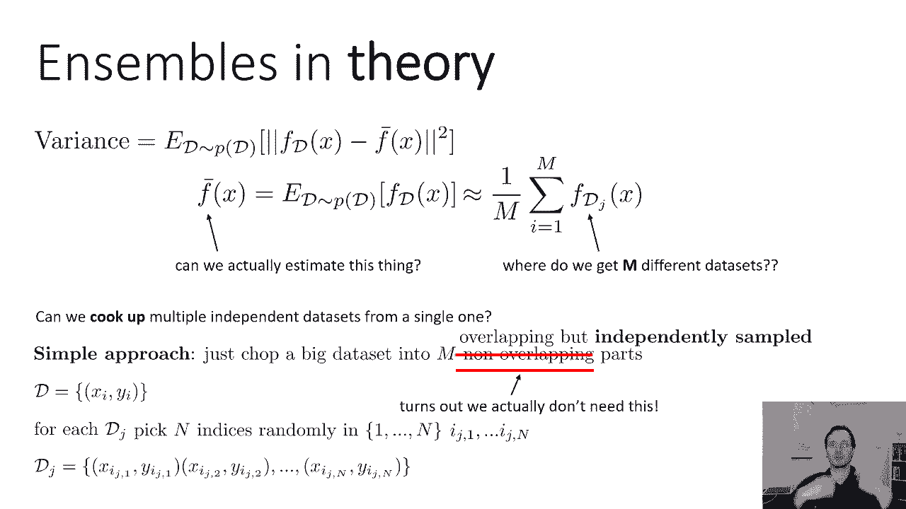

假设绿色曲线代表真实函数，蓝点是我的训练套装，我训练了一个大型神经网络模型，也许它的解决方案是用这条橙色的线表示的，所以橙色线在我的训练数据附近很好，但离开训练数据就很糟糕了。

也许我可以用一个非常不同的初始化来训练另一个模型，也许非常不同，你知道随机梯度下降中的随机性，现在就得到解，这两个模型在训练集上都很好，他们两个在测试集上都很糟糕，也许我会再试一次，然而。

如果我看看这三个模型的平均值。

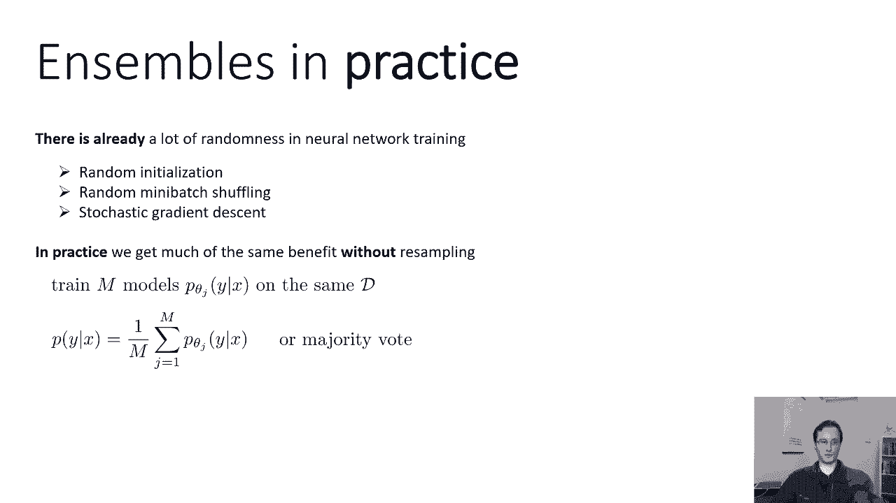

也许他们的平均水平实际上会很好，意思是呃，他们都会不同意，但总的来说，他们的错误将集中在正确的答案上，当然这张照片有点理想化，但这是基本的直觉，基本上，如果你训练足够多的模型。

这些模型在不同的方式上都不一致，也许他们的平均水平实际上是一个很好的解决方案。

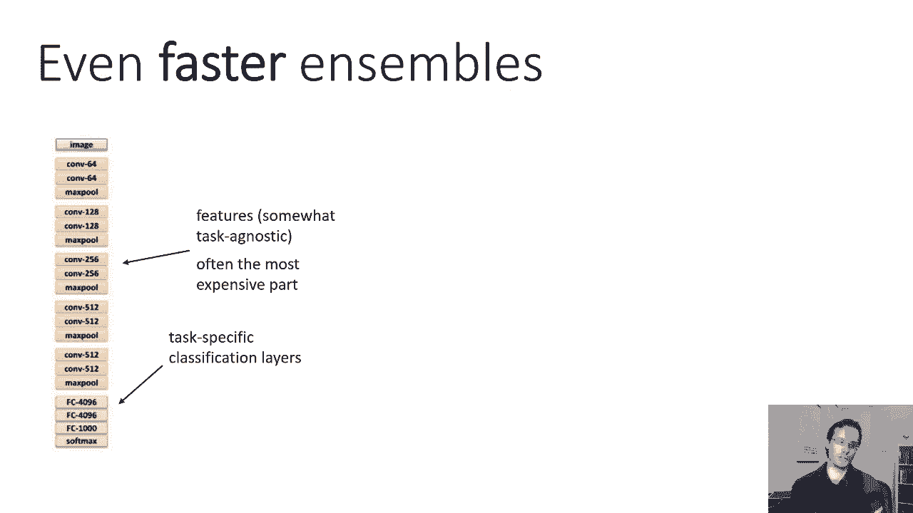

接近真实功能，所以我接下来要描述的是，构建所谓引导程序集合的理论上有原则的方法，然后我将讨论在实践中是如何做到的，在深度学习中，而且经常在深度学习中，实践与理论有些偏离，基于我们看到的工作良好。

方差是量化的，正如我们在课程前面讨论的那样，作为模型之间差值的期望值，我们从一些数据集的训练中得到的，d和训练分布中所有可能数据集的模型平均值，所以这里的f。

平均值只是我们从训练中得到的所有数据集的期望值，我们从对该数据集的训练中得到的函数的分布，正如我们在课程前面讨论过的，如果方差很大，您会期望您的误差很高，然而我们可以问，也许我们可以估计这个f巴。

因为如果我们能估计f巴，那么我们应该能够消除很多我们的差异，因为如果我们能估计f巴，你知道在酒吧会靠近F酒吧，因为这就是方差的定义，然后这个就会变成零，那么我们真的能估计这个期望值吗，比如说。

我们能不能，在每一个上面训练一个不同的模型，然后把这些模型加起来平均，本质上构造了一个基于样本的对这个期望值的近似值，那么我们就会期望，如果所有这些不同的FD模型不一致，在测试点上犯不同的错误。

那么也许他们的平均水平会被迫同意一些接近正确答案的事情，所以如果我们以某种方式得到许多不同的数据集，我们可以很容易地做到这一点，但是我们从哪里得到这些数据集，对呀，如果我们真的有20个不同的数据集。

我们最好把它们汇集到一个巨大的数据集中，只是训练而不是把它们分开，那么我们能从一个数据集中生成多个独立的数据集吗，不用喜欢，实际上数据较少，所以一个简单的，幼稚的方法是使用一个大数据集。

把它切成不重叠的部分，但那太浪费了，因为这样你基本上是在用更少的数据量训练每个模型，在这一点上，你可能会更好，只是训练一个大模特什么的，然后尝试将数据集切割成小部分，所以那不是，那可不好。

那不会给我们想要的，但也许我们不需要那些，m个数据集实际上不重叠，也许我们可以从一个大数据集中构造独立的数据集，那些独立的日子实际上和原来的一样大，但只是彼此不同，这似乎有点神秘。

但事实证明这实际上是可能的，所以我们要做的是，我们将构造多个重叠但独立采样的数据集，所以如果我们的原始数据集d，它由元组x组成，假设我们在d中有n个数据点，然后我们将构造n个不同的数据集。

他们每个人都叫DJ，每个也包含n个点，其中每一个点对应于原始数据集中的指数，从一到n中随机选择的，所以我们基本上会生成n个随机整数，它们中的每一个都在1到N之间，这些将是数据集DJ中点的索引。

所以我们会得到这些指数，i，j一，i，j二，i等，一直到我，约恩，然后我们将构造数据集DJ，你知道，j一，y i，j一，j二，y i，j二，等等，约恩，y i，约恩。

其中这些ij索引中的每一个都只是一个随机整数，介于1和，所以我们基本上是从原始数据集中重新采样数据点。

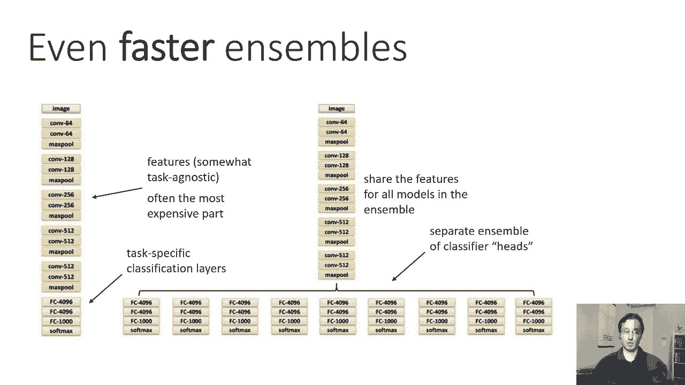

所以让我们呃，如果这个索引方案有点不清楚，让我们来看看这是如何工作的，这叫做替换取样，假设我们的原始数据集有三点，所以n等于3，当然在现实中你会有更多，但是为了在幻灯片上画这个。

我不得不用一个相当小的数字，假设我们正在构建我们的第一个重采样数据集，我们会把一个三面的模具，假设我们得到的随机数是2，这意味着我们选择x 2作为d 1中的第一个元素，然后我们再卷一个三面的模具。

我们得到了一个三，这意味着我们选择x3作为d1中的第二个元素，我们又得到了三个，然后我们选择x3作为第三个元素，您会注意到原始数据集中的一些数据点被多次选择，有些根本没有被选中，这没关系。

但数据点总数完全相同，然后我们会构造两个，同样的事情，我们会在1和n之间生成一个随机整数，这决定了，呃，第一个数据点，另一个随机整数，第二个数据点，另一个随机整数，第三个数据点，我们又有了一个。

我们得到了另一个与原始大小相同的数据集，但又不一样，因为我们用来构造这些数据集的过程，见，我们知道原始数据集中的数据点是在IDI中采样的，从培训分配中，因此，如果我们从原始训练集中采样新的数据点IID。

它们也将是原始训练分布的iID样本，因为它们是独立取样的，因为我们为每个人生成了一个独立的随机索引，它们实际上最终是来自相同原始分布的iID样本，所以这些数据集实际上最终在统计上是独立的，这很好。

因为我们可以用它来构造多个不同的函数，看起来很像F巴，所以我们要训练一个单独的模型，每个DJ上都有一个完全独立的神经网络。

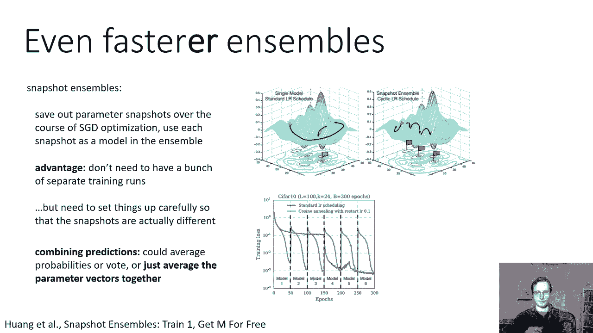

如果我们在做分类，这些模型，我们可以把它们称为Pθ1，pθ2，pθ3，等等，一直到他们，所以这些模型之间的区别在于它们有不同的参数向量，因为他们是相互独立训练的，关于不同但密切相关的数据集。

一旦我们有了这些不同的模型，然后我们必须以某种方式结合他们的预测来对一个新的测试点进行分类，那么我们如何预测，我们如何从他们那里得到一个预测，原则性的方法是将它们的概率平均在一起。

所以你把这些模型向前运行，从他们的软最大值中提取概率，然后你把概率加起来平均，得到集合的预测，这可以很好地工作，稍微简单一点的，但一个非常有效的方法是简单地进行多数投票，所以不是看这些网络的实际概率。

我们也可以让他们预测他们认为正确的答案是什么，然后输出与网络多数票相对应的答案，现在，花点时间想想为什么多数票的方法，可能比平均概率要糟糕一点，在某些情况下，当我们只是，呃，使用多数票。

如果我们有大量的类，比如，例如，Imagenet中的一千个不同类别，那么网络认为最有可能是错误的类很有可能是错误的，但也许网络仍然分配了一个很高的概率，第二个最有可能的类别，那个可能是对的。

所以也许一个网络可能会认为一个特定的图像是五个，一个可能是狼，百分之四九的可能性是狗，也许狗是正确的答案，但如果你投多数票，那么所有这些不同的网络，呃你知道，也许他们都给狗分配了四九概率。

所以狗狗最终可能会输，但是如果你把它们的概率加起来平均，那么事实上，他们都在最有可能的事情上意见不一，但同意狗是第二好的，可能会导致狗实际上是最有可能的阶级，所以多数票的问题很像第一个过去的问题。

对如果你，如果只有对候选人的投票，你最喜欢的被认为是，也没人问你第二喜欢谁，那么你可能会出现分裂投票的情况，在你知道的地方，不同的人群有不同的第一名偏好，不可能获胜，但他们对第二名的偏好实际上是匹配的。

所以多数票很简单，但是得到概率的平均值可以更好地工作。

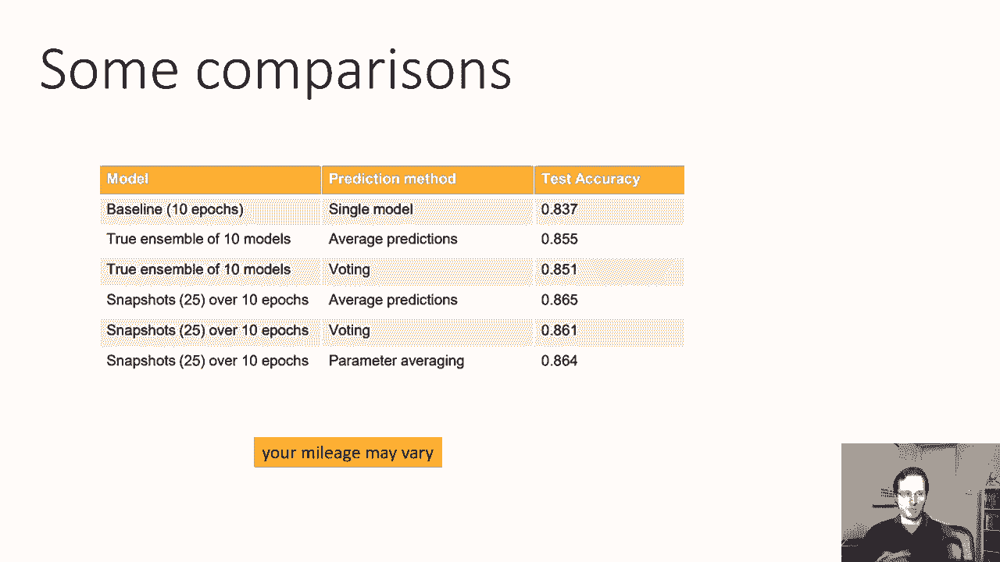

这在理论上和理论上都是合奏的，我描述的这种自举集成方法允许我们获得方差估计，来实际估计f巴，并在实践中得到这些重新采样的几乎独立的数据集，虽然当我们做深度学习的时候。

我们实际上很少使用这种带有替换的重采样，实际上有一个更简单的方法，非常常用的，这在实践中似乎同样有效，见，用替换过程重新取样的目的，就是在不同的模型之间获得足够的可变性，如此直观。

我们只是不希望所有的模特，用同样不正确的解，我们希望它们以某种方式区分开来，用替换的数据重新采样是让它们区分，然而，我们通常用于训练深度网络的方法已经有了很大的随机性，比如说，它们有不同的随机初始化。

即使我们使用相同的初始化方案，我们得到的实际初始化数字将是不同的，也许洗牌得到迷你批次会有所不同，这个随机梯度下降会导致，不同训练跑之间的可变性等等，所以基本上没有两次训练。

即使是同样精确的模型和同样精确的数据也会看到同样的，因为所有这些随机性的来源，所以在实践中正因为如此，我们从合奏中得到了同样的好处，甚至不生成这些单独的数据集，所以如果我们拿不同的模型。

我们在完全相同的训练集上训练他们，我们在实践中会得到足够不同的模型，这通常足够好，所以这种重采样业务是人们通常不会费心的，尽管理论上这应该是非常有益的，从深度网络中构造集合的实际方法是简单地训练M。

不同型号P，θ，j，y，给定同一训练集d上的x，然后你可以把他们的概率加起来平均，或者进行多数票投票。

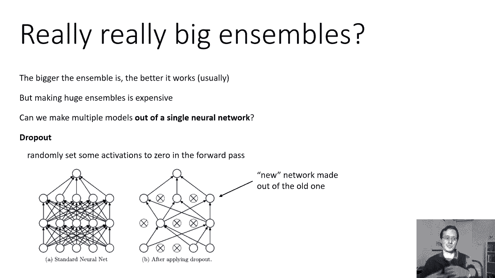

它非常，非常简单，它可以很好地工作，现在有一种更快的方法来获得一种快速而肮脏的组合，到目前为止，我们谈到了在同一个训练集上训练不同的网络，但这些网络可能非常大，训练它们可能非常昂贵。

记住深度学习实际上是学习表征，所以我们预计这些网络在内部做的大部分事情，实际上是获得输入的良好表示，所以如果你有一个非常深的大陆，比如说，呃，这是VGG，你可能会认为大多数卷积层实际上代表了，你知道的。

有点任务不可知论，但无论你接下来做什么，或多或少都有相同的功能，这是训练最昂贵的部分，因为那是你有的地方，那些非常大的激活地图，那是你使用很多很多内存的地方，然后可能顶部完全连接的层，这些都是任务。

真正试图弄清楚，图像中的东西是什么，所以如果真的是最后几个完全连接的层，他们正在做所有艰苦的工作来分类，其余的层大多只是拉出表示，也许你能尝试做的只是合奏，最后这几层。

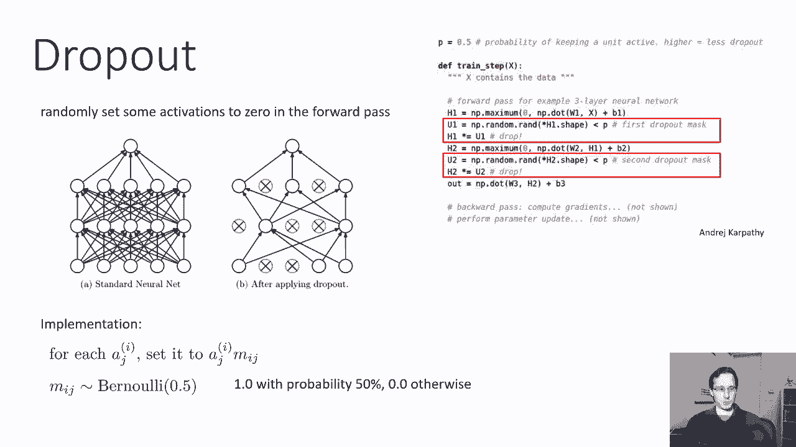

所以也许你可以训练多个不同的网络，但让他们共享真正执行特征提取的主干，这样您就可以共享集合中所有模型的功能，本质上，这是同一模型的一部分，但他们有不同的头，每一个都有一组不同的完全连接的层。

所以这看起来是，你基本上只需初始化这个多，不同全连通层的头部模型，多组完全连接的层，而是一个卷积的树干，然后仅仅因为随机初始化，不同的完全连接层会以不同的方式初始化，然后你用随机梯度下降训练它们。

但是随机初始化会区分头部，以至于他们可能会做出稍微不同的预测，那不如真正的合奏好，但训练要快得多，通常更容易设置，可以获得一些好处。

现在你可以走得更远，如果你，如果你真的关心构建你的集合的计算成本，所以更快的合奏也许可以通过简单地抓住合奏中的模型来获得，作为单一训练的不同检查点，所以你可以查看的报纸之一。

在幻灯片的底部引用了描述这个想法的内容，称为快照集合，火车一号免费得到M，所以这里的想法是这样的，呃，我们将保存参数快照，在神经网络训练过程中，我们也许每隔几百年就会拯救他们一次。

然后我们的最后一组将从所有这些快照中构建出来。

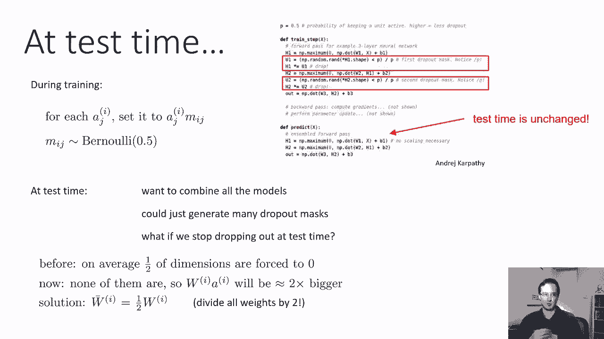

把他们当作一个整体中的单个模型，所以这是一个数字描述，从洪在所有的纸上，呃，所以上面的图显示了一个标准的神经网络训练，试图通过遵循梯度来获得全局最优，然后第二个图显示了他们的方法。

它基本上保存了周期性的快照，现在在这篇特别的论文中，他们还提出了一个特殊的周期性学习率计划，这个想法是你保存你的快照，在学习率最低的点，因为它迫使模型陷入局部最优，然后当它再次增加的时候，等它下来。

保存另一个检查点，这是一个设计选择，有不同种类的学习速度时间表，你可以用高阶位，你可以在训练时保存快照，并将它们组合成一个合奏，这样做的好处是你不需要，你不需要有一堆单独的训练跑步。

你基本上从一次运行中得到这些模型。

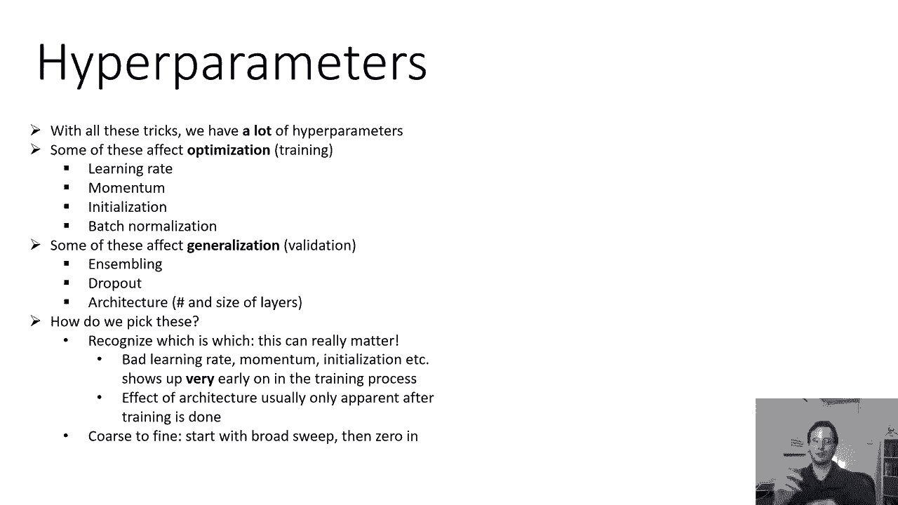

但你需要仔细安排，这样快照实际上是不同的，这样你就可以从这些不同的模型中得到不同的行为，比如说，你要确保你不会经常把它们救出来，也许你需要更长时间的训练，比如周期性的学习速度，或者做一些其他的。

仔细选择，以确保快照实际上彼此不同。

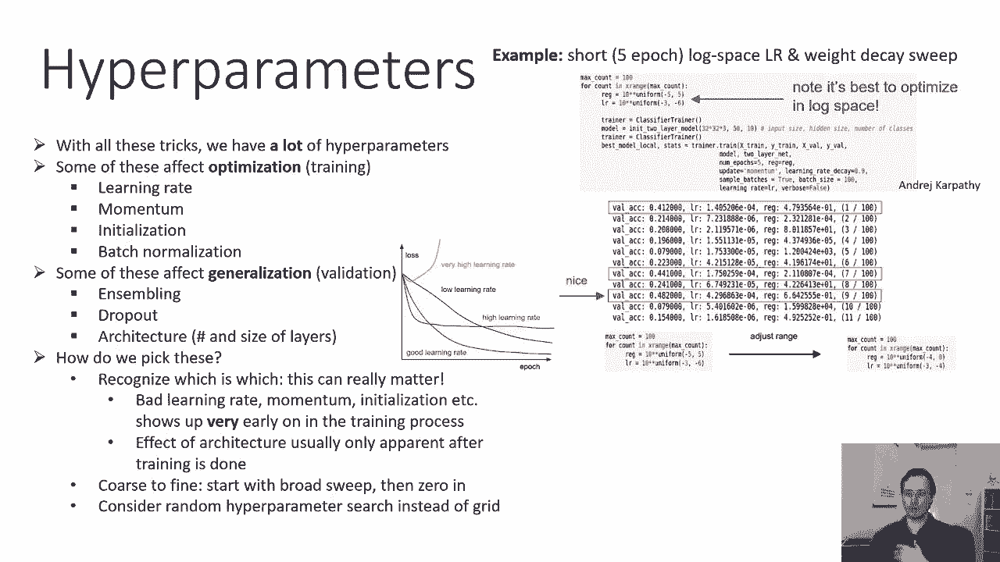

当你把这种集合的预测结合起来。

你可以做和我们以前做的一样的事情，你可以把他们的概率平均起来，或者做多数票，而是因为他们实际上来自同样的训练，运行另一个非常简单的技巧，你可以做，实际上效果惊人的是简单地将它们的参数平均在一起。

这似乎令人惊讶，但它实际上在实践中产生了相当不错的结果。

所以这里有一些关于，这是一个VGG上，我相信Cr ten，基准，呃只是一个单一的模型，训练了一段时间，然后得到点八三七的精度，然后有一种经典的合奏，这是没有重新采样的，但有十个独立的。

有两种使用集合的方法，合计平均，概率和投票，你可以看到平均要好一点，然后是，接下来的三行使用快照方法，这里的合奏更大，它有两个五，嗯，它的表现更好，它可能表现得更好，主要是因为它更大，所以。

这并不是说快照本身就更好，只是一个更大的合奏更好，参数平均实际上做得很好，没有平均值那么好得到概率，但现在练习得很好，你的里程可能会根据合奏对你的效果而有所不同，一般来说，一些合奏非常一致，帮助过去。

没有合奏，它到底有多大帮助，这些技巧中哪一种帮助最大可能在一定程度上取决于你的问题。

现在我们在这张桌子上得到了一个暗示，在上一张幻灯片中，合奏团越大效果越好，所以合奏越大，它通常工作得越好，但是做大型合奏真的很贵，尤其是如果你真的在训练独立模特，它基本上要贵100万倍。

你想要一百个模特的合奏，你要多花一百倍的计算才能得到它，现在计算很容易并行化，但它仍然会让你付出一些代价，有时候真的要花很多钱，因为你需要为那台电脑付费，所以这里有一个有趣的问题。

我们能用一个网络做一个巨大的集合吗，我们能不能把一个网络分成几个部分。

并从中得到一个巨大的合奏，所以这本质上是一种叫做辍学的技术试图做的，辍学背后的想法是，你要把你的神经网络，你会随机杀死一些激活，所以你会进入每一个隐藏的层和一些概率，比如说百分之五十。

你只需要删除一些单元，将它们设置为零，所以也许第一个线性层输出一些激活，那些要经过重新审查，他们有一些数字，然后你随机选择其中的一半，把它们设置为零，现在你可能想知道这和合奏有什么关系，嗯。

你可以想象这个过程杀死了一些激活，在旧的网络中构建一个不同的网络，本质上，每组激活对应于不同的网络，通过选择不同的随机激活组来删除，你本质上是在构建新的网络，但你不是，但这些网络没有单独的权重，当然。

它们实际上都有共同的重量。

他们只是有不同的，呃，拓扑，不同的，不同的体系结构，所以我们实现这一点的方法是在每次向前传递的过程中，每次我们到了某个层，假设我们来到第I层，我们计算激活，所以ai j是第i层激活向量中的第j个条目。

我们将它设置为aij乘以mi j，j是一个伯努利随机变量，其概率为零点五，所以伯努利随机变量，这意味着它有50%的机会是1，50%的机会是零，所以这只是另一种说法，对于网络中的每一次激活，概率为50%。

你把它归零，你在向前传球时这样做，然后向后传球的工作方式完全相同，但请记住，渐变是与，所以如果导数是，如果激活设置为零，那么它的导数也会设为零，所以实际上，当你这样做的时候。

您基本上可以从网络中删除该激活。

下面是Python中的一个示例实现，这是安德烈·卡尔皮的，所以嗯，嗯嗯，这是三层网络中的向前传递，所以你可以看到评论后面的行，最大零np点w 1 x加b 1，所以np点w 1逗号x加b 1。

这只是一个线性层，权重矩阵为w-1，偏置为b-1，这是一个非常正确的最大值，这是整流的线性单位，所以说，哈一，基本上计算第一个线性层后的激活及其相应的值，然后您想要的下一行创建一个随机掩码。

所以它本质上创建了一个随机数向量，其维度与h 1相同，但是这些数字中的每一个都是1或0，概率为p，选择零点五，然后它简单地执行逐点乘法，所以它将h中的每个条目乘以相应的零，或者U中的一个条目。

基本上清零了一半的激活，然后它又做同样的事情，好的，所以这是辍学的实际实现。

好了现在，这怎么可能行得通，就像，好像我们只是做了这个非常特别的事情，我们只是进去杀死一半的激活，就像你知道的，如果有人进入你的大脑删除一半的神经元，你可能很难集中注意力。

我们正在对我们的神经网络这样做，就像这怎么可能是好的，嗯，辍学为什么有效背后的直觉。

它迫使神经网络建立冗余的表示，所以如果你把这些激活的单元看作是基本的特征，神经网络被训练来处理没有任何特征是可靠的事实，每个特性都有被删除的概率，所以它不能只根据一个特征做出预测。

它真的需要有各种各样的功能，并真正关注所有这些功能，以防其中一些被随机删除，所以这是一个卡通插图，但如果你想象，你有一堆从动物照片中提取的特征，它有耳朵吗，它有尾巴吗，它有调皮的样子吗。

如果你不能依赖任何一个功能总是存在，如果每个特征都有可能被删除，然后你需要预测它是不是猫，通过真正观察组合，你可以说好，就因为它没有尾巴，不代表它不是猫，因为也许尾巴功能只是被随机删除了。

所以它迫使网络变得更强大更可靠，因此，你最终会得到更有效的培训和表现更好的网络，所以你可以把每个退出掩码看作本质上定义了一个不同的模型，一个以前存在的一些特征现在不存在的模型，所以说，有效。

当你这样训练的时候，你得到的东西看起来像一个真正的，真的很大的合奏，因为每一个特征删除的组合都可以被认为是一个不同的模型，现在作为一个快速测试你的理解，这个组合有多大，基本上。

你可以从一个神经网络中创建多少不同的模型，假设你有M层，其中每一个都有，嗯，每个单元，每个维度，每个激活向量都可以打开或关闭，所以可能的映射的数量实际上是指数级的，在K乘以n的激活总数中。

所以它是2的k次方m次方，那是大量不同的型号，所以你得到的不同预测之间有很大的差异，当您取样不同的退出掩码时。

现在，我们必须解决的最后一件事是真正能够使用辍学生，是测试时发生什么的问题，所以在训练过程中，在向前传球的过程中，我们矢量中的每一个激活，我们以百分之五十的概率把它设为零，在测试时间。

我们想把所有这些不同的模型结合起来，所以我们可以做一些很像普通合奏的事情，我们基本上可以生成许多随机的丢失掩码，并将它们平均在一起，但那很贵，因为你必须为每个退出掩码做一个单独的前传。

如果我们真的停止退出测试时间呢，对呀，如果我们只是使用退出作为一种方法来训练我们的模型是健壮的，但是在测试的时候，我们不太像参数平均那样做，我们用于快照集合，在我们能做的是。

我们基本上可以把所有这些不同模型的参数平均在一起，参数已经一样了，模型之间的唯一区别是给定的激活是否被归零，现在归零，这种激活可以被认为是等价的，将该激活的所有传入权重设置为零。

所以对于每个权重矩阵中的每一行，你套装里一半的模特都激活了，有实际行中的数字，另一半模型将整行设置为零，这意味着如果你把重量加起来平均，你所要做的就是把所有的重量除以二，因为在你巨大的指数级集合中。

一半的模型将把这些权重设置为它们的原始值，一半将它们设置为零，所以如果你把这些零和原值加起来平均，你只得到原值的一半，另一个思考为什么这是一个好主意的方法是，平均来说，一半的维度被迫为零，而在测试时。

他们都不是，因为在考试的时候，我们不会辍学，所以激活会大两倍左右，这意味着我们可以把重量缩小两倍来补偿，它们会回到原来的规模，所以这是两个，思考为什么你需要将权重除以二的两种方法。

如果你想避免退出测试时间，一种思考的方式是，你们在一起真的很平均，在这个指数级的大集合中，所有不同模型的权重，一半是原来的重量，一半是零，另一种思考方式是，你只想让你的激活保持在相同的规模。

它们现在会大两倍。

因为你不会杀死他们中的任何一个，所以你需要除以2，这里有一个特别优雅的实现这个想法，这又是，呃，来自安德里亚·卡帕蒂，他在考试时实际上什么也没变，所以在测试时，你像往常一样向前运行网络，但相反。

你实际上，嗯，将所有激活减半，按训练时的辍学概率计算，所以基本上在训练的时候，所有的重量都有效地增加了两倍，然后在测试时间他们保持原样，所以你可以在测试时间进去，把所有的重量除以二或在训练时。

把所有的重量乘以2，这已经，当然啦，同样的效果，所以这里唯一的变化是，当我们在这里计算的时候，他实际上折叠成辍学面具，所以当我们计算你一个，我们得到这些数字，要么是零，要么是一。

然后我们把这些数字除以p，也就是退出概率，也就是零点五除以零，点5表示数字现在是零或二，所以被杀死的激活，它们乘以零，剩下的激活乘以2，基本上弥补了其中一半缺失的事实，然后在测试时。

我们只需移除退出掩码，但重量保持不变，但这在数学上与幻灯片底部描述的等价。

这就是合奏和辍学，今天这节课我要讲的最后一件事，是关于我们如何调整超参数的一点评论，所以有了我们所说的所有这些技巧，我们最终会有很多超参数，其中一些影响优化，那就是它们影响训练过程，比如学习率。

动量初始化，批量归一化，等等，其中一些会影响泛化，这意味着这个网络在验证集上的性能如何，像合奏，退出体系结构，层数，那些层的大小等等，那么我们如何选择所有这些超参数，嗯。

要做的一件非常重要的事情是识别哪种类型的参数应该影响什么，例如，不良学习率，动量初始化，它们主要会影响训练过程，所以如果他们选得不好，他们会在训练中很早就出现。

所以你可以调整这些超参数的方法之一就是调整它们，开始训练网络，看看训练错误，看看训练误差在最初的几个时代是如何演变的，而其他一些超参数，比如改变层数等等，将主要影响您的验证性能。

它们的效果只有在现在晚些时候才会显现出来，如果你调整优化参数，如学习速度和动量，您仍然可以使用验证错误，如果你不是太合身，验证错误和训练错误看起来很相似，但如果你在调整退出之类的事情，使用合奏。

改变那里的建筑，您真的需要查看验证错误，因为这些事情中的大多数实际上会使训练错误变得更糟，当调整超参数以，做一个寻找搜索的课程，所以你能做的就是，你可以从一个非常广泛的扫描超参数开始，只训练一会儿。

看看表现如何，训练基本上是如何进行的，再次调整超参数，缩小他们的范围。

然后重复，所以这里有一个想法的草图，这要归功于安德里亚·卡帕蒂，这里的示例是一个短的五历元对数空间，学习速率和权重衰减扫描，所以这个例子所做的是调整两种类型的参数，学习速度和呃，reg。

也就是这里的重量在L2上衰减。

在权重上的正则化，这两个参数都是通过在日志空间中扫描来选择的，所以这套制服只是给你一个数字向量，负五，负四，负三等，然后十的次方，嗯。

你知道的，使用随机选择的参数作为外显子。

所以你在负5和5之间选一个，加十到那个次方，这就是你的正规化，在负3和负6之间选一个，加十到那个次方，这就是你的学习速度，为什么日志空间好，因为你真的想得到一个粗略的想法，了解这个超参数如何影响事物。

所以选择，你知道的，对数空间中的均匀随机学习速率意味着，你有很好的机会得到跨越非常广泛范围的数字，从10到负3到10到负6，注意这是一个随机的超参数扫描，所以这些学习速率是随机选择的。

然后进行多次训练看看哪一种效果最好，我们很快就会回到这一点，嗯，然后底部的结果显示，在这种情况下发生了什么，他正在考虑运行100个不同的验证准确性，呃，五个，纪元训练跑，有了这些随机学习率和规则化。

你可以看到其中一些最终工作得很好，仅仅从看哪些工作得很好，你可以大致地测量好的超参数值的范围是多少，所以这里，看起来好的学习率往往在，呃，你知道的，十到负四，可能从一点到四倍不等，负四到四点的十，三个。

十到负四，所以它会说它在十负四的某个地方，十到负三个范围和良好的正则化似乎是，它们到处都是，所以有些是负的十，他们中的一些人是10的负4。

所以也许超参数并不那么重要，那么我们要做的是。

我们要把范围调整得更细一点，所以也许我们在确定我们的学习速度方面做得很好，所以现在我们把范围改成负3到负4，记住那是日志空间，但正规化似乎无处不在，所以我们就把它放在范围内，负4到零，记住区域日志空间。

然后我们又运行同样的事情，你也可以看看实际的学习曲线。

来衡量他们的工作情况，所以呃，如果呃，你知道你的训练损失下降了，然后又回升了。

也许你的学习速度太高了，这就是我们之前讨论过的所有东西。

为什么要进行随机超参数搜索。

你可以做一个网格搜索，在网格搜索中，你基本上有规则间隔的参数是非常方便的。

呃，如果你想要一些非常可解释的东西。

但是随机超参数搜索实际上在实践中更有效，嗯，它的原因很好地说明了这一点，呃，图来自伯克斯特兰德·本吉奥的一篇论文，这表明如果你有两个超参数，其中一个很敏感，另一个很麻木不仁，所以画在横轴上的那个。

一个非常重要的超参数对性能有巨大的影响，你可以看到在一个地方有一个很大的山峰，而另一个超参数对性能的影响相对较小，这实际上是这样的，在上面的例子中，学习率和正规化，因为在那个例子中。

学习速度有巨大的影响，我们真的想把它选在负3和负4之间，而正则化似乎对广泛的值都很有效，从负一到负四，所以使用随机的，随机选择超参数而不是网格是，如果你有一个不重要的参数，你最终不会为此浪费额外的样本。

因为请注意网格中重要类型参数的每个值，这个值在三个不同的时间估值，不重要参数的不同设置，所以实际上，你只能从那个重要的超参数中得到三个不同的样本，而不是九个，而如果你随机放置你的身高参数。

然后你在重要的一个上得到九个样本，在不重要的那个上有九个样本，如果不重要的真的没有效果，你仍然可以从相同的运行次数中获得很多信息，重要超参数的影响如何影响它们，这张照片，当然啦，是有意选择的。

所以在重要的超参数中有一个小峰值，这在网格盒里是完全没有的，但你实际上会在随机案例中找到它，仅仅因为你以同样的成本有效地放置了更多的样品，所以在这两种情况下都只有九次运行。

但是重要类型的参数有更多不同的值。